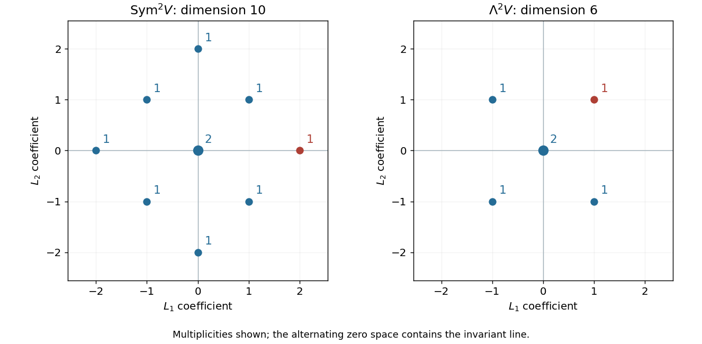

<h1 id="2/iii/solution">Solution</h1>

↑ **Parent:** [Iii](../iii.md)

The printed phrase “not reducible” is a misprint: the requested nonzero complementary submodules establish that this tensor square is reducible. The natural reason is that the flip $\tau(v\otimes w)=w\otimes v$ commutes with the [Lie algebra representation](../../../../../../lie-algebra-representation.md). Its two [eigenspaces](../../../../../../eigenspace.md) are the [symmetric square](../../../../../../symmetric-square.md) and the [exterior square](../../../../../../exterior-square.md), giving

$$
\boxed{V\otimes V=\operatorname{Sym}^2V\oplus\Lambda^2V,\qquad
\dim\operatorname{Sym}^2V=10,\quad\dim\Lambda^2V=6.}
$$

In the [symmetric square](../../../../../../symmetric-square.md), the four [weights](../../../../../../weight-representation-theory.md) $\pm2L_i$ and four [weights](../../../../../../weight-representation-theory.md) $\pm L_1\pm L_2$ each occur once, while zero occurs twice. In the [exterior square](../../../../../../exterior-square.md), the four [weights](../../../../../../weight-representation-theory.md) $\pm L_1\pm L_2$ each occur once and zero occurs twice; the $\pm2L_i$ are absent because repeated wedge factors vanish. These are the two requested complementary [weight diagrams](../../../../../../weight-diagram.md).

**[Figure 7](#2/iii/image-the-complementary-symmetric-and-alternating-tensor-submodules-of-the-defining-sp4-representation). The complementary symmetric and alternating tensor submodules of the defining sp4 representation**.

More precisely, the [tensor-square decomposition of the defining symplectic representation](../../../../../../tensor-square-decomposition-of-the-defining-symplectic-representation.md) identifies $\operatorname{Sym}^2V$ with the irreducible adjoint module $L(2\omega_1)$. The identification is an [intertwiner](../../../../../../intertwiner.md) sending a [symmetric tensor](../../../../../../symmetric-tensor.md) $vw$ to the element of the [symplectic Lie algebra](../../../../../../symplectic-lie-algebra.md) $x\mapsto\omega(v,x)w+\omega(w,x)v$. For the [exterior square](../../../../../../exterior-square.md), [symplectic contraction of an exterior square](../../../../../../symplectic-contraction-of-an-exterior-square.md) has a five-dimensional [kernel](../../../../../../kernel-of-a-linear-map.md), the [primitive exterior square](../../../../../../primitive-exterior-square.md), and the [invariant tensor](../../../../../../invariant-tensor.md) $\Omega=e_1\wedge e_3+e_2\wedge e_4$ supplies a complementary line. Thus the full irreducible decomposition is

$$
\boxed{V\otimes V=L(2\omega_1)\oplus L(\omega_2)\oplus L(0),\qquad
16=10+5+1.}
$$

Here $\omega_1=L_1$ and $\omega_2=L_1+L_2$. The two zero [weights](../../../../../../weight-representation-theory.md) in the [exterior square](../../../../../../exterior-square.md) split into one primitive zero [weight](../../../../../../weight-representation-theory.md) and the invariant line.

## ↑ Ancestors (11)

1. [Iii](../iii.md)
2. [2](../../2.md)
3. [Paper 2](../../../paper-2-split.md)
4. [Iii](../../../split.md)
5. [2005](../../../../split.md)
6. [Past exam of the mathematics course of the University of Cambridge](../../../../../split.md)
7. [Mathematics course of the University of Cambridge](../../../../../../mathematics-course-of-the-university-of-cambridge.md)
8. [Course of the University of Cambridge](../../../../../../course-of-the-university-of-cambridge.md)
9. [University of Cambridge](../../../../../../university-of-cambridge-split.md)
10. [List of universities](../../../../../../list-of-universities.md)
11. [Codex Wiki](../../../../../../split.md)
