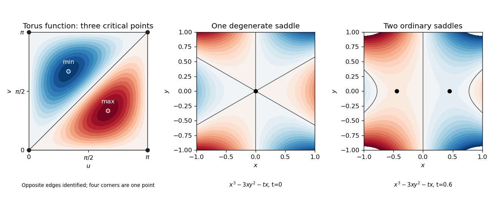

<h1 id="2/solution">Solution</h1>

↑ **Parent:** [2](../2.md)

The usual compact closed-manifold hypothesis is needed for the first assertion, or a proper bounded-below Morse exhaustion in an appropriate noncompact version. As literally printed without any such condition, $f(x)=x$ on $\mathbb R$ is a [Morse function](../../../../../morse-function.md) with no [critical points](../../../../../critical-point.md), while $b_0=1$. We prove the intended closed-manifold statement, which applies to the [surface](../../../../../topological-surface.md) product later in the question.

By the [Morse handle-attachment theorem](../../../../../morse-handle-attachment-theorem.md), crossing an index-$i$ [critical point](../../../../../critical-point.md) attaches an $i$-handle, and no topological change occurs between critical levels. Retraction to the [core disks of handles](../../../../../core-disk-of-a-handle.md) gives a [CW complex](../../../../../cw-complex.md) model with $c_i$ cells in dimension $i$. Its [cellular chain complex](../../../../../cellular-chain-complex.md) has $C_i\cong\mathbb Z^{c_i}$. Tensor with $\mathbb Q$, which computes the ranks $b_i$ of integral [homology](../../../../../homology-split.md). Since [homology](../../../../../homology-split.md) is a quotient of a [vector subspace](../../../../../vector-subspace.md) of $C_i\otimes\mathbb Q$, **$b_i\le c_i$**. This argument has not used the [Morse inequalities](../../../../../morse-inequalities.md).

The strong [Morse inequalities](../../../../../morse-inequalities.md) and top-dimensional equality are

$$
\boxed{\sum_{i=0}^j(-1)^{j-i}c_i\ge\sum_{i=0}^j(-1)^{j-i}b_i\quad(0\le j\le m),\qquad\sum_{i=0}^m(-1)^ic_i=\sum_{i=0}^m(-1)^ib_i.}
$$

Their weak form is $c_i\ge b_i$. To see the algebra behind the strong form, put $r_i=\operatorname{rank}_{\mathbb Q}\partial_i$ in the [Morse chain complex](../../../../../morse-chain-complex.md), with $r_0=r_{m+1}=0$. The kernel-image dimensions give $c_i=b_i+r_i+r_{i+1}$, so the alternating difference at $j$ is exactly $r_{j+1}\ge0$. Conversely, given the strong inequalities, denote those alternating differences by $S_j$, with $S_{-1}=0$. Then $c_j-b_j=S_j+S_{j-1}\ge0$, proving that they imply every weak inequality.

They are **not equivalent as numerical restrictions**. For the [Betti numbers](../../../../../betti-number.md) $b=(1,0,0,1)$ of $S^3$, the formal counts $c=(2,0,0,2)$ satisfy all weak inequalities and the Euler equality, but at $j=1$ give $c_1-c_0=-2<-1=b_1-b_0$. They therefore cannot be the counts of a [Morse function](../../../../../morse-function.md) on $S^3$; the strong inequalities detect that additional obstruction.

If all the strong inequalities are equalities, all $r_i$ vanish and $c_i=b_i$. An integer boundary [matrix](../../../../../matrix.md) with rational rank zero is the zero [matrix](../../../../../matrix.md). Thus the integral complex itself has zero differential, not merely its rationalization. Consequently

$$
\boxed{H_i(M;\mathbb Z)\cong\mathbb Z^{c_i}=\mathbb Z^{b_i}\quad(0\le i\le m),}
$$

and higher [homology](../../../../../homology-split.md) vanishes. In particular there is no [homology](../../../../../homology-split.md) torsion. This is an integral consequence of a [Perfect Morse function](../../../../../perfect-morse-function.md), rather than just an assertion about ranks.

For $\Sigma_g$, the integral [homology](../../../../../homology-split.md) is free with [Betti numbers](../../../../../betti-number.md) $(1,2g,1)$. The [Künneth theorem](../../../../../kunneth-theorem.md) therefore has no torsion terms, and the product's [Poincaré polynomial](../../../../../poincare-polynomial.md) is

$$
(1+2gt+t^2)^2=1+4gt+(4g^2+2)t^2+4gt^3+t^4.
$$

Summing the weak inequalities yields the lower bound

$$
\boxed{\#\operatorname{Crit}(F)\ge4g^2+8g+4=(2g+2)^2\quad\text{for Morse }F.}
$$

Choose a [surface](../../../../../topological-surface.md) [Morse function](../../../../../morse-function.md) $h$ with one minimum, $2g$ saddles and one maximum. It can be built from one [closed disk](../../../../../closed-disc.md), the standard $2g$ [one-handles](../../../../../one-handle.md), and a closing [closed disk](../../../../../closed-disc.md), using the local forms $u^2+v^2$, $-u^2+v^2$, and $-u^2-v^2$ at the [handle](../../../../../handle.md) centres. Regular collars interpolate between the [handles](../../../../../handle.md) without new [critical points](../../../../../critical-point.md). Now set $F(x,y)=h(x)+h(y)$. Its [critical points](../../../../../critical-point.md) are the ordered pairs of those of $h$, and its [Hessian matrix](../../../../../hessian-matrix.md) is a block direct sum; the indices add. This [product of Morse functions](../../../../../product-of-morse-functions.md) has exactly **$(2g+2)^2$ [critical points](../../../../../critical-point.md)** and realizes every displayed Betti count. Small bumps constant near the critical pairs can separate their values without altering the [Hessians](../../../../../hessian-matrix.md) or creating new [critical points](../../../../../critical-point.md).

The same minimum does **not** apply to arbitrary [smooth functions](../../../../../smooth-function.md). Here is an explicit finite-critical-point counterexample, avoiding any assumption that degeneracy leaves the Morse lower bound intact. On $T^2=(\mathbb R/\pi\mathbb Z)^2$, take

$$
h_0(u,v)=\sin u\sin v\sin(u-v).
$$

It is well defined because shifting either coordinate by $\pi$ reverses two of its factors. Its derivatives are $\sin v\sin(2u-v)$ and $\sin u\sin(u-2v)$. If either $\sin u$ or $\sin v$ vanishes, both derivatives vanish only at $(0,0)$. Otherwise $2u-v$ and $u-2v$ must be multiples of $\pi$, giving exactly $(\pi/3,2\pi/3)$ and $(2\pi/3,\pi/3)$ in addition to the origin. At the first point the [Hessian](../../../../../hessian-matrix.md) is $\sqrt3\bigl(\begin{smallmatrix}1&-1/2\\-1/2&1\end{smallmatrix}\bigr)$, positive definite; at the second it is its negative. They are a minimum and maximum. The origin is an isolated degenerate [monkey saddle](../../../../../monkey-saddle.md), with leading term $uv(u-v)$. Thus this [three-critical-point function on a torus](../../../../../three-critical-point-function-on-a-torus.md) has exactly three [critical points](../../../../../critical-point.md).

For $g>1$, perform [connected-sum gluing of functions](../../../../../connected-sum-gluing-of-functions.md) between this [torus](../../../../../torus.md) and a perfect Morse [surface](../../../../../topological-surface.md) of genus $g-1$: delete a small neighbourhood of the [torus](../../../../../torus.md) maximum and of the other [surface](../../../../../topological-surface.md)'s minimum, and join their regular boundary circles by a monotone cylinder. Collar coordinates ensure nonzero differential throughout the neck, so precisely those two [critical points](../../../../../critical-point.md) are lost and none are added. The result on $\Sigma_g$ has $3+[2(g-1)+2]-2=2g+1$ [critical points](../../../../../critical-point.md), retaining the degenerate point. For $g=1$, simply use $h_0$. Calling this [smooth function](../../../../../smooth-function.md) $\widetilde h$ and the earlier perfect [Morse function](../../../../../morse-function.md) $h$, the smooth product $\widetilde h(x)+h(y)$ has

$$
\boxed{(2g+1)(2g+2)<(2g+2)^2}
$$

[critical points](../../../../../critical-point.md). This explicitly proves the negative answer to the unrestricted smooth-minimum question; it does not assert that this smaller illustrative count is sharp.

**[Figure 1](#2/image-the-explicit-three-critical-point-torus-function-and-the-local-merger-of-two-morse-saddles-into-one-degenerate-saddle). The explicit three-critical-point torus function and the local merger of two Morse saddles into one degenerate saddle**.

## ↑ Ancestors (10)

1. [2](../2.md)
2. [Paper 25](../../paper-25-split.md)
3. [Iii](../../split.md)
4. [2005](../../../split.md)
5. [Past exam of the mathematics course of the University of Cambridge](../../../../split.md)
6. [Mathematics course of the University of Cambridge](../../../../../mathematics-course-of-the-university-of-cambridge.md)
7. [Course of the University of Cambridge](../../../../../course-of-the-university-of-cambridge.md)
8. [University of Cambridge](../../../../../university-of-cambridge-split.md)
9. [List of universities](../../../../../list-of-universities.md)
10. [Codex Wiki](../../../../../split.md)
