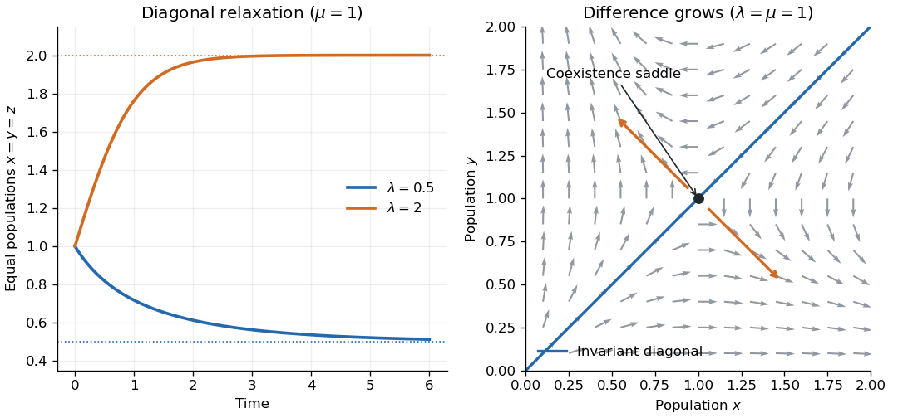

<h1 id="6/solution">Solution</h1>

↑ **Parent:** [6](../6.md)

At the unscaled state $(x,y)$, write the [Lévy kernel of a Markov jump process](../../../../../levy-kernel-of-a-markov-jump-process.md) on jump displacements $z$ as

$$
\boxed{K((x,y),dz)=\lambda x\,\delta_{(1,0)}(dz)
+\frac{\mu xy}{N}\delta_{(-1,0)}(dz)
+\lambda y\,\delta_{(0,1)}(dz)
+\frac{\mu xy}{N}\delta_{(0,-1)}(dz)}.
$$

The destination-kernel convention translates each Dirac mass by $(x,y)$. The total holding rate is the mass of this kernel. At either zero population the corresponding death rates vanish, so no negative states are reached. Births in the total population are bounded by a [Yule process](../../../../../yule-process.md) with per-individual rate $\lambda$, while deaths only decrease it; this also gives nonexplosion.

Put $Z^N=(X/N,Y/N)$. This is a [density-dependent Markov jump process](../../../../../density-dependent-markov-jump-process.md), with jumps of size $1/N$ and rates of order $N$. Its drift gives the deterministic approximation

$$
\boxed{\dot x=\lambda x-\mu xy,\qquad\dot y=\lambda y-\mu xy,\qquad(x(0),y(0))=(1,1)}.
$$

Uniqueness preserves the diagonal $x=y=z$. For positive $\lambda,\mu$, the resulting [logistic differential equation](../../../../../logistic-differential-equation.md) has solution

$$
\boxed{z(t)=\frac{\lambda}{\mu+(\lambda-\mu)e^{-\lambda t}}}.
$$

If $\lambda<\mu$, it decreases from one to $\lambda/\mu$; if $\lambda>\mu$, it increases to that same equilibrium; equality gives the constant solution one. In particular positive rates do not give extinction on this exactly symmetric deterministic trajectory. Transverse perturbations behave differently: subtracting the equations gives $(x-y)'=\lambda(x-y)$, so the positive symmetric equilibrium has an unstable difference direction. The [symmetric competition model](../../../../../symmetric-competition-model.md) distinguishes diagonal logistic relaxation from this symmetry-breaking instability.

**[Figure 1](#6/image-symmetric-population-relaxation-and-transverse-instability). Symmetric population relaxation and transverse instability**.

For an explicit error estimate, use the [martingale decomposition of a density-dependent jump process](../../../../../martingale-decomposition-of-a-density-dependent-jump-process.md):

$$
Z_t^N=(1,1)+\int_0^tF(Z_s^N)ds+M_t^N,
\qquad F(x,y)=(\lambda x-\mu xy,\lambda y-\mu xy).
$$

Fix $t_0,\delta>0$ and choose $R>\sup_{t\le t_0}z(t)+\delta$. Stop at the first exit $\sigma_R$ from the box $[0,R]^2$. On that box, $F$ has Lipschitz constant $L_R=\lambda+2\mu R$ in the [supremum norm](../../../../../supremum-norm.md). Each coordinate of $M^N$ has jumps bounded by $1/N$ and [predictable quadratic variation](../../../../../predictable-quadratic-variation.md) at most

$$
\langle(M^{N,i})^{\sigma_R}\rangle_{t_0}\le\frac{C_Rt_0}{N},\qquad C_R=\lambda R+\mu R^2.
$$

Indeed a coordinate's positive and negative jump rates are $N\lambda x$ and $N\mu xy$, and the squared jump size is $1/N^2$. Independent jump clocks give zero cross-bracket.

The [Bernstein bound for bounded-jump martingales](../../../../../bernstein-bound-for-bounded-jump-martingales.md) gives, for each coordinate,

$$
\mathbb P\left(\sup_{t\le t_0}|M^{N,i}_{t\wedge\sigma_R}|\ge\eta\right)
\le2\exp\left(-\frac{N\eta^2}{2(C_Rt_0+\eta/3)}\right).
$$

The [Gronwall inequality](../../../../../gronwall-inequality.md) applied up to $\sigma_R$ gives

$$
\sup_{t\le t_0\wedge\sigma_R}\|Z_t^N-(z(t),z(t))\|_\infty
\le e^{L_Rt_0}\sup_{t\le t_0}\|M^N_{t\wedge\sigma_R}\|_\infty.
$$

An exit from the box already entails an error larger than $\delta$, by the choice of $R$, so the stopped estimate controls the event of any error on the full interval. Take $\eta=\delta e^{-L_Rt_0}$ and use the [union bound](../../../../../boole-s-inequality.md) on the two coordinates:

$$
\boxed{\mathbb P\left(\sup_{t\le t_0}\|Z_t^N-(z(t),z(t))\|_\infty>\delta\right)
\le\min\left\{1,4\exp\left(-\frac{N\delta^2e^{-2L_Rt_0}}{2(C_Rt_0+\delta e^{-L_Rt_0}/3)}\right)\right\}}.
$$

For fixed time horizon and tolerance this is exponentially small in $N$, proving a [fluid limit](../../../../../fluid-limit.md). The transverse instability explains why this finite-horizon estimate should not be extrapolated to arbitrarily long times without changing its constants.

## ↑ Ancestors (10)

1. [6](../6.md)
2. [Paper 38](../../paper-38-split.md)
3. [Iii](../../split.md)
4. [2005](../../../split.md)
5. [Past exam of the mathematics course of the University of Cambridge](../../../../split.md)
6. [Mathematics course of the University of Cambridge](../../../../../mathematics-course-of-the-university-of-cambridge.md)
7. [Course of the University of Cambridge](../../../../../course-of-the-university-of-cambridge.md)
8. [University of Cambridge](../../../../../university-of-cambridge-split.md)
9. [List of universities](../../../../../list-of-universities.md)
10. [Codex Wiki](../../../../../split.md)
