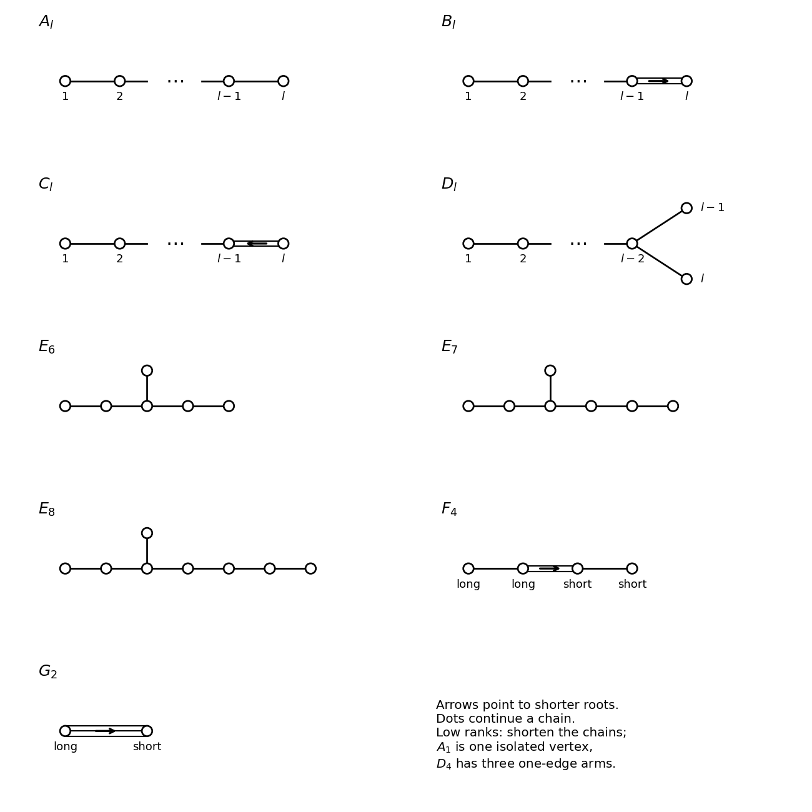

<h1 id="2/iv/solution">Solution</h1>

↑ **Parent:** [Iv](../iv.md)

A [Dynkin diagram](../../../../../../dynkin-diagram.md) has one vertex for each [simple root](../../../../../../simple-root.md). Vertices $i,j$ are joined by $a_{ij}a_{ji}$ bonds, where $a_{ij}$ are the off-diagonal [Cartan integers](../../../../../../cartan-integer.md). No bond means orthogonality; one, two and three bonds mean angles $2\pi/3,3\pi/4,5\pi/6$. A multiple-bond arrow points to the shorter root. Thus the [Dynkin diagram](../../../../../../dynkin-diagram.md) determines the [Cartan matrix](../../../../../../cartan-matrix.md), including the relative lengths inside each connected component.

An [irreducible root system](../../../../../../irreducible-root-system.md) corresponds to a connected [Dynkin diagram](../../../../../../dynkin-diagram.md). The [classification of finite crystallographic Dynkin diagrams](../../../../../../classification-of-finite-crystallographic-dynkin-diagrams.md) gives

$$
\boxed{A_l\ (l\ge1),\ B_l\ (l\ge2),\ C_l\ (l\ge3),\ D_l\ (l\ge4),\ E_6,E_7,E_8,F_4,G_2.}
$$

Here $C_2$ is already represented by $B_2$, and $B_1,C_1$ by $A_1$. General systems are orthogonal direct sums of these, with separate component scales. The following diagrams specify all the types; dots denote a continued chain, not additional vertices.

**[Figure 1](#2/iv/image-finite-irreducible-crystallographic-dynkin-diagrams-with-every-arrow-pointing-toward-the-shorter-root). Finite irreducible crystallographic Dynkin diagrams, with every arrow pointing toward the shorter root**.

For orientation, the [An Dynkin diagram](../../../../../../an-dynkin-diagram.md) is a single chain, the [Bn Dynkin diagram](../../../../../../bn-dynkin-diagram-and-affine-extension.md) has a terminal double bond pointing to its terminal short root, and the [Cn Dynkin diagram](../../../../../../cn-dynkin-diagram.md) reverses that arrow. The [Dn Dynkin diagram](../../../../../../dn-dynkin-diagram.md) has arm lengths $1,1,l-3$. The [En Dynkin diagram](../../../../../../en-dynkin-diagram.md) has arm lengths $1,2,2$; $1,2,3$; or $1,2,4$. The [F4 Dynkin diagram](../../../../../../f4-dynkin-diagram.md) has a central double bond and the [G2 Dynkin diagram](../../../../../../g2-dynkin-diagram.md) a triple bond.

The positivity behind this finite list is the positive-definite Gram matrix of the [simple roots](../../../../../../simple-root.md). In particular the underlying graph is a tree: if it contained a cycle, the sum of its normalized roots would have squared norm at most zero, since each bonded inner product is at most $-1/2$. This contradicts [linear independence](../../../../../../linear-independence.md). Restricting the possible bonds and branches by positive definiteness gives precisely the listed chains and trees. Conversely their [Cartan matrices](../../../../../../cartan-matrix.md) are positive definite after symmetrization and their reflection-generated root sets give the indicated finite [root systems](../../../../../../root-system.md).

## ↑ Ancestors (11)

1. [Iv](../iv.md)
2. [2](../../2.md)
3. [Paper 4](../../../paper-4-split.md)
4. [Iii](../../../split.md)
5. [2005](../../../../split.md)
6. [Past exam of the mathematics course of the University of Cambridge](../../../../../split.md)
7. [Mathematics course of the University of Cambridge](../../../../../../mathematics-course-of-the-university-of-cambridge.md)
8. [Course of the University of Cambridge](../../../../../../course-of-the-university-of-cambridge.md)
9. [University of Cambridge](../../../../../../university-of-cambridge-split.md)
10. [List of universities](../../../../../../list-of-universities.md)
11. [Codex Wiki](../../../../../../split.md)
