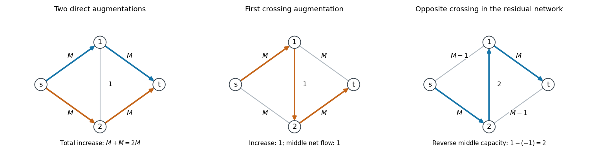

<h1 id="5/solution">Solution</h1>

↑ **Parent:** [5](../5.md)

Label the two intermediate vertices $1,2$. The four outer edges have capacity $M$ and the middle edge has capacity one. The cut separating $s$ from the other vertices has capacity $2M$, and the two paths $s\to1\to t$ and $s\to2\to t$ can each carry $M$. Thus the [maximum flow](../../../../../maximum-flow-problem.md) is $2M$.

A fast run of the [Ford-Fulkerson algorithm](../../../../../ford-fulkerson-algorithm.md) chooses those two direct paths and augments by $M$ on each: it terminates in **two augmentations**. One augmentation cannot suffice, because every initial path has bottleneck at most $M$.

For a run with $M+1$ augmentations, first choose $s\to1\to2\to t$ and augment by one. The middle edge then has net [flow](../../../../../flow.md) $1$ from $1$ to $2$. Its reverse residual capacity is $1-(-1)=2$, not one. Alternate crossing paths, next $s\to2\to1\to t$, then $s\to1\to2\to t$, and so on. Each of the next $M-1$ augmentations has bottleneck two. More explicitly, after $k$ crossing augmentations, $1\leq k\leq M$, the total [flow](../../../../../flow.md) is $2k-1$, and the outer-edge [flow](../../../../../flow.md) totals on the pairs $(s1,2t)$ and $(s2,1t)$ are $k$ and $k-1$ in one order or the other. The middle net [flow](../../../../../flow.md) is $\pm1$. The next opposite crossing path uses the less-loaded outer pair and has reverse-middle capacity two. Until $k=M$, its outer residual capacities are at least two.

After these $M$ augmentations, one outer pair is full and the other has one unit left. One final opposite crossing augmentation of one reaches $2M$. The total amounts are $1$, then $M-1$ copies of $2$, then $1$, giving **exactly $M+1$ augmentations**. For $M=1$ the middle block is empty and this gives two augmentations as well. These are explicit requested path-choice histories. In an undirected network, $M+1$ need not be a bound on every possible history: for $M=2$, choosing the crossing path, the two direct paths, and then the crossing path again gives four successive unit augmentations.

**[Figure 1](#5/image-direct-and-crossing-flow-augmentations-including-reverse-residual-capacity-two-on-the-middle-edge). Direct and crossing flow augmentations, including reverse residual capacity two on the middle edge**.

For a general undirected network, let $y_{ij}=x_{ij}-x_{ji}$ be the antisymmetric net [flow](../../../../../flow.md). Feasibility gives $|y_{ij}|\leq c_{ij}$, so the directed [residual network](../../../../../residual-network.md) has nonnegative capacities $c'_{ij}=c_{ij}-y_{ij}$. For any cut $S$ with $s\in S$, $t\notin S$, conservation at the internal vertices gives

$$
\sum_{i\in S,j\notin S}y_{ij}=f.
$$

Thus its outgoing residual cut capacity is

$$
C'(S)=\sum_{i\in S,j\notin S}(c_{ij}-y_{ij})=C(S)-f.
$$

The subtracted [flow](../../../../../flow.md) value is the same for every cut. Taking the minimum and applying the [max-flow min-cut theorem](../../../../../max-flow-min-cut-theorem.md) to the original and [residual networks](../../../../../residual-network.md) proves the [residual maximum flow is the remaining optimality gap](../../../../../residual-maximum-flow-is-the-remaining-optimality-gap.md) identity

$$
\boxed{f'=f^*-f}.
$$

Suppose now $f'>0$, and let $U$ consist of vertices reachable from $s$ through residual arcs of capacity at least $f'/m$. If $t\notin U$, every outgoing arc from $U$ has capacity strictly below $f'/m$, since its head would otherwise be reachable. At most $m$ original undirected edges cross this cut, and each supplies exactly one outgoing directed arc. Hence $C'(U)<m(f'/m)=f'$, contradicting the residual minimum-cut value $f'$. Therefore $\boxed{t\in U}$, and a [widest augmenting path](../../../../../widest-augmenting-path.md) has bottleneck at least $f'/m$. When $f'=0$, the current [flow](../../../../../flow.md) is already optimal and no such path is needed.

Let $F_k$ be the remaining residual [maximum flow](../../../../../maximum-flow-problem.md) after $k$ augmentations of the modified rule, starting from zero [flow](../../../../../flow.md). Its chosen widest path increases the [flow](../../../../../flow.md) by at least $F_k/m$, so

$$
F_{k+1}\leq\left(1-\frac1m\right)F_k,
\qquad
\boxed{F_k\leq\left(1-\frac1m\right)^k f^*}.
$$

This is the [geometric convergence of widest-path augmentation](../../../../../geometric-convergence-of-widest-path-augmentation.md). For $m\geq2$, $F_k\leq e^{-k/m}f^*$. Starting from zero with [integer](../../../../../integer.md) capacities keeps all [flow](../../../../../flow.md) values and residual optimality gaps [integer](../../../../../integer.md). Thus $k>m\ln f^*$ makes $F_k<1$ and hence $F_k=0$, giving termination in $\boxed{O(m\log f^*)}$ augmentations for $f^*\geq2$. If $f^*=1$, one positive [integer](../../../../../integer.md) augmentation suffices; if $f^*=0$, none is required. A uniform statement is $O(m\log(1+f^*))$. With $m=1$, a nonzero [flow](../../../../../flow.md) is also completed in one augmentation, consistent with the recurrence's zero contraction factor.

## ↑ Ancestors (10)

1. [5](../5.md)
2. [Paper 40](../../paper-40-split.md)
3. [Iii](../../split.md)
4. [2005](../../../split.md)
5. [Past exam of the mathematics course of the University of Cambridge](../../../../split.md)
6. [Mathematics course of the University of Cambridge](../../../../../mathematics-course-of-the-university-of-cambridge.md)
7. [Course of the University of Cambridge](../../../../../course-of-the-university-of-cambridge.md)
8. [University of Cambridge](../../../../../university-of-cambridge-split.md)
9. [List of universities](../../../../../list-of-universities.md)
10. [Codex Wiki](../../../../../split.md)
