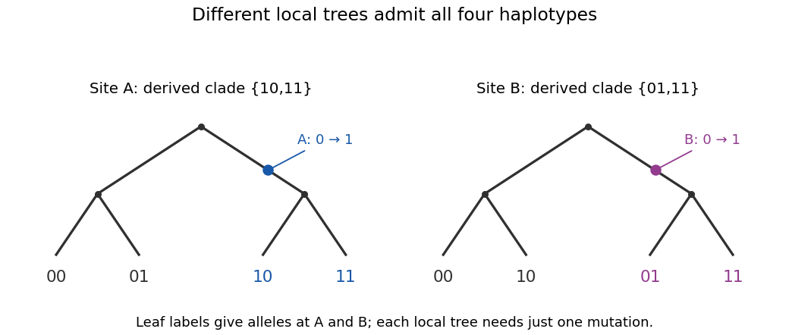

# Paper 45

↑ **Parent:** [Iii](../iii.md)

[https://www.maths.cam.ac.uk/postgrad/part-iii/files/pastpapers/2005/Paper45.pdf](https://www.maths.cam.ac.uk/postgrad/part-iii/files/pastpapers/2005/Paper45.pdf)

**Table of contents**

- [1](#1)
  - [i](#1/i)
    - [Solution](#1/i/solution)
  - [ii](#1/ii)
    - [Solution](#1/ii/solution)
  - [iii](#1/iii)
    - [Solution](#1/iii/solution)
  - [iv](#1/iv)
    - [Solution](#1/iv/solution)
  - [v](#1/v)
    - [Solution](#1/v/solution)
  - [vi](#1/vi)
    - [Solution](#1/vi/solution)
- [2](#2)
  - [a](#2/a)
    - [Solution](#2/a/solution)
  - [b](#2/b)
    - [Solution](#2/b/solution)
  - [c](#2/c)
    - [Solution](#2/c/solution)
  - [d](#2/d)
    - [Solution](#2/d/solution)
- [3](#3)
  - [i](#3/i)
    - [Solution](#3/i/solution)
  - [ii](#3/ii)
    - [Solution](#3/ii/solution)
  - [iii](#3/iii)
    - [Solution](#3/iii/solution)
  - [iv](#3/iv)
    - [Solution](#3/iv/solution)
  - [v](#3/v)
    - [Solution](#3/v/solution)
  - [vi](#3/vi)
    - [Solution](#3/vi/solution)
- [4](#4)
  - [i](#4/i)
    - [Solution](#4/i/solution)
  - [ii](#4/ii)
    - [Solution](#4/ii/solution)
  - [iii](#4/iii)
    - [Solution](#4/iii/solution)
  - [iv](#4/iv)
    - [Solution](#4/iv/solution)
  - [v](#4/v)
    - [Solution](#4/v/solution)

## 1

↑ **Parent:** [Paper 45](paper-45.md)

<h3 id="1/i">i</h3>

↑ **Parent:** [1](#1)

<h4 id="1/i/solution">Solution</h4>

↑ **Parent:** [I](#1/i)

[Parametric linkage analysis](../../../biology.md#parametric-linkage-analysis) specifies a disease-transmission model: the mode of inheritance, disease-[allele](../../../biology.md#allele) frequency and [penetrance](../../../biology.md#penetrance) of each [genotype](../../../biology.md#genotype). Combining these with [Mendelian segregation](../../../biology.md#mendelian-segregation) and the [recombination fraction](../../../biology.md#recombination-fraction) gives a [pedigree likelihood](../../../biology.md#pedigree-likelihood). One can estimate the [recombination fraction](../../../biology.md#recombination-fraction) or compare a linked model, $\theta<1/2$, with the unlinked model, $\theta=1/2$, using a [likelihood-ratio test](../../../statistical-modelling.md#likelihood-ratio-test) or [LOD score](../../../biology.md#lod-score). Incomplete [penetrance](../../../biology.md#penetrance) and unobserved [genotypes](../../../biology.md#genotype) are accommodated by summing over the possible underlying inheritance states.

[Nonparametric linkage analysis](../../../biology.md#nonparametric-linkage-analysis) instead tests whether relatives with the same disease [phenotype](../../../biology.md#phenotype) share marker [alleles](../../../biology.md#allele) [identical by descent](../../../biology.md#identity-by-descent) more often than expected from their [pedigree](../../../biology.md#pedigree). For example, [affected-sib-pair analysis](../../../biology.md#affected-sib-pair-analysis) compares sharing among affected [full siblings](../../../biology.md#full-sibling) with its Mendelian null distribution. It avoids specifying a complete disease-[penetrance](../../../biology.md#penetrance) model and disease-[allele](../../../biology.md#allele) frequency. “Model-free” still assumes an inheritance model for the marker, correct family relationships and a justified treatment of [genetic-study ascertainment](../../../biology.md#genetic-study-ascertainment); it does not [mean](../../../probability-theory.md#expected-value) assumption-free.

**Parametric analysis models the disease [likelihood](../../../statistical-modelling.md#likelihood-function); nonparametric analysis tests departure from the marker's Mendelian sharing distribution.**

<h3 id="1/ii">ii</h3>

↑ **Parent:** [1](#1)

<h4 id="1/ii/solution">Solution</h4>

↑ **Parent:** [Ii](#1/ii)

Label the two paternal ancestral marker copies $P_1,P_2$ and the two maternal copies $M_1,M_2$. Treat these as four distinct ancestral copies in an [outbred pedigree](../../../biology.md#outbred-pedigree); equal observed [alleles](../../../biology.md#allele) need not imply [identity by descent](../../../biology.md#identity-by-descent). By [Mendelian segregation](../../../biology.md#mendelian-segregation), each child independently receives either paternal copy with [probability](../../../probability-theory.md#probability) $1/2$. Thus the indicator $I_P$ that the two [full siblings](../../../biology.md#full-sibling) inherit the same paternal copy satisfies

$$
P(I_P=1)=P(P_1,P_1)+P(P_2,P_2)=\frac14+\frac14=\frac12.
$$

The same argument gives $P(I_M=1)=1/2$ for the maternal copy. Paternal and maternal [meioses](../../../biology.md#meiosis) are independent, so $I_P$ and $I_M$ are independent. Consequently the number $J=I_P+I_M$ of copies shared [identical by descent](../../../biology.md#identity-by-descent) has a [binomial distribution](../../../discrete-probability-distribution.md#binomial-distribution), giving

$$
\boxed{P(J=0)=\frac14,\qquad P(J=1)=\frac12,\qquad P(J=2)=\frac14.}
$$

This is [Mendelian IBD sharing of full siblings](../../../biology.md#mendelian-ibd-sharing-of-full-siblings). It describes an ordinary, unselected sib pair: conditioning on a shared disease [phenotype](../../../biology.md#phenotype) can change the distribution if there is [genetic linkage](../../../biology.md#genetic-linkage) to its causal locus.

<h3 id="1/iii">iii</h3>

↑ **Parent:** [1](#1)

<h4 id="1/iii/solution">Solution</h4>

↑ **Parent:** [Iii](#1/iii)

For the Mendelian [identity by descent](../../../biology.md#identity-by-descent) count $J$, the expected shared proportion is

$$
\boxed{E\!\left[\frac J2\right]=\frac12\left(0\cdot\frac14+1\cdot\frac12+2\cdot\frac14\right)=\frac12.}
$$

The corresponding expected number of shared copies is one. These are different scales for the same [random variable](../../../random-variable.md).

With [genetic linkage](../../../biology.md#genetic-linkage) to a disease locus, selecting two affected [full siblings](../../../biology.md#full-sibling) preferentially selects transmissions of disease-associated ancestral copies. A nearby [genetic marker](../../../biology.md#genetic-marker) may then show excess [identity by descent](../../../biology.md#identity-by-descent): the expected shared proportion can exceed $1/2$, which is the basis of [affected-sib-pair analysis](../../../biology.md#affected-sib-pair-analysis). The precise distortion depends on [penetrance](../../../biology.md#penetrance), inheritance and the [recombination fraction](../../../biology.md#recombination-fraction); disease status alone does not prescribe a universal alternative distribution. In the fully penetrant recessive model derived below, setting $s=2\theta(1-\theta)$ gives

$$
P(J=0,1,2\mid\text{both affected})=\bigl(s^2,\,2s(1-s),\,(1-s)^2\bigr),\qquad E[J/2\mid\text{both affected}]=1-s.
$$

Thus the expected shared proportion rises from $1/2$ at $\theta=1/2$ to one at [complete genetic linkage](../../../biology.md#complete-genetic-linkage), $\theta=0$.

<h3 id="1/iv">iv</h3>

↑ **Parent:** [1](#1)

<h4 id="1/iv/solution">Solution</h4>

↑ **Parent:** [Iv](#1/iv)

Let $a$ denote the disease [allele](../../../biology.md#allele). Complete [penetrance](../../../biology.md#penetrance) with [recessive inheritance](../../../biology.md#recessive-inheritance) makes each affected child $aa$. The unaffected parents must therefore both be $Aa$ [genetic carriers](../../../biology.md#genetic-carrier). Condition on these parental [genotypes](../../../biology.md#genotype) and the fully informative marker; the distinct paternal and maternal marker copies identify which parent's copies are shared. Average over the two equally likely marker-disease [haplotype](../../../biology.md#haplotype) phases in each parent. This is the phase-symmetric model implicit in the requested [pedigree likelihood](../../../biology.md#pedigree-likelihood) identities.

For one parent, suppose first that both children receive the same marker copy. If that marker copy is on the parental [chromosome](../../../biology.md#chromosome) carrying $a$, both children receive $a$ with [probability](../../../probability-theory.md#probability) $(1-\theta)^2$; in the opposite phase the [probability](../../../probability-theory.md#probability) is $\theta^2$. The phase-averaged [probability](../../../probability-theory.md#probability) is

$$
v=\frac{(1-\theta)^2+\theta^2}{2}=\frac12-\theta(1-\theta).
$$

If the children receive different marker copies, one disease-[allele](../../../biology.md#allele) transmission is recombinant and the other is nonrecombinant in either phase. The [probability](../../../probability-theory.md#probability) that both receive $a$ is therefore

$$
u=\theta(1-\theta).
$$

Paternal and maternal transmissions are independent. Sharing zero marker copies means the different-copy case for both parents; sharing two means the same-copy case for both; sharing one means one of each. Thus the [recessive affected-sib-pair likelihood](../../../biology.md#recessive-affected-sib-pair-likelihood) is

$$
\boxed{\begin{aligned}
L_0&=\theta^2(1-\theta)^2=u^2,\\
L_1&=\frac{\theta(1-\theta)}2\bigl[(1-\theta)^2+\theta^2\bigr]=uv,\\
L_2&=\frac14\bigl[(1-\theta)^2+\theta^2\bigr]^2=v^2.
\end{aligned}}
$$

Here $L_j$ is the [probability](../../../probability-theory.md#probability) that both children are affected conditional on the marker sharing state $J=j$, not the [probability](../../../probability-theory.md#probability) of $J=j$ conditional on their being affected. Since $u,v\ge0$,

$$
\boxed{\sqrt{L_0L_2}=uv=L_1,\qquad \sqrt{L_0}+\sqrt{L_2}=u+v=\frac12.}
$$

At $\theta=1/2$, all three conditional disease [probabilities](../../../probability-theory.md#probability) equal $1/16$, as expected from two independent children of an $Aa\times Aa$ mating. At $\theta=0$, only the two-copy-sharing state can produce two affected children. Phase weights other than $1/2$ would require a different [likelihood function](../../../statistical-modelling.md#likelihood-function) and need not obey these identities.

<h3 id="1/v">v</h3>

↑ **Parent:** [1](#1)

<h4 id="1/v/solution">Solution</h4>

↑ **Parent:** [V](#1/v)

Take the affected sib pairs from independent families with the same disease model. Conditional on their marker sharing states, multiply the [recessive affected-sib-pair likelihoods](../../../biology.md#recessive-affected-sib-pair-likelihood):

$$
\mathcal L(\theta)=L_0^{n_0}L_1^{n_1}L_2^{n_2}.
$$

Write $x=\sqrt{L_0}=\theta(1-\theta)$, so that $\sqrt{L_2}=1/2-x$ and $L_1=x(1/2-x)$. Consequently

$$
\boxed{\mathcal L(\theta)=x^{\,2n_0+n_1}\left(\frac12-x\right)^{2n_2+n_1},\qquad 0\le x\le\frac14.}
$$

For an unordered count sample there can also be a [multinomial likelihood](../../../discrete-probability-distribution.md#multinomial-likelihood) coefficient, and the Mendelian [probabilities](../../../probability-theory.md#probability) of the observed marker sharing states supply further factors. All these factors are independent of $\theta$.

If [genetic-study ascertainment](../../../biology.md#genetic-study-ascertainment) explicitly conditions on both children being affected, the normalizing disease [probability](../../../probability-theory.md#probability) is constant:

$$
P(\text{both affected})=\frac14L_0+\frac12L_1+\frac14L_2=\frac{(x+1/2-x)^2}{4}=\frac1{16}.
$$

Thus the conditional sharing [likelihood](../../../statistical-modelling.md#likelihood-function) differs from the displayed [likelihood function](../../../statistical-modelling.md#likelihood-function) only by factors independent of the [recombination fraction](../../../biology.md#recombination-fraction). Multiple pairs drawn from the same larger sibship would not, in general, justify treating these pair [likelihoods](../../../statistical-modelling.md#likelihood-function) as independent.

<h3 id="1/vi">vi</h3>

↑ **Parent:** [1](#1)

<h4 id="1/vi/solution">Solution</h4>

↑ **Parent:** [Vi](#1/vi)

Put $N=n_0+n_1+n_2$ and $s=2x=2\theta(1-\theta)$. The usual [recombination fraction](../../../biology.md#recombination-fraction) range $0\le\theta\le1/2$ gives $0\le s\le1/2$, and the preceding [likelihood function](../../../statistical-modelling.md#likelihood-function) becomes

$$
\boxed{\mathcal L(s)\propto s^{\,2n_0+n_1}(1-s)^{\,2n_2+n_1}.}
$$

To see its relation to [nonparametric linkage analysis](../../../biology.md#nonparametric-linkage-analysis), use [Bayes' theorem](../../../probability-theory.md#bayes-theorem) and the constant disease [probability](../../../probability-theory.md#probability) $1/16$ to obtain the affected-pair marker-sharing [probabilities](../../../probability-theory.md#probability)

$$
(z_0,z_1,z_2)=\left(\frac{L_0/4}{1/16},\frac{L_1/2}{1/16},\frac{L_2/4}{1/16}\right)=\bigl(s^2,\,2s(1-s),\,(1-s)^2\bigr).
$$

Their [multinomial likelihood](../../../discrete-probability-distribution.md#multinomial-likelihood) has exactly the same $s$-dependent kernel, since its extra factor $2^{n_1}$ is constant. Set $A=2n_0+n_1$ and $B=2n_2+n_1$. Then $A+B=2N$, and $B$ is the total number of shared ancestral copies. At fixed $N$, the [Fisher-Neyman factorization theorem](../../../probability-and-statistics.md#fisher-neyman-factorization-theorem) makes $B$ a [sufficient statistic](../../../probability-and-statistics.md#sufficient-statistic). The observed [mean](../../../probability-theory.md#expected-value) shared proportion is $\widehat p=B/(2N)$, and the [binomial likelihood](../../../discrete-probability-distribution.md#binomial-likelihood) kernel gives

$$
\boxed{\widehat s=\min\!\left(\frac A{2N},\frac12\right),\qquad \widehat\theta=\frac{1-\sqrt{1-2\widehat s}}2.}
$$

The unlinked null is $s=1/2$, whereas linkage corresponds to $s<1/2$, or expected shared proportion $1-s>1/2$. If $\widehat p\le1/2$, the constrained [likelihood](../../../statistical-modelling.md#likelihood-function) is maximized at the unlinked null. For $\widehat p>1/2$, its log [likelihood](../../../statistical-modelling.md#likelihood-function) ratio is

$$
2N\left\{\widehat p\log(2\widehat p)+(1-\widehat p)\log\bigl(2(1-\widehat p)\bigr)\right\},
$$

whose derivative in $\widehat p$ is $2N\log[\widehat p/(1-\widehat p)]>0$. Hence it orders samples exactly by excess [IBD](../../../biology.md#identity-by-descent) sharing. **Under this fully penetrant recessive model, parametric linkage testing and a one-sided test of the overall IBD-sharing proportion use the same information.** This is [allele-sharing sufficiency for recessive linkage](../../../biology.md#allele-sharing-sufficiency-for-recessive-linkage), not a general equivalence for all disease models. Use limiting values for terms such as $0\log0$, and assume $N>0$ for the estimators.

## 2

↑ **Parent:** [Paper 45](paper-45.md)

<h3 id="2/a">a</h3>

↑ **Parent:** [2](#2)

<h4 id="2/a/solution">Solution</h4>

↑ **Parent:** [A](#2/a)

The [kinship coefficient](../../../biology.md#kinship-coefficient) $\phi_{XY}$ is the [probability](../../../probability-theory.md#probability) that a randomly selected [allele](../../../biology.md#allele) copy from individual $X$ and an independently selected copy from individual $Y$ at the same [genetic locus](../../../biology.md#genetic-locus) are [identical by descent](../../../biology.md#identity-by-descent). The sampling is of gene copies, not of whole [genotypes](../../../biology.md#genotype). For a noninbred individual $X$, sampling its two copies with replacement gives $\phi_{XX}=1/2$; in general $\phi_{XX}=(1+F_X)/2$, where $F_X$ is its [inbreeding coefficient](../../../biology.md#inbreeding-coefficient).

For two [full siblings](../../../biology.md#full-sibling) in an [outbred pedigree](../../../biology.md#outbred-pedigree), the two sampled copies are both paternal with [probability](../../../probability-theory.md#probability) $1/4$, both maternal with [probability](../../../probability-theory.md#probability) $1/4$, and of different parental origin with [probability](../../../probability-theory.md#probability) $1/2$. Given that both are paternal, their independent [Mendelian segregation](../../../biology.md#mendelian-segregation) transmissions select the same paternal ancestral copy with [probability](../../../probability-theory.md#probability) $1/2$; likewise for both maternal. The different-parent case cannot be [identical by descent](../../../biology.md#identity-by-descent) when the parents are unrelated. Therefore

$$
\boxed{\phi_{\mathrm{sib}}=\frac14\cdot\frac12+\frac14\cdot\frac12+\frac12\cdot0=\frac14.}
$$

Equivalently, conditional on an IBD-sharing count $J$, the chance that the two random copies match is $J/4$, so $\phi_{\mathrm{sib}}=E[J]/4=1/4$. The expected shared proportion $E[J/2]=1/2$ and the usual additive relationship coefficient $2\phi=1/2$ are twice this [kinship coefficient](../../../biology.md#kinship-coefficient); confusing these conventions would double the subsequent [inbreeding coefficient](../../../biology.md#inbreeding-coefficient).

<h3 id="2/b">b</h3>

↑ **Parent:** [2](#2)

<h4 id="2/b/solution">Solution</h4>

↑ **Parent:** [B](#2/b)

Let the [first cousins](../../../biology.md#first-cousin) be $X,Y$, with parents $(P,U)$ and $(Q,V)$ respectively, where $P,Q$ are [full siblings](../../../biology.md#full-sibling) and $U,V$ have no ancestral relationship to one another or to that sibling family. To compute $\phi_{XY}$, choose one [allele](../../../biology.md#allele) copy from each cousin. They originate from $P$ and $Q$ with [probability](../../../probability-theory.md#probability) $1/4$. All other parental combinations have zero [kinship coefficient](../../../biology.md#kinship-coefficient) under the otherwise [outbred pedigree](../../../biology.md#outbred-pedigree) assumption. Hence

$$
\phi_{XY}=\frac14\phi_{PQ}=\frac14\cdot\frac14=\frac1{16}.
$$

The two gene copies within a child of $X,Y$ are random transmissions from these parents. They are [identical by descent](../../../biology.md#identity-by-descent) precisely in the event defining parental kinship, so the child's [inbreeding coefficient](../../../biology.md#inbreeding-coefficient) is

$$
\boxed{F_{\mathrm{child}}=\phi_{XY}=\frac1{16}.}
$$

For a direct ancestral-path check, there are two shared noninbred grandparents. Through either grandparent, the two cousin-to-grandparent paths have two [meioses](../../../biology.md#meiosis) each, and matching the ancestral grandparental copy supplies a further factor $1/2$. Each contributes $2^{-2-2-1}=1/32$, giving the same [first-cousin inbreeding coefficient](../../../biology.md#first-cousin-inbreeding-coefficient). Additional ancestral relationships or inbred grandparents would change the result.

<h3 id="2/c">c</h3>

↑ **Parent:** [2](#2)

<h4 id="2/c/solution">Solution</h4>

↑ **Parent:** [C](#2/c)

Assume a single disease [allele](../../../biology.md#allele) $a$, complete [penetrance](../../../biology.md#penetrance) of $aa$, no disease in $Aa$ or $AA$, and [Hardy-Weinberg equilibrium](../../../biology.md#hardy-weinberg-principle) in the outbred population. If its population frequency is $q$, the disease prevalence is $q^2=10^{-6}$, so $q=10^{-3}$.

For a child with [inbreeding coefficient](../../../biology.md#inbreeding-coefficient) $F$, the two inherited copies are [identical by descent](../../../biology.md#identity-by-descent) with [probability](../../../probability-theory.md#probability) $F$. In that component there is just one ancestral [allele](../../../biology.md#allele) draw, and it is $a$ with [probability](../../../probability-theory.md#probability) $q$. In the remaining component there are two independent ancestral draws, with [probability](../../../probability-theory.md#probability) $q^2$ of $aa$. Thus the [inbreeding genotype frequencies](../../../biology.md#inbreeding-genotype-frequencies) give

$$
P(aa)=Fq+(1-F)q^2=q^2+Fq(1-q).
$$

Using the [first-cousin inbreeding coefficient](../../../biology.md#first-cousin-inbreeding-coefficient) $F=1/16$, the disease-risk ratio is

$$
\boxed{\frac{P(aa)}{q^2}=1+\frac{F(1-q)}q=1+\frac{999}{16}=63.4375\simeq63.4.}
$$

The absolute risk in this model is $6.34375\times10^{-5}$. This calculation averages over the parental [genotypes](../../../biology.md#genotype) in first-cousin marriages before observing an affected child. It is not the risk conditional on both parents being known [genetic carriers](../../../biology.md#genetic-carrier), and assumes the specified cousin relationship is independent of disease status rather than conditioning on a selected disease [pedigree](../../../biology.md#pedigree).

<h3 id="2/d">d</h3>

↑ **Parent:** [2](#2)

<h4 id="2/d/solution">Solution</h4>

↑ **Parent:** [D](#2/d)

Assume the parents are unaffected, the disease has complete [penetrance](../../../biology.md#penetrance) with a single recessive causal [allele](../../../biology.md#allele), and there are no phenocopies, new disease [mutations](../../../biology.md#mutation) or alternative causal loci. An affected first child has [genotype](../../../biology.md#genotype) $aa$, so each unaffected parent must be a [heterozygote](../../../biology.md#heterozygote) $Aa$. Conditional on these parental [genotypes](../../../biology.md#genotype), [Mendelian segregation](../../../biology.md#mendelian-segregation) in the second child's paternal and maternal [meioses](../../../biology.md#meiosis) is independent of the transmissions to the first child. Therefore

$$
\boxed{P(\text{second affected}\mid\text{first affected, parents unaffected})=\frac12\cdot\frac12=\frac14.}
$$

**This is the same sibling recurrence risk as for unrelated, unaffected parents under the same recessive model.** Parental kinship increases the [prior](../../../statistical-inference.md#prior-probability) [probability](../../../probability-theory.md#probability) that both parents carry the same rare disease [allele](../../../biology.md#allele); after both are identified as carriers, it does not alter their Mendelian transmission [probabilities](../../../probability-theory.md#probability). The factor $63.4$ from the preceding part is therefore not an additional multiplier on the [sibling recurrence risk](../../../biology.md#sibling-recurrence-risk).

If unaffected parents are not explicitly required, the rare-disease assumption is an approximation supporting the usual carrier-by-carrier calculation, rather than a logically exact consequence of an affected child alone. Under complete [penetrance](../../../biology.md#penetrance), the compatible parental matings are $Aa\times Aa$, $Aa\times aa$ and $aa\times aa$, with second-child risks $1/4,1/2,1$ respectively. Let their [prior](../../../statistical-inference.md#prior-probability) [probabilities](../../../probability-theory.md#probability) be $w_{11},w_{12},w_{22}$, including both orders in $w_{12}$. Conditioning on the affected first child gives

$$
P(\text{second affected}\mid\text{first affected})=\frac{w_{11}/16+w_{12}/4+w_{22}}{w_{11}/4+w_{12}/2+w_{22}}.
$$

Without negligible or excluded affected-parent matings, this mixture need not equal $1/4$ and may depend on consanguinity. Likewise incomplete [penetrance](../../../biology.md#penetrance) or disease heterogeneity invalidates the assertion that an affected child of unaffected parents necessarily identifies an $Aa\times Aa$ mating. The stated $1/4$ answer uses the unaffected-parent, fully penetrant single-locus assumptions.

## 3

↑ **Parent:** [Paper 45](paper-45.md)

<h3 id="3/i">i</h3>

↑ **Parent:** [3](#3)

<h4 id="3/i/solution">Solution</h4>

↑ **Parent:** [I](#3/i)

Use standard diploid coalescent time units of $2N_e$ generations, where $N_e$ is the fixed [effective population size](../../../biology.md#effective-population-size), and take $n\ge2$. In the neutral [Kingman's coalescent](../../../markov-process.md#kingman-s-coalescent), each unordered pair of ancestral lineages merges at rate one. With $j$ lineages, the next coalescence time therefore has an [exponential distribution](../../../continuous-probability-distribution.md#exponential-distribution) with rate

$$
\lambda_j=\binom j2=\frac{j(j-1)}2,\qquad E[T_j]=\frac{2}{j(j-1)}.
$$

The memoryless construction and the [Markov property](../../../markov-process.md#markov-property) make these epoch durations independent. During epoch $j$ there are $j$ branches, each of duration $T_j$, so the [total branch length of a neutral coalescent](../../../markov-process.md#total-branch-length-of-a-neutral-coalescent) is

$$
L=\sum_{j=2}^n jT_j.
$$

By linearity of [expectation](../../../probability-theory.md#expected-value),

$$
\boxed{E[L]=\sum_{j=2}^n\frac{2}{j-1}=2\sum_{i=1}^{n-1}\frac1i=2a_n,\qquad a_n=\sum_{i=1}^{n-1}\frac1i.}
$$

The ancestral branch above the sample's most recent common ancestor is excluded: [mutations](../../../biology.md#mutation) there would be shared by all sampled [chromosomes](../../../biology.md#chromosome) and would not create [segregating sites](../../../biology.md#segregating-site).

<h3 id="3/ii">ii</h3>

↑ **Parent:** [3](#3)

<h4 id="3/ii/solution">Solution</h4>

↑ **Parent:** [Ii](#3/ii)

Let $\mu$ be the [mutation](../../../biology.md#mutation) rate per chromosomal segment per generation, and use the population-scaled parameter $\theta=4N_e\mu$. In $2N_e$-generation coalescent units, [mutations](../../../biology.md#mutation) occur on each ancestral lineage at rate $\theta/2$. Independent [mutations](../../../biology.md#mutation) on all branches of a given [phylogenetic tree](../../../biology.md#phylogenetic-tree) superpose to give a [Poisson distribution](../../../discrete-probability-distribution.md#poisson-distribution) with [mean](../../../probability-theory.md#expected-value) $\theta L/2$.

Under the [infinite sites mutation model](../../../biology.md#infinite-sites-mutation-model), each [mutation](../../../biology.md#mutation) occurs at a distinct position, and every [mutation](../../../biology.md#mutation) below the sample's common ancestor separates a nonempty proper subset of sampled [chromosomes](../../../biology.md#chromosome) from the remainder. Thus the [mutation](../../../biology.md#mutation) count is exactly the [segregating site](../../../biology.md#segregating-site) count, giving

$$
\boxed{S\mid L,\theta\sim\operatorname{Poisson}\!\left(\frac{\theta L}{2}\right).}
$$

By the [law of total expectation](../../../measure-theory.md#law-of-total-expectation) and the previous branch-length formula,

$$
\boxed{E[S\mid\theta]=E\!\left[\frac{\theta L}{2}\right]=\theta a_n.}
$$

This also gives the [Watterson estimator](../../../biology.md#watterson-estimator) $S/a_n$ as an unbiased moment estimator of $\theta$. Here all sample [segregating sites](../../../biology.md#segregating-site) are counted, including singletons; filtering sites by a minimum sample frequency or by external [SNP](../../../biology.md#single-nucleotide-polymorphism) discovery would introduce [genetic-study ascertainment](../../../biology.md#genetic-study-ascertainment) and change this calculation.

<h3 id="3/iii">iii</h3>

↑ **Parent:** [3](#3)

<h4 id="3/iii/solution">Solution</h4>

↑ **Parent:** [Iii](#3/iii)

Let $t=(t_2,\ldots,t_n)$, with all $t_j>0$, and put $L(t)=\sum_{j=2}^n jt_j$. The independent exponential epoch times have joint density

$$
q(t)=\prod_{j=2}^n\lambda_j e^{-\lambda_jt_j},\qquad \lambda_j=\binom j2.
$$

Take a proper [prior distribution](../../../statistical-inference.md#prior-probability) density $\pi(\theta)$ on $\theta\ge0$, independent of the neutral genealogy. [Independence](../../../random-variable.md#independent-random-variables) is appropriate because the specified neutral [Kingman's coalescent](../../../markov-process.md#kingman-s-coalescent) does not depend on the [mutation](../../../biology.md#mutation) parameter. The conditional observed-count [likelihood function](../../../statistical-modelling.md#likelihood-function) is

$$
a_k(\theta,t)=P(S=k\mid\theta,t)=\frac{e^{-\theta L(t)/2}[\theta L(t)/2]^k}{k!}.
$$

Its [prior](../../../statistical-inference.md#prior-probability) predictive [probability](../../../probability-theory.md#probability), or [Bayesian model evidence](../../../statistical-inference.md#bayesian-model-evidence), is

$$
m_k=\int_0^\infty\!\int_{(0,\infty)^{n-1}}\pi(\theta)q(t)a_k(\theta,t)\,dt\,d\theta.
$$

Assuming $m_k>0$, [Bayes' theorem](../../../probability-theory.md#bayes-theorem) gives the [joint posterior of mutation rate and coalescent times](../../../probability-and-statistics.md#joint-posterior-of-mutation-rate-and-coalescent-times):

$$
\boxed{f(\theta,t\mid S=k)=\frac{\pi(\theta)}{m_k k!}\prod_{j=2}^n\lambda_j e^{-\lambda_jt_j}\,e^{-\theta L(t)/2}\left[\frac{\theta L(t)}2\right]^k.}
$$

It is zero outside the [prior](../../../statistical-inference.md#prior-probability) support and positive-time region. For $k=0$, use the usual convention $0^0=1$ in the Poisson mass. An improper [prior](../../../statistical-inference.md#prior-probability) cannot be sampled as the proposal in the following algorithm, even in cases where its formal [posterior](../../../statistical-inference.md#bayesian-posterior) can be normalized.

<h3 id="3/iv">iv</h3>

↑ **Parent:** [3](#3)

<h4 id="3/iv/solution">Solution</h4>

↑ **Parent:** [Iv](#3/iv)

Use the joint [prior](../../../statistical-inference.md#prior-probability) density $g(\theta,t)=\pi(\theta)q(t)$ as the proposal for [rejection sampling](../../../probability-and-statistics.md#rejection-sampling). Since the Poisson [probability](../../../probability-theory.md#probability) $a_k(\theta,t)$ lies in $[0,1]$, the following algorithm is valid:

- Draw $\theta$ from the proper [prior distribution](../../../statistical-inference.md#prior-probability) $\pi$.
- Independently draw $T_j$ from the [exponential distributions](../../../continuous-probability-distribution.md#exponential-distribution) with rates $\binom j2$, for $j=2,\ldots,n$, and calculate $L=\sum jT_j$.
- Draw $U$ uniformly on $[0,1]$, independently of all previous draws. Retain $(\theta,T)$ if $U\le e^{-\theta L/2}(\theta L/2)^k/k!$; otherwise restart.

The joint density of a proposed pair together with its acceptance event is $g(\theta,t)a_k(\theta,t)$. Its integral is $m_k$, so conditioning on acceptance gives precisely $g a_k/m_k$, the desired [posterior density](../../../statistical-inference.md#posterior-density). Repeating independent proposal trials until each acceptance produces independent [posterior](../../../statistical-inference.md#bayesian-posterior) observations. This is [Bayesian rejection sampling for a segregating-site count](../../../probability-and-statistics.md#bayesian-rejection-sampling-for-a-segregating-site-count).

An equivalent implementation simulates $S^*\sim\operatorname{Poisson}(\theta L/2)$ and accepts exactly when $S^*=k$. Its acceptance [probability](../../../probability-theory.md#probability) is the same Poisson mass. **Propose from the joint [prior](../../../statistical-inference.md#prior-probability) and accept according to the exact observed-count [likelihood](../../../statistical-modelling.md#likelihood-function).** No approximation to the [posterior distribution](../../../statistical-inference.md#bayesian-posterior) is involved in the accepted draws.

<h3 id="3/v">v</h3>

↑ **Parent:** [3](#3)

<h4 id="3/v/solution">Solution</h4>

↑ **Parent:** [V](#3/v)

Integrating the acceptance [probability](../../../probability-theory.md#probability) over the joint-prior proposal gives

$$
\boxed{\alpha=E_g[a_k(\theta,T)]=m_k=P_{\mathrm{prior}}(S=k).}
$$

The [mean](../../../probability-theory.md#expected-value) number of independent proposal trials per acceptance is $1/m_k$, by the [geometric distribution](../../../discrete-probability-distribution.md#geometric-distribution). To make the acceptance rate explicit for an arbitrary specified [prior](../../../statistical-inference.md#prior-probability), define the [segregating-site likelihood under the neutral coalescent](../../../biology.md#segregating-site-likelihood-under-the-neutral-coalescent) by $\ell_k(\theta)=E_T[a_k(\theta,T)]$. Then

$$
m_k=\int_0^\infty\pi(\theta)\ell_k(\theta)\,d\theta,\qquad \sum_{k\ge0}\ell_k(\theta)z^k=\prod_{i=1}^{n-1}\frac{i}{i+\theta(1-z)}.
$$

For the last identity, $W=L/2$ is the sum of independent exponential variables with rates $1,\ldots,n-1$; combine their Laplace transforms with the conditional Poisson [probability generating function](../../../probability-theory.md#probability-generating-function). If an explicit mass is wanted, $W$ also has density $(n-1)e^{-w}(1-e^{-w})^{n-2}$: it is the maximum of $n-1$ independent unit exponential variables, whose successive spacings have exactly these exponential rates. Expanding $(1-e^{-w})^{n-2}$ and integrating the Poisson mass gives

$$
\ell_k(\theta)=(n-1)\theta^k\sum_{r=0}^{n-2}\frac{(-1)^r\binom{n-2}{r}}{(\theta+r+1)^{k+1}}.
$$

Use $\theta^0=1$ for $k=0$. The positive integral or generating-function expression may be numerically preferable to this alternating sum.

A sharper rejection envelope improves the algorithm without changing its proposal. For $k>0$, maximize the Poisson mass over $\lambda=\theta L/2$:

$$
\frac{d}{d\lambda}\log\!\left(\frac{e^{-\lambda}\lambda^k}{k!}\right)=-1+\frac{k}{\lambda}.
$$

It increases until $\lambda=k$ and decreases afterwards, so its maximum is $M_k=e^{-k}k^k/k!$. For $k=0$, the maximum is $M_0=1$. Replace the acceptance rule by $U\le a_k(\theta,T)/M_k$. This is bounded by one, and its accepted density is unchanged because the factor $1/M_k$ cancels on normalization. Thus

$$
\boxed{\alpha_{\mathrm{improved}}=\frac{m_k}{M_k},\qquad M_k=\frac{e^{-k}k^k}{k!}\ (k>0),\quad M_0=1.}
$$

For $k>0$ it is strictly more efficient, with improvement factor $1/M_k\sim\sqrt{2\pi k}$ by [Stirling's formula](../../../real-analysis.md#stirling-formula). For $k=0$ this envelope improvement gives no increase. Evaluating the Poisson mass and using a uniform draw also avoids generating a Poisson count only to discard it. A proposal concentrated near the [posterior](../../../statistical-inference.md#bayesian-posterior) can improve efficiency further, but then its density and a valid rejection bound must be included.

<h3 id="3/vi">vi</h3>

↑ **Parent:** [3](#3)

<h4 id="3/vi/solution">Solution</h4>

↑ **Parent:** [Vi](#3/vi)

The accepted values $\theta^{(1)},\ldots,\theta^{(R)}$ have marginal [posterior density](../../../statistical-inference.md#posterior-density)

$$
h(\theta\mid k)=\int f(\theta,t\mid k)\,dt=\frac{\pi(\theta)\ell_k(\theta)}{m_k}.
$$

Estimate this one-dimensional density by a [histogram](../../../probability-and-statistics.md#histogram) or [kernel density estimation](../../../nonparametric-statistics.md#kernel-density-estimation) from the simulated values. Where $\pi(\theta)>0$, [likelihood reconstruction from posterior simulation](../../../statistical-inference.md#likelihood-reconstruction-from-posterior-simulation) gives

$$
\boxed{\widehat\theta_{\mathrm{ML}}\approx\underset{\theta}{\operatorname{argmax}}\ \frac{\widehat h_R(\theta\mid k)}{\pi(\theta)}.}
$$

Use bins or a sufficiently fine grid, and refine near the maximum. For a [histogram](../../../probability-and-statistics.md#histogram) with bins $I_b$, its [posterior](../../../statistical-inference.md#bayesian-posterior) mass divided by [prior](../../../statistical-inference.md#prior-probability) mass estimates a prior-weighted average of the [likelihood](../../../statistical-modelling.md#likelihood-function) in that bin:

$$
\frac{R^{-1}\#\{r:\theta^{(r)}\in I_b\}}{\int_{I_b}\pi(u)\,du}\ \longrightarrow\ \frac{\int_{I_b}\pi(u)\ell_k(u)\,du}{m_k\int_{I_b}\pi(u)\,du}.
$$

Narrowing the bins gives pointwise [likelihood](../../../statistical-modelling.md#likelihood-function) reconstruction at continuous positive-prior points. A flat proper [prior](../../../statistical-inference.md#prior-probability) over the search interval makes the highest posterior-density bin approximately the highest-likelihood bin. With a nonconstant [prior](../../../statistical-inference.md#prior-probability), maximizing the [posterior](../../../statistical-inference.md#bayesian-posterior) alone gives a [maximum a posteriori estimate](../../../statistical-inference.md#maximum-a-posteriori-estimate), generally different from [maximum likelihood estimation](../../../statistical-modelling.md#maximum-likelihood-estimation). Choose [prior](../../../statistical-inference.md#prior-probability) support covering the intended search region and include a possible boundary maximum; for $k=0$, $\ell_0(\theta)=E[e^{-\theta L/2}]$ decreases with $\theta$, so the maximum-likelihood estimate is $0$.

The sampled genealogies provide a second [likelihood](../../../statistical-modelling.md#likelihood-function) reconstruction when the one-dimensional [prior](../../../statistical-inference.md#prior-probability) integral is computable. Put

$$
r_k(t)=\int_0^\infty\pi(u)a_k(u,t)\,du.
$$

Their [posterior density](../../../statistical-inference.md#posterior-density) is $q(t)r_k(t)/m_k$. Therefore, for any trial value $\vartheta$,

$$
\frac1R\sum_{r=1}^R\frac{a_k(\vartheta,T^{(r)})}{r_k(T^{(r)})}\ \longrightarrow\ \frac1{m_k}\int q(t)a_k(\vartheta,t)\,dt=\frac{\ell_k(\vartheta)}{m_k}.
$$

This is an [importance sampling](../../../probability-and-statistics.md#importance-sampling) estimate of the [likelihood](../../../statistical-modelling.md#likelihood-function) curve using the [posterior](../../../statistical-inference.md#bayesian-posterior) genealogies. It can be maximized over a grid without estimating a [posterior density](../../../statistical-inference.md#posterior-density) in $\theta$, provided $r_k(t)>0$ wherever the target integrand is positive and the weights are numerically usable. The ordinary moment estimate $k/a_n$ is not automatically a maximum-likelihood estimate: it uses only the [mean](../../../probability-theory.md#expected-value) equation, while the [likelihood](../../../statistical-modelling.md#likelihood-function) integrates the entire random branch-length distribution.

## 4

↑ **Parent:** [Paper 45](paper-45.md)

<h3 id="4/i">i</h3>

↑ **Parent:** [4](#4)

<h4 id="4/i/solution">Solution</h4>

↑ **Parent:** [I](#4/i)

Let $A\in\{0,1\}$ and $B\in\{0,1\}$ encode the [alleles](../../../biology.md#allele) at two loci on a randomly chosen population [haplotype](../../../biology.md#haplotype). Write $p_{ab}=P(A=a,B=b)$, $p_A=p_{10}+p_{11}$ and $p_B=p_{01}+p_{11}$. The [linkage disequilibrium](../../../biology.md#linkage-disequilibrium) coefficient is

$$
\boxed{D=p_{11}-p_Ap_B=p_{11}p_{00}-p_{10}p_{01}.}
$$

The determinant identity follows by substituting the marginal frequencies and $\sum p_{ab}=1$. All four [haplotype](../../../biology.md#haplotype) frequencies can be recovered as

$$
\begin{aligned}
p_{11}&=p_Ap_B+D,&p_{10}&=p_A(1-p_B)-D,\\
p_{01}&=(1-p_A)p_B-D,&p_{00}&=(1-p_A)(1-p_B)+D.
\end{aligned}
$$

Thus $D=0$ is precisely [independence](../../../random-variable.md#independent-random-variables) of the two allelic states. Its sign depends on which [alleles](../../../biology.md#allele) are labeled one, and its possible magnitude depends on the marginal frequencies.

One other measure is squared [allelic correlation](../../../biology.md#allelic-correlation). For segregating loci, $0<p_A,p_B<1$, their indicator-variable [covariance](../../../variance.md#covariance) is $D$, and their [variances](../../../variance.md) are $p_A(1-p_A)$ and $p_B(1-p_B)$. Hence

$$
\boxed{r^2=\frac{D^2}{p_A(1-p_A)p_B(1-p_B)},\qquad 0\le r^2\le1.}
$$

This is the squared [correlation](../../../variance.md#pearson-correlation-coefficient), useful for measuring how well one marker predicts the other in [association mapping](../../../biology.md#association-mapping). It is undefined if a locus is monomorphic. [Linkage disequilibrium](../../../biology.md#linkage-disequilibrium) describes population [haplotype](../../../biology.md#haplotype) frequencies; [genetic linkage](../../../biology.md#genetic-linkage) describes transmission within [meioses](../../../biology.md#meiosis). Physically linked loci can have $D=0$, and population mixing can produce LD even between unlinked loci.

<h3 id="4/ii">ii</h3>

↑ **Parent:** [4](#4)

<h4 id="4/ii/solution">Solution</h4>

↑ **Parent:** [Ii](#4/ii)

Across a human [chromosome](../../../biology.md#chromosome), neighboring [single-nucleotide polymorphisms](../../../biology.md#single-nucleotide-polymorphism) often show substantial [linkage disequilibrium](../../../biology.md#linkage-disequilibrium), while average [allelic correlation](../../../biology.md#allelic-correlation) tends to decline with increasing genetic distance. A new [mutation](../../../biology.md#mutation) starts on one ancestral [haplotype](../../../biology.md#haplotype); repeated [genetic recombination](../../../biology.md#genetic-recombination) separates it from progressively more distant markers. In an ideal randomly mating two-locus population without further [mutation](../../../biology.md#mutation), migration or selection, gamete formation gives $p'_{11}=(1-c)p_{11}+cp_Ap_B$, where $c$ is the [recombination fraction](../../../biology.md#recombination-fraction). The marginal [allele](../../../biology.md#allele) frequencies remain fixed, so

$$
D'=(1-c)D,\qquad D_t=(1-c)^tD_0.
$$

Here the prime means the next-generation value, not a separately standardized LD statistic. This simple decay explains the distance trend, rather than asserting an exact deterministic law for real finite populations.

The local pattern is heterogeneous. Many regions have [haplotype blocks](../../../biology.md#haplotype-block) with strong LD and a small number of common [haplotypes](../../../biology.md#haplotype), separated by intervals showing more historical recombination, often [recombination hotspots](../../../biology.md#recombination-hotspot). A hotspot can therefore cause a rapid drop in LD between markers that are close in physical distance. Block lengths and boundaries are not uniform, perfectly sharp or independent of the population and the statistical block definition. These empirical features are documented in [the HapMap data](https://www.genome.gov/Pages/Research/DER/HapMap.pdf).

Population history also matters. [Population bottlenecks](../../../biology.md#population-bottleneck) can reduce the number of ancestral [haplotypes](../../../biology.md#haplotype) and increase the extent of LD; [population stratification](../../../biology.md#population-stratification) or admixture can create longer-range associations, including between distant loci. Different populations can consequently have different [haplotype](../../../biology.md#haplotype) frequencies and LD patterns at the same genomic interval. Raw $D$ also varies with [allele](../../../biology.md#allele) frequency, so comparing LD across markers requires attention to the chosen measure. **The typical pattern is locally strong, block-like and highly variable LD, with a broad decline over genetic distance rather than a uniform chromosome-wide decay.**

<h3 id="4/iii">iii</h3>

↑ **Parent:** [4](#4)

<h4 id="4/iii/solution">Solution</h4>

↑ **Parent:** [Iii](#4/iii)

Suppose a disease-risk [mutation](../../../biology.md#mutation) first occurs on an ancestral [haplotype](../../../biology.md#haplotype). Descendants carrying the risk [allele](../../../biology.md#allele) initially share that surrounding [haplotype](../../../biology.md#haplotype). Historical [genetic recombination](../../../biology.md#genetic-recombination) progressively replaces the flanks while retaining the disease [allele](../../../biology.md#allele), leaving [linkage disequilibrium](../../../biology.md#linkage-disequilibrium) between the causal variant and some nearby [genetic markers](../../../biology.md#genetic-marker). A noncausal marker can therefore have different [allele](../../../biology.md#allele) frequencies in affected individuals and suitably chosen controls. This is the basis of [association mapping](../../../biology.md#association-mapping).

One first tests dense markers or multi-marker [haplotypes](../../../biology.md#haplotype) for [genetic association](../../../biology.md#genetic-association) with the disease [phenotype](../../../biology.md#phenotype). Strongly correlated [single-nucleotide polymorphisms](../../../biology.md#single-nucleotide-polymorphism) can be represented by [tag SNPs](../../../biology.md#tag-snp) to locate an associated region efficiently. Within that region, denser genotyping and examination of disease-associated [haplotypes](../../../biology.md#haplotype) locate historical recombination breakpoints: segments retained across independently recombined disease-bearing [chromosomes](../../../biology.md#chromosome) are stronger candidates for containing the causal [allele](../../../biology.md#allele). Compare affected and unaffected carriers as well, since incomplete [penetrance](../../../biology.md#penetrance) and other risk factors can prevent a perfect haplotype-disease correspondence.

[Association mapping](../../../biology.md#association-mapping) can achieve fine resolution because it uses recombination accumulated over many generations, rather than only the few observed [meioses](../../../biology.md#meiosis) in a present-day linkage [pedigree](../../../biology.md#pedigree). Resolution depends on the local recombination history: a long region of strong LD may identify a disease-associated block while leaving many variants statistically indistinguishable. Additional informative [haplotypes](../../../biology.md#haplotype) or populations with different LD can help separate them. Conversely, very weak LD requires closer marker spacing to avoid missing the causal region.

[Population stratification](../../../biology.md#population-stratification) must be controlled by ancestry-matched comparisons, statistical adjustment or an appropriate family-based association design, since ancestry can affect both disease frequency and marker frequency. A marker association alone establishes neither causality nor identity of the disease gene; nearby correlated variants must be distinguished by further genetic and functional evidence. **Use LD to detect a disease-associated ancestral segment, then use historical recombinants to narrow the causal interval.** The [correlation](../../../variance.md#pearson-correlation-coefficient) between causal variants and their surrounding [haplotypes](../../../biology.md#haplotype), together with the value of representative markers, is illustrated in [the HapMap study](https://www.genome.gov/Pages/Research/DER/HapMap.pdf).

<h3 id="4/iv">iv</h3>

↑ **Parent:** [4](#4)

<h4 id="4/iv/solution">Solution</h4>

↑ **Parent:** [Iv](#4/iv)

An [ancestral recombination graph](../../../biology.md#ancestral-recombination-graph), or [ARG](../../../biology.md#ancestral-recombination-graph), is the directed ancestry of a sample of chromosomal segments when ancestral lineages can both coalesce and undergo [genetic recombination](../../../biology.md#genetic-recombination). It records which ancestral material each lineage carries, the times of events and the recombination breakpoints. At any fixed genomic position, following only the ancestral material at that position gives a marginal [phylogenetic tree](../../../biology.md#phylogenetic-tree). Different positions can have different trees, while sharing substantial parts of their history. The graph is acyclic in time, although its underlying undirected graph can have loops because a lineage splits backwards and its ancestors can later rejoin.

For the standard neutral, constant-size, randomly mating diploid model, measure time in $2N_e$ generations and set $\rho=4N_e r$, where $r$ is the recombination rate across the whole segment. The backward process is a continuous-time [Markov jump process](../../../markov-process.md#markov-jump-process) on collections of lineages carrying ancestral material:

- Each unordered pair of current lineages coalesces at rate one. The parent lineage carries the union of their ancestral material, with common ancestry recorded at overlapping positions. With $k$ lineages the total coalescence rate is $\binom k2$. The full ARG permits a pair to merge even when its carried material is disjoint; such an event creates no merger in a local tree at that instant.
- A lineage splits into two parental lineages at a recombination breakpoint. With a uniform recombination map on a segment of normalized length one, the intensity of breakpoints along a fully ancestral lineage is $\rho/2$ per unit length. If a lineage carries only part of the segment, only cuts leaving ancestral material on both sides need be retained, giving rate $(\rho/2)b_i$, where $b_i$ is the span between its leftmost and rightmost ancestral positions. Material to the left goes to one parent and material to the right to the other. A gap within that span still permits a cut that separates two carried pieces.

For a state with $k$ lineages, independent exponential event clocks give total rate

$$
R=\binom k2+\frac\rho2\sum_{i=1}^k b_i.
$$

The next waiting time has [exponential distribution](../../../continuous-probability-distribution.md#exponential-distribution) with rate $R$; choose its event type in proportion to the corresponding rate. A coalescing pair is uniform among unordered pairs; a recombining lineage is selected with weight $b_i$ and its breakpoint is uniform over its active span. With a nonuniform genetic map, use the corresponding integrated intensity and map-weighted breakpoint distribution. Initially all sample lineages span the whole segment, so the initial rate is $\binom n2+n\rho/2$. Ancestral material no longer needed after its sample copies have found their local common ancestor can be pruned.

[Mutations](../../../biology.md#mutation) are placed independently on the resulting ancestral branches, with local rate $\theta/2$ in coalescent units for a locus having scaled [mutation](../../../biology.md#mutation) parameter $\theta$. Without recombination, the graph reduces to a single [Kingman's coalescent](../../../markov-process.md#kingman-s-coalescent) tree. With recombination, each individual locus still has that marginal coalescent distribution, but trees at different loci are dependent. **The ARG combines backward pairwise mergers with backward recombination splits; local trees are its position-specific projections.** The neutral two-locus construction is developed in [Hudson's two-locus model](https://home.uchicago.edu/~rhudson1/twolocus.pdf).

<h3 id="4/v">v</h3>

↑ **Parent:** [4](#4)

<h4 id="4/v/solution">Solution</h4>

↑ **Parent:** [V](#4/v)

Five consequences of the [ancestral recombination graph](../../../biology.md#ancestral-recombination-graph) are:

- **[Linkage disequilibrium](../../../biology.md#linkage-disequilibrium) and its distance dependence.** Nearby sites often inherit the same local genealogy, so [mutations](../../../biology.md#mutation) on their shared ancestral branches produce correlated [alleles](../../../biology.md#allele). The chance of an ancestral breakpoint between sites increases with their genetic distance, reducing shared genealogy and, on average, [linkage disequilibrium](../../../biology.md#linkage-disequilibrium). This gives the genealogical explanation of the two-locus decay calculation.
- **[Haplotype blocks](../../../biology.md#haplotype-block) and [recombination hotspots](../../../biology.md#recombination-hotspot).** With a varying recombination map, the [ARG](../../../biology.md#ancestral-recombination-graph) has relatively few breakpoints within low-recombination regions and many near [recombination hotspots](../../../biology.md#recombination-hotspot). Long intervals can consequently retain a small number of common ancestral [haplotypes](../../../biology.md#haplotype), while genealogical relationships change more frequently across the intervening regions. This explains why LD blocks are heterogeneous rather than equally spaced units.
- **Mosaic inheritance and shared ancestral tracts.** Backward splits assign different pieces of one contemporary [chromosome](../../../biology.md#chromosome) to different ancestral [chromosomes](../../../biology.md#chromosome). Two sampled [chromosomes](../../../biology.md#chromosome) can therefore share a recent ancestor over one interval but not its neighbors. For a specified total of $m$ independent ancestral [meioses](../../../biology.md#meiosis), a tract of genetic length $d$ has approximately $md$ expected crossovers under a Poisson crossover model, so its [probability](../../../probability-theory.md#probability) of remaining intact is $e^{-md}$. This relates long [IBD segments](../../../biology.md#identical-by-descent-segment) to recent common ancestry, while distinguishing tract-boundary sampling from length-biased sampling at a random genomic point.
- **Incompatible site patterns and four observed gametes.** Under an [infinite sites mutation model](../../../biology.md#infinite-sites-mutation-model) on a single rooted tree, the descendant sets of two [mutations](../../../biology.md#mutation) are nested or disjoint. They cannot cross, so all four [haplotypes](../../../biology.md#haplotype) $00,01,10,11$ cannot occur. Recombination permits different local trees: one site's derived clade can be $\{10,11\}$ and the other's $\{01,11\}$, producing all four without repeated [mutation](../../../biology.md#mutation). The [four-gamete test](../../../biology.md#four-gamete-test) therefore detects a failure of the unrecombined, single-mutation-per-site model. Recurrent [mutation](../../../biology.md#mutation) would be an alternative explanation if the infinite-sites assumption were dropped.
- **Variation in local diversity and [allele](../../../biology.md#allele) frequencies.** Coalescent mergers describe [genetic drift](../../../biology.md#genetic-drift); their random times produce different branch lengths and descendant-group sizes. Recombination makes these genealogies vary along the [chromosome](../../../biology.md#chromosome). Conditional on a local genealogy, its [segregating site](../../../biology.md#segregating-site) count is Poisson with [mean](../../../probability-theory.md#expected-value) $\theta L/2$, so a longer tree tends to contain more variants. A [mutation](../../../biology.md#mutation) on a branch subtending $j$ of the $n$ samples appears at sample frequency $j/n$. Together, random branch lengths, descendant counts and [mutations](../../../biology.md#mutation) explain heterogeneous local diversity and the distribution of [allele](../../../biology.md#allele) frequencies without requiring selection.

**[Figure 1](#4/v/image-different-local-genealogies-can-generate-all-four-haplotypes-with-one-mutation-per-site). Different local genealogies can generate all four haplotypes with one mutation per site**.

**Shared ancestry explains [correlation](../../../variance.md#pearson-correlation-coefficient); recombination makes ancestry a mosaic; [mutation](../../../biology.md#mutation) on the resulting branches converts genealogy into observed variation.** These explanations use the neutral ARG, with a variable recombination map where stated. Selection, population subdivision or changing population size can also be studied genealogically, but require extending the event model rather than being consequences of the constant-size panmictic neutral process alone.

## ↑ Ancestors (8)

1. [Iii](../iii.md)
2. [2005](../../2005.md)
3. [Past exam of the mathematics course of the University of Cambridge](../../../past-exam-of-the-mathematics-course-of-the-university-of-cambridge.md)
4. [Mathematics course of the University of Cambridge](../../../university-of-cambridge.md#mathematics-course-of-the-university-of-cambridge)
5. [Course of the University of Cambridge](../../../university-of-cambridge.md#course-of-the-university-of-cambridge)
6. [University of Cambridge](../../../university-of-cambridge.md)
7. [List of universities](../../../README.md#list-of-universities)
8. [Codex Wiki](../../../README.md)
