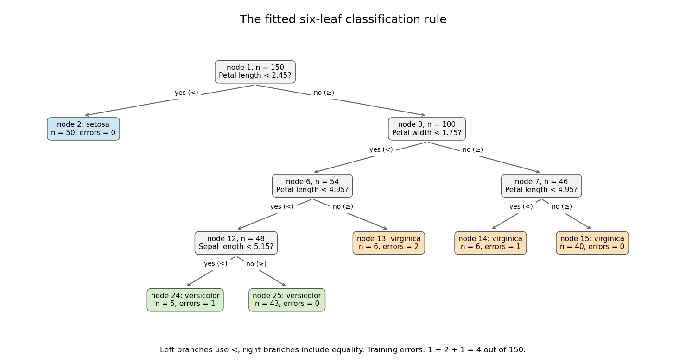
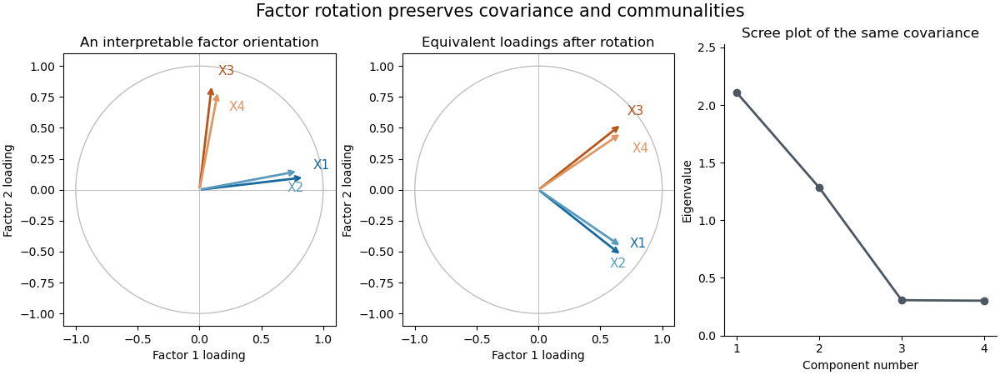

# Paper 46

↑ **Parent:** [Iii](../iii.md)

[https://www.maths.cam.ac.uk/postgrad/part-iii/files/pastpapers/2005/Paper46.pdf](https://www.maths.cam.ac.uk/postgrad/part-iii/files/pastpapers/2005/Paper46.pdf)

**Table of contents**

- [1](#1)
  - [Solution](#1/solution)
  - [i](#1/i)
    - [Solution](#1/i/solution)
  - [ii](#1/ii)
    - [Solution](#1/ii/solution)
  - [iii](#1/iii)
    - [Solution](#1/iii/solution)
- [2](#2)
  - [i](#2/i)
    - [Solution](#2/i/solution)
  - [ii](#2/ii)
    - [Solution](#2/ii/solution)
  - [Solution](#2/solution)
- [3](#3)
  - [Solution](#3/solution)
- [4](#4)
  - [i](#4/i)
    - [Solution](#4/i/solution)
  - [ii](#4/ii)
    - [Solution](#4/ii/solution)
  - [iii](#4/iii)
    - [Solution](#4/iii/solution)

## 1

↑ **Parent:** [Paper 46](paper-46.md)

<h3 id="1/solution">Solution</h3>

↑ **Parent:** [1](#1)

Write the partitioned mean as $(\mu_1^T,\mu_2^T)^T$ and assume $V_{22}$ is nonsingular, as required by the displayed inverse. For the [conditional multivariate normal distribution](../../../probability-and-statistics.md#conditional-multivariate-normal-distribution), form the residual

$$
U=X_1-\mu_1-V_{12}V_{22}^{-1}(X_2-\mu_2).
$$

A [linear transformation](../../../vector-space.md#linear-map) of a [multivariate normal distribution](../../../probability-and-statistics.md#multivariate-normal-distribution) is again normal. Direct calculation gives

$$
\operatorname{Cov}(U,X_2)=V_{12}-V_{12}V_{22}^{-1}V_{22}=0,\qquad \operatorname{Cov}(U)=V_{11}-V_{12}V_{22}^{-1}V_{21}.
$$

The jointly normal blocks $U$ and $X_2$ are therefore [independent](../../../random-variable.md#independent-random-variables): their joint [characteristic function](../../../probability-theory.md#characteristic-function) has no cross term in its quadratic exponent and factors into the two marginal [characteristic functions](../../../probability-theory.md#characteristic-function). Conditioning leaves the distribution of $U$ unchanged. Reconstructing $X_1$ proves the full conditional law, including the requested [Schur complement](../../../linear-algebra.md#schur-complement) [covariance](../../../variance.md#covariance):

$$
\boxed{X_1\mid X_2=x_2\sim N\!\left(\mu_1+V_{12}V_{22}^{-1}(x_2-\mu_2),\ V_{11}-V_{12}V_{22}^{-1}V_{21}\right).}
$$

This describes a regular conditional law; it does not require the equality event to have positive probability.

<h3 id="1/i">i</h3>

↑ **Parent:** [1](#1)

<h4 id="1/i/solution">Solution</h4>

↑ **Parent:** [I](#1/i)

Put $D_1=X_1-Y_1$, $D_2=X_2-Y_2$ and

$$
B=\begin{pmatrix}1&0&-1&0\\0&1&0&-1\end{pmatrix}.
$$

The difference vector is $D=BZ$. Its mean is zero because the two sons have the same mean vector. Its [covariance matrix](../../../variance.md#covariance-matrix) is

$$
BVB^T=2\begin{pmatrix}a-c&b-c\\b-c&a-c\end{pmatrix}.
$$

For example, $\operatorname{Cov}(D_1,D_2)=b-c-c+b=2(b-c)$. Thus

$$
\boxed{\begin{pmatrix}D_1\\D_2\end{pmatrix}\sim N_2\!\left(\begin{pmatrix}0\\0\end{pmatrix},\ 2\begin{pmatrix}a-c&b-c\\b-c&a-c\end{pmatrix}\right).}
$$

The [positive definiteness](../../../linear-algebra.md#positive-definiteness) assumption supplies $a-b>0$ and $a+b-2c>0$: these are [eigenvalues](../../../linear-operator-theory.md#eigenvalue) of the original [matrix](../../../vector-space.md#matrix) on within-son contrast and between-son difference directions. In particular the resulting difference [covariance](../../../variance.md#covariance) is positive definite.

<h3 id="1/ii">ii</h3>

↑ **Parent:** [1](#1)

<h4 id="1/ii/solution">Solution</h4>

↑ **Parent:** [Ii](#1/ii)

Taking the first marginal of the normal vector in part (i) gives

$$
\boxed{X_1-Y_1\sim N\bigl(0,\,2(a-c)\bigr).}
$$

Equivalently its [variance](../../../variance.md) is $a+a-2c$; the [covariance](../../../variance.md#covariance) between the two sons must be retained when taking their difference.

<h3 id="1/iii">iii</h3>

↑ **Parent:** [1](#1)

<h4 id="1/iii/solution">Solution</h4>

↑ **Parent:** [Iii](#1/iii)

Applying the [conditional multivariate normal distribution](../../../probability-and-statistics.md#conditional-multivariate-normal-distribution) to the two differences gives, more generally,

$$
D_1\mid D_2=d\sim N\!\left(\frac{b-c}{a-c}d,\ 2(a-c)-\frac{[2(b-c)]^2}{2(a-c)}\right).
$$

At $d=0$ the result is

$$
\boxed{X_1-Y_1\mid X_2-Y_2=0\sim N\!\left(0,\ \frac{2(a-b)(a+b-2c)}{a-c}\right).}
$$

Both this law and the marginal law have mean zero, but the [conditional variance](../../../variance.md#conditional-variance) is smaller. Specifically, with $\rho=(b-c)/(a-c)$, the [conditional variance](../../../variance.md#conditional-variance) is the marginal [variance](../../../variance.md) times $1-\rho^2$. The assumptions imply $0<\rho<1$, so the decrease is strict. Matching the breadth differences to zero gives information about the correlated length differences; it does not force the length differences themselves to be zero. The residual uncertainty remains positive. The original PDF has the between-son differences used here; the self-subtractions in the converted TeX are transcription errors.

## 2

↑ **Parent:** [Paper 46](paper-46.md)

<h3 id="2/i">i</h3>

↑ **Parent:** [2](#2)

<h4 id="2/i/solution">Solution</h4>

↑ **Parent:** [I](#2/i)

Let $\lambda_1\geq\cdots\geq\lambda_p\geq0$ be the [eigenvalues](../../../linear-operator-theory.md#eigenvalue) of the symmetric [covariance matrix](../../../variance.md#covariance-matrix) $V$, and choose an [orthonormal basis](../../../linear-algebra.md#orthonormal-basis) of [eigenvectors](../../../linear-operator-theory.md#eigenvector) $v_1,\ldots,v_p$. If $\ell=\sum_ja_jv_j$ has unit length, then $\sum_ja_j^2=1$ and

$$
\operatorname{Var}(\ell^TX)=\ell^TV\ell=\sum_j\lambda_ja_j^2\leq\lambda_1.
$$

Equality is attained by $v_1$, and precisely by [unit vectors](../../../vector-space.md#unit-vector) in the top [eigenspace](../../../linear-operator-theory.md#eigenspace). Hence **choose $\ell_1$ to be any unit [eigenvector](../../../linear-operator-theory.md#eigenvector) for the largest [eigenvalue](../../../linear-operator-theory.md#eigenvalue); the maximum [variance](../../../variance.md) is $\lambda_1$**. This proves the maximizing property of the [Rayleigh quotient](../../../linear-operator-theory.md#rayleigh-quotient), rather than merely specifying a stationary point.

<h3 id="2/ii">ii</h3>

↑ **Parent:** [2](#2)

<h4 id="2/ii/solution">Solution</h4>

↑ **Parent:** [Ii](#2/ii)

Extend the selected $\ell_1$ to an [orthonormal basis](../../../linear-algebra.md#orthonormal-basis) of [eigenvectors](../../../linear-operator-theory.md#eigenvector), writing it as $v_1$. For a [unit vector](../../../vector-space.md#unit-vector) orthogonal to it, $a_1=0$, and therefore

$$
\operatorname{Var}(\ell^TX)=\sum_{j=2}^{p}\lambda_ja_j^2\leq\lambda_2.
$$

A unit [eigenvector](../../../linear-operator-theory.md#eigenvector) $v_2$ attains equality. Thus **$\ell_2$ is a unit [eigenvector](../../../linear-operator-theory.md#eigenvector) for the largest [eigenvalue](../../../linear-operator-theory.md#eigenvalue) on $\ell_1^\perp$, and the maximum is $\lambda_2$**. If the largest [eigenvalue](../../../linear-operator-theory.md#eigenvalue) is repeated, a second orthogonal vector in that [eigenspace](../../../linear-operator-theory.md#eigenspace) is allowed and $\lambda_2=\lambda_1$; there is no uniquely determined first pair of directions.

<h3 id="2/solution">Solution</h3>

↑ **Parent:** [2](#2)

For the sample, put $\bar x=n^{-1}\sum_ix_i$ and use the [sample covariance matrix](../../../variance.md#sample-covariance-matrix)

$$
S=\frac1{n-1}\sum_{i=1}^{n}(x_i-\bar x)(x_i-\bar x)^T.
$$

Order its [eigenvalues](../../../linear-operator-theory.md#eigenvalue) $\widehat\lambda_j$ decreasingly and choose unit orthogonal [eigenvectors](../../../linear-operator-theory.md#eigenvector) $\widehat\ell_j$. The [sample principal components](../../../statistical-learning.md#sample-principal-component) are the score columns

$$
\boxed{z_{ij}=\widehat\ell_j^T(x_i-\bar x).}
$$

Their [sample means](../../../variance.md#sample-mean) are zero and their sample [covariance](../../../variance.md#covariance) is diagonal, since $\widehat\ell_j^TS\widehat\ell_k=\widehat\lambda_j\mathbf1_{\{j=k\}}$. The $j$th [sample variance](../../../statistical-inference.md#sample-variance) is $\widehat\lambda_j$, and its [explained variance of a principal component](../../../statistical-learning.md#explained-variance-of-a-principal-component) is $\widehat\lambda_j/\operatorname{tr}(S)$. Using divisor $n$ instead changes the numerical [variances](../../../variance.md) by a common factor but leaves the component directions unchanged.

Standardizing means replacing a variable with positive [sample variance](../../../statistical-inference.md#sample-variance) by $(x_{ij}-\bar x_j)/s_j$. This gives [principal component analysis on a correlation matrix](../../../statistical-learning.md#principal-component-analysis-on-a-correlation-matrix), using $C=D^{-1/2}SD^{-1/2}$ with $D=\operatorname{diag}(S)$. It removes arbitrary differences of measurement units and prevents a large-variance coordinate from dominating solely through its scale. It also changes the question being optimized: small-variance and possibly noisy coordinates receive equal marginal weight. [Principal component analysis](../../../statistical-learning.md#principal-component-analysis) based on the [covariance matrix](../../../variance.md#covariance-matrix) can be more appropriate when the variables have common meaningful units and absolute variability matters. Standardization is therefore a substantive choice, not an automatic improvement. A zero-variance variable must first be removed. In the word-rating example the variables share the same numerical range, but their across-word dispersions can differ; standardization gives each attribute equal initial [variance](../../../variance.md).

For the standardized eight-variable analysis, total [variance](../../../variance.md) is $\operatorname{tr}(C)=8$. The first three fractions of [explained variance of a principal component](../../../statistical-learning.md#explained-variance-of-a-principal-component) are approximately **59.6%, 19.1% and 10.1%**, respectively. The first two account for about **78.8%**, and the first three for **88.9%**. The first direction is dominant but one direction alone loses substantial variation. Retaining two [principal components](../../../statistical-learning.md#principal-component) is a plausible descriptive summary: their [eigenvalues](../../../linear-operator-theory.md#eigenvalue) exceed $1$, whereas the third is below $1$. That cutoff is a heuristic, and the third [principal component](../../../statistical-learning.md#principal-component) may still have interpretable content.

The reported coefficient rows are not unit-length vectors. The printed rounded rows have squared lengths $4.7514$, $1.5222$ and $0.8063$, consistent with their [eigenvalues](../../../linear-operator-theory.md#eigenvalue) to the precision of the coefficient table. They are consistent with the scaled [principal component loading](../../../statistical-learning.md#principal-component-loading) convention $r_j=\sqrt{\lambda_j}\ell_j$. Such rows remain [eigenvectors](../../../linear-operator-theory.md#eigenvector), but the score direction with unit length is $\ell_j=r_j/\sqrt{\lambda_j}$, or more accurately the row divided by its actual [Euclidean norm](../../../functional-analysis.md#euclidean-norm) when using rounded entries. Under this convention $r_{ij}$ is the [correlation](../../../variance.md#pearson-correlation-coefficient) of standardized attribute $i$ with the variance-one score for component $j$:

$$
\operatorname{Corr}(Z_i,\ell_j^TZ/\sqrt{\lambda_j})=\sqrt{\lambda_j}\ell_{ij}.
$$

This explains both their sizes and why they must not be treated as the [unit vectors](../../../vector-space.md#unit-vector) from parts (i) and (ii).

The first [principal component](../../../statistical-learning.md#principal-component) has positive coefficients on every attribute, strongest on friendliness, goodness, niceness, bravery and strength. With the favorable endpoints coded in the positive direction, it describes a broad favorable or impressive evaluation, with a potency contribution. The second contrasts movement and speed, with some size and strength, against the first three evaluative attributes; it is chiefly an activity dimension. The third is dominated by size, with smaller positive strength and negative movement/speed coefficients, distinguishing size or potency from activity. These are interpretations of directions of variation, not evidence of causal latent traits. Reversing a [principal component](../../../statistical-learning.md#principal-component)'s overall sign changes neither its meaning as an axis nor its explained [variance](../../../variance.md); endpoint coding fixes only how its positive side is described.

## 3

↑ **Parent:** [Paper 46](paper-46.md)

<h3 id="3/solution">Solution</h3>

↑ **Parent:** [3](#3)

The formula makes species the categorical response and the dot denotes all four other columns as candidate predictors. The [classification tree](../../../statistical-learning.md#classification-tree) is grown by recursive binary partitioning, not by fitting a [linear regression](../../../linear-regression.md) to numerical species codes. At a node $t$, count observations of each class, $n_{tk}$, and set $\widehat p_{tk}=n_{tk}/n_t$. These are the multinomial maximum-likelihood probabilities. The [classification-tree deviance](../../../statistical-learning.md#classification-tree-deviance) is

$$
D(t)=-2\sum_kn_{tk}\log\widehat p_{tk},\qquad0\log0=0.
$$

For each candidate predictor and threshold, calculate $D(t)-D(t_L)-D(t_R)$ and choose the largest permitted decrease. Continue recursively until a node is pure or the stopping controls prevent another split, for example because it has too few observations or insufficient deviance to warrant further growth. Only petal length, petal width and sepal length appear in the selected splits; sepal width was available but did not win a split. This greedy construction need not find a globally optimal tree. The default deviance criterion and [recursive partitioning](../../../statistical-learning.md#recursive-partitioning) are documented in the [tree package manual](https://cran.r-project.org/web/packages/tree/tree.pdf).

Each node number encodes its position: node $j$ has left and right children $2j$ and $2j+1$. The reported sample size is the number reaching the node; its deviance is calculated from that node's class counts. The fitted class is the class with largest fitted probability, with a convention resolving ties. The root's three counts are equal, so its displayed class is only a tie choice. An asterisk marks a terminal node, where prediction stops.

The resulting rule is displayed below. A left edge satisfies the stated strict inequality and a right edge its complement. None of the recorded training values lies exactly at these midpoint thresholds; the diagram adopts the right branch at equality for prediction.

**[Figure 1](#3/image-the-fitted-six-leaf-iris-classification-tree-with-split-thresholds-and-training-errors). The fitted six-leaf iris classification tree, with split thresholds and training errors**.

Its six terminal regions have the following derived class counts, in the order setosa, versicolor, virginica:

$$
\begin{array}{c|c|c|c}
\text{node}&\text{class counts}&\text{predicted class}&\text{errors}\\\hline
2&(50,0,0)&\text{setosa}&0\\
24&(0,4,1)&\text{versicolor}&1\\
25&(0,43,0)&\text{versicolor}&0\\
13&(0,2,4)&\text{virginica}&2\\
14&(0,1,5)&\text{virginica}&1\\
15&(0,0,40)&\text{virginica}&0
\end{array}
$$

The root split identifies all 50 setosa observations. Among the remaining specimens, the petal-width split is the principal separation of versicolor from virginica; further petal-length and sepal-length splits refine it. The leaf errors add to **$4/150\simeq2.67\%$**. The leaf deviances add to

$$
5.0040+7.6382+5.4067\simeq18.0489.
$$

Dividing by the software's residual degrees-of-freedom convention $150-6=144$ gives **$18.0489/144\simeq0.1253$**, as reported. The root deviance is $-2(150)\log(1/3)=300\log3\simeq329.6$. The deviance is a [likelihood](../../../statistical-modelling.md#likelihood-function) measure, whereas the error rate counts wrong majority-class predictions; these are different fit summaries.

Both quantities are in-sample, so the low error does not establish prediction accuracy on new specimens. [Cost-complexity tree pruning](../../../statistical-learning.md#cost-complexity-tree-pruning), with tree size chosen by [cross-validation](../../../statistical-learning.md#cross-validation), can remove weak splits and reduce [overfitting](../../../statistical-learning.md#overfitting). An [independent](../../../random-variable.md#independent-random-variables) [test set](../../../statistical-learning.md#test-set) is needed for a final estimate of the selected tree's [prediction error](../../../statistical-learning.md#prediction-error).

## 4

↑ **Parent:** [Paper 46](paper-46.md)

<h3 id="4/i">i</h3>

↑ **Parent:** [4](#4)

<h4 id="4/i/solution">Solution</h4>

↑ **Parent:** [I](#4/i)

[Multivariate analysis of variance](../../../linear-regression.md#multivariate-analysis-of-variance) extends [analysis of variance](../../../linear-regression.md#analysis-of-variance) to vector responses. For example, a treatment may affect several correlated physiological measurements jointly. Separate univariate tests do not use the [correlation](../../../variance.md#pearson-correlation-coefficient) geometry and require adjustment if they are interpreted as one multiple-testing procedure. A joint test asks whether group mean vectors differ in any direction.

In a one-way model, take [independent](../../../random-variable.md#independent-random-variables) $Y_{ri}\sim N_p(\mu_r,\Sigma)$, $r=1,\ldots,g$, $i=1,\ldots,n_r$, with a common [positive-definite](../../../linear-algebra.md#positive-definite-bilinear-form) [covariance](../../../variance.md#covariance). Put $N=\sum_rn_r$, and let $\bar Y_r$ and $\bar Y$ be group and overall [sample means](../../../variance.md#sample-mean). The within-group and between-group scatter [matrices](../../../vector-space.md#matrix) are

$$
E=\sum_{r,i}(Y_{ri}-\bar Y_r)(Y_{ri}-\bar Y_r)^T,\qquad H=\sum_rn_r(\bar Y_r-\bar Y)(\bar Y_r-\bar Y)^T.
$$

Expanding around each group mean makes the cross terms vanish, giving total scatter $E+H$. To test $H_0:\mu_1=\cdots=\mu_g$, use the [Wilks lambda statistic](../../../linear-regression.md#wilks-lambda-statistic)

$$
\boxed{\Lambda=\frac{|E|}{|E+H|}=\prod_{j=1}^{p}(1+\theta_j)^{-1},}
$$

where $\theta_j$ solve the [generalized eigenvalue problem](../../../linear-operator-theory.md#generalized-eigenvalue-problem) $Hv=\theta Ev$ and $E$ is nonsingular. Under the alternative, maximize the normal [likelihood](../../../statistical-modelling.md#likelihood-function) at the group means and [covariance](../../../variance.md#covariance) $E/N$; under the null, use the overall mean and [covariance](../../../variance.md#covariance) $(E+H)/N$. Their [likelihood ratio](../../../statistical-modelling.md#likelihood-ratio) is $\Lambda^{N/2}$, so small $\Lambda$ rejects equal means. Under the null, orthogonal projections of the Gaussian data give [independent](../../../random-variable.md#independent-random-variables) $E\sim W_p(\Sigma,N-g)$ and $H\sim W_p(\Sigma,g-1)$, supplying its null calibration. Here $E$ is nonsingular almost surely when $N-g\geq p$. Merely having more total observations than responses is not enough if group fitting consumes too many [statistical degrees of freedom](../../../statistical-inference.md#statistical-degrees-of-freedom).

The test is invariant under a nonsingular linear change of response coordinates: both [determinants](../../../linear-algebra.md#determinant) acquire the same factor $|A|^2$. The directions associated with large $\theta_j$ identify mean separation relative to residual variability. With one response it becomes the ordinary [ANOVA](../../../linear-regression.md#analysis-of-variance) [F-test](../../../probability-and-statistics.md#f-test). With two groups, writing $S_p=E/(N-2)$ and $d=\bar Y_1-\bar Y_2$, the version using [Hotelling's T-squared statistic](../../../statistical-modelling.md#hotelling-s-t-squared-statistic) is

$$
T^2=\frac{n_1n_2}{N}d^TS_p^{-1}d,\qquad\frac{N-p-1}{p(N-2)}T^2\sim F_{p,N-p-1}\quad(H_0),
$$

with $N>p+1$. This formula demonstrates explicitly how the [covariance](../../../variance.md#covariance) weights a group difference.

**[Figure 2](#4/i/image-correlated-response-clouds-can-overlap-marginally-yet-separate-along-a-low-variance-contrast). Correlated response clouds can overlap marginally yet separate along a low-variance contrast**.

The sketch shows hypothetical groups with strongly positively correlated responses and mean separation along their low-variance contrast. Marginal comparisons can look weak even when the joint comparison is informative. The ellipses represent individual-response [covariance](../../../variance.md#covariance), not confidence regions for the means. [Independence](../../../random-variable.md#independent-random-variables) of observations, approximate multivariate normality and common [covariance](../../../variance.md#covariance) are substantive assumptions; outliers and unequal [covariance](../../../variance.md#covariance) can invalidate the usual calibration. Follow-up contrasts can identify the affected responses or groups, with appropriate multiplicity control. **[MANOVA](../../../linear-regression.md#multivariate-analysis-of-variance) uses shared [covariance](../../../variance.md#covariance) to test a multivariate mean difference, rather than testing unrelated coordinates in isolation.**

<h3 id="4/ii">ii</h3>

↑ **Parent:** [4](#4)

<h4 id="4/ii/solution">Solution</h4>

↑ **Parent:** [Ii](#4/ii)

[Factor analysis](../../../statistical-modelling.md#factor-analysis) models a large set of correlated measurements using a smaller collection of shared [latent factors](../../../statistical-modelling.md#latent-factor) and variable-specific variation. A classical [orthogonal factor model](../../../statistical-modelling.md#orthogonal-factor-model) is

$$
\boxed{X=\mu+LF+\epsilon,\quad\mathbb EF=0,\quad\operatorname{Cov}(F)=I_q,\quad\operatorname{Cov}(\epsilon)=\Psi=\operatorname{diag}(\psi_1,\ldots,\psi_p),\quad\operatorname{Cov}(F,\epsilon)=0.}
$$

Take $q<p$, centered errors, and positive specific [variances](../../../variance.md) for the inverse-covariance and [likelihood](../../../statistical-modelling.md#likelihood-function) formulas below. The [factor loadings](../../../statistical-modelling.md#factor-loading) form the $p\times q$ [matrix](../../../vector-space.md#matrix) $L$, and the model [covariance](../../../variance.md#covariance) is

$$
\Sigma=LL^T+\Psi.
$$

Thus for $i\ne k$, $\operatorname{Cov}(X_i,X_k)=\sum_jL_{ij}L_{kj}$; the common [latent factors](../../../statistical-modelling.md#latent-factor) explain off-diagonal [correlation](../../../variance.md#pearson-correlation-coefficient). The [communality](../../../statistical-modelling.md#communality) of variable $i$ is $h_i^2=\sum_jL_{ij}^2$, and $\operatorname{Var}(X_i)=h_i^2+\psi_i$. For standardized variables this is $1=h_i^2+\psi_i$. The specific [variance](../../../variance.md) represents measurement noise or genuinely unshared variation; it is not another common [latent factor](../../../statistical-modelling.md#latent-factor).

This differs from [principal component analysis](../../../statistical-learning.md#principal-component-analysis). A [principal component](../../../statistical-learning.md#principal-component) maximizes projected total [variance](../../../variance.md) and is a determined linear score after choosing its direction; a factor model attempts to explain shared [covariance](../../../variance.md#covariance) while reserving diagonal specific [variance](../../../variance.md). Low-dimensional [PCA](../../../statistical-learning.md#principal-component-analysis) truncation can help initialize a factor fit, but it does not justify setting all specific [variances](../../../variance.md) to zero. [Latent factors](../../../statistical-modelling.md#latent-factor) are unobserved, not directly observed scores. When the [latent factors](../../../statistical-modelling.md#latent-factor) and the errors are jointly Gaussian, their [conditional mean](../../../measure-theory.md#conditional-expectation) is

$$
\mathbb E(F\mid X=x)=L^T\Sigma^{-1}(x-\mu),
$$

which supplies one factor-score estimate, with remaining uncertainty. This follows from the block conditional normal formula in Question 1; it does not make the [latent factor](../../../statistical-modelling.md#latent-factor) uniquely recoverable from one observation.

For the Gaussian [likelihood](../../../statistical-modelling.md#likelihood-function), use the empirical covariance $S_0=n^{-1}\sum_i(x_i-\bar x)(x_i-\bar x)^T$. Fit the factor model by minimizing $\log|LL^T+\Psi|+\operatorname{tr}(S_0(LL^T+\Psi)^{-1})$ subject to admissible specific [variances](../../../variance.md). Other approaches estimate [communalities](../../../statistical-modelling.md#communality) and extract [latent factors](../../../statistical-modelling.md#latent-factor) from the reduced [correlation matrix](../../../variance.md#correlation-matrix). Choose $q$ using substantive plausibility, a [scree plot](../../../statistical-learning.md#scree-plot), fitted residual [correlations](../../../variance.md#pearson-correlation-coefficient) and model-fit assessment. Under local [identifiability](../../../statistical-model.md#identifiability), a [likelihood](../../../statistical-modelling.md#likelihood-function) goodness-of-fit count for the [covariance](../../../variance.md#covariance) model is

$$
\frac{p(p+1)}2-\left[pq+p-\frac{q(q-1)}2\right],
$$

where the subtracted rotational dimension must be removed from the loading parameter count. This count alone does not establish [identifiability](../../../statistical-model.md#identifiability), and boundary fits with zero specific [variance](../../../variance.md) need special care.

[Factor rotation](../../../statistical-modelling.md#factor-rotation) addresses interpretability and nonuniqueness. For every [orthogonal matrix](../../../linear-algebra.md#orthogonal-matrix) $Q$, replace $(L,F)$ by $(LQ,Q^TF)$; then $(LQ)(LQ)^T=LL^T$, so the fit is unchanged. The absolute orientation of unrestrained [latent factors](../../../statistical-modelling.md#latent-factor) is therefore not identified by the [covariance](../../../variance.md#covariance). [Varimax rotation](../../../statistical-modelling.md#varimax-rotation) chooses orthogonal axes favoring a simple pattern of large and small squared loadings. Oblique rotation can permit correlated [latent factors](../../../statistical-modelling.md#latent-factor), provided their [covariance](../../../variance.md#covariance) is transformed consistently. Sign changes and permutations are further harmless relabelings; an interpretation must state its chosen convention.

**[Figure 3](#4/ii/image-two-factor-loading-directions-an-equivalent-rotated-representation-and-the-covariance-scree-plot). Two-factor loading directions, an equivalent rotated representation and the covariance scree plot**.

The sketch uses four standardized hypothetical measurements sharing two orthogonal [latent factors](../../../statistical-modelling.md#latent-factor). Rotating the factor coordinates changes the loading descriptions while preserving every implied [covariance](../../../variance.md#covariance) and [communality](../../../statistical-modelling.md#communality); the scree plot belongs to that same constructed [covariance matrix](../../../variance.md#covariance-matrix). **[Factor analysis](../../../statistical-modelling.md#factor-analysis) separates shared variation from specific [variance](../../../variance.md), and its [latent factors](../../../statistical-modelling.md#latent-factor) require an identifying or interpretive orientation.**

<h3 id="4/iii">iii</h3>

↑ **Parent:** [4](#4)

<h4 id="4/iii/solution">Solution</h4>

↑ **Parent:** [Iii](#4/iii)

[Cluster analysis](../../../statistical-learning.md#cluster-analysis) groups observations without given class labels. It starts by deciding what similarity means, usually through a [dissimilarity matrix](../../../statistical-learning.md#dissimilarity-matrix). [Euclidean distance](../../../topological-analysis.md#euclidean-distance) is natural for comparable continuous coordinates; a [Mahalanobis distance](../../../variance.md#mahalanobis-distance) can account for differing scales and [correlations](../../../variance.md#pearson-correlation-coefficient) when a meaningful nonsingular [covariance](../../../variance.md#covariance) estimate is available. Scaling and variable selection can change the groups. Binary, ordinal or categorical data may need a different dissimilarity, rather than arbitrary numerical codes and [Euclidean distance](../../../topological-analysis.md#euclidean-distance).

[Agglomerative hierarchical clustering](../../../statistical-learning.md#agglomerative-hierarchical-clustering) begins with singleton groups, repeatedly merges the pair with smallest intergroup dissimilarity, and records the merges in a [dendrogram](../../../statistical-learning.md#dendrogram). The height represents the algorithm's merge criterion. Cutting the [dendrogram](../../../statistical-learning.md#dendrogram) gives partitions at different resolutions, and merges cannot subsequently be reversed. In [single-linkage clustering](../../../statistical-learning.md#single-linkage-clustering), the criterion is the nearest cross-pair distance; this detects chains and nonconvex groups, but a thin bridge can connect otherwise separated clouds. [Complete-linkage clustering](../../../statistical-learning.md#complete-linkage-clustering) uses the farthest cross-pair distance and tends to produce compact groups, at the cost of sensitivity to extreme points. [Average-linkage clustering](../../../statistical-learning.md#average-linkage-clustering) uses the mean cross-pair distance, lying between these two criteria for a given pair of clusters.

For squared Euclidean geometry, [Ward clustering](../../../statistical-learning.md#ward-minimum-variance-clustering) merges the pair that least increases the within-group sum of squares. Expanding deviations about the merged mean gives

$$
\Delta(A,B)=\frac{|A||B|}{|A|+|B|}\|\bar x_A-\bar x_B\|^2.
$$

This favors low within-group dispersion, but interpreting it as a sum-of-squares increase requires Euclidean data. Different software may plot a rescaled height, so the vertical units of a [dendrogram](../../../statistical-learning.md#dendrogram) from [Ward clustering](../../../statistical-learning.md#ward-minimum-variance-clustering) must be stated.

A nonhierarchical alternative is [k-means clustering](../../../statistical-learning.md#k-means-clustering). For a prescribed $K$, minimize

$$
\boxed{W_K=\sum_{k=1}^{K}\sum_{i\in C_k}\|x_i-m_k\|^2.}
$$

At fixed assignments, expanding squared distances or differentiating shows that the minimizing $m_k$ is the group mean. At fixed [centroids](../../../geometry-and-topology.md#centroid), each point is assigned to a nearest [centroid](../../../geometry-and-topology.md#centroid). Alternating these operations does not increase $W_K$; with a consistent tie rule and nonempty groups it reaches a locally stable partition. Initialization matters, so use multiple starts, and give an explicit rule for empty groups. It favors roughly spherical clusters and is sensitive to outliers and scaling. It cannot be expected to reproduce a nonconvex single-linkage partition.

**[Figure 4](#4/iii/image-an-original-point-configuration-and-its-computed-complete-linkage-dendrogram-with-a-three-cluster-cut). An original point configuration and its computed complete-linkage dendrogram with a three-cluster cut**.

The sketch displays a constructed point configuration and the complete-linkage merges computed from its actual Euclidean distances. A cut between the within-pair and between-pair merge heights yields three groups. Such visual separation is useful evidence, not proof of a uniquely correct number of populations. Select a resolution using subject knowledge, stability under resampling, separation diagnostics or the change of $W_K$ with $K$. Clustering always gives a partition even for unstructured data, and different distance or linkage choices can yield different sensible summaries. **Clustering is an exploratory construction whose conclusions depend on the geometry and the chosen resolution.**

## ↑ Ancestors (8)

1. [Iii](../iii.md)
2. [2005](../../2005.md)
3. [Past exam of the mathematics course of the University of Cambridge](../../../past-exam-of-the-mathematics-course-of-the-university-of-cambridge.md)
4. [Mathematics course of the University of Cambridge](../../../university-of-cambridge.md#mathematics-course-of-the-university-of-cambridge)
5. [Course of the University of Cambridge](../../../university-of-cambridge.md#course-of-the-university-of-cambridge)
6. [University of Cambridge](../../../university-of-cambridge.md)
7. [List of universities](../../../README.md#list-of-universities)
8. [Codex Wiki](../../../README.md)
