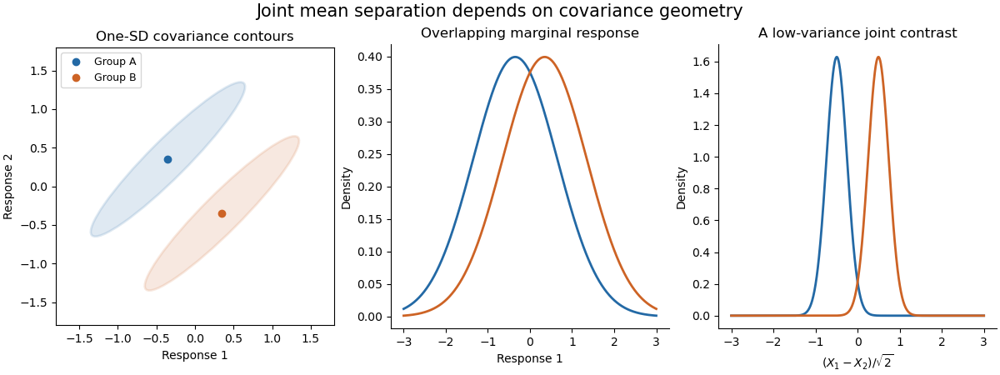

<h1 id="4/i/solution">Solution</h1>

↑ **Parent:** [I](../i.md)

[Multivariate analysis of variance](../../../../../../multivariate-analysis-of-variance.md) extends [analysis of variance](../../../../../../analysis-of-variance.md) to vector responses. For example, a treatment may affect several correlated physiological measurements jointly. Separate univariate tests do not use the [correlation](../../../../../../pearson-correlation-coefficient.md) geometry and require adjustment if they are interpreted as one multiple-testing procedure. A joint test asks whether group mean vectors differ in any direction.

In a one-way model, take [independent](../../../../../../independent-random-variables.md) $Y_{ri}\sim N_p(\mu_r,\Sigma)$, $r=1,\ldots,g$, $i=1,\ldots,n_r$, with a common [positive-definite](../../../../../../positive-definite-bilinear-form.md) [covariance](../../../../../../covariance.md). Put $N=\sum_rn_r$, and let $\bar Y_r$ and $\bar Y$ be group and overall [sample means](../../../../../../sample-mean.md). The within-group and between-group scatter [matrices](../../../../../../matrix.md) are

$$
E=\sum_{r,i}(Y_{ri}-\bar Y_r)(Y_{ri}-\bar Y_r)^T,\qquad H=\sum_rn_r(\bar Y_r-\bar Y)(\bar Y_r-\bar Y)^T.
$$

Expanding around each group mean makes the cross terms vanish, giving total scatter $E+H$. To test $H_0:\mu_1=\cdots=\mu_g$, use the [Wilks lambda statistic](../../../../../../wilks-lambda-statistic.md)

$$
\boxed{\Lambda=\frac{|E|}{|E+H|}=\prod_{j=1}^{p}(1+\theta_j)^{-1},}
$$

where $\theta_j$ solve the [generalized eigenvalue problem](../../../../../../generalized-eigenvalue-problem.md) $Hv=\theta Ev$ and $E$ is nonsingular. Under the alternative, maximize the normal [likelihood](../../../../../../likelihood-function.md) at the group means and [covariance](../../../../../../covariance.md) $E/N$; under the null, use the overall mean and [covariance](../../../../../../covariance.md) $(E+H)/N$. Their [likelihood ratio](../../../../../../likelihood-ratio.md) is $\Lambda^{N/2}$, so small $\Lambda$ rejects equal means. Under the null, orthogonal projections of the Gaussian data give [independent](../../../../../../independent-random-variables.md) $E\sim W_p(\Sigma,N-g)$ and $H\sim W_p(\Sigma,g-1)$, supplying its null calibration. Here $E$ is nonsingular almost surely when $N-g\geq p$. Merely having more total observations than responses is not enough if group fitting consumes too many [statistical degrees of freedom](../../../../../../statistical-degrees-of-freedom.md).

The test is invariant under a nonsingular linear change of response coordinates: both [determinants](../../../../../../determinant.md) acquire the same factor $|A|^2$. The directions associated with large $\theta_j$ identify mean separation relative to residual variability. With one response it becomes the ordinary [ANOVA](../../../../../../analysis-of-variance.md) [F-test](../../../../../../f-test.md). With two groups, writing $S_p=E/(N-2)$ and $d=\bar Y_1-\bar Y_2$, the version using [Hotelling's T-squared statistic](../../../../../../hotelling-s-t-squared-statistic.md) is

$$
T^2=\frac{n_1n_2}{N}d^TS_p^{-1}d,\qquad\frac{N-p-1}{p(N-2)}T^2\sim F_{p,N-p-1}\quad(H_0),
$$

with $N>p+1$. This formula demonstrates explicitly how the [covariance](../../../../../../covariance.md) weights a group difference.

**[Figure 2](#4/i/image-correlated-response-clouds-can-overlap-marginally-yet-separate-along-a-low-variance-contrast). Correlated response clouds can overlap marginally yet separate along a low-variance contrast**.

The sketch shows hypothetical groups with strongly positively correlated responses and mean separation along their low-variance contrast. Marginal comparisons can look weak even when the joint comparison is informative. The ellipses represent individual-response [covariance](../../../../../../covariance.md), not confidence regions for the means. [Independence](../../../../../../independent-random-variables.md) of observations, approximate multivariate normality and common [covariance](../../../../../../covariance.md) are substantive assumptions; outliers and unequal [covariance](../../../../../../covariance.md) can invalidate the usual calibration. Follow-up contrasts can identify the affected responses or groups, with appropriate multiplicity control. **[MANOVA](../../../../../../multivariate-analysis-of-variance.md) uses shared [covariance](../../../../../../covariance.md) to test a multivariate mean difference, rather than testing unrelated coordinates in isolation.**

## ↑ Ancestors (11)

1. [I](../i.md)
2. [4](../../4.md)
3. [Paper 46](../../../paper-46-split.md)
4. [Iii](../../../split.md)
5. [2005](../../../../split.md)
6. [Past exam of the mathematics course of the University of Cambridge](../../../../../split.md)
7. [Mathematics course of the University of Cambridge](../../../../../../mathematics-course-of-the-university-of-cambridge.md)
8. [Course of the University of Cambridge](../../../../../../course-of-the-university-of-cambridge.md)
9. [University of Cambridge](../../../../../../university-of-cambridge-split.md)
10. [List of universities](../../../../../../list-of-universities.md)
11. [Codex Wiki](../../../../../../split.md)
