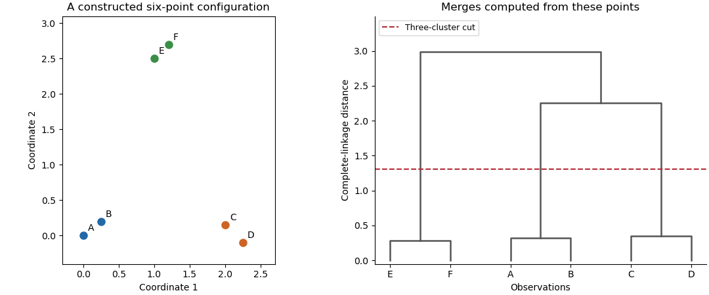

<h1 id="4/iii/solution">Solution</h1>

↑ **Parent:** [Iii](../iii.md)

[Cluster analysis](../../../../../../cluster-analysis.md) groups observations without given class labels. It starts by deciding what similarity means, usually through a [dissimilarity matrix](../../../../../../dissimilarity-matrix.md). [Euclidean distance](../../../../../../euclidean-distance.md) is natural for comparable continuous coordinates; a [Mahalanobis distance](../../../../../../mahalanobis-distance.md) can account for differing scales and [correlations](../../../../../../pearson-correlation-coefficient.md) when a meaningful nonsingular [covariance](../../../../../../covariance.md) estimate is available. Scaling and variable selection can change the groups. Binary, ordinal or categorical data may need a different dissimilarity, rather than arbitrary numerical codes and [Euclidean distance](../../../../../../euclidean-distance.md).

[Agglomerative hierarchical clustering](../../../../../../agglomerative-hierarchical-clustering.md) begins with singleton groups, repeatedly merges the pair with smallest intergroup dissimilarity, and records the merges in a [dendrogram](../../../../../../dendrogram.md). The height represents the algorithm's merge criterion. Cutting the [dendrogram](../../../../../../dendrogram.md) gives partitions at different resolutions, and merges cannot subsequently be reversed. In [single-linkage clustering](../../../../../../single-linkage-clustering.md), the criterion is the nearest cross-pair distance; this detects chains and nonconvex groups, but a thin bridge can connect otherwise separated clouds. [Complete-linkage clustering](../../../../../../complete-linkage-clustering.md) uses the farthest cross-pair distance and tends to produce compact groups, at the cost of sensitivity to extreme points. [Average-linkage clustering](../../../../../../average-linkage-clustering.md) uses the mean cross-pair distance, lying between these two criteria for a given pair of clusters.

For squared Euclidean geometry, [Ward clustering](../../../../../../ward-minimum-variance-clustering.md) merges the pair that least increases the within-group sum of squares. Expanding deviations about the merged mean gives

$$
\Delta(A,B)=\frac{|A||B|}{|A|+|B|}\|\bar x_A-\bar x_B\|^2.
$$

This favors low within-group dispersion, but interpreting it as a sum-of-squares increase requires Euclidean data. Different software may plot a rescaled height, so the vertical units of a [dendrogram](../../../../../../dendrogram.md) from [Ward clustering](../../../../../../ward-minimum-variance-clustering.md) must be stated.

A nonhierarchical alternative is [k-means clustering](../../../../../../k-means-clustering.md). For a prescribed $K$, minimize

$$
\boxed{W_K=\sum_{k=1}^{K}\sum_{i\in C_k}\|x_i-m_k\|^2.}
$$

At fixed assignments, expanding squared distances or differentiating shows that the minimizing $m_k$ is the group mean. At fixed [centroids](../../../../../../centroid.md), each point is assigned to a nearest [centroid](../../../../../../centroid.md). Alternating these operations does not increase $W_K$; with a consistent tie rule and nonempty groups it reaches a locally stable partition. Initialization matters, so use multiple starts, and give an explicit rule for empty groups. It favors roughly spherical clusters and is sensitive to outliers and scaling. It cannot be expected to reproduce a nonconvex single-linkage partition.

**[Figure 4](#4/iii/image-an-original-point-configuration-and-its-computed-complete-linkage-dendrogram-with-a-three-cluster-cut). An original point configuration and its computed complete-linkage dendrogram with a three-cluster cut**.

The sketch displays a constructed point configuration and the complete-linkage merges computed from its actual Euclidean distances. A cut between the within-pair and between-pair merge heights yields three groups. Such visual separation is useful evidence, not proof of a uniquely correct number of populations. Select a resolution using subject knowledge, stability under resampling, separation diagnostics or the change of $W_K$ with $K$. Clustering always gives a partition even for unstructured data, and different distance or linkage choices can yield different sensible summaries. **Clustering is an exploratory construction whose conclusions depend on the geometry and the chosen resolution.**

## ↑ Ancestors (11)

1. [Iii](../iii.md)
2. [4](../../4.md)
3. [Paper 46](../../../paper-46-split.md)
4. [Iii](../../../split.md)
5. [2005](../../../../split.md)
6. [Past exam of the mathematics course of the University of Cambridge](../../../../../split.md)
7. [Mathematics course of the University of Cambridge](../../../../../../mathematics-course-of-the-university-of-cambridge.md)
8. [Course of the University of Cambridge](../../../../../../course-of-the-university-of-cambridge.md)
9. [University of Cambridge](../../../../../../university-of-cambridge-split.md)
10. [List of universities](../../../../../../list-of-universities.md)
11. [Codex Wiki](../../../../../../split.md)
