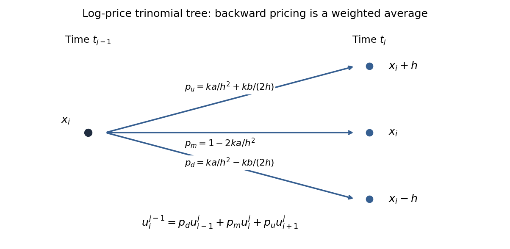

<h1 id="3/g/solution">Solution</h1>

↑ **Parent:** [G](../g.md)

Expand the update in part (b). Its [trinomial tree](../../../../../../trinomial-tree.md) weights are

$$
\boxed{p_{i,d}^j=\frac{k\widehat\sigma_i^{j,2}}{2h^2}-\frac{kb_i^j}{2h},\qquad
p_{i,m}^j=1-\frac{k\widehat\sigma_i^{j,2}}{h^2},\qquad
p_{i,u}^j=\frac{k\widehat\sigma_i^{j,2}}{2h^2}+\frac{kb_i^j}{2h}.}
$$

They connect the current state to $x_i-h,x_i,x_i+h$ at the next time. Their sum is one, their [mean](../../../../../../expected-value.md) increment is $b_i^jk$, and their raw second increment moment is $\widehat\sigma_i^{j,2}k$. Thus they match the log-price diffusion to first order in the time step.

**[Figure 1](#3/g/image-one-step-log-price-trinomial-tree-and-its-backward-pricing-average). One-step log-price trinomial tree and its backward pricing average**.

All three weights are probabilities precisely when they are nonnegative:

$$
\boxed{\frac{k\widehat\sigma_i^{j,2}}{h^2}\leq1,\qquad
|b_i^j|h\leq\widehat\sigma_i^{j,2},}
$$

at every node and level. They are then automatically at most one. With positive $\sigma_-$, a simple sufficient uniform choice is $k\leq h^2/\sigma_+^2$ and $h\sup|r-\widehat\sigma^2/2|\leq\sigma_-^2$. If volatility vanishes at a node while drift does not, the centered weights cannot all be nonnegative.

Nonnegative weights make the backward update a [convex combination](../../../../../../convex-combination.md), proving maximum-norm [stability](../../../../../../stability-of-a-numerical-method.md) and monotonicity: interior errors cannot exceed the larger of the terminal and boundary errors. This is a sufficient [stability](../../../../../../stability-of-a-numerical-method.md) condition, not an equivalence with every possible [stability](../../../../../../stability-of-a-numerical-method.md) notion. For constant coefficients on an unrestricted or periodic grid, let $\kappa=\widehat\sigma^2k/h^2$ and $\nu=bk/h$. The Fourier amplification factor is

$$
G(\vartheta)=1-2\kappa\sin^2(\vartheta/2)+i\nu\sin\vartheta.
$$

Requiring $|G|\leq1$ for every frequency gives $\kappa\leq1$ and $\nu^2\leq\kappa$. Indeed, with $s=\sin^2(\vartheta/2)$, $|G|^2-1=4s[(\nu^2-\kappa)+(\kappa^2-\nu^2)s]$, so its two endpoint inequalities suffice. Probability weights require the stronger $|\nu|\leq\kappa$. The distinction prevents interpreting a merely Fourier-stable scheme with negative weights as a probability tree.

## ↑ Ancestors (11)

1. [G](../g.md)
2. [3](../../3.md)
3. [Paper 48](../../../paper-48-split.md)
4. [Iii](../../../split.md)
5. [2005](../../../../split.md)
6. [Past exam of the mathematics course of the University of Cambridge](../../../../../split.md)
7. [Mathematics course of the University of Cambridge](../../../../../../mathematics-course-of-the-university-of-cambridge.md)
8. [Course of the University of Cambridge](../../../../../../course-of-the-university-of-cambridge.md)
9. [University of Cambridge](../../../../../../university-of-cambridge-split.md)
10. [List of universities](../../../../../../list-of-universities.md)
11. [Codex Wiki](../../../../../../split.md)
