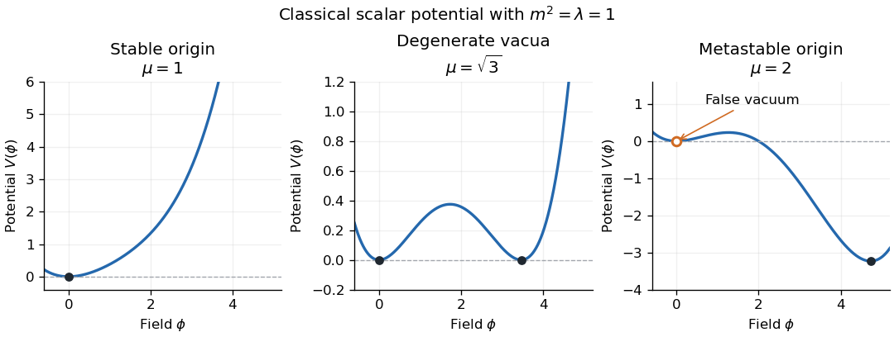

# Paper 49

↑ **Parent:** [Iii](../iii.md)

[https://www.maths.cam.ac.uk/postgrad/part-iii/files/pastpapers/2005/Paper49.pdf](https://www.maths.cam.ac.uk/postgrad/part-iii/files/pastpapers/2005/Paper49.pdf)

**Table of contents**

- [1](#1)
  - [Solution](#1/solution)
- [2](#2)
  - [Solution](#2/solution)
- [3](#3)
  - [Solution](#3/solution)
- [4](#4)
  - [a](#4/a)
    - [Solution](#4/a/solution)
  - [b](#4/b)
    - [Solution](#4/b/solution)
  - [c](#4/c)
    - [Solution](#4/c/solution)
  - [d](#4/d)
    - [Solution](#4/d/solution)

## 1

↑ **Parent:** [Paper 49](paper-49.md)

<h3 id="1/solution">Solution</h3>

↑ **Parent:** [1](#1)

Use the [Minkowski metric](../../../special-relativity.md#minkowski-metric) $\eta=\operatorname{diag}(1,-1,-1,-1)$ and the free [real scalar field](../../../scalar-field-theory.md#real-scalar-field) Lagrangian density $\mathcal L=\tfrac12\partial_\mu\phi\partial^\mu\phi-\tfrac12m^2\phi^2$. Its conjugate [canonical momentum](../../../classical-mechanics.md#canonical-momentum) is $\pi=\dot\phi$. Spatial [translation symmetry](../../../physics.md#translational-symmetry) and [Noether's theorem](../../../calculus-of-variations.md#noether-conserved-quantity-for-a-mechanical-point-symmetry) give the [canonical stress-energy tensor](../../../quantum-field-theory.md#canonical-stress-energy-tensor)

$$
T^{\mu\nu}=\partial^\mu\phi\partial^\nu\phi-\eta^{\mu\nu}\mathcal L,
\qquad
\partial_\mu T^{\mu\nu}=(\Box\phi+m^2\phi)\partial^\nu\phi=0.
$$

Vanishing boundary flux then makes the [four-momentum of a free real scalar field](../../../quantum-field-theory.md#four-momentum-of-a-free-real-scalar-field) constant. In particular the contravariant spatial [momentum](../../../classical-mechanics.md#momentum) is

$$
\boxed{\mathbf P=-\int\pi\,\boldsymbol\nabla\phi\,d^3x}.
$$

The minus sign is from $\partial^i=-\partial_i$; it is essential for the following mode calculation.

In the quantized theory, insert the mode expansions into this integral, using a Hermitian symmetric ordering or [normal ordering](../../../perturbative-quantum-field-theory.md#normal-ordering). Write $\int_{\mathbf p}=\int d^3p/(2\pi)^3$. The spatial integral is $(2\pi)^3\delta^{(3)}(\mathbf p\pm\mathbf k)$, leaving

$$
\mathbf P=\frac12\int_{\mathbf p}\mathbf p\left(a_{\mathbf p}a_{\mathbf p}^\dagger+a_{\mathbf p}^\dagger a_{\mathbf p}
-a_{-\mathbf p}a_{\mathbf p}-a_{-\mathbf p}^\dagger a_{\mathbf p}^\dagger\right).
$$

Each last term integrates to zero: replace $\mathbf p$ by $-\mathbf p$ and commute the two [annihilation operators](../../../quantum-mechanics.md#annihilation-operator) or the two [creation operators](../../../quantum-mechanics.md#creation-operator). The mixed terms reorder by the [canonical commutation relation](../../../quantum-mechanics.md#canonical-commutation-relation). Their vacuum contribution is proportional to the integral of the odd vector $\mathbf p$ and vanishes with an inversion-symmetric regulator; [normal ordering](../../../perturbative-quantum-field-theory.md#normal-ordering) removes it directly. Thus the [normal-ordered free scalar four-momentum](../../../quantum-field-theory.md#normal-ordered-free-scalar-four-momentum) has spatial part

$$
\boxed{\mathbf P=\int_{\mathbf p}\mathbf p\,a_{\mathbf p}^\dagger a_{\mathbf p}}.
$$

These manipulations can be made first with box modes and a symmetric [momentum](../../../classical-mechanics.md#momentum) cutoff, then used on finite-particle wave packets.

The [commutator derivation identity](../../../lie-algebra.md#commutator-derivation-identity) gives

$$
[P_i,a_{\mathbf q}^\dagger]=\int_{\mathbf p}p_i a_{\mathbf p}^\dagger[a_{\mathbf p},a_{\mathbf q}^\dagger]
=q_i a_{\mathbf q}^\dagger,
\qquad [P_i,a_{\mathbf q}]=-q_i a_{\mathbf q}.
$$

For $U(\mathbf y)=e^{-i\mathbf P\cdot\mathbf y}$, the [commutator expansion for exponential conjugation](../../../lie-algebra.md#commutator-expansion-for-exponential-conjugation) therefore gives the [translation of a scalar creation operator](../../../quantum-field-theory.md#translation-of-a-scalar-creation-operator)

$$
\boxed{U(\mathbf y)a_{\mathbf q}^\dagger U(\mathbf y)^\dagger
=e^{-i\mathbf q\cdot\mathbf y}a_{\mathbf q}^\dagger}.
$$

The vacuum has zero [momentum](../../../classical-mechanics.md#momentum), so $U|0\rangle=|0\rangle$. Hence the one-particle [momentum eigenstate](../../../quantum-mechanics.md#momentum-eigenstate) obeys $U|\mathbf q\rangle=e^{-i\mathbf q\cdot\mathbf y}|\mathbf q\rangle$: translation preserves its [momentum](../../../classical-mechanics.md#momentum) and multiplies it by the associated phase.

The [annihilation operator](../../../quantum-mechanics.md#annihilation-operator) receives the opposite phase. Substituting both phases into the field expansion gives

$$
\boxed{U(\mathbf y)\phi(\mathbf x)U(\mathbf y)^\dagger=\phi(\mathbf x+\mathbf y)}.
$$

This is the specified conjugation convention for the [spatial translation operator](../../../quantum-mechanics.md#spatial-translation-operator). On states, the active translation moves a wave packet by $\mathbf y$, giving a position wavefunction $\psi(\mathbf x-\mathbf y)$. Conjugating the field by $U^\dagger$ instead would give the opposite argument shift. Infinitesimally the displayed result is $[P_i,\phi]=i\partial_i\phi$.

## 2

↑ **Parent:** [Paper 49](paper-49.md)

<h3 id="2/solution">Solution</h3>

↑ **Parent:** [2](#2)

Direct multiplication of the [gamma matrices](../../../algebra.md#gamma-matrices) in the [chiral representation](../../../algebra.md#chiral-gamma-matrix-representation) gives

$$
\boxed{\gamma^5=i\gamma^0\gamma^1\gamma^2\gamma^3=
\begin{pmatrix}-I_2&0\\0&I_2\end{pmatrix}}.
$$

For example $\sigma^1\sigma^2\sigma^3=iI_2$ by the [Pauli matrix multiplication law](../../../algebra.md#pauli-matrix-multiplication-law), and the block multiplications give the displayed signs. Every $\gamma^\mu$ is off-diagonal in this representation, whereas the [chirality matrix](../../../algebra.md#chirality-matrix) has opposite diagonal blocks. Therefore $\gamma^5\gamma^\mu+\gamma^\mu\gamma^5=0$ for all $\mu$.

The left-handed [chirality](../../../relativistic-quantum-field.md#chirality-physics) condition makes the plane-wave coefficient $\lambda(p)=\binom{\chi}{0}$. With $p\cdot x=Ex^0-\mathbf p\cdot\mathbf x$, the [Dirac equation](../../../relativistic-quantum-field.md#dirac-equation) gives

$$
\not p\,\lambda(p)=0
\quad\Longleftrightarrow\quad
(EI_2+\boldsymbol\sigma\cdot\mathbf p)\chi=0.
$$

Since $(\boldsymbol\sigma\cdot\mathbf p)^2=|\mathbf p|^2I_2$, its [determinant](../../../linear-algebra.md#determinant) is $E^2-|\mathbf p|^2$. A nonzero [spinor](../../../algebra.md#spinor) therefore exists exactly when

$$
\boxed{p^2=0}.
$$

For nonzero [momentum](../../../classical-mechanics.md#momentum), put $r=|\mathbf p|$ and write its direction as $(\sin\vartheta\cos\varphi,\sin\vartheta\sin\varphi,\cos\vartheta)$. Normalized [eigenvectors](../../../linear-operator-theory.md#eigenvector) of $\boldsymbol\sigma\cdot\widehat{\mathbf p}$ are

$$
\chi_-=
\begin{pmatrix}-e^{-i\varphi}\sin(\vartheta/2)\\\cos(\vartheta/2)\end{pmatrix},
\qquad
\chi_+=\begin{pmatrix}\cos(\vartheta/2)\\e^{i\varphi}\sin(\vartheta/2)\end{pmatrix}.
$$

The general nonzero solution is $\lambda(p)=C\binom{\chi_-}{0}$ for $E=r$ and $\lambda(p)=C\binom{\chi_+}{0}$ for $E=-r$, with arbitrary nonzero complex normalization $C$. At $p=0$ any constant two-component $\chi$ solves the equation, but the [momentum](../../../classical-mechanics.md#momentum) direction and [helicity](../../../special-relativity.md#helicity) are undefined. For the physical positive-energy branch this is the [left-handed massless plane-wave spinor](../../../relativistic-quantum-field.md#left-handed-massless-plane-wave-spinor).

A rotation by angle $\alpha$ about $\widehat{\mathbf p}$ acts on the two-component [spinor](../../../algebra.md#spinor) as

$$
S(R)=e^{-i\alpha\boldsymbol\sigma\cdot\widehat{\mathbf p}/2}.
$$

The plane-wave argument is unchanged because the rotation fixes $\mathbf p$, and $S(R)\chi_-=e^{i\alpha/2}\chi_-$. Thus the positive-energy solution has [helicity](../../../special-relativity.md#helicity) $h=-1/2$, where a helicity-$h$ state has rotation phase $e^{-i\alpha h}$. The negative-energy coefficient has the opposite [spinor](../../../algebra.md#spinor) phase.

In a quantized complex left-handed [Weyl field](../../../relativistic-quantum-field.md#weyl-field), the positive-frequency term annihilates particles and the negative-frequency term creates antiparticles. Reinterpreting negative energy also reverses its spatial [momentum](../../../classical-mechanics.md#momentum); for the positive physical [momentum](../../../classical-mechanics.md#momentum) the two [spinor](../../../algebra.md#spinor) coefficients have the same left-chiral kernel. Because one multiplies an [annihilation operator](../../../quantum-mechanics.md#annihilation-operator) and the other a [creation operator](../../../quantum-mechanics.md#creation-operator), the corresponding particle and antiparticle state phases are conjugate. The [helicity content of a quantized Weyl field](../../../relativistic-quantum-field.md#helicity-content-of-a-quantized-weyl-field) is consequently

$$
\boxed{h_{\rm particle}=-\tfrac12,\qquad h_{\rm antiparticle}=+\tfrac12}.
$$

There is one particle spin state at each nonzero [momentum](../../../classical-mechanics.md#momentum), rather than the two helicities supplied by a full massless [Dirac field](../../../relativistic-quantum-field.md#dirac-field). The right-handed [Weyl field](../../../relativistic-quantum-field.md#weyl-field) interchanges these signs. This is the massless relation between [chirality](../../../relativistic-quantum-field.md#chirality-physics) and [helicity](../../../special-relativity.md#helicity); it does not identify them for a massive field.

## 3

↑ **Parent:** [Paper 49](paper-49.md)

<h3 id="3/solution">Solution</h3>

↑ **Parent:** [3](#3)

Split the free [interaction picture](../../../quantum-mechanics.md#interaction-picture) field as $\phi=\phi^{(+)}+\phi^{(-)}$, where the first part contains [annihilation operators](../../../quantum-mechanics.md#annihilation-operator) and the second [creation operators](../../../quantum-mechanics.md#creation-operator). [Time ordering](../../../perturbative-quantum-field-theory.md#time-ordering) places the operator at the later time on the left, while [normal ordering](../../../perturbative-quantum-field-theory.md#normal-ordering) places all [creation operators](../../../quantum-mechanics.md#creation-operator) on the left. For $x^0>y^0$, commuting the annihilation part of the first field through the creation part of the second gives

$$
\phi(x)\phi(y)=:\phi(x)\phi(y):+[\phi^{(+)}(x),\phi^{(-)}(y)].
$$

The [commutator](../../../lie-algebra.md#commutator) is the c-number

$$
[\phi^{(+)}(x),\phi^{(-)}(y)]
=\int\frac{d^3p}{(2\pi)^3}\frac{e^{-ip\cdot(x-y)}}{2E_{\mathbf p}}.
$$

For $y^0>x^0$, the same calculation interchanges $x,y$. Combining the two time orders proves the [two-field Wick contraction identity](../../../perturbative-quantum-field-theory.md#two-field-wick-contraction-identity)

$$
\boxed{T\phi(x)\phi(y)=:\phi(x)\phi(y):+D_F(x-y)},
$$

where

$$
D_F(x-y)=\langle0|T\phi(x)\phi(y)|0\rangle
=\int\frac{d^4p}{(2\pi)^4}\frac{i\,e^{-ip\cdot(x-y)}}{p^2-m^2+i0}.
$$

The equality with the four-dimensional integral follows by closing the energy contour at the positive-energy pole for $x^0>y^0$ and the negative-energy pole for the reverse order. This fixes the [scalar Feynman propagator pole prescription](../../../quantum-field-theory.md#scalar-feynman-propagator-pole-prescription); in this convention $D_F$ itself includes the factor $i$.

Because these interactions have no derivatives, $H_{\rm int}=-\int\mathcal L_{\rm int}d^3x$. Expand the [Dyson series](../../../perturbative-quantum-field-theory.md#dyson-series)

$$
S=T\exp\left(i\int d^4z\left[\frac{\mu}{3!}\phi(z)^3-\frac{\lambda}{4!}\phi(z)^4\right]\right).
$$

Apply the [Wick theorem](../../../perturbative-quantum-field-theory.md#wick-s-theorem) to each term together with the external insertions. Every paired field contributes a propagator, and the remaining normal-ordered vacuum expectation vanishes unless no fields remain. Representing the propagators by Fourier integrals and integrating each vertex position gives the [four-momentum conservation](../../../special-relativity.md#four-momentum-conservation) delta function. The $3!$ and $4!$ contractions into labelled vertex slots cancel the factorials in the interaction density. The resulting [scalar-field cubic and quartic Feynman vertices](../../../perturbative-quantum-field-theory.md#scalar-field-cubic-and-quartic-feynman-vertices) are

$$
\boxed{\text{propagator: }\frac{i}{p^2-m^2+i0},\qquad
\text{cubic vertex: }i\mu,\qquad
\text{quartic vertex: }-i\lambda}.
$$

Each vertex also has $(2\pi)^4\delta^{(4)}(\sum p)$, each independent internal [momentum](../../../classical-mechanics.md#momentum) is integrated with $d^4p/(2\pi)^4$, and repeated equivalent contractions give the usual [Feynman-diagram symmetry factor](../../../perturbative-quantum-field-theory.md#feynman-diagram-symmetry-factor). For the unamputated correlation functions, retain the propagators joining external insertions to vertices. The displayed unnormalized numerator includes disconnected [vacuum bubbles](../../../perturbative-quantum-field-theory.md#vacuum-feynman-diagram); dividing by $\langle0|S|0\rangle$ cancels them. Amputated [scattering amplitudes](../../../quantum-mechanics.md#scattering-amplitude) additionally use the [LSZ reduction formula](../../../perturbative-quantum-field-theory.md#lsz-reduction-formula).

For stability, examine the classical [scalar potential](../../../quantum-field-theory.md#scalar-potential)

$$
V(\phi)=\frac12m^2\phi^2-\frac{\mu}{6}\phi^3+\frac{\lambda}{24}\phi^4.
$$

The tree-level boundedness criterion is **$\lambda>0$**, with arbitrary real cubic coupling. If $\lambda=0$, boundedness requires $\mu=0$ and $m^2\ge0$; if $\lambda<0$, or $\lambda=0$ with $\mu\ne0$, the potential is unbounded below. Thus a positive quartic coupling permits a stable ground-state vacuum, although it need not be the perturbative vacuum at $\phi=0$.

For $\lambda>0$ and $m^2\ge0$, the [stability of a cubic-quartic scalar potential](../../../quantum-field-theory.md#stability-of-a-cubic-quartic-scalar-potential) determines when zero is a global minimum:

$$
V(\phi)=\phi^2\left[\frac{\lambda}{24}\left(\phi-\frac{2\mu}{\lambda}\right)^2
+\frac{m^2}{2}-\frac{\mu^2}{6\lambda}\right].
$$

The square bracket is nonnegative for every field value exactly when

$$
\boxed{\mu^2\le3\lambda m^2}.
$$

For a nontrivial equality case there is a second degenerate minimum at $\phi=2\mu/\lambda$. If $m^2>0$ and $\mu^2>3\lambda m^2$, zero remains a local minimum but is a [false vacuum](../../../quantum-field-theory.md#false-vacuum), with a lower minimum elsewhere. If $m^2=\mu=0$ and $\lambda>0$, the origin is the quartic minimum despite its vanishing quadratic curvature. These are classical or tree-level stability statements; renormalized couplings and the [quantum effective potential](../../../perturbative-quantum-field-theory.md#quantum-effective-potential) refine the quantum analysis.

**[Figure 1](#3/image-stable-degenerate-and-metastable-scalar-vacua). Stable, degenerate and metastable scalar vacua**.

## 4

↑ **Parent:** [Paper 49](paper-49.md)

<h3 id="4/a">a</h3>

↑ **Parent:** [4](#4)

<h4 id="4/a/solution">Solution</h4>

↑ **Parent:** [A](#4/a)

Choose the phase convention in the question and use the [gauge covariant derivative](../../../relativistic-quantum-field.md#gauge-covariant-derivative) $D_\mu=\partial_\mu+ieA_\mu$. For a charged [Dirac field](../../../relativistic-quantum-field.md#dirac-field), the [quantum electrodynamics](../../../perturbative-quantum-field-theory.md#quantum-electrodynamics) Lagrangian is

$$
\mathcal L=-\frac14F_{\mu\nu}F^{\mu\nu}+\bar\psi(i\gamma^\mu D_\mu-m)\psi,
\qquad F_{\mu\nu}=\partial_\mu A_\nu-\partial_\nu A_\mu.
$$

The simultaneous local [gauge transformation](../../../electromagnetism.md#gauge-transformation) is

$$
\boxed{\psi'=e^{ie\chi}\psi,\qquad
\bar\psi'=\bar\psi e^{-ie\chi},\qquad A'_\mu=A_\mu-\partial_\mu\chi}.
$$

Direct differentiation gives $D'_\mu\psi'=e^{ie\chi}D_\mu\psi$: the derivative of the phase cancels the shift of $A_\mu$. The mass term and covariant kinetic term are therefore invariant. The [electromagnetic field tensor](../../../electromagnetism.md#electromagnetic-field-tensor) is unchanged because mixed partial derivatives of $\chi$ commute. This proves classical [gauge invariance](../../../relativistic-quantum-field.md#gauge-invariance) of the coupled field action. A charged scalar similarly uses $(D_\mu\phi)^*D^\mu\phi$ and a potential depending only on $|\phi|^2$.

The electromagnetic coupling is $-eA_\mu\bar\psi\gamma^\mu\psi$. The matter equations give a conserved current $j^\mu=e\bar\psi\gamma^\mu\psi$, with $\partial_\mu j^\mu=0$. Constant $\chi$ gives the global symmetry and its conserved charge. When applying [Noether's theorem](../../../calculus-of-variations.md#noether-conserved-quantity-for-a-mechanical-point-symmetry), the sign of the parameterized Noether generator can be reversed without changing this conservation law; the transformation and coupling signs above remain fixed.

<h3 id="4/b">b</h3>

↑ **Parent:** [4](#4)

<h4 id="4/b/solution">Solution</h4>

↑ **Parent:** [B](#4/b)

A constant phase leaves the photon unchanged and makes every QED interaction vertex invariant: its one $\psi$ and one $\bar\psi$ acquire opposite phases. Thus the propagators and vertex factors in the [QED Feynman rules](../../../perturbative-quantum-field-theory.md#qed-feynman-rules) are unchanged. A Green function with $n$ insertions of $\psi$ and $\bar n$ of $\bar\psi$ acquires the phase $e^{ie\chi(n-\bar n)}$. For an invariant vacuum it can be nonzero only when its total inserted charge is zero.

Equivalently, the conserved charge operator $Q$ commutes with the [S-matrix](../../../quantum-mechanics.md#s-matrix). If initial and final states have charges $Q_i,Q_f$, then

$$
0=\langle f|[Q,S]|i\rangle=(Q_f-Q_i)\langle f|S|i\rangle.
$$

The [scattering charge selection rule from global gauge symmetry](../../../quantum-field-theory.md#scattering-charge-selection-rule-from-global-gauge-symmetry) is therefore

$$
\boxed{\langle f|S|i\rangle\ne0\quad\Longrightarrow\quad Q_f=Q_i}.
$$

In diagrams the oriented fermion lines preserve charge at every vertex, and a photon is neutral. Pair creation is allowed because a particle and its antiparticle have opposite charges. Global phase invariance supplies this selection rule; local [gauge invariance](../../../relativistic-quantum-field.md#gauge-invariance) supplies the stronger momentum-dependent [Ward-Takahashi identity](../../../perturbative-quantum-field-theory.md#ward-identity).

<h3 id="4/c">c</h3>

↑ **Parent:** [4](#4)

<h4 id="4/c/solution">Solution</h4>

↑ **Parent:** [C](#4/c)

The Maxwell quadratic action has a null longitudinal direction: its momentum-space kinetic operator annihilates $k_\mu$, reflecting [gauge invariance](../../../relativistic-quantum-field.md#gauge-invariance) under addition of a gradient to the potential. It cannot be inverted on all four vector components before [gauge fixing](../../../relativistic-quantum-field.md#gauge-fixing).

Add the [covariant gauge](../../../relativistic-quantum-field.md#covariant-gauge) density $\mathcal L_{\rm gf}=-(\partial_\mu A^\mu)^2/(2\xi)$. Away from the pole, introduce the [transverse and longitudinal momentum projectors](../../../quantum-field-theory.md#transverse-and-longitudinal-momentum-projectors)

$$
P^{\rm L}_{\mu\nu}=\frac{k_\mu k_\nu}{k^2},\qquad
P^{\rm T}_{\mu\nu}=\eta_{\mu\nu}-P^{\rm L}_{\mu\nu}.
$$

With one index raised they obey $P^{\rm T}+P^{\rm L}=I$, $(P^{\rm T})^2=P^{\rm T}$, $(P^{\rm L})^2=P^{\rm L}$ and $P^{\rm T}P^{\rm L}=0$. The gauge-fixed kinetic operator is $K=-k^2(P^{\rm T}+\xi^{-1}P^{\rm L})$. Its inverse times $i$ gives the [photon propagator](../../../quantum-field-theory.md#photon-propagator)

$$
\boxed{D^{(\xi)}_{\mu\nu}(k)=\frac{-i}{k^2+i0}\left(\eta_{\mu\nu}-(1-\xi)\frac{k_\mu k_\nu}{k^2}\right)}.
$$

The pole factors are interpreted with the Feynman boundary prescription; the algebraic projector inversion is performed off the pole. The choice $\xi=1$ is [Feynman gauge](../../../relativistic-quantum-field.md#feynman-gauge).

Changing $\xi$ changes only a longitudinal term proportional to $k_\mu k_\nu$. Between conserved currents it vanishes because $k_\mu J^\mu=0$. In full QED amplitudes, the [Ward-Takahashi identity](../../../perturbative-quantum-field-theory.md#ward-identity) supplies the corresponding cancellations when all diagrams at an order are combined. Thus physical on-shell scattering is gauge-parameter independent, whereas off-shell Green functions and the propagator itself can depend on the gauge choice. For the charged scalar, derivative vertices and contact terms must likewise be included for this cancellation.

<h3 id="4/d">d</h3>

↑ **Parent:** [4](#4)

<h4 id="4/d/solution">Solution</h4>

↑ **Parent:** [D](#4/d)

The [covariant Landau gauge](../../../relativistic-quantum-field.md#landau-gauge-quantum-field-theory) is the zero-parameter limit $\xi\to0$ of the covariant gauge family. It imposes the [Lorenz gauge](../../../electromagnetism.md#lorenz-gauge-condition) condition $\partial_\mu A^\mu=0$ sharply. The [Landau gauge photon propagator](../../../relativistic-quantum-field.md#landau-gauge-photon-propagator) is the transverse part of the inverse from [solution](#4/c/solution):

$$
\boxed{D^{\rm L}_{\mu\nu}(k)=\frac{-i}{k^2+i0}\left(\eta_{\mu\nu}-\frac{k_\mu k_\nu}{k^2}\right)}.
$$

Away from the pole, $k^\mu D^{\rm L}_{\mu\nu}=0$, matching the divergence-free condition. This is transversality to the [four-momentum](../../../special-relativity.md#four-momentum), rather than a projector onto only the two physical spatial photon polarizations. The [Lorenz gauge](../../../electromagnetism.md#lorenz-gauge-condition) equation alone still admits residual [gauge transformations](../../../electromagnetism.md#gauge-transformation) with $\Box\chi=0$; boundary conditions and the pole prescription complete the propagator choice. The parameter limit specifies the Landau propagator without trying to invert the ungauged Maxwell operator on its longitudinal null space.

## ↑ Ancestors (8)

1. [Iii](../iii.md)
2. [2005](../../2005.md)
3. [Past exam of the mathematics course of the University of Cambridge](../../../past-exam-of-the-mathematics-course-of-the-university-of-cambridge.md)
4. [Mathematics course of the University of Cambridge](../../../university-of-cambridge.md#mathematics-course-of-the-university-of-cambridge)
5. [Course of the University of Cambridge](../../../university-of-cambridge.md#course-of-the-university-of-cambridge)
6. [University of Cambridge](../../../university-of-cambridge.md)
7. [List of universities](../../../README.md#list-of-universities)
8. [Codex Wiki](../../../README.md)
