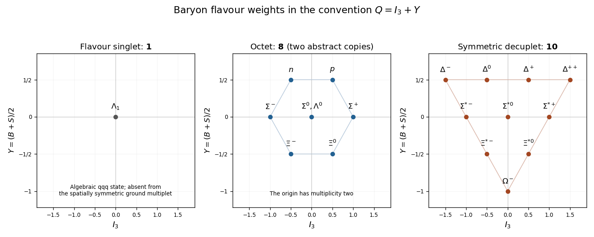

<h1 id="2/solution">Solution</h1>

↑ **Parent:** [2](../2.md)

When the three light-quark masses are equal, the mass term is proportional to the identity in flavour space, so rotating $q=(u,d,s)$ by [SU(3)](../../../../../su-3-group.md) leaves it unchanged. The gluon coupling is also flavour blind. Nearly equal masses therefore give an approximate [flavour symmetry](../../../../../flavor-symmetry.md), distinct from the exact colour gauge symmetry. The [quark](../../../../../quark.md) transforms as $\mathbf3$ and the [antiquark](../../../../../antiquark.md) as $\overline{\mathbf3}$.

For [mesons](../../../../../meson.md), a quark-antiquark tensor is a $3\times3$ matrix. Its trace and traceless parts are invariant subspaces, giving

$$
\boxed{\mathbf3\otimes\overline{\mathbf3}=\mathbf1\oplus\mathbf8.}
$$

The trace is the [eta singlet state](../../../../../eta-singlet-state.md); the traceless part is the [meson octet](../../../../../meson-octet.md). For [baryons](../../../../../baryon.md), first separate a pair of [quarks](../../../../../quark.md) into symmetric and antisymmetric tensors:

$$
\mathbf3\otimes\mathbf3=\mathbf6\oplus\overline{\mathbf3}.
$$

The antisymmetric pair transforms as $\overline{\mathbf3}$ by contraction with the invariant epsilon tensor. In $\mathbf6\otimes\mathbf3$, complete symmetrization gives $\operatorname{Sym}^3\mathbf3$ of dimension $\binom53=10$; the remaining mixed-symmetry subspace has dimension eight. In $\overline{\mathbf3}\otimes\mathbf3$, trace and traceless parts give a singlet and another octet. Thus the [tensor cube of the defining SU(3) representation](../../../../../tensor-cube-of-the-defining-su-3-representation.md) is

$$
\boxed{\mathbf3^{\otimes3}=\mathbf{10}\oplus\mathbf8\oplus\mathbf8\oplus\mathbf1.}
$$

The two octets carry the two mixed permutation-symmetry components. Their [weight diagrams](../../../../../weight-diagram.md) are identical; the extra copy is a multiplicity, not a new arrangement of weights.

The printed charge relation fixes the [half-hypercharge convention](../../../../../half-hypercharge-convention.md), rather than the usual [Flavor hypercharge](../../../../../flavor-hypercharge.md) normalization:

$$
Q=I_3+Y,\qquad Y=\frac{B+S}{2}.
$$

The [quark](../../../../../quark.md) weights $(I_3,Y)$ are $u:(1/2,1/6)$, $d:(-1/2,1/6)$, $s:(0,-1/3)$; adding three weights gives the [baryon weight diagrams in the half-hypercharge convention](../../../../../baryon-weight-diagrams-in-the-half-hypercharge-convention.md). The [baryon octet](../../../../../baryon-octet.md) has $(p,n)$ at $Y=1/2$, the isotriplet $(\Sigma^+,\Sigma^0,\Sigma^-)$ and the isosinglet $\Lambda^0$ at $Y=0$, and $(\Xi^0,\Xi^-)$ at $Y=-1/2$. The [baryon decuplet](../../../../../baryon-decuplet.md) has rows $\Delta$ at $Y=1/2$, $\Sigma^*$ at zero, $\Xi^*$ at $-1/2$, and $\Omega^-$ at $-1$. The three-quark flavour singlet is the antisymmetric $uds$ state at $(0,0)$.

**[Figure 1](#2/image-flavour-singlet-octet-and-decuplet-baryon-weights-with-y-equal-to-half-the-usual-hypercharge). Flavour-singlet, octet and decuplet baryon weights with Y equal to half the usual hypercharge**.

The fully symmetric flavour representation is precisely the [baryon decuplet](../../../../../baryon-decuplet.md), $\mathbf{10}=\operatorname{Sym}^3\mathbf3$. For a spatial [ground state](../../../../../ground-state.md), the orbital wavefunction is symmetric. Spin $3/2$ is the symmetric part of three spin-$1/2$ [quarks](../../../../../quark.md), so a spin-$3/2$ decuplet would have a completely symmetric space-spin-flavour wavefunction. In particular the $uuu$ state with all spins aligned has no antisymmetric factor. This conflicts with the [Pauli exclusion principle](../../../../../pauli-exclusion-principle.md) for the three [fermions](../../../../../fermion.md).

An additional colour degree of freedom resolves the conflict. With three colour labels the normalized colour state is

$$
|\mathrm{colour}\rangle=\frac1{\sqrt6}\epsilon_{abc}|a\rangle|b\rangle|c\rangle.
$$

It is completely antisymmetric and an [SU(3)](../../../../../su-3-group.md) colour singlet. Multiplying it by the symmetric remaining wavefunction gives the required fermionic antisymmetry. Three orthogonal labels are the minimum needed for a nonzero third [exterior power](../../../../../exterior-power.md): $\bigwedge^3\mathbb C^m=0$ for $m<3$. Thus the decuplet suggests at least three colour states, and three supply the minimal colour-singlet construction used in the [quark model](../../../../../quark-model.md). This argument motivates three colours rather than deriving their exact number without further physical input.

The [Pauli constraint on three-quark flavour multiplets](../../../../../pauli-constraint-on-three-quark-flavour-multiplets.md) also explains the absence of a flavour-singlet [baryon](../../../../../baryon.md) in the lowest spatial multiplet. After extracting the antisymmetric colour factor, spin-flavour must be symmetric. Singlet flavour is completely antisymmetric, so its spin factor would also have to be completely antisymmetric. But

$$
\bigwedge^3\mathbb C^2=0,
$$

so three spin-$1/2$ [quarks](../../../../../quark.md) have no such spin state. By contrast, mixed flavour and mixed spin can combine symmetrically to produce the ground-state [baryon octet](../../../../../baryon-octet.md) with spin $1/2$. The two abstract flavour-octet copies do not imply two independent ground-state octets after the full [Pauli constraint on three-quark flavour multiplets](../../../../../pauli-constraint-on-three-quark-flavour-multiplets.md) is applied. Excited orbital wavefunctions can permit [three-quark flavour singlet](../../../../../three-quark-flavour-singlet.md); the exclusion is for the spatially symmetric low-energy ground multiplet, not for every [baryon](../../../../../baryon.md) at every energy.

A flavour-singlet [meson](../../../../../meson.md) is allowed: a [quark](../../../../../quark.md) and an [antiquark](../../../../../antiquark.md) are not three identical [fermions](../../../../../fermion.md), and the invariant flavour combination $(u\bar u+d\bar d+s\bar s)/\sqrt3$ can combine with an appropriate spin and colour singlet. The missing three-spin antisymmetric state therefore causes no [meson](../../../../../meson.md) exclusion.

Finally, $\pi^+p$ has [baryon number](../../../../../baryon-number.md) one, [strangeness](../../../../../strangeness.md) zero and $I_3=3/2$, so it is a pure $I=3/2$ channel. These quantum numbers match the $uuu$ [Delta baryon](../../../../../delta-baryon.md) $\Delta^{++}$, the low-energy resonance with spin $3/2$. For $K^+p$, the [kaon](../../../../../kaon.md) $u\bar s$ contributes [strangeness](../../../../../strangeness.md) plus one, giving total $B=1$, $S=+1$. No ordinary $qqq$ [baryon](../../../../../baryon.md) can have positive [strangeness](../../../../../strangeness.md), since every $s$ [quark](../../../../../quark.md) contributes minus one. Hence that channel has no matching state in the ordinary low-energy three-quark multiplets. A resonance would require exotic [quark](../../../../../quark.md) content, for example $uuud\bar s$, and is not mandated by this spectrum. This is [strangeness selection in pion-proton and kaon-proton resonances](../../../../../strangeness-selection-in-pion-proton-and-kaon-proton-resonances.md).

## ↑ Ancestors (10)

1. [2](../2.md)
2. [Paper 50](../../paper-50-split.md)
3. [Iii](../../split.md)
4. [2005](../../../split.md)
5. [Past exam of the mathematics course of the University of Cambridge](../../../../split.md)
6. [Mathematics course of the University of Cambridge](../../../../../mathematics-course-of-the-university-of-cambridge.md)
7. [Course of the University of Cambridge](../../../../../course-of-the-university-of-cambridge.md)
8. [University of Cambridge](../../../../../university-of-cambridge-split.md)
9. [List of universities](../../../../../list-of-universities.md)
10. [Codex Wiki](../../../../../split.md)
