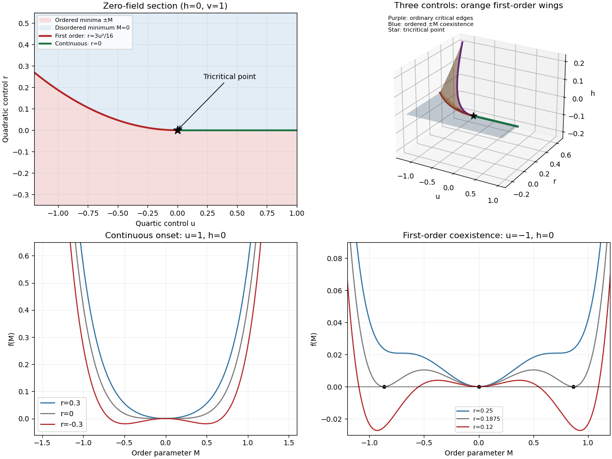

# Paper 51

↑ **Parent:** [Iii](../iii.md)

[https://www.maths.cam.ac.uk/postgrad/part-iii/files/pastpapers/2005/Paper51.pdf](https://www.maths.cam.ac.uk/postgrad/part-iii/files/pastpapers/2005/Paper51.pdf)

**Table of contents**

- [1](#1)
  - [Solution](#1/solution)
  - [a](#1/a)
    - [Solution](#1/a/solution)
  - [b](#1/b)
    - [Solution](#1/b/solution)
  - [c](#1/c)
    - [Solution](#1/c/solution)
  - [d](#1/d)
    - [Solution](#1/d/solution)
  - [e](#1/e)
    - [Solution](#1/e/solution)
  - [f](#1/f)
    - [Solution](#1/f/solution)
  - [g](#1/g)
    - [Solution](#1/g/solution)
- [2](#2)
  - [Solution](#2/solution)
- [3](#3)
  - [Solution](#3/solution)
  - [a](#3/a)
    - [Solution](#3/a/solution)
  - [b](#3/b)
    - [Solution](#3/b/solution)
  - [c](#3/c)
    - [Solution](#3/c/solution)
  - [d](#3/d)
    - [Solution](#3/d/solution)
  - [e](#3/e)
    - [Solution](#3/e/solution)
  - [f](#3/f)
    - [Solution](#3/f/solution)

## 1

↑ **Parent:** [Paper 51](paper-51.md)

<h3 id="1/solution">Solution</h3>

↑ **Parent:** [1](#1)

A [phase diagram](../../../thermodynamics.md#phase-diagram) partitions a space of thermodynamic controls into regions with distinct equilibrium phases. Its boundaries indicate [phase coexistence](../../../critical-phenomenon.md#phase-coexistence) or [continuous phase transitions](../../../critical-phenomenon.md#continuous-phase-transition); a [critical point](../../../analysis.md#critical-point) is a termination of coexistence where the distinction between phases disappears. A concrete three-dimensional control space is $(T,\Delta,h)$ for the [Blume–Capel model](../../../statistical-physics.md#blume-capel-model): a spin can be $0$ or $\pm1$, the exchange favors aligned nonzero spins, and $\Delta$ controls the energetic cost of nonzero spins. Varying $\Delta$ changes the balance between a continuous ordering transition and a [first-order phase transition](../../../thermodynamics.md#first-order-phase-transition). Their meeting is a [tricritical point](../../../critical-phenomenon.md#tricritical-point).

Locally, the same structure is displayed by the [Landau free energy](../../../critical-phenomenon.md#landau-free-energy)

$$
f(M)=\frac r2M^2+\frac u4M^4+\frac v6M^6-hM,\qquad v>0,
$$

with three controls $(r,u,h)$. For $u>0$, the line $r=h=0$ consists of ordinary [critical points](../../../analysis.md#critical-point). For $u<0$, equal free energies of $M=0$ and a nonzero stationary point require

$$
r+uM^2+vM^4=0,\qquad \frac r2M^2+\frac u4M^4+\frac v6M^6=0.
$$

Eliminating $r$ gives the [tricritical three-phase line](../../../critical-phenomenon.md#tricritical-three-phase-line)

$$
\boxed{M^2=-\frac{3u}{4v},\qquad r=\frac{3u^2}{16v},\qquad h=0.}
$$

Here $M=0$ and both signs of $M$ coexist, with a discontinuous [order parameter](../../../critical-phenomenon.md#order-parameter). Below this line, or below $r=0$ when $u>0$, the plane $h=0$ is an ordered [phase coexistence](../../../critical-phenomenon.md#phase-coexistence) sheet: crossing it reverses the sign of $M$. Two [tricritical wings](../../../critical-phenomenon.md#tricritical-wing) also extend to nonzero $h$, separating weakly and strongly magnetized states of the same sign. Their ordinary [critical points](../../../analysis.md#critical-point) satisfy $f'=f''=f'''=0$. Since $f'''=6uM+20vM^3$, their [tricritical wing critical edges](../../../critical-phenomenon.md#tricritical-wing-critical-edge) are

$$
M_c^2=-\frac{3u}{10v},\qquad r_c=\frac{9u^2}{20v},\qquad h_c=\frac{6u^2}{25v}M_c.
$$

At these edges $f''''=-12u>0$, giving an ordinary quartic critical expansion around $M_c$. All these structures end at **the tricritical point $r=u=h=0$**. The diagrams show both the zero-field section and the genuinely three-dimensional coexistence structure.

**[Figure 1](#1/image-scalar-landau-phase-diagram-zero-field-transitions-tricritical-wings-and-ordinary-critical-edges). Scalar Landau phase diagram: zero-field transitions, tricritical wings and ordinary critical edges**.

For the final [critical exponent](../../../critical-phenomenon.md#critical-exponent) calculation, take $r=at$ with $a>0$, $t=(T-T_c)/T_c$, and hold the other controls fixed. At an ordinary [critical point](../../../analysis.md#critical-point), the quartic term dominates the sextic term. For $h=0$ and $r<0$,

$$
M^2=-r/u,\qquad f_{\rm eq,s}=-r^2/(4u),
$$

whereas on the disordered side the singular contribution is zero. Two temperature derivatives give a finite jump in [heat capacity](../../../thermodynamics.md#heat-capacity), so $\alpha=0$. At $r=0$, the [equation of state](../../../thermodynamics.md#equation-of-state) is $h=uM^3+O(M^5)$, so $\delta=3$.

Along the tricritical trajectory $u=0$, the nonzero minimum obeys $M^4=-r/v$ and

$$
f_{\rm eq,s}=\frac r2\sqrt{-r/v}+\frac v6(-r/v)^{3/2}
=-\frac{(-r)^{3/2}}{3\sqrt v}.
$$

Thus two temperature derivatives produce $|t|^{-1/2}$. At $r=u=0$, $h=vM^5$. Therefore the [mean-field critical exponents](../../../critical-phenomenon.md#mean-field-critical-exponent) are

$$
\boxed{(\alpha,\delta)_{\rm ordinary}=(0,3),\qquad(\alpha,\delta)_{\rm tricritical}=(1/2,5).}
$$

With $A$ the thermodynamic [free energy](../../../thermodynamics.md#thermodynamic-free-energy), the physical sign is $C=-T\partial_T^2 A$, rather than the positive sign printed in the paper. This correction affects the sign of the [heat capacity](../../../thermodynamics.md#heat-capacity), not its [critical exponent](../../../critical-phenomenon.md#critical-exponent). The tricritical result assumes that the independent quartic control is tuned to zero; a generic trajectory through nearby ordinary critical points need not have these exponents.

<h3 id="1/a">a</h3>

↑ **Parent:** [1](#1)

<h4 id="1/a/solution">Solution</h4>

↑ **Parent:** [A](#1/a)

An [order parameter](../../../critical-phenomenon.md#order-parameter) distinguishes the equilibrium phases and captures the relevant broken [symmetry](../../../physics.md#symmetry-physics). For an [Ising model](../../../statistical-physics.md#ising-model), it is the spontaneous [magnetization](../../../electromagnetism.md#magnetization): its sign changes under spin reversal, and it is zero in the symmetric phase. Spontaneous [magnetization](../../../electromagnetism.md#magnetization) means taking the thermodynamic limit before sending the external field to zero; the finite-volume zero-field mean can vanish even in an ordered phase.

In [Landau-Ginzburg theory](../../../critical-phenomenon.md#landau-ginzburg-theory), a slowly varying real [scalar field](../../../quantum-field-theory.md#scalar-field) $\phi(x)$ represents the coarse-grained local [order parameter](../../../critical-phenomenon.md#order-parameter). A useful local [free-energy density](../../../statistical-physics.md#free-energy-density) gives the functional

$$
\mathcal F[\phi]=\int d^Dx\left[\frac\kappa2(\nabla\phi)^2+\frac r2\phi^2+\frac u4\phi^4+\frac v6\phi^6-h\phi\right],\qquad\kappa>0,\ v>0.
$$

At zero field, spin-reversal [symmetry](../../../physics.md#symmetry-physics) excludes odd powers. The gradient term penalizes rapid spatial variation. The field $h$ is the [field conjugate to an order parameter](../../../critical-phenomenon.md#field-conjugate-to-an-order-parameter). The [mean-field approximation](../../../critical-phenomenon.md#mean-field-approximation) replaces the fluctuating [scalar field](../../../quantum-field-theory.md#scalar-field) by the equilibrium minimizer; a uniform minimizer has $\phi=M$ and obeys $rM+uM^3+vM^5=h$.

<h3 id="1/b">b</h3>

↑ **Parent:** [1](#1)

<h4 id="1/b/solution">Solution</h4>

↑ **Parent:** [B](#1/b)

In a [first-order phase transition](../../../thermodynamics.md#first-order-phase-transition), two distinct [global minima](../../../analysis.md#global-minimum) of the [Landau free energy](../../../critical-phenomenon.md#landau-free-energy) have equal values and exchange stability. The equilibrium [order parameter](../../../critical-phenomenon.md#order-parameter) jumps, and a first derivative of the equilibrium [free energy](../../../thermodynamics.md#thermodynamic-free-energy) is discontinuous. Depending on the direction through the [phase diagram](../../../thermodynamics.md#phase-diagram), that derivative can be [magnetization](../../../electromagnetism.md#magnetization), [entropy](../../../thermodynamics.md#entropy) or another conjugate quantity; a first-order transition need not have latent heat along every chosen path.

In a [continuous phase transition](../../../critical-phenomenon.md#continuous-phase-transition), the equilibrium [order parameter](../../../critical-phenomenon.md#order-parameter) changes continuously while the curvature at the critical minimum vanishes. For $u>0$ and $h=0$, $M=0$ is stable for $r>0$, but for $r<0$ the stable minima have $M\simeq\pm\sqrt{-r/u}$. The [order parameter](../../../critical-phenomenon.md#order-parameter) therefore goes continuously to zero at $r=0$; the inverse [magnetic susceptibility](../../../statistical-physics.md#magnetic-susceptibility) vanishes there.

For $u<0$, the sextic term stabilizes the [Landau free energy](../../../critical-phenomenon.md#landau-free-energy). The nonzero minima can become favorable while $M=0$ still has positive curvature. At $r=3u^2/(16v)>0$ they coexist with $M=0$, so the [order parameter](../../../critical-phenomenon.md#order-parameter) jumps to magnitude $\sqrt{-3u/(4v)}$. Finding a stationary point alone does not locate the transition: **equilibrium requires comparing the values of all competing minima**. Spinodal boundaries describe loss of local stability, not coexistence.

<h3 id="1/c">c</h3>

↑ **Parent:** [1](#1)

<h4 id="1/c/solution">Solution</h4>

↑ **Parent:** [C](#1/c)

[Universality of critical phenomena](../../../critical-phenomenon.md#universality-of-critical-phenomena) means that many microscopic models approach the same long-distance [renormalization-group fixed point](../../../critical-phenomenon.md#renormalization-group-fixed-point). After repeated coarse-graining, [irrelevant operators](../../../critical-phenomenon.md#irrelevant-operator) lose influence, whereas a few [relevant operators](../../../critical-phenomenon.md#relevant-operator) describe deviations from criticality. Models with the same spatial dimension, [order parameter](../../../critical-phenomenon.md#order-parameter) symmetry, interaction range and appropriate relevant controls can therefore have the same [universality class](../../../critical-phenomenon.md#universality-class) despite very different microscopic constituents.

The [critical exponents](../../../critical-phenomenon.md#critical-exponent), appropriately normalized scaling functions and certain amplitude ratios are universal. The transition temperature, individual amplitudes, microscopic length scale and analytic background in the [free energy](../../../thermodynamics.md#thermodynamic-free-energy) are generally nonuniversal. The numerical value assigned to an [order parameter](../../../critical-phenomenon.md#order-parameter) also depends on normalization. [Landau-Ginzburg theory](../../../critical-phenomenon.md#landau-ginzburg-theory) expresses this distinction by using a common symmetry-allowed functional form while allowing its coefficients to depend on the material. Computing the true [critical exponents](../../../critical-phenomenon.md#critical-exponent) below the [upper critical dimension](../../../critical-phenomenon.md#upper-critical-dimension) requires retaining fluctuations, rather than merely minimizing that functional.

<h3 id="1/d">d</h3>

↑ **Parent:** [1](#1)

<h4 id="1/d/solution">Solution</h4>

↑ **Parent:** [D](#1/d)

The relevant comparison is a short-range, uniaxial [Ising](../../../statistical-physics.md#ising-model) ferromagnet and the liquid–gas [critical point](../../../analysis.md#critical-point) of water in three dimensions. Both have one real scalar [order parameter](../../../critical-phenomenon.md#order-parameter): [magnetization](../../../electromagnetism.md#magnetization) in the ferromagnet and the appropriately shifted density in the fluid. The magnetic field and a suitable pressure/chemical-potential combination provide the corresponding [fields conjugate to an order parameter](../../../critical-phenomenon.md#field-conjugate-to-an-order-parameter).

The fluid has no exact microscopic spin-reversal [symmetry](../../../physics.md#symmetry-physics). Nevertheless, at the liquid–gas [critical point](../../../analysis.md#critical-point) the first three derivatives of the local thermodynamic potential can be eliminated or tuned by shifting the density and mixing the thermodynamic control variables. The leading stable expansion is then quartic, with the same long-distance [renormalization-group fixed point](../../../critical-phenomenon.md#renormalization-group-fixed-point) as the three-dimensional short-range [Ising model](../../../statistical-physics.md#ising-model). The microscopic asymmetry produces corrections and analytic mixing of observables, rather than a different leading [universality class](../../../critical-phenomenon.md#universality-class).

Thus **the scalar liquid–gas critical point and the short-range Ising ferromagnet share a universality class**. This does not assert that every ferromagnet does: an isotropic vector-spin magnet or one dominated by long-range dipolar interactions can have different critical behavior. Nor does it identify every phase transition of water with its liquid–gas [critical point](../../../analysis.md#critical-point).

<h3 id="1/e">e</h3>

↑ **Parent:** [1](#1)

<h4 id="1/e/solution">Solution</h4>

↑ **Parent:** [E](#1/e)

[Critical exponents](../../../critical-phenomenon.md#critical-exponent) describe leading singular powers as the reduced temperature $t$ or conjugate field approaches zero. With $\beta_m$ used for the [order-parameter critical exponent](../../../critical-phenomenon.md#order-parameter-critical-exponent) to avoid confusion with inverse temperature, the definitions include

$$
C_s\sim |t|^{-\alpha},\quad M(t,0)\sim(-t)^{\beta_m},\quad\chi\sim|t|^{-\gamma},\quad\xi\sim|t|^{-\nu},\quad M(0,h)\sim\operatorname{sgn}(h)|h|^{1/\delta}.
$$

At criticality the [connected correlation function](../../../critical-phenomenon.md#connected-correlation-function) behaves as $G(r)\sim r^{-(D-2+\eta)}$. These definitions refer to the singular part and allow additional logarithms at marginal dimensions.

For an ordinary scalar [Landau free energy](../../../critical-phenomenon.md#landau-free-energy), the [equation of state](../../../thermodynamics.md#equation-of-state) is $h=rM+uM^3$. Below the transition $M^2=-r/u$, giving $\beta_m=1/2$. Differentiating the [equation of state](../../../thermodynamics.md#equation-of-state) gives $\chi^{-1}=r+3uM^2$: it equals $r$ above and $-2r$ below the transition, so $\gamma=1$. The quadratic fluctuation kernel is $\kappa k^2+r$ in the symmetric phase, giving [correlation length](../../../critical-phenomenon.md#correlation-length) $\xi=\sqrt{\kappa/r}$ and $\nu=1/2$. At zero mass the momentum-space [correlation function](../../../critical-phenomenon.md#correlation-function) is proportional to $k^{-2}$, so $\eta=0$. The minimized [free energy](../../../thermodynamics.md#thermodynamic-free-energy) and critical [equation of state](../../../thermodynamics.md#equation-of-state) give $\alpha=0$ and $\delta=3$, as calculated in the root solution.

At the [tricritical point](../../../critical-phenomenon.md#tricritical-point), $u=0$ and $h=rM+vM^5$. Then $M\sim(-r)^{1/4}$, and $\chi^{-1}=r+5vM^4$ is $r$ above and $-4r$ below the transition. The gradient kernel still gives $\nu=1/2$ and $\eta=0$. Therefore

$$
\boxed{(\alpha,\beta_m,\gamma,\delta,\nu,\eta)_{\rm ordinary}=(0,1/2,1,3,1/2,0),\quad(\alpha,\beta_m,\gamma,\delta,\nu,\eta)_{\rm tricritical}=(1/2,1/4,1,5,1/2,0).}
$$

These are [mean-field critical exponents](../../../critical-phenomenon.md#mean-field-critical-exponent). A systematic derivation incorporating fluctuations uses the [renormalization group](../../../critical-phenomenon.md#renormalization-group), extracts the relevant scaling eigenvalues, and differentiates the singular [free-energy density](../../../statistical-physics.md#free-energy-density), as in Question 3.

<h3 id="1/f">f</h3>

↑ **Parent:** [1](#1)

<h4 id="1/f/solution">Solution</h4>

↑ **Parent:** [F](#1/f)

A [tricritical point](../../../critical-phenomenon.md#tricritical-point) requires two independent even coefficients in the [Landau free energy](../../../critical-phenomenon.md#landau-free-energy) to vanish: $r=u=0$, with $v>0$ providing stability. At $h=0$, the ordinary critical line $r=0,u>0$ meets the [tricritical three-phase line](../../../critical-phenomenon.md#tricritical-three-phase-line) $r=3u^2/(16v),u<0$. The [order parameter](../../../critical-phenomenon.md#order-parameter) discontinuity along the first-order line is $\sqrt{-3u/(4v)}$, which goes to zero at their meeting.

The positive sextic coefficient makes this a different leading local potential from an ordinary quartic [critical point](../../../analysis.md#critical-point). Consequently its [mean-field critical exponents](../../../critical-phenomenon.md#mean-field-critical-exponent), crossover behavior and [upper critical dimension](../../../critical-phenomenon.md#upper-critical-dimension) differ. There are two relevant even tuning directions near the [tricritical point](../../../critical-phenomenon.md#tricritical-point), in addition to the conjugate odd field. The root solution and labelled [phase diagram](../../../thermodynamics.md#phase-diagram) display the three controls and the [tricritical wings](../../../critical-phenomenon.md#tricritical-wing); varying $h$ can give a first-order reversal within the ordered coexistence sheet, a first-order weak/strong transition on a wing, or a continuous transition at a wing's ordinary critical edge.

<h3 id="1/g">g</h3>

↑ **Parent:** [1](#1)

<h4 id="1/g/solution">Solution</h4>

↑ **Parent:** [G](#1/g)

The [upper critical dimension](../../../critical-phenomenon.md#upper-critical-dimension) is the dimension at which the leading nonlinear interaction is marginal under Gaussian scale transformations. Normalize the gradient term and rescale $x=b x'$ so that $\phi(x)=b^{-(D-2)/2}\phi'(x')$. A coupling $g_{2p}\int\phi^{2p}\,d^Dx$ then scales by

$$
g'_{2p}=b^{y_{2p}}g_{2p},\qquad y_{2p}=D-p(D-2)=2p-(p-1)D.
$$

Thus

$$
\boxed{D_c=\frac{2p}{p-1}:\quad D_c=4\text{ for a quartic critical point},\quad D_c=3\text{ for a sextic tricritical point}.}
$$

Below this dimension, the interaction is a [relevant operator](../../../critical-phenomenon.md#relevant-operator) at the [Gaussian fixed point](../../../critical-phenomenon.md#gaussian-fixed-point), so neglecting long-wavelength fluctuations is not self-consistent near criticality. A direct [Ginzburg criterion](../../../critical-phenomenon.md#ginzburg-criterion) gives the same result: the fluctuation in a correlation volume scales as $\langle(\delta\phi)^2\rangle_\xi\sim\xi^{2-D}$. For ordinary ordering $M^2\sim r/u\sim\xi^{-2}/u$, their ratio is proportional to $u\xi^{4-D}$. Along a tricritical trajectory $M^2\sim(|r|/v)^{1/2}\sim\xi^{-1}/\sqrt v$, giving ratio proportional to $\sqrt v\,\xi^{3-D}$. These ratios grow without bound below the corresponding [upper critical dimension](../../../critical-phenomenon.md#upper-critical-dimension).

At $D=D_c$, the interaction is marginal. **Mean-field powers can survive, but acquire multiplicative logarithmic corrections**; it is too strong to say that all mean-field exponent values necessarily fail at equality. Above $D_c$, fluctuations do not change the leading [mean-field critical exponents](../../../critical-phenomenon.md#mean-field-critical-exponent), although a [dangerously irrelevant coupling](../../../critical-phenomenon.md#dangerously-irrelevant-coupling) can invalidate naive hyperscaling.

## 2

↑ **Parent:** [Paper 51](paper-51.md)

<h3 id="2/solution">Solution</h3>

↑ **Parent:** [2](#2)

Write $\beta=1/(k_BT)$, with $k_B$ the [Boltzmann constant](../../../thermodynamics.md#boltzmann-constant). For independent [Ising spins](../../../statistical-physics.md#ising-spin-variable), the one-site [partition functions](../../../statistical-physics.md#canonical-partition-function) on the two sublattices are $z_B=2\cosh\beta(h+g)$ and $z_W=2\cosh\beta(h-g)$. Differentiating each logarithm with respect to its local field gives

$$
\boxed{M_B=\tanh\beta(h+g),\qquad M_W=\tanh\beta(h-g).}
$$

At $h=0$, the two sublattices experience opposite fields, so spin reversal combined with sublattice exchange leaves the [Hamiltonian](../../../classical-mechanics.md#hamiltonian) invariant and gives $M_W=-M_B$.

For the [antiferromagnetic Ising model](../../../statistical-physics.md#antiferromagnetic-ising-model), take $N$ sites, equal sublattice sizes and $q=2D$ neighbors per site. There are $Nq/2$ bonds counted once. The [two-sublattice Ising mean-field approximation](../../../statistical-physics.md#two-sublattice-ising-mean-field-approximation) expands each bond as

$$
\sigma_B\sigma_W=M_BM_W+M_W(\sigma_B-M_B)+M_B(\sigma_W-M_W)+(\sigma_B-M_B)(\sigma_W-M_W),
$$

and drops only the product of fluctuations. Summing the remaining terms gives

$$
\mathcal H_{\rm MF}=-\frac{NqJ}{2}M_BM_W-f_B\sum_B\sigma_B-f_W\sum_W\sigma_W,\qquad f_B=h+g-qJM_W,\quad f_W=h-g-qJM_B.
$$

The printed constant omits $N$; for a total [Hamiltonian](../../../classical-mechanics.md#hamiltonian) with unnormalized spin sums, this factor is necessary. Applying the independent-spin calculation now gives

$$
\boxed{M_B=\tanh\beta f_B,\qquad M_W=\tanh\beta f_W.}
$$

The [mean-field approximation](../../../critical-phenomenon.md#mean-field-approximation) is favored by large coordination number: averaging many neighbors reduces local relative fluctuations. The size of critical fluctuations still has to satisfy the [Ginzburg criterion](../../../critical-phenomenon.md#ginzburg-criterion); high dimension is a reason for validity, not permission to discard every correlation in every regime.

**Antisymmetric solutions and the transition.** At $h=0$, putting $M_B=-M_W=M$ makes both equations reduce to $M=\tanh\beta(g+qJM)$. A zero-field continuous transition concerns $g=0$ as well: nonzero $g$ explicitly selects the staggered sign and rounds this critical bifurcation. Put $K=\beta qJ$. The graphical intersections of $M$ and $\tanh(KM)$ give only $M=0$ for $K\leq1$. For $K>1$ there are additionally two nonzero intersections $\pm M_*$: on $M>0$, $\tanh(KM)-M$ is strictly concave, initially increases, and is negative at $M=1$, so there is exactly one positive root. Spin reversal supplies the negative root. The origin becomes unstable in the staggered direction, whereas the nonzero roots have $K(1-M_*^2)<1$ and are stable. Expanding about the bifurcation gives

$$
0=(K-1)M-\frac{K^3M^3}{3}+O(M^5),\qquad M_*^2=\frac{3(K-1)}{K^3}+O((K-1)^2)\sim3\frac{T_c-T}{T_c}.
$$

Thus $M_-=(M_B-M_W)/2$ turns on continuously, with **$k_BT_c=qJ$** and [order-parameter critical exponent](../../../critical-phenomenon.md#order-parameter-critical-exponent) $1/2$.

**[Figure 2](#2/image-antiferromagnetic-mean-field-graphical-solutions-and-continuous-onset-of-staggered-magnetization). Antiferromagnetic mean-field graphical solutions and continuous onset of staggered magnetization**.

**Uniform solutions.** At $g=0$, imposing $M_B=M_W=M$ instead gives $M=\tanh\beta(h-qJM)$. The function $M-\tanh\beta(h-qJM)$ has derivative $1+\beta qJ\operatorname{sech}^2\beta(h-qJM)>0$, is negative at $M=-1$ and positive at $M=1$, and consequently has exactly one zero for every positive temperature. At $h=0$ this zero is $M=0$. Antiferromagnetic exchange opposes uniform polarization, so the uniform branch has no ferromagnetic ordering bifurcation. This does not remove the antisymmetric solutions below $T_c$, or exclude transitions of staggered order in the full problem at nonzero uniform field. In particular, uniqueness on the diagonal $M_B=M_W$ is not uniqueness of all solutions.

**Free energy and stability.** The appropriate off-shell [two-sublattice Ising variational free energy](../../../statistical-physics.md#two-sublattice-ising-variational-free-energy) is the energy minus temperature times the independent-spin [entropy](../../../thermodynamics.md#entropy). Define

$$
s(m)=\frac{1+m}{2}\ln\frac{1+m}{2}+\frac{1-m}{2}\ln\frac{1-m}{2}.
$$

There are $Nq/2$ bonds and $N/2$ spins of each kind, so the [free-energy density](../../../statistical-physics.md#free-energy-density) per site is

$$
A(M_B,M_W)=\frac{qJ}{2}M_BM_W-\frac h2(M_B+M_W)-\frac g2(M_B-M_W)+\frac{k_BT}{2}[s(M_B)+s(M_W)].
$$

Since $s'(m)=\operatorname{atanh}m$, stationarity gives

$$
2A_{M_B}=qJM_W-h-g+k_BT\operatorname{atanh}M_B=0,
$$

and the analogous equation for $M_W$; these are exactly the two [mean-field self-consistency equations](../../../critical-phenomenon.md#self-consistency-equation). On a stationary solution, the identity $s(m)=m\operatorname{atanh}m-\ln(2\cosh(\operatorname{atanh}m))$ gives the equivalent on-shell expression

$$
A=-\frac{qJ}{2}M_BM_W-\frac{k_BT}{2}[\ln(2\cosh\beta f_B)+\ln(2\cosh\beta f_W)].
$$

The entropy form must be used to compare off-shell variations; treating this latter auxiliary expression as the variational potential would give spurious stability conclusions.

Using $s(m)=-\ln2+m^2/2+m^4/12+O(m^6)$ and $M_B=M_++M_-$, $M_W=M_+-M_-$ gives

$$
A=-k_BT\ln2+\frac{k_BT+qJ}{2}M_+^2+\frac{k_BT-qJ}{2}M_-^2-hM_+-gM_-+\frac{k_BT}{12}(M_+^4+6M_+^2M_-^2+M_-^4)+O(M_\pm^6).
$$

This includes the requested quadratic expansion and first-order field terms. The positive quartic coefficient verifies a [continuous phase transition](../../../critical-phenomenon.md#continuous-phase-transition) in $M_-$ when the staggered quadratic coefficient changes sign at $k_BT=qJ$. The uniform quadratic coefficient remains positive.

**Susceptibilities and a printed error.** On a stable zero-field ordered branch let $M_B=-M_W=M$ and $a=\beta(1-M^2)$. Since the derivative of $\tanh x$ is $1-\tanh^2x$, differentiating the two equations with respect to the uniform field gives

$$
\chi_B=a(1-qJ\chi_W),\qquad\chi_W=a(1-qJ\chi_B).
$$

Their sum and difference yield

$$
\boxed{\chi_+=\frac{\beta(1-M^2)}{1+\beta qJ(1-M^2)},\qquad\chi_-=0\quad(T<T_c).}
$$

The difference equation is $(1-qJa)\chi_-=0$; stability implies $qJa<1$ for $T<T_c$. Symmetry also explains the zero result: a uniform perturbation changes the two sublattice [magnetizations](../../../electromagnetism.md#magnetization) equally to first order, and hence does not linearly change the [staggered magnetization](../../../statistical-physics.md#staggered-magnetization). This $\chi_-$ is a cross response to $h$, not the [magnetic susceptibility](../../../statistical-physics.md#magnetic-susceptibility) to the staggered field $g$.

The displayed $\chi_+$ in the source instead contains $1+M^2$. It cannot follow from differentiating the stated equations. A decisive limiting check is $T\to0$: $1-M^2$ vanishes exponentially and the actual uniform response tends to zero, whereas the printed expression tends to $1/(qJ)$. Above $T_c$, $M=0$ and the same linear system gives

$$
\boxed{\chi_+=\frac{\beta}{1+\beta qJ}=\frac1{k_BT+qJ},\qquad\chi_-=0\quad(T>T_c).}
$$

For comparison, the actual staggered susceptibility is $\partial M_-/\partial g=a/(1-qJa)$, becoming $1/(k_BT-qJ)$ above $T_c$. Its divergence, rather than a divergence of the uniform response, detects antiferromagnetic criticality.

## 3

↑ **Parent:** [Paper 51](paper-51.md)

<h3 id="3/solution">Solution</h3>

↑ **Parent:** [3](#3)

Use the [connected correlation function](../../../critical-phenomenon.md#connected-correlation-function)

$$
G(r)=\langle\sigma_0\sigma_r\rangle-\langle\sigma_0\rangle\langle\sigma_r\rangle.
$$

Away from criticality its large-distance decay is exponential, $G(r)\sim r^{-p}e^{-r/\xi}$ with a model-dependent algebraic prefactor; the exponential rate defines the [correlation length](../../../critical-phenomenon.md#correlation-length) $\xi$. At criticality $\xi$ diverges and the decay becomes a power law. Subtracting the disconnected product is essential in the ordered phase: the unconnected [correlation function](../../../critical-phenomenon.md#correlation-function) tends to the square of the spontaneous [magnetization](../../../electromagnetism.md#magnetization) rather than to zero.

For total [free energy](../../../thermodynamics.md#thermodynamic-free-energy) $F=-\beta^{-1}\ln Z$, at fixed temperature and a field-independent additive constant,

$$
M=-\frac1N\frac{\partial F}{\partial h},\qquad\chi=-\frac1N\frac{\partial^2F}{\partial h^2}.
$$

Writing $S=\sum_r\sigma_r$, differentiation of the [Boltzmann weight](../../../statistical-physics.md#boltzmann-factor) gives $\partial_h\langle S\rangle=\beta(\langle S^2\rangle-\langle S\rangle^2)$. Consequently

$$
\chi=\frac\beta N\sum_{r,s}\left(\langle\sigma_r\sigma_s\rangle-\langle\sigma_r\rangle\langle\sigma_s\rangle\right).
$$

For a translation-invariant state, each separation occurs $N$ times, so **$\chi=\beta\sum_rG(r)$**. Without translation invariance, the double-sum formula remains the correct relation.

**Gaussian calculation and thinning.** Interpret the displayed local expression as a [Hamiltonian](../../../classical-mechanics.md#hamiltonian) density, to be integrated over space. For $\kappa>0$ and $m^2>0$, completing the square in Fourier modes gives the [connected correlation function](../../../critical-phenomenon.md#connected-correlation-function)

$$
\widetilde G(k)=\frac1{\beta(\kappa^{-1}k^2+m^2)}=\frac\kappa{\beta(k^2+\kappa m^2)}.
$$

The uniform field changes the mean to $-h/m^2$ because of the source's $+h\phi$ convention, but does not change this covariance. The nearest pole has inverse length $\sqrt{\kappa m^2}$, equivalently the Green function solves $(-\nabla^2+\kappa m^2)G=\kappa\delta/\beta$. Thus

$$
\boxed{\xi=\frac1{\sqrt{\kappa m^2}}.}
$$

Here $m^2$ is the positive mass coefficient; if $m$ denotes its positive square root, $\xi=1/(\sqrt\kappa\,m)$.

For a [Gaussian thinning transformation](../../../critical-phenomenon.md#gaussian-momentum-shell-scaling), split modes into $|k|<\Lambda/b$ and $\Lambda/b<|k|<\Lambda$. The modes are independent, so integrating out the shell produces only an additive [free-energy density](../../../statistical-physics.md#free-energy-density) and leaves the low-mode quadratic action unchanged. Restore the cutoff by $x=b x'$ and $\phi(x)=b^{-(D-2)/2}\phi'(x')$. Substituting into the kinetic, mass and source terms gives

$$
\kappa'=\kappa,\qquad (m^2)'=b^2m^2,\qquad h'=b^{(D+2)/2}h.
$$

Hence the thermal and field scaling eigenvalues are $y_t=2$ and $y_h=(D+2)/2$. Applying the exponent relations derived in part (f) gives the requested formal [Gaussian critical exponents](../../../critical-phenomenon.md#gaussian-critical-exponent)

$$
\boxed{\alpha=2-\frac D2=\frac{4-D}{2},\qquad\beta_m=\frac{D-y_h}{y_t}=\frac{D-2}{4}.}
$$

The heat-capacity result can also be checked directly: the quadratic determinant contributes $f_s\sim(m^2)^{D/2}$, after removing analytic ultraviolet terms, and two derivatives with respect to $m^2\propto t$ give $|t|^{D/2-2}$. At $D=2$, the free-energy power is accompanied by a logarithm, $f_s\sim m^2\ln m^2$, whose second derivative still has index $\alpha=1$. At $D=4$ this becomes a logarithmic [heat capacity](../../../thermodynamics.md#heat-capacity) singularity, with index $\alpha=0$, rather than a strictly constant singular term.

There is an important [ordered-phase obstruction in a Gaussian scalar model](../../../critical-phenomenon.md#ordered-phase-obstruction-in-a-gaussian-scalar-model). A purely quadratic potential is unbounded below for $m^2<0$, so the Hamiltonian as printed has no stable ordered phase and no literal spontaneous-magnetization exponent. The displayed $\beta_m$ is its Gaussian scaling index, obtained by assigning the field its Gaussian scaling dimension; it is not a construction of a stable ordered equilibrium. For $D<4$, a stabilizing quartic interaction is relevant and generally changes the actual critical fixed point. For $D\leq2$, massless Gaussian infrared fluctuations also obstruct interpreting the formal zero or negative index as an ordinary bounded-spin ordering law. These qualifications do not alter the requested thinning calculation, but are necessary for its physical interpretation.

<h3 id="3/a">a</h3>

↑ **Parent:** [3](#3)

<h4 id="3/a/solution">Solution</h4>

↑ **Parent:** [A](#3/a)

A [blocking kernel](../../../critical-phenomenon.md#blocking-kernel) is a conditional probability $K(\sigma'\mid\sigma)$ for replacing the original spins by block spins. It must satisfy

$$
K(\sigma'\mid\sigma)\geq0,\qquad\sum_{\sigma'}K(\sigma'\mid\sigma)=1
$$

for each original configuration. For example, divide the lattice into blocks of side $b$ and assign each block the sign of its total spin; a tie can be resolved with equal probabilities for the two signs. The product of these block rules is a [normalized blocking kernel](../../../critical-phenomenon.md#normalized-blocking-kernel).

The [real-space renormalization group](../../../critical-phenomenon.md#real-space-renormalization-group) defines the effective [Boltzmann weight](../../../statistical-physics.md#boltzmann-factor) by summing the old weights against this kernel. Its normalization preserves the full [partition function](../../../statistical-physics.md#canonical-partition-function). The blocked lattice has spacing $ba$ and $N'=N/b^D$ sites. Rescaling lengths restores the original lattice-spacing convention. An exact transformation generally produces every symmetry-allowed interaction, not just the nearest-neighbor term; retaining only a few couplings is a further approximation.

<h3 id="3/b">b</h3>

↑ **Parent:** [3](#3)

<h4 id="3/b/solution">Solution</h4>

↑ **Parent:** [B](#3/b)

After separating an additive identity term and using dimensionless couplings, let $R$ be one blocking-and-rescaling step. A [renormalization-group fixed point](../../../critical-phenomenon.md#renormalization-group-fixed-point) satisfies $R(u_*)=u_*$. Near it, linearization gives scaling coordinates $w_i$ with

$$
w_i'=b^{y_i}w_i+O(w^2).
$$

At a critical [renormalization-group fixed point](../../../critical-phenomenon.md#renormalization-group-fixed-point), no finite characteristic length survives. Since the [correlation length](../../../critical-phenomenon.md#correlation-length) measured in lattice units transforms as $\xi(Ru)=\xi(u)/b$, a nonzero scale-invariant critical length must be infinite. A sequence of systems approaching the same fixed point therefore has common long-distance behavior.

The [scaling hypothesis for critical phenomena](../../../critical-phenomenon.md#scaling-hypothesis-for-critical-phenomena) asserts that the singular [free-energy density](../../../statistical-physics.md#free-energy-density) transforms homogeneously under these scaling coordinates. It follows from repeated blocking near the fixed point, once analytic backgrounds are removed and no [dangerously irrelevant coupling](../../../critical-phenomenon.md#dangerously-irrelevant-coupling) supplies an additional singular dependence. The temperature and magnetic-field scaling directions set the principal departures from criticality; irrelevant directions label microscopic differences that disappear at long distances.

<h3 id="3/c">c</h3>

↑ **Parent:** [3](#3)

<h4 id="3/c/solution">Solution</h4>

↑ **Parent:** [C](#3/c)

A [relevant operator](../../../critical-phenomenon.md#relevant-operator) has $y_i>0$, so its coupling grows under coarse-graining and drives the system away from the critical [renormalization-group fixed point](../../../critical-phenomenon.md#renormalization-group-fixed-point). Such directions must be tuned to reach the critical manifold. An [irrelevant operator](../../../critical-phenomenon.md#irrelevant-operator) has $y_i<0$, so its coupling decays and normally supplies corrections to scaling. For $y_i=0$ the operator is marginal; nonlinear terms in the transformation decide whether its coupling grows or decreases, or whether it labels a line of fixed points.

This classification is a statement about perturbations of a specified fixed point, not an intrinsic label independent of the theory. For example, a quartic scalar interaction has eigenvalue $4-D$ at the [Gaussian fixed point](../../../critical-phenomenon.md#gaussian-fixed-point), so it is relevant for $D<4$ and marginal at $D=4$. A tricritical scalar point has an extra relevant even direction compared with an ordinary critical point. Although irrelevant couplings usually disappear from leading powers, a [dangerously irrelevant coupling](../../../critical-phenomenon.md#dangerously-irrelevant-coupling) can still be needed to stabilize an ordered phase and invalidate naive hyperscaling.

<h3 id="3/d">d</h3>

↑ **Parent:** [3](#3)

<h4 id="3/d/solution">Solution</h4>

↑ **Parent:** [D](#3/d)

Absorb $\beta$ into the nonconstant couplings and write the corresponding dimensionless action as $H_u$. Choose its additive-constant convention so that one blocking step has

$$
\sum_\sigma K(\sigma'\mid\sigma)e^{-H_u(\sigma)}=e^{-Ng(u)}e^{-H_{Ru}(\sigma')}.
$$

The function $g(u)$ is the [identity-operator contribution to renormalization-group free energy](../../../critical-phenomenon.md#identity-operator-contribution-to-renormalization-group-free-energy): it records the extensive constant generated by eliminating short-distance degrees of freedom. Summing over $\sigma'$ gives

$$
Z(u,0,N)=e^{-Ng(u)}Z(Ru,0,N'),\qquad N'=b^{-D}N.
$$

For the dimensionless [free-energy density](../../../statistical-physics.md#free-energy-density) $\Phi(u)=-N^{-1}\ln Z(u,0,N)$, this is the inhomogeneous recursion

$$
\boxed{\Phi(u)=g(u)+b^{-D}\Phi(Ru).}
$$

For the explicit constant $C$ in the original [partition function](../../../statistical-physics.md#canonical-partition-function), the corresponding new constant obeys $\beta C'=b^D[\beta C+g(u)]$; $C$ and $g$ are not additional interactions between spins.

Iterating the recursion $n$ times yields

$$
\Phi(u)=\sum_{j=0}^{n-1}b^{-jD}g(R^ju)+b^{-nD}\Phi(R^nu).
$$

An analytic background $a(u)$ satisfying $a(u)=g(u)+b^{-D}a(Ru)$ absorbs the regular contribution. The remaining singular part $f_s=\Phi-a$ obeys

$$
f_s(u)=b^{-D}f_s(Ru).
$$

This separation explains both the scaling of the singular part and the role of the inhomogeneous term; simply dropping the generated constant would incorrectly change the full [free energy](../../../thermodynamics.md#thermodynamic-free-energy).

<h3 id="3/e">e</h3>

↑ **Parent:** [3](#3)

<h4 id="3/e/solution">Solution</h4>

↑ **Parent:** [E](#3/e)

A finite blocking step integrates degrees of freedom on bounded length scales. Its function $g(u)$ is generally analytic near the critical couplings and contributes to a regular background in the [free-energy density](../../../statistical-physics.md#free-energy-density). The nonanalytic critical behavior arises from arbitrarily many blocking steps approaching the critical [renormalization-group fixed point](../../../critical-phenomenon.md#renormalization-group-fixed-point). After removing the analytic background, the homogeneous recursion determines the leading singular [critical exponents](../../../critical-phenomenon.md#critical-exponent), so the inhomogeneous term usually need not be retained when computing those powers.

There are qualifications. If the singular [heat capacity](../../../thermodynamics.md#heat-capacity) has $\alpha<0$, the regular background may dominate the measured total [heat capacity](../../../thermodynamics.md#heat-capacity), although the singular exponent remains meaningful. At a [renormalization-group free-energy resonance](../../../critical-phenomenon.md#renormalization-group-free-energy-resonance), repeated accumulation of analytic terms can generate a logarithm. For example, a term proportional to $t^2$ in $g$ has weight $b^{-jD}b^{2jy_t}$; when $D=2y_t$, every step contributes the same multiple of $t^2$. The number of steps before $t$ becomes order one is proportional to $-\ln|t|$, giving a $t^2\ln|t|$ singularity. Thus **the inhomogeneous term can be ignored for generic leading powers, but not indiscriminately for logarithmic corrections**.

<h3 id="3/f">f</h3>

↑ **Parent:** [3](#3)

<h4 id="3/f/solution">Solution</h4>

↑ **Parent:** [F](#3/f)

Let $t,h$ be the thermal and magnetic scaling fields, with eigenvalues $b^{y_t}$ and $b^{y_h}$. After discarding irrelevant variables whose vanishing is nonsingular, the homogeneous singular [free-energy density](../../../statistical-physics.md#free-energy-density) satisfies

$$
f_s(t,h)=b^{-D}f_s(b^{y_t}t,b^{y_h}h).
$$

Choose $b=|t|^{-1/y_t}$. Then

$$
f_s(t,h)=|t|^{D/y_t}\mathcal F_\pm(h|t|^{-y_h/y_t}),\qquad\xi(t,h)=|t|^{-1/y_t}\mathcal X_\pm(h|t|^{-y_h/y_t}).
$$

Two thermal derivatives give the [heat-capacity critical exponent](../../../critical-phenomenon.md#heat-capacity-critical-exponent); one and two field derivatives give the [order-parameter critical exponent](../../../critical-phenomenon.md#order-parameter-critical-exponent) and [magnetic-susceptibility critical exponent](../../../critical-phenomenon.md#magnetic-susceptibility-critical-exponent). The [correlation-length critical exponent](../../../critical-phenomenon.md#correlation-length-critical-exponent) follows directly from the length rescaling. Thus

$$
\boxed{\nu=\frac1{y_t},\qquad\alpha=2-\frac D{y_t},\qquad\beta_m=\frac{D-y_h}{y_t},\qquad\gamma=\frac{2y_h-D}{y_t}.}
$$

At $t=0$, choose $b=|h|^{-1/y_h}$. Differentiating $f_s(0,h)\propto |h|^{D/y_h}$ gives $M\propto\operatorname{sgn}(h)|h|^{(D-y_h)/y_h}$, so $\delta=y_h/(D-y_h)$. The [order parameter](../../../critical-phenomenon.md#order-parameter) has scaling dimension $x_M=D-y_h$; therefore its critical [connected correlation function](../../../critical-phenomenon.md#connected-correlation-function) has power $r^{-2x_M}$. Comparing with $r^{-(D-2+\eta)}$ yields

$$
\boxed{\delta=\frac{y_h}{D-y_h},\qquad\eta=D+2-2y_h.}
$$

These formulas express the requested [critical exponents](../../../critical-phenomenon.md#critical-exponent) in terms of the relevant scaling exponents. Their hyperscaling assumptions must be respected: above an [upper critical dimension](../../../critical-phenomenon.md#upper-critical-dimension), a [dangerously irrelevant coupling](../../../critical-phenomenon.md#dangerously-irrelevant-coupling) can invalidate the free-energy homogeneity used here. Applying the formulas to the [Gaussian thinning transformation](../../../critical-phenomenon.md#gaussian-momentum-shell-scaling) in the root solution gives the requested Gaussian indices and their physical qualifications.

## ↑ Ancestors (8)

1. [Iii](../iii.md)
2. [2005](../../2005.md)
3. [Past exam of the mathematics course of the University of Cambridge](../../../past-exam-of-the-mathematics-course-of-the-university-of-cambridge.md)
4. [Mathematics course of the University of Cambridge](../../../university-of-cambridge.md#mathematics-course-of-the-university-of-cambridge)
5. [Course of the University of Cambridge](../../../university-of-cambridge.md#course-of-the-university-of-cambridge)
6. [University of Cambridge](../../../university-of-cambridge.md)
7. [List of universities](../../../README.md#list-of-universities)
8. [Codex Wiki](../../../README.md)
