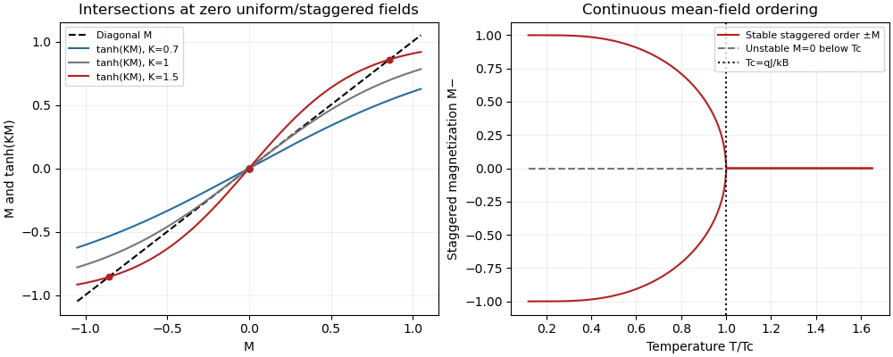

<h1 id="2/solution">Solution</h1>

↑ **Parent:** [2](../2.md)

Write $\beta=1/(k_BT)$, with $k_B$ the [Boltzmann constant](../../../../../boltzmann-constant.md). For independent [Ising spins](../../../../../ising-spin-variable.md), the one-site [partition functions](../../../../../canonical-partition-function.md) on the two sublattices are $z_B=2\cosh\beta(h+g)$ and $z_W=2\cosh\beta(h-g)$. Differentiating each logarithm with respect to its local field gives

$$
\boxed{M_B=\tanh\beta(h+g),\qquad M_W=\tanh\beta(h-g).}
$$

At $h=0$, the two sublattices experience opposite fields, so spin reversal combined with sublattice exchange leaves the [Hamiltonian](../../../../../hamiltonian.md) invariant and gives $M_W=-M_B$.

For the [antiferromagnetic Ising model](../../../../../antiferromagnetic-ising-model.md), take $N$ sites, equal sublattice sizes and $q=2D$ neighbors per site. There are $Nq/2$ bonds counted once. The [two-sublattice Ising mean-field approximation](../../../../../two-sublattice-ising-mean-field-approximation.md) expands each bond as

$$
\sigma_B\sigma_W=M_BM_W+M_W(\sigma_B-M_B)+M_B(\sigma_W-M_W)+(\sigma_B-M_B)(\sigma_W-M_W),
$$

and drops only the product of fluctuations. Summing the remaining terms gives

$$
\mathcal H_{\rm MF}=-\frac{NqJ}{2}M_BM_W-f_B\sum_B\sigma_B-f_W\sum_W\sigma_W,\qquad f_B=h+g-qJM_W,\quad f_W=h-g-qJM_B.
$$

The printed constant omits $N$; for a total [Hamiltonian](../../../../../hamiltonian.md) with unnormalized spin sums, this factor is necessary. Applying the independent-spin calculation now gives

$$
\boxed{M_B=\tanh\beta f_B,\qquad M_W=\tanh\beta f_W.}
$$

The [mean-field approximation](../../../../../mean-field-approximation.md) is favored by large coordination number: averaging many neighbors reduces local relative fluctuations. The size of critical fluctuations still has to satisfy the [Ginzburg criterion](../../../../../ginzburg-criterion.md); high dimension is a reason for validity, not permission to discard every correlation in every regime.

**Antisymmetric solutions and the transition.** At $h=0$, putting $M_B=-M_W=M$ makes both equations reduce to $M=\tanh\beta(g+qJM)$. A zero-field continuous transition concerns $g=0$ as well: nonzero $g$ explicitly selects the staggered sign and rounds this critical bifurcation. Put $K=\beta qJ$. The graphical intersections of $M$ and $\tanh(KM)$ give only $M=0$ for $K\leq1$. For $K>1$ there are additionally two nonzero intersections $\pm M_*$: on $M>0$, $\tanh(KM)-M$ is strictly concave, initially increases, and is negative at $M=1$, so there is exactly one positive root. Spin reversal supplies the negative root. The origin becomes unstable in the staggered direction, whereas the nonzero roots have $K(1-M_*^2)<1$ and are stable. Expanding about the bifurcation gives

$$
0=(K-1)M-\frac{K^3M^3}{3}+O(M^5),\qquad M_*^2=\frac{3(K-1)}{K^3}+O((K-1)^2)\sim3\frac{T_c-T}{T_c}.
$$

Thus $M_-=(M_B-M_W)/2$ turns on continuously, with **$k_BT_c=qJ$** and [order-parameter critical exponent](../../../../../order-parameter-critical-exponent.md) $1/2$.

**[Figure 2](#2/image-antiferromagnetic-mean-field-graphical-solutions-and-continuous-onset-of-staggered-magnetization). Antiferromagnetic mean-field graphical solutions and continuous onset of staggered magnetization**.

**Uniform solutions.** At $g=0$, imposing $M_B=M_W=M$ instead gives $M=\tanh\beta(h-qJM)$. The function $M-\tanh\beta(h-qJM)$ has derivative $1+\beta qJ\operatorname{sech}^2\beta(h-qJM)>0$, is negative at $M=-1$ and positive at $M=1$, and consequently has exactly one zero for every positive temperature. At $h=0$ this zero is $M=0$. Antiferromagnetic exchange opposes uniform polarization, so the uniform branch has no ferromagnetic ordering bifurcation. This does not remove the antisymmetric solutions below $T_c$, or exclude transitions of staggered order in the full problem at nonzero uniform field. In particular, uniqueness on the diagonal $M_B=M_W$ is not uniqueness of all solutions.

**Free energy and stability.** The appropriate off-shell [two-sublattice Ising variational free energy](../../../../../two-sublattice-ising-variational-free-energy.md) is the energy minus temperature times the independent-spin [entropy](../../../../../entropy.md). Define

$$
s(m)=\frac{1+m}{2}\ln\frac{1+m}{2}+\frac{1-m}{2}\ln\frac{1-m}{2}.
$$

There are $Nq/2$ bonds and $N/2$ spins of each kind, so the [free-energy density](../../../../../free-energy-density.md) per site is

$$
A(M_B,M_W)=\frac{qJ}{2}M_BM_W-\frac h2(M_B+M_W)-\frac g2(M_B-M_W)+\frac{k_BT}{2}[s(M_B)+s(M_W)].
$$

Since $s'(m)=\operatorname{atanh}m$, stationarity gives

$$
2A_{M_B}=qJM_W-h-g+k_BT\operatorname{atanh}M_B=0,
$$

and the analogous equation for $M_W$; these are exactly the two [mean-field self-consistency equations](../../../../../self-consistency-equation.md). On a stationary solution, the identity $s(m)=m\operatorname{atanh}m-\ln(2\cosh(\operatorname{atanh}m))$ gives the equivalent on-shell expression

$$
A=-\frac{qJ}{2}M_BM_W-\frac{k_BT}{2}[\ln(2\cosh\beta f_B)+\ln(2\cosh\beta f_W)].
$$

The entropy form must be used to compare off-shell variations; treating this latter auxiliary expression as the variational potential would give spurious stability conclusions.

Using $s(m)=-\ln2+m^2/2+m^4/12+O(m^6)$ and $M_B=M_++M_-$, $M_W=M_+-M_-$ gives

$$
A=-k_BT\ln2+\frac{k_BT+qJ}{2}M_+^2+\frac{k_BT-qJ}{2}M_-^2-hM_+-gM_-+\frac{k_BT}{12}(M_+^4+6M_+^2M_-^2+M_-^4)+O(M_\pm^6).
$$

This includes the requested quadratic expansion and first-order field terms. The positive quartic coefficient verifies a [continuous phase transition](../../../../../continuous-phase-transition.md) in $M_-$ when the staggered quadratic coefficient changes sign at $k_BT=qJ$. The uniform quadratic coefficient remains positive.

**Susceptibilities and a printed error.** On a stable zero-field ordered branch let $M_B=-M_W=M$ and $a=\beta(1-M^2)$. Since the derivative of $\tanh x$ is $1-\tanh^2x$, differentiating the two equations with respect to the uniform field gives

$$
\chi_B=a(1-qJ\chi_W),\qquad\chi_W=a(1-qJ\chi_B).
$$

Their sum and difference yield

$$
\boxed{\chi_+=\frac{\beta(1-M^2)}{1+\beta qJ(1-M^2)},\qquad\chi_-=0\quad(T<T_c).}
$$

The difference equation is $(1-qJa)\chi_-=0$; stability implies $qJa<1$ for $T<T_c$. Symmetry also explains the zero result: a uniform perturbation changes the two sublattice [magnetizations](../../../../../magnetization.md) equally to first order, and hence does not linearly change the [staggered magnetization](../../../../../staggered-magnetization.md). This $\chi_-$ is a cross response to $h$, not the [magnetic susceptibility](../../../../../magnetic-susceptibility.md) to the staggered field $g$.

The displayed $\chi_+$ in the source instead contains $1+M^2$. It cannot follow from differentiating the stated equations. A decisive limiting check is $T\to0$: $1-M^2$ vanishes exponentially and the actual uniform response tends to zero, whereas the printed expression tends to $1/(qJ)$. Above $T_c$, $M=0$ and the same linear system gives

$$
\boxed{\chi_+=\frac{\beta}{1+\beta qJ}=\frac1{k_BT+qJ},\qquad\chi_-=0\quad(T>T_c).}
$$

For comparison, the actual staggered susceptibility is $\partial M_-/\partial g=a/(1-qJa)$, becoming $1/(k_BT-qJ)$ above $T_c$. Its divergence, rather than a divergence of the uniform response, detects antiferromagnetic criticality.

## ↑ Ancestors (10)

1. [2](../2.md)
2. [Paper 51](../../paper-51-split.md)
3. [Iii](../../split.md)
4. [2005](../../../split.md)
5. [Past exam of the mathematics course of the University of Cambridge](../../../../split.md)
6. [Mathematics course of the University of Cambridge](../../../../../mathematics-course-of-the-university-of-cambridge.md)
7. [Course of the University of Cambridge](../../../../../course-of-the-university-of-cambridge.md)
8. [University of Cambridge](../../../../../university-of-cambridge-split.md)
9. [List of universities](../../../../../list-of-universities.md)
10. [Codex Wiki](../../../../../split.md)
