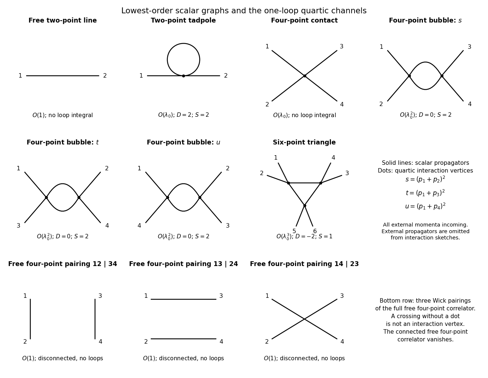

<h1 id="2/solution">Solution</h1>

↑ **Parent:** [2](../2.md)

With signature $(+---)$, the momentum-space [Feynman rules](../../../../../feynman-rule.md) for [phi-fourth theory](../../../../../quartic-interaction.md) follow by expanding the interaction exponential and using free-field [Wick contractions](../../../../../wick-contraction.md). Every internal [scalar propagator](../../../../../scalar-propagator.md) supplies $i/(k^2-m_0^2+i0)$, every quartic [Feynman vertex](../../../../../interaction-vertex.md) supplies $-i\lambda_0$, and each vertex conserves [four-momentum](../../../../../four-momentum.md). Integrate every independent [loop momentum](../../../../../loop-momentum.md) with $d^4k/(2\pi)^4$ and divide by the [Feynman-diagram symmetry factor](../../../../../feynman-diagram-symmetry-factor.md) $S$. Equivalently, assign momenta to all lines and attach $(2\pi)^4\delta^4(\sum k)$ at each vertex before eliminating constrained integrations. A connected amputated graph therefore has the form

$$
\frac{(-i\lambda_0)^{N_v}}{S}
\int\prod_{r=1}^{L}\frac{d^4\ell_r}{(2\pi)^4}
\prod_{j=1}^{N_l}\frac{i}{k_j^2-m_0^2+i0},
$$

with the remaining overall momentum-conservation delta function understood. For an unamputated [correlation function](../../../../../correlation-function.md), retain the external propagators; scattering amplitudes instead use [LSZ reduction](../../../../../lsz-reduction-formula.md). The factor $4!$ in the interaction cancels the number of ways to attach the four identical fields at a vertex, leaving the stated vertex factor.

For a [connected Feynman diagram](../../../../../connected-feynman-diagram.md), $L=N_l-N_v+1$. The [superficial degree of divergence](../../../../../superficial-degree-of-divergence.md) is the power under simultaneous large rescaling of all independent loop momenta before considering cancellations or divergent subgraphs. Since each integration contributes four powers and each internal propagator removes two,

$$
D=4L-2N_l=2N_l-4N_v+4.
$$

Counting vertex half-edges gives $4N_v=2N_l+N_e$. Substitution yields

$$
\boxed{D=4-N_e.}
$$

The connectedness assumption matters: a disconnected interaction graph with $C$ components instead has the corresponding count $D=4C-N_e$. Tree graphs have no loop integral even when this formal power count is nonnegative.

In four dimensions the possible primitively divergent proper vertices have $N_e=2$ or $4$, with $D=2$ or $0$; odd vertices vanish by the $\phi\mapsto-\phi$ symmetry. The divergent local structures are a mass term, a kinetic term and a quartic coupling term. If vacuum diagrams are retained, a vacuum-energy term is also required. Thus one can renormalize using a finite family of operators already allowed by the theory's symmetries: **four-dimensional phi-fourth theory is perturbatively renormalizable.** The superficial count alone is not an all-orders convergence proof. After divergent subgraphs are subtracted with these counterterms, higher-point graphs have no new overall ultraviolet divergence; a negative overall $D$ does not by itself exclude subdivergences.

The requested lowest-order graphs and the three channels needed for the coupling correction are shown here:

**[Figure 1](#2/image-original-quartic-scalar-diagrams-free-line-tadpole-four-point-contact-and-three-bubble-channels-ultraviolet-finite-six-point-triangle-and-all-free-four-point-pairings). Original quartic-scalar diagrams: free line, tadpole, four-point contact and three bubble channels, ultraviolet-finite six-point triangle and all free four-point pairings**.

For the [two-point function](../../../../../two-point-correlation-function.md), the free propagator is order one, while its first interacting correction is the [tadpole diagram](../../../../../tadpole-diagram.md), with $N_v=N_l=L=1$, $N_e=2$, $S=2$ and $D=2$. Its loop integral behaves as $\int d^4k/k^2$ and is quadratically divergent. For the connected [four-point function](../../../../../four-point-correlation-function.md), the lowest graph is the order-$\lambda_0$ contact vertex, with $N_v=1,N_l=L=0$ and formal $D=0$ but no loop divergence. The first loop correction comprises the $s,t,u$ [bubble diagrams](../../../../../bubble-diagram.md). Each has $N_v=2,N_l=2,L=1$, $N_e=4$, $S=2$ and $D=0$, matching its logarithmic integral $\int d^4k/(k^2)^2$.

If the full [four-point correlation function](../../../../../four-point-correlation-function.md) rather than its connected part is considered, there is also an order-one contribution: the sum of the three [Wick contractions](../../../../../wick-contraction.md) into two free propagators, with pairings $(12)(34),(13)(24),(14)(23)$. Explicitly, $G^{(4)}_0=G_{12}G_{34}+G_{13}G_{24}+G_{14}G_{23}$, with $G_{ij}$ the free scalar propagator between insertions $i,j$. These disconnected pairings are drawn in the bottom row of the plate. They contain no loop integral and are not contributions to the proper four-point vertex.

A [six-point amplitude in phi-fourth theory](../../../../../six-point-amplitudes-in-phi-fourth-theory.md) has a one-loop [triangle Feynman diagram](../../../../../triangle-feynman-diagram.md) with two external legs at each of three vertices. It has $N_v=3,N_l=3,L=1$, $N_e=6$, and $D=-2$. For a fixed external-leg partition its loop integral contains three scalar denominators, for example

$$
\int\frac{d^4k}{(2\pi)^4}
\frac1{(k^2-m_0^2+i0)((k+q_1)^2-m_0^2+i0)((k-q_2)^2-m_0^2+i0)}.
$$

After [Wick rotation](../../../../../wick-rotation.md), its ultraviolet radial behavior is $\int^\infty dk\,k^3/k^6=\int^\infty dk/k^3$, which converges. The triangle has no proper loop subgraph, so no ultraviolet subdivergence is hidden in this example. **It generates no new six-field counterterm.** Nonzero mass avoids a separate infrared issue; with massless propagators exceptional external momenta can produce infrared singularities without changing this ultraviolet conclusion.

The [bare mass](../../../../../bare-mass.md) is a coefficient in the regulated action, whereas the [physical mass](../../../../../pole-mass.md) is the pole position of the full propagator. Write the amputated two-point insertion as $-i\Sigma(p^2)$. Summing its insertions gives

$$
G(p)=\frac{i}{p^2-m_0^2-\Sigma(p^2)+i0},\qquad
m^2=m_0^2+\Sigma(m^2).
$$

At order $\lambda_0$, only the tadpole contributes. Its factor one half follows directly from Wick pairing: of the four fields at the vertex, $4\cdot3$ choices attach the two labeled external lines and the remaining pair closes the loop, so $12/4!=1/2$. Thus

$$
-i\Sigma^{(1)}=\frac{-i\lambda_0}{2}\int\frac{d^4k}{(2\pi)^4}\frac{i}{k^2-m_0^2+i0}.
$$

Rotate $k^0=ik_E^0$ through the Feynman contour. The $i$ from the measure and the $i$ in the propagator, together with the denominator sign, give a positive Euclidean integral. With spherical cutoff $|k_E|<\Lambda$,

$$
\Sigma^{(1)}=\frac{\lambda_0}{2}\frac{2\pi^2}{(2\pi)^4}
\int_0^\Lambda\frac{k^3\,dk}{k^2+m_0^2}
=\frac{\lambda_0}{2(4\pi)^2}
\left[\Lambda^2-m_0^2\log\left(1+\frac{\Lambda^2}{m_0^2}\right)\right].
$$

This is the [Wick-rotated cutoff tadpole mass shift](../../../../../wick-rotated-cutoff-tadpole-mass-shift.md), and it is independent of external momentum. Hence to first order,

$$
\boxed{m^2=m_0^2+\frac{\lambda_0}{2(4\pi)^2}
\left[\Lambda^2-m_0^2\log\frac{\Lambda^2+m_0^2}{m_0^2}\right]+O(\lambda_0^2).}
$$

For a positive stable quartic coupling the first-order shift is positive. Keeping the measured pole fixed while changing the cutoff requires adjusting the [bare mass](../../../../../bare-mass.md). At $m_0=0$ the bracket is understood by its finite limit $\Lambda^2$. There is no momentum-dependent wave-function correction from this one-loop tadpole; such corrections begin at higher order.

## ↑ Ancestors (10)

1. [2](../2.md)
2. [Paper 52](../../paper-52-split.md)
3. [Iii](../../split.md)
4. [2005](../../../split.md)
5. [Past exam of the mathematics course of the University of Cambridge](../../../../split.md)
6. [Mathematics course of the University of Cambridge](../../../../../mathematics-course-of-the-university-of-cambridge.md)
7. [Course of the University of Cambridge](../../../../../course-of-the-university-of-cambridge.md)
8. [University of Cambridge](../../../../../university-of-cambridge-split.md)
9. [List of universities](../../../../../list-of-universities.md)
10. [Codex Wiki](../../../../../split.md)
