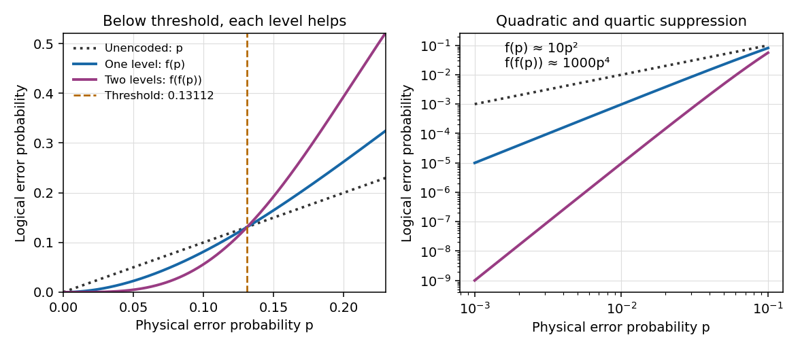

<h1 id="3/iii/solution">Solution</h1>

↑ **Parent:** [Iii](../iii.md)

Use a [concatenated quantum error-correcting code](../../../../../../concatenated-quantum-error-correcting-code.md): each of the five outer-code [qubits](../../../../../../qubit.md) is encoded in its own five-qubit inner block. Independent physical errors and ideal inner correction make each decoded block act as one outer [qubit](../../../../../../qubit.md) with error [probability](../../../../../../probability.md) $q=f(p)$. Errors in distinct inner blocks remain independent in this model. Outer recovery succeeds if at most one of the five decoded blocks is bad, giving

$$
\boxed{P_{\mathrm{correct},25}=(1-q)^5+5q(1-q)^4,\qquad q=f(p).}
$$

Thus the two-level logical failure [probability](../../../../../../probability.md) is

$$
\boxed{p_2=f(f(p))=1000p^4+O(p^5).}
$$

This improves the leading error order from $p$ for a bare [qubit](../../../../../../qubit.md) to $p^2$ for one level and $p^4$ for two. At least two physical errors must occur in each of two different inner blocks to defeat the prescribed two-stage decoder. Many error patterns with more than one error in the full 25-qubit register are therefore corrected: one error in each of all five blocks is removed at the inner level, and a single failed inner block is corrected at the outer level. Concentrating several physical errors in one block can be easier for this decoder than placing two errors in each of two blocks.

More generally, $\ell$ levels use $5^\ell$ physical [qubits](../../../../../../qubit.md) with recursion $p_{\ell+1}=f(p_\ell)$. For $0<p<p_*$, one has $f(f(p))<f(p)<p$. Repeated concatenation decreases to zero: its limit must be a fixed point of the continuous function $f$, and below $p_*$ the only fixed point is zero. A simple quantitative bound is $f(x)\le10x^2$, obtained by the union bound over the ten pairs of possible error positions. Induction gives

$$
p_\ell\le\frac1{10}(10p)^{2^\ell},
$$

which proves rapid suppression when $p<1/10$; the exact threshold is the larger value $p_*$. Above $p_*$ this recursion amplifies errors instead.

**[Figure 1](#3/iii/image-one-and-two-levels-of-ideal-five-qubit-error-correction-below-and-above-the-transmission-error-threshold). One and two levels of ideal five-qubit error correction below and above the transmission-error threshold**.

**Below threshold, concatenation suppresses logical errors while allowing an entire bad inner block to be corrected at the next level.** The cost is additional physical [qubits](../../../../../../qubit.md), gates, syndrome extraction and recovery. The calculated threshold concerns the independent transmission-noise model with perfect encoding and recovery; including noisy operations or correlated channel errors requires a different error analysis.

## ↑ Ancestors (11)

1. [Iii](../iii.md)
2. [3](../../3.md)
3. [Paper 58](../../../paper-58-split.md)
4. [Iii](../../../split.md)
5. [2005](../../../../split.md)
6. [Past exam of the mathematics course of the University of Cambridge](../../../../../split.md)
7. [Mathematics course of the University of Cambridge](../../../../../../mathematics-course-of-the-university-of-cambridge.md)
8. [Course of the University of Cambridge](../../../../../../course-of-the-university-of-cambridge.md)
9. [University of Cambridge](../../../../../../university-of-cambridge-split.md)
10. [List of universities](../../../../../../list-of-universities.md)
11. [Codex Wiki](../../../../../../split.md)
