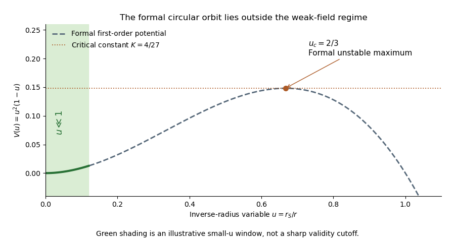
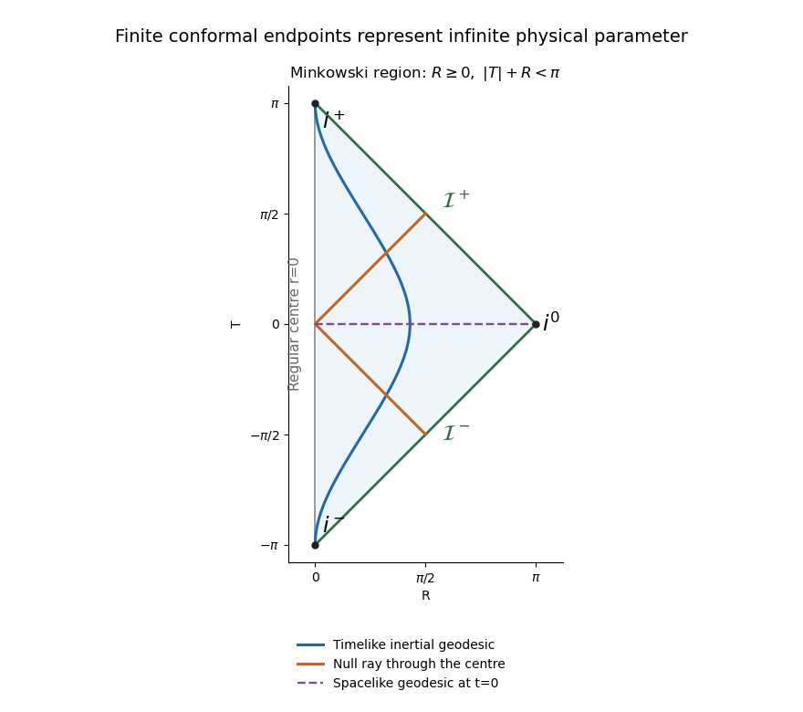

# Paper 60

↑ **Parent:** [Iii](../iii.md)

[https://www.maths.cam.ac.uk/postgrad/part-iii/files/pastpapers/2005/Paper60.pdf](https://www.maths.cam.ac.uk/postgrad/part-iii/files/pastpapers/2005/Paper60.pdf)

**Table of contents**

- [1](#1)
  - [Solution](#1/solution)
- [2](#2)
  - [Solution](#2/solution)
- [3](#3)
  - [Solution](#3/solution)
- [4](#4)
  - [Solution](#4/solution)

## 1

↑ **Parent:** [Paper 60](paper-60.md)

<h3 id="1/solution">Solution</h3>

↑ **Parent:** [1](#1)

For a scalar, the [Lie derivative of a function](../../../fiber-bundle.md#lie-derivative-of-a-function) is its [directional derivative](../../../calculus.md#directional-derivative):

$$
\mathcal L_\xi f=\xi^a\partial_af.
$$

The [Lie derivative of a vector field](../../../fiber-bundle.md#lie-derivative-of-a-vector-field) is their [Lie bracket of vector fields](../../../differential-geometry.md#lie-bracket-of-vector-fields):

$$
(\mathcal L_\xi X)^a=\xi^b\partial_bX^a-X^b\partial_b\xi^a.
$$

For a [torsion-free connection](../../../fiber-bundle.md#torsion-free-connection),

$$
(\nabla_\xi X-\nabla_X\xi)^a=\xi^b\partial_bX^a-X^b\partial_b\xi^a+\Gamma^a{}_{bc}(\xi^bX^c-X^b\xi^c).
$$

The last term vanishes because the [connection coefficients](../../../fiber-bundle.md#connection-components) are symmetric in $b,c$. This proves **$\mathcal L_\xi X=\nabla_\xi X-\nabla_X\xi$**.

For the [metric tensor](../../../general-relativity.md#metric-tensor) statements use the [Levi-Civita connection](../../../general-relativity.md#levi-civita-connection), which also has [metric compatibility](../../../fiber-bundle.md#metric-compatibility). The [tensor derivation](../../../fiber-bundle.md#tensor-derivation) property of the [Lie derivative of a tensor field](../../../fiber-bundle.md#lie-derivative-of-a-tensor-field) gives

$$
(\mathcal L_\xi g)(X,Y)=\xi[g(X,Y)]-g(\mathcal L_\xi X,Y)-g(X,\mathcal L_\xi Y).
$$

Expanding the first term using $\nabla g=0$ and using the vector identity cancels the derivatives of $X$ and $Y$. What remains is

$$
(\mathcal L_\xi g)(X,Y)=g(\nabla_X\xi,Y)+g(X,\nabla_Y\xi)=2\xi_{(a;b)}X^aY^b.
$$

Since $X,Y$ are arbitrary, the [Killing equation](../../../general-relativity.md#killing-equation) is

$$
\boxed{\mathcal L_\xi g=0\quad\Longleftrightarrow\quad\xi_{(a;b)}=0.}
$$

[Metric compatibility](../../../fiber-bundle.md#metric-compatibility) is needed here, even though symmetry alone sufficed for the vector identity. In general the [Lie derivative of a metric with nonmetricity](../../../fiber-bundle.md#lie-derivative-of-a-metric-with-nonmetricity) contains a term $\xi^c\nabla_cg_{ab}$. For example, with the [metric tensor](../../../general-relativity.md#metric-tensor) $g=e^{2x}dx^2$, zero [connection coefficients](../../../fiber-bundle.md#connection-components) and $\xi=\partial_x$, the [Lie derivative of a tensor field](../../../fiber-bundle.md#lie-derivative-of-a-tensor-field) is $2e^{2x}$, whereas $2\nabla_x\xi_x=4e^{2x}$. The usual [metric connection](../../../fiber-bundle.md#metric-connection) interpretation of the question supplies the required compatibility.

For the [Riemann curvature tensor](../../../general-relativity.md#riemann-curvature-tensor) calculation, keep the original PDF's convention. With $R_{abcd}=g_{ae}R^e{}_{bcd}$ and $R_{abc}{}^d=g^{de}R_{abce}$, it means

$$
[\nabla_c,\nabla_d]X^a=-R^a{}_{bcd}X^b.
$$

Thus the [commutator](../../../lie-algebra.md#commutator) on a [covector](../../../linear-algebra.md#covector) has the opposite sign. Write $K_{abc}=\xi_{a;bc}=\nabla_c\nabla_b\xi_a$. Taking a [covariant derivative](../../../general-relativity.md#covariant-derivative) of the [Killing equation](../../../general-relativity.md#killing-equation) makes $K$ antisymmetric in its first two indices, while the [Ricci identity](../../../general-relativity.md#curvature-commutator-on-a-covariant-tensor) gives

$$
K_{abc}-K_{acb}=R_{adbc}\xi^d.
$$

Combining this with the first-two-index antisymmetry gives the three relations

$$
K_{abc}+K_{cab}=R_{adbc}\xi^d,\quad K_{cab}+K_{bca}=R_{cdab}\xi^d,\quad K_{bca}+K_{abc}=R_{bdca}\xi^d.
$$

Add the first and third and subtract the second. Pair symmetry and the [first Bianchi identity](../../../general-relativity.md#first-bianchi-identity) imply $R_{adbc}+R_{bdca}-R_{cdab}=-2R_{abcd}$. Consequently

$$
K_{abc}=-R_{abcd}\xi^d,\qquad\boxed{\xi_{b;ca}=-R_{bca}{}^d\xi_d.}
$$

This is the [second covariant derivative of a Killing vector](../../../general-relativity.md#second-covariant-derivative-of-a-killing-vector) in the paper's convention; its sign is tied to the declared [curvature-sign convention in Killing derivative identities](../../../general-relativity.md#curvature-sign-convention-in-killing-derivative-identities), not to raising a particular index.

Set $L_{ab}=\xi_{a;b}$. Along any [smooth curve](../../../differential-geometry.md#smooth-curve) with [tangent vector](../../../differential-geometry.md#tangent-vector) $V$, the [chain rule](../../../calculus.md#chain-rule) and the just-proved identity give the [Killing transport equations](../../../general-relativity.md#killing-transport)

$$
\boxed{\nabla_V\xi_a=L_{ab}V^b,\qquad\nabla_VL_{ab}=-R_{abc}{}^dV^c\xi_d.}
$$

Choose a [parallel-propagated orthonormal frame](../../../general-relativity.md#parallel-propagated-orthonormal-frame) along the curve. These become a homogeneous [linear system of ordinary differential equations](../../../differential-equation.md#linear-system-of-differential-equations) for the components of $(\xi,L)$. Uniqueness of its [initial value problem](../../../differential-equation.md#initial-value-problem) implies that zero initial data remain zero. Any point in the same [connected component](../../../geometry-and-topology.md#connected-component) as $P$ can be joined to $P$ by a piecewise smooth curve. Therefore **zero value and zero first derivative at $P$ force the [Killing field](../../../general-relativity.md#killing-vector-field) and its derivative to vanish throughout that component**, with no completeness assumption. On a [manifold](../../../topology.md#topological-manifold) with one [connected component](../../../geometry-and-topology.md#connected-component) this is the requested global result. [Connectedness](../../../geometry-and-topology.md#connected-space) cannot be dropped: on two disjoint flat spacetimes, take the zero field on one and a nonzero translation on the other.

On a [pseudo-Riemannian manifold](../../../differential-geometry.md#pseudo-riemannian-manifold) of dimension $n$ with one [connected component](../../../geometry-and-topology.md#connected-component), the map $\xi\mapsto(\xi_a(P),L_{ab}(P))$ is therefore injective. There are $n$ independent components of the value and $n(n-1)/2$ of its antisymmetric derivative. The [dimension bound for Killing vector fields](../../../general-relativity.md#dimension-bound-for-killing-vector-fields) is

$$
\boxed{\dim\mathfrak{kill}(M,g)\leq\frac{n(n+1)}2.}
$$

It is attained in flat space by $\xi_a=A_a+B_{ab}x^b$ with constant antisymmetric $B$, giving translations and infinitesimal rotations or [Lorentz transformations](../../../special-relativity.md#lorentz-transformation). The four-dimensional maximum is **10**. For a disconnected manifold the bound applies componentwise; there is no uniform global bound depending only on $n$ if the number of components is unrestricted.

## 2

↑ **Parent:** [Paper 60](paper-60.md)

<h3 id="2/solution">Solution</h3>

↑ **Parent:** [2](#2)

[General relativity](../../../general-relativity.md) models spacetime by a smooth four-dimensional [Lorentzian manifold](../../../topology.md#lorentzian-manifold) whose [metric tensor](../../../general-relativity.md#metric-tensor) governs clock readings, causal cones and free-particle motion. The [Einstein equivalence principle](../../../general-relativity.md#einstein-equivalence-principle) motivates local [special relativity](../../../special-relativity.md) and universal [geodesic](../../../riemannian-geometry.md#geodesic) [free fall](../../../classical-mechanics.md#free-fall) for test bodies; it does not by itself select a unique gravitational field equation. We assume a [Levi-Civita connection](../../../general-relativity.md#levi-civita-connection), a [metric tensor](../../../general-relativity.md#metric-tensor) as the gravitational field with no additional dynamical gravitational variables, and matter with a covariantly conserved [stress-energy tensor](../../../general-relativity.md#stress-energy-tensor). Units have $c=1$.

The existence of [local inertial frames](../../../physics.md#local-inertial-frame) is a local statement. At any regular event choose an [orthonormal frame](../../../general-relativity.md#orthonormal-frame-in-spacetime) and [Riemann normal coordinates](../../../general-relativity.md#normal-coordinates), so that $g_{ab}=\eta_{ab}$ and $\Gamma^a{}_{bc}=0$ at the event, with [metric signature](../../../topology.md#metric-signature) $(+---)$. [Metric compatibility](../../../fiber-bundle.md#metric-compatibility) then gives $\partial_cg_{ab}=0$ there. The [geodesic equation](../../../riemannian-geometry.md#geodesic-equation) at that point is the special-relativistic inertial equation. Along a [timelike geodesic](../../../general-relativity.md#timelike-geodesic), a parallel-transported [orthonormal frame](../../../general-relativity.md#orthonormal-frame-in-spacetime) gives [Fermi normal coordinates](../../../general-relativity.md#fermi-coordinates), eliminating the connection along the central worldline. These constructions do not in general eliminate second derivatives of the [metric tensor](../../../general-relativity.md#metric-tensor) in a neighborhood. The [Riemann curvature tensor](../../../general-relativity.md#riemann-curvature-tensor) is built from the derivatives of the [connection coefficients](../../../fiber-bundle.md#connection-components) as well as their quadratic terms; nonzero [Riemann curvature tensor](../../../general-relativity.md#riemann-curvature-tensor) components can remain when all [connection coefficients](../../../fiber-bundle.md#connection-components) vanish at a chosen point. Conversely, [Polar coordinates](../../../calculus.md#polar-coordinates) in [Minkowski spacetime](../../../special-relativity.md#minkowski-spacetime) can have nonzero [connection coefficients](../../../fiber-bundle.md#connection-components) but zero [Riemann curvature tensor](../../../general-relativity.md#riemann-curvature-tensor). [Connection coefficients](../../../fiber-bundle.md#connection-components) alone are therefore not an invariant measure of gravity.

For the tensorial content, consider a two-parameter family of [geodesics](../../../riemannian-geometry.md#geodesic) parametrized by an [affine parameter](../../../riemannian-geometry.md#affine-parameter), with tangent $U$ and connecting field $J$. Their coordinate construction gives $[U,J]=0$, and torsion-freeness gives $\nabla_UJ=\nabla_JU$. Since $\nabla_UU=0$, commuting derivatives in the convention of Question 1 yields [geodesic deviation](../../../general-relativity.md#geodesic-deviation):

$$
\boxed{\frac{D^2J^a}{d\tau^2}=-R^a{}_{bcd}U^bU^cJ^d.}
$$

The left side is covariant relative acceleration, rather than the second coordinate derivative of an arbitrary separation. In an [orthonormal frame](../../../general-relativity.md#orthonormal-frame-in-spacetime) in [free fall](../../../classical-mechanics.md#free-fall) with $U=(1,0,0,0)$, its spatial components are $D^2J^i/d\tau^2=-R^i{}_{00j}J^j$. This is a measurable [tidal force](../../../classical-mechanics.md#tidal-force), and a coordinate transformation cannot make a nonzero [Riemann curvature tensor](../../../general-relativity.md#riemann-curvature-tensor) disappear. It is the distinction between gravity at one event and the behavior of an extended freely falling laboratory.

In a static [Newtonian limit](../../../general-relativity.md#newtonian-limit), $g_{00}=1+2\Phi$ and $\Gamma^i{}_{00}=\partial_i\Phi$, so the test-body acceleration is $-\nabla\Phi$. The [curvature-sign convention in Killing derivative identities](../../../general-relativity.md#curvature-sign-convention-in-killing-derivative-identities) gives $R^i{}_{00j}\simeq\partial_i\partial_j\Phi$. Hence relative acceleration is the negative [Hessian](../../../calculus.md#hessian-matrix) of the [gravitational potential](../../../classical-mechanics.md#newtonian-potential-of-a-point-mass). For the [Newtonian potential of a point mass](../../../classical-mechanics.md#newtonian-potential-of-a-point-mass) $\Phi=-GM/r$, the [Hessian](../../../calculus.md#hessian-matrix) has radial [eigenvalue](../../../linear-operator-theory.md#eigenvalue) $-2GM/r^3$ and two tangential [eigenvalues](../../../linear-operator-theory.md#eigenvalue) $GM/r^3$: radial separations stretch and tangential ones compress. Outside the source the [Ricci tensor](../../../general-relativity.md#ricci-tensor) can vanish while the [Riemann curvature tensor](../../../general-relativity.md#riemann-curvature-tensor) remains nonzero. Its vacuum tidal part is encoded by the [Weyl tensor](../../../general-relativity.md#weyl-tensor); vacuum does not mean flatness. [Gravitational waves](../../../general-relativity.md#gravitational-wave) likewise carry [Riemann curvature tensor](../../../general-relativity.md#riemann-curvature-tensor) disturbances without a local material source.

To obtain the field equations, make the additional dynamical assumptions explicit: locality and [diffeomorphism invariance of general relativity](../../../general-relativity.md#diffeomorphism-invariance-of-general-relativity); a symmetric [metric tensor](../../../general-relativity.md#metric-tensor) field equation using at most second derivatives of the [metric tensor](../../../general-relativity.md#metric-tensor); a geometrical left-hand side linear in the [Riemann curvature tensor](../../../general-relativity.md#riemann-curvature-tensor) with constant coefficients; and compatibility with local matter conservation. These restrictions exclude higher-curvature or extra-field alternatives. Under them the available rank-two curvature contractions give the ansatz

$$
F_{ab}=aR_{ab}+bRg_{ab}+c_0g_{ab}.
$$

The [contracted Bianchi identity](../../../general-relativity.md#contracted-bianchi-identity) and [metric compatibility](../../../fiber-bundle.md#metric-compatibility) give

$$
\nabla^aF_{ab}=\left(\frac a2+b\right)\nabla_bR.
$$

For this to vanish identically for arbitrary [metric tensors](../../../general-relativity.md#metric-tensor), $b=-a/2$. Assuming $a\ne0$ and absorbing its normalization into the coupling gives

$$
G_{ab}+\Lambda g_{ab}=\kappa T_{ab},\qquad G_{ab}=R_{ab}-\frac12Rg_{ab}.
$$

The permitted constant term is the [cosmological constant](../../../cosmology.md#cosmological-constant). Its value is not fixed by the [Equivalence principle](../../../general-relativity.md#equivalence-principle). Conservation of $T$ follows for generally covariant matter on its equations of motion: varying the matter [action](../../../classical-mechanics.md#action) under a compactly supported infinitesimal [diffeomorphism](../../../geometry-and-topology.md#diffeomorphism), then integrating its term $T^{ab}\nabla_a\xi_b$ by parts, gives $\nabla_aT^{ab}=0$. The divergence-free [Einstein tensor](../../../general-relativity.md#einstein-tensor) is consistent with this identity.

The coupling sign must be fixed in the actual [curvature-sign convention in Killing derivative identities](../../../general-relativity.md#curvature-sign-convention-in-killing-derivative-identities), with $R_{ab}=R^c{}_{acb}$. For the static [weak-field approximation](../../../general-relativity.md#weak-field-approximation), $R_{00}\simeq-\Delta\Phi$. Set $\Lambda=0$ for the local asymptotically flat Newtonian comparison. In four dimensions the trace equation gives $R=-\kappa T$, so $R_{00}=\kappa(T_{00}-\tfrac12g_{00}T)\simeq\kappa\rho/2$ for slowly moving matter. Matching $\Delta\Phi=4\pi G\rho$ forces $\kappa=-8\pi G$. Thus, with this convention,

$$
\boxed{R_{ab}-\frac12Rg_{ab}+\Lambda g_{ab}=-8\pi GT_{ab}.}
$$

Under the opposite [curvature-sign convention in Killing derivative identities](../../../general-relativity.md#curvature-sign-convention-in-killing-derivative-identities) the coupling sign reverses, as in [Einstein-equation coupling under reversed curvature](../../../general-relativity.md#einstein-equation-coupling-under-reversed-curvature). This sign statement is compatible with the supplied linearized handout. **[Local inertial frames](../../../physics.md#local-inertial-frame) remove the connection at an event; tidal [Riemann curvature tensor](../../../general-relativity.md#riemann-curvature-tensor) effects remain tensorial, and the field equations require dynamical assumptions beyond the [Equivalence principle](../../../general-relativity.md#equivalence-principle).**

## 3

↑ **Parent:** [Paper 60](paper-60.md)

<h3 id="3/solution">Solution</h3>

↑ **Parent:** [3](#3)

For the static nonrotating source, use [spherical symmetry](../../../geometry-and-topology.md#spherical-symmetry) and the [static scalar perturbation of Minkowski spacetime](../../../general-relativity.md#static-scalar-perturbation-of-minkowski-spacetime), with isotropic radius $\rho$:

$$
ds^2=(1+2A)dt^2-(1+2C)(d\rho^2+\rho^2d\Omega^2).
$$

To first order, the [Einstein tensor](../../../general-relativity.md#einstein-tensor) in the declared convention has

$$
\delta G_{00}=2\Delta C,\qquad\delta G_{ij}=\partial_i\partial_j(A+C)-\delta_{ij}\Delta(A+C).
$$

These are also the [static scalar perturbation of Minkowski spacetime](../../../general-relativity.md#static-scalar-perturbation-of-minkowski-spacetime) equations in the original information sheet. The source has $T_{00}=M\delta^{(3)}(\mathbf x)$ and zero spatial stress. With the sign established in Question 2,

$$
\Delta C=-4\pi GM\delta^{(3)}(\mathbf x).
$$

The [distributional identity](../../../distribution-theory.md#distributional-identity) $\Delta(1/\rho)=-4\pi\delta^{(3)}(\mathbf x)$ and [asymptotic flatness](../../../general-relativity.md#asymptotically-flat-spacetime) give $C=GM/\rho$. For $F=A+C$, the spatial field equation has trace $-2\Delta F=0$ and therefore $\partial_i\partial_jF=0$. Its decaying spherical solution is $F=0$, so $A=-GM/\rho$. This determines both potentials; the spatial correction cannot be inferred from the Newtonian [gravitational potential](../../../classical-mechanics.md#newtonian-potential-of-a-point-mass) alone.

Now use the [isotropic-to-areal weak-field radius change](../../../general-relativity.md#isotropic-to-areal-weak-field-radius-change). The angular coefficient defines $r^2=(1+2GM/\rho)\rho^2$, hence $r=\rho+GM$ to first order. Thus $dr=d\rho$ to the same accuracy, and replacing $1/\rho$ by $1/r$ inside a perturbation changes only second-order terms. With the [Schwarzschild radius](../../../general-relativity.md#schwarzschild-radius) $r_S=2GM$, the [linearized Schwarzschild metric](../../../general-relativity.md#linearized-schwarzschild-metric) is

$$
\boxed{ds^2=(1-r_S/r)dt^2-(1+r_S/r)dr^2-r^2(d\theta^2+\sin^2\theta\,d\phi^2).}
$$

This is an exterior [weak-field approximation](../../../general-relativity.md#weak-field-approximation): $r_S/r\ll1$. The point source is used distributionally to fix the mass, not to claim a regular or weak field at the origin.

For a [null geodesic](../../../special-relativity.md#null-geodesic) choose its orbital plane as $\theta=\pi/2$, using rotational symmetry, and let a dot denote an [affine parameter](../../../riemannian-geometry.md#affine-parameter) derivative. For a [Killing vector](../../../general-relativity.md#killing-vector-field) $k$ and an affinely parametrized [geodesic](../../../riemannian-geometry.md#geodesic) tangent $U$, the [geodesic conserved quantity from a Killing vector](../../../general-relativity.md#geodesic-conserved-quantity-from-a-killing-vector) follows directly from

$$
\frac{d}{d\lambda}(k_aU^a)=U^aU^b\nabla_{(a}k_{b)}+k_a\nabla_UU^a=0.
$$

Applying this to the time-translation and axial [Killing vectors](../../../general-relativity.md#killing-vector-field), with the spatial sign absorbed into the definition of $h$, gives

$$
\boxed{E=(1-u)\dot t,\qquad h=r^2\dot\phi,\qquad u=r_S/r.}
$$

If the tangent is normalized as the photon's [four-momentum](../../../special-relativity.md#four-momentum), $E$ is its energy measured at infinity and $h$ its signed [angular momentum](../../../classical-mechanics.md#angular-momentum) about the selected axis. Rescaling an arbitrary [affine parameter](../../../riemannian-geometry.md#affine-parameter) rescales both; the ratio $b=|h|/E$ is the invariant [impact parameter](../../../classical-mechanics.md#impact-parameter). Future-directed orbits have $E>0$. Assume $h\ne0$ to use $\phi$ as the orbit parameter; $h=0$ gives radial rays, not a finite-radius circular orbit.

The [null vector](../../../special-relativity.md#null-vector) constraint gives

$$
0=\frac{E^2}{1-u}-(1+u)\dot r^2-\frac{h^2}{r^2},\qquad \dot r^2=\frac{E^2}{1-u^2}-\frac{h^2}{r^2(1+u)}.
$$

Expand consistently to first order in the [weak-field approximation](../../../general-relativity.md#weak-field-approximation) correction: $(1-u^2)^{-1}=1+O(u^2)$ and $(1+u)^{-1}=1-u+O(u^2)$. Also $du/d\phi=-r_S\dot r/h$. Therefore the first-order orbital equation is

$$
\boxed{\left(\frac{du}{d\phi}\right)^2=\frac{r_S^2E^2}{h^2}-u^2(1-u).}
$$

The cubic term is the first correction relative to the flat inverse-radius term; the equation is not a controlled exact equation for large $u$.

A constant solution of a [first integral](../../../differential-equation.md#first-integral) is not by itself sufficient to establish a circular [geodesic](../../../riemannian-geometry.md#geodesic). For a circular trajectory, the radial [Euler-Lagrange equation](../../../analysis.md#euler-lagrange-equation) also requires $A'(r)\dot t^2/2=r\dot\phi^2$, where now $A(r)=1-r_S/r$ is the metric's time coefficient. Combining this with the [null vector](../../../special-relativity.md#null-vector) constraint gives $rA'=2A$, or $u=2/3$. Equivalently, the formal potential $V(u)=u^2(1-u)$ must have a stationary point. Apart from the infinite-radius endpoint $u=0$, its only stationary point is $u_c=2/3$, with $V(u_c)=4/27$. Thus the formal circular solution requires

$$
\boxed{r_c=\frac32r_S,\qquad\left|\frac Eh\right|=\frac{2}{3\sqrt3\,r_S},\qquad b_c=\frac{3\sqrt3}{2}r_S.}
$$

The reduced radial equation is $u''=-u+\tfrac32u^2$, with prime denoting $d/d\phi$. It follows by differentiating the [first integral](../../../differential-equation.md#first-integral) on moving segments and agrees with the regular [Euler-Lagrange equation](../../../analysis.md#euler-lagrange-equation) at turning points. Perturbing $u=u_c+\epsilon$ gives

$$
\epsilon''=\epsilon+O(\epsilon^2),\qquad\epsilon=A_+e^\phi+A_-e^{-\phi}+O(\epsilon^2).
$$

There is an exponentially growing [linear instability](../../../algebra.md#linear-instability) mode; equivalently $V''(u_c)=-2<0$. **The formal circular orbit is unstable.**

**[Figure 1](#3/image-the-formal-inverse-radius-photon-potential-has-its-maximum-outside-the-weak-field-regime). The formal inverse-radius photon potential has its maximum outside the weak-field regime**.

The [weak-field photon-orbit validity](../../../general-relativity.md#weak-field-photon-orbit-validity) limitation is essential: $u_c=2/3$ is not small. There is therefore **no finite-radius circular photon orbit established within the controlled weak-field region**. The formal extrapolation happens to reproduce the radius and [impact parameter](../../../classical-mechanics.md#impact-parameter) of the exact Schwarzschild [photon sphere](../../../general-relativity.md#photon-sphere), but that physical result needs the exact geometry. The calculation also cannot establish a [Schwarzschild event horizon](../../../general-relativity.md#schwarzschild-event-horizon) from a first-order expansion at $u\sim1$.

## 4

↑ **Parent:** [Paper 60](paper-60.md)

<h3 id="4/solution">Solution</h3>

↑ **Parent:** [4](#4)

The physical [spherical coordinates](../../../calculus.md#spherical-coordinate-system) cover $t\in\mathbb R$, $r\in[0,\infty)$, $\theta\in[0,\pi]$, and $\phi\in[0,2\pi)$ with periodic identification. The center and the polar axes are the usual [coordinate singularities](../../../general-relativity.md#coordinate-singularity), rather than physical [curvature singularities](../../../general-relativity.md#curvature-singularity); a regular polar chart restricts $r>0$ and $0<\theta<\pi$. For the [null coordinates](../../../general-relativity.md#null-coordinate),

$$
u=t-r,\quad v=t+r,\qquad t=\frac{u+v}{2},\quad r=\frac{v-u}{2},\qquad u,v\in\mathbb R,\ v\geq u.
$$

Thus the physical [metric tensor](../../../general-relativity.md#metric-tensor) is

$$
d\hat s^2=du\,dv-\frac{(v-u)^2}{4}d\Sigma^2.
$$

The [conformal transformation](../../../geometry-and-topology.md#conformal-map) followed by $p=\arctan u$, $q=\arctan v$ gives $du=(1+u^2)dp$, $dv=(1+v^2)dq$, and

$$
\frac{v-u}{\sqrt{(1+u^2)(1+v^2)}}=\sin(q-p).
$$

Consequently $ds^2=4dp\,dq-\sin^2(q-p)d\Sigma^2$. Finally $T=p+q$, $R=q-p$ converts $4dp\,dq$ to $dT^2-dR^2$, yielding

$$
\boxed{ds^2=dT^2-dR^2-\sin^2R\,d\Sigma^2.}
$$

The ranges must retain their joint constraints:

$$
-\frac\pi2<p,q<\frac\pi2,\quad q\geq p;\qquad -\pi<T<\pi,\quad0\leq R<\pi,\quad |T|+R<\pi.
$$

Equivalently, $-\pi<T-R<\pi$ and $-\pi<T+R<\pi$, with $R\geq0$. The angles retain their original ranges and identifications. Extending $R$ to negative values would double-count the radial polar geometry. The [conformal factor](../../../general-relativity.md#conformal-factor) is

$$
\boxed{\Omega=2\cos p\cos q=\cos T+\cos R>0\ \text{in the physical region},\qquad g=\Omega^2\hat g.}
$$

The unphysical [metric tensor](../../../general-relativity.md#metric-tensor) extends onto the [Einstein static universe](../../../general-relativity.md#einstein-static-universe), while physical [Minkowski spacetime](../../../special-relativity.md#minkowski-spacetime) occupies the triangular region in its radial [Penrose diagram](../../../general-relativity.md#penrose-diagram). The edge $R=0$ is the regular center and belongs to the physical region away from its endpoints.

The [conformal boundary](../../../geometry-and-topology.md#conformal-boundary) consists of the following infinities. [Future null infinity](../../../general-relativity.md#future-null-infinity) has $q=\pi/2$, hence $T+R=\pi$ with $0<R<\pi$, and corresponds to finite $u$ with $v\to+\infty$. [Past null infinity](../../../general-relativity.md#past-null-infinity) has $p=-\pi/2$, hence $T-R=-\pi$, and corresponds to finite $v$ with $u\to-\infty$. [Future timelike infinity](../../../general-relativity.md#future-timelike-infinity) is $(T,R)=(\pi,0)$, [past timelike infinity](../../../general-relativity.md#past-timelike-infinity) is $(-\pi,0)$, and [spacelike infinity](../../../general-relativity.md#spacelike-infinity) is $(0,\pi)$. Although angles label points on null infinity, their two-spheres collapse at these three endpoint locations in the compactified picture.

**[Figure 2](#4/image-the-radial-minkowski-conformal-diagram-and-the-endpoints-of-timelike-null-and-spacelike-geodesics). The radial Minkowski conformal diagram and the endpoints of timelike, null and spacelike geodesics**.

For the [geodesic endpoints in Minkowski conformal compactification](../../../general-relativity.md#geodesic-endpoints-in-minkowski-conformal-compactification), one can check the limits directly. A timelike inertial trajectory is $\mathbf x=\mathbf b+\mathbf w t$ with $|\mathbf w|<1$. At $t\to+\infty$ both $t-r$ and $t+r$ tend to $+\infty$, so $p,q\to\pi/2$ and the trajectory ends at [future timelike infinity](../../../general-relativity.md#future-timelike-infinity). At $t\to-\infty$ both tend to $-\infty$, giving [past timelike infinity](../../../general-relativity.md#past-timelike-infinity). This includes a stationary inertial worldline with bounded $r$.

For a null inertial trajectory, $|\mathbf w|=1$. As $t\to+\infty$, $r=t+\mathbf w\cdot\mathbf b+o(1)$, so $u$ has a finite limit while $v\to+\infty$; its future endpoint lies on [future null infinity](../../../general-relativity.md#future-null-infinity). As $t\to-\infty$, $r=-t-\mathbf w\cdot\mathbf b+o(1)$, giving a finite limiting $v$ and $u\to-\infty$, hence a past endpoint on [past null infinity](../../../general-relativity.md#past-null-infinity). Radial [null geodesic](../../../special-relativity.md#null-geodesic) paths have $T\pm R$ constant. A ray passing through the center changes its angular direction; in the angle-suppressed radial diagram it reflects at $R=0$ rather than terminating there.

A [spacelike geodesic](../../../riemannian-geometry.md#spacelike-geodesic) is also a straight line, now parametrized so that $|d\mathbf x/d\lambda|>|dt/d\lambda|$. At either end, $r>|t|$ asymptotically, $u\to-\infty$, $v\to+\infty$, and the endpoint is [spacelike infinity](../../../general-relativity.md#spacelike-infinity). A radial spacelike line at $t=0$ has two opposite-angle halves which project onto the same horizontal interval in the diagram.

The [conformal compactification](../../../geometry-and-topology.md#conformal-compactification) endpoints occur at finite $T$ but at infinite physical [proper time](../../../special-relativity.md#proper-time) or [affine parameter](../../../riemannian-geometry.md#affine-parameter); [Minkowski spacetime](../../../special-relativity.md#minkowski-spacetime) is [geodesically complete](../../../riemannian-geometry.md#geodesic-completeness). The [conformal preservation of null geodesic paths](../../../general-relativity.md#conformal-preservation-of-null-geodesic-paths) does not preserve an [affine parameter](../../../riemannian-geometry.md#affine-parameter): if $\lambda$ is physically affine, an unphysical [affine parameter](../../../riemannian-geometry.md#affine-parameter) satisfies $d\widetilde\lambda/d\lambda=\Omega^2$ up to a constant. Along a complete null ray this can have a finite integral at infinity. Timelike and spacelike physical [geodesic](../../../riemannian-geometry.md#geodesic) paths are not generally [geodesics](../../../riemannian-geometry.md#geodesic) of the rescaled [metric tensor](../../../general-relativity.md#metric-tensor), so their drawn curves must not be interpreted as freely falling unphysical observers.

Finally, every physical event can send an outgoing null ray to [future null infinity](../../../general-relativity.md#future-null-infinity), so $J^-(\mathcal I^+)$ is all of [Minkowski spacetime](../../../special-relativity.md#minkowski-spacetime). Its [black-hole region](../../../general-relativity.md#black-hole) and intrinsic [event horizon](../../../general-relativity.md#event-horizon) are empty. The null edges in the diagram are infinity, not horizons concealing part of the physical manifold. Complete inertial observers likewise have no [observer event horizon](../../../general-relativity.md#observer-event-horizon). Accelerated observers restricted to a [Rindler wedge](../../../special-relativity.md#rindler-wedge) can have a [Rindler horizon](../../../special-relativity.md#rindler-horizon), but that is observer-dependent and does not contradict the [horizon-free Minkowski spacetime](../../../general-relativity.md#horizon-free-minkowski-spacetime). **The conformal diagram compactifies infinity; it does not introduce a physical horizon.**

## ↑ Ancestors (8)

1. [Iii](../iii.md)
2. [2005](../../2005.md)
3. [Past exam of the mathematics course of the University of Cambridge](../../../past-exam-of-the-mathematics-course-of-the-university-of-cambridge.md)
4. [Mathematics course of the University of Cambridge](../../../university-of-cambridge.md#mathematics-course-of-the-university-of-cambridge)
5. [Course of the University of Cambridge](../../../university-of-cambridge.md#course-of-the-university-of-cambridge)
6. [University of Cambridge](../../../university-of-cambridge.md)
7. [List of universities](../../../README.md#list-of-universities)
8. [Codex Wiki](../../../README.md)
