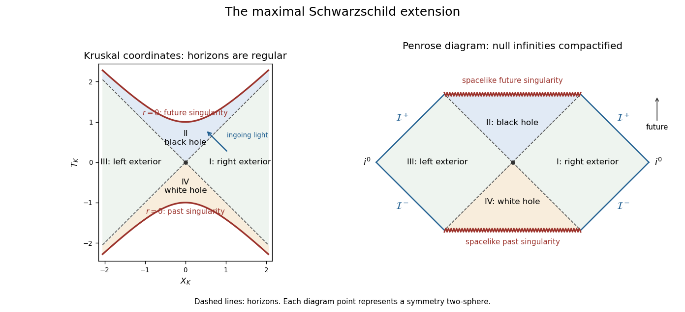

<h1 id="1/solution">Solution</h1>

↑ **Parent:** [1](../1.md)

Use [geometrized units](../../../../../geometrized-units.md) $G=c=1$ and positive [mass](../../../../../mass.md) $M$. The [Schwarzschild metric](../../../../../schwarzschild-spacetime.md) initially describes an exterior region, not the whole [black hole](../../../../../black-hole.md):

$$
ds^2=-f(r)dt^2+f(r)^{-1}dr^2+r^2d\Omega^2,\qquad f(r)=1-\frac{2M}{r},\qquad r>2M.
$$

Here $r$ is the [areal radius](../../../../../areal-radius.md) and $t$ is [Schwarzschild time](../../../../../schwarzschild-time.md), normalized at infinity. We must distinguish a removable [coordinate singularity](../../../../../coordinate-singularity.md) from a genuine [curvature singularity](../../../../../curvature-singularity.md). The [Kretschmann scalar](../../../../../kretschmann-scalar.md) is

$$
R_{abcd}R^{abcd}=\frac{48M^2}{r^6}.
$$

It is finite at $r=2M$ and diverges at $r=0$. Thus $r=2M$ can be crossed in a better chart, whereas $r=0$ cannot be made a regular point by changing the [coordinate chart](../../../../../manifold-chart.md).

First integrate the [Schwarzschild tortoise coordinate](../../../../../schwarzschild-tortoise-coordinate.md):

$$
\frac{dr_*}{dr}=\frac1f,\qquad r_*=r+2M\log\left|\frac r{2M}-1\right|.
$$

The radial metric becomes $f(-dt^2+dr_*^2)$. Set $v=t+r_*$; the [Ingoing Eddington-Finkelstein coordinates](../../../../../ingoing-eddington-finkelstein-coordinates.md) give

$$
ds^2=-f\,dv^2+2\,dv\,dr+r^2d\Omega^2.
$$

The radial block has determinant minus one and smooth coefficients at $r=2M$, so it extends through the future [Schwarzschild event horizon](../../../../../schwarzschild-event-horizon.md). Its ingoing radial [null geodesics](../../../../../null-geodesic.md) have constant $v$, while the outgoing radial [null geodesics](../../../../../null-geodesic.md) obey $dr/dv=f/2$. In the future interior both future-directed radial null families decrease $r$; $r=0$ is therefore an unavoidable future boundary for causal motion there. The outgoing chart $u=t-r_*$ similarly gives $ds^2=-f\,du^2-2\,du\,dr+r^2d\Omega^2$, extending through the past horizon. A single one of these null charts does not display both horizons or the entire extension.

To regularize both horizons together, introduce [Kruskal–Szekeres coordinates](../../../../../kruskal-szekeres-coordinates.md) in the original exterior:

$$
u=t-r_*,\quad v=t+r_*,\qquad U=-e^{-u/(4M)},\quad V=e^{v/(4M)}.
$$

Then

$$
UV=\left(1-\frac r{2M}\right)e^{r/(2M)},\qquad
\boxed{ds^2=-\frac{32M^3}{r}e^{-r/(2M)}dU\,dV+r^2d\Omega^2.}
$$

For $r>0$ the right side defining $UV$ decreases monotonically from one to minus infinity. In fact its derivative is $-re^{r/(2M)}/(4M^2)$. Thus it determines a unique smooth $r=r(UV)$ wherever $UV<1$, including $UV=0$. At $r=2M$ the radial metric coefficient is finite and nonzero, proving actual regularity of both horizons and their intersection, rather than merely relabelling the old coordinate divergence. Allowing all real $U,V$ with $UV<1$ produces the simply connected [maximal analytic extension](../../../../../maximal-analytic-extension.md), the [Kruskal spacetime](../../../../../kruskal-spacetime.md).

There are four regions of the [Kruskal spacetime](../../../../../kruskal-spacetime.md). The original exterior is $U<0,V>0$; a second asymptotically flat exterior is $U>0,V<0$. The future [black hole](../../../../../black-hole.md) has $U>0,V>0$ and $0<r<2M$; the past [white hole](../../../../../white-hole.md) has $U<0,V<0$ and the same range of [areal radius](../../../../../areal-radius.md). The horizon branches are $U=0$ and $V=0$. Their intersection $U=V=0$ is a regular [bifurcation surface](../../../../../bifurcation-surface.md), a two-sphere of radius $2M$, not the centre of the spacetime. Each point of the radial diagram represents a symmetry two-sphere.

Put $T_K=(V+U)/2$ and $X_K=(V-U)/2$. Radial [null geodesics](../../../../../null-geodesic.md) have slopes $dT_K=\pm dX_K$, and the [curvature singularities](../../../../../curvature-singularity.md) have

$$
T_K^2-X_K^2=1.
$$

The upper branch is the future spacelike [Schwarzschild singularity](../../../../../schwarzschild-singularity.md); the lower branch is the [white hole](../../../../../white-hole.md) past singularity. The [Killing vector field](../../../../../killing-vector-field.md) extends as $\partial_t=(V\partial_V-U\partial_U)/(4M)$. It is future directed in the original exterior and past directed in the other exterior for the chosen global [time orientation](../../../../../time-orientation.md); inside, this stationary vector is spacelike. In the future interior, $r$ is a time coordinate decreasing toward the singularity. For example, a radial infaller of unit specific [Killing energy](../../../../../killing-energy.md) obeys $dr/d\tau=-\sqrt{2M/r}$ and reaches $r=0$ from the horizon in finite [proper time](../../../../../proper-time.md) $4M/3$. The curvature divergence and this geodesic endpoint show why the extension stops there.

For the global causal picture, compactify the null coordinates using $p=\arctan U$, $q=\arctan V$ and let $\mathcal T=2(p+q)/\pi$, $\mathcal X=2(q-p)/\pi$. The [conformal compactification](../../../../../conformal-compactification.md) rescales the metric to remove the coordinate factors from the radial metric while preserving its [null directions](../../../../../null-directions.md). Since $UV=1$ gives $p+q=\pm\pi/2$ on the two singular branches, they become the horizontal lines $\mathcal T=\pm1$. The resulting [Penrose diagram](../../../../../penrose-diagram.md) displays the two exteriors, each with its own [past null infinity](../../../../../past-null-infinity.md), [future null infinity](../../../../../future-null-infinity.md) and spatial infinity, plus the future and past interiors. The singularities are spacelike boundaries; the horizons are interior null surfaces. Future [event horizons](../../../../../event-horizon.md) separate events that can escape to an exterior's future null infinity from events in the black-hole interior.

**[Figure 1](#1/image-kruskal-and-compactified-diagrams-of-the-maximal-schwarzschild-extension-showing-both-exteriors-horizons-and-spacelike-singularities). Kruskal and compactified diagrams of the maximal Schwarzschild extension, showing both exteriors, horizons and spacelike singularities**.

The time-symmetric spatial slice has a bridge between the exteriors, but it is not a traversable passage. Future-directed causal curves have nondecreasing $U$ and $V$. Moving from the right exterior to the left would require $V$ to decrease from positive to negative; the reverse passage would require $U$ to decrease. Both are impossible. This proves the [non-traversability of the Schwarzschild bridge](../../../../../non-traversability-of-the-schwarzschild-bridge.md). **The complete eternal vacuum extension has two exteriors, a [black hole](../../../../../black-hole.md) and a [white hole](../../../../../white-hole.md); it has no causal route between its exteriors.** A [black hole](../../../../../black-hole.md) made by stellar collapse is a different global spacetime: its matter-filled past replaces the [white hole](../../../../../white-hole.md) region, and it normally has only one exterior. The vacuum extension constructed here should not be mistaken for the collapse history of a single star.

With [electric charge](../../../../../electric-charge.md), spherical electrovacuum instead gives the [Reissner-Nordstrom metric](../../../../../reissner-nordstrom-spacetime.md), in an electromagnetic normalization absorbing the charge conversion constants:

$$
f(r)=1-\frac{2M}{r}+\frac{Q^2}{r^2},\qquad r_\pm=M\pm\sqrt{M^2-Q^2}.
$$

For $0<|Q|<M$, there are two simple horizons. Outside $r_+$ the metric is static; between $r_-$ and $r_+$, $f<0$ and $r$ is timelike. Inside $r_-$, $f>0$ again, so $r$ is spacelike and the $r=0$ singularity is timelike. The outer horizon is the [event horizon](../../../../../event-horizon.md); the inner horizon is a [Cauchy horizon](../../../../../cauchy-horizon.md). The same logarithmic tortoise-coordinate and exponential-null-coordinate method crosses each simple horizon locally, but one exponential scale does not regularize both simultaneously: their [surface gravities](../../../../../surface-gravity.md) have different magnitudes,

$$
|\kappa_\pm|=\frac{r_+-r_-}{2r_\pm^2}.
$$

Continuing the exact metric through successive inner horizons produces repeated blocks with further exteriors, and evolution beyond a [Cauchy horizon](../../../../../cauchy-horizon.md) is not uniquely fixed by data on the original [Cauchy hypersurface](../../../../../cauchy-surface.md). The timelike singularity can be avoided by some trajectories in this ideal extension, unlike the unavoidable spacelike singularity of the future [Schwarzschild spacetime](../../../../../schwarzschild-spacetime.md) interior. However, the enormous inner-horizon blueshift makes this exact continuation unstable: perturbations can cause [mass inflation](../../../../../mass-inflation.md). This is an important qualification on the [global structure of a charged spherical black hole](../../../../../global-structure-of-a-charged-spherical-black-hole.md).

At $|Q|=M$ the two horizons coalesce, $f=(1-M/r)^2$ and [surface gravity](../../../../../surface-gravity.md) is zero. The horizon is a [degenerate Killing horizon](../../../../../degenerate-killing-horizon.md), the tortoise-coordinate divergence becomes a pole and the ordinary nondegenerate [Kruskal spacetime](../../../../../kruskal-spacetime.md) construction must be replaced. The exterior develops an infinitely long spatial throat and the formal [Hawking temperature](../../../../../hawking-temperature.md) vanishes. For $|Q|>M$, no real zero of $f$ remains: the electrovacuum solution has a [naked singularity](../../../../../naked-singularity.md), not a [black hole](../../../../../black-hole.md). Consequently arbitrarily allowing charge changes the causal structure, not just the horizon radius.

## ↑ Ancestors (10)

1. [1](../1.md)
2. [Paper 62](../../paper-62-split.md)
3. [Iii](../../split.md)
4. [2005](../../../split.md)
5. [Past exam of the mathematics course of the University of Cambridge](../../../../split.md)
6. [Mathematics course of the University of Cambridge](../../../../../mathematics-course-of-the-university-of-cambridge.md)
7. [Course of the University of Cambridge](../../../../../course-of-the-university-of-cambridge.md)
8. [University of Cambridge](../../../../../university-of-cambridge-split.md)
9. [List of universities](../../../../../list-of-universities.md)
10. [Codex Wiki](../../../../../split.md)
