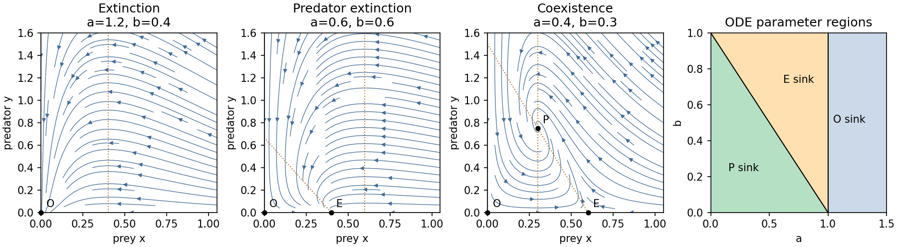

<h1 id="2/a/solution">Solution</h1>

↑ **Parent:** [A](../a.md)

Write $c=(1-a-b)/a$. The admissible [equilibrium points](../../../../../../equilibrium-point-of-a-dynamical-system.md) are $O=(0,0)$, $E=(1-a,0)$ when $a\le1$, and $P=(b,c)$ when $a+b\le1$. The [Jacobian matrix](../../../../../../jacobian-matrix.md) is

$$
J(x,y)=\begin{pmatrix}(1-a-2x)/a-y&-x\\y/b&x/b-1\end{pmatrix}.
$$

At $O$ the [eigenvalues](../../../../../../eigenvalue.md) are $(1-a)/a$ and $-1$; at $E$ they are $-(1-a)/a$ and $(1-a-b)/b$. At a positive coexistence [equilibrium point](../../../../../../equilibrium-point-of-a-dynamical-system.md),

$$
J(P)=\begin{pmatrix}-b/a&-b\\c/b&0\end{pmatrix},\quad
\operatorname{tr}J=-b/a<0,\quad\det J=c>0.
$$

It is therefore asymptotically stable. It is a node for $b^2>4a(1-a-b)$, a focus for the reverse inequality, and has repeated real [eigenvalues](../../../../../../eigenvalue.md) at equality. The node–focus change does not alter the attracting [equilibrium point](../../../../../../equilibrium-point-of-a-dynamical-system.md)'s topology.

There are three open physical parameter regions:

- **$a>1$: extinction.** Only $O$ is admissible and it is a sink.
- **$0<a<1$, $a+b>1$: predator extinction.** $O$ is a saddle, and $E$ is a sink.
- **$a+b<1$: coexistence.** $O$ and $E$ are saddles on the boundary, while $P$ is a sink.

The axes are invariant. On $x=0$, $y$ decays exponentially; on $y=0$, prey obey the [logistic differential equation](../../../../../../logistic-differential-equation.md). Positivity follows because each right-hand side has its population as a factor. Also $x$ is bounded by logistic comparison, while $W=x+by$ satisfies $\dot W=(1-a)x/a-x^2/a-by$, so all forward trajectories are bounded. The [Dulac function](../../../../../../dulac-function.md) $1/(xy)$ has divergence $-1/(ay)<0$ in the interior, excluding [periodic orbits](../../../../../../periodic-orbit.md) by the [Bendixson-Dulac criterion](../../../../../../bendixson-dulac-theorem.md).

In the extinction region, $\dot x\le-(a-1)x/a$, and then $\dot y/y=x/b-1$ is eventually negative. In the prey-only region, the upper bound $\limsup x\le1-a<b$ implies predator decay and convergence of interior prey to $1-a$. In the coexistence region the [Lyapunov function](../../../../../../lyapunov-function.md)

$$
\mathcal V=x-b-b\log(x/b)+b\big[y-c-c\log(y/c)\big]
$$

has $\dot{\mathcal V}=-(x-b)^2/a\le0$. Its positive-quadrant sublevel sets are compact, and the only invariant subset with $x=b$ also has $y=c$. The [LaSalle invariance principle](../../../../../../lasalle-s-invariance-principle.md) proves convergence of every interior trajectory to $P$. These facts justify the complete qualitative [phase portraits](../../../../../../phase-portrait.md), not just their local arrows.

At $a=1$, $O$ and $E$ meet in a [transcritical bifurcation](../../../../../../transcritical-bifurcation.md); positive prey decay algebraically. At $a+b=1$ with $a<1$, $E$ and $P$ exchange stability. On its [centre manifold](../../../../../../center-manifold.md), $x=b-ay+O(y^2)$ gives $\dot y=-ay^2/b+O(y^3)$, so the physically positive side is still attracting. There is no interior [Hopf bifurcation](../../../../../../hopf-bifurcation.md) since the coexistence [trace](../../../../../../matrix-trace.md) never vanishes.

**[Figure 1](#2/a/image-three-continuous-predator-prey-phase-portraits-and-their-parameter-regions). Three continuous predator–prey phase portraits and their parameter regions**.

## ↑ Ancestors (11)

1. [A](../a.md)
2. [2](../../2.md)
3. [Paper 65](../../../paper-65-split.md)
4. [Iii](../../../split.md)
5. [2005](../../../../split.md)
6. [Past exam of the mathematics course of the University of Cambridge](../../../../../split.md)
7. [Mathematics course of the University of Cambridge](../../../../../../mathematics-course-of-the-university-of-cambridge.md)
8. [Course of the University of Cambridge](../../../../../../course-of-the-university-of-cambridge.md)
9. [University of Cambridge](../../../../../../university-of-cambridge-split.md)
10. [List of universities](../../../../../../list-of-universities.md)
11. [Codex Wiki](../../../../../../split.md)
