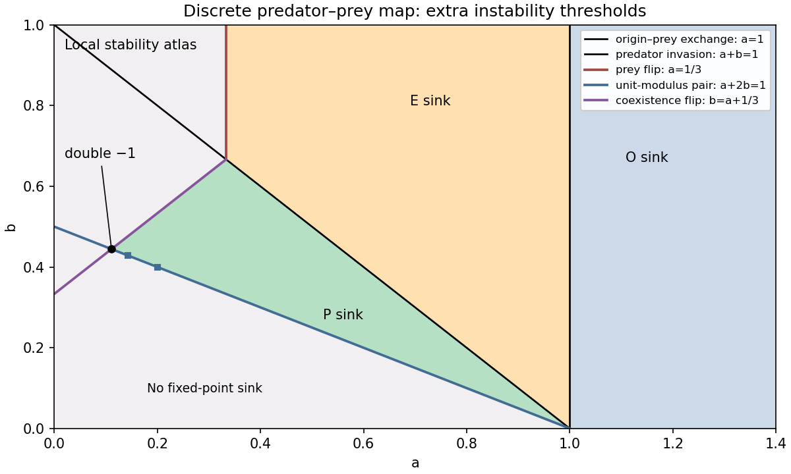

<h1 id="2/c/solution">Solution</h1>

↑ **Parent:** [C](../c.md)

The [quadratic discrete predator-prey map](../../../../../../quadratic-discrete-predator-prey-map.md) equals the identity plus the vector field of part (a), so its admissible [fixed points](../../../../../../fixed-point.md) are the same $O,E,P$. Their [Jacobian matrices](../../../../../../jacobian-matrix.md) are the identity plus the corresponding continuous-time [Jacobian matrices](../../../../../../jacobian-matrix.md), but map stability requires [eigenvalues](../../../../../../eigenvalue.md) inside the [unit circle](../../../../../../complex-unit-circle.md) rather than the left half-plane.

At $O$ the multipliers are $1/a,0$: it is a sink for $a>1$ and a saddle for $a<1$. At $E$ they are $2-1/a$ and $(1-a)/b$. Therefore

$$
\boxed{E\text{ is a sink}\iff \frac13<a<1,\quad b>1-a.}
$$

For $a<1/3$, the prey multiplier is below $-1$: $E$ is a saddle when $b>1-a$ and a repeller when $b<1-a$. For $1/3<a<1$, $b<1-a$ makes it a saddle. The $+1$ crossings at $a=1$ and $a+b=1$ are the two [transcritical bifurcations](../../../../../../transcritical-bifurcation.md) already encountered. The crossing at $a=1/3$ is a prey [period-doubling bifurcation](../../../../../../period-doubling-bifurcation.md).

At positive coexistence,

$$
J(P)=\begin{pmatrix}1-b/a&-b\\c/b&1\end{pmatrix},\quad
T=2-b/a,\quad D=(1-2b)/a.
$$

For clarity, derive the relevant [Schur stability criterion](../../../../../../schur-stability-criterion.md) directly: setting $z=(1+s)/(1-s)$ in $z^2-Tz+D$ gives

$$
(1-s)^2p\left(\frac{1+s}{1-s}\right)
=(1-T+D)+2(1-D)s+(1+T+D)s^2.
$$

The open unit disk maps to $\operatorname{Re}s<0$. A real quadratic has both roots there precisely when all three displayed coefficients have the same positive sign. Since $1-T+D=c>0$, the coexistence [fixed point](../../../../../../fixed-point.md) is a sink precisely when

$$
\boxed{\frac{1-a}{2}<b<\min\left(1-a,a+\frac13\right).}
$$

This region exists only for $a>1/9$. In the coexistence triangle $a+b<1$, put $K=1+T+D=(3a+1-3b)/a$. If $K<0$, one root lies below $-1$ and the other in $(-1,1)$, so $P$ is a saddle. If $K>0$ but $D>1$, it is a repeller; if $K>0,D<1$, it is a sink. These signs give the complete local fixed-point partition, including real and complex multipliers.

The coexistence [period-doubling bifurcation](../../../../../../period-doubling-bifurcation.md) lies at $b=a+1/3$; its segment adjoining the sink region has $1/9<a<1/3$. The other multiplier there is $2-1/(3a)$ and lies strictly inside the [unit circle](../../../../../../complex-unit-circle.md) on this segment. This coexistence flip is subcritical on that segment. To calculate its direction, normalize the $-1$ eigenvector by $q_f=(1,(2-b/a)/b)^T$ and the left eigenvector by $p_fq_f=1$. The symmetric quadratic derivative $\mathcal B$ is given explicitly in part (d). Eliminating the quadratic term from the one-dimensional [centre manifold](../../../../../../center-manifold.md) map gives the effective cubic flip coefficient

$$
c_f=\frac12p_f\mathcal B\left(q_f,(I-J)^{-1}\mathcal B(q_f,q_f)\right)
=-\frac9{(3a+1)^2(9a-1)}<0.
$$

For a scalar reduced map $u'=(-1+\delta)u+c_fu^3+\cdots$, its second iterate satisfies $u''-u=-2\delta u-2c_fu^3+\cdots$. Thus $u^2=-\delta/c_f>0$ on the stable-fixed-point side $\delta>0$, and the two-cycle multiplier is $1+4\delta+\cdots>1$. An unstable coexistence two-cycle meets the stable [fixed point](../../../../../../fixed-point.md) as $b$ increases to the flip curve. The other multiplier remains inside the unit circle. The complex unit-modulus crossing lies at $a+2b=1$, with $1/9<a<1$. The two curves meet at $(a,b)=(1/9,4/9)$ with a double multiplier $-1$. The prey flip and predator invasion curves meet at $(1/3,2/3)$ with multipliers $-1,+1$.

The sketches mark the sink regions and all these local thresholds. They are a local atlas, not a claim that the map has only these global attractors. Indeed the full nonnegative quadrant is not invariant: $x'=x(1-x-ay)/a$ becomes negative when $x+ay>1$. On the prey axis the [logistic map](../../../../../../logistic-map.md) already supplies new dynamics. Its nontrivial two-cycle, obtained by factoring $F^2(x)-x$ after removing the fixed-point factors, is

$$
x_\pm=\frac{1+a\pm\sqrt{(1-3a)(1+a)}}2,\qquad a<\frac13.
$$

Its longitudinal multiplier is $4+2/a-1/a^2$, so it is stable on the axis for $1/(1+\sqrt6)<a<1/3$. The transverse multiplier is $x_+x_-/b^2=a(1+a)/b^2$, making the cycle stable in the plane when additionally $b>\sqrt{a(1+a)}$. Further flips and more complicated logistic dynamics show why the differential equation's three global regions cannot be transferred unchanged to its unit-step map.

**[Figure 2](#2/c/image-local-stability-regions-and-fixed-point-bifurcation-curves-of-the-quadratic-predator-prey-map). Local stability regions and fixed-point bifurcation curves of the quadratic predator–prey map**.

## ↑ Ancestors (11)

1. [C](../c.md)
2. [2](../../2.md)
3. [Paper 65](../../../paper-65-split.md)
4. [Iii](../../../split.md)
5. [2005](../../../../split.md)
6. [Past exam of the mathematics course of the University of Cambridge](../../../../../split.md)
7. [Mathematics course of the University of Cambridge](../../../../../../mathematics-course-of-the-university-of-cambridge.md)
8. [Course of the University of Cambridge](../../../../../../course-of-the-university-of-cambridge.md)
9. [University of Cambridge](../../../../../../university-of-cambridge-split.md)
10. [List of universities](../../../../../../list-of-universities.md)
11. [Codex Wiki](../../../../../../split.md)
