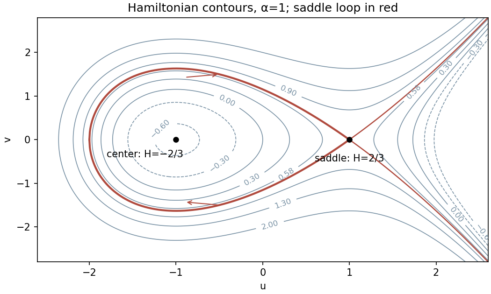

<h1 id="4/b/solution">Solution</h1>

↑ **Parent:** [B](../b.md)

Set $\tau=\varepsilon t$ and use the stated weighted spatial and parameter scales. Dividing the two equations by $\varepsilon^3$ and $\varepsilon^4$ respectively gives

$$
\boxed{u'=v,\qquad v'=u^2-\alpha+\varepsilon(\beta+u)v,}
$$

where prime now means differentiation with respect to $\tau$. The [Hamiltonian function](../../../../../../hamiltonian-function.md) satisfies

$$
\frac{dH}{d\tau}=(\alpha-u^2)u'+vv'
=\varepsilon(\beta+u)v^2.
$$

Thus $H=v^2/2+\alpha u-u^3/3$ is conserved for $\varepsilon=0$.

For $\alpha>0$, let $s=\sqrt\alpha$. The conservative system has a center at $(-s,0)$ with $H_c=-2\alpha^{3/2}/3$ and a saddle at $(s,0)$ with

$$
\boxed{H_h=\frac23\alpha^{3/2}.}
$$

Closed contours in the left potential well have $H_c<H<H_h$. At $H_h$ the left-hand separatrix is a [homoclinic orbit](../../../../../../homoclinic-orbit.md), since

$$
v^2=\frac23(u-s)^2(u+2s),\qquad -2s\le u\le s.
$$

It leaves and returns to $(s,0)$, with its left turning point at $u=-2s$. The right separatrix branches are unbounded. The energy levels above the saddle value are open, as are the separate right-hand components of lower energy levels. For $\alpha\le0$ there is no nondegenerate potential well and no such saddle loop.

**[Figure 3](#4/b/image-conserved-energy-contours-center-and-saddle-loop-of-the-leading-hamiltonian-system). Conserved-energy contours, center and saddle loop of the leading Hamiltonian system**.

## ↑ Ancestors (11)

1. [B](../b.md)
2. [4](../../4.md)
3. [Paper 65](../../../paper-65-split.md)
4. [Iii](../../../split.md)
5. [2005](../../../../split.md)
6. [Past exam of the mathematics course of the University of Cambridge](../../../../../split.md)
7. [Mathematics course of the University of Cambridge](../../../../../../mathematics-course-of-the-university-of-cambridge.md)
8. [Course of the University of Cambridge](../../../../../../course-of-the-university-of-cambridge.md)
9. [University of Cambridge](../../../../../../university-of-cambridge-split.md)
10. [List of universities](../../../../../../list-of-universities.md)
11. [Codex Wiki](../../../../../../split.md)
