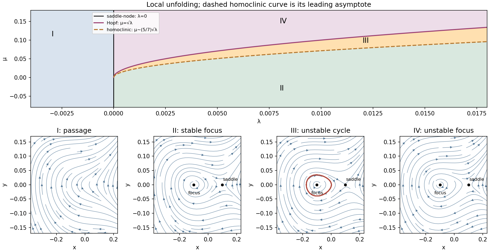

<h1 id="4/d/solution">Solution</h1>

↑ **Parent:** [D](../d.md)

A persistent saddle loop must return with the same energy. The [Melnikov energy-balance method](../../../../../../melnikov-energy-balance-method.md) therefore requires, at first order,

$$
0=\varepsilon\int_{-\infty}^{\infty}(\beta+u_0)v_0^2\,d\tau+O(\varepsilon^2).
$$

For the normalized orbit of part (c), put $z=\tanh(\tau/\sqrt2)$. Since $u_0=-2+3z^2$, $v_0^2=18(1-z^2)^2z^2$ and $d\tau=\sqrt2\,dz/(1-z^2)$,

$$
\begin{aligned}
I_0&=18\sqrt2\int_{-1}^{1}(z^2-z^4)\,dz=\frac{24\sqrt2}{5},\\
I_1&=18\sqrt2\int_{-1}^{1}(-2+3z^2)(z^2-z^4)\,dz=-\frac{24\sqrt2}{7}.
\end{aligned}
$$

For $s=\sqrt\alpha$ the general orbit has $I_0(s)=s^{5/2}I_0$ and $I_1(s)=s^{7/2}I_1$. The energy mismatch is therefore proportional to $I_0(s)[\beta-(5/7)s]$, whose derivative with respect to $\beta$ is nonzero. This simple zero selects the saddle-loop curve:

$$
\boxed{\beta=\frac57\sqrt\alpha+O(\varepsilon),\qquad
\mu_h=\frac57\sqrt\lambda+O(\lambda^{3/4}).}
$$

The remainder can be sharpened. Reversal of $\tau$ and $v$ interchanges $\varepsilon$ and $-\varepsilon$ without changing the saddle-loop condition. Smoothness of the homoclinic splitting thus makes the selected $\beta$ an even function of $\varepsilon$, giving

$$
\boxed{\mu_h(\lambda)=\frac57\sqrt\lambda+O(\lambda).}
$$

The leading coefficient alone is enough to separate it from the Hopf curve $\mu_H=\sqrt\lambda$. The integral hint in the PDF equals $2/(k+1)$ for nonnegative even integers $k$; for odd $k$ its integrand is odd and the integral is zero. Only even powers enter the calculation above.

Near the double-zero point, and with the stipulated absence of further bifurcations, the distinct open regions are:

- $\lambda<0$: no [equilibrium points](../../../../../../equilibrium-point-of-a-dynamical-system.md) or local [periodic orbits](../../../../../../periodic-orbit.md); $\dot y<0$ wherever $y=0$, and the flow passes through the bottleneck region.
- $\lambda>0$, $\mu<\mu_h$: a saddle and a stable node or focus, with no local [periodic orbit](../../../../../../periodic-orbit.md).
- $\lambda>0$, $\mu_h<\mu<\sqrt\lambda$: a saddle, a stable focus and an unstable [periodic orbit](../../../../../../periodic-orbit.md) surrounding the focus. This cycle is its local basin boundary.
- $\lambda>0$, $\mu>\sqrt\lambda$: a saddle and an unstable node or focus, with no small [periodic orbit](../../../../../../periodic-orbit.md).

On the homoclinic curve the cycle becomes a saddle loop; its positive saddle [trace](../../../../../../matrix-trace.md) $\mu+\sqrt\lambda$ makes the loop repelling on the cycle side. At the Hopf curve the unstable cycle shrinks into the negative [equilibrium point](../../../../../../equilibrium-point-of-a-dynamical-system.md). The node–focus [discriminant](../../../../../../discriminant.md) curves merely change the spiral appearance and are not additional bifurcations. The impossibility of a [periodic orbit](../../../../../../periodic-orbit.md) for $\lambda<0$ can also be seen without a picture: at a local minimum of periodic $x(t)$ one would have $y=0$ and $\ddot x=-\lambda+x^2>0$, but at its maximum the same strictly positive expression would be required to be nonpositive.

**[Figure 4](#4/d/image-local-saddle-node-subcritical-hopf-and-homoclinic-curves-with-the-four-nearby-phase-portraits). Local saddle-node, subcritical Hopf and homoclinic curves with the four nearby phase portraits**.

## ↑ Ancestors (11)

1. [D](../d.md)
2. [4](../../4.md)
3. [Paper 65](../../../paper-65-split.md)
4. [Iii](../../../split.md)
5. [2005](../../../../split.md)
6. [Past exam of the mathematics course of the University of Cambridge](../../../../../split.md)
7. [Mathematics course of the University of Cambridge](../../../../../../mathematics-course-of-the-university-of-cambridge.md)
8. [Course of the University of Cambridge](../../../../../../course-of-the-university-of-cambridge.md)
9. [University of Cambridge](../../../../../../university-of-cambridge-split.md)
10. [List of universities](../../../../../../list-of-universities.md)
11. [Codex Wiki](../../../../../../split.md)
