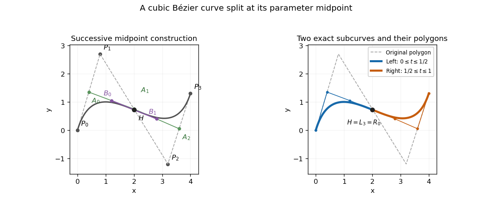

<h1 id="1/iv/solution">Solution</h1>

↑ **Parent:** [Iv](../iv.md)

A cubic [polynomial](../../../../../../polynomial-split.md) on either half is determined by its endpoint positions and endpoint [derivatives](../../../../../../derivative.md). Use normalized parameters $s=2t$ on the first half and $s=2t-1$ on the second, so that [derivatives](../../../../../../derivative.md) with respect to $s$ are half the [derivatives](../../../../../../derivative.md) with respect to $t$. Evaluation of the [Bernstein basis](../../../../../../bernstein-basis.md) at the split gives

$$
H=P(1/2)=\frac{P_0+3P_1+3P_2+P_3}{8},\qquad P'(1/2)=\frac34(-P_0-P_1+P_2+P_3).
$$

If the left [control points](../../../../../../control-point.md) are $L_0,\ldots,L_3$, endpoint positions give $L_0=P_0,L_3=H$. The cubic endpoint-derivative formulas give $3(L_1-L_0)=P'(0)/2$ and $3(L_3-L_2)=P'(1/2)/2$. On the right, $R_0=H,R_3=P_3$, $3(R_1-R_0)=P'(1/2)/2$ and $3(R_3-R_2)=P'(1)/2$. Substitution yields

$$
\boxed{\begin{aligned}
(L_0,L_1,L_2,L_3)&=\left(P_0,\frac{P_0+P_1}{2},\frac{P_0+2P_1+P_2}{4},H\right),\\
(R_0,R_1,R_2,R_3)&=\left(H,\frac{P_1+2P_2+P_3}{4},\frac{P_2+P_3}{2},P_3\right).
\end{aligned}}
$$

These are exact restricted [Bézier curves](../../../../../../bezier-curve.md), since they match all four endpoint Hermite data of the respective cubics.

The construction is also the midpoint case of [De Casteljau's algorithm](../../../../../../de-casteljau-s-algorithm.md). Form $A_j=(P_j+P_{j+1})/2$ for $j=0,1,2$, then $B_0=(A_0+A_1)/2$, $B_1=(A_1+A_2)/2$, and $H=(B_0+B_1)/2$. The two polygons are $(P_0,A_0,B_0,H)$ and $(H,B_1,A_2,P_3)$. Their common tangent edges satisfy $H-B_0=B_1-H$, as required for equal half-intervals. Thus the triangular midpoint construction simultaneously evaluates the split point and supplies the two exact representations.

**[Figure 1](#1/iv/image-midpoint-construction-and-the-two-exact-cubic-bezier-subcurves). Midpoint construction and the two exact cubic Bézier subcurves**.

## ↑ Ancestors (11)

1. [Iv](../iv.md)
2. [1](../../1.md)
3. [Paper 66](../../../paper-66-split.md)
4. [Iii](../../../split.md)
5. [2005](../../../../split.md)
6. [Past exam of the mathematics course of the University of Cambridge](../../../../../split.md)
7. [Mathematics course of the University of Cambridge](../../../../../../mathematics-course-of-the-university-of-cambridge.md)
8. [Course of the University of Cambridge](../../../../../../course-of-the-university-of-cambridge.md)
9. [University of Cambridge](../../../../../../university-of-cambridge-split.md)
10. [List of universities](../../../../../../list-of-universities.md)
11. [Codex Wiki](../../../../../../split.md)
