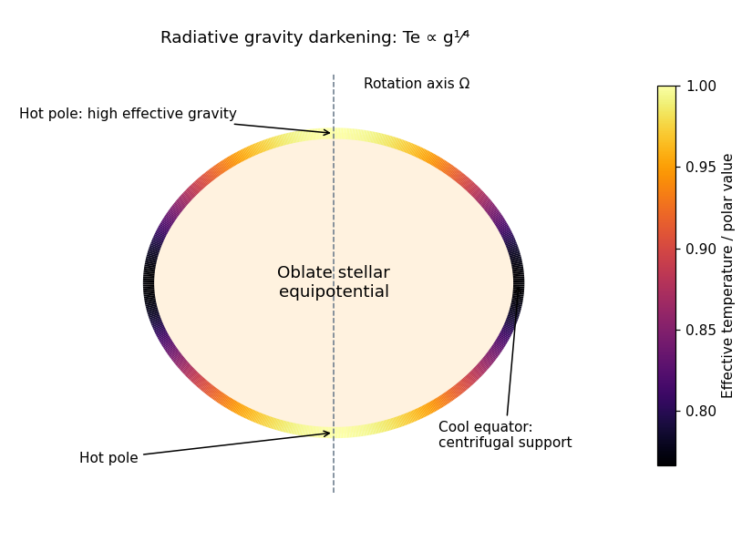

<h1 id="3/solution">Solution</h1>

↑ **Parent:** [3](../3.md)

**Mechanical balance and equipotentials.** Let $\Phi$ be the [Newtonian gravitational potential](../../../../../newtonian-gravitational-potential.md) and $\varpi$ the cylindrical distance from the rotation axis. For rigid angular velocity $\Omega$, a fluid element at rest in the rotating frame has no Coriolis acceleration. The centrifugal acceleration is $\Omega^2\varpi\,\widehat\varpi$, so [hydrostatic equilibrium](../../../../../hydrostatic-equilibrium.md) becomes

$$
\boldsymbol\nabla P=-\rho\boldsymbol\nabla\phi,\qquad
\phi=\Phi-\frac12\Omega^2\varpi^2.
$$

Using the [Poisson equation](../../../../../poisson-equation.md) for gravity and $\boldsymbol\nabla^2(x^2+y^2)=4$ gives

$$
\boxed{\boldsymbol\nabla^2\phi=4\pi G\rho-2\Omega^2.}
$$

On any regular connected [equipotential surface](../../../../../equipotential-surface.md), every tangent displacement satisfies $d\phi=0$ and therefore $dP=0$. Locally $P=P(\phi)$, with $dP/d\phi=-\rho$. This makes $\rho$ a function of $\phi$ as well. Equivalently, taking the curl of the hydrostatic equation gives $\boldsymbol\nabla\rho\times\boldsymbol\nabla\phi=0$. Thus $P,\rho$ and $\boldsymbol\nabla^2\phi$ are constant on each surface. The last conclusion follows from the modified [Poisson equation](../../../../../poisson-equation.md); it does not constrain the magnitude of the first derivative $|\boldsymbol\nabla\phi|$ to be constant there.

For uniform composition, an [equation of state](../../../../../equation-of-state.md) $P=P(\rho,T)$ determines $T$ uniquely at fixed $P,\rho$ in the usual stellar regime. For the gas-plus-radiation equation, the derivative with respect to $T$ is positive. Hence $T=T(\phi)$, and the [opacity](../../../../../opacity.md) and [radiative conductivity](../../../../../radiative-conductivity.md) are also functions of $\phi$.

**Surface flux and the requested sketch.** Define $f(\phi)=-\chi\,dT/d\phi$, positive for the outward radiative flux. Then

$$
\mathbf F=f(\phi)\boldsymbol\nabla\phi,\qquad\chi=\frac{4acT^3}{3\kappa\rho}.
$$

On an outer [equipotential surface](../../../../../equipotential-surface.md), $f$ is constant and the outward normal is parallel to $\boldsymbol\nabla\phi$. Its effective gravity is $g=|\boldsymbol\nabla\phi|$, so $F_n=fg$. The [Stefan–Boltzmann law](../../../../../stefan-boltzmann-law.md) $F_n=\sigma_{\rm SB}T_e^4$ gives the [radiative gravity-darkening law](../../../../../radiative-gravity-darkening-law.md),

$$
\boxed{T_e\propto g^{1/4}.}
$$

A rapidly rotating star is oblate. Centrifugal support reduces the effective gravity near the equator, which is therefore cooler and dimmer; the poles are hotter. The original sketch below uses a subcritical [Roche model of a uniformly rotating star](../../../../../roche-model-of-a-uniformly-rotating-star.md) to show this geometry and the corresponding [temperature](../../../../../temperature.md) variation. The material [temperature](../../../../../temperature.md) on an interior equipotential is not the same quantity as the emergent [effective temperature](../../../../../effective-temperature.md) defined by surface flux.

**[Figure 1](#3/image-oblate-rotating-star-with-hot-poles-cool-equator-and-radiative-gravity-darkening). Oblate rotating star with hot poles, cool equator and radiative gravity darkening**.

**Why purely local radiative balance fails.** Differentiating the flux gives

$$
\boldsymbol\nabla\cdot\mathbf F=f'(\phi)|\boldsymbol\nabla\phi|^2+f(\phi)\boldsymbol\nabla^2\phi.
$$

On one equipotential, $f,f',\boldsymbol\nabla^2\phi$ and the proposed source $\rho\epsilon(\rho,T)$ are all constant, but $|\boldsymbol\nabla\phi|^2$ generally varies with latitude. Unless $f'=0$ or there is another special cancellation, no single value of $\rho\epsilon$ can match this flux divergence at all points on the surface. This is the [radiative-equilibrium obstruction in a rotating barotropic star](../../../../../radiative-equilibrium-obstruction-in-a-rotating-barotropic-star.md). Slow [stellar meridional circulation](../../../../../meridional-circulation-in-a-star.md) can transport heat to compensate; it is distinct from abandoning hydrostatic balance at leading order.

**Integrated energy balance with circulation.** The steady [continuity equation](../../../../../continuity-equation.md) is $\boldsymbol\nabla\cdot(\rho\mathbf v)=0$. Combining the [entropy](../../../../../entropy.md)–[enthalpy](../../../../../enthalpy.md) relation with hydrostatic balance gives

$$
\rho T\mathbf v\cdot\boldsymbol\nabla s
=\rho\mathbf v\cdot\boldsymbol\nabla h-\mathbf v\cdot\boldsymbol\nabla P
=\rho\mathbf v\cdot\boldsymbol\nabla(h+\phi)
=\boldsymbol\nabla\cdot[\rho\mathbf v(h+\phi)].
$$

Integrate the energy equation over $V$ and apply the [divergence theorem](../../../../../divergence-theorem.md):

$$
\int_S\mathbf F\cdot d\mathbf S
=\int_V\rho\epsilon\,dV-\int_S\rho(h+\phi)\mathbf v\cdot d\mathbf S.
$$

Uniform composition makes $h=h(\rho,T)$ constant on the enclosing equipotential, and $\phi$ is constant there by definition. Pull $(h+\phi)$ out of the last integral; the remaining net mass flux is zero by steady continuity. Thus the [equipotential luminosity conservation with stellar circulation](../../../../../equipotential-luminosity-conservation-with-stellar-circulation.md) is

$$
\boxed{L=\int_S\mathbf F\cdot d\mathbf S=\int_V\rho\epsilon\,dV.}
$$

This does not require $\mathbf v\cdot\widehat n=0$ pointwise on $S$: inward and outward circulation may cancel in the net mass flux.

Finally, $f$ is constant on $S$ and the [divergence theorem](../../../../../divergence-theorem.md) applied to the effective potential gives

$$
L=f\int_S\boldsymbol\nabla\phi\cdot d\mathbf S
=f\int_V(4\pi G\rho-2\Omega^2)\,dV
=f(4\pi Gm-2\Omega^2V).
$$

Therefore $-\chi\,dT/d\phi=L/(4\pi Gm-2\Omega^2V)$. Since $dP/d\phi=-\rho$,

$$
\begin{aligned}
\frac{d\ln T}{d\ln P}&=-\frac{P}{\rho T}\frac{dT}{d\phi}
=\frac{PL}{\rho T\chi(4\pi Gm-2\Omega^2V)}\\
&=\boxed{\frac{3\kappa PL}{16\pi acGmT^4}
\left(1-\frac{\Omega^2V}{2\pi Gm}\right)^{-1}}.
\end{aligned}
$$

The mass $m$ is the mass enclosed by this surface, not necessarily the total stellar mass. The denominator is positive for the regular hydrostatic surfaces used here; near loss of centrifugal confinement the assumed stellar model must be reconsidered. The derivation uses slow circulation, retaining hydrostatic/equipotential thermodynamics to leading order while allowing a nonzero advective heat flux.

## ↑ Ancestors (10)

1. [3](../3.md)
2. [Paper 70](../../paper-70-split.md)
3. [Iii](../../split.md)
4. [2005](../../../split.md)
5. [Past exam of the mathematics course of the University of Cambridge](../../../../split.md)
6. [Mathematics course of the University of Cambridge](../../../../../mathematics-course-of-the-university-of-cambridge.md)
7. [Course of the University of Cambridge](../../../../../course-of-the-university-of-cambridge.md)
8. [University of Cambridge](../../../../../university-of-cambridge-split.md)
9. [List of universities](../../../../../list-of-universities.md)
10. [Codex Wiki](../../../../../split.md)
