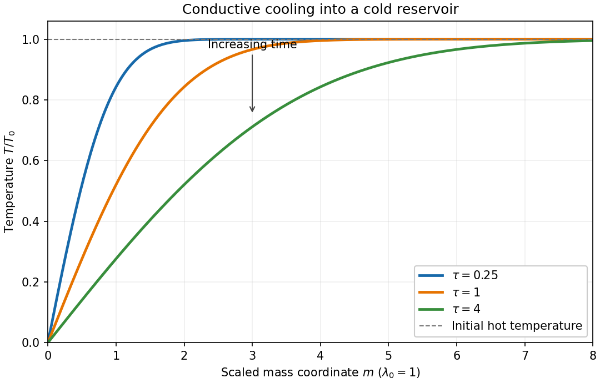

<h1 id="3/solution">Solution</h1>

↑ **Parent:** [3](../3.md)

A spatially uniform [pressure](../../../../../pressure.md) is a useful leading approximation when the [sound speed](../../../../../speed-of-sound.md) makes the acoustic crossing time much shorter than the [radiative cooling](../../../../../radiative-cooling.md) and [thermal conduction](../../../../../thermal-conduction.md) times. The motions must remain at low [Mach number](../../../../../mach-number.md), and gravity and other stresses must be negligible. Sound then redistributes [pressure](../../../../../pressure.md) before appreciable thermal evolution occurs. Small [pressure](../../../../../pressure.md) corrections can still drive the slow motion; imposing exactly zero [pressure](../../../../../pressure.md) gradient in the full momentum equation at every order would be a stronger assumption.

The [equation of state](../../../../../equation-of-state.md) gives the specific [internal energy of an ideal gas](../../../../../internal-energy-of-an-ideal-gas.md) as $e=p/[(\gamma-1)\rho]$. With $D/Dt=\partial_t+v\partial_x$, the [continuity equation](../../../../../continuity-equation.md) is $D\rho/Dt=-\rho v_x$. Differentiating $e$ therefore yields

$$
\rho\frac{De}{Dt}=\frac1{\gamma-1}\left(\frac{Dp}{Dt}+pv_x\right).
$$

Insert this into the [internal energy](../../../../../internal-energy.md) equation, whose compressional term is $-pv_x$, and use spatially uniform [pressure](../../../../../pressure.md), so $Dp/Dt=p_t$. The result is

$$
\boxed{\frac{p_t}{\gamma-1}+\frac{\gamma p}{\gamma-1}v_x+\rho^2\Lambda(T)-\partial_x(\lambda T_x)=0.}
$$

For temporally constant [pressure](../../../../../pressure.md) put $A=\mu p/\mathcal R$, so the [mass density](../../../../../density.md) is $\rho=A/T$. The [continuity equation](../../../../../continuity-equation.md) now gives $v_x=T^{-1}DT/Dt$. Multiplication of the last equation by $(\gamma-1)T/(\gamma p)$, with $\lambda=\lambda_0T^\alpha$, gives

$$
\boxed{\frac{DT}{Dt}+C\frac{\Lambda(T)}{T}-\frac{\gamma-1}{\gamma}\frac{\lambda_0T}{p}\partial_x(T^\alpha T_x)=0,\qquad C=\frac{\gamma-1}{\gamma}\left(\frac\mu{\mathcal R}\right)^2p.}
$$

This is the [isobaric conductive cooling in mass coordinates](../../../../../isobaric-conductive-cooling-in-mass-coordinates.md) transformation before changing coordinates.

There is a boundary assumption implicit in the proposed [Lagrangian coordinate](../../../../../lagrangian-coordinate.md). For a mass integral from a fixed origin, integration of the [continuity equation](../../../../../continuity-equation.md) gives

$$
m_x=\rho,\qquad m_t=-\rho v+\rho(0,t)v(0,t),\qquad \frac{Dm}{Dt}=\rho(0,t)v(0,t).
$$

Thus $m$ is material when the base [mass flux](../../../../../mass-flux.md) vanishes, as appropriate for the stationary cold reservoir below. If the origin permits [mass flux](../../../../../mass-flux.md), replace $m$ by $m-\int^t\rho(0,s)v(0,s)\,ds$; this corrected label has zero [material derivative](../../../../../material-derivative.md). In a material mass coordinate, $D/Dt=\partial_t|_m$ and $\partial_x=(A/T)\partial_m$. In particular

$$
\partial_x(T^\alpha T_x)=\frac{A^2}{T}\partial_m(T^{\alpha-1}T_m).
$$

The conduction coefficient therefore becomes $C\lambda_0$, with the same $C$ as the cooling coefficient. With $\tau=Ct$, the equation is

$$
\boxed{T_\tau+\frac{\Lambda(T)}{T}-\lambda_0\partial_m(T^{\alpha-1}T_m)=0.}
$$

In the hot gas there is no volumetric [radiative cooling](../../../../../radiative-cooling.md). The initial [temperature](../../../../../temperature.md) is uniform and the cold boundary introduces no finite mass length. The remaining nonlinear [diffusion equation](../../../../../diffusion-equation-split.md) is invariant under $m\mapsto bm$, $\tau\mapsto b^2\tau$ with the same [temperature](../../../../../temperature.md) scale. Its natural [similarity solution](../../../../../similarity-solution.md) is therefore

$$
T=T_0f(\xi),\qquad \xi=\frac{m}{\sqrt{\lambda_0T_0^{\alpha-1}\tau}},\qquad
\boxed{f(0)=0,\quad f(\infty)=1.}
$$

The far-field condition also recovers the initial [temperature](../../../../../temperature.md) at every fixed $m>0$ as $\tau\downarrow0$. Substitution gives the [ordinary differential equation](../../../../../ordinary-differential-equation.md)

$$
(f^{\alpha-1}f')'+\frac\xi2 f'=0.
$$

For $\alpha=1$, this reduces to $f''+\xi f'/2=0$. Integrating first for $f'$ gives $f'=K\exp(-\xi^2/4)$. The two [boundary conditions](../../../../../boundary-condition.md) fix $K=1/\sqrt\pi$, hence the [error-function isobaric cooling front](../../../../../error-function-isobaric-cooling-front.md) is

$$
\boxed{f(\xi)=\operatorname{erf}(\xi/2),\qquad T(m,\tau)=T_0\operatorname{erf}\!\left(\frac{m}{2\sqrt{\lambda_0\tau}}\right).}
$$

Here the [error function](../../../../../error-function.md) has normalization $2/\sqrt\pi$, as printed in the original PDF; the converted TeX's $2/\pi$ is incorrect. The following original sketch shows the [temperature](../../../../../temperature.md) profiles. The cooling layer broadens as $\sqrt\tau$, and at fixed positive mass label the [temperature](../../../../../temperature.md) falls as time increases, while the remote hot gas remains at $T_0$.

**[Figure 1](#3/image-isobaric-conductive-cooling-profiles-at-increasing-scaled-times). Isobaric conductive cooling profiles at increasing scaled times**.

For $\alpha=1$, the magnitude of the [heat flux](../../../../../heat-flux-density.md) into the cold reservoir is

$$
L=\left.\lambda T_x\right|_{0^+}=\lambda_0 A T_m(0,\tau).
$$

Although the [thermal conductivity](../../../../../thermal-conductivity.md) tends to zero there, the physical [temperature gradient](../../../../../temperature-gradient.md) diverges: their product has this finite limit. The stationary reservoir has no incoming advective energy flux and radiates the conducted energy immediately. Since $T_m(0,\tau)=T_0/\sqrt{\pi\lambda_0\tau}$, the radiated power per unit area is

$$
\boxed{L=\frac{A T_0\sqrt{\lambda_0}}{\sqrt{\pi\tau}}=T_0\sqrt{\frac{\gamma p\lambda_0}{(\gamma-1)\pi}}\,t^{-1/2}.}
$$

Thus **the requested exponent is $\boxed{k=1/2}$**. The initial [divergence](../../../../../divergence.md) is the usual idealization of an instantaneous [temperature](../../../../../temperature.md) discontinuity in a [diffusion equation](../../../../../diffusion-equation-split.md).

## ↑ Ancestors (10)

1. [3](../3.md)
2. [Paper 71](../../paper-71-split.md)
3. [Iii](../../split.md)
4. [2005](../../../split.md)
5. [Past exam of the mathematics course of the University of Cambridge](../../../../split.md)
6. [Mathematics course of the University of Cambridge](../../../../../mathematics-course-of-the-university-of-cambridge.md)
7. [Course of the University of Cambridge](../../../../../course-of-the-university-of-cambridge.md)
8. [University of Cambridge](../../../../../university-of-cambridge-split.md)
9. [List of universities](../../../../../list-of-universities.md)
10. [Codex Wiki](../../../../../split.md)
