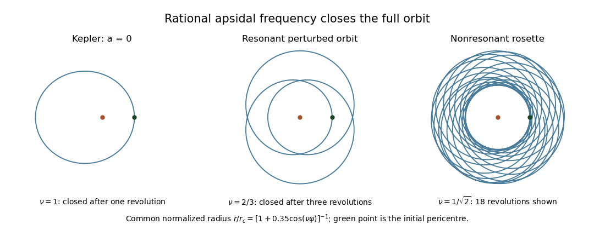

<h1 id="4/b/solution">Solution</h1>

↑ **Parent:** [B](../b.md)

Set $\mu=GM>0$ and interpret $L$ in the displayed equation as [specific angular momentum](../../../../../../specific-angular-momentum.md), $L=r^2\dot\psi$, rather than total [angular momentum](../../../../../../angular-momentum.md). The [gravitational potential](../../../../../../newtonian-potential-of-a-point-mass.md) is per unit [mass](../../../../../../mass.md) and $a$ has dimensions of length. [Spherical symmetry](../../../../../../spherical-symmetry.md) fixes the orbital plane and conserves the vector [angular momentum](../../../../../../angular-momentum.md), while the autonomous [specific orbital energy](../../../../../../specific-orbital-energy.md) is also conserved.

For the [orbit equation for combined inverse-square and inverse-cube attraction](../../../../../../orbit-equation-for-combined-inverse-square-and-inverse-cube-attraction.md), define

$$
\nu^2=1-\frac{2\mu a}{L^2}.
$$

A regular nonradial bounded oscillation requires $L\ne0$ and $L^2-2\mu a>0$. Solving the linear [Binet equation](../../../../../../binet-equation.md) then gives

$$
\boxed{u(\psi)=\frac{\mu}{L^2-2\mu a}\left[1+e\cos\bigl(\nu(\psi-\psi_0)\bigr)\right].}
$$

For a noncircular bound [orbit](../../../../../../orbit-dynamical-system.md) $0<e<1$; its [specific orbital energy](../../../../../../specific-orbital-energy.md) is $E=\mu^2(e^2-1)/[2(L^2-2\mu a)]$. The [effective potential](../../../../../../effective-potential.md) $[L^2-2\mu a]/(2r^2)-\mu/r$ has a [centrifugal barrier](../../../../../../centrifugal-barrier.md) and a minimum in this case. If $L^2-2\mu a\leq0$, the oscillator frequency is zero or imaginary and there is no regular finite-radius bound oscillation: the attractive centre lacks a [centrifugal barrier](../../../../../../centrifugal-barrier.md). Unbound branches with $e\geq1$ are not closed ellipselike trajectories.

Successive pericentres differ in angle by $2\pi/\nu$. The full [phase space](../../../../../../phase-space.md) state returns after $p$ radial oscillations and $q$ revolutions precisely when

$$
\boxed{\nu=\frac pq\in\mathbb Q_{>0},\qquad L^2=\frac{2\mu a}{1-p^2/q^2},}
$$

where $p,q$ are coprime positive integers; the second formula applies when $a\ne0$. Thus $a>0$ requires $0<p/q<1$ and $L^2>2\mu a$, whereas $a<0$ requires $p/q>1$. An irrational $\nu$ advances the apsidal direction through a dense set of angles and gives a nonclosed rosette, with only the four regular spherical invariants needed to label its two-dimensional closure.

**[Figure 1](#4/b/image-closed-rational-frequency-orbits-and-a-nonclosed-irrational-frequency-rosette-in-an-inverse-cube-perturbed-central-force). Closed rational-frequency orbits and a nonclosed irrational-frequency rosette in an inverse-cube-perturbed central force**.

To see the additional resonant label explicitly, let $u_c=\mu/(L^2-2\mu a)$ and $w=u-u_c-i u'/\nu$. Then $w=C e^{i\nu(\psi-\psi_0)}$, so on a family with fixed resonant $L$,

$$
\boxed{w^q e^{-ip\psi}=C^q e^{-ip\psi_0}.}
$$

Its argument fixes the remaining apsidal phase modulo the symmetry of the closed curve; its magnitude is already determined by [specific orbital energy](../../../../../../specific-orbital-energy.md) and $L$. Choosing reference axes in the fixed orbital plane makes this single-valued under $\psi\mapsto\psi+2\pi$. This is the fifth independent [orbit](../../../../../../orbit-dynamical-system.md) label on the resonant family described by [closed orbits with an inverse-cube perturbation](../../../../../../closed-orbits-with-an-inverse-cube-perturbation.md).

For $a\ne0$, $\nu$ varies with $L$. The [orbital resonance](../../../../../../orbital-resonance.md) condition holds only on selected [angular momentum](../../../../../../angular-momentum.md) surfaces, so this construction is not a fifth global smooth integral on an open set of arbitrary nearby $L$. If the question asks for a maximally [superintegrable Hamiltonian system](../../../../../../superintegrable-hamiltonian-system.md) on an open region of noncircular bound orbits, the required case is **$a=0$**: then $\nu=1$ for every $L$, and the conserved [Laplace-Runge-Lenz vector](../../../../../../laplace-runge-lenz-vector.md) $\mathbf A=\mathbf v\times\mathbf L-\mu\widehat{\mathbf r}$ fixes the apsidal direction globally. The relations $\mathbf A\cdot\mathbf L=0$ and $A^2=\mu^2+2EL^2$ leave five independent constants. For the usual orbit-wise interpretation, noncircular bound [orbits](../../../../../../orbit-dynamical-system.md) with rational $\nu$ have five isolating labels; irrational $\nu$ has four. [Circular orbits](../../../../../../circular-orbit.md) are closed for any allowed $\nu$ but have no independent apsidal phase, so the generic noncircular count cannot simply be applied to them.

For completeness, regular unbound branches are different. When $e\geq1$ and $\nu>0$, positive radius restricts the radial phase to $|\nu(\psi-\psi_0)|<\arccos(-1/e)\leq\pi$. The [apsidal invariant on an unbound central-force branch](../../../../../../apsidal-invariant-on-an-unbound-central-force-branch.md) is

$$
\exp\!\left(i\psi-\frac{i}{\nu}\operatorname{Arg}w\right)=e^{i\psi_0}.
$$

The principal argument is continuous on this scattering branch because it never reaches an apocentre across the negative-real-axis cut. Thus the periapsis direction can be a fifth single-valued scattering label for any positive $\nu$, including irrational $\nu$; the rationality condition applies to the noncircular bound case. For plunging or collision branches with $L^2-2\mu a\leq0$, local trajectory labels can still be defined away from the singular centre, but the preceding periodic-orbit criterion is inapplicable and no smooth continuation through $r=0$ is asserted.

## ↑ Ancestors (11)

1. [B](../b.md)
2. [4](../../4.md)
3. [Paper 72](../../../paper-72-split.md)
4. [Iii](../../../split.md)
5. [2005](../../../../split.md)
6. [Past exam of the mathematics course of the University of Cambridge](../../../../../split.md)
7. [Mathematics course of the University of Cambridge](../../../../../../mathematics-course-of-the-university-of-cambridge.md)
8. [Course of the University of Cambridge](../../../../../../course-of-the-university-of-cambridge.md)
9. [University of Cambridge](../../../../../../university-of-cambridge-split.md)
10. [List of universities](../../../../../../list-of-universities.md)
11. [Codex Wiki](../../../../../../split.md)
