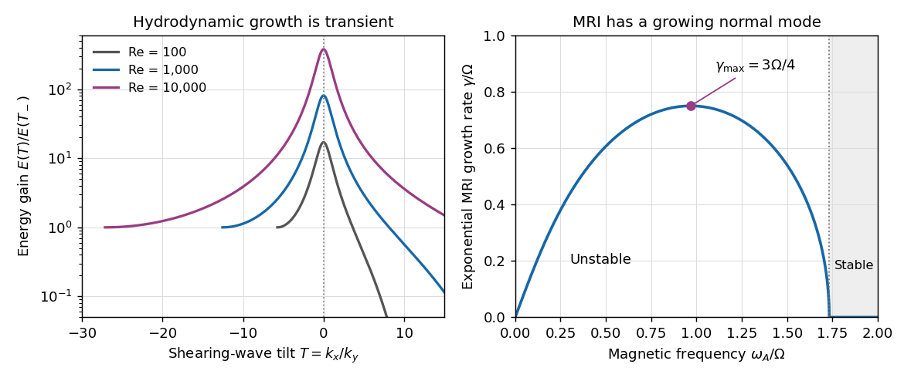

<h1 id="3/solution">Solution</h1>

↑ **Parent:** [3](../3.md)

Consider a local [shearing sheet](../../../../../shearing-sheet.md) centered at a circular orbit. Take uniform [mass density](../../../../../density.md), background velocity $\mathbf u_0=-2Ax\mathbf e_y$, rotation $\boldsymbol\Omega=\Omega\mathbf e_z$ and a weak uniform vertical [magnetic field](../../../../../magnetic-field.md) $\mathbf B_0=B_0\mathbf e_z$. Here

$$
A=-\frac12r\frac{d\Omega}{dr},\qquad \kappa_r^2=4\Omega(\Omega-A).
$$

Use [ideal magnetohydrodynamics](../../../../../ideal-magnetohydrodynamics.md), neglect [viscosity](../../../../../dynamic-viscosity.md), [magnetic diffusion](../../../../../magnetic-diffusion.md) and vertical stratification, and take incompressible axisymmetric disturbances proportional to $e^{ikz-i\omega t}$. They have horizontal velocity and field perturbations. Let $\mathbf b=\delta\mathbf B/\sqrt{\mu_0\rho}$ be the magnetic perturbation in velocity units, $v_A=B_0/\sqrt{\mu_0\rho}$ the [Alfvén speed](../../../../../alfven-speed.md) and $\omega_A=kv_A$ the [Alfvén frequency](../../../../../alfven-frequency.md). Magnetic [pressure](../../../../../pressure.md) can be included in the perturbation's total [pressure](../../../../../pressure.md); the horizontal Lorentz force for this mode is the [magnetic tension](../../../../../magnetic-tension.md) term $i\omega_A\mathbf b$.

Linearizing momentum and induction gives

$$
\begin{aligned}
-i\omega u_x-2\Omega u_y&=i\omega_A b_x,\\
-i\omega u_y+2(\Omega-A)u_x&=i\omega_A b_y,\\
-i\omega b_x&=i\omega_Au_x,\\
-i\omega b_y&=-2Ab_x+i\omega_Au_y.
\end{aligned}
$$

The term $-2Ab_x$ winds a radial magnetic perturbation into an azimuthal one. Omitting it would remove the shear's magnetic [energy](../../../../../energy.md) source and give the wrong stability criterion.

A useful elimination that also covers neutral modes introduces the fluid displacement $\boldsymbol\xi$. Frozen-in [flux](../../../../../flux.md) gives $\mathbf b=i\omega_A\boldsymbol\xi$, while the Eulerian perturbation velocity is $u_x=\dot\xi_x$, $u_y=\dot\xi_y+2A\xi_x$, because the displacement samples the gradient of the basic flow. The equations become the [spring model of magnetorotational instability](../../../../../spring-model-of-magnetorotational-instability.md):

$$
\ddot\xi_x-2\Omega\dot\xi_y-4\Omega A\xi_x=-\omega_A^2\xi_x,\qquad \ddot\xi_y+2\Omega\dot\xi_x=-\omega_A^2\xi_y.
$$

For the stated time dependence, their [determinant](../../../../../determinant.md) is

$$
\det\begin{pmatrix}\omega_A^2-\omega^2-4\Omega A&2i\Omega\omega\\-2i\Omega\omega&\omega_A^2-\omega^2\end{pmatrix}=0.
$$

Thus the [ideal magnetorotational dispersion relation](../../../../../ideal-magnetorotational-dispersion-relation.md) is

$$
\boxed{(\omega^2-\omega_A^2)^2-4\Omega(\Omega-A)\omega^2-4\Omega A\omega_A^2=0.}
$$

It follows without dividing by $\omega$, so the neutral stability boundary is included.

To analyze it, put $a=\omega_A^2$ and $Y=\omega^2$. Then

$$
Y^2-(\kappa_r^2+2a)Y+a(a-4\Omega A)=0,\qquad Y_\pm=a+\frac{\kappa_r^2}{2}\pm\frac12\sqrt{\kappa_r^4+16\Omega^2a}.
$$

For a hydrodynamically stable rotation law, $\kappa_r^2>0$, the sum of the two roots is positive. Their product is negative precisely when $0<a<4\Omega A$. One squared frequency is then negative, giving an exponentially growing mode $\omega=i\gamma$ and its decaying partner. Therefore the [magnetorotational instability](../../../../../magnetorotational-instability.md), or [MRI](../../../../../magnetorotational-instability.md), has criterion

$$
\boxed{\frac{d\Omega^2}{d\ln r}=-4\Omega A<0,\qquad 0<\omega_A^2<4\Omega A.}
$$

Angular velocity must decrease outwards, although [specific angular momentum](../../../../../specific-angular-momentum.md) may increase outwards and satisfy [Rayleigh's circulation criterion](../../../../../rayleigh-s-circulation-criterion.md). This is why a Keplerian disc can be stable to the axisymmetric hydrodynamic disturbances of Question 2 yet unstable once magnetic coupling is introduced. At zero magnetic frequency the unstable root becomes neutral, while sufficiently large magnetic frequency restores stability. For increasing angular velocity, $A<0$ with $\Omega>0$, this ideal vertical-field instability is absent.

The [growth rate](../../../../../growth-rate.md) is

$$
\gamma^2=\frac12\left[\sqrt{\kappa_r^4+16\Omega^2a}-\kappa_r^2-2a\right].
$$

For $0<A<\Omega$, differentiation with respect to $a$ sets $\sqrt{\kappa_r^4+16\Omega^2a}=4\Omega^2$, yielding the [maximum growth rate of ideal magnetorotational instability](../../../../../maximum-growth-rate-of-ideal-magnetorotational-instability.md):

$$
\boxed{\omega_{A,\max}^2=A(2\Omega-A),\qquad \gamma_{\max}=A.}
$$

For [Keplerian rotation](../../../../../keplerian-disk.md), $A=3\Omega/4$, so

$$
\boxed{0<\omega_A^2<3\Omega^2,\qquad \omega_{A,\max}^2=\frac{15}{16}\Omega^2,\qquad \gamma_{\max}=\frac34\Omega.}
$$

Thus the fastest growth is on an orbital timescale. The field strength selects its wavelength, $k_{\max}\propto1/v_A$, rather than the maximum ideal [growth rate](../../../../../growth-rate.md). At fixed $k$, growth does approach zero as $B_0\to0$; retaining the finite maximum in that limit requires shorter wavelengths, which [magnetic diffusion](../../../../../magnetic-diffusion.md) can eventually exclude. Unstable wavelengths satisfy $\lambda>2\pi v_A/\sqrt{4\Omega A}$ in this local model. A finite disc must accommodate such a wavelength, so a sufficiently strong field can suppress the available vertical modes through excessive tension.

Physically, a bent field line acts like a spring joining neighboring fluid elements. The inner element rotates faster and pulls the outer element forward, transferring [angular momentum](../../../../../angular-momentum.md) outward. The inner element loses [angular momentum](../../../../../angular-momentum.md) and moves inward; the outer element gains it and moves outward. In a rotation law with outward-decreasing angular velocity, these motions increase their angular-velocity difference and the magnetic coupling produces further separation. A weak restoring spring therefore creates a feedback instability by enabling angular-momentum exchange. Without that exchange, each displaced element keeps its [angular momentum](../../../../../angular-momentum.md) and a positive epicyclic frequency restores its orbit. Strong [magnetic tension](../../../../../magnetic-tension.md) instead prevents the separation. The free [energy](../../../../../energy.md) is the [differential rotation](../../../../../differential-rotation.md), not the initial magnetic [energy](../../../../../energy.md).

The instability provides an important route to turbulence and [angular momentum transport](../../../../../angular-momentum-transport.md) in sufficiently conducting [accretion discs](../../../../../accretion-disk.md). The radial [flux](../../../../../flux.md) of azimuthal momentum includes the stress

$$
T_{xy}=\rho\langle u_xu_y\rangle-\frac{\langle\delta B_x\delta B_y\rangle}{\mu_0}.
$$

The first term is a [Reynolds stress](../../../../../reynolds-stress.md) and the second is the magnetic contribution from the [Maxwell stress tensor](../../../../../maxwell-stress-tensor.md), with the sign appropriate to momentum [flux](../../../../../flux.md). For the growing branch, take $u_x$ real and positive. The linear equations give $u_y/u_x=(\gamma^2+a)/(2\Omega\gamma)>0$ and $b_y/b_x=(\gamma^2+a-4\Omega A)/(2\Omega\gamma)<0$. The last sign follows from $(\gamma^2+a)(\gamma^2+a-4\Omega A)+4\Omega^2\gamma^2=0$. Thus both the velocity and magnetic contributions carry [angular momentum](../../../../../angular-momentum.md) outward. The associated [energy](../../../../../energy.md) extraction is $-T_{xy}\,r\,d\Omega/dr=2AT_{xy}>0$. Inward accretion can then accompany outward angular-momentum transport, and dissipation of the resulting fluctuations heats the disc. This gives a physical mechanism behind an effective turbulent-viscosity description such as an [alpha disk](../../../../../alpha-disk.md), whereas microscopic [viscosity](../../../../../dynamic-viscosity.md) alone is generally too weak for rapid accretion.

**[Figure 1](#3/image-finite-hydrodynamic-swing-amplification-compared-with-the-growing-mri-branch-in-a-keplerian-disc). Finite hydrodynamic swing amplification compared with the growing MRI branch in a Keplerian disc**.

**[MRI](../../../../../magnetorotational-instability.md) is an exponentially growing magnetic instability of outward-decreasing angular velocity; hydrodynamic shearing-wave amplification is transient and does not by itself establish sustained turbulence.** Nonlinear saturation, field regeneration and transport efficiency depend on field geometry, boundaries and thermodynamics. Poor conductivity or important nonideal magnetic effects can suppress or modify the ideal instability, so the local dispersion relation is a mechanism and growth criterion rather than a universal prescription for the saturated stress.

## ↑ Ancestors (10)

1. [3](../3.md)
2. [Paper 73](../../paper-73-split.md)
3. [Iii](../../split.md)
4. [2005](../../../split.md)
5. [Past exam of the mathematics course of the University of Cambridge](../../../../split.md)
6. [Mathematics course of the University of Cambridge](../../../../../mathematics-course-of-the-university-of-cambridge.md)
7. [Course of the University of Cambridge](../../../../../course-of-the-university-of-cambridge.md)
8. [University of Cambridge](../../../../../university-of-cambridge-split.md)
9. [List of universities](../../../../../list-of-universities.md)
10. [Codex Wiki](../../../../../split.md)
