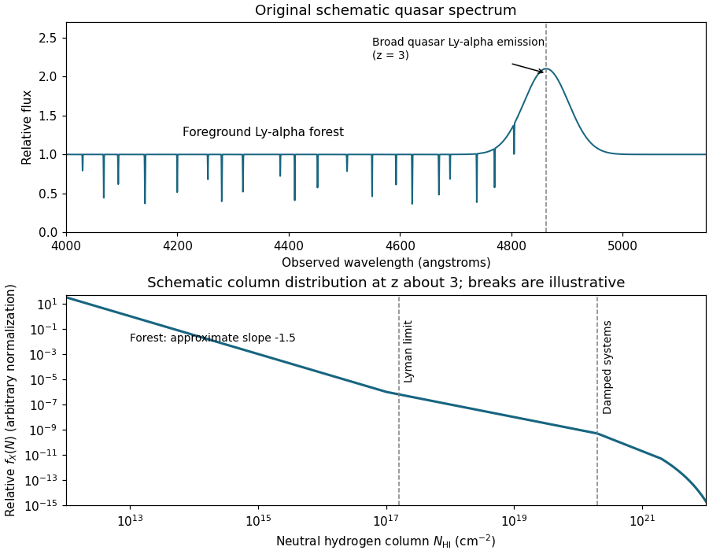

<h1 id="2/a/solution">Solution</h1>

↑ **Parent:** [A](../a.md)

The [Lyman-alpha forest](../../../../../../lyman-alpha-forest.md) is the large collection of narrow [Lyman-alpha absorption](../../../../../../lyman-alpha-absorption.md) features in the spectrum of a distant [quasar](../../../../../../quasar.md). Neutral [hydrogen](../../../../../../hydrogen.md) in foreground gas absorbs at its own redshifted $1s\to2p$ resonance, so an absorber at $z_{\rm abs}$ places its feature at

$$
\lambda_{\rm obs}=1215.67\,(1+z_{\rm abs})\,\text{Å}.
$$

Ordinary intervening absorbers have $z_{\rm abs}<z_Q$, putting their [Lyman-alpha lines](../../../../../../lyman-alpha-line.md) blueward of the quasar's own broad [Lyman-alpha emission](../../../../../../lyman-alpha-emission.md). Many different absorbing patches along the same [line of sight](../../../../../../line-of-sight.md) make the forest; they are not different transitions of one cloud. At sufficiently short wavelengths higher Lyman-series transitions can overlap the forest, so an actual analysis identifies these blends rather than treating every dip as isolated Ly-alpha.

**[Figure 1](#2/a/image-schematic-quasar-lyman-alpha-forest-and-neutral-hydrogen-column-density-distribution-at-redshift-three). Schematic quasar Lyman-alpha forest and neutral-hydrogen column-density distribution at redshift three**.

The upper panel is an original schematic spectrum for $z_Q=3$, with absorption features at smaller [cosmological redshifts](../../../../../../cosmological-redshift.md) and a broad emission feature near $4863$ Å. The lower panel anticipates the column-density discussion: both curves are teaching sketches, not measured spectra or fitted survey distributions. The ordinary [Lyman-alpha forest](../../../../../../lyman-alpha-forest.md) mainly traces the fluctuating, photoionized [intergalactic medium](../../../../../../intergalactic-medium.md), rather than a collection of identical isolated, neutral clouds.

## ↑ Ancestors (11)

1. [A](../a.md)
2. [2](../../2.md)
3. [Paper 74](../../../paper-74-split.md)
4. [Iii](../../../split.md)
5. [2005](../../../../split.md)
6. [Past exam of the mathematics course of the University of Cambridge](../../../../../split.md)
7. [Mathematics course of the University of Cambridge](../../../../../../mathematics-course-of-the-university-of-cambridge.md)
8. [Course of the University of Cambridge](../../../../../../course-of-the-university-of-cambridge.md)
9. [University of Cambridge](../../../../../../university-of-cambridge-split.md)
10. [List of universities](../../../../../../list-of-universities.md)
11. [Codex Wiki](../../../../../../split.md)
