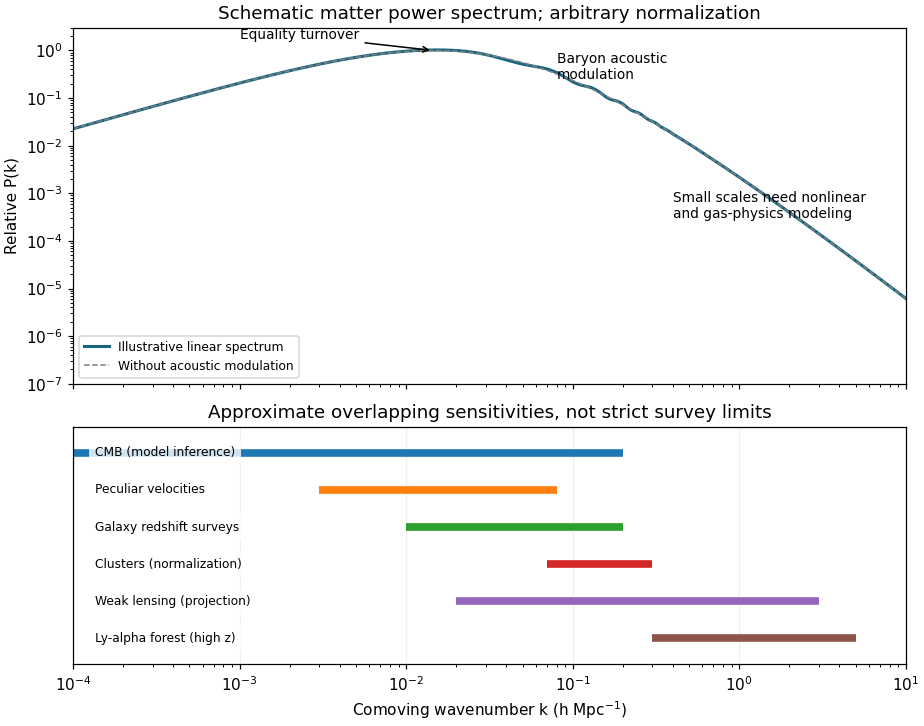

<h1 id="3/iii/solution">Solution</h1>

↑ **Parent:** [Iii](../iii.md)

A useful decomposition of the linear [matter power spectrum](../../../../../../matter-power-spectrum.md), absorbing the Fourier normalization into its amplitude, is

$$
P(k,z)=A\,k^{n_s}T^2(k)D^2(z).
$$

Here $T(k)$ is the [cold-dark-matter transfer function](../../../../../../cold-dark-matter-transfer-function.md) and $D(z)$ the [linear growth factor](../../../../../../linear-growth-factor.md). On scales entering the horizon after [matter-radiation equality](../../../../../../matter-radiation-equality.md), $T\simeq1$, so $P\propto k^{n_s}$ with $n_s$ near one. Modes entering during [radiation domination](../../../../../../radiation-domination.md) undergo suppressed growth relative to later entrants, producing a turnover near the equality scale and, well above it, $T\propto\ln(k/k_{\rm eq})/k^2$. Thus the linear spectrum asymptotes approximately to $k^{n_s-4}\ln^2(k/k_{\rm eq})$. [Baryon acoustic oscillations](../../../../../../baryon-acoustic-oscillation.md) superpose a weak oscillatory pattern. At sufficiently short scales nonlinear [gravitational instability](../../../../../../gravitational-instability.md) invalidates this linear extrapolation.

**[Figure 2](#3/iii/image-schematic-matter-power-spectrum-with-equality-turnover-baryon-oscillations-and-approximate-observational-scale-ranges). Schematic matter power spectrum with equality turnover, baryon oscillations and approximate observational scale ranges**.

The plotted curve illustrates the shape rather than a precision cosmological fit; the bands are overlapping approximate scale sensitivities, not sharp experiment boundaries. [Cosmic microwave background](../../../../../../cosmic-microwave-background.md) anisotropies constrain primordial amplitudes and transfer physics on very large through acoustic scales; converting them to a late-time matter spectrum requires a cosmological model. Galaxy redshift surveys constrain approximately $k\sim0.01$–$0.2\,h\,\mathrm{Mpc}^{-1}$, with [galaxy bias](../../../../../../galaxy-bias.md) and [redshift-space distortions](../../../../../../redshift-space-distortions.md) modeled. [Peculiar velocities](../../../../../../peculiar-velocity.md) constrain large-scale mass fluctuations; cluster abundances constrain the fluctuation normalization near cluster scales. [Weak gravitational lensing](../../../../../../weak-gravitational-lensing.md) measures projected matter on intermediate and smaller scales. The [Lyman-alpha forest](../../../../../../lyman-alpha-forest.md) extends constraints to roughly $k\sim0.3$–a few $h\,\mathrm{Mpc}^{-1}$ at high redshift, requiring gas, temperature and ionizing-background modeling. These are complementary measurements of the underlying spectrum rather than interchangeable direct Fourier measurements.

The matter fraction controls the equality turnover. From $a_{\rm eq}=\Omega_{r,0}/\Omega_{m,0}$ and the [Friedmann equation](../../../../../../friedmann-equations.md) at equality,

$$
k_{\rm eq}=\frac{a_{\rm eq}H_{\rm eq}}c
=\frac{H_0}{c}\sqrt{\frac{2\Omega_{m,0}^2}{\Omega_{r,0}}}.
$$

The measured background radiation fixes $\Omega_{r,0}h^2$, so the physical turnover scale measures approximately $\Omega_{m,0}h^2$. In units $h\,\mathrm{Mpc}^{-1}$ its location mainly constrains $\Omega_{m,0}h$; independent knowledge of $h$ is needed to extract $\Omega_{m,0}$. Standard radiation content gives the useful estimate $k_{\rm eq}\simeq0.073\Omega_{m,0}h^2\,\mathrm{Mpc}^{-1}$, approximately $0.015\,h\,\mathrm{Mpc}^{-1}$ for $\Omega_{m,0}=0.3$, $h=0.7$.

The [cosmological baryon density](../../../../../../cosmological-baryon-density.md) sets the inertia of the pre-decoupling photon–baryon fluid and changes its sound horizon and the oscillation pattern. The oscillation contrast and broadband suppression depend on the baryon fraction $\Omega_{b,0}/\Omega_{m,0}$; the acoustic positions depend on the sound horizon and the distance conversion. The [cosmic microwave background](../../../../../../cosmic-microwave-background.md) peak-height pattern independently constrains $\Omega_{b,0}h^2$. Combining these with the equality scale and a distance or [Hubble constant](../../../../../../hubble-constant.md) determination permits estimates of both requested density fractions. Spectral tilt, [neutrino free streaming](../../../../../../neutrino-free-streaming.md), galaxy bias and nonlinear evolution must be fitted rather than assigning every shape change to baryons. The acoustic signature was already observed in [the 2005 galaxy correlation measurement](https://arxiv.org/abs/astro-ph/0501171); [the first-year microwave-background parameter analysis](https://arxiv.org/abs/astro-ph/0302209) demonstrates the complementary parameter constraints.

## ↑ Ancestors (11)

1. [Iii](../iii.md)
2. [3](../../3.md)
3. [Paper 74](../../../paper-74-split.md)
4. [Iii](../../../split.md)
5. [2005](../../../../split.md)
6. [Past exam of the mathematics course of the University of Cambridge](../../../../../split.md)
7. [Mathematics course of the University of Cambridge](../../../../../../mathematics-course-of-the-university-of-cambridge.md)
8. [Course of the University of Cambridge](../../../../../../course-of-the-university-of-cambridge.md)
9. [University of Cambridge](../../../../../../university-of-cambridge-split.md)
10. [List of universities](../../../../../../list-of-universities.md)
11. [Codex Wiki](../../../../../../split.md)
