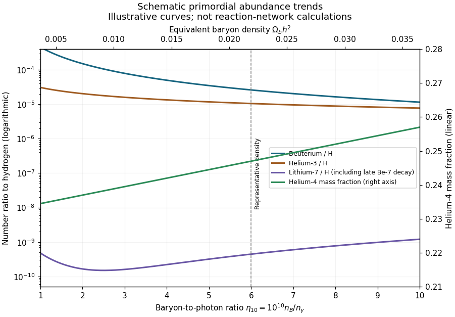

<h1 id="4/iii/a/solution">Solution</h1>

↑ **Parent:** [A](../a.md)

The main abundance parameter is the [baryon-to-photon ratio](../../../../../../../baryon-to-photon-ratio.md) $\eta=n_B/n_\gamma$, often expressed as $\eta_{10}=10^{10}\eta$. For the measured mean [cosmic microwave background](../../../../../../../cosmic-microwave-background.md) temperature, $\eta_{10}\simeq274\Omega_bh^2$. Standard [Big Bang nucleosynthesis](../../../../../../../big-bang-nucleosynthesis.md) also depends on the expansion rate, the [effective number of neutrino species](../../../../../../../effective-number-of-neutrino-species.md), the neutron lifetime and the [nuclear reaction](../../../../../../../nuclear-reaction.md) rates.

**[Figure 3](#4/iii/a/image-schematic-primordial-deuterium-helium-3-helium-4-and-lithium-7-abundance-trends-versus-baryon-to-photon-ratio). Schematic primordial deuterium, helium-3, helium-4 and lithium-7 abundance trends versus baryon-to-photon ratio**.

The curves show qualitative abundance trends and representative orders of magnitude; they are simple illustrative functions, not outputs of a [nuclear reaction](../../../../../../../nuclear-reaction.md) network. [Helium-4](../../../../../../../helium-4.md) uses the right-hand mass-fraction axis, while the other three abundances are number ratios to hydrogen on the logarithmic left axis. The lithium valley and its rising high-density branch are important and must not be replaced by a monotone curve.

At higher $\eta$, two-body reactions proceed more rapidly relative to [cosmic expansion](../../../../../../../expansion-of-the-universe.md) and burn [deuterium](../../../../../../../deuterium.md) more efficiently, so D/H falls strongly, approximately as $\eta^{-1.6}$ near the favored density. [Helium-3](../../../../../../../helium-3.md) decreases more gently. The [primordial helium mass fraction](../../../../../../../primordial-helium-mass-fraction.md) rises only weakly: an earlier end to the [deuterium bottleneck](../../../../../../../deuterium-bottleneck.md) allows fewer neutrons to decay, but most surviving neutrons would already end in [helium-4](../../../../../../../helium-4.md). [Lithium-7](../../../../../../../lithium-7.md) first decreases as its destruction becomes effective, then increases when [beryllium-7](../../../../../../../beryllium-7.md) production dominates; [beryllium-7](../../../../../../../beryllium-7.md) later captures an electron and becomes [lithium-7](../../../../../../../lithium-7.md).

A faster expansion changes both freeze-out and the time available for reactions. In units $\hbar=c=k_B=1$, weak neutron–proton conversion has rate $\Gamma_w\propto G_F^2T^5$, whereas $H\propto\sqrt{g_*}T^2/M_{\rm Pl}$; consequently $T_f\propto g_*^{1/6}$. Since the equilibrium [neutron-to-proton ratio](../../../../../../../neutron-to-proton-ratio.md) is $e^{-(m_n-m_p)/T_f}$, additional radiation raises it; the shorter subsequent decay interval also raises $Y_p$. At fixed baryon density, moderately faster expansion leaves more unburned [deuterium](../../../../../../../deuterium.md). A longer neutron lifetime similarly increases neutron survival. These trends assume ordinary efficient burning and no independent modifications of the nuclear or weak rates.

**[Deuterium](../../../../../../../deuterium.md) is a sensitive baryometer, while [helium-4](../../../../../../../helium-4.md) is particularly useful as an expansion-rate test.** [Deuterium](../../../../../../../deuterium.md) is destroyed in stellar processing, and metal-poor absorption systems can approximate its initial abundance well. Helium's weak dependence on $\eta$ limits its precision as a baryometer, and its spectroscopic corrections matter. [Helium-3](../../../../../../../helium-3.md) is both made and destroyed in [stars](../../../../../../../star.md), complicating extrapolation, while lithium is affected by stellar destruction, transport and atmosphere modeling as well as the [cosmological lithium problem](../../../../../../../cosmological-lithium-problem.md). Accurate comparisons therefore require nuclear-rate and astrophysical uncertainties, not merely narrow instrumental error bars. The parameter responses are explained in [the primordial nucleosynthesis calculation](https://arxiv.org/abs/astro-ph/0308511).

## ↑ Ancestors (12)

1. [A](../a.md)
2. [Iii](../../iii.md)
3. [4](../../../4.md)
4. [Paper 74](../../../../paper-74-split.md)
5. [Iii](../../../../split.md)
6. [2005](../../../../../split.md)
7. [Past exam of the mathematics course of the University of Cambridge](../../../../../../split.md)
8. [Mathematics course of the University of Cambridge](../../../../../../../mathematics-course-of-the-university-of-cambridge.md)
9. [Course of the University of Cambridge](../../../../../../../course-of-the-university-of-cambridge.md)
10. [University of Cambridge](../../../../../../../university-of-cambridge-split.md)
11. [List of universities](../../../../../../../list-of-universities.md)
12. [Codex Wiki](../../../../../../../split.md)
