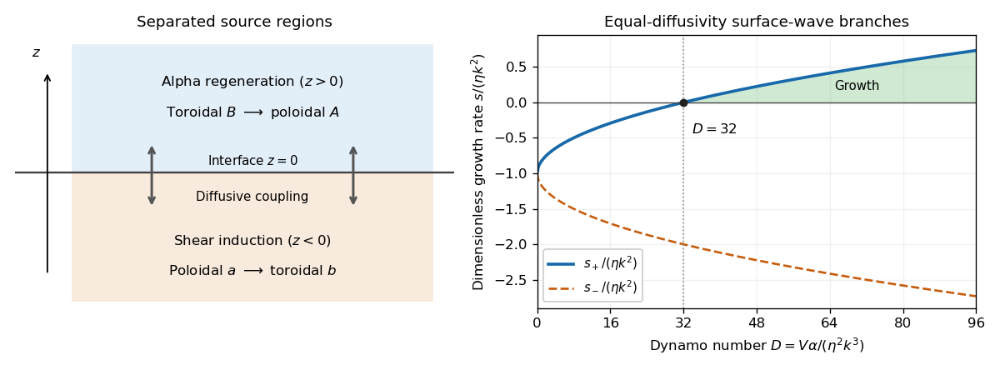

<h1 id="3/solution">Solution</h1>

↑ **Parent:** [3](../3.md)

The [magnetic vector potential](../../../../../magnetic-vector-potential.md) $A\mathbf e_y$ gives the upper [poloidal magnetic field](../../../../../poloidal-magnetic-field.md) $(-A_z,0,A_x)$, and $B\mathbf e_y$ is its [toroidal magnetic field](../../../../../toroidal-magnetic-field.md); $a,b$ play the same roles below. This representation automatically satisfies $\nabla\cdot\mathbf B=0$. Diffusion acts in both regions. Above the interface the [alpha effect](../../../../../alpha-effect.md) converts [toroidal magnetic field](../../../../../toroidal-magnetic-field.md) into [poloidal magnetic field](../../../../../poloidal-magnetic-field.md), while below it a mean shear $U'(z)=V$ converts the poloidal component $a_x$ into [toroidal magnetic field](../../../../../toroidal-magnetic-field.md). Separating these source regions still allows an [alpha-Omega dynamo](../../../../../alpha-omega-dynamo.md) through diffusion across the interface.

For electromagnetic matching, keep the closure actually represented by these equations. Its retained turbulent [mean-field electromotive force](../../../../../mean-field-electromotive-force.md) is $\boldsymbol{\mathcal E}=\alpha B\mathbf e_y$ above and zero below: only toroidal-to-poloidal alpha generation is retained. Let the mean velocity be $U(z)\mathbf e_y$, continuous at the interface, and write the mean [electric field](../../../../../electric-field.md) as

$$
\mathbf E=-U\mathbf e_y\times\mathbf B-\boldsymbol{\mathcal E}+\eta\nabla\times\mathbf B.
$$

This yields the specified scalar equations with $U'=0$ above and $U'=V$ below. In particular, the upper tangential electric component is

$$
E_x=-U\partial_x A-\eta\partial_zB,
$$

where $B$ is the scalar toroidal-field amplitude. The other [tangential component](../../../../../tangential-component.md) is $E_y=-\alpha B-\eta\nabla^2A=-\partial_tA$.

Assume equal permeability, no imposed singular surface current and ordinary electromagnetic matching. [Continuity](../../../../../continuous-function.md) of the normal [magnetic field](../../../../../magnetic-field.md) gives $A_x=a_x$, and tangential magnetic [continuity](../../../../../continuous-function.md) gives $A_z=a_z$ and $B=b$. For the nonzero horizontal Fourier wavenumber used below, normal-field [continuity](../../../../../continuous-function.md) is equivalent to $A=a$; the spatially constant potential difference is a gauge freedom. [Continuity](../../../../../continuous-function.md) of $E_x$, with continuous $U$ and $A_x$, gives the final condition. Thus [electromagnetic matching for an alpha-Omega interface](../../../../../electromagnetic-matching-for-an-alpha-omega-interface.md) is

$$
\boxed{A=a,\qquad A_z=a_z,\qquad B=b,\qquad\eta\partial_zB=\eta\partial_zb\quad(z=0).}
$$

[Continuity](../../../../../continuous-function.md) of $E_y$ follows from $A=a$ and their time evolution, rather than supplying a fifth independent amplitude condition. A full isotropic [mean-field electromotive force](../../../../../mean-field-electromotive-force.md) $\alpha\mathbf B$ would add toroidal alpha induction and an alpha contribution to $E_x$; that would be a different bulk and interface problem. Retaining it only in a boundary condition would be inconsistent with the equations being solved here.

Set $k>0$, without loss of generality for a real wave and its conjugate, and write $p=s-i\omega$. Define the two complex [vertical wavenumbers](../../../../../vertical-wavenumber.md) $q_+=\Lambda+iL$ and $q_-=\lambda+il$ so the upper fields decay as $e^{-q_+z}$ and the lower fields as $e^{q_-z}$. The original PDF has a lowercase $l$ in the lower phase. The homogeneous upper $B$ and lower $a$ equations give

$$
p=\eta(q_+^2-k^2)=\eta(q_-^2-k^2).
$$

Both $q_+$ and $q_-$ have positive [real part](../../../../../real-part.md). Since their squares agree, they must be equal, rather than opposite. Put

$$
q=q_+=q_-,\qquad q^2=k^2+\frac p\eta,
$$

so $\Lambda=\lambda$ and $L=l$ follow from the equations rather than being assumed in advance.

Suppress the common factor $e^{pt+ikx}$ and write

$$
A=(A_0+Cz)e^{-qz},\quad B=B_0e^{-qz},\qquad a=a_0e^{qz},\quad b=(b_0+cz)e^{qz}.
$$

The identity $[p-\eta(\partial_z^2-k^2)](ze^{-qz})=2\eta q e^{-qz}$ gives the upper forcing equation, while the same operator on $ze^{qz}$ gives $-2\eta q e^{qz}$. Hence

$$
2\eta qC=\alpha B_0,\qquad-2\eta qc=ikVa_0.
$$

The first and third [interface dynamo matching](../../../../../electromagnetic-matching-for-an-alpha-omega-interface.md) give $a_0=A_0$, $b_0=B_0$. The [derivative](../../../../../derivative.md) conditions then give

$$
C-qA_0=qA_0\quad\Longrightarrow\quad C=2qA_0,
$$

$$
-qB_0=c+qb_0\quad\Longrightarrow\quad c=-2qB_0.
$$

Thus $4\eta q^2A_0=\alpha B_0$ and $4\eta q^2B_0=ikVA_0$. Eliminating the nonzero amplitudes produces the [dispersion relation of an equal-diffusivity interface dynamo](../../../../../dispersion-relation-of-an-equal-diffusivity-interface-dynamo.md):

$$
\boxed{16\eta^2q^4=ikV\alpha.}
$$

In terms of $D=V\alpha/(\eta^2k^3)>0$,

$$
\left(1+\frac p{\eta k^2}\right)^2=\frac{iD}{16},\qquad p=\eta k^2\left[-1\pm(1+i)\sqrt{\frac D{32}}\right].
$$

Each branch has a [square root](../../../../../square-root.md) $q$ with positive [real part](../../../../../real-part.md) and is therefore compatible with vertical localization. The branch with the plus sign is the potentially growing one:

$$
\boxed{s=\eta k^2\left(\sqrt{\frac D{32}}-1\right),\qquad\omega=-\eta k^2\sqrt{\frac D{32}},\qquad s>0\iff D>32.}
$$

The minus branch has $s=-\eta k^2(1+\sqrt{D/32})<0$. At $D=32$ the first branch is neutrally oscillatory. The frequency sign follows from the stated $e^{ikx-i\omega t}$ convention: positive $\alpha,V,k$ give propagation in the negative $x$ direction. Reversing the coupling sign reverses propagation, while the threshold for the conjugate sign depends on the magnitude of the dynamo number.

**[Figure 1](#3/image-separated-interface-dynamo-source-layers-and-the-growth-threshold-at-dynamo-number-32). Separated interface-dynamo source layers and the growth threshold at dynamo number 32**.

The [equal-diffusivity interface dynamo](../../../../../equal-diffusivity-interface-dynamo.md) idealizes a solar configuration in which helical [convection](../../../../../convection.md) regenerates [poloidal magnetic field](../../../../../poloidal-magnetic-field.md) above the [tachocline](../../../../../tachocline.md) and [differential rotation](../../../../../differential-rotation.md) generates strong [toroidal magnetic field](../../../../../toroidal-magnetic-field.md) in or below it. Diffusion communicates the fields between the two regions, closing the feedback loop. This separation is the mechanism emphasized by [Parker's interface-wave model](https://ntrs.nasa.gov/citations/19930052418). An oscillatory traveling mode gives migrating magnetic patterns and polarity reversals; buoyant toroidal flux can appear as [sunspot](../../../../../sunspot.md) belts. If $x$ is a local latitude coordinate, the direction of their migration depends on the alpha–shear sign and the coordinate orientation.

The magnetic period of this branch is $2\pi/|\omega|$; polarity reverses after half a period, and activity that depends on field strength rather than sign can repeat on that half-period. This is the qualitative relation between the magnetic [solar cycle](../../../../../solar-cycle.md) and its activity cycle. The model does not itself predict the observed period or guarantee equatorward migration: those require actual geometry, transport coefficients and shear signs. Real stars also have [diffusivity](../../../../../diffusion-coefficient.md) contrasts, meridional transport, spatially varying regeneration and nonlinear feedback. The kinematic exponential mode describes onset, while saturation and a maintained finite-amplitude cycle require further physics.

## ↑ Ancestors (10)

1. [3](../3.md)
2. [Paper 76](../../paper-76-split.md)
3. [Iii](../../split.md)
4. [2005](../../../split.md)
5. [Past exam of the mathematics course of the University of Cambridge](../../../../split.md)
6. [Mathematics course of the University of Cambridge](../../../../../mathematics-course-of-the-university-of-cambridge.md)
7. [Course of the University of Cambridge](../../../../../course-of-the-university-of-cambridge.md)
8. [University of Cambridge](../../../../../university-of-cambridge-split.md)
9. [List of universities](../../../../../list-of-universities.md)
10. [Codex Wiki](../../../../../split.md)
