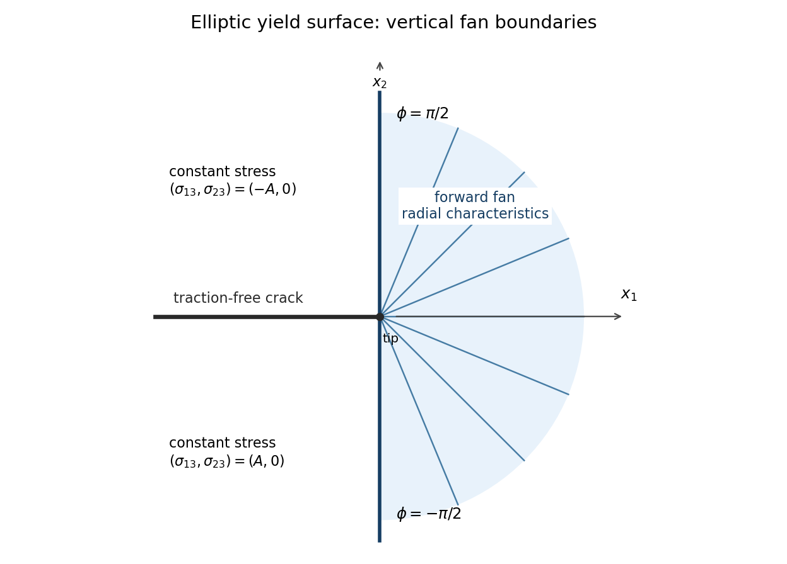

<h1 id="6/solution">Solution</h1>

↑ **Parent:** [6](../6.md)

Put $a=\sigma_{13}$, $b=\sigma_{23}$, $w=v_3$, and write $f_a=\partial f/\partial a$, $f_b=\partial f/\partial b$. In [antiplane perfect plasticity](../../../../../antiplane-perfect-plasticity.md), [force balance](../../../../../force-balance.md) and the fixed [yield surface](../../../../../yield-surface.md) give

$$
a_{,1}+b_{,2}=0,\qquad f(a,b)=k.
$$

Differentiate the second relation in $x_2$. Along the proposed [characteristic curve](../../../../../characteristic-curve.md),

$$
\frac{da}{ds}
=\alpha(-f_ba_{,1}+f_aa_{,2})
=\alpha(f_bb_{,2}+f_aa_{,2})=0.
$$

Similarly, differentiating the yield relation in $x_1$ gives

$$
\frac{db}{ds}
=\alpha(-f_bb_{,1}+f_ab_{,2})
=-\alpha(f_bb_{,1}+f_aa_{,1})=0.
$$

The [associated flow rule](../../../../../associated-flow-rule.md) and $\dot\epsilon_{i3}=w_{,i}/2$ give $w_{,1}=2\dot\lambda f_a$, $w_{,2}=2\dot\lambda f_b$. Consequently

$$
\frac{dw}{ds}
=2\alpha\dot\lambda(-f_bf_a+f_af_b)=0.
$$

Thus **both shear [stresses](../../../../../stress.md) and the antiplane [velocity](../../../../../velocity.md) are constant on each characteristic**. Assume a regular yield gradient $(f_a,f_b)\ne0$. Since the [stress](../../../../../stress.md) is constant on a characteristic, its tangent $(-f_b,f_a)$ has fixed direction, so the curves are straight lines, apart from arbitrary reparameterization by $\alpha$.

In a [centred antiplane plastic fan](../../../../../centred-antiplane-plastic-fan.md) those lines emanate from the crack tip. Hence

$$
a=a(\phi),\qquad b=b(\phi),\qquad w=w(\phi),
$$

and a radial line at angle $\phi$ from the $x_1$ axis must have

$$
(\cos\phi,\sin\phi)\parallel(-f_b,f_a),\qquad
f_a\cos\phi+f_b\sin\phi=0.
$$

The crack faces have normal in the $x_2$ direction, so traction freedom requires $b=0$ there. The fan joins the adjacent constant crack-face [stress](../../../../../stress.md) region along the characteristic carrying that [stress](../../../../../stress.md). Its boundary line therefore satisfies

$$
\boxed{\tan\phi_b=-\frac{f_a}{f_b}\quad\text{at }b=0,}
$$

with the direction interpreted directly when the denominator vanishes. The original PDF reverses this ratio. Its displayed ratio is $dx_1/dx_2$, whereas the tangent of an angle from the $x_1$ axis is $dx_2/dx_1$. The distinction cannot be removed while retaining both its stated characteristic direction and its angle convention.

For the elliptic [yield surface](../../../../../yield-surface.md), with $A,B>0$,

$$
f_a=2a/A^2,\qquad f_b=2b/B^2.
$$

On the forward fan $-\pi/2<\phi<\pi/2$, choose the loading branch $b>0$. The radial tangent condition gives $a/A^2=-(b/B^2)\tan\phi$. Substituting in the yield equation and choosing the positive square root gives exactly

$$
\boxed{a=\frac{-A^2\tan\phi}{(B^2+A^2\tan^2\phi)^{1/2}},\qquad
b=\frac{B^2}{(B^2+A^2\tan^2\phi)^{1/2}}.}
$$

For the endpoints, use the equivalent nonsingular expressions

$$
a=-\frac{A^2\sin\phi}{H(\phi)},\qquad
b=\frac{B^2\cos\phi}{H(\phi)},\qquad
H(\phi)=(A^2\sin^2\phi+B^2\cos^2\phi)^{1/2}.
$$

They give $(a,b)=(-A,0)$ on the upper boundary ray and $(A,0)$ on the lower one. The correct boundaries are **$\phi=\pm\pi/2$**, the vertical line through the tip. At either of these [stress](../../../../../stress.md) states $f_b=0$ and $f_a\ne0$, so the characteristic tangent is vertical. The printed boundary ratio would instead give a horizontal line, providing a concrete counterexample to that intermediate assertion.

Extend the upper and lower rear sectors by the constant [stresses](../../../../../stress.md) $(-A,0)$ and $(A,0)$ respectively; these satisfy the traction-free crack faces and match the fan [stresses](../../../../../stress.md) continuously. The reversed loading has all [stresses](../../../../../stress.md) negated. To check equilibrium within the forward fan, differentiation gives

$$
a_{,\phi}=-\frac{A^2B^2\cos\phi}{H^3},\qquad
b_{,\phi}=-\frac{A^2B^2\sin\phi}{H^3},
$$

and hence $a_{,1}+b_{,2}=(-\sin\phi\,a_{,\phi}+\cos\phi\,b_{,\phi})/r=0$. The yield equation is satisfied identically as well.

**[Figure 1](#6/image-radial-characteristics-and-vertical-boundaries-of-the-elliptic-antiplane-fan). Radial characteristics and vertical boundaries of the elliptic antiplane fan**.

Finally $\nabla w=w'(\phi)e_\phi/r$, while $(f_a,f_b)=2e_\phi/H$. The [associated flow rule](../../../../../associated-flow-rule.md) reduces to

$$
\boxed{\dot\lambda=\frac{H(\phi)w'(\phi)}{4r},\qquad w'(\phi)\geq0}
$$

for this [stress](../../../../../stress.md) branch. Any such angular [velocity](../../../../../velocity.md) field is constant along the rays and has constant values in the adjacent rear sectors. Its magnitude and angular variation require [velocity](../../../../../velocity.md) or loading data beyond the specified traction-free faces; the local [stress](../../../../../stress.md) fan alone does not determine them.

## ↑ Ancestors (10)

1. [6](../6.md)
2. [Paper 78](../../paper-78-split.md)
3. [Iii](../../split.md)
4. [2005](../../../split.md)
5. [Past exam of the mathematics course of the University of Cambridge](../../../../split.md)
6. [Mathematics course of the University of Cambridge](../../../../../mathematics-course-of-the-university-of-cambridge.md)
7. [Course of the University of Cambridge](../../../../../course-of-the-university-of-cambridge.md)
8. [University of Cambridge](../../../../../university-of-cambridge-split.md)
9. [List of universities](../../../../../list-of-universities.md)
10. [Codex Wiki](../../../../../split.md)
