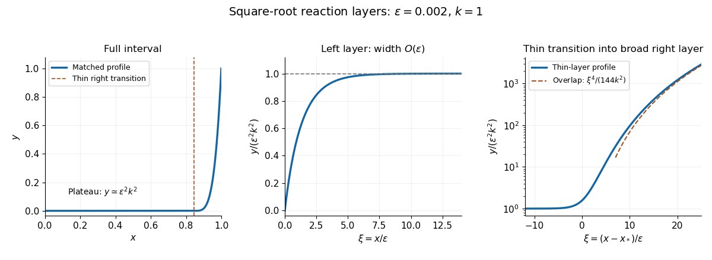

<h1 id="3/solution">Solution</h1>

↑ **Parent:** [3](../3.md)

The [square-root reaction problem with nested boundary layers](../../../../../square-root-reaction-problem-with-nested-boundary-layers.md) has a small positive plateau $y\sim\varepsilon^2k^2$, an $O(\varepsilon)$ left-end layer, and two distinct scales on the right. The broad right layer has width $O(\sqrt\varepsilon)$; its inner edge needs a thinner $O(\varepsilon)$ transition to the plateau. A single right-end scale cannot describe both matches.

Here is a uniformly matched leading solution. Let $L(\xi)$ solve

$$
L''=\sqrt L-k,\qquad L(0)=0,\qquad L(+\infty)=k^2,
$$

using the increasing branch below $k^2$. Define

$$
\Phi(Y)=\sqrt{2k}\log\left|\frac{\sqrt{k+2\sqrt Y}-\sqrt{3k}}{\sqrt{k+2\sqrt Y}+\sqrt{3k}}\right|+\sqrt{6(k+2\sqrt Y)}.
$$

Then $\Phi(L(\xi))=\Phi(0)-\xi$. For the right-hand branch, define $R(\xi)>k^2$ by $\Phi(R(\xi))=\xi$; it tends to $k^2$ as $\xi\to-\infty$. These formulas follow from the [first integral of a square-root reaction layer](../../../../../first-integral-of-a-square-root-reaction-layer.md) and are expanded in [solution](b/i/solution.md) and [solution](b/ii/solution.md).

For sufficiently small $\varepsilon$, let $x_*=1-\varepsilon\Phi(\varepsilon^{-2})$. Then $R((1-x_*)/\varepsilon)=\varepsilon^{-2}$, so the right profile meets the prescribed order-one endpoint. The [composite asymptotic expansion](../../../../../additive-composite-expansion.md) is

$$
\boxed{y_{\rm comp}(x)=\varepsilon^2\left[L\left(\frac x\varepsilon\right)+R\left(\frac{x-x_*}{\varepsilon}\right)-k^2\right],\qquad 0\leq x\leq1.}
$$

The subtraction removes the common plateau counted twice. Its boundary residuals are exponentially small: the right profile has almost reached $k^2$ at $x=0$, and the left profile has almost reached $k^2$ at $x=1$. In each active layer the opposite profile is exponentially close to its plateau, so the composite reproduces that layer's governing equation and the shared [outer solution](../../../../../outer-expansion.md) to the retained order.

The right transition location satisfies $x_*=1-2\sqrt{3\varepsilon}+o(\sqrt\varepsilon)$. Outside its thin transition, the broad right layer is

$$
y\sim\left[1-\frac{1-x}{2\sqrt{3\varepsilon}}\right]^4
$$

where the bracket is positive; it matches through the thin layer to $\varepsilon^2k^2$, rather than continuing as a fourth power on the wrong side. The [dominant balances](../../../../../dominant-balance.md) and the end-region matches are detailed below.

**[Figure 1](#3/image-the-left-layer-small-plateau-and-two-right-hand-scales-of-the-square-root-reaction-problem). The left layer, small plateau and two right-hand scales of the square-root reaction problem**.

## ↑ Ancestors (10)

1. [3](../3.md)
2. [Paper 79](../../paper-79-split.md)
3. [Iii](../../split.md)
4. [2005](../../../split.md)
5. [Past exam of the mathematics course of the University of Cambridge](../../../../split.md)
6. [Mathematics course of the University of Cambridge](../../../../../mathematics-course-of-the-university-of-cambridge.md)
7. [Course of the University of Cambridge](../../../../../course-of-the-university-of-cambridge.md)
8. [University of Cambridge](../../../../../university-of-cambridge-split.md)
9. [List of universities](../../../../../list-of-universities.md)
10. [Codex Wiki](../../../../../split.md)

## ← Incoming links (2)

- [Solution](b/i/solution.md)
- [Solution](c/solution.md)
