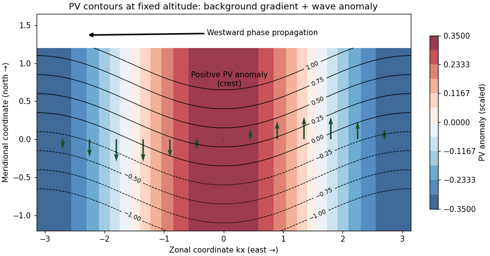

# Paper 80

↑ **Parent:** [Iii](../iii.md)

[https://www.maths.cam.ac.uk/postgrad/part-iii/files/pastpapers/2005/Paper80.pdf](https://www.maths.cam.ac.uk/postgrad/part-iii/files/pastpapers/2005/Paper80.pdf)

**Table of contents**

- [1](#1)
  - [Solution](#1/solution)
- [2](#2)
  - [Solution](#2/solution)
- [3](#3)
  - [Solution](#3/solution)
- [4](#4)
  - [Solution](#4/solution)

## 1

↑ **Parent:** [Paper 80](paper-80.md)

<h3 id="1/solution">Solution</h3>

↑ **Parent:** [1](#1)

**Equations and conventions.** Let $\rho_0$ be a constant reference [density](../../../fluid-mechanics.md#density) and define total [buoyancy](../../../fluid-mechanics.md#buoyancy) acceleration by $\sigma=-g(\rho-\rho_0)/\rho_0$. With reduced [pressure](../../../thermodynamics.md#pressure) $\Pi=p/\rho_0+gz$, the nonrotating ideal [Boussinesq equations](../../../geophysical-fluid-dynamics.md#boussinesq-equations) are

$$
\frac{D\mathbf u}{Dt}=-\nabla\Pi+\sigma\widehat{\mathbf z},\qquad
\nabla\cdot\mathbf u=0,\qquad\frac{D\sigma}{Dt}=0,
\qquad\frac D{Dt}=\partial_t+\mathbf u\cdot\nabla.
$$

[Density](../../../fluid-mechanics.md#density) departures are small compared with $\rho_0$, so they can be neglected in inertia and mass continuity but retained in the gravitational force. The reference stratification must also change [density](../../../fluid-mechanics.md#density) only weakly over the depth of interest. [incompressible flow](../../../fluid-mechanics.md#incompressible-flow) is already assumed; the [Boussinesq approximation](../../../geophysical-fluid-dynamics.md#boussinesq-approximation) additionally restricts the size of the [density](../../../fluid-mechanics.md#density) variations, rather than following automatically from [incompressible flow](../../../fluid-mechanics.md#incompressible-flow). An ideal fluid here has neither viscosity nor [buoyancy](../../../fluid-mechanics.md#buoyancy) diffusion.

A stationary reference profile $\bar\sigma(z)$ has [buoyancy frequency](../../../gravity-wave.md#buoyancy-frequency)

$$
N^2(z)=\bar\sigma_z=-\frac g{\rho_0}\bar\rho_z.
$$

Stable stratification has $N^2>0$: an upward-displaced parcel retains its old [buoyancy](../../../fluid-mechanics.md#buoyancy) and has negative [buoyancy](../../../fluid-mechanics.md#buoyancy) relative to its new surroundings.

**[Vorticity](../../../fluid-mechanics.md#vorticity) equation and linearization.** For motion in the $(x,z)$ plane, choose the [streamfunction](../../../fluid-mechanics.md#stream-function) by $u=\psi_z$, $w=-\psi_x$. The $y$-component of [vorticity](../../../fluid-mechanics.md#vorticity) is then $u_z-w_x=\nabla^2\psi$, where $\nabla^2=\partial_x^2+\partial_z^2$. Taking the $y$-component of the curl of momentum gives

$$
\partial_t\nabla^2\psi+\sigma_x
=(\psi_x\partial_z-\psi_z\partial_x)\nabla^2\psi.
$$

The minus sign in the [buoyancy](../../../fluid-mechanics.md#buoyancy) curl follows from $(\nabla\times\sigma\widehat z)_y=-\sigma_x$.

Write $\psi=\bar\psi(z)+\psi'$ with $\bar\psi_z=\bar u(z)$ and $\sigma=\bar\sigma(z)+\sigma'$. The linear [material derivative](../../../continuum-mechanics.md#material-derivative) is $D_t=\partial_t+\bar u\partial_x$. The perturbation equations are

$$
D_t\nabla^2\psi'-\bar u_{zz}\psi'_x+\sigma'_x=0,\qquad
D_t\sigma'-N^2\psi'_x=0.
$$

The shear-curvature term arises because $w'$ advects the basic [vorticity](../../../fluid-mechanics.md#vorticity) $\bar u_z$. Apply $D_t$ to the first equation and use the second; $D_t$ commutes with $\partial_x$ and does not differentiate the height-only coefficients. Therefore

$$
\boxed{D_t^2\nabla^2\psi'-\bar u_{zz}D_t\psi'_x+N^2\psi'_{xx}=0.}
$$

For a stationary nonzero horizontal [wavenumber](../../../wave-equation.md#wavenumber) $k$, the [buoyancy](../../../fluid-mechanics.md#buoyancy) equation gives $\widehat\sigma=N^2\widehat\psi/\bar u$. Substitution into the [vorticity](../../../fluid-mechanics.md#vorticity) equation gives

$$
\boxed{\widehat\psi_{zz}+m^2(z)\widehat\psi=0,\qquad
m^2=\frac{N^2}{\bar u^2}-\frac{\bar u_{zz}}{\bar u}-k^2=\ell^2-k^2.}
$$

Here $\ell^2$ is the [Scorer parameter](../../../gravity-wave.md#scorer-parameter). Where $m^2>0$, the vertical structure is oscillatory; where $m^2<0$, it is evanescent. A rigid flat lower boundary gives $\widehat\psi(0)=0$ for $k\ne0$. In an upper evanescent region the growing solution is excluded by boundedness. When propagation persists to infinity, an appropriate [radiation condition](../../../gravity-wave.md#radiation-condition) distinguishes outgoing from incoming energy for a forced problem.

If $\bar u=U_0+Sz$ with $S>0$, its curvature term vanishes. Bounded $N^2$ implies $\ell^2=N^2/\bar u^2\to0$ aloft. Thus every fixed nonzero $k$ eventually lies in an evanescent region. If stratification is sufficiently strong near the bottom, a lower oscillatory region is separated from the upper evanescent region by a [turning level of a stationary internal wave](../../../gravity-wave.md#turning-level-of-a-stationary-internal-wave). Waves reflect at that level and at the rigid lower boundary, giving vertically trapped modes for the horizontal wavenumbers that satisfy both conditions. In a slowly varying example the phase condition is approximately $\int_0^{z_t}m\,dz=(n-1/4)\pi$, from a lower node and the turning-point connection; the key point is trapping by the decrease in the [Scorer parameter](../../../gravity-wave.md#scorer-parameter), not a physical lid.

**Rigid channel modes.** With constant $U=\bar u>0$ and $N$, the vertical nodes require $m_n=n\pi/H$, $n=1,2,\ldots$. Stationarity then requires

$$
k_n^2=\frac{N^2}{U^2}-\frac{n^2\pi^2}{H^2}.
$$

The specified strict interval admits positive $k_n^2$ for exactly $n=1,2$. Choosing $k_1,k_2>0$, every real superposition of these nonzero-wavenumber modes is

$$
\boxed{\psi'=\operatorname{Re}\left[C_1\sin\frac{\pi z}{H}e^{ik_1x}+C_2\sin\frac{2\pi z}{H}e^{ik_2x}\right],\qquad
\sigma'=\frac{N^2}{U}\psi'.}
$$

The two independent complex constants encode the amplitudes and horizontal phases; negative wavenumbers are supplied by complex conjugation, not additional independent constants.

**Exact finite amplitude.** Put $\lambda=N^2/U^2$. Both modes and every superposition satisfy $\nabla^2\psi'=-\lambda\psi'$. For the total [streamfunction](../../../fluid-mechanics.md#stream-function) $\Psi=Uz+\psi'$, the total [buoyancy](../../../fluid-mechanics.md#buoyancy) is $\sigma=N^2z+(N^2/U)\psi'=(N^2/U)\Psi$. A stationary velocity $(\Psi_z,-\Psi_x)$ is tangent to its [streamfunction](../../../fluid-mechanics.md#stream-function) contours, so $D\sigma/Dt=0$ exactly. Moreover the nonlinear self-advection of $\nabla^2\psi'$ vanishes because it is proportional to $\psi'$ itself. The remaining [vorticity](../../../fluid-mechanics.md#vorticity) equation is

$$
U\partial_x(-\lambda\psi')=-\partial_x[(N^2/U)\psi'],
$$

which is an identity. Both rigid boundaries remain impermeable, and the curl-free residual in momentum determines a [pressure](../../../thermodynamics.md#pressure). Thus **the displayed two-mode family consists of exact finite-amplitude Boussinesq solutions**, with no small-amplitude restriction on the constants in these equations. Very large amplitudes can overturn the stratification or leave the physical Boussinesq regime; exact existence does not establish stability.

The two-constant statement concerns wave disturbances with $k\ne0$. If $k=0$ is literally included, arbitrary stationary horizontal shear adjustments $\psi'=F(z)$ and height-only [buoyancy](../../../fluid-mechanics.md#buoyancy) changes are also possible. They are changes of the basic state and are not constrained by the wave equation obtained after division by $k$. Excluding that mean-flow sector is necessary for the intended count.

## 2

↑ **Parent:** [Paper 80](paper-80.md)

<h3 id="2/solution">Solution</h3>

↑ **Parent:** [2](#2)

**Full equations and the balanced scaling.** Let $H=h_{00}$, free-surface displacement $\eta$ and layer thickness $h=H+\eta-b$. The inviscid rotating [shallow water equations](../../../physics.md#shallow-water-equations) are

$$
\partial_t\mathbf u+\mathbf u\cdot\nabla\mathbf u+f\widehat z\times\mathbf u=-g\nabla\eta,\qquad
\partial_t h+\nabla\cdot(h\mathbf u)=0.
$$

Here gradients are horizontal and $b$ is a fixed bottom height. For horizontal scales $L$, velocities $V$ and time scale $L/V$, acceleration is $V^2/L$, whereas the Coriolis term is $|f|V$. A small [Rossby number](../../../geophysical-fluid-dynamics.md#rossby-number) $\mathrm{Ro}=V/(|f|L)$ therefore gives leading [geostrophic balance](../../../physics.md#geostrophic-balance). Define

$$
\psi=\frac g f\eta,\qquad(u_g,v_g)=(-\psi_y,\psi_x),\qquad
L_R=\frac{\sqrt{gH}}{|f|}.
$$

The last length is the [Rossby deformation radius](../../../physics.md#rossby-deformation-radius). Geostrophy gives $\eta\sim |f|VL/g$ and consequently

$$
\frac{\eta}{H}\sim\mathrm{Ro}\frac{L^2}{L_R^2}.
$$

The usual distinguished quasi-geostrophic limit takes the [Burger number](../../../geophysical-fluid-dynamics.md#burger-number) $L_R^2/L^2$ of order one, small surface displacement, and bottom amplitude $b/H=O(\mathrm{Ro})$. The ageostrophic velocity is smaller than the geostrophic velocity by a factor of order $\mathrm{Ro}$, but its small divergence supplies the first nonzero thickness tendency. Motions are slow compared with $|f|^{-1}$, and the shallow-layer approximation also requires depth small compared with horizontal scale. Other deformation-radius limits are possible only if the small-height condition is retained.

Taking the vertical curl and combining it with thickness continuity gives exact [shallow-water potential vorticity](../../../geophysical-fluid-dynamics.md#shallow-water-potential-vorticity) conservation,

$$
\frac D{Dt}\left(\frac{f+\zeta}{h}\right)=0,\qquad\zeta=v_x-u_y.
$$

Expand to first order in relative [vorticity](../../../fluid-mechanics.md#vorticity), displacement and relief; multiplication by $H$ removes the irrelevant constant depth factor. To quasi-geostrophic accuracy,

$$
Q=f+\nabla^2\psi-\frac{\psi}{L_R^2}+\frac{fb}{H},\qquad
\boxed{\partial_tQ+J(\psi,Q)=0},\qquad J(A,B)=A_xB_y-A_yB_x.
$$

[Potential-vorticity conservation](../../../geophysical-fluid-dynamics.md#potential-vorticity-conservation) transports this scalar with the geostrophic flow. [Potential-vorticity inversion](../../../geophysical-fluid-dynamics.md#potential-vorticity-inversion) solves the elliptic problem

$$
(\nabla^2-L_R^{-2})\psi=Q-f-fb/H
$$

with the required boundary or far-field conditions, then differentiates $\psi$ to recover velocity and surface height. The deformation term suppresses the far-field influence over distances comparable with $L_R$; at scales much shorter than $L_R$ the inversion approaches the two-dimensional Poisson problem.

The full shallow-water system evolves two velocity components and layer thickness independently, with three first-order time equations. The quasi-geostrophic system evolves one scalar; balanced velocity and height are diagnostic consequences of inversion. In particular it filters the two fast inertia–gravity branches, whose resting-layer dispersion is $\omega^2=f^2+gH|\mathbf k|^2$, and does not describe their fast [geostrophic adjustment](../../../geophysical-fluid-dynamics.md#geostrophic-adjustment). Reducing the time order restricts admissible initial data; it does not turn an arbitrary full shallow-water state into a quasi-geostrophic state automatically.

**The intended Gaussian inversion, and its required background qualification.** Set $r^2=x^2+y^2$ and $\psi'=Ae^{-r^2/a^2}$. Direct differentiation gives

$$
(\nabla^2-L_R^{-2})\psi'
=-\frac A{a^2}\left[4\left(1-\frac{r^2}{a^2}\right)+\frac{a^2}{L_R^2}\right]e^{-r^2/a^2}.
$$

Consequently, in an inversion with uniform PV and its background gradient explicitly compensated, the printed relief is balanced by

$$
\boxed{A=\frac{f\epsilon a^2}{H},\qquad\psi'=\frac{f\epsilon a^2}{H}e^{-r^2/a^2}.}
$$

This is the [Gaussian topographic response with compensated uniform potential vorticity](../../../geophysical-fluid-dynamics.md#gaussian-topographic-response-with-compensated-uniform-potential-vorticity). In that model the perturbation PV is identically zero, and any steady velocity field advects this uniform PV trivially.

There is a genuine [uniform-current obstruction to constant shallow-water QG potential vorticity](../../../geophysical-fluid-dynamics.md#uniform-current-obstruction-to-constant-shallow-water-qg-potential-vorticity) in the literal constant-$f$, finite-$L_R$ formulation. A geostrophic background current $(U,0)$ has total [streamfunction](../../../fluid-mechanics.md#stream-function) $\Psi=-Uy+\psi'$ and a background free-surface slope. Over flat bottom its PV is $\overline Q=f+Uy/L_R^2$, not uniform. For the displayed Gaussian and printed relief, the two disturbance terms cancel in inversion but leave

$$
Q=f+Uy/L_R^2,\qquad J(\Psi,Q)=\frac U{L_R^2}\psi'_x.
$$

For $U\epsilon\ne0$ and finite $L_R$ this residual is nonzero; for example, it is nonzero at $x=a/\sqrt2,y=0$. Thus the claimed Gaussian is not a steady solution of the standard unforced constant-$f$ equations as literally stated. Omitting the mean contribution to the stretching term is not a legitimate gauge choice.

A precise intended repair is to supply a background PV gradient $-Uy/L_R^2$ from an explicitly compensating weak bottom slope or beta-plane background, so the current really does have uniform PV. Another repair is the rigid-lid limit $L_R\to\infty$. In the uncompensated finite-$L_R$ current model, a Gaussian can instead solve steady equations if the $a^2/L_R^2$ term is removed from the relief: then $\nabla^2\psi'+fb/H=0$ and $Q=f-\Psi/L_R^2$, so $J(\Psi,Q)=0$. Its PV is not uniform. These repairs distinguish the intended calculation from the false literal claim.

**Smallness and closed streamlines of the intended response.** Its maximum disturbance speed is

$$
V'_{\max}=\max|\nabla\psi'|=\sqrt{2/e}\frac{|A|}{a}
=\sqrt{2/e}\frac{|f\epsilon|a}{H}.
$$

Its relative [vorticity](../../../fluid-mechanics.md#vorticity) is of order $|f\epsilon|/H$, and its surface displacement has maximum $|\eta'|=|\epsilon|a^2/L_R^2$. The relief satisfies $|b|\le |\epsilon|(4+a^2/L_R^2)$. Sufficient conditions for quasi-geostrophic consistency are therefore

$$
\frac{|U|}{|f|a}\ll1,\qquad
\frac{|U|}{|f|a}\frac{a^2}{L_R^2}\ll1,\qquad
\boxed{\frac{|\epsilon|}{H}\left(1+\frac{a^2}{L_R^2}\right)\ll1.}
$$

The second condition limits the background geostrophic height change across the disturbance scale. The last controls disturbance [Rossby number](../../../geophysical-fluid-dynamics.md#rossby-number), surface height and bottom relief, including positive layer depth. For $a$ comparable with $L_R$ it reduces to $|\epsilon|\ll H$. It does not require disturbance velocity to be small relative to $U$.

Take $U>0$ without loss of horizontal orientation. The total [streamfunction](../../../fluid-mechanics.md#stream-function) is $\Psi=-Uy+Ae^{-r^2/a^2}$, with

$$
u=U+\frac{2Ay}{a^2}e^{-r^2/a^2},\qquad v=-\frac{2Ax}{a^2}e^{-r^2/a^2}.
$$

If $\sqrt{2/e}|A|/a<U$, then $u>0$ everywhere and no streamline can close. In terms of the relief amplitude,

$$
\boxed{|\epsilon|<\sqrt{e/2}\frac{|U|H}{|f|a}}
$$

is the strict no-closed-cell condition. Above this [closed-streamline threshold for a Gaussian disturbance in uniform flow](../../../geophysical-fluid-dynamics.md#closed-streamline-threshold-for-a-gaussian-disturbance-in-uniform-flow), stagnation points occur at $x=0$ on the side opposing the current. The equation $|y|e^{-y^2/a^2}=|U|a^2/(2|A|)$ has two roots: the inner one is a center because both Hessian eigenvalues of $\Psi$ have the same sign; the outer one is a saddle. Closed contours surround the center and are bounded by a separatrix. Equality gives a degenerate onset, with no finite-area closed cell yet. If $U=0$, every nontrivial Gaussian response instead has circular closed streamlines.

Closed streamlines are compatible with small [Rossby number](../../../geophysical-fluid-dynamics.md#rossby-number): their threshold can be reached with $|\epsilon|/H$ of order the already small background [Rossby number](../../../geophysical-fluid-dynamics.md#rossby-number). They do not alone invalidate quasi-geostrophy. They do, however, disconnect the cell from upstream PV data. If only the upstream PV is specified, the PV in such a cell depends on its formation history and cannot generally be assigned from the upstream value alone. Globally uniform initial PV would remain uniform in the ideal compensated model, but mixing, dissipation and forcing history can select a different physical trapped circulation. These qualifications are separate from the constant-$f$ inconsistency demonstrated above.

## 3

↑ **Parent:** [Paper 80](paper-80.md)

<h3 id="3/solution">Solution</h3>

↑ **Parent:** [3](#3)

**Balanced variables and PV derivation.** Write the disturbance reduced [pressure](../../../thermodynamics.md#pressure) as $p'/\rho_0=f_0\psi$. Leading [geostrophic balance](../../../physics.md#geostrophic-balance) gives $(u_g,v_g)=(-\psi_y,\psi_x)$, and leading hydrostatic balance gives [buoyancy](../../../fluid-mechanics.md#buoyancy) anomaly $\sigma'=p'_z/\rho_0=f_0\psi_z$. The geostrophic [material derivative](../../../continuum-mechanics.md#material-derivative) is

$$
\frac{D_g}{Dt}=\partial_t-\psi_y\partial_x+\psi_x\partial_y.
$$

It includes horizontal advection, not an independent prognostic vertical velocity. The appropriate regime has small [Rossby number](../../../geophysical-fluid-dynamics.md#rossby-number), small stratified [Froude number](../../../reduced-gravity.md#froude-number), thin aspect ratio and slow evolution; a common scaling has $[NH/(f_0L)]^2$ of order one and $\beta L/|f_0|\ll1$.

Only the vertical rotation component is retained in the [traditional approximation](../../../geophysical-fluid-dynamics.md#traditional-approximation-geophysical-fluid-dynamics). In the horizontal momentum balance, the horizontal part of the rotation vector multiplies the small vertical velocity; in vertical momentum, its contribution is small compared with leading hydrostatic [pressure](../../../thermodynamics.md#pressure) and [buoyancy](../../../fluid-mechanics.md#buoyancy) in the thin-layer scaling. Away from the equator these corrections are smaller by a factor of order $(H/L)\cot\lambda$. They need not be small in equatorial or strongly nonhydrostatic settings, so the approximation has a definite regime of validity.

Put $A(z)=f_0^2/N^2(z)$. Eliminating $w$ from [buoyancy](../../../fluid-mechanics.md#buoyancy) gives

$$
f_0 w_z=-\partial_z[D_g(A\psi_z)]
=-D_g\partial_z(A\psi_z).
$$

The last step needs justification because $D_g$ and $\partial_z$ do not commute on arbitrary fields. Their extra terms here are

$$
u_{g,z}\partial_x(A\psi_z)+v_{g,z}\partial_y(A\psi_z)
=A(-\psi_{yz}\psi_{xz}+\psi_{xz}\psi_{yz})=0.
$$

Substitution into the supplied [vorticity](../../../fluid-mechanics.md#vorticity) equation gives

$$
D_g[\nabla_h^2\psi+\partial_z(A\psi_z)]+\beta\psi_x=0.
$$

Since $D_gf=\beta v_g=\beta\psi_x$,

$$
\boxed{\frac{D_gQ}{Dt}=0,\qquad Q=f+\psi_{xx}+\psi_{yy}+\partial_z\left(\frac{f_0^2}{N^2}\psi_z\right).}
$$

This is [three-dimensional quasi-geostrophic potential vorticity](../../../geophysical-fluid-dynamics.md#three-dimensional-quasi-geostrophic-potential-vorticity) conservation; the height-dependent coefficient is retained inside the derivative.

At a small steady lower elevation $b(x,y)$, impermeability gives $w=u_gb_x+v_gb_y=D_gb$, evaluated at $z=0$ to leading order. Substitution into [buoyancy](../../../fluid-mechanics.md#buoyancy) and division by $N^2$ gives the [topographic buoyancy boundary condition for quasi-geostrophic flow](../../../geophysical-fluid-dynamics.md#topographic-buoyancy-boundary-condition-for-quasi-geostrophic-flow),

$$
\boxed{\frac{D_g}{Dt}\left(\frac{f_0}{N^2}\psi_z+b\right)=0\quad\text{at }z=0.}
$$

**[Rossby waves](../../../geophysical-fluid-dynamics.md#rossby-wave) at rest.** For constant $N$ let $\alpha=f_0^2/N^2$ and $K^2=k^2+\alpha m^2$. Linearization about relative rest gives $\partial_t(\psi_{xx}+\alpha\psi_{zz})+\beta\psi_x=0$. A Fourier wave gives

$$
\boxed{\omega=-\frac{\beta k}{k^2+\alpha m^2}.}
$$

For $\beta>0$, the zonal phase speed $\omega/k=-\beta/K^2$ is westward. At fixed altitude the PV perturbation is $q'=-K^2\psi'$; its total field is the background $f_0+\beta y$ with sinusoidally displaced contours, as sketched below.

**[Figure 1](#3/image-rossby-wave-pv-contours-and-meridional-flow-producing-westward-phase-propagation). Rossby-wave PV contours and meridional flow producing westward phase propagation**.

A northward parcel displacement has $q'=-\beta\xi_y$: it retains the smaller background PV of its origin. The inverted geostrophic velocity associated with a positive PV crest is northward on its eastern flank and southward on its western flank. Advection of the background PV then decreases the anomaly on the eastern flank and increases it on the western flank, shifting the crest westward. This is a PV-restoring mechanism, not a westward mean current.

Differentiating the dispersion relation gives the [group velocity](../../../wave-equation.md#group-velocity)

$$
\boxed{c_{gx}=\frac{\beta(k^2-\alpha m^2)}{(k^2+\alpha m^2)^2},\qquad
c_{gz}=\frac{2\beta\alpha km}{(k^2+\alpha m^2)^2},\qquad c_{gy}=0.}
$$

For nonzero $k,m$, the vertical phase speed is $\omega/m=-\beta k/[m(k^2+\alpha m^2)]$, so

$$
c_{gz}\frac{\omega}{m}=-\frac{2\beta^2\alpha k^2}{(k^2+\alpha m^2)^3}<0.
$$

Thus upward energy propagation accompanies downward vertical phase propagation, and conversely. For $m=0$ the vertical group speed is zero and a vertical phase speed is not defined.

**Stationary topographic response.** Assume $f_0\ne0$, $\beta>0$ and nonzero corrugation [wavenumber](../../../wave-equation.md#wavenumber) $k$. In a uniform current the laboratory dispersion is $\omega_{\mathrm{lab}}=Uk-\beta k/K^2$. For a stationary [quasi-geostrophic mountain wave](../../../geophysical-fluid-dynamics.md#quasi-geostrophic-mountain-wave), $K^2=\beta/U$, giving

$$
m^2=\frac{N^2}{f_0^2}\left(\frac\beta U-k^2\right).
$$

For $U\ne0$, the linear lower-boundary condition becomes $U\partial_x[(f_0/N^2)\psi'_z+b]=0$. Its forced nonzero-$k$ component therefore has

$$
\psi'_z(0)=-\frac{N^2b_0}{f_0}\sin kx.
$$

If $0<U<\beta/k^2$, the vertical [wavenumber](../../../wave-equation.md#wavenumber) is real. Both signs would be bounded aloft, so boundedness alone is insufficient for uniqueness. Impose an upward [radiation condition](../../../gravity-wave.md#radiation-condition), excluding waves incident from infinity; equivalently switch on the terrain forcing causally with arbitrarily weak absorption aloft. Since $c_{gz}$ has the sign of $km$, choose

$$
m=\operatorname{sgn}(k)\frac N{|f_0|}\sqrt{\beta/U-k^2}.
$$

The unique outgoing forced component is then

$$
\boxed{\psi'(x,z)=\frac{N^2b_0}{f_0m}\cos(kx+mz),\qquad
\sigma'=-N^2b_0\sin(kx+mz),\qquad
w'=Ukb_0\cos(kx+mz).}
$$

The bottom derivative and $w'(0)=Ub_x$ verify the phase and amplitude. In this stationary pattern it is the intrinsic frequency $\omega_{\mathrm{int}}=-Uk$ that describes downward vertical phase propagation relative to the current; the laboratory frequency is zero.

If $U<0$ or $U>\beta/k^2$, define

$$
\lambda=\frac N{|f_0|}\sqrt{k^2-\beta/U}>0.
$$

Exclude exponential growth at infinity. The unique decaying forced component is

$$
\boxed{\psi'(x,z)=\frac{N^2b_0}{f_0\lambda}e^{-\lambda z}\sin kx,\qquad
\sigma'=-N^2b_0e^{-\lambda z}\sin kx,\qquad
w'=Ukb_0e^{-\lambda z}\cos kx.}
$$

At the excluded value $U=\beta/k^2$, a nonzero prescribed bottom derivative cannot be matched by a bounded constant/linear vertical solution; the steady idealization is singular. At $U=0$ the boundary is not crossed and there is no forced response in the linear nonzero-$k$ sector: $\psi'=0$, rather than an expression obtained by dividing by $U$. Uniqueness throughout refers to the prescribed forced Fourier component, with the reference state fixed and no independently incident waves or added mean-state changes.

The propagation criterion explains why topographically forced planetary [Rossby waves](../../../geophysical-fluid-dynamics.md#rossby-wave) can carry energy into a moderately westerly stratosphere, while easterlies and sufficiently strong westerlies block their vertical propagation. Larger horizontal scales more readily meet the criterion. Real dissipation, height-dependent winds and critical levels modify the simple solution and allow wave–mean-flow interaction; the ideal constant-coefficient calculation establishes the propagation filter, not a complete theory of stratospheric evolution.

## 4

↑ **Parent:** [Paper 80](paper-80.md)

<h3 id="4/solution">Solution</h3>

↑ **Parent:** [4](#4)

**Stable stratification is a constraint on motion, not an isolated parcel spring.** A light-over-heavy [density](../../../fluid-mechanics.md#density) profile has $N^2=-(g/\rho_0)\bar\rho_z>0$. An adiabatically displaced parcel has [buoyancy](../../../fluid-mechanics.md#buoyancy) anomaly $b=-N^2\xi_z$ relative to its surroundings. If one neglects the [pressure](../../../thermodynamics.md#pressure) response and movement of surrounding fluid, the vertical equation would be $\ddot\xi_z=-N^2\xi_z$. A finite spherical blob cannot satisfy that isolated-oscillator picture: [incompressible flow](../../../fluid-mechanics.md#incompressible-flow) requires surrounding fluid motion, and the [pressure](../../../thermodynamics.md#pressure) perturbation communicates its acceleration to the rest of the fluid.

This can be shown directly with the linear [Boussinesq equations](../../../geophysical-fluid-dynamics.md#boussinesq-equations). For a uniform background, take a Fourier wavevector $(\mathbf k_h,m)$. [Pressure](../../../thermodynamics.md#pressure) removes the component of the [buoyancy](../../../fluid-mechanics.md#buoyancy) force parallel to this wavevector. Taking the divergence of momentum to determine [pressure](../../../thermodynamics.md#pressure) and projecting the vertical component gives

$$
w_t=\frac{k_h^2}{k_h^2+m^2}b,\qquad b_t=-N^2w,
$$

so

$$
\boxed{\omega^2=N^2\frac{k_h^2}{k_h^2+m^2}.}
$$

This [pressure projection in a displaced stratified blob](../../../gravity-wave.md#pressure-projection-in-a-displaced-stratified-blob) produces frequencies less than $N$ except for wavevectors with $m=0$. A localized spherical perturbation contains a range of directions and therefore a range of frequencies. It deforms and emits [internal gravity waves](../../../gravity-wave.md#internal-wave), rather than remaining one sphere oscillating coherently at $N$. The [added mass](../../../physics.md#added-mass) of a rigid sphere is a useful inertia analogy, but its numerical correction does not define an exact oscillation frequency for a deformable material blob in stratified fluid.

**Internal waves and energy transport.** The restoring force supports anisotropic [internal gravity waves](../../../gravity-wave.md#internal-wave): their frequency depends on the direction, not just the length, of the wavevector. For a two-dimensional positive-frequency branch, $\omega=Nk/\sqrt{k^2+m^2}$ with $k>0$. Differentiation gives

$$
c_{gx}=\frac{Nm^2}{(k^2+m^2)^{3/2}},\qquad
c_{gz}=-\frac{Nkm}{(k^2+m^2)^{3/2}}.
$$

The vertical group and phase velocities have opposite signs. Wave energy therefore travels along a direction different from the direction of phase propagation, a point essential in selecting radiation conditions for wave-generating obstacles.

For constant $N$, the linear perturbation energy [density](../../../fluid-mechanics.md#density) per reference mass is

$$
\mathcal E=\frac12|\mathbf u|^2+\frac{b^2}{2N^2}.
$$

Dot momentum with velocity and multiply [buoyancy](../../../fluid-mechanics.md#buoyancy) evolution by $b/N^2$; the $bw$ terms cancel, leaving $\partial_t\mathcal E+\nabla\cdot(\Pi\mathbf u)=0$. The second term is the available potential energy stored by displacement against the stable [density](../../../fluid-mechanics.md#density) profile. In an ideal fluid, that energy is exchanged with kinetic energy or transported away, not irreversibly dissipated by [buoyancy](../../../fluid-mechanics.md#buoyancy) diffusion.

**Steady flows, layers and topography.** Stable stratification penalizes vertical displacement and favors flows with small vertical motion when the stratified [Froude number](../../../reduced-gravity.md#froude-number) $U/(NH)$ is small. The natural vertical displacement scale associated with kinetic energy $U^2$ is of order $U/N$; obstacles requiring much larger displacements can cause blocking and diversion instead of simple overpassing. In the ideal model fluid retains its [buoyancy](../../../fluid-mechanics.md#buoyancy) label, so motion tends to follow [density](../../../fluid-mechanics.md#density) surfaces. This inhibits vertical mixing but does not forbid horizontal rearrangement or turbulence powered by a shear flow.

A uniform current crossing topography generates stationary internal waves when its intrinsic frequency lies in the internal-wave range. For horizontal [wavenumber](../../../wave-equation.md#wavenumber) $k$, stationarity gives $m^2=N^2/U^2-k^2$. Height-dependent wind and stratification replace this by the [Scorer parameter](../../../gravity-wave.md#scorer-parameter) relation derived in Question 1. A decrease of that parameter can produce a turning level, evanescence and vertical trapping, explaining lee-wave trains confined near a lower boundary. The exact channel superpositions in Question 1 also show that nonlinearity does not automatically destroy every wave solution.

Stability of the background [density](../../../fluid-mechanics.md#density) profile does not imply stability of every flow built on it. Sufficiently large waves can overturn [density](../../../fluid-mechanics.md#density) surfaces, and shear can supply energy to disturbances. Ideal advection can create fine structure, but irreversible homogenization of [buoyancy](../../../fluid-mechanics.md#buoyancy) in a real fluid additionally involves diffusion or dissipation. A finite-amplitude ideal solution is consequently distinct from a guaranteed stable or physically realizable state.

**How rotation changes the picture.** With the vertical Coriolis parameter $f$, the corresponding uniform-background inertia–gravity dispersion becomes

$$
\omega^2=\frac{N^2k_h^2+f^2m^2}{k_h^2+m^2}.
$$

When $N>|f|$, the propagating branch lies between $|f|$ and $N$. Rotation also allows a slow balanced sector: horizontal [pressure](../../../thermodynamics.md#pressure) and Coriolis forces balance, vertical [pressure](../../../thermodynamics.md#pressure) and [buoyancy](../../../fluid-mechanics.md#buoyancy) balance, and the circulation can be described through [potential-vorticity inversion](../../../geophysical-fluid-dynamics.md#potential-vorticity-inversion). Small [Rossby number](../../../geophysical-fluid-dynamics.md#rossby-number) and small stratified Froude number lead to the quasi-geostrophic equations rather than to the fast internal-wave dynamics. Vertical shear is then tied to horizontal [buoyancy](../../../fluid-mechanics.md#buoyancy) gradients through thermal-wind balance.

In this balanced sector, a planetary or topographic PV gradient supports [Rossby waves](../../../geophysical-fluid-dynamics.md#rossby-wave), whose restoring mechanism is conservation of PV under displacement across that gradient. Stable stratification couples horizontal levels through the $\partial_z[(f_0^2/N^2)\psi_z]$ term, and the mountain-wave calculation in Question 3 illustrates its vertical propagation filter. Thus stratification can support rapid buoyancy-restored waves, constrain slowly evolving balanced circulation, and shape interactions with boundaries; which description applies depends on the velocity, length, time and rotation scales.

## ↑ Ancestors (8)

1. [Iii](../iii.md)
2. [2005](../../2005.md)
3. [Past exam of the mathematics course of the University of Cambridge](../../../past-exam-of-the-mathematics-course-of-the-university-of-cambridge.md)
4. [Mathematics course of the University of Cambridge](../../../university-of-cambridge.md#mathematics-course-of-the-university-of-cambridge)
5. [Course of the University of Cambridge](../../../university-of-cambridge.md#course-of-the-university-of-cambridge)
6. [University of Cambridge](../../../university-of-cambridge.md)
7. [List of universities](../../../README.md#list-of-universities)
8. [Codex Wiki](../../../README.md)
