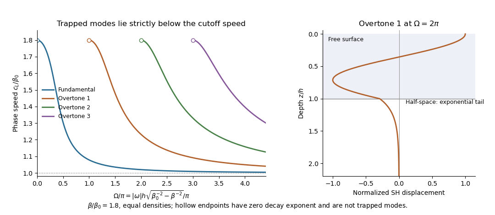

# Paper 82

↑ **Parent:** [Iii](../iii.md)

[https://www.maths.cam.ac.uk/postgrad/part-iii/files/pastpapers/2005/Paper82.pdf](https://www.maths.cam.ac.uk/postgrad/part-iii/files/pastpapers/2005/Paper82.pdf)

**Table of contents**

- [1](#1)
  - [a](#1/a)
    - [Solution](#1/a/solution)
  - [b](#1/b)
    - [Solution](#1/b/solution)
  - [c](#1/c)
    - [Solution](#1/c/solution)
  - [d](#1/d)
    - [Solution](#1/d/solution)
- [2](#2)
  - [Solution](#2/solution)
  - [a](#2/a)
    - [Solution](#2/a/solution)
  - [b](#2/b)
    - [i](#2/i)
      - [Solution](#2/i/solution)
    - [ii](#2/ii)
      - [Solution](#2/ii/solution)
    - [iii](#2/iii)
      - [Solution](#2/iii/solution)
- [3](#3)
  - [a](#3/a)
    - [Solution](#3/a/solution)
  - [b](#3/b)
    - [Solution](#3/b/solution)
  - [c](#3/c)
    - [Solution](#3/c/solution)
  - [d](#3/d)
    - [Solution](#3/d/solution)
- [4](#4)
  - [a](#4/a)
    - [Solution](#4/a/solution)
  - [b](#4/b)
    - [Solution](#4/b/solution)
  - [c](#4/c)
    - [Solution](#4/c/solution)

## 1

↑ **Parent:** [Paper 82](paper-82.md)

<h3 id="1/a">a</h3>

↑ **Parent:** [1](#1)

<h4 id="1/a/solution">Solution</h4>

↑ **Parent:** [A](#1/a)

Put $Z=\rho\beta=\sqrt{\rho\mu}>0$, the [seismic impedance](../../../wave-equation.md#seismic-impedance). In a uniform medium, define $w_+=v-\sigma/Z$ and $w_-=v+\sigma/Z$. The field equations give

$$
(\partial_t+\beta\partial_x)w_+=0,\qquad(\partial_t-\beta\partial_x)w_-=0.
$$

Thus $w_+=2F(x-\beta t)$ and $w_-=2G(x+\beta t)$, with arbitrary independent profiles $F,G$. Reconstruction gives

$$
\boxed{v=F+G,\qquad\sigma=-ZF+ZG.}
$$

The two characteristic components therefore have $v_+=F$, $\sigma_+=-Zv_+$ and $v_-=G$, $\sigma_-=Zv_-$.

The kinetic plus [elastic energy](../../../continuum-mechanics.md#elastic-energy) [mass density](../../../fluid-mechanics.md#density) is $e=\rho v^2/2+\sigma^2/(2\mu)$. Multiplying the equations by $v$ and $\sigma/\mu$ yields $e_t=(v\sigma)_x$. Hence the [elastic-wave energy flux](../../../continuum-mechanics.md#elastic-wave-energy-flux) is $S=-v\sigma$. For a pure forward wave $S_+=Zv_+^2\geq0$; for a pure backward wave $S_-=-Zv_-^2\leq0$. In the mixture the cross terms cancel, giving **$S=Z(v_+^2-v_-^2)$**. Strict sign holds for nonzero components.

<h3 id="1/b">b</h3>

↑ **Parent:** [1](#1)

<h4 id="1/b/solution">Solution</h4>

↑ **Parent:** [B](#1/b)

Let the positive real material parameters depend on $x$ but not on time. Define the [flux-normalized elastic characteristic amplitudes](../../../wave-equation.md#flux-normalized-elastic-characteristic-amplitudes) and logarithmic [seismic impedance](../../../wave-equation.md#seismic-impedance) [gradient](../../../calculus.md#gradient)

$$
\phi_\pm=\frac12\left(\sqrt Z\,v\mp\frac{\sigma}{\sqrt Z}\right),\qquad g=\frac12\frac{d\log Z}{dx}.
$$

Write $P=\phi_++\phi_-$ and $Q=\phi_+-\phi_-$. Then $v=Z^{-1/2}P$, $\sigma=-Z^{1/2}Q$, and direct substitution gives

$$
P_t=-\beta(Q_x+gQ),\qquad Q_t=-\beta(P_x-gP).
$$

For example, the first relation uses $(Z^{1/2})'=gZ^{1/2}$ and $Z/\rho=\beta$; the second uses $\mu/Z=\beta$. Adding and subtracting now proves

$$
\boxed{\partial_x\phi_++\beta^{-1}\partial_t\phi_+=g\phi_-,\qquad \partial_x\phi_--\beta^{-1}\partial_t\phi_-=g\phi_+.}
$$

The original PDF has these two first-order equations. The TeX mistakenly combines them into ratios, which must not be used. A [seismic impedance](../../../wave-equation.md#seismic-impedance) [gradient](../../../calculus.md#gradient) couples forward and backward [wave amplitudes](../../../physics.md#wave-amplitude) even when the local [wave speed](../../../wave-equation.md#wave-speed) is allowed to vary.

<h3 id="1/c">c</h3>

↑ **Parent:** [1](#1)

<h4 id="1/c/solution">Solution</h4>

↑ **Parent:** [C](#1/c)

Use a [time-harmonic wave](../../../physics.md#time-harmonic-wave) with time dependence $e^{-i\omega t}$ and let the same symbols denote phasors. The [wave amplitude](../../../physics.md#wave-amplitude) vector obeys

$$
\frac{d}{dx}\begin{pmatrix}\phi_+\\\phi_-\end{pmatrix}=\begin{pmatrix}i\omega/\beta&g\\g&-i\omega/\beta\end{pmatrix}\begin{pmatrix}\phi_+\\\phi_-\end{pmatrix}.
$$

At fixed material contrast, the stated low-frequency condition permits neglecting the diagonal [frequency](../../../physics.md#frequency) term to zeroth order. All remaining coefficient [matrices](../../../vector-space.md#matrix) are scalar multiples of the same exchange [matrix](../../../vector-space.md#matrix), so they commute. With

$$
L=\int_{x_a}^{x_b}g\,dx=\frac12\log\frac{Z_b}{Z_a},\qquad C=\cosh L,\quad H=\sinh L,
$$

the transfer relation is

$$
\begin{pmatrix}\phi_+(x_b)\\\phi_-(x_b)\end{pmatrix}=\begin{pmatrix}C&H\\H&C\end{pmatrix}\begin{pmatrix}\phi_+(x_a)\\\phi_-(x_a)\end{pmatrix}.
$$

Solve the second row for the outgoing left [wave amplitude](../../../physics.md#wave-amplitude) and substitute in the first. Since $C^2-H^2=1$, this gives the [zero-frequency scattering through an elastic layer](../../../wave-equation.md#zero-frequency-scattering-through-an-elastic-layer) coefficients

$$
\boxed{R_{aa}=\frac{Z_a-Z_b}{Z_a+Z_b},\quad R_{bb}=\frac{Z_b-Z_a}{Z_a+Z_b},\quad T_{ab}=T_{ba}=\frac{2\sqrt{Z_aZ_b}}{Z_a+Z_b}.}
$$

Thus the zero-frequency limit depends only on the endpoint [seismic impedances](../../../wave-equation.md#seismic-impedance). Monotonicity supports the given scale comparison but is not needed to integrate the zero-frequency equation. If $Z_a=Z_b$ in a monotone profile, [seismic impedance](../../../wave-equation.md#seismic-impedance) is constant: there is no directional coupling, with only [wave phase](../../../physics.md#phase-waves) accumulation at nonzero [frequency](../../../physics.md#frequency).

<h3 id="1/d">d</h3>

↑ **Parent:** [1](#1)

<h4 id="1/d/solution">Solution</h4>

↑ **Parent:** [D](#1/d)

At a sharp interface, continuity of [velocity](../../../classical-mechanics.md#velocity) and [traction](../../../continuum-mechanics.md#traction) gives, for unit incident [velocity](../../../classical-mechanics.md#velocity) from the left,

$$
1+r_v=t_v,\qquad Z_a(1-r_v)=Z_bt_v.
$$

Thus $r_v=(Z_a-Z_b)/(Z_a+Z_b)$ and $t_v=2Z_a/(Z_a+Z_b)$. Normalizing the transmitted [velocity](../../../classical-mechanics.md#velocity) by its [elastic-wave energy flux](../../../continuum-mechanics.md#elastic-wave-energy-flux) gives $T_{ba}=\sqrt{Z_b/Z_a}\,t_v$, exactly the result above. Right incidence gives the reversed reflection sign and the same flux-normalized transmission. A [stress](../../../continuum-mechanics.md#stress) [reflection coefficient](../../../partial-differential-equation.md#reflection-coefficient) has the opposite sign to the [velocity](../../../classical-mechanics.md#velocity) [reflection coefficient](../../../partial-differential-equation.md#reflection-coefficient); the convention matters.

Put $r=R_{aa}$ and $t=T_{ab}$. The incoming-to-outgoing [matrix](../../../vector-space.md#matrix) is $S_0=\begin{pmatrix}r&t\\t&-r\end{pmatrix}$, with $r^2+t^2=1$. Therefore **$S_0^\dagger S_0=I$**, proving equality of incoming and outgoing time-averaged flux for arbitrary coherent incident [wave amplitudes](../../../physics.md#wave-amplitude), not just incidence from one side.

For all real [frequencies](../../../physics.md#frequency) the harmonic equations instead give

$$
\frac{d|\phi_+|^2}{dx}=2g\operatorname{Re}(\phi_+^*\phi_-),\qquad \frac{d|\phi_-|^2}{dx}=2g\operatorname{Re}(\phi_-^*\phi_+).
$$

Their right sides are equal; the diagonal terms $\pm i\omega/\beta$ have zero real contribution. Consequently

$$
\boxed{\frac{d}{dx}\left(|\phi_+|^2-|\phi_-|^2\right)=0.}
$$

The mean flux for real-part phasors is $(|\phi_+|^2-|\phi_-|^2)/2$. Evaluating it at the two endpoints proves exactly that total outgoing flux equals total incoming flux at every real [frequency](../../../physics.md#frequency). This relies on real lossless moduli and [mass density](../../../fluid-mechanics.md#density); absorption would change the identity.

## 2

↑ **Parent:** [Paper 82](paper-82.md)

<h3 id="2/solution">Solution</h3>

↑ **Parent:** [2](#2)

Take a stable isotropic elastic material with [mass density](../../../fluid-mechanics.md#density) $\rho>0$ and [Lamé parameters](../../../continuum-mechanics.md#lame-parameter) $\lambda,\mu$, where $\mu>0$ and $3\lambda+2\mu>0$. Its [elastic stiffness tensor](../../../continuum-mechanics.md#elastic-stiffness-tensor) is

$$
c_{ijpq}=\lambda\delta_{ij}\delta_{pq}+\mu(\delta_{ip}\delta_{jq}+\delta_{iq}\delta_{jp}),\qquad \alpha^2=\frac{\lambda+2\mu}{\rho},\quad\beta^2=\frac\mu\rho.
$$

The [P wave](../../../wave-equation.md#p-wave) is longitudinal and the [S wave](../../../wave-equation.md#s-wave) transverse. The wavefront-transport alternative and all three steps of the [Love wave](../../../wave-equation.md#love-wave) alternative are given below.

<h3 id="2/a">a</h3>

↑ **Parent:** [2](#2)

<h4 id="2/a/solution">Solution</h4>

↑ **Parent:** [A](#2/a)

Assume the coefficients are sufficiently differentiable in the region considered, with no material discontinuity or [caustic](../../../optics.md#wave-caustic) at the front. Let $t=T(\mathbf x)$ describe arrival time, $\mathbf p=\nabla T$ the slowness vector, and $\mathbf n$ the unit [elastic wave](../../../wave-equation.md#elastic-wave) propagation normal. For any field, its jump is the value immediately behind the front minus that immediately ahead. If the first nonzero jump occurs in the kth time [derivative](../../../calculus.md#derivative), $k\geq2$, write

$$
[\partial_t^ku_i]=A_i(\mathbf x),\qquad u_i=A_iF_k(t-T)+B_iF_{k+1}(t-T)+\cdots,\quad F_j(s)=s_+^j/j!.
$$

A smooth background may be added without changing these leading jumps. Since $F_j'=F_{j-1}$, [differentiation](../../../calculus.md#differentiation) expresses spatial jumps in terms of $p_j$ and time-derivative jumps. The restriction $k\geq2$ lets [displacement field](../../../continuum-mechanics.md#displacement-field-mechanics) and its first time [derivative](../../../calculus.md#derivative) remain continuous and avoids an imposed impulsive source at the front.

Insert this local expansion in $\rho\partial_t^2u_i=\partial_j(c_{ijpq}\partial_pu_q)$. The coefficient of $F_{k-2}$ is

$$
\left(c_{ijpq}p_jp_p-\rho\delta_{iq}\right)A_q=0.
$$

For isotropic [elasticity](../../../continuum-mechanics.md#elasticity-physics) the slowness acoustic [matrix](../../../vector-space.md#matrix) is $\mu|\mathbf p|^2I+(\lambda+\mu)\mathbf p\mathbf p^T$. Its longitudinal [eigenvalue](../../../linear-operator-theory.md#eigenvalue) is $(\lambda+2\mu)|\mathbf p|^2$. The P branch therefore gives the [eikonal equation](../../../continuum-mechanics.md#eikonal-equation) and polarization

$$
\boxed{|\nabla T|=\alpha^{-1},\qquad\mathbf n=\alpha\nabla T,\qquad A_i=a^{[k]}n_i.}
$$

The next coefficient, $F_{k-1}$, is

$$
\left(c_{ijpq}p_jp_p-\rho\delta_{iq}\right)B_q=c_{ijpq}p_j\partial_pA_q+\partial_j(c_{ijpq}p_pA_q).
$$

The [matrix](../../../vector-space.md#matrix) on the left is symmetric and annihilates $\mathbf n$. Project onto $n_i$ to obtain its solvability condition. Put $a=a^{[k]}$. The two projected terms can be evaluated without dropping [gradients](../../../calculus.md#gradient) of [mass density](../../../fluid-mechanics.md#density) or moduli:

$$
n_ic_{ijpq}p_j\partial_p(an_q)=\rho\alpha\,\mathbf n\cdot\nabla a+\frac{\lambda a}{\alpha}\nabla\cdot\mathbf n,
$$

$$
n_i\partial_j(c_{ijpq}p_pan_q)=\nabla\cdot(\rho\alpha a\mathbf n)-\frac{\lambda a}{\alpha}\nabla\cdot\mathbf n.
$$

These identities use $|\mathbf n|^2=1$, hence $n_q\partial_pn_q=0$, and $(\lambda+2\mu)/\alpha=\rho\alpha$. Their curvature terms cancel, leaving

$$
2\rho\alpha\,\mathbf n\cdot\nabla a+a\nabla\cdot(\rho\alpha\mathbf n)=0.
$$

Multiplying by $a$ proves the requested [P-wavefront discontinuity transport](../../../wave-equation.md#p-wavefront-discontinuity-transport) law,

$$
\boxed{\partial_q\left[\rho\alpha\left(a^{[k]}\right)^2n_q\right]=0.}
$$

The [wave amplitude](../../../physics.md#wave-amplitude) here is real for a real jump; a complex [wave amplitude](../../../physics.md#wave-amplitude) uses the corresponding modulus-squared law. An [elastic ray](../../../wave-equation.md#elastic-ray) follows $d\mathbf x/ds=\mathbf n$, with arclength $s$ and $dt/ds=1/\alpha$. If $J$ is the infinitesimal cross-sectional area of a neighboring ray tube, $d\log J/ds=\nabla\cdot\mathbf n$. Thus $\rho\alpha a^2J$ is constant along that tube, the [ray-tube conservation for a P-wave jump](../../../wave-equation.md#ray-tube-conservation-for-a-p-wave-jump). This defines the geometrical spreading and shows why the [wave amplitude](../../../physics.md#wave-amplitude) changes with material properties even before attenuation is considered. At a [caustic](../../../optics.md#wave-caustic) the simple ray-tube [wave amplitude](../../../physics.md#wave-amplitude) is singular and a uniform local description is needed.

<h3 id="2/b">b</h3>

↑ **Parent:** [2](#2)

<h4 id="2/i">i</h4>

↑ **Parent:** [B](#2/b)

<h5 id="2/i/solution">Solution</h5>

↑ **Parent:** [I](#2/i)

Choose depth $z$ positive downwards, the free surface at $z=0$ and the interface at $z=h$. A [Love wave](../../../wave-equation.md#love-wave) has only transverse [displacement field](../../../continuum-mechanics.md#displacement-field-mechanics) $u_y=U(z)e^{i(\kappa x-\omega t)}$. Take $\omega>0$, $\kappa=\omega/c_L$, and define

$$
q=\sqrt{\omega^2/\beta_0^2-\kappa^2},\qquad p=\sqrt{\kappa^2-\omega^2/\beta^2}.
$$

A trapped mode requires **$\beta_0<c_L<\beta$**, so both $q,p$ are positive. The SH equations are $U_0''+q^2U_0=0$ in the layer and $U''-p^2U=0$ in the half-space. Zero shear [traction](../../../continuum-mechanics.md#traction) at the free surface and decay at large depth select

$$
U_0=A\cos(qz),\qquad U=C e^{-p(z-h)}.
$$

Continuity of [displacement field](../../../continuum-mechanics.md#displacement-field-mechanics) and shear [traction](../../../continuum-mechanics.md#traction) at $h$ gives $C=A\cos(qh)$ and $-\mu_0qA\sin(qh)=-\mu pC$. Consequently

$$
\boxed{\tan(qh)=\frac{\mu p}{\mu_0q}.}
$$

Substituting the definitions of $q,p$ yields the requested speed-frequency dispersion relation. For negative [frequency](../../../physics.md#frequency) use $|\omega|$ in both vertical wavenumbers; the real [displacement field](../../../continuum-mechanics.md#displacement-field-mechanics) has conjugate [frequency](../../../physics.md#frequency) partners. Neither equality in the trapped-speed interval gives a strictly localized finite-frequency Love mode.

<h4 id="2/ii">ii</h4>

↑ **Parent:** [B](#2/b)

<h5 id="2/ii/solution">Solution</h5>

↑ **Parent:** [Ii](#2/ii)

Refer all layer [wave amplitudes](../../../physics.md#wave-amplitude) to the lower interface. Let a downward incident SH [displacement field](../../../continuum-mechanics.md#displacement-field-mechanics) have unit [wave amplitude](../../../physics.md#wave-amplitude) there, an upward reflected wave have [wave amplitude](../../../physics.md#wave-amplitude) $R_h$, and the decaying half-space wave [wave amplitude](../../../physics.md#wave-amplitude) $T_h$. Interface continuity gives

$$
1+R_h=T_h,\qquad i\mu_0q(1-R_h)=-\mu pT_h.
$$

Solving these equations proves the [Love-wave interface reflection phase](../../../wave-equation.md#love-wave-interface-reflection-phase) and transmission [wave amplitude](../../../physics.md#wave-amplitude):

$$
\boxed{R_h=\frac{\mu_0q-i\mu p}{\mu_0q+i\mu p}=e^{-2i\arctan(\mu p/(\mu_0q))},\quad T_h=\frac{2\mu_0q}{\mu_0q+i\mu p}.}
$$

Thus $|R_h|=1$: the [evanescent](../../../continuum-mechanics.md#evanescent-wave) substrate field has nonzero [wave amplitude](../../../physics.md#wave-amplitude) but no net downward mean flux. At the traction-free top, an upward incident wave and its downward reflection must have canceling [derivatives](../../../calculus.md#derivative), so their [displacement field](../../../continuum-mechanics.md#displacement-field-mechanics) [reflection coefficient](../../../partial-differential-equation.md#reflection-coefficient) is $R_0=+1$.

A layer wave acquires [wave phase](../../../physics.md#phase-waves) $2qh$ during a complete round trip. [Constructive interference](../../../fourier-analysis.md#constructive-interference) requires

$$
R_0R_he^{2iqh}=1,\qquad qh-\arctan\frac{\mu p}{\mu_0q}=n\pi.
$$

Taking the tangent gives again **$\tan(qh)=\mu p/(\mu_0q)$**. The reflection phases, rather than only geometric travel distance, are essential to the mode condition.

<h4 id="2/iii">iii</h4>

↑ **Parent:** [B](#2/b)

<h5 id="2/iii/solution">Solution</h5>

↑ **Parent:** [Iii](#2/iii)

At $c_L=\beta$, the half-space decay exponent $p$ tends to zero and the dispersion relation requires $qh=n\pi$. These are the [Love-wave cutoff frequencies](../../../wave-equation.md#love-wave-cutoff-frequencies),

$$
\boxed{|\omega_n|=\frac{n\pi}{h\sqrt{\beta_0^{-2}-\beta^{-2}}},\qquad n=0,1,2,\ldots.}
$$

An overtone exists strictly above its cutoff. At the cutoff its half-space field is constant in depth rather than decaying, so it is a limiting nonlocalized state, not a trapped finite-energy [eigenfunction](../../../linear-operator-theory.md#eigenfunction). The $n=0$ fundamental has cutoff zero and exists for every positive [frequency](../../../physics.md#frequency). Each fixed branch approaches $c_L=\beta_0$ from above at high [frequency](../../../physics.md#frequency). The half-space penetration depth $1/p$ diverges on approach to cutoff.

**[Figure 1](#2/iii/image-love-wave-dispersion-branches-above-their-cutoffs-and-an-overtone-displacement-profile-across-the-layer-interface). Love-wave dispersion branches above their cutoffs and an overtone displacement profile across the layer interface**.

## 3

↑ **Parent:** [Paper 82](paper-82.md)

<h3 id="3/a">a</h3>

↑ **Parent:** [3](#3)

<h4 id="3/a/solution">Solution</h4>

↑ **Parent:** [A](#3/a)

Use the same real [elastic stiffness tensor](../../../continuum-mechanics.md#elastic-stiffness-tensor) for both fields, including its minor and major symmetries, and let $t_i^a=\widehat\sigma_{ij}^a n_j$, with outward unit boundary normal $n_j$. No [complex conjugation](../../../complex-analysis.md#complex-conjugation) is needed for the initial bilinear identity. Define

$$
F_j=\widehat\sigma_{ij}^a\widehat u_i^b-\widehat u_i^a\widehat\sigma_{ij}^b.
$$

The [divergence](../../../calculus.md#divergence) has two force-balance terms and two cross-gradient terms. The latter cancel because

$$
\widehat\sigma_{ij}^a\partial_j\widehat u_i^b=\widehat\sigma_{ij}^b\partial_j\widehat u_i^a;
$$

this follows by exchanging the two strain-gradient factors using major symmetry and the minor pair symmetries. The frequency-domain equations then give

$$
\partial_jF_j=-(\rho\omega_a^2\widehat u_i^a+\widehat f_i^a)\widehat u_i^b+\widehat u_i^a(\rho\omega_b^2\widehat u_i^b+\widehat f_i^b).
$$

Integrating and applying the [divergence theorem](../../../calculus.md#divergence-theorem) proves

$$
\boxed{\int_{\mathcal D}\left[-(\rho\omega_a^2\widehat u_i^a+\widehat f_i^a)\widehat u_i^b+\widehat u_i^a(\rho\omega_b^2\widehat u_i^b+\widehat f_i^b)\right]dV=\int_{\partial\mathcal D}(t_i^a\widehat u_i^b-\widehat u_i^at_i^b)dS.}
$$

This is the [Betti identity for elastodynamic fields](../../../continuum-mechanics.md#betti-identity-for-elastodynamic-fields). Spatially varying stiffness is allowed because its [derivatives](../../../calculus.md#derivative) remain inside the [divergence](../../../calculus.md#divergence). The original PDF's constitutive contraction is $c_{ijpq}\partial_p\widehat u_q$; the TeX's repeated [displacement field](../../../continuum-mechanics.md#displacement-field-mechanics) index is erroneous.

<h3 id="3/b">b</h3>

↑ **Parent:** [3](#3)

<h4 id="3/b/solution">Solution</h4>

↑ **Parent:** [B](#3/b)

In the bilinear identity choose field $a$ to be the [complex conjugate](../../../complex-analysis.md#complex-conjugate) of the field at [frequency](../../../physics.md#frequency) $\omega$, equivalently its $-\omega$ partner, and field $b$ to be the field itself. The squared [frequencies](../../../physics.md#frequency) are equal, so the [mass density](../../../fluid-mechanics.md#density) terms cancel:

$$
\int_{\mathcal D}(-\widehat f_i^*\widehat u_i+\widehat u_i^*\widehat f_i)dV=\int_{\partial\mathcal D}(t_i^*\widehat u_i-\widehat u_i^*t_i)dS.
$$

Multiply by $i\omega$ and use $\widehat v_i=-i\omega\widehat u_i$, $\widehat v_i^*=i\omega\widehat u_i^*$ to obtain

$$
\boxed{\int_{\mathcal D}(\widehat f_i^*\widehat v_i+\widehat v_i^*\widehat f_i)dV=\int_{\partial\mathcal D}(-t_i^*\widehat v_i-\widehat v_i^*t_i)dS.}
$$

For the real fields defined in this question as the sum of positive and negative [frequency](../../../physics.md#frequency) components, time averaging cancels the $e^{\pm2i\omega t}$ terms. Their mean body-force [work](../../../classical-mechanics.md#work) [mass density](../../../fluid-mechanics.md#density) is exactly $\widehat f_i^*\widehat v_i+\widehat v_i^*\widehat f_i$, and their outward mean [elastic-wave energy flux](../../../continuum-mechanics.md#elastic-wave-energy-flux) is $-t_i^*\widehat v_i-\widehat v_i^*t_i$. Thus **mean body-force [power](../../../classical-mechanics.md#power) equals mean outward boundary [power](../../../classical-mechanics.md#power)**. Mean stored [energy](../../../classical-mechanics.md#energy) does not accumulate in a periodic steady field.

There is no extra factor $1/2$ here: the specified real field is $\widehat f e^{-i\omega t}+\widehat f^*e^{i\omega t}$, not $\operatorname{Re}(\widehat f e^{-i\omega t})$. For the latter phasor convention, both averages instead have the usual factor $1/2$. At $\omega=0$ [velocity](../../../classical-mechanics.md#velocity) and both powers vanish.

<h3 id="3/c">c</h3>

↑ **Parent:** [3](#3)

<h4 id="3/c/solution">Solution</h4>

↑ **Parent:** [C](#3/c)

Choose field $a$ to be $(\widehat{\mathbf u}^a)^*$ at [frequency](../../../physics.md#frequency) $-\omega_a$, and field $b$ to be $\widehat{\mathbf u}^b$ at $\omega_b$. Zero [body forces](../../../fluid-mechanics.md#body-force) and zero boundary [tractions](../../../continuum-mechanics.md#traction) make all source and surface terms vanish. Therefore

$$
(\omega_b^2-\omega_a^2)\int_{\mathcal D}\rho(\widehat u_i^a)^*\widehat u_i^b\,dV=0.
$$

For distinct squared [frequencies](../../../physics.md#frequency) this proves **weighted [orthogonality](../../../linear-algebra.md#orthogonal-vectors)**,

$$
\boxed{\langle\widehat{\mathbf u}^a,\widehat{\mathbf u}^b\rangle_\rho=\int_{\mathcal D}\rho(\widehat u_i^a)^*\widehat u_i^b\,dV=0.}
$$

Assume positive [mass density](../../../fluid-mechanics.md#density) bounded above and below and finite-energy fields in the ordinary bounded domain. The weighted space $H=L^2(\mathcal D,\rho\,dV)^3$ is a [separable Hilbert space](../../../hilbert-space.md#separable-hilbert-space). Select one unit [eigenfunction](../../../linear-operator-theory.md#eigenfunction) for each distinct squared [frequency](../../../physics.md#frequency). They form an [orthonormal set](../../../linear-algebra.md#orthonormal-set). Let $\{d_j\}$ be a countable dense subset of $H$; assign to each [eigenfunction](../../../linear-operator-theory.md#eigenfunction) a point $d_j$ within distance $1/3$. Two [orthogonal](../../../linear-algebra.md#orthogonal-vectors) unit [eigenfunctions](../../../linear-operator-theory.md#eigenfunction) have distance $\sqrt2$, so the same $d_j$ cannot be assigned to both. This gives an injection into a countable set.

Hence there are **at most countably many squared [eigenfrequencies](../../../wave-equation.md#eigenfrequency)**, and at most twice that many signed [frequencies](../../../physics.md#frequency). Multiplicity at one [frequency](../../../physics.md#frequency) does not change the argument. A zero [frequency](../../../physics.md#frequency) associated with rigid translations or rotations is included. This proves the [countability of elastic eigenfrequencies](../../../wave-equation.md#countability-of-elastic-eigenfrequencies) directly; proving discreteness or finite multiplicity would require additional spectral regularity arguments.

<h3 id="3/d">d</h3>

↑ **Parent:** [3](#3)

<h4 id="3/d/solution">Solution</h4>

↑ **Parent:** [D](#3/d)

If two harmonic solutions have the same [body force](../../../fluid-mechanics.md#body-force) and prescribed boundary [traction](../../../continuum-mechanics.md#traction), their difference has no [body force](../../../fluid-mechanics.md#body-force) and is traction-free. A nonzero difference would therefore be a free [eigenfunction](../../../linear-operator-theory.md#eigenfunction) at that [frequency](../../../physics.md#frequency). For any [frequency](../../../physics.md#frequency) outside the countable exceptional set found above, **the difference must vanish**, so the forced boundary-value solution, when it exists, is unique. At an [eigenfrequency](../../../wave-equation.md#eigenfrequency), a free [eigenfunction](../../../linear-operator-theory.md#eigenfunction) can be added to any existing solution, and a resonant forcing may fail to admit a steady harmonic response. This distinguishes uniqueness from existence.

For the full time-dependent problem, let $\mathbf w$ be the difference between two fields with identical forces, [tractions](../../../continuum-mechanics.md#traction) and initial [displacement field](../../../continuum-mechanics.md#displacement-field-mechanics) and [velocity](../../../classical-mechanics.md#velocity). It obeys $\rho\mathbf w_{tt}=\nabla\cdot\boldsymbol\sigma(\mathbf w)$, zero boundary [traction](../../../continuum-mechanics.md#traction), and zero initial data. Its [energy uniqueness for traction-driven elasticity](../../../wave-equation.md#energy-uniqueness-for-traction-driven-elasticity) follows by direct [integration](../../../calculus.md#integral):

$$
E(t)=\frac12\int_{\mathcal D}\left[\rho|\mathbf w_t|^2+c_{ijpq}e_{ij}(\mathbf w)e_{pq}(\mathbf w)\right]dV,\qquad e_{ij}=\frac12(\partial_iw_j+\partial_jw_i).
$$

Multiply the equation by $\mathbf w_t$ and integrate by parts. Major symmetry turns the [strain](../../../continuum-mechanics.md#strain) term into the [derivative](../../../calculus.md#derivative) of [elastic energy](../../../continuum-mechanics.md#elastic-energy), giving $E'(t)=\int_{\partial\mathcal D}\mathbf w_t\cdot\mathbf t(\mathbf w)dS=0$. Stable [elasticity](../../../continuum-mechanics.md#elasticity-physics) makes $E\geq0$, and $E(0)=0$ gives $\mathbf w_t=0$. Thus $\mathbf w$ equals its initial value zero. Even rigid zero-strain motions cannot survive these [initial conditions](../../../differential-equation.md#initial-condition).

The PDF correctly specifies zero initial [displacement field](../../../continuum-mechanics.md#displacement-field-mechanics) and zero initial [velocity](../../../classical-mechanics.md#velocity); the TeX duplicates [displacement field](../../../continuum-mechanics.md#displacement-field-mechanics) in the second condition. **The complete causal [displacement field](../../../continuum-mechanics.md#displacement-field-mechanics) is unique**, including when its Fourier representation contains resonant modal contributions fixed by the initial data.

## 4

↑ **Parent:** [Paper 82](paper-82.md)

<h3 id="4/a">a</h3>

↑ **Parent:** [4](#4)

<h4 id="4/a/solution">Solution</h4>

↑ **Parent:** [A](#4/a)

Use the displacement-potential convention $u_x=\partial_x\phi-\partial_z\psi$, $u_z=\partial_z\phi+\partial_x\psi$ and harmonic dependence $e^{-i\omega t}$. Choosing the opposite sign for the shear potential changes its column sign but not the [P-SV directional impedance matrix](../../../continuum-mechanics.md#p-sv-directional-impedance-matrix). Write $p=k_\alpha>0$, $s=k_\beta>0$, $D=k^2+ps$, and $H=\rho\omega^2-2\mu k^2$. At a common point the forward potential [wave amplitudes](../../../physics.md#wave-amplitude) give

$$
\begin{pmatrix}v_x\\v_z\end{pmatrix}=\omega\begin{pmatrix}k&-s\\p&k\end{pmatrix}\begin{pmatrix}\phi_+\\\psi_+\end{pmatrix},\qquad \begin{pmatrix}\sigma_{xz}\\\sigma_{zz}\end{pmatrix}=\begin{pmatrix}-2\mu kp&H\\-H&-2\mu ks\end{pmatrix}\begin{pmatrix}\phi_+\\\psi_+\end{pmatrix}.
$$

The [traction](../../../continuum-mechanics.md#traction) formulas follow from $\sigma_{xz}=\mu(u_{x,z}+u_{z,x})$ and $\sigma_{zz}=\lambda\nabla\cdot\mathbf u+2\mu u_{z,z}$, using $(\lambda+2\mu)\omega^2/\alpha^2=\rho\omega^2$ and $\mu(s^2-k^2)=H$. The [velocity](../../../classical-mechanics.md#velocity) [matrix](../../../vector-space.md#matrix) has [determinant](../../../linear-algebra.md#determinant) $\omega^2D>0$, so elimination gives the [P-SV directional impedance matrix](../../../continuum-mechanics.md#p-sv-directional-impedance-matrix)

$$
\boxed{Z_+=\frac1{\omega D}\begin{pmatrix}\rho\omega^2p&k(2\mu D-\rho\omega^2)\\-k(2\mu D-\rho\omega^2)&\rho\omega^2s\end{pmatrix},\qquad\mathbf t=-Z_+\mathbf v.}
$$

Its off-diagonal entries are real and antisymmetric. Therefore

$$
Z_++Z_+^\dagger=\frac{2\rho\omega}{D}\begin{pmatrix}p&0\\0&s\end{pmatrix}.
$$

With real-part phasors, the outward $z$ flux is $-\tfrac12\operatorname{Re}(\mathbf v^\dagger\mathbf t)$, so

$$
\boxed{\langle S_z\rangle_+=\frac14\mathbf v^\dagger(Z_++Z_+^\dagger)\mathbf v=\frac{\rho\omega}{2D}\left(p|v_x|^2+s|v_z|^2\right)>0}
$$

for every nonzero forward [displacement field](../../../continuum-mechanics.md#displacement-field-mechanics). [Mass density](../../../fluid-mechanics.md#density) and [angular frequency](../../../classical-mechanics.md#angular-frequency) are essential to this flux coefficient; both appear correctly in the PDF.

<h3 id="4/b">b</h3>

↑ **Parent:** [4](#4)

<h4 id="4/b/solution">Solution</h4>

↑ **Parent:** [B](#4/b)

For downward-phase reversal, the [P-SV displacement potentials](../../../wave-equation.md#p-sv-displacement-potentials) instead produce

$$
\mathbf v=\omega\begin{pmatrix}k&s\\-p&k\end{pmatrix}\begin{pmatrix}\phi_-\\\psi_-\end{pmatrix},\qquad \mathbf t=\begin{pmatrix}2\mu kp&H\\-H&2\mu ks\end{pmatrix}\begin{pmatrix}\phi_-\\\psi_-\end{pmatrix}.
$$

Eliminating the potentials as before gives

$$
\boxed{Z_-=\frac1{\omega D}\begin{pmatrix}-\rho\omega^2p&k(2\mu D-\rho\omega^2)\\-k(2\mu D-\rho\omega^2)&-\rho\omega^2s\end{pmatrix}=-Z_+^\dagger.}
$$

The [Hermitian part](../../../hilbert-space.md#hermitian-part-of-a-matrix) is negative definite, and consequently

$$
\boxed{\langle S_z\rangle_-=-\frac{\rho\omega}{2D}\left(p|v_x|^2+s|v_z|^2\right)<0}
$$

for a nonzero backward [displacement field](../../../continuum-mechanics.md#displacement-field-mechanics). The P potential must use vertical [wavenumber](../../../wave-equation.md#wavenumber) $k_\alpha$ and the S potential $k_\beta$, as in the original PDF; the TeX incorrectly gives the shear [wavenumber](../../../wave-equation.md#wavenumber) for both.

<h3 id="4/c">c</h3>

↑ **Parent:** [4](#4)

<h4 id="4/c/solution">Solution</h4>

↑ **Parent:** [C](#4/c)

Define $K=Z_+-Z_-$. Its antisymmetric off-diagonal entries cancel, leaving

$$
\boxed{K=\frac{2\rho\omega}{D}\operatorname{diag}(p,s),\qquad K^{-1}=\frac{D}{2\rho\omega}\operatorname{diag}(1/p,1/s).}
$$

From $\mathbf v=\mathbf v^++\mathbf v^-$ and $\mathbf t=-Z_+\mathbf v^+-Z_-\mathbf v^-$, solve explicitly for the [P-SV characteristic reconstruction](../../../continuum-mechanics.md#p-sv-characteristic-reconstruction):

$$
\boxed{\mathbf v^+=-K^{-1}(\mathbf t+Z_-\mathbf v),\qquad\mathbf v^-=K^{-1}(\mathbf t+Z_+\mathbf v).}
$$

The prescribed strictly positive $p,s$ make this decomposition unique; a grazing or [evanescent](../../../continuum-mechanics.md#evanescent-wave) branch is outside these assumptions.

In the mean flux, the two mixed directional terms are

$$
\frac12\operatorname{Re}\left[(\mathbf v^-)^\dagger Z_+\mathbf v^++(\mathbf v^+)^\dagger Z_-\mathbf v^-\right]=0,
$$

because $Z_-=-Z_+^\dagger$ makes the second scalar minus the [complex conjugate](../../../complex-analysis.md#complex-conjugate) of the first. The remaining self terms give

$$
\boxed{\langle S_z\rangle=\frac{\rho\omega}{2D}\left[p\left(|v_x^+|^2-|v_x^-|^2\right)+s\left(|v_z^+|^2-|v_z^-|^2\right)\right].}
$$

Finally use either directional velocity-potential [matrix](../../../vector-space.md#matrix). Its weighted quadratic form satisfies

$$
p|v_x^\pm|^2+s|v_z^\pm|^2=\omega^2D\left(p|\phi_\pm|^2+s|\psi_\pm|^2\right).
$$

Indeed the two P-SV cross terms have coefficients $-kps$ and $+kps$ for the forward field, with the signs reversed for the backward field, so they cancel. Substitution proves

$$
\boxed{\langle S_z\rangle=\frac{\rho\omega^3}{2}\left[p\left(|\phi_+|^2-|\phi_-|^2\right)+s\left(|\psi_+|^2-|\psi_-|^2\right)\right].}
$$

Thus net normal [elastic-wave energy flux](../../../continuum-mechanics.md#elastic-wave-energy-flux) is the difference of the independently flux-weighted P and SV directional powers, even for coherent mixtures.

## ↑ Ancestors (8)

1. [Iii](../iii.md)
2. [2005](../../2005.md)
3. [Past exam of the mathematics course of the University of Cambridge](../../../past-exam-of-the-mathematics-course-of-the-university-of-cambridge.md)
4. [Mathematics course of the University of Cambridge](../../../university-of-cambridge.md#mathematics-course-of-the-university-of-cambridge)
5. [Course of the University of Cambridge](../../../university-of-cambridge.md#course-of-the-university-of-cambridge)
6. [University of Cambridge](../../../university-of-cambridge.md)
7. [List of universities](../../../README.md#list-of-universities)
8. [Codex Wiki](../../../README.md)
