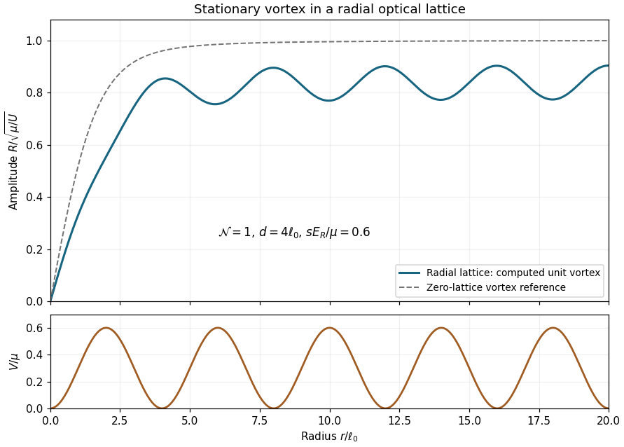

<h1 id="2/v/solution">Solution</h1>

↑ **Parent:** [V](../v.md)

A nonzero radial lattice prevents a unique universal curve without values of the depth, period, [chemical potential](../../../../../../chemical-potential.md), coupling and [winding number](../../../../../../winding-number.md). An explicit example of the requested profile is shown below for $\mathcal N=1$, repulsive coupling, $d=4\ell_0$ and $sE_R/\mu=0.6$; since $E_R/\mu=\pi^2/16$, this corresponds to $s\simeq0.973$.

**[Figure 1](#2/v/image-computed-unit-vortex-amplitude-in-a-radial-optical-lattice-with-the-lattice-potential-and-homogeneous-vortex-reference). Computed unit-vortex amplitude in a radial optical lattice, with the lattice potential and homogeneous-vortex reference**.

The plotted dimensionless amplitude is $f=R/\sqrt{\mu/U}$. The generator solves the nonlinear radial equation

$$
f''+\frac{f'}r-\frac f{r^2}+\left[1-0.6\sin^2\left(\frac{\pi r}4\right)-f^2\right]f=0
$$

by finite differences and damped Newton iteration; $r$ here is in [healing length](../../../../../../healing-length.md) units. It imposes regularity $f(0)=0$ and a zero radial derivative at $r=32$, well outside the plotted interval $0\le r\le20$. The exterior boundary is at a potential minimum, and its placement is checked by an extended-domain calculation.

The [quantum vortex](../../../../../../quantum-vortex.md) core still forces the amplitude to vanish at the origin. Farther out, amplitude minima occur near potential maxima, where repulsion and trapping reduce the local equilibrium density, and amplitude maxima occur near the low-potential annuli. [Gradient](../../../../../../gradient.md) energy smooths the modulation, so the profile does not exactly follow the local estimate $f_{\rm TF}=\sqrt{[1-V/\mu]_+}$. It approaches a periodically modulated exterior background rather than the homogeneous limit one; the dashed zero-lattice curve is included solely as a reference. At sufficiently deep lattice barriers the density troughs can become much more pronounced than in this example.

## ↑ Ancestors (11)

1. [V](../v.md)
2. [2](../../2.md)
3. [Paper 83](../../../paper-83-split.md)
4. [Iii](../../../split.md)
5. [2005](../../../../split.md)
6. [Past exam of the mathematics course of the University of Cambridge](../../../../../split.md)
7. [Mathematics course of the University of Cambridge](../../../../../../mathematics-course-of-the-university-of-cambridge.md)
8. [Course of the University of Cambridge](../../../../../../course-of-the-university-of-cambridge.md)
9. [University of Cambridge](../../../../../../university-of-cambridge-split.md)
10. [List of universities](../../../../../../list-of-universities.md)
11. [Codex Wiki](../../../../../../split.md)
