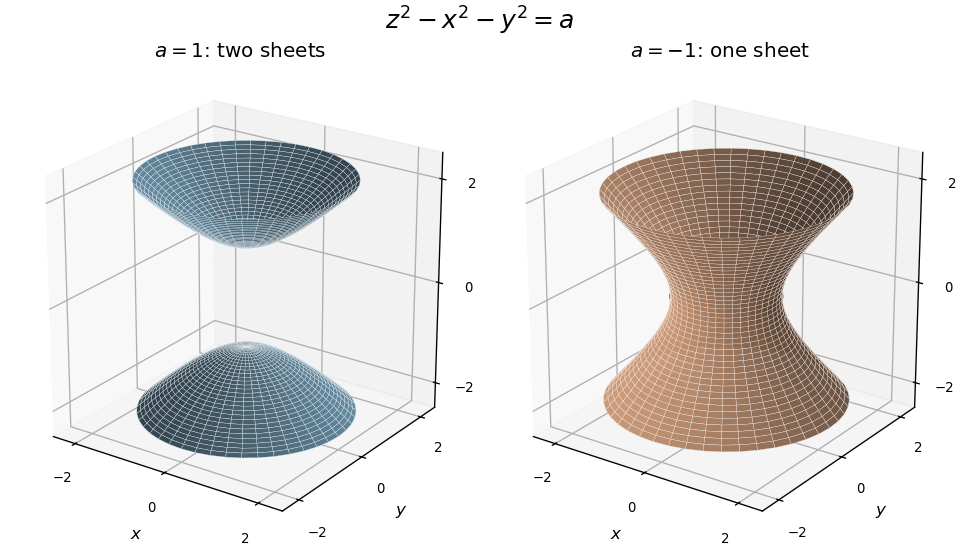

<h1 id="2a/solution">Solution</h1>

↑ **Parent:** [2A](../2a.md)

In the standard [spherical coordinate system](../../../../../spherical-coordinate-system.md), $\theta$ is measured from the positive $z$ axis. The [radial unit vector in spherical coordinates](../../../../../radial-unit-vector-in-spherical-coordinates.md) is

$$
\boxed{e_r=\sin\theta\cos\phi\,i+\sin\theta\sin\phi\,j+\cos\theta\,k.}
$$

The coordinate forms of the [elliptic paraboloid](../../../../../elliptic-paraboloid.md) are given in the labelled parts below.

For the other surface, $r^2\cos2\theta=r^2(\cos^2\theta-\sin^2\theta)$ converts to

$$
\boxed{z^2-x^2-y^2=a.}
$$

For $a>0$, this is a [two-sheeted hyperboloid](../../../../../two-sheeted-hyperboloid.md), with two disconnected sheets starting at $z=\pm\sqrt a$ and opening along the $z$ axis. For $a<0$, it is a [one-sheet hyperboloid](../../../../../one-sheet-hyperboloid.md):

$$
x^2+y^2-z^2=|a|.
$$

Its waist is the circle $z=0$, $x^2+y^2=|a|$. Both are surfaces of revolution about the $z$ axis and approach the cone $z^2=x^2+y^2$ far from the origin.

The figure shows $a=1$ and $a=-1$; scaling all coordinates by $\sqrt{|a|}$ gives the other magnitudes.

**[Figure 1](#2a/image-two-sheeted-and-one-sheet-hyperboloids-for-positive-and-negative-values-of-a). Two-sheeted and one-sheet hyperboloids for positive and negative values of a**.

## ↑ Ancestors (10)

1. [2A](../2a.md)
2. [Paper 1](../../paper-1-split.md)
3. [Ia](../../split.md)
4. [2006](../../../split.md)
5. [Past exam of the mathematics course of the University of Cambridge](../../../../split.md)
6. [Mathematics course of the University of Cambridge](../../../../../mathematics-course-of-the-university-of-cambridge.md)
7. [Course of the University of Cambridge](../../../../../course-of-the-university-of-cambridge.md)
8. [University of Cambridge](../../../../../university-of-cambridge-split.md)
9. [List of universities](../../../../../list-of-universities.md)
10. [Codex Wiki](../../../../../split.md)
