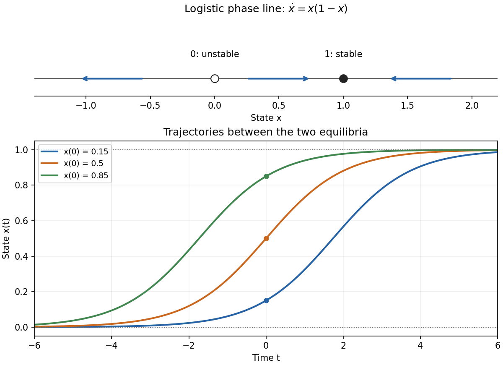

<h1 id="1b/solution">Solution</h1>

↑ **Parent:** [1B](../1b.md)

The [logistic equation](../../../../../logistic-differential-equation.md) has the constant solutions $x=0$ and $x=1$. For a nonconstant solution, [separation of variables](../../../../../separation-of-variables.md) gives

$$
\int\left(\frac1x+\frac1{1-x}\right)dx=t+C,\qquad
\log\left|\frac{x}{1-x}\right|=t+C.
$$

Solving and imposing the initial value yields

$$
\boxed{x(t)=\frac{x_0e^t}{1-x_0+x_0e^t}.}
$$

This expression also includes the two equilibria when $x_0=0$ or $1$. For other initial values it is taken on the maximal interval containing $t=0$ on which its denominator does not vanish.

The [phase portrait](../../../../../phase-portrait.md) follows from the sign of $x(1-x)$: arrows point left for $x<0$, right for $0<x<1$, and left for $x>1$. Thus zero is an unstable [equilibrium point](../../../../../equilibrium-point-of-a-dynamical-system.md) and one is asymptotically stable. The requested sketch is shown below.

**[Figure 1](#1b/image-logistic-phase-portrait-and-representative-trajectories-between-the-equilibria). Logistic phase portrait and representative trajectories between the equilibria**.

If $0<x_0<1$, the denominator is positive for every real $t$. The solution stays between the equilibria and increases monotonically, with

$$
\boxed{\lim_{t\to-\infty}x(t)=0,\qquad\lim_{t\to+\infty}x(t)=1.}
$$

More precisely $x\sim[x_0/(1-x_0)]e^t$ in the remote past and $1-x\sim[(1-x_0)/x_0]e^{-t}$ in the remote future. Outside that interval there is a finite-time pole: for $x_0<0$ it occurs in the future, and for $x_0>1$ in the past, at $t_* =\log[(x_0-1)/x_0]$. This does not affect the globally defined trajectories requested between zero and one.

## ↑ Ancestors (10)

1. [1B](../1b.md)
2. [Paper 2](../../paper-2-split.md)
3. [Ia](../../split.md)
4. [2006](../../../split.md)
5. [Past exam of the mathematics course of the University of Cambridge](../../../../split.md)
6. [Mathematics course of the University of Cambridge](../../../../../mathematics-course-of-the-university-of-cambridge.md)
7. [Course of the University of Cambridge](../../../../../course-of-the-university-of-cambridge.md)
8. [University of Cambridge](../../../../../university-of-cambridge-split.md)
9. [List of universities](../../../../../list-of-universities.md)
10. [Codex Wiki](../../../../../split.md)
