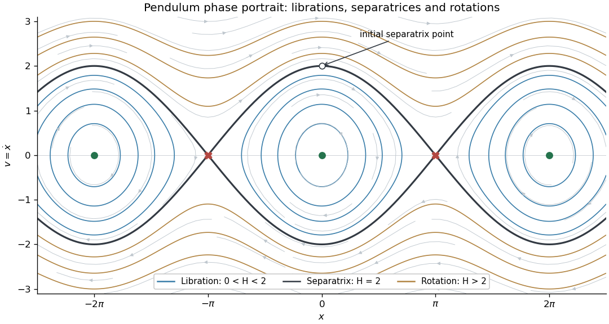

<h1 id="4c/solution">Solution</h1>

↑ **Parent:** [4C](../4c.md)

Write $v=\dot x$. The [simple pendulum](../../../../../simple-pendulum.md) becomes $\dot x=v$, $\dot v=-\sin x$. Its [equilibria](../../../../../equilibrium-point-of-a-dynamical-system.md) are $(k\pi,0)$. The [linearization](../../../../../linearization.md) is $\begin{pmatrix}0&1\\-\cos(k\pi)&0\end{pmatrix}$. For even $k$ its [eigenvalues](../../../../../eigenvalue.md) are $\pm i$, and for odd $k$ they are $\pm1$. The conserved energy

$$
H=\frac{v^2}{2}+1-\cos x
$$

has a strict local minimum at each even multiple of $\pi$, proving nonlinear [Lyapunov stability](../../../../../lyapunov-stability.md) there. The odd multiples are saddles and are unstable. Therefore

$$
\boxed{(2k\pi,0)\text{ are stable centres};\qquad((2k+1)\pi,0)\text{ are unstable saddles}.}
$$

The stable centres are not asymptotically stable because energy is conserved.

The saddle energy is $H=2$, so the [separatrix](../../../../../separatrix.md) is determined by

$$
\boxed{\frac{\dot x^2}{2}+1-\cos x=2,\qquad
\dot x=\pm2|\cos(x/2)|.}
$$

Energy levels $0<H<2$ form closed libration curves around the centres; levels $H>2$ have velocity of constant sign and describe rotations. The separatrices join neighboring saddles in the unwrapped $(x,v)$ plane. On the angle cylinder, where $x$ is identified modulo $2\pi$, they are homoclinic to the single saddle.

**[Figure 1](#4c/image-pendulum-energy-levels-stable-centres-unstable-saddles-and-the-separatrix). Pendulum energy levels, stable centres, unstable saddles and the separatrix**.

At $x=0$ the positive separatrix has $\dot x=2$. Before reaching the neighboring saddle at $x=\pi$, the velocity is $2\cos(x/2)>0$, so the time to angle $a<\pi$ is

$$
t(a)=\int_0^a\frac{dx}{2\cos(x/2)}
=\log\left(\sec(a/2)+\tan(a/2)\right).
$$

As $a\uparrow\pi$, $\cos(x/2)\sim(\pi-x)/2$. The integrand is therefore asymptotic to $1/(\pi-x)$, whose improper integral diverges logarithmically. Thus the [pendulum separatrix approach takes infinite time](../../../../../pendulum-separatrix-approach-takes-infinite-time.md):

$$
\boxed{T=\int_0^\pi\frac{dx}{2\cos(x/2)}=\infty.}
$$

Starting with velocity $-2$ gives the reflected approach to $x=-\pi$ and the same infinite time. The velocity tends to zero but never reaches zero at a finite time.

## ↑ Ancestors (10)

1. [4C](../4c.md)
2. [Paper 4](../../paper-4-split.md)
3. [Ia](../../split.md)
4. [2006](../../../split.md)
5. [Past exam of the mathematics course of the University of Cambridge](../../../../split.md)
6. [Mathematics course of the University of Cambridge](../../../../../mathematics-course-of-the-university-of-cambridge.md)
7. [Course of the University of Cambridge](../../../../../course-of-the-university-of-cambridge.md)
8. [University of Cambridge](../../../../../university-of-cambridge-split.md)
9. [List of universities](../../../../../list-of-universities.md)
10. [Codex Wiki](../../../../../split.md)
