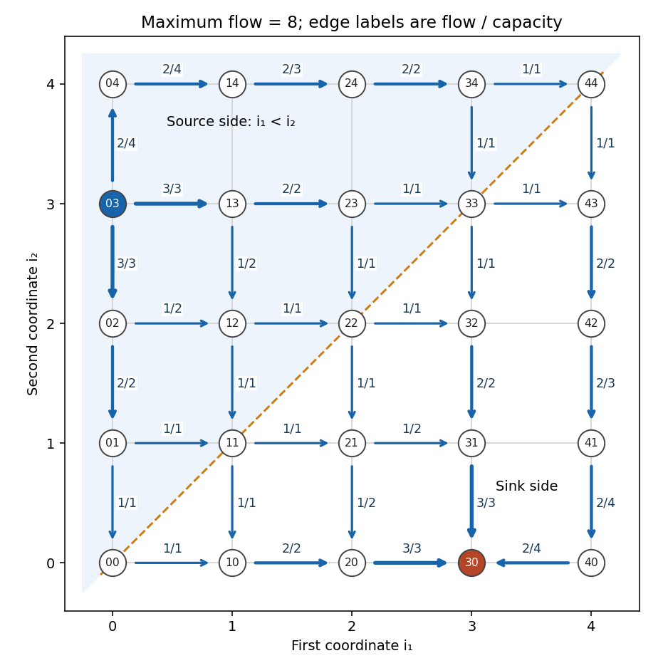

<h1 id="9c/solution">Solution</h1>

↑ **Parent:** [9C](../9c.md)

A [cut of a flow network](../../../../../cut-of-a-flow-network.md) of a directed [flow network](../../../../../flow-network.md) is a partition $(S,N\setminus S)$ with the source in $S$ and the sink outside it. Its [cut capacity](../../../../../cut-capacity.md) is $c(S)=\sum_{i\in S,j\notin S}c_{ij}$. Summing [flow conservation](../../../../../flow-conservation.md) over all vertices of $S$ cancels every internal edge and gives the flow value as outgoing flow minus incoming flow across the cut. Incoming flow is nonnegative and outgoing flow is bounded by capacity, so

$$
|f|\leq c(S)\quad\hbox{for every cut }S,\qquad\boxed{\max|f|\leq\min_Sc(S).}
$$

This is [weak duality](../../../../../weak-duality.md) for the maximum-flow problem; no converse theorem is needed for the upper bound.

For this grid, use $S=\{(i_1,i_2):i_1<i_2\}$. It contains $(0,3)$ but not $(3,0)$. An adjacent edge can leave $S$ only by reaching the diagonal. Each of the three interior diagonal vertices has two incoming crossing edges and each endpoint has one, making eight edges. Every crossing edge has capacity one. Thus the [diagonal cut in a nearest-neighbour lattice flow](../../../../../diagonal-cut-in-a-nearest-neighbour-lattice-flow.md) has capacity eight.

Here is a feasible flow of value eight. Send one unit on each of the following directed paths, and zero on every edge not used. In this list $ij$ abbreviates the vertex $(i,j)$:

$$
\begin{aligned}
&03\to02\to01\to00\to10\to20\to30,\\
&03\to02\to01\to11\to10\to20\to30,\\
&03\to02\to12\to11\to21\to20\to30,\\
&03\to13\to12\to22\to21\to31\to30,\\
&03\to13\to23\to22\to32\to31\to30,\\
&03\to13\to23\to33\to32\to31\to30,\\
&03\to04\to14\to24\to34\to33\to43\to42\to41\to40\to30,\\
&03\to04\to14\to24\to34\to44\to43\to42\to41\to40\to30.
\end{aligned}
$$

Every path conserves flow at its intermediate vertices. To check the capacities without hiding a feasibility assumption, group used edges by capacity: the capacity-one edges are traversed at most once; the capacity-two edges at most twice; the capacity-three edges at most three times; the capacity-four edges at most twice. Shared source edges $03\to02$, $03\to13$, $03\to04$ carry $3,3,2$ units, and the corresponding three sink edges carry $3,3,2$. The diagram displays every positive edge flow beside its capacity. Thus all [constraints](../../../../../constraint-mechanics.md) hold and the matching cut proves

$$
\boxed{\text{maximum flow value}=8.}
$$

**[Figure 1](#9c/image-feasible-eight-unit-grid-flow-with-edge-labels-showing-flow-over-capacity-and-the-diagonal-cut-of-capacity-eight). Feasible eight-unit grid flow with edge labels showing flow over capacity and the diagonal cut of capacity eight**.

## ↑ Ancestors (10)

1. [9C](../9c.md)
2. [Paper 2](../../paper-2-split.md)
3. [Ib](../../split.md)
4. [2006](../../../split.md)
5. [Past exam of the mathematics course of the University of Cambridge](../../../../split.md)
6. [Mathematics course of the University of Cambridge](../../../../../mathematics-course-of-the-university-of-cambridge.md)
7. [Course of the University of Cambridge](../../../../../course-of-the-university-of-cambridge.md)
8. [University of Cambridge](../../../../../university-of-cambridge-split.md)
9. [List of universities](../../../../../list-of-universities.md)
10. [Codex Wiki](../../../../../split.md)
