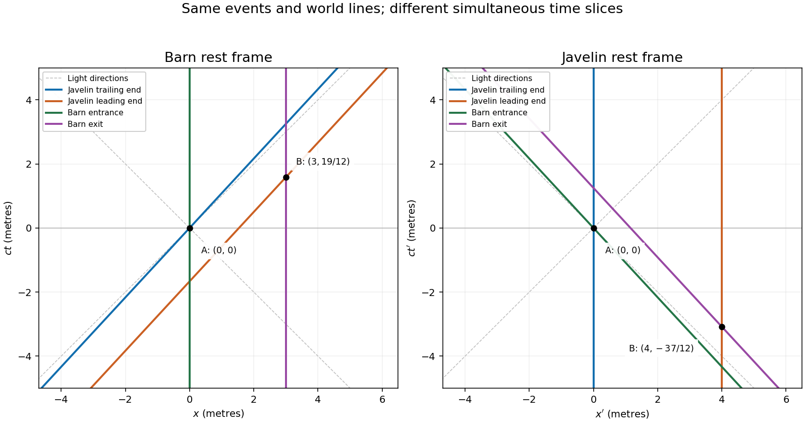

<h1 id="17b/c/solution">Solution</h1>

↑ **Parent:** [C](../c.md)

Choose the barn entrance as $x=0$, its exit as $x=3$, and the positive $x$ direction as the javelin's motion. Put $t=0$ at the trailing end entering the barn. Write $s=ct$ and $s'=ct'$ in metres. In the javelin frame let the trailing end have $x'=0$, the leading end $x'=4$, and use the same origin event. The [Lorentz transformation](../../../../../../lorentz-transformation.md) is

$$
\boxed{s'=\gamma(s-\beta x),\qquad x'=\gamma(x-\beta s),\quad\beta=12/13,\quad\gamma=13/5.}
$$

In the barn frame, the four [world lines](../../../../../../world-line.md) are

$$
x_{\rm entrance}=0,\qquad x_{\rm exit}=3,\qquad
x_{\rm trailing}=\frac{12}{13}s,\qquad x_{\rm leading}=\frac{12}{13}s+\frac{20}{13}.
$$

In the javelin frame they are

$$
x'_{\rm trailing}=0,\qquad x'_{\rm leading}=4,\qquad
x'_{\rm entrance}=-\frac{12}{13}s',\qquad x'_{\rm exit}=\frac{15}{13}-\frac{12}{13}s'.
$$

The two [spacetime diagrams](../../../../../../spacetime-diagram.md) below use vertical time coordinates and horizontal spatial coordinates. Event labels refer to the same physical events in both panels; dashed lines show light-ray directions.

**[Figure 1](#17b/c/image-javelin-and-barn-world-lines-in-the-barn-and-javelin-rest-frames-with-entry-event-a-and-exit-event-b). Javelin and barn world lines in the barn and javelin rest frames, with entry event A and exit event B**.

## ↑ Ancestors (11)

1. [C](../c.md)
2. [17B](../../17b.md)
3. [Paper 4](../../../paper-4-split.md)
4. [Ib](../../../split.md)
5. [2006](../../../../split.md)
6. [Past exam of the mathematics course of the University of Cambridge](../../../../../split.md)
7. [Mathematics course of the University of Cambridge](../../../../../../mathematics-course-of-the-university-of-cambridge.md)
8. [Course of the University of Cambridge](../../../../../../course-of-the-university-of-cambridge.md)
9. [University of Cambridge](../../../../../../university-of-cambridge-split.md)
10. [List of universities](../../../../../../list-of-universities.md)
11. [Codex Wiki](../../../../../../split.md)
