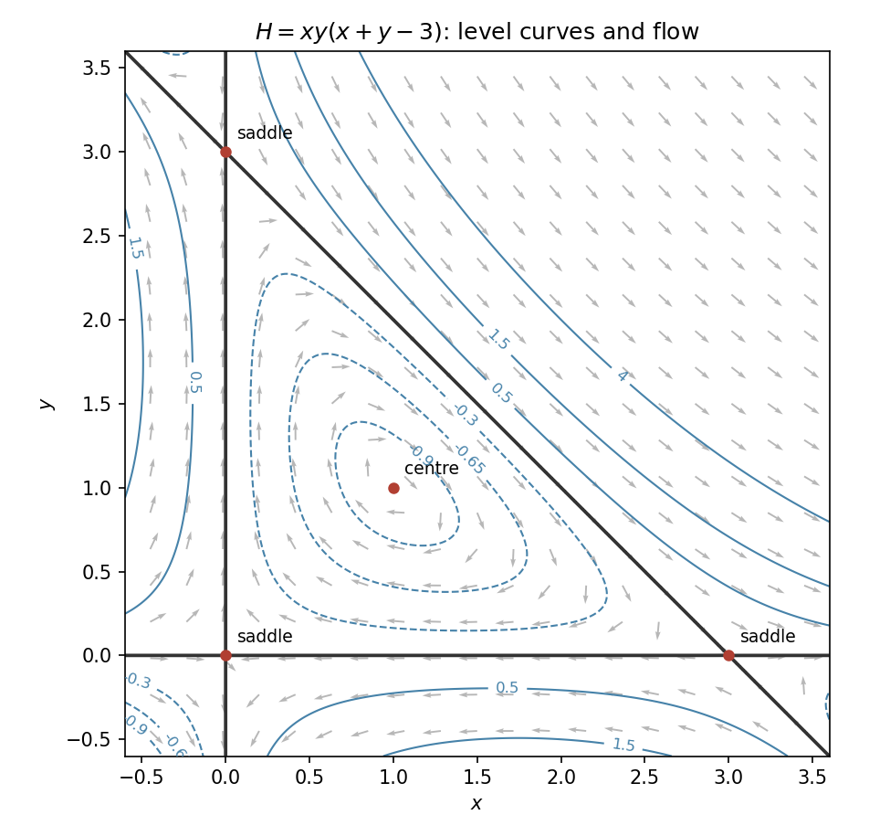
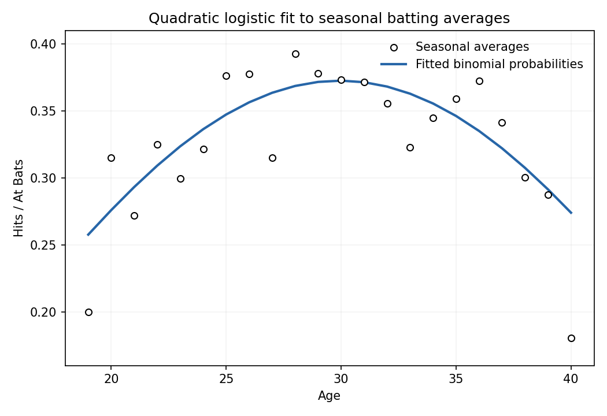

# Paper 1

↑ **Parent:** [Ii](../ii.md)

[https://www.maths.cam.ac.uk/undergrad/pastpapers/files/2006/PaperII_1.pdf](https://www.maths.cam.ac.uk/undergrad/pastpapers/files/2006/PaperII_1.pdf)

**Table of contents**

- [1H](#1h)
  - [Solution](#1h/solution)
- [2G](#2g)
  - [Solution](#2g/solution)
- [3F](#3f)
  - [Solution](#3f/solution)
- [4G](#4g)
  - [Solution](#4g/solution)
- [5I](#5i)
  - [Solution](#5i/solution)
- [6B](#6b)
  - [Solution](#6b/solution)
- [7E](#7e)
  - [Solution](#7e/solution)
- [8E](#8e)
  - [Solution](#8e/solution)
- [9C](#9c)
  - [Solution](#9c/solution)
- [10D](#10d)
  - [a](#10d/a)
    - [Solution](#10d/a/solution)
  - [b](#10d/b)
    - [Solution](#10d/b/solution)
- [11G](#11g)
  - [Solution](#11g/solution)
  - [i](#11g/i)
    - [Solution](#11g/i/solution)
  - [ii](#11g/ii)
    - [Solution](#11g/ii/solution)
- [12F](#12f)
  - [Solution](#12f/solution)
- [13I](#13i)
  - [Solution](#13i/solution)
- [14E](#14e)
  - [a](#14e/a)
    - [Solution](#14e/a/solution)
  - [b](#14e/b)
    - [Solution](#14e/b/solution)
- [15C](#15c)
  - [a](#15c/a)
    - [Solution](#15c/a/solution)
  - [b](#15c/b)
    - [Solution](#15c/b/solution)
  - [c](#15c/c)
    - [Solution](#15c/c/solution)
- [16H](#16h)
  - [Solution](#16h/solution)
- [17F](#17f)
  - [Solution](#17f/solution)
- [18H](#18h)
  - [Solution](#18h/solution)
- [19F](#19f)
  - [a](#19f/a)
    - [Solution](#19f/a/solution)
  - [b](#19f/b)
    - [i](#19f/b/i)
      - [Solution](#19f/b/i/solution)
    - [ii](#19f/b/ii)
      - [Solution](#19f/b/ii/solution)
    - [iii](#19f/b/iii)
      - [Solution](#19f/b/iii/solution)
- [20G](#20g)
  - [Solution](#20g/solution)
- [21H](#21h)
  - [Solution](#21h/solution)
- [22G](#22g)
  - [Solution](#22g/solution)
- [23F](#23f)
  - [Solution](#23f/solution)
- [24H](#24h)
  - [a](#24h/a)
    - [Solution](#24h/a/solution)
  - [b](#24h/b)
    - [Solution](#24h/b/solution)
  - [c](#24h/c)
    - [Solution](#24h/c/solution)
- [25J](#25j)
  - [a](#25j/a)
    - [Solution](#25j/a/solution)
  - [b](#25j/b)
    - [Solution](#25j/b/solution)
  - [c](#25j/c)
    - [Solution](#25j/c/solution)
  - [d](#25j/d)
    - [Solution](#25j/d/solution)
- [26J](#26j)
  - [a](#26j/a)
    - [Solution](#26j/a/solution)
  - [b](#26j/b)
    - [Solution](#26j/b/solution)
- [27J](#27j)
  - [a](#27j/a)
    - [Solution](#27j/a/solution)
  - [b](#27j/b)
    - [Solution](#27j/b/solution)
  - [c](#27j/c)
    - [Solution](#27j/c/solution)
- [28I](#28i)
  - [Solution](#28i/solution)
  - [a](#28i/a)
    - [Solution](#28i/a/solution)
  - [b](#28i/b)
    - [Solution](#28i/b/solution)
  - [c](#28i/c)
    - [Solution](#28i/c/solution)
- [29A](#29a)
  - [a](#29a/a)
    - [Solution](#29a/a/solution)
  - [b](#29a/b)
    - [Solution](#29a/b/solution)
  - [c](#29a/c)
    - [Solution](#29a/c/solution)
- [30B](#30b)
  - [Solution](#30b/solution)
- [31E](#31e)
  - [a](#31e/a)
    - [Solution](#31e/a/solution)
  - [b](#31e/b)
    - [Solution](#31e/b/solution)
  - [c](#31e/c)
    - [Solution](#31e/c/solution)
- [32D](#32d)
  - [Solution](#32d/solution)
- [33A](#33a)
  - [Solution](#33a/solution)
- [34E](#34e)
  - [Solution](#34e/solution)
- [35A](#35a)
  - [Solution](#35a/solution)
- [36B](#36b)
  - [Solution](#36b/solution)
- [37C](#37c)
  - [Solution](#37c/solution)
- [38C](#38c)
  - [a](#38c/a)
    - [Solution](#38c/a/solution)
  - [b](#38c/b)
    - [Solution](#38c/b/solution)
  - [c](#38c/c)
    - [Solution](#38c/c/solution)

## 1H

↑ **Parent:** [Paper 1](paper-1.md)

<h3 id="1h/solution">Solution</h3>

↑ **Parent:** [1H](#1h)

For every odd [prime](../../../number-theory.md#prime-number) $p$ and $n\geq1$, the [group of units modulo an integer](../../../algebra.md#multiplicative-group-of-integers-modulo-n) $(\mathbb Z/p^n\mathbb Z)^\times$ is a [cyclic group](../../../group.md#cyclic-group), of order $\varphi(p^n)=p^{n-1}(p-1)$; a generator is a [primitive root](../../../number-theory.md#primitive-root-modulo-n).

Modulo seven, $3,3^2,\ldots,3^6$ are $3,2,6,4,5,1$, so three has order six. Moreover $3^6-1=728=7\cdot104$ is divisible by seven exactly once. We prove the lifting needed here. If $u=1+7^r v$ with $r\geq1$ and $7\nmid v$, the binomial expansion gives $u^7=1+7^{r+1}v+O(7^{r+2})$, so $v_7(u^7-1)=r+1$. Induction therefore gives

$$
v_7(3^{6\cdot7^j}-1)=j+1.
$$

Any exponent giving one modulo $7^n$ is divisible by six. The order also divides $6\cdot7^{n-1}$ by [Lagrange theorem](../../../group-theory.md#lagrange-s-theorem), while the displayed valuation rules out each proper divisor of this form. Consequently **three is a [primitive root](../../../number-theory.md#primitive-root-modulo-n) modulo every $7^n$**.

Since $2^3=1\pmod7$ and two is not one, its order modulo seven is three. A generator modulo $7^n$ would reduce to a generator modulo seven, because reduction is a surjective [group homomorphism](../../../group-theory.md#group-homomorphism). Thus **two is never a [primitive root](../../../number-theory.md#primitive-root-modulo-n) modulo $7^n$**. Finally every unit modulo eight is odd, and $(2k+1)^2=1+4k(k+1)\equiv1\pmod8$. All unit orders are at most two, whereas the unit group has four elements. **There is no [primitive root](../../../number-theory.md#primitive-root-modulo-n) modulo eight.**

## 2G

↑ **Parent:** [Paper 1](paper-1.md)

<h3 id="2g/solution">Solution</h3>

↑ **Parent:** [2G](#2g)

The [Brouwer fixed-point theorem](../../../topological-analysis.md#brouwer-fixed-point-theorem) says that every [continuous map](../../../topology.md#continuous-map) from a closed Euclidean ball to itself has a [fixed point](../../../function.md#fixed-point). For the closed disc $D\subset\mathbb R^2$ its equivalent [no-retraction theorem](../../../topological-analysis.md#no-retraction-theorem) says that there is no continuous $r:D\to\partial D$ satisfying $r(z)=z$ on $\partial D$.

Assume the fixed-point theorem and suppose such a [retraction](../../../topology.md#retraction) exists. Then $F(x)=-r(x)$ maps $D$ continuously into itself. A [fixed point](../../../function.md#fixed-point) must lie on the boundary, where $r(x)=x$, giving $x=-x$, impossible on the unit circle.

Conversely suppose $F:D\to D$ is continuous and has no [fixed point](../../../function.md#fixed-point). From $F(x)$ draw the ray through $x$ and let $r(x)$ be its exit point on the circle. To check [continuity](../../../calculus.md#continuous-function) rather than merely relying on the picture, put $v=x-F(x)\ne0$. The exit point is $F(x)+t(x)v$, where

$$
t(x)=\frac{-F(x)\cdot v+\sqrt{(F(x)\cdot v)^2+(1-|F(x)|^2)|v|^2}}{|v|^2}.
$$

This is continuous, lies on the circle and has $t(x)\geq1$. On the boundary the exit point is $x$, so $r$ is a [retraction](../../../topology.md#retraction), contradicting the assumed theorem. Hence **the two disc formulations are equivalent**; the same argument works for a ball in any dimension.

## 3F

↑ **Parent:** [Paper 1](paper-1.md)

<h3 id="3f/solution">Solution</h3>

↑ **Parent:** [3F](#3f)

Under the [open set condition](../../../geometry-and-topology.md#open-set-condition) there is a nonempty bounded [open set](../../../topology.md#open-set) $O$ such that the sets $S_i(O)$ are pairwise disjoint and all contained in $O$. The [Hausdorff dimension](../../../measure-theory.md#hausdorff-dimension) of the nonempty [compact](../../../topology.md#compact-space) [invariant set](../../../measure-theory.md#invariant-set-of-a-measure-preserving-transformation) is the unique $s\geq0$ satisfying

$$
\boxed{\sum_{i=1}^k c_i^s=1.}
$$

For the carpet here the 24 retained sub-squares give [Euclidean similarities](../../../geometry-and-topology.md#euclidean-similarity) $S_{ij}(x,y)=((x+i)/5,(y+j)/5)$ for $0\leq i,j\leq4$, $(i,j)\ne(2,2)$. Their images of $O=(0,1)^2$ are disjoint and lie in $O$, so the condition holds even though some closed images share boundary points. All contraction factors are $1/5$. Thus

$$
\boxed{\dim_H X=\frac{\log24}{\log5}\approx1.97464.}
$$

## 4G

↑ **Parent:** [Paper 1](paper-1.md)

<h3 id="4g/solution">Solution</h3>

↑ **Parent:** [4G](#4g)

A binary [linear-feedback shift register](../../../coding-theory.md#linear-feedback-shift-register) of length $L$ keeps $L$ bits and produces a sequence satisfying a recurrence

$$
s_n+c_1s_{n-1}+\cdots+c_Ls_{n-L}=0\quad\text{in }\mathbb F_2.
$$

After each output it shifts its stored bits and inserts the feedback bit. Its connection polynomial is $C(z)=1+c_1z+\cdots+c_Lz^L$. This convention reverses the usual [characteristic polynomial](../../../linear-operator-theory.md#characteristic-polynomial) $z^L+c_1z^{L-1}+\cdots+c_L$.

The [Berlekamp-Massey algorithm](../../../coding-theory.md#berlekamp-massey-algorithm) recovers the shortest recurrence compatible with observed bits. Maintain the current $C$, length $L$, an earlier polynomial $B$ that last caused a length increase, and the offset $m$ since that increase. Initially $C=B=1,L=0,m=1$. At position $n$ calculate the discrepancy $d=s_n+\sum_{j=1}^Lc_js_{n-j}$. If $d=0$, advance $m$. If $d=1$, save $T=C$ and replace $C$ by $C+z^mB$. If also $2L\leq n$, replace $L$ by $n+1-L$, $B$ by $T$ and $m$ by one; otherwise increase $m$. Over a general field the correction is $(d/b)z^mB$, where $b$ is the saved nonzero discrepancy. The correction cancels the failed equation while retaining the previous successful ones; when it forces a length increase the smallest possible new length is $n+1-L$.

Here, indexing the first bit by zero, the nonzero discrepancies occur at positions $1,4,6$. The corresponding updates are

$$
(C,L)=(1+z^2,2),\quad(1+z^2+z^3,3),\quad(1+z^3+z^4,4).
$$

Every subsequent supplied discrepancy is zero. Thus

$$
\boxed{C(z)=1+z^3+z^4,\qquad s_n=s_{n-3}+s_{n-4}.}
$$

Equivalently the characteristic [feedback polynomial](../../../coding-theory.md#feedback-polynomial) is $z^4+z+1$. No length-three recurrence works: positions $3,4,5$ force $c_2=1,c_1=0,c_3=1$, but position six then has nonzero discrepancy. The recovered length is therefore minimal. Observing at least twice the true linear complexity ordinarily identifies the recurrence, after which a known consecutive block determines all future key bits. This is why a bare register is unsuitable as a cryptographic keystream generator; a finite prefix alone does not exclude a longer generator that later diverges.

## 5I

↑ **Parent:** [Paper 1](paper-1.md)

<h3 id="5i/solution">Solution</h3>

↑ **Parent:** [5I](#5i)

Put $\widehat\beta=(X^TX)^{-1}X^TY$, $\widehat\sigma^2=\|Y-X\widehat\beta\|^2/(n-p)$. Orthogonal projections of the Gaussian error give independent variables

$$
\frac{(\widehat\beta-\beta)^TX^TX(\widehat\beta-\beta)}{\sigma^2}\sim\chi_p^2,\qquad\frac{(n-p)\widehat\sigma^2}{\sigma^2}\sim\chi_{n-p}^2.
$$

Hence the exact $(1-\alpha)$ [confidence set](../../../statistical-inference.md#confidence-region) is the ellipsoid

$$
\boxed{\left\{b:\frac{(b-\widehat\beta)^TX^TX(b-\widehat\beta)}{p\widehat\sigma^2}\leq F_{p,n-p}(1-\alpha)\right\}.}
$$

Here $F_{p,n-p}(q)$ denotes the $q$ quantile of the [F-distribution](../../../continuous-probability-distribution.md#f-distribution).

Let $\widehat\beta_{(-i)}$ be the fit with observation $i$ removed, when that reduced design retains full rank. [Cook's distance](../../../statistical-modelling.md#cook-s-distance) is

$$
D_i=\frac{(\widehat\beta_{(-i)}-\widehat\beta)^TX^TX(\widehat\beta_{(-i)}-\widehat\beta)}{p\widehat\sigma^2}
=\frac{e_i^2}{p\widehat\sigma^2}\frac{h_{ii}}{(1-h_{ii})^2},
$$

where $e_i$ is its residual and $h_{ii}=x_i^T(X^TX)^{-1}x_i$ is its [leverage](../../../statistical-modelling.md#regression-leverage). Thus $D_i$ measures the deleted estimate's distance from the full estimate in exactly the metric of the confidence ellipsoids. The deleted estimate lies on the confidence contour whose $F$ quantile equals $D_i$; this is a geometric influence diagnostic, not an assertion that $D_i$ itself has an $F$ law.

For $p=2,n=50$, $0.70<1.3<2.42$, so deletion moves the estimate outside the 50% [confidence ellipsoid](../../../statistical-inference.md#confidence-ellipsoid) but inside the 90% one. **The observation warrants investigation for influence**: the shift is substantial, though the supplied figures do not justify calling it outside the 90% region. The reciprocal $F_{48,2}$ and the approximate chi-square figures are unnecessary.

## 6B

↑ **Parent:** [Paper 1](paper-1.md)

<h3 id="6b/solution">Solution</h3>

↑ **Parent:** [6B](#6b)

The [probability generating function](../../../probability-theory.md#probability-generating-function) encodes the population distribution in one analytic function. Its coefficients and [derivative](../../../calculus.md#derivative) recover

$$
P(n,t)=\frac1{n!}\partial_s^n\phi(0,t),\qquad\langle n\rangle=\partial_s\phi(1,t),
$$

provided the mean is finite. Higher [derivatives](../../../calculus.md#derivative) at one give [factorial moments](../../../markov-process.md#factorial-moment), and normalization says $\phi(1,t)=1$.

Interpret the supplied birth and death expressions as [transition rates](../../../survival-analysis.md#transition-intensity): over a small time $dt$ their [probabilities](../../../probability-theory.md#probability) are $(\alpha+\beta n)dt+o(dt)$ and $\gamma n\,dt+o(dt)$. Incoming [probability](../../../probability-theory.md#probability) from $n-1$ and $n+1$, minus both outgoing rates, gives

$$
\partial_tP(n,t)=(\alpha+\beta(n-1))P(n-1,t)+\gamma(n+1)P(n+1,t)-[\alpha+(\beta+\gamma)n]P(n,t),
$$

with $P(-1,t)=0$. Multiplying by $s^n$ and summing yields

$$
\boxed{\phi_t=\alpha(s-1)\phi+(s-1)(\beta s-\gamma)\phi_s.}
$$

At stationarity, $\phi_s/\phi=\alpha/(\gamma-\beta s)$, so [integration](../../../calculus.md#integral) and normalization give

$$
\boxed{\phi(s)=\left(\frac{\gamma-\beta}{\gamma-\beta s}\right)^{\alpha/\beta},\qquad\langle n\rangle=\frac{\alpha}{\gamma-\beta}.}
$$

Alternatively differentiating the evolution equation at one gives $m'=\alpha-(\gamma-\beta)m$, so $m(t)=\alpha/(\gamma-\beta)+[m(0)-\alpha/(\gamma-\beta)]e^{-(\gamma-\beta)t}$. If $\beta=0$, the displayed power expression is understood in its limit: $\phi(s)=e^{(\alpha/\gamma)(s-1)}$, a [Poisson distribution](../../../discrete-probability-distribution.md#poisson-distribution) with mean $\alpha/\gamma$.

## 7E

↑ **Parent:** [Paper 1](paper-1.md)

<h3 id="7e/solution">Solution</h3>

↑ **Parent:** [7E](#7e)

Solving the two factors in each equation gives **$(0,0),(3,0),(0,3),(1,1)$**. The Jacobian is

$$
Df=\begin{pmatrix}2x+2y-3&2x\\-2y&3-2x-2y\end{pmatrix}.
$$

At the three boundary equilibria its [eigenvalues](../../../linear-operator-theory.md#eigenvalue) are $3,-3$. These equilibria are [hyperbolic fixed points](../../../dynamical-systems.md#hyperbolic-equilibrium-point); the [Hartman-Grobman theorem](../../../dynamical-systems.md#hartman-grobman-theorem) gives local topological conjugacy to their saddle [linearizations](../../../algebra.md#linearization). At $(1,1)$ the [matrix](../../../vector-space.md#matrix) is $\left(\begin{smallmatrix}1&2\\-2&-1\end{smallmatrix}\right)$, with [eigenvalues](../../../linear-operator-theory.md#eigenvalue) $\pm i\sqrt3$. The [linearization](../../../algebra.md#linearization) is a centre, but the hyperbolic theorem does not apply there.

The nonlinear classification follows from the actual [Hamiltonian](../../../classical-mechanics.md#hamiltonian)

$$
\boxed{H(x,y)=xy(x+y-3),\qquad\dot x=H_y,\quad\dot y=-H_x.}
$$

Along solutions $\dot H=H_xH_y-H_yH_x=0$. At $(1,1)$, $H=-1$ and its [Hessian](../../../calculus.md#hessian-matrix) is $\left(\begin{smallmatrix}2&1\\1&2\end{smallmatrix}\right)$, which is positive definite. Nearby regular level curves are closed ovals around this strict minimum. Their vector field is nonzero and tangent, so each is a [periodic orbit](../../../dynamical-systems.md#periodic-orbit). **The nonlinear equilibrium is a centre**.

The [separatrix](../../../dynamical-systems.md#separatrix) level $H=0$ consists of $x=0$, $y=0$, and $x+y=3$. Within the triangle they connect the saddles as $(3,0)\to(0,0)\to(0,3)\to(3,0)$. The interior levels $-1<H<0$ are nested clockwise [periodic orbits](../../../dynamical-systems.md#periodic-orbit); outside the triangle the remaining level branches are unbounded. On $y=0$, flow is left for $0<x<3$ and right for $x<0$ or $x>3$; on $x=0$, it is up for $0<y<3$ and down otherwise. These directions and the invariant levels determine the full [phase portrait](../../../dynamical-systems.md#phase-portrait).

**[Figure 1](#7e/image-hamiltonian-level-curves-and-flow-around-the-three-saddles-and-centre). Hamiltonian level curves and flow around the three saddles and centre**.

## 8E

↑ **Parent:** [Paper 1](paper-1.md)

<h3 id="8e/solution">Solution</h3>

↑ **Parent:** [8E](#8e)

Use the one-sided [Laplace transform](../../../analysis.md#laplace-transform) $F(s)=\int_0^\infty e^{-st}f(t)\,dt$. Since $f=0$ on $[0,1)$, substitution gives $\mathcal L[f(t+1)](s)=e^sF(s)$. Thus

$$
F(s)=\frac1{s(e^s-1/2)}=\frac{2e^{-s}}{s(1-e^{-s}/2)}.
$$

Its [poles](../../../isolated-singularity.md#pole) are $s=0$ and $s_n=-\log2+2\pi in$, with [residues](../../../analysis.md#residue) of $e^{st}F(s)$ respectively two and $2e^{s_nt}/s_n$. For $t>1$ close the [Bromwich inversion formula](../../../analysis.md#bromwich-inversion-formula) to the left, using horizontal heights avoiding those [poles](../../../isolated-singularity.md#pole). The left-side integrand decays like $e^{st}/s$, and on the right-side horizontal ends like $e^{s(t-1)}/s$, so the added integrals vanish with the usual symmetric limiting contour. The [residue theorem](../../../analysis.md#residue-theorem) gives

$$
\boxed{f(t)=2+2^{1-t}\sum_{n=-\infty}^{\infty}\frac{e^{2\pi int}}{2\pi in-\log2}\quad(t\geq1),}
$$

where the series is summed symmetrically and at jumps has the midpoint value.

For $t<1$ the vanishing can be checked directly in the inversion integral, rather than inferred from the recurrence. On any vertical line $\Re s=c>0$ expand the denominator geometrically, uniformly there:

$$
F(s)=2\sum_{j=0}^\infty2^{-j}\frac{e^{-(j+1)s}}s.
$$

Each inversion term is $2^{1-j}(2\pi i)^{-1}\int_{c-i\infty}^{c+i\infty}e^{s(t-j-1)}ds/s$. If $t<1$, close this contour to the right: the exponential decays, and the [pole](../../../isolated-singularity.md#pole) at zero is outside, so every term is zero. Equivalently the geometric expansion bounds the full closing contour by the same decaying factors. Thus **$f(t)=0$ for $t<1$**.

The same integral gives $f(t)=2\sum_{j\geq0}2^{-j}H(t-j-1)$ elsewhere. For $m<t<m+1$ with [integer](../../../number-theory.md#integer) $m\geq1$, this is $4(1-2^{-m})$, which directly verifies the difference equation. Neither a [Laplace transform](../../../analysis.md#laplace-transform) nor a Fourier series determines values at isolated jumps; the printed series fixes the standard convention $H(0)=1/2$, including $f(1)=1$.

## 9C

↑ **Parent:** [Paper 1](paper-1.md)

<h3 id="9c/solution">Solution</h3>

↑ **Parent:** [9C](#9c)

Let $M_{ij}=\partial y_i/\partial x_j$ be the Jacobian of an invertible change of phase coordinates, and set $K(y,t)=H(x(y),t)$. The [chain rule](../../../calculus.md#chain-rule) gives $\nabla_xH=M^T\nabla_yK$, whence

$$
\dot y=MJM^T\nabla_yK.
$$

Therefore the necessary and sufficient condition to retain [Hamilton's equations](../../../classical-mechanics.md#hamilton-s-equations) for arbitrary Hamiltonians is

$$
\boxed{MJM^T=J,}
$$

equivalently $M^TJM=J$. In one degree of freedom this is the [Poisson bracket](../../../classical-mechanics.md#poisson-bracket) condition $\{Q,P\}=Q_qP_p-Q_pP_q=1$.

Put $D=p^2+\alpha^2q^2$. On a smooth branch of the angular coordinate,

$$
Q_q=\frac{\alpha p}{D},\quad Q_p=-\frac{\alpha q}{D},\quad P_q=\alpha q,\quad P_p=p/\alpha.
$$

Consequently $Q_qP_p-Q_pP_q=(p^2+\alpha^2q^2)/D=1$. **The transformation is canonical for every real $\alpha\ne0$ on each angular-coordinate chart.** The origin is excluded and a single-valued arctangent cannot give a global chart on the punctured plane; using an angle modulo $2\pi$ accounts for the usual branch qualification.

## 10D

↑ **Parent:** [Paper 1](paper-1.md)

<h3 id="10d/a">a</h3>

↑ **Parent:** [10D](#10d)

<h4 id="10d/a/solution">Solution</h4>

↑ **Parent:** [A](#10d/a)

A [comoving coordinate](../../../cosmology.md#comoving-coordinate) $\boldsymbol\chi$ labels a galaxy carried by the homogeneous cosmological flow. Its physical separation at time $t$ is $\mathbf r(t)=a(t)\boldsymbol\chi$, where $a$ is the [scale factor](../../../cosmology.md#scale-factor-cosmology). Thus $\mathbf v=\dot a\boldsymbol\chi=(\dot a/a)\mathbf r$, the [Hubble law](../../../cosmology.md#hubble-s-law), apart from peculiar [velocities](../../../classical-mechanics.md#velocity) relative to this flow. In particular

$$
\boxed{H_0=\frac{\dot a(t_0)}{a(t_0)}.}
$$

<h3 id="10d/b">b</h3>

↑ **Parent:** [10D](#10d)

<h4 id="10d/b/solution">Solution</h4>

↑ **Parent:** [B](#10d/b)

Assume the present universe is expanding, $\dot a(t_0)>0$. The stated energy inequality and the [Raychaudhuri equation](../../../cosmology.md#friedmann-acceleration-equation) imply $\ddot a\leq0$ wherever $a>0$. Therefore for $t<t_0$ in that positive branch, $\dot a(t)\geq\dot a(t_0)$, and

$$
a(t_0)-a(t)=\int_t^{t_0}\dot a(s)\,ds\geq(t_0-t)\dot a(t_0).
$$

Nonnegativity of $a(t)$ forces $t_0-t\leq a(t_0)/\dot a(t_0)=H_0^{-1}$. If the solution remains valid towards the past, its positive branch must thus end in $a=0$ within that time; a positive [scale factor](../../../cosmology.md#scale-factor-cosmology) extending further would contradict the inequality. Hence

$$
\boxed{t_0-t_i\leq H_0^{-1}.}
$$

This argument presumes an expanding branch and the stated energy condition throughout it, rather than proving either assumption.

There are two relevant failures of the naive numerical bound. The supplied ten-billion-year [Hubble time](../../../cosmology.md#hubble-time) is an approximate observational input: a smaller inferred present expansion rate gives a larger [Hubble time](../../../cosmology.md#hubble-time), and comparison with stellar ages must include these uncertainties. More decisively, a positive [cosmological constant](../../../cosmology.md#cosmological-constant), or other [dark energy](../../../cosmology.md#dark-energy) with sufficiently negative [pressure](../../../thermodynamics.md#pressure), has $\rho+3P/c^2<0$ and permits accelerated expansion, so the concavity assumption fails. Observations of acceleration therefore remove this particular upper-bound argument. This is a discussion of the supplied historical estimate, not an assertion that its numerical value is a current measurement.

## 11G

↑ **Parent:** [Paper 1](paper-1.md)

<h3 id="11g/solution">Solution</h3>

↑ **Parent:** [11G](#11g)

Parametrize the circle by $z=e^{it}$, $0\leq t\leq2\pi$. Choose a continuous argument $\vartheta(t)$ of $\phi(e^{it})$, so $\phi(e^{it})=|\phi(e^{it})|e^{i\vartheta(t)}$. Its [winding number](../../../complex-analysis.md#winding-number) about zero is

$$
w(\phi)=\frac{\vartheta(2\pi)-\vartheta(0)}{2\pi}\in\mathbb Z.
$$

The two facts proved below determine the requested calculation without needing differentiability or contour [integration](../../../calculus.md#integral). Put $P(z)=(3z-2)(z-3)(2z+1)$. On $|z|=1$, $|P(z)|\geq1\cdot2\cdot1=2$, so adding one does not change its winding. The first and third factors have winding one, since their constant terms have modulus smaller than their linear terms; the second has winding zero, since its $z$ term has modulus smaller than its constant term. Nonzero constants have winding zero and $z$ has winding one. Thus

$$
\boxed{w(\phi)=1+0+1=2.}
$$

<h3 id="11g/i">i</h3>

↑ **Parent:** [11G](#11g)

<h4 id="11g/i/solution">Solution</h4>

↑ **Parent:** [I](#11g/i)

Choose continuous arguments $\vartheta_1,\vartheta_2$ along the parametrized circle. Their sum is a continuous argument of the product, because multiplication multiplies moduli and adds arguments. Subtracting endpoint values gives

$$
\boxed{w(\phi_1\phi_2)=w(\phi_1)+w(\phi_2).}
$$

<h3 id="11g/ii">ii</h3>

↑ **Parent:** [11G](#11g)

<h4 id="11g/ii/solution">Solution</h4>

↑ **Parent:** [Ii](#11g/ii)

Factor $\phi+\psi=\phi(1+\psi/\phi)$. The second factor has positive real part, since $|\psi/\phi|<1$. It therefore has the continuous single-valued argument $\arctan(\Im(1+\psi/\phi)/\Re(1+\psi/\phi))$ taking values in $(-\pi/2,\pi/2)$. Its values agree at the two ends of the parametrized circle, so its [winding number](../../../complex-analysis.md#winding-number) is zero. Part (i) gives

$$
\boxed{w(\phi+\psi)=w(\phi).}
$$

## 12F

↑ **Parent:** [Paper 1](paper-1.md)

<h3 id="12f/solution">Solution</h3>

↑ **Parent:** [12F](#12f)

In curvature-minus-one polar coordinates the [hyperbolic metric](../../../geometry-and-topology.md#hyperbolic-metric) is $ds^2=dr^2+\sinh^2r\,d\theta^2$. Thus the area element is $\sinh r\,dr\,d\theta$, giving

$$
\boxed{\operatorname{Area}B(r)=2\pi(\cosh r-1)=4\pi\sinh^2(r/2).}
$$

It is asymptotic to $\pi e^r$.

For a usual locally finite [tessellation](../../../geometry-and-topology.md#tessellation) with [compact](../../../topology.md#compact-space) congruent tiles of nonempty interior, let their diameter be at most $D$ and choose in each a congruently placed interior ball of radius $r_0>0$. These balls have disjoint interiors. The number of tiles meeting a [geodesic](../../../riemannian-geometry.md#geodesic) segment of length one is uniformly bounded: their ball centres lie in a ball of radius $D+1$, and the disjoint $r_0$-balls lie in the larger ball of radius $D+1+r_0$. Comparing areas supplies a constant $K$. A path of length $R$, divided into at most $\lceil R\rceil$ such segments, therefore crosses at most $K(\lceil R\rceil+1)$ tiles. A small generic perturbation avoids vertices if steps are defined by crossing sides.

Consequently the union of tiles at most $n$ steps from the initial tile contains a metric ball of radius $c n-C$ for fixed $c>0,C$. If $A$ is tile area, their number $N(n)$ is at least $\operatorname{Area}B(cn-C)/A$, an exponential lower bound. Conversely any chain of $n$ adjacent tiles lies in $B(D(n+1))$ about a point in the initial tile; the interiors are disjoint, so $AN(n)\leq\operatorname{Area}B(D(n+1))$. Thus **$N(n)$ is bounded above and below by positive exponential functions of $n$**. No precise common growth exponent is claimed.

An explicit example is the regular right-angled pentagon tiling $\{5,4\}$: reflect a regular hyperbolic pentagon with all angles $\pi/2$ in its sides. Four pentagons meet at each vertex, and their interiors tile the plane. Its tiles have area $3\pi-5\pi/2=\pi$ by the [hyperbolic polygon area](../../../geometry-and-topology.md#hyperbolic-polygon-area) formula. The [compactness](../../../topology.md#compact-space) and ordinary local finiteness assumptions exclude pathological decompositions with degenerate tiles.

## 13I

↑ **Parent:** [Paper 1](paper-1.md)

<h3 id="13i/solution">Solution</h3>

↑ **Parent:** [13I](#13i)

The fitted [grouped-binomial logistic regression](../../../statistical-modelling.md#grouped-binomial-logistic-regression) [generalized linear model](../../../statistical-modelling.md#generalized-linear-model) treats seasonal hits $H_i$ as independent $\operatorname{Bin}(n_i,p_i)$ variables, with $n_i=\mathrm{AB}_i$ and

$$
\log\frac{p_i}{1-p_i}=\beta_0+\beta_1a_i+\beta_2a_i^2.
$$

Thus the response supplied to `glm` is a proportion, and `weights=AB` supplies its binomial denominator; it is not a regression with equally precise seasonal averages. `I(Age^2)` forms the numerical square rather than using a formula operator. The estimates maximize $\ell(\beta)=\sum_i[H_i\eta_i-n_i\log(1+e^{\eta_i})]$ up to a constant, where $\eta_i=x_i^T\beta$, $x_i=(1,a_i,a_i^2)^T$.

The observed negative [Hessian](../../../calculus.md#hessian-matrix) is $X^TWX$, $W_{ii}=n_i\widehat p_i(1-\widehat p_i)$. Expanding the score around the true parameter and applying a central-limit approximation gives $\widehat\beta\approx N(\beta,(X^TWX)^{-1})$. The reported [standard errors](../../../statistical-inference.md#standard-error) are square roots of the diagonal entries of this inverse; the binomial dispersion is fixed at one. Each `z value` divides the coefficient estimate by its [standard error](../../../statistical-inference.md#standard-error), and the reported two-sided [Wald test](../../../statistical-modelling.md#wald-test) uses a standard normal approximation under the corresponding zero-coefficient hypothesis.

The last line reports the [deviance](../../../exponential-family.md#exponential-family-deviance) against the saturated model,

$$
D=2\sum_i\left[H_i\log\frac{H_i}{n_i\widehat p_i}+(n_i-H_i)\log\frac{n_i-H_i}{n_i(1-\widehat p_i)}\right],
$$

with $0\log0=0$. There are 22 seasonal observations and three fitted parameters, so 19 [degrees of freedom](../../../classical-mechanics.md#degree-of-freedom). Under the quadratic-logit model, independent binomial sampling and sufficiently large expected counts, $D\approx\chi^2_{19}$. The value 23.345 gives an upper-tail [probability](../../../probability-theory.md#probability) about 0.22, **no evidence of lack of fit at conventional levels**. This approximation and the independence assumption should not be confused with an exact test of a player's ability.

The final commands recover the coefficients, apply the inverse logit $p=(1+e^{-\eta})^{-1}$, plot the observed averages against age, and join the fitted [probabilities](../../../probability-theory.md#probability) at the observed ages. The fitted curve is smooth, rises towards its peak at $a=-\widehat\beta_1/(2\widehat\beta_2)\approx29.95$, then falls. Its maximum is about 0.373; the early and late observed points include markedly lower averages. The plot uses equally sized points even though their binomial precisions differ.

**[Figure 2](#13i/image-observed-seasonal-batting-averages-and-the-fitted-quadratic-logistic-curve). Observed seasonal batting averages and the fitted quadratic logistic curve**.

## 14E

↑ **Parent:** [Paper 1](paper-1.md)

<h3 id="14e/a">a</h3>

↑ **Parent:** [14E](#14e)

<h4 id="14e/a/solution">Solution</h4>

↑ **Parent:** [A](#14e/a)

Linearizing about the orbit gives $\dot\eta=A(t)\eta$, where $A(t)=Df(X(t))$. The [fundamental matrix](../../../differential-equation.md#fundamental-matrix-of-a-linear-differential-equation) therefore satisfies

$$
\boxed{\dot\Phi(t)=A(t)\Phi(t),\qquad\Phi(0)=I.}
$$

The [Floquet multipliers](../../../dynamical-systems.md#floquet-multiplier) are the [eigenvalues](../../../linear-operator-theory.md#eigenvalue) of the [monodromy matrix](../../../integrable-systems.md#monodromy-matrix) $\Phi(T)$. Differentiating the orbit equation shows that its tangent $\dot X(t)$ solves the [variational equation](../../../differential-equation.md#variational-equation). Since $\dot X(T)=\dot X(0)\ne0$, one multiplier is one.

For an invertible [fundamental matrix](../../../differential-equation.md#fundamental-matrix-of-a-linear-differential-equation), differentiating the [determinant](../../../linear-algebra.md#determinant) gives $(\det\Phi)'=\operatorname{tr}(\Phi^{-1}\dot\Phi)\det\Phi=\operatorname{tr}A\det\Phi$. [Integration](../../../calculus.md#integral) from the identity yields $\det\Phi(T)=\exp(\int_0^T\operatorname{tr}A(t)dt)$. The [determinant](../../../linear-algebra.md#determinant) is the product of the two multipliers, so the other is

$$
\boxed{\mu=\exp\left(\int_0^T\nabla\cdot f(X(t))\,dt\right).}
$$

<h3 id="14e/b">b</h3>

↑ **Parent:** [14E](#14e)

<h4 id="14e/b/solution">Solution</h4>

↑ **Parent:** [B](#14e/b)

Write $y=\dot x$ and $E=(x^2+y^2)/2$. Along a trajectory,

$$
\dot E=-\epsilon(\alpha x^2+\beta y^2-\gamma)y^2.
$$

Use the unperturbed orbit $x=R\sin t,y=R\cos t$ to compute the leading energy change over one period:

$$
\Delta E=-\epsilon\pi\left[\frac{\alpha+3\beta}{4}R^4-2\gamma R^2\right]+O(\epsilon^2).
$$

Zero averaged energy change gives the nonzero amplitude

$$
\boxed{R=2\sqrt{\frac{\gamma}{\alpha+3\beta}}+O(\epsilon).}
$$

The supplied sign condition makes this real and nonzero. The averaged [amplitude equation](../../../dynamical-systems.md#amplitude-equation) is $\dot R=\epsilon[\gamma R/2-(\alpha+3\beta)R^3/8]+O(\epsilon^2)$, whose [derivative](../../../calculus.md#derivative) at that root is $-\epsilon\gamma+O(\epsilon^2)$. Its nonzero [derivative](../../../calculus.md#derivative) also makes the root persist as an isolated [periodic orbit](../../../dynamical-systems.md#periodic-orbit) for sufficiently small positive $\epsilon$.

Directly, the planar [divergence](../../../calculus.md#divergence) is $-\epsilon(\alpha x^2+3\beta y^2-\gamma)$. On the leading orbit its integral over $2\pi$ is $-\epsilon[\pi R^2(\alpha+3\beta)-2\pi\gamma]=-2\pi\epsilon\gamma$. Thus

$$
\boxed{\mu=\exp[-2\pi\epsilon\gamma+O(\epsilon^2)].}
$$

**The cycle is attracting for $\gamma>0$ and repelling for $\gamma<0$**. Both sign possibilities are allowed by $(\alpha+3\beta)\gamma>0$.

## 15C

↑ **Parent:** [Paper 1](paper-1.md)

<h3 id="15c/a">a</h3>

↑ **Parent:** [15C](#15c)

<h4 id="15c/a/solution">Solution</h4>

↑ **Parent:** [A](#15c/a)

Vary $q_a$ and $p_a$ independently, fixing the endpoint positions. [Integration by parts](../../../calculus.md#integration-by-parts) gives

$$
\delta S=[p_a\delta q_a]_{t_1}^{t_2}+\int_{t_1}^{t_2}\left[(\dot q_a-H_{p_a})\delta p_a+(-\dot p_a-H_{q_a})\delta q_a\right]dt.
$$

The boundary term vanishes, so arbitrary interior variations imply

$$
\boxed{\dot q_a=H_{p_a},\qquad\dot p_a=-H_{q_a}.}
$$

In the Lagrangian principle only $q$ is varied independently, and $\delta\dot q=d(\delta q)/dt$; here positions and momenta are independent paths in [phase space](../../../classical-mechanics.md#phase-space). The extremality condition is stationarity of the action, not necessarily a minimum. Along [Hamiltonian](../../../classical-mechanics.md#hamiltonian) motion,

$$
\frac{dH}{dt}=H_{q_a}\dot q_a+H_{p_a}\dot p_a+H_t=H_t,
$$

so **an explicitly time-independent [Hamiltonian](../../../classical-mechanics.md#hamiltonian) is conserved**.

<h3 id="15c/b">b</h3>

↑ **Parent:** [15C](#15c)

<h4 id="15c/b/solution">Solution</h4>

↑ **Parent:** [B](#15c/b)

The invariant is [phase-space volume](../../../symplectic-geometry.md#symplectic-volume-form), or area $dq\,dp$ for one degree of freedom. It does not require an autonomous [Hamiltonian](../../../classical-mechanics.md#hamiltonian). The flow vector $v=(H_p,-H_q)$ has [divergence](../../../calculus.md#divergence) $\partial_qH_p-\partial_pH_q=0$ whenever the mixed [derivatives](../../../calculus.md#derivative) agree. If $M(t)$ is the Jacobian of the flow with respect to initial coordinates, then $\dot M=Dv\,M$. Differentiating its [determinant](../../../linear-algebra.md#determinant) gives

$$
\frac{d}{dt}\det M=(\nabla\cdot v)\det M=0,\qquad\det M(0)=1.
$$

Thus the change-of-variables formula shows that any region carried by the flow retains its area. This proves [Liouville theorem in Hamiltonian mechanics](../../../classical-mechanics.md#liouville-s-theorem-hamiltonian) even when $H=H(q,p,t)$ depends on time.

<h3 id="15c/c">c</h3>

↑ **Parent:** [15C](#15c)

<h4 id="15c/c/solution">Solution</h4>

↑ **Parent:** [C](#15c/c)

Between collisions the [momentum](../../../classical-mechanics.md#momentum) is $p_0=\sqrt{2mE}$ or $-p_0$. In [phase space](../../../classical-mechanics.md#phase-space) the cycle runs right along the upper horizontal segment from $q=0$ to $q=b$, jumps vertically to $-p_0$ at the right wall, runs left along the lower segment, and jumps back at the left wall. The jumps have $dq=0$. Therefore

$$
\boxed{I=\oint p\,dq=2b\sqrt{2mE}.}
$$

[Differentiation](../../../calculus.md#differentiation) gives $dI/dE=2bm/\sqrt{2mE}=2b/v$, exactly the out-and-back period. Under slow wall motion the action $I$ is the [adiabatic invariant](../../../classical-mechanics.md#adiabatic-invariant); a convention using $I/(2\pi)$ is equivalent. Hence

$$
\boxed{E(b)=E(b_0)\left(\frac{b_0}{b}\right)^2.}
$$

Compression raises the energy and expansion lowers it, provided the wall speed is small compared with the particle speed and the change per cycle is small.

**[Figure 3](#15c/c/image-one-elastic-bounce-cycle-in-position-momentum-phase-space). One elastic-bounce cycle in position-momentum phase space**.

## 16H

↑ **Parent:** [Paper 1](paper-1.md)

<h3 id="16h/solution">Solution</h3>

↑ **Parent:** [16H](#16h)

A [chain-complete partially ordered set](../../../set.md#chain-complete-partially-ordered-set) has a supremum for each chain (and a least element if the empty chain is included). The weaker condition needed for [Zorn lemma](../../../set-theory.md#zorn-s-lemma) is that every chain have an upper bound; some terminology also calls this chain-complete. Zorn's lemma says that a nonempty [partially ordered set](../../../set.md#partially-ordered-set) with this upper-bound property has a maximal element. We verify that exact hypothesis below.

Consider the [lattice ideals](../../../mathematical-logic.md#lattice-ideal) containing $a$ but not $b$, ordered by inclusion. The principal ideal $\downarrow a$ belongs to this family because $b\nleq a$. The union of a nonempty chain of such ideals is an ideal: two of its elements lie together in one member of the chain, which contains their join and everything below it. The union still avoids $b$. The empty chain has the initial principal ideal as an upper bound. Zorn supplies a maximal such ideal $I$.

We prove that $I$ is a [prime lattice ideal](../../../mathematical-logic.md#prime-lattice-ideal). If $x,y\notin I$, maximality says that the ideals generated by adjoining $x$ and by adjoining $y$ both contain $b$. Thus $b\leq i\vee x$ and $b\leq j\vee y$ for some $i,j\in I$: the first generated ideal consists of elements below $i\vee x$, and similarly for $y$. If $x\wedge y\in I$, distributivity gives

$$
b\leq(i\vee x)\wedge(j\vee y)=(i\wedge j)\vee(i\wedge y)\vee(x\wedge j)\vee(x\wedge y)\in I,
$$

a contradiction. Consequently $x\wedge y\in I$ implies $x\in I$ or $y\in I$.

Define $f(x)=0$ on $I$ and one elsewhere. An ideal contains $x\vee y$ exactly when it contains both $x$ and $y$, and its primeness says that it contains $x\wedge y$ exactly when it contains at least one of them. Thus $f$ preserves both joins and meets, and **$f(a)=0,f(b)=1$** as required.

For completeness, take the [Lindenbaum algebra](../../../mathematical-logic.md#lindenbaum-algebra) of classical propositional formulae modulo provable equivalence, including any given premises as axioms. It is a Boolean, hence distributive, lattice; provable implication is its order. If a formula $P$ is not provable from the premises, then $1\nleq[P]$. The separation just proved, with $a=[P],b=1$, gives a [homomorphism of lattices](../../../mathematical-logic.md#homomorphism-of-lattices) sending $P$ to zero and one to one. It also sends zero to zero, since $0\leq[P]$, and preserves complements because their meet is zero and join is one. Its values on atomic propositions form a Boolean valuation satisfying all premises and falsifying $P$. Thus semantic consequence implies provability, the [completeness theorem for propositional logic](../../../mathematical-logic.md#completeness-theorem-for-propositional-logic).

## 17F

↑ **Parent:** [Paper 1](paper-1.md)

<h3 id="17f/solution">Solution</h3>

↑ **Parent:** [17F](#17f)

For a finite connected [plane graph](../../../graph-theory.md#plane-graph), with $v$ [vertices](../../../graph.md#vertex-graph-theory), $e$ [edges](../../../graph-theory.md#edge-of-a-graph) and $f$ faces including the unbounded face, [Euler formula for a connected planar graph](../../../graph-theory.md#euler-formula-for-a-connected-planar-graph) is

$$
\boxed{v-e+f=2.}
$$

If the [graph](../../../graph.md) is a [tree](../../../combinatorics.md#tree-graph-theory), $e=v-1$ and $f=1$. Otherwise remove an [edge](../../../graph-theory.md#edge-of-a-graph) on a cycle. This preserves connectivity and joins the two faces on its sides, so both $e$ and $f$ decrease by one. Repeating reaches a [tree](../../../combinatorics.md#tree-graph-theory), preserving $v-e+f$ throughout and proving the formula.

For a simple connected [graph](../../../graph.md) with $v\geq3$, each face boundary walk has length at least three, with bridges counted twice in the walk; the sum of lengths is $2e$. Hence $3f\leq2e$, which with Euler gives **$e\leq3v-6$**. If it has no [triangles in a graph](../../../graph.md#triangle-in-a-graph), no face boundary walk can have length three, and every boundary length is at least four. Thus $4f\leq2e$, giving

$$
\boxed{e\leq2v-4\quad\text{for a triangle-free planar graph with }v\geq3.}
$$

For a disconnected [graph](../../../graph.md), add noncrossing bridges between its components; this preserves simplicity and creates no triangles, reducing to the connected bound.

Every [triangle-free](../../../graph.md#triangle-free-graph) [planar graph](../../../graph-theory.md#planar-graph) with at least three [vertices](../../../graph.md#vertex-graph-theory) has average degree $2e/v<4$, and therefore a [vertex](../../../graph.md#vertex-graph-theory) of degree at most three. Remove one such [vertex](../../../graph.md#vertex-graph-theory). Its remaining [graph](../../../graph.md) is again [triangle-free](../../../graph.md#triangle-free-graph) and planar. Induction, with [graphs](../../../graph.md) on at most two [vertices](../../../graph.md#vertex-graph-theory) as the base cases, provides a [graph colouring](../../../graph-theory.md#graph-coloring) with four colours of the remainder. At most three colours appear on the removed [vertex](../../../graph.md#vertex-graph-theory)'s neighbours, so a fourth colour extends the [graph colouring](../../../graph-theory.md#graph-coloring). This proves **four-colourability without using the four-colour theorem**.

## 18H

↑ **Parent:** [Paper 1](paper-1.md)

<h3 id="18h/solution">Solution</h3>

↑ **Parent:** [18H](#18h)

Let $L$ be the [splitting field](../../../galois-theory.md#splitting-field) of the [separable polynomial](../../../galois-theory.md#separable-polynomial). Its [Galois group](../../../galois-theory.md#galois-group) is $G=\operatorname{Aut}_K(L)$, acting faithfully on its $n$ distinct roots, hence as a subgroup of $S_n$. An automorphism preserves each root's minimal polynomial. Conversely an isomorphism $K(\alpha)\to K(\beta)$ for roots of the same irreducible factor extends to an embedding of $L$ in an [algebraic closure](../../../algebra.md#algebraic-closure), and normality of the [splitting field](../../../galois-theory.md#splitting-field) makes the image $L$ itself. Thus the root orbits are precisely the irreducible factors' root sets. **The action is transitive exactly when the polynomial is irreducible.**

If $n=p$ is [prime](../../../number-theory.md#prime-number), a transitive action has $p\mid|G|$ by orbit-stabilizer, so [Cauchy theorem for groups](../../../finite-group-theory.md#cauchy-theorem-for-groups) supplies an element of order $p$. Its permutation must be a $p$-cycle. Conversely a $p$-cycle already acts transitively on all $p$ roots. This proves the stated equivalence for [prime](../../../number-theory.md#prime-number) degree.

The factorization theorem modulo a good [prime](../../../number-theory.md#prime-number) says that if an [integer](../../../number-theory.md#integer) polynomial retains its degree and has square-free reduction modulo $p$, and that reduction's irreducible factor degrees are $d_1,\ldots,d_r$, its [Galois group](../../../galois-theory.md#galois-group) over $\mathbb Q$ contains a permutation with disjoint cycle lengths $d_1,\ldots,d_r$. Equivalently the finite-field [Galois group](../../../galois-theory.md#galois-group), generated by Frobenius on the roots, occurs as an unramified decomposition subgroup. The degree-retention qualification matters for nonmonic polynomials.

For the given quintic, [Eisenstein criterion](../../../commutative-algebra.md#eisenstein-criterion) at three proves irreducibility. Modulo two it factors as

$$
x^5+x+1=(x^2+x+1)(x^3+x^2+1).
$$

Neither factor has a root in $\mathbb F_2$, so both are irreducible, and they are distinct; the reduction is separable. Thus $G$ contains an element of cycle type $(2)(3)$, whose cube is a [transposition](../../../combinatorics.md#transposition-permutation). It is also transitive of degree five.

To prove that this forces the full [symmetric group](../../../finite-group-theory.md#symmetric-group) here, form the [graph](../../../graph.md) on the five roots with an [edge](../../../graph-theory.md#edge-of-a-graph) for each conjugate in $G$ of that [transposition](../../../combinatorics.md#transposition-permutation). The [graph](../../../graph.md) is $G$-invariant, and transitivity makes its connected components all the same size. That size divides five; there is an [edge](../../../graph-theory.md#edge-of-a-graph), so the size cannot be one. Hence the [graph](../../../graph.md) is connected. [Transpositions](../../../combinatorics.md#transposition-permutation) along the [edges](../../../graph-theory.md#edge-of-a-graph) of a connected [graph](../../../graph.md) generate all [transpositions](../../../combinatorics.md#transposition-permutation) (move along a path and conjugate successive swaps), and hence generate $S_5$. They all belong to $G$, giving

$$
\boxed{G=S_5.}
$$

## 19F

↑ **Parent:** [Paper 1](paper-1.md)

<h3 id="19f/a">a</h3>

↑ **Parent:** [19F](#19f)

<h4 id="19f/a/solution">Solution</h4>

↑ **Parent:** [A](#19f/a)

The [permutation representation](../../../representation-theory.md#permutation-representation) $\mathbb C[X]$ has [basis](../../../vector-space.md#basis) $e_x$, $x\in X$, with $g e_x=e_{gx}$. Its [matrix](../../../vector-space.md#matrix) is a permutation [matrix](../../../vector-space.md#matrix), whose diagonal entry is one exactly at [fixed points](../../../function.md#fixed-point). Therefore

$$
\boxed{\chi_{\mathbb C[X]}(g)=|\{x\in X:gx=x\}|.}
$$

<h3 id="19f/b">b</h3>

↑ **Parent:** [19F](#19f)

<h4 id="19f/b/i">i</h4>

↑ **Parent:** [B](#19f/b)

<h5 id="19f/b/i/solution">Solution</h5>

↑ **Parent:** [I](#19f/b/i)

The translation subgroup $U$ is normal and $G/U\cong\mathbb F_p^\times$, via the upper-left entry $a$. Thus the [coset](../../../group-theory.md#coset) [representation](../../../representation-theory.md#group-representation) is the [regular representation](../../../representation-theory.md#regular-representation) of that cyclic quotient. If $\chi$ runs through its $p-1$ complex one-dimensional [characters](../../../representation-theory.md#character-of-a-representation), inflated to $G$, then

$$
\boxed{\mathbb C[G/U]\cong\bigoplus_{\chi\in\widehat{\mathbb F_p^\times}}\chi.}
$$

Each occurs once: the regular [character](../../../representation-theory.md#character-of-a-representation) is $p-1$ at the quotient identity and zero elsewhere, which is also the sum of all quotient [characters](../../../representation-theory.md#character-of-a-representation) by finite [character orthogonality](../../../representation-theory.md#character-orthogonality).

<h4 id="19f/b/ii">ii</h4>

↑ **Parent:** [B](#19f/b)

<h5 id="19f/b/ii/solution">Solution</h5>

↑ **Parent:** [Ii](#19f/b/ii)

Write $g=(a,b)$ for the affine map $z\mapsto az+b$. [Conjugation](../../../group-theory.md#conjugation) by $(a,0)$ sends translation by $b$ to translation by $ab$, so it permutes transitively the nontrivial [characters](../../../representation-theory.md#character-of-a-representation) of $U$. Since $U$ is normal, the [induced character](../../../representation-theory.md#induced-character) is zero outside $U$. On a translation by $b$ it is the sum of all conjugates of $\psi$, hence

$$
\boxed{\chi_\rho(a,b)=\begin{cases}p-1,&a=1,b=0,\\-1,&a=1,b\ne0,\\0,&a\ne1.\end{cases}}
$$

For $b\ne0$ the sum of the nontrivial [additive characters](../../../analysis.md#additive-character) is minus one, since the sum including the trivial [character](../../../representation-theory.md#character-of-a-representation) is zero. Its [character](../../../representation-theory.md#character-of-a-representation) [norm](../../../functional-analysis.md#norm) is

$$
\langle\chi_\rho,\chi_\rho\rangle_G=\frac{(p-1)^2+(p-1)}{p(p-1)}=1.
$$

By the irreducibility criterion for [characters](../../../representation-theory.md#character-of-a-representation), **$\rho=\operatorname{Ind}_U^G\psi$ is irreducible of dimension $p-1$**. All choices of nontrivial $\psi$ give the same [representation](../../../representation-theory.md#group-representation).

<h4 id="19f/b/iii">iii</h4>

↑ **Parent:** [B](#19f/b)

<h5 id="19f/b/iii/solution">Solution</h5>

↑ **Parent:** [Iii](#19f/b/iii)

There are **the $p-1$ inflated quotient [characters](../../../representation-theory.md#character-of-a-representation) of dimension one and the single [representation](../../../representation-theory.md#group-representation) $\rho$ of dimension $p-1$** from part (ii). These are distinct: for $p>2$ their dimensions distinguish $\rho$, and for $p=2$ its nontrivial value on $U$ distinguishes it from the trivial quotient [character](../../../representation-theory.md#character-of-a-representation). Their dimension squares sum to

$$
(p-1)+(p-1)^2=p(p-1)=|G|.
$$

The sum-of-squares theorem for [irreducible representations](../../../representation-theory.md#irreducible-representation) leaves no room for any further irreducible. This includes $p=2$, when $G\cong C_2$ and both [representations](../../../representation-theory.md#group-representation) have dimension one.

## 20G

↑ **Parent:** [Paper 1](paper-1.md)

<h3 id="20g/solution">Solution</h3>

↑ **Parent:** [20G](#20g)

There is an error in the printed request: the cubic is not irreducible at $n=2$, and three elements cannot be a field [basis](../../../vector-space.md#basis) in that case. The integral-basis assertion is valid under the necessary hypothesis $[\mathbb Q(\alpha):\mathbb Q]=3$.

Under that hypothesis, $\alpha$ is an [algebraic integer](../../../algebraic-number-theory.md#algebraic-integer) and $\mathbb Z[\alpha]\subseteq\mathcal O_k$ has finite index $m$. Change of [basis](../../../vector-space.md#basis) in the [trace pairing](../../../algebraic-number-theory.md#trace-pairing) gives the discriminant-index identity

$$
\Delta(1,\alpha,\alpha^2)=m^2\operatorname{disc}(\mathcal O_k).
$$

The [field discriminant](../../../algebraic-number-theory.md#field-discriminant) is an [integer](../../../number-theory.md#integer). If the left side is square-free, $m^2$ cannot divide it unless $m=1$. Thus **$1,\alpha,\alpha^2$ is an [integral basis](../../../algebraic-number-theory.md#integral-basis) when the cubic is irreducible and its [discriminant](../../../polynomial.md#discriminant) is square-free**.

For any root, $\alpha^3=n\alpha+1$ gives

$$
\alpha(\alpha-\beta)(\alpha-\gamma)=\alpha f'(\alpha)=3\alpha^3-n\alpha=2n\alpha+3.
$$

Since $\alpha+\beta+\gamma=0$, $\alpha\beta+\beta\gamma+\gamma\alpha=-n$ and $\alpha\beta\gamma=1$,

$$
\prod_{r\in\{\alpha,\beta,\gamma\}}(2nr+3)=27-12n^3+8n^3=27-4n^3.
$$

On the other hand, the product of $r f'(r)$ is $-\Delta$: the product of the roots is one, and each of the three unordered root pairs contributes a negative squared difference. Therefore, without needing irreducibility for this polynomial calculation,

$$
\boxed{\Delta=4n^3-27.}
$$

The three-root product is the [field norm](../../../algebraic-number-theory.md#field-norm) only when the cubic is the minimal polynomial.

At $n=1$, the polynomial has no rational root (the only candidates are $\pm1$), so it is irreducible, and its [discriminant](../../../polynomial.md#discriminant) is $-23$. Hence **$1,\alpha,\alpha^2$ is an [integral basis](../../../algebraic-number-theory.md#integral-basis)**.

At $n=2$,

$$
x^3-2x-1=(x+1)(x^2-x-1).
$$

If $\alpha=-1$, then $k=\mathbb Q$ with [integral basis](../../../algebraic-number-theory.md#integral-basis) $\{1\}$. If $\alpha=(1\pm\sqrt5)/2$, then $k=\mathbb Q(\sqrt5)$ and **$\{1,\alpha\}$ is an [integral basis](../../../algebraic-number-theory.md#integral-basis)**, since this quadratic order has square-free [discriminant](../../../polynomial.md#discriminant) five; also $\alpha^2=\alpha+1$. In neither case is the three-element list a [basis](../../../vector-space.md#basis). Its [discriminant](../../../polynomial.md#discriminant) five is instead that of the degree-three algebra $\mathbb Q[x]/(x^3-2x-1)$; a [basis](../../../vector-space.md#basis) there does not repair the printed assertion about the field $k$.

## 21H

↑ **Parent:** [Paper 1](paper-1.md)

<h3 id="21h/solution">Solution</h3>

↑ **Parent:** [21H](#21h)

Use the usual cell structure on the [torus](../../../topology.md#torus): one vertex, two one-cells $a,b$, and one two-cell attached by the word $aba^{-1}b^{-1}$. Take the meridian being collapsed as $a$. The quotient has one vertex, the surviving circle $b$, and a two-cell whose attaching word reduces to $bb^{-1}$ and is [null-homotopic](../../../algebraic-topology.md#null-homotopic-map). Attaching a two-cell to a circle by a [null-homotopic](../../../algebraic-topology.md#null-homotopic-map) loop gives a space homotopy equivalent to $S^1\vee S^2$.

Alternatively its cellular chain groups are $C_2=C_1=C_0=\mathbb Z$, and both boundary maps vanish: the two-cell traverses $b$ once in each direction, and the one-cell's endpoints coincide. Thus the integral [homology groups](../../../homology.md#homology-group) are

$$
\boxed{H_0=\mathbb Z,\quad H_1=\mathbb Z,\quad H_2=\mathbb Z,\quad H_j=0\ (j\geq3).}
$$

The [pinched torus](../../../topology.md#pinched-torus) is connected, so reduced $H_0$ is zero.

## 22G

↑ **Parent:** [Paper 1](paper-1.md)

<h3 id="22g/solution">Solution</h3>

↑ **Parent:** [22G](#22g)

Two [norms](../../../functional-analysis.md#norm) are [Lipschitz equivalent norms](../../../functional-analysis.md#equivalent-norms) if constants $c,C>0$ satisfy $c\|u\|_1\leq\|u\|_2\leq C\|u\|_1$ for every $u$. On the [vector space](../../../vector-space.md) of finitely supported sequences, the [norms](../../../functional-analysis.md#norm) $\|x\|_1=\sum|x_i|$ and $\|x\|_\infty=\max|x_i|$ are not equivalent: a vector with $N$ entries equal to one has the two [norms](../../../functional-analysis.md#norm) $N$ and one.

For dimension $d<\infty$, choose a [basis](../../../vector-space.md#basis) and write $u=\sum x_ie_i$. Any [norm](../../../functional-analysis.md#norm) satisfies $\|u\|\leq\sum|x_i|\|e_i\|\leq C|x|_2$. This also implies its [continuity](../../../calculus.md#continuous-function) in the Euclidean coordinates, by $|\|u\|-\|v\||\leq\|u-v\|\leq C|x-y|_2$. Its positive continuous values on the [compact](../../../topology.md#compact-space) Euclidean [unit sphere](../../../topology.md#unit-sphere) have a positive minimum $c$. Homogeneity gives $c|x|_2\leq\|u\|$, proving equivalence with the Euclidean [norm](../../../functional-analysis.md#norm) and hence between any two [norms](../../../functional-analysis.md#norm).

If a finite-dimensional subspace $U$ of a normed space contains a sequence converging in the ambient [norm](../../../functional-analysis.md#norm), its coefficient vectors are Cauchy by this equivalence. The coefficients converge in $\mathbb R^d$ or $\mathbb C^d$, and the reconstructed vector lies in $U$ and is the ambient limit. Thus **finite-dimensional subspaces are closed**.

A finite-dimensional normed space has nonempty open balls with [compact](../../../topology.md#compact-space) closures by equivalence and Heine-Borel. Conversely let an [open set](../../../topology.md#open-set) $O$ have [compact closure](../../../topological-analysis.md#relatively-compact-subset). Choose $w\in O$ and $r>0$ such that $B(w,r)\subset O$. Its closed ball of radius $r/2$ is a [closed subset](../../../topology.md#closed-set) of the [compact closure](../../../topological-analysis.md#relatively-compact-subset) of $O$ and is therefore [compact](../../../topology.md#compact-space). Translation and scaling make the closed [unit ball](../../../functional-analysis.md#unit-ball) [compact](../../../topology.md#compact-space).

If the space were infinite-dimensional, construct unit vectors $x_j$ with $\operatorname{dist}(x_j,\operatorname{span}(x_1,\ldots,x_{j-1}))>1/2$. Here is the needed [Riesz lemma](../../../banach-space.md#riesz-s-lemma): for a proper closed subspace $M$, choose $z\notin M$, put $d=\operatorname{dist}(z,M)>0$, and choose $m\in M$ with $\|z-m\|<2d$; then $(z-m)/\|z-m\|$ has distance greater than $1/2$ from $M$. The finite spans are closed by the earlier argument, so this constructs the sequence. Its members are separated by more than $1/2$, and have no convergent subsequence, contradicting [compactness](../../../topology.md#compact-space). Therefore **the space is finite-dimensional exactly when it has a nonempty [open set](../../../topology.md#open-set) with [compact closure](../../../topological-analysis.md#relatively-compact-subset)**.

## 23F

↑ **Parent:** [Paper 1](paper-1.md)

<h3 id="23f/solution">Solution</h3>

↑ **Parent:** [23F](#23f)

Uniqueness in the defining characterization gives $\wp(-z)=\wp(z)$: the reflected function has the same [poles](../../../isolated-singularity.md#pole), periodicity and prescribed [principal part](../../../complex-geometry.md#principal-part-of-a-meromorphic-function). Hence $\wp'$ is odd and periodic. At each nonzero half-period $\omega\in\{1/2,\tau/2,(1+\tau)/2\}$, $-\omega\equiv\omega\pmod\Lambda$, so $\wp'(\omega)=-\wp'(\omega)=0$.

An [elliptic function](../../../complex-analysis.md#elliptic-function) has equally many zeros and [poles](../../../isolated-singularity.md#pole), counted with multiplicities, in a [fundamental parallelogram](../../../complex-analysis.md#fundamental-parallelogram-of-a-period-lattice). This standard property applies to $\wp'$, whose sole [pole](../../../isolated-singularity.md#pole) modulo the lattice has order three. The three distinct nonzero half-periods already supply three zeros, so these are all its zeros and each is simple. Thus

$$
\boxed{\{z:\wp'(z)=0\}=\bigcup_{\omega\in\{1/2,\tau/2,(1+\tau)/2\}}(\omega+\Lambda).}
$$

Evenness and the prescribed expansion give $\wp(z)=z^{-2}+a_2z^2+a_4z^4+O(z^6)$. There is no constant term because the defining difference tends to zero, and only even powers occur. Consequently

$$
\wp'(z)^2-4\wp(z)^3=-20a_2z^{-2}-28a_4+O(z^2).
$$

Adding $20a_2\wp$ cancels the last [pole](../../../isolated-singularity.md#pole). The resulting [elliptic function](../../../complex-analysis.md#elliptic-function) is [holomorphic](../../../complex-analysis.md#complex-differentiability-at-a-point) everywhere and therefore constant, by boundedness on a [fundamental parallelogram](../../../complex-analysis.md#fundamental-parallelogram-of-a-period-lattice) and [Liouville theorem](../../../complex-analysis.md#liouville-theorem). Its value at zero is $-28a_4$. Thus

$$
\wp'^2=4\wp^3-20a_2\wp-28a_4=Q(\wp).
$$

At the three half-periods $Q(\wp(\omega))=0$. Their values are distinct: if two such points had the same value $e$, then $\wp-e$ would have a zero of [multiplicity](../../../polynomial.md#multiplicity-mathematics) at least two at each, because its [derivative](../../../calculus.md#derivative) vanishes there. That gives at least four zeros, contrary to its sole double [pole](../../../isolated-singularity.md#pole) and the zero-pole counting property. Hence the cubic has three distinct roots and leading coefficient four, proving

$$
\boxed{Q(w)=4(w-\wp(1/2))(w-\wp(\tau/2))(w-\wp((1+\tau)/2)).}
$$

All properties specific to $\wp$ used here were derived from its defining characterization; only the general elliptic zero-pole count and [holomorphic](../../../complex-analysis.md#complex-differentiability-at-a-point) constancy were used as standard facts.

## 24H

↑ **Parent:** [Paper 1](paper-1.md)

<h3 id="24h/a">a</h3>

↑ **Parent:** [24H](#24h)

<h4 id="24h/a/solution">Solution</h4>

↑ **Parent:** [A](#24h/a)

The [manifold](../../../topology.md#topological-manifold) [inverse function theorem](../../../calculus.md#inverse-function-theorem) states: if $f:X\to Y$ is smooth and $df_x:T_xX\to T_{f(x)}Y$ is an isomorphism, there are open neighborhoods $U$ of $x$ and $V$ of $f(x)$ such that $f:U\to V$ is a [diffeomorphism](../../../geometry-and-topology.md#diffeomorphism). In particular the [manifolds](../../../topology.md#topological-manifold) have the same dimension at those points.

Choose charts $\phi$ around $x$ and $\psi$ around $f(x)$, shrinking the source chart so its image under $f$ lies in the target chart. The coordinate map $F=\psi\circ f\circ\phi^{-1}$ has [derivative](../../../calculus.md#derivative) $d\psi\circ df_x\circ d\phi^{-1}$, an invertible [matrix](../../../vector-space.md#matrix). Apply the permitted Euclidean [inverse function theorem](../../../calculus.md#inverse-function-theorem) to obtain open coordinate neighborhoods on which $F$ and $F^{-1}$ are smooth. Pull them back through the charts. The resulting inverse is $\phi^{-1}\circ F^{-1}\circ\psi$, smooth by composition. This proves the [manifold](../../../topology.md#topological-manifold) statement.

<h3 id="24h/b">b</h3>

↑ **Parent:** [24H](#24h)

<h4 id="24h/b/solution">Solution</h4>

↑ **Parent:** [B](#24h/b)

Differentiate the homogeneity identity with respect to $t$ at one to obtain Euler's identity

$$
\sum_{j=1}^kx_j\partial_jp(x)=mp(x).
$$

On $X_a$, its right side is $ma\ne0$, so $dp_x\ne0$. Thus $a$ is a [regular value](../../../differential-geometry.md#regular-value). The [preimage theorem](../../../differential-geometry.md#preimage-theorem) says that the nonempty inverse image of a [regular value](../../../differential-geometry.md#regular-value) of a [smooth map](../../../differential-geometry.md#smooth-map-between-manifolds) $M^k\to N^l$ is a smooth submanifold of codimension $l$. Applied to $p:\mathbb R^k\to\mathbb R$, it gives **$\dim X_a=k-1$**.

<h3 id="24h/c">c</h3>

↑ **Parent:** [24H](#24h)

<h4 id="24h/c/solution">Solution</h4>

↑ **Parent:** [C](#24h/c)

For $a,b>0$, dilation by $t=(b/a)^{1/m}$ maps $X_a$ to $X_b$, because $p(tx)=t^mp(x)=b$. Its inverse is dilation by $t^{-1}$, so **all nonempty positive level [manifolds](../../../topology.md#topological-manifold) are diffeomorphic**.

A negative level need not be diffeomorphic to a positive one, even when both are nonempty. For $p(x,y,z)=x^2+y^2-z^2$, $X_1$ is connected (parametrize it by $(\sqrt{1+z^2}\cos\theta,\sqrt{1+z^2}\sin\theta,z)$), whereas $X_{-1}$ has two components, according to $z=\pm\sqrt{1+x^2+y^2}$. Thus **the answer for opposite signs is no**. If $m$ is odd, the additional symmetry $x\mapsto-x$ does interchange opposite levels up to scaling, but the question allows even degrees.

## 25J

↑ **Parent:** [Paper 1](paper-1.md)

<h3 id="25j/a">a</h3>

↑ **Parent:** [25J](#25j)

<h4 id="25j/a/solution">Solution</h4>

↑ **Parent:** [A](#25j/a)

Events $(A_n)$ are [independent events](../../../probability-theory.md#independent-events) if for every finite list of distinct indices $i_1,\ldots,i_k$, $\mathbb P(\bigcap_jA_{i_j})=\prod_j\mathbb P(A_{i_j})$. Random variables are [independent random variables](../../../random-variable.md#independent-random-variables) if for every such list and [Borel sets](../../../measure-theory.md#borel-set) $B_j\subseteq\mathbb R$, $\mathbb P(X_{i_j}\in B_j\text{ for all }j)=\prod_j\mathbb P(X_{i_j}\in B_j)$. This is equivalent to independence of their generated [sigma-algebras](../../../measure-theory.md#sigma-algebra); [pairwise independence](../../../probability-theory.md#pairwise-independent-events) alone is insufficient.

<h3 id="25j/b">b</h3>

↑ **Parent:** [25J](#25j)

<h4 id="25j/b/solution">Solution</h4>

↑ **Parent:** [B](#25j/b)

The [tail sigma-algebra](../../../probability-theory.md#tail-sigma-algebra) is

$$
\mathcal T=\bigcap_{m\geq1}\sigma(X_m,X_{m+1},\ldots).
$$

[Kolmogorov zero-one law](../../../probability-theory.md#kolmogorov-s-zero-one-law) states that if the random variables are mutually independent, every event in $\mathcal T$ has [probability](../../../probability-theory.md#probability) zero or one. No identical-distribution assumption is needed.

<h3 id="25j/c">c</h3>

↑ **Parent:** [25J](#25j)

<h4 id="25j/c/solution">Solution</h4>

↑ **Parent:** [C](#25j/c)

The first event is a [tail event](../../../probability-theory.md#tail-event): for any $m$ it equals $\bigcup_{N\geq m}\bigcap_{n\geq N}\{X_n\leq0\}$, measurable in $\sigma(X_m,X_{m+1},\ldots)$.

Convergence of the partial sums is also a [tail event](../../../probability-theory.md#tail-event). For any $m$, subtracting the finite real sum $X_1+\cdots+X_{m-1}$ shows that convergence is equivalent to convergence of $\sum_{j=m}^nX_j$. The Cauchy criterion expresses the latter using countable unions and intersections of inequalities involving these tail sums, so it belongs to every [tail sigma-algebra](../../../probability-theory.md#tail-sigma-algebra).

The event that the partial sums are nonpositive infinitely often is **not generally a [tail event](../../../probability-theory.md#tail-event)**. For a counterexample let $X_1$ take values $-1$ and one on a two-point [probability](../../../probability-theory.md#probability) space, each with positive [probability](../../../probability-theory.md#probability), and let $X_n=0$ for $n\geq2$. The event is then $\{X_1=-1\}$, while $\sigma(X_2,X_3,\ldots)$ is trivial. The variables in this example are even independent. Its status can be different for particular sequences, but it is not tail-measurable in general.

<h3 id="25j/d">d</h3>

↑ **Parent:** [25J](#25j)

<h4 id="25j/d/solution">Solution</h4>

↑ **Parent:** [D](#25j/d)

Split the overlapping products into two nonoverlapping families:

$$
U_n=\sum_{j=1}^nX_{2j-1}X_{2j}+\sum_{j=1}^nX_{2j}X_{2j+1}.
$$

Within each sum the summands depend on disjoint independent pairs and are independent identically distributed Bernoulli variables of mean $1/4$. The two families need not be independent of each other. The [strong law of large numbers](../../../convergence-of-random-variables.md#strong-law-of-large-numbers) says that averages of independent identically distributed integrable random variables converge [almost surely](../../../convergence-of-random-variables.md#almost-sure-convergence) to their [expectation](../../../probability-theory.md#expected-value). Applying it separately to each family and intersecting the two probability-one events gives

$$
\boxed{\frac{U_n}{n}\longrightarrow\frac14+\frac14=\frac12\quad\text{almost surely}.}
$$

## 26J

↑ **Parent:** [Paper 1](paper-1.md)

<h3 id="26j/a">a</h3>

↑ **Parent:** [26J](#26j)

<h4 id="26j/a/solution">Solution</h4>

↑ **Parent:** [A](#26j/a)

A conservative [Q-matrix](../../../markov-process.md#transition-rate-matrix) has $q_{ij}\geq0$ for $i\ne j$, finite exit rates $-q_{ii}=\sum_{j\ne i}q_{ij}$, and hence row sums zero. It specifies the infinitesimal [transition probabilities](../../../markov-process.md#transition-probability) $P_{ij}(h)=\delta_{ij}+hq_{ij}+o(h)$. For a finite state space,

$$
\boxed{P(t)=e^{tQ},\quad P(0)=I,\quad P'(t)=QP(t)=P(t)Q.}
$$

The first [derivative](../../../calculus.md#derivative) at zero is the generator. On infinite state spaces one must additionally address nonexplosion and the domains needed for the forward and backward equations.

<h3 id="26j/b">b</h3>

↑ **Parent:** [26J](#26j)

<h4 id="26j/b/solution">Solution</h4>

↑ **Parent:** [B](#26j/b)

All four permitted hops have rate one: $1\to2$, $2\to1$, $2\to3$, and $3\to1$. Every state reaches every other, so **the only [communicating class](../../../markov-process.md#communicating-class) is $\{1,2,3\}$**, and it is closed.

**[Figure 4](#26j/b/image-allowed-frog-hops-and-their-rates). Allowed frog hops and their rates**.

Solving $\pi Q=0$, $\sum_i\pi_i=1$, gives $\pi_1=2\pi_2$ and $\pi_3=\pi_2$. Thus

$$
\boxed{\pi=(1/2,1/4,1/4),\qquad\mathbb P_\pi(X=2)=1/4.}
$$

For the transient [probability](../../../probability-theory.md#probability), let $p_j(t)=P_{1j}(t)$. The forward equations and $p_1+p_2+p_3=1$ give $p_2'=p_1-2p_2$, $p_1'=1-2p_1$. From $p_1(0)=1$, $p_1(t)=1/2+e^{-2t}/2$. Integrating $p_2'+2p_2=p_1$, with $p_2(0)=0$, yields

$$
\boxed{P_{12}(t)=\frac14\left[1+(2t-1)e^{-2t}\right].}
$$

It has [derivative](../../../calculus.md#derivative) one at zero and tends to $1/4$, as required.

## 27J

↑ **Parent:** [Paper 1](paper-1.md)

<h3 id="27j/a">a</h3>

↑ **Parent:** [27J](#27j)

<h4 id="27j/a/solution">Solution</h4>

↑ **Parent:** [A](#27j/a)

A [loss function](../../../foundations-of-mathematics.md#loss-function) $L(\theta,a)$ quantifies the cost of taking action $a$ when the parameter is $\theta$. A [decision rule](../../../statistical-inference.md#decision-rule) $d$ is a measurable map from the observation space to the action space (or, for randomized rules, a conditional action distribution). Its [risk function](../../../statistical-modelling.md#risk-function) is $R(\theta,d)=\mathbb E_\theta L(\theta,d(X))$. For a prior [probability](../../../probability-theory.md#probability) distribution $\pi$, its [Bayes risk](../../../statistical-inference.md#bayes-risk) is

$$
r(\pi,d)=\int_\Theta R(\theta,d)\,\pi(d\theta).
$$

A [minimax](../../../statistical-inference.md#minimax-decision-rule) rule minimizes $\sup_\theta R(\theta,d)$.

<h3 id="27j/b">b</h3>

↑ **Parent:** [27J](#27j)

<h4 id="27j/b/solution">Solution</h4>

↑ **Parent:** [B](#27j/b)

For any rule $d$, the average risk is at most its supremum, and the specified Bayes-optimality property then gives

$$
\sup_\theta R(\theta,d)\geq r(\pi_0,d)\geq r(\pi_0,d^*)=\sup_\theta R(\theta,d^*).
$$

Therefore **$d^*$ is [minimax](../../../statistical-inference.md#minimax-decision-rule)**.

<h3 id="27j/c">c</h3>

↑ **Parent:** [27J](#27j)

<h4 id="27j/c/solution">Solution</h4>

↑ **Parent:** [C](#27j/c)

Interpret the printed expression as $d^*(x)=x/(\sigma^2\lambda)$. If $X\sim N(\theta,\sigma^2)$, the Gaussian exponential-moment formula gives

$$
R(\theta,d^*)=\mathbb E_\theta e^{-\theta X/\sigma^2}=\exp\left(-\frac{\theta^2}{\sigma^2}+\frac{\theta^2}{2\sigma^2}\right)=e^{-\theta^2/(2\sigma^2)}.
$$

Its supremum is one, attained at zero. For every rule $d$, $L(0,d(X))=1$, so $R(0,d)=1$ and $\sup_\theta R(\theta,d)\geq1$. Hence

$$
\boxed{d^*(x)=\frac{x}{\sigma^2\lambda}\text{ is minimax, with minimax risk }1.}
$$

In the language of part (b), the point-mass prior $\delta_0$ makes every rule Bayes with [Bayes risk](../../../statistical-inference.md#bayes-risk) one, and $d^*$ has exactly that worst-case risk.

## 28I

↑ **Parent:** [Paper 1](paper-1.md)

<h3 id="28i/solution">Solution</h3>

↑ **Parent:** [28I](#28i)

The diagram has common multipliers $u=5/3,d=2/3$ on every branch, with gross riskless return $R=4/3$. The [martingale](../../../martingale.md) condition $pu+(1-p)d=R$ gives

$$
\boxed{p=\frac{R-d}{u-d}=\frac23,\qquad1-p=\frac13.}
$$

Since $d<R<u$, these [probabilities](../../../probability-theory.md#probability) lie strictly between zero and one at each node, and the market is arbitrage-free. All valuations below use discounted [conditional expectations](../../../measure-theory.md#conditional-expectation) under this measure.

<h3 id="28i/a">a</h3>

↑ **Parent:** [28I](#28i)

<h4 id="28i/a/solution">Solution</h4>

↑ **Parent:** [A](#28i/a)

The terminal European put pays zero at the upper and middle nodes and $864-384=480$ at the lower one. Its [probability](../../../probability-theory.md#probability) is $(1-p)^2=1/9$. Thus

$$
\boxed{V_0=R^{-2}\frac{480}{9}=30.}
$$

<h3 id="28i/b">b</h3>

↑ **Parent:** [28I](#28i)

<h4 id="28i/b/solution">Solution</h4>

↑ **Parent:** [B](#28i/b)

At the up node, both immediate exercise and continuation are zero. At the down node the exercise value is $864-576=288$, while the discounted continuation value is $R^{-1}(480/3)=120$. Exercise there is optimal. At time zero immediate exercise pays zero, so

$$
\boxed{V_0=R^{-1}\left(\frac13\cdot288\right)=72.}
$$

<h3 id="28i/c">c</h3>

↑ **Parent:** [28I](#28i)

<h4 id="28i/c/solution">Solution</h4>

↑ **Parent:** [C](#28i/c)

Only paths whose first move is down have positive payoffs. On the down-up path the raised strike gives $992-960=32$, and on down-down it gives $992-384=608$. Their [probabilities](../../../probability-theory.md#probability) are $2/9$ and $1/9$. Hence

$$
\boxed{V_0=R^{-2}\left(\frac29\cdot32+\frac19\cdot608\right)=42.}
$$

The payoff at the middle stock-price node is path dependent: the up-down path still has strike 864 and pays zero.

## 29A

↑ **Parent:** [Paper 1](paper-1.md)

<h3 id="29a/a">a</h3>

↑ **Parent:** [29A](#29a)

<h4 id="29a/a/solution">Solution</h4>

↑ **Parent:** [A](#29a/a)

For the first-order quasilinear equation $a(x,u)\cdot\nabla u=b(x,u)$, suppose the coefficients and initial data $u=g$ on a smooth hypersurface $\Sigma$ are $C^1$. At an initial point $x_0$, require $a(x_0,g(x_0))\cdot n(x_0)\ne0$ for a normal $n$ to $\Sigma$; this is precisely the condition that $\Sigma$ be a [non-characteristic hypersurface](../../../partial-differential-equation.md#non-characteristic-hypersurface). Then in a neighborhood of $x_0$ there is a unique $C^1$ solution taking the given data. Smooth coefficients and data give corresponding higher regularity.

The [method of characteristics](../../../partial-differential-equation.md#method-of-characteristics) solves $\dot x=a(x,u)$, $\dot u=b(x,u)$ from each initial point. The non-characteristic condition makes the map from the initial coordinates and characteristic time to $x$ locally invertible, so these characteristic solutions define the asserted function.

<h3 id="29a/b">b</h3>

↑ **Parent:** [29A](#29a)

<h4 id="29a/b/solution">Solution</h4>

↑ **Parent:** [B](#29a/b)

Characteristics satisfy $dx/ds=1$, $dy/ds=x$, $du/ds=0$. From $(\xi,0)$ they are $x=\xi+s$, $y=\xi s+s^2/2$, $u=f(\xi)$, so $x^2-2y=\xi^2$. The initial parameter is recovered on the two initial half-axes by

$$
\boxed{u(x,y)=f\left(\operatorname{sgn}(x)\sqrt{x^2-2y}\right),\qquad x\ne0,\quad y<x^2/2.}
$$

This is $C^1$ on the displayed [open set](../../../topology.md#open-set), takes the prescribed data at $y=0,x\ne0$, and substitution verifies $u_x+xu_y=0$. Each branch may extend separately beyond this chosen domain, but arbitrary data on both half-axes need not allow one common extension.

The initial line has normal $(0,1)$; the transport field is $(1,x)$, whose normal component is $x$. Thus it is non-characteristic exactly away from the origin. At the origin the equation itself would require $u_x(0,0)=f'(0)=0$. For generic $f$ this fails, so a $C^1$ solution on a neighborhood of the entire initial line is not guaranteed. The parabola $y=x^2/2$ is the envelope where the recovery of $\xi$ degenerates. Characteristics can also meet both initial half-axes, imposing compatibility such as $f(\xi)=f(-\xi)$ on an attempted larger domain.

<h3 id="29a/c">c</h3>

↑ **Parent:** [29A](#29a)

<h4 id="29a/c/solution">Solution</h4>

↑ **Parent:** [C](#29a/c)

Here $dy/ds=1$, $dx/ds=u^2$, $du/ds=0$, so from initial parameter $\xi$ we get $y=s$, $x=\xi+\xi^2y$ and $u=\xi$. Solving for the branch agreeing with $u=x$ at $y=0$, and rationalizing the apparent division by $y$, gives

$$
\boxed{u(x,y)=\frac{2x}{1+\sqrt{1+4xy}},\qquad1+4xy>0.}
$$

This formula is smooth on that [open set](../../../topology.md#open-set), which contains every point of the initial line. It satisfies $x=u+yu^2$ and $1+2yu=\sqrt{1+4xy}>0$. [Differentiation](../../../calculus.md#differentiation) gives $u_x=1/(1+2yu)$, $u_y=-u^2/(1+2yu)$, verifying the equation and the data.

The transport field is $(u^2,1)$, with normal component one on $y=0$, so the initial line is everywhere non-characteristic. This explains why neighborhoods cover the entire initial line, although a single fixed-width strip need not work for unbounded $x$.

## 30B

↑ **Parent:** [Paper 1](paper-1.md)

<h3 id="30b/solution">Solution</h3>

↑ **Parent:** [30B](#30b)

For the [Laplace method](../../../analysis.md#laplace-s-method), under the usual regularity ($p$ continuous at zero and $q$ sufficiently smooth near its isolated minimum), write $q(t)=q(0)+q''(0)t^2/2+o(t^2)$. On any interval bounded away from zero, [continuity](../../../calculus.md#continuous-function) and uniqueness of the minimum give a positive gap in $q$, making that contribution exponentially smaller. Set $t=s/\sqrt{x}$ near zero. The leading integral is

$$
I(x)=e^{-xq(0)}x^{-1/2}\left[p(0)\int_0^\infty e^{-q''(0)s^2/2}ds+o(1)\right].
$$

A local quadratic lower bound on $q-q(0)$ justifies dominated convergence after this rescaling. Thus, when $p(0)\ne0$,

$$
\boxed{I(x)\sim p(0)e^{-xq(0)}\sqrt{\frac{\pi}{2xq''(0)}}.}
$$

If $p(0)=0$, the displayed coefficient vanishes and further local terms of $p$ determine the first nonzero asymptotic term; one must not interpret a zero coefficient as an [asymptotic equivalence](../../../real-analysis.md#asymptotic-equivalence).

For the first Bessel integral, take $q(\theta)=-\cos\theta$, $p(\theta)=\cos(\nu\theta)$. The endpoint minimum is $q(0)=-1$, $q''(0)=1$, $p(0)=1$, so after dividing by $\pi$ its leading term is $e^x/\sqrt{2\pi x}$.

For the second integral, $\cosh t\geq1+t^2/2$ gives, for fixed real $\nu$,

$$
\left|\int_0^\infty e^{-x\cosh t-\nu t}dt\right|\leq e^{-x}\int_0^\infty e^{-xt^2/2+|\nu|t}dt=O(e^{-x}x^{-1/2}).
$$

Completing the square proves the last bound for large $x$. It is exponentially smaller than the first integral; the fixed prefactor $\sin(\nu\pi)$ does not change this. Therefore

$$
\boxed{I_\nu(x)\sim\frac{e^x}{\sqrt{2\pi x}}\quad(x\to+\infty,\ \nu\text{ fixed}).}
$$

## 31E

↑ **Parent:** [Paper 1](paper-1.md)

<h3 id="31e/a">a</h3>

↑ **Parent:** [31E](#31e)

<h4 id="31e/a/solution">Solution</h4>

↑ **Parent:** [A](#31e/a)

Let $E=e^{-ikx+k^2t}$. Expanding $\partial_t(Eq)+\partial_x(EX)$ shows that the required flux is

$$
\boxed{X=-q_x-ikq.}
$$

Indeed $X_x-ikX=-q_{xx}-k^2q$, cancelling the $k^2q$ from the time [derivative](../../../calculus.md#derivative). Introduce a potential $\varphi$ by $\varphi_x=Eq$, $\varphi_t=E(q_x+ikq)$. Equality of its mixed [derivatives](../../../calculus.md#derivative) is precisely the conservation law. With $\varphi=E\mu$, these equations become the linear auxiliary system

$$
\boxed{\mu_x-ik\mu=q,\qquad\mu_t+k^2\mu=q_x+ikq.}
$$

This is a [Lax pair](../../../integrable-systems.md#lax-pair) in the affine-potential form used for linear evolution equations. If a homogeneous [matrix](../../../vector-space.md#matrix) pair is preferred, set $\Psi=(\mu,1)^T$ and use $\Psi_x=\left(\begin{smallmatrix}ik&q\\0&0\end{smallmatrix}\right)\Psi$, $\Psi_t=\left(\begin{smallmatrix}-k^2&q_x+ikq\\0&0\end{smallmatrix}\right)\Psi$. Its [zero-curvature condition](../../../integrable-systems.md#zero-curvature-condition) has upper-right entry $q_t-q_{xx}$ and all other entries zero.

<h3 id="31e/b">b</h3>

↑ **Parent:** [31E](#31e)

<h4 id="31e/b/solution">Solution</h4>

↑ **Parent:** [B](#31e/b)

The [Cole-Hopf transformation](../../../partial-differential-equation.md#cole-hopf-transformation) for the sign convention here is $Q=q_x/q$, with $q\ne0$ and $q_t=q_{xx}$. Indeed $q_t/q=Q_x+Q^2$, so

$$
Q_t=\partial_x(Q_x+Q^2)=Q_{xx}+2QQ_x.
$$

Conversely a solution $Q$ determines a locally nonzero $q$ through $q_x=Qq$, $q_t=(Q_x+Q^2)q$; their compatibility is this Burgers equation. A spatially constant term can be removed by rescaling $q$ in time.

Set $\mu=q\psi$ in the heat-equation pair. Division by $q$ gives

$$
\boxed{\psi_x+(Q-ik)\psi=1,\qquad\psi_t+(Q_x+Q^2+k^2)\psi=Q+ik.}
$$

Their compatibility can be checked without referring back to $q$: writing $A=ik-Q$, $B=-Q_x-Q^2-k^2$, we have $\psi_x=A\psi+1$, $\psi_t=B\psi+Q+ik$. The coefficient of $\psi$ in $\psi_{xt}-\psi_{tx}$ is $-Q_t+Q_{xx}+2QQ_x$, and the constant term is $(ik-Q)(Q+ik)-Q_x-B=0$. Thus this linear auxiliary pair is compatible exactly for the required [viscous Burgers equation](../../../partial-differential-equation.md#viscous-burgers-equation). As in part (a), adjoining a constant component turns it into a homogeneous $2\times2$ [matrix](../../../vector-space.md#matrix) [Lax pair](../../../integrable-systems.md#lax-pair).

<h3 id="31e/c">c</h3>

↑ **Parent:** [31E](#31e)

<h4 id="31e/c/solution">Solution</h4>

↑ **Parent:** [C](#31e/c)

Balance the time [derivative](../../../calculus.md#derivative), cubic dispersion and quadratic transport using the [cylindrical KdV equation](../../../integrable-systems.md#cylindrical-kdv-equation) [similarity ansatz](../../../partial-differential-equation.md#similarity-ansatz) $q(x,t)=t^{-2/3}F(\xi)$, $\xi=xt^{-1/3}$ on $t>0$. For $t<0$ the same real cube-root convention can be used separately. Substitution and removal of the common factor $t^{-5/3}$ give

$$
F^{(3)}+FF'-\frac13\xi F'-\frac13F=0.
$$

Every term is a total [derivative](../../../calculus.md#derivative): $FF'=(F^2/2)'$ and $\xi F'+F=(\xi F)'$. [Integration](../../../calculus.md#integral) therefore gives the requested second-order equation

$$
\boxed{F''+\frac12F^2-\frac13\xi F=C,}
$$

where $C$ is a constant determined by any additional boundary data. No condition in the question forces $C=0$.

## 32D

↑ **Parent:** [Paper 1](paper-1.md)

<h3 id="32d/solution">Solution</h3>

↑ **Parent:** [32D](#32d)

Generalized [position eigenstates](../../../quantum-mechanics.md#position-eigenstate) satisfy $\langle x|x'\rangle=\delta(x-x')$ and $\int|x\rangle\langle x|dx=I$. Define the position-space [wavefunction](../../../quantum-mechanics.md#wave-function) $\psi(x)=\langle x|\psi\rangle$. Completeness then gives $\langle\psi|\psi\rangle=\int|\psi(x)|^2dx$. Position acts by multiplication, $\langle x|\widehat x|\psi\rangle=x\psi(x)$. Using $\langle x|p\rangle=(2\pi\hbar)^{-1/2}e^{ipx/\hbar}$ and [momentum](../../../classical-mechanics.md#momentum) completeness, differentiating the Fourier integral gives $\langle x|\widehat p|\psi\rangle=-i\hbar\psi'(x)$ on the [momentum operator](../../../quantum-mechanics.md#momentum-operator)'s domain.

For the unit-mass, unit-frequency oscillator define

$$
a=\frac{\widehat x+i\widehat p}{\sqrt{2\hbar}},\quad a^\dagger=\frac{\widehat x-i\widehat p}{\sqrt{2\hbar}},\quad[a,a^\dagger]=1,\quad H=\hbar(a^\dagger a+1/2).
$$

Since $[H,a]=-\hbar a$, a simultaneous [energy eigenstate](../../../quantum-mechanics.md#energy-eigenstate) and $a$-eigenstate would satisfy $[H,a]|\psi_\alpha\rangle=0=-\hbar\alpha|\psi_\alpha\rangle$, forcing $\alpha=0$. For $\alpha=0$, the energy is $\hbar/2$, the smallest possible because $\langle a^\dagger a\rangle=\|a\psi\|^2\geq0$.

The position-space equation is $(x+\hbar\partial_x)\psi_\alpha=\sqrt{2\hbar}\alpha\psi_\alpha$. Solving and normalizing, with $\alpha=u+iv$, gives up to a constant phase

$$
\boxed{\psi_\alpha(x)=(\pi\hbar)^{-1/4}\exp\left[-\frac{(x-\sqrt{2\hbar}\,u)^2}{2\hbar}+i\sqrt{\frac2\hbar}\,v x\right].}
$$

Its squared modulus is a normalized Gaussian, so every complex $\alpha$ gives a normalizable [coherent state](../../../quantum-theory.md#coherent-state).

For a creation eigenstate, $(x-\hbar\partial_x)\psi=\sqrt{2\hbar}\beta\psi$ instead gives $\psi=C\exp[x^2/(2\hbar)-\sqrt{2/\hbar}\,\beta x]$. Every nonzero such function grows quadratically exponentially at infinity and fails square integrability. Hence **there are no nonzero normalizable eigenstates of $a^\dagger$**. This last symbol is $a^\dagger$ in the original PDF, although the converted TeX drops its dagger.

## 33A

↑ **Parent:** [Paper 1](paper-1.md)

<h3 id="33a/solution">Solution</h3>

↑ **Parent:** [33A](#33a)

For unit incident plane-wave amplitude, define the [scattering amplitude](../../../quantum-mechanics.md#scattering-amplitude) by $\psi\sim e^{ikz}+f(\theta)e^{ikr}/r$ at large $r$. Comparing outgoing radial flux with incident flux gives $d\sigma/d\Omega=|f(\theta)|^2$. Outside the potential, a real regular radial solution is proportional to $j_\ell(kr)\cos\delta_\ell-n_\ell(kr)\sin\delta_\ell$, with asymptotic phase $\sin(kr-\ell\pi/2+\delta_\ell)/(kr)$. This defines the [scattering phase shift](../../../quantum-mechanics.md#scattering-phase-shift) modulo $\pi$.

The incident plane-wave expansion supplies coefficient $(2\ell+1)i^\ell$ for $j_\ell P_\ell$. To preserve its incoming part, replace $j_\ell$ by $e^{i\delta_\ell}(j_\ell\cos\delta_\ell-n_\ell\sin\delta_\ell)$. Writing the asymptotic sine in exponentials shows that its incoming coefficient is unchanged and its outgoing coefficient is multiplied by $e^{2i\delta_\ell}$. The outgoing difference from the plane wave therefore gives

$$
\boxed{f(\theta)=\frac1{2ik}\sum_{\ell\geq0}(2\ell+1)(e^{2i\delta_\ell}-1)P_\ell(\cos\theta)=\frac1k\sum_{\ell\geq0}(2\ell+1)e^{i\delta_\ell}\sin\delta_\ell P_\ell(\cos\theta).}
$$

Put $\rho=ka$, $t=\tan\delta_\ell$, and abbreviate $j=j_\ell(\rho)$, $n=n_\ell(\rho)$. Logarithmic-derivative matching gives $aR_\ell'(a)/R_\ell(a)=\rho(j'-tn')/(j-tn)$. The supplied asymptotics determine the constant [Wronskian](../../../differential-equation.md#wronskian): $\rho^2(jn'-j'n)=1$. Consequently

$$
Q_\ell=\rho\left(\frac{j'-tn'}{j-tn}-\frac{j'}j\right)=\frac{-t}{\rho j(j-tn)}.
$$

Solving for $t$ gives

$$
\boxed{\tan\delta_\ell=\frac{Q_\ell j_\ell(ka)^2ka}{Q_\ell n_\ell(ka)j_\ell(ka)ka-1}.}
$$

At zeros of denominators it is interpreted by limits; the logarithmic-derivative definition itself presumes its stated denominators nonzero.

Near a dominant resonant [partial wave](../../../quantum-mechanics.md#partial-wave), $\sin^2\delta_\ell\approx\gamma^2/[(k-k_0)^2+\gamma^2]$. Neglecting the small other [partial waves](../../../quantum-mechanics.md#partial-wave) yields

$$
\boxed{\frac{d\sigma}{d\Omega}\approx\frac{(2\ell+1)^2}{k^2}\frac{\gamma^2}{(k-k_0)^2+\gamma^2}P_\ell(\cos\theta)^2.}
$$

This is a resonant peak of width $2|\gamma|$ in $k$, with the partial-wave angular pattern and maximum allowed $\sin^2\delta_\ell=1$ at [resonance](../../../dynamical-systems.md#resonance). Integrating gives $\sigma\approx4\pi(2\ell+1)\gamma^2/[k^2((k-k_0)^2+\gamma^2)]$. A small background may matter at angular zeros of the dominant wave.

## 34E

↑ **Parent:** [Paper 1](paper-1.md)

<h3 id="34e/solution">Solution</h3>

↑ **Parent:** [34E](#34e)

Use rationalized electromagnetic units with $c=1$ and electrostatic constant $1/(4\pi)$. The [four-potential](../../../electromagnetism.md#electromagnetic-four-potential) $A^a=(\varphi,A_x,A_y,A_z)$ transforms by the same [matrix](../../../vector-space.md#matrix) as the coordinates:

$$
\boxed{\varphi'=\gamma(\varphi-vA_x),\quad A_x'=\gamma(A_x-v\varphi),\quad A_y'=A_y,\quad A_z'=A_z.}
$$

Write $r=\sqrt{y^2+z^2}$ and $\mathbf e_r=(0,y,z)/r$. [Gauss's law](../../../electromagnetism.md#gauss-s-law) for the line at rest gives $\mathbf E'=\sigma\mathbf e_r/(2\pi r)$, $\mathbf B'=0$. A suitable potential is $\varphi'=-\sigma\log(r/r_*)/(2\pi)$, $\mathbf A'=0$. The inverse [Lorentz transformation](../../../special-relativity.md#lorentz-transformation) gives $\varphi=\gamma\varphi'$, $A_x=\gamma v\varphi'$. The fields from $\mathbf E=-\nabla\varphi-\partial_t\mathbf A$ and $\mathbf B=\nabla\times\mathbf A$ are therefore

$$
\boxed{\mathbf E=\frac{\gamma\sigma}{2\pi r}\mathbf e_r,\qquad\mathbf B=\frac{\gamma v\sigma}{2\pi r}\mathbf e_x\times\mathbf e_r.}
$$

The sign agrees with a [line charge](../../../electromagnetism.md#line-charge) moving in the positive $x$ direction: its density is $\gamma\sigma$ and its current $\gamma v\sigma$. In SI units insert $1/\epsilon_0$ in the electric expressions and replace $\mathbf B=\mathbf v\times\mathbf E$ by $\mathbf B=\mathbf v\times\mathbf E/c^2$.

The two invariants check explicitly:

$$
\mathbf E\cdot\mathbf B=0=\mathbf E'\cdot\mathbf B',\qquad E^2-B^2=\gamma^2(1-v^2)\frac{\sigma^2}{4\pi^2r^2}=E'^2-B'^2.
$$

For $|v|\ll1$, the [electric field](../../../electromagnetism.md#electric-field) differs from the static field only at order $v^2$, while the [magnetic field](../../../electromagnetism.md#magnetic-field) is of order $v$ and is the field of the moving line current. These fields are evaluated off the charged axis.

## 35A

↑ **Parent:** [Paper 1](paper-1.md)

<h3 id="35a/solution">Solution</h3>

↑ **Parent:** [35A](#35a)

For a scalar, $\nabla_a\phi=\partial_a\phi$, while its second [covariant derivative](../../../general-relativity.md#covariant-derivative) is $\nabla_a\nabla_b\phi=\partial_a\partial_b\phi-\Gamma^c_{ab}\partial_c\phi$. [Partial derivatives](../../../calculus.md#partial-derivative) commute and the [Levi-Civita connection](../../../general-relativity.md#levi-civita-connection) is torsion-free, $\Gamma^c_{ab}=\Gamma^c_{ba}$, proving the asserted symmetry.

Write the [Einstein equation](../../../general-relativity.md#einstein-field-equations) without [cosmological constant](../../../cosmology.md#cosmological-constant) as $G_{ab}=\kappa T_{ab}$, $\kappa=8\pi G/c^4$. Tracing the given Ricci equation gives $R=g^{ab}\partial_a\phi\partial_b\phi$. Hence

$$
\boxed{T_{ab}=\kappa^{-1}\left(\partial_a\phi\partial_b\phi-\frac12g_{ab}\partial_c\phi\partial^c\phi\right).}
$$

In units $\kappa=1$ the prefactor is absent. [Metric compatibility](../../../fiber-bundle.md#metric-compatibility), the product rule and the just-proved [symmetric Hessian of a scalar field](../../../general-relativity.md#symmetric-hessian-of-a-scalar-field) give

$$
\kappa\nabla^aT_{ab}=(\nabla^a\nabla_a\phi)\partial_b\phi+\partial^a\phi\nabla_a\partial_b\phi-\partial^a\phi\nabla_b\partial_a\phi=(\nabla^a\nabla_a\phi)\partial_b\phi.
$$

The contracted [Bianchi identity](../../../fiber-bundle.md#bianchi-identity) makes the left side zero. Wherever the gradient covector is nonzero, at least one component is nonzero, forcing **$\nabla_a\nabla^a\phi=0$**, even when that gradient is null.

Finally $\Gamma^a_{ab}=\partial_b\log\sqrt{-g}$, obtained by differentiating the metric [determinant](../../../linear-algebra.md#determinant). Thus for any vector $V$, $\nabla_aV^a=(\sqrt{-g})^{-1}\partial_a(\sqrt{-g}V^a)$. Applying it to $V^a=g^{ab}\partial_b\phi$ proves

$$
\boxed{\partial_a(\sqrt{-g}\,g^{ab}\partial_b\phi)=0.}
$$

## 36B

↑ **Parent:** [Paper 1](paper-1.md)

<h3 id="36b/solution">Solution</h3>

↑ **Parent:** [36B](#36b)

For a material interface with no mass transfer, the normal fluid [velocity](../../../classical-mechanics.md#velocity) on both sides equals the interface's normal [velocity](../../../classical-mechanics.md#velocity). For ordinary viscous fluids without interfacial slip, tangential [velocities](../../../classical-mechanics.md#velocity) also agree. The stress tensors $T_i=-p_iI+\mu_i(\nabla\mathbf u_i+\nabla\mathbf u_i^T)$ have continuous tangential traction when [surface tension](../../../fluid-mechanics.md#surface-tension) is uniform; their normal traction jump balances surface-tension curvature. Nonuniform [surface tension](../../../fluid-mechanics.md#surface-tension) instead supplies a tangential [Marangoni stress](../../../fluid-mechanics.md#marangoni-effect). These conditions express conservation of mass, no slip between the contacting fluids and force balance at the interface. For a flat interface of constant tension the full traction is continuous.

Choose $x$ down the plane and $y$ perpendicular outward from it. A steady parallel solution has [velocity](../../../classical-mechanics.md#velocity) $(u(y),0)$ and equations

$$
0=-p_x+\mu u''+\rho g\sin\theta,\qquad0=-p_y-\rho g\cos\theta.
$$

For a uniform free layer, $p_x=0$, $u(0)=0$, $u'(h)=0$ and $p(h)=p_{\rm atm}$. [Integration](../../../calculus.md#integral) gives

$$
\boxed{p=p_{\rm atm}+\rho g\cos\theta(h-y),\quad u=\frac{\rho g\sin\theta}{\mu}\left(hy-\frac{y^2}{2}\right).}
$$

Its flux per unit cross-slope width is

$$
\boxed{\int_0^h u(y)dy=\frac{\rho g h^3\sin\theta}{3\mu}.}
$$

For the [two-layer falling film of equal-density viscous fluids](../../../viscous-fluid-flow.md#two-layer-falling-film-of-equal-density-viscous-fluids) let $H=(1+\alpha)h$ and $A=\rho g\sin\theta/\mu$. Equal density gives the same continuous [hydrostatic pressure](../../../fluid-mechanics.md#hydrostatic-pressure) in both, $p=p_{\rm atm}+\rho g\cos\theta(H-y)$. The wall condition is $u_1(0)=0$, the upper condition $u_2'(H)=0$, and at $h$ we require $u_1=u_2$, $\mu u_1'=\beta\mu u_2'$. Integrating the two [momentum](../../../classical-mechanics.md#momentum) equations with these conditions gives

$$
\boxed{u_1(y)=A\left(Hy-\frac{y^2}{2}\right),\quad0\leq y\leq h,}
$$

$$
\boxed{u_2(h+z)=Ah^2\left(\alpha+\frac12\right)+\frac A\beta\left(\alpha h z-\frac{z^2}{2}\right),\quad0\leq z\leq\alpha h.}
$$

The [shear stress](../../../viscous-fluid-flow.md#shear-stress) transmitted to the lower layer is the upper layer's downslope weight per unit area, $\rho g\alpha h\sin\theta$, obtained by integrating the upper [momentum](../../../classical-mechanics.md#momentum) balance from its stress-free surface. It depends on thickness but not upper [viscosity](../../../fluid-mechanics.md#dynamic-viscosity). Changing $\beta$ changes the upper shear rate needed to transmit that stress, while the lower profile depends on $\alpha$ alone.

## 37C

↑ **Parent:** [Paper 1](paper-1.md)

<h3 id="37c/solution">Solution</h3>

↑ **Parent:** [37C](#37c)

For the [reflection of a P-wave from a rigid plane](../../../wave-equation.md#reflection-of-a-p-wave-from-a-rigid-plane), use the [displacement](../../../classical-mechanics.md#displacement) convention $u_x=\phi_x+\psi_y$, $u_y=\phi_y-\psi_x$, where $\phi$ is the P potential and $\psi$ the SV potential. Put $\omega=kc_p$, $\kappa=k\sin\theta$, $a=k\cos\theta$, and $b=\sqrt{\omega^2/c_s^2-\kappa^2}$. The reflected waves must share the tangential [wavenumber](../../../wave-equation.md#wavenumber) and [frequency](../../../physics.md#frequency) and propagate towards negative $y$, so write

$$
\phi_R=Ae^{i(\kappa x-ay-\omega t)},\qquad\psi_R=Be^{i(\kappa x-by-\omega t)}.
$$

The rigid barrier requires both [displacement](../../../classical-mechanics.md#displacement) components to vanish. On $y=0$ this gives $\kappa(1+A)-bB=0$ and $a(1-A)-\kappa B=0$. Solving,

$$
\boxed{A=\frac{ab-\kappa^2}{ab+\kappa^2},\qquad B=\frac{2a\kappa}{ab+\kappa^2}.}
$$

The total P potential is the given incident wave plus $\phi_R$, and the S potential is $\psi_R$. Reversing the sign convention for $\psi$ reverses $B$ but leaves the [displacement](../../../classical-mechanics.md#displacement) unchanged. At normal incidence $A=1,B=0$.

An evanescent reflected [S wave](../../../wave-equation.md#s-wave) would require $b^2<0$, or $\sin\theta>c_p/c_s$. In a stable isotropic elastic solid $c_p>c_s$, so this is impossible for real incidence angles: $b^2=k^2[(c_p/c_s)^2-\sin^2\theta]>0$. **The reflected [S wave](../../../wave-equation.md#s-wave) is never evanescent in the physical isotropic case.** The inequality identifies the hypothetical critical-angle case if the speed ordering were reversed; it is S-to-P conversion, not this P-to-S conversion, that can become evanescent in an ordinary solid.

## 38C

↑ **Parent:** [Paper 1](paper-1.md)

<h3 id="38c/a">a</h3>

↑ **Parent:** [38C](#38c)

<h4 id="38c/a/solution">Solution</h4>

↑ **Parent:** [A](#38c/a)

With $D=\operatorname{diag}(a_{11},\ldots,a_{nn})$ invertible, the [weighted Jacobi method](../../../numerical-analysis.md#weighted-jacobi-method) is

$$
\boxed{x^{(k+1)}=x^{(k)}+\omega D^{-1}(b-Ax^{(k)})=(I-\omega D^{-1}A)x^{(k)}+\omega D^{-1}b.}
$$

Each new component uses only the previous iterate's components; $\omega=1$ is ordinary Jacobi iteration. Errors evolve by $e^{(k+1)}=(I-\omega D^{-1}A)e^{(k)}$.

<h3 id="38c/b">b</h3>

↑ **Parent:** [38C](#38c)

<h4 id="38c/b/solution">Solution</h4>

↑ **Parent:** [B](#38c/b)

Positive definiteness of $A$ implies $D>0$. Let $B=D^{-1/2}AD^{-1/2}$, a symmetric positive definite [matrix](../../../vector-space.md#matrix). The additional hypothesis says $2I-B=D^{-1/2}(2D-A)D^{-1/2}>0$, so all [eigenvalues](../../../linear-operator-theory.md#eigenvalue) $\lambda$ of $B$ satisfy $0<\lambda<2$. The ordinary Jacobi error [matrix](../../../vector-space.md#matrix) $I-D^{-1}A$ is similar to $I-B$ and therefore has [eigenvalues](../../../linear-operator-theory.md#eigenvalue) $1-\lambda\in(-1,1)$. Its [spectral radius](../../../analysis.md#spectral-radius) is less than one. The convergence criterion for stationary linear iterations consequently gives **convergence from every starting vector**.

<h3 id="38c/c">c</h3>

↑ **Parent:** [38C](#38c)

<h4 id="38c/c/solution">Solution</h4>

↑ **Parent:** [C](#38c/c)

For an $n\times n$ [matrix](../../../vector-space.md#matrix) here, $D=I$. The sine vectors $v_j(i)=\sin(ij\pi/(n+1))$ give [eigenvalues](../../../linear-operator-theory.md#eigenvalue)

$$
\lambda_j=1+\frac12\cos\frac{j\pi}{n+1},\quad1\leq j\leq n.
$$

Thus every [eigenvalue](../../../linear-operator-theory.md#eigenvalue) lies strictly between $1/2$ and $3/2$. For $0<\omega\leq4/3$, $0<\omega\lambda_j<2$, so $|1-\omega\lambda_j|<1$, including the upper endpoint $\omega=4/3$. Hence **the iteration converges for the entire stated range**.

The extreme [eigenvalues](../../../linear-operator-theory.md#eigenvalue) are $1-a$ and $1+a$, with $a=\tfrac12\cos(\pi/(n+1))$. The [spectral radius](../../../analysis.md#spectral-radius) is $\max(|1-\omega(1-a)|,|1-\omega(1+a)|)=|1-\omega|+a\omega$ for $\omega>0$. It decreases up to one and increases after one, since $0\leq a<1$. Therefore

$$
\boxed{\omega_{\rm opt}=1,\qquad\rho_{\rm opt}=\frac12\cos\frac{\pi}{n+1}.}
$$

For $n=1$ the same formula gives zero [spectral radius](../../../analysis.md#spectral-radius) and exact solution in one ordinary Jacobi step.

## ↑ Ancestors (8)

1. [Ii](../ii.md)
2. [2006](../../2006.md)
3. [Past exam of the mathematics course of the University of Cambridge](../../../past-exam-of-the-mathematics-course-of-the-university-of-cambridge.md)
4. [Mathematics course of the University of Cambridge](../../../university-of-cambridge.md#mathematics-course-of-the-university-of-cambridge)
5. [Course of the University of Cambridge](../../../university-of-cambridge.md#course-of-the-university-of-cambridge)
6. [University of Cambridge](../../../university-of-cambridge.md)
7. [List of universities](../../../README.md#list-of-universities)
8. [Codex Wiki](../../../README.md)
