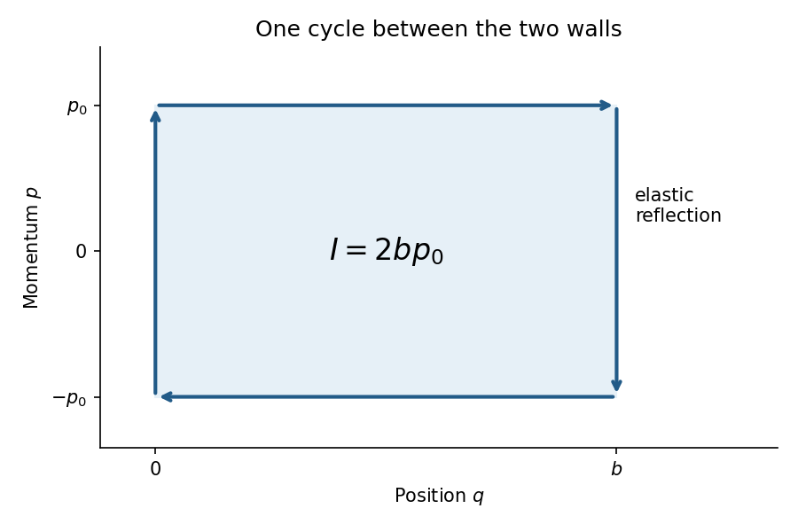

<h1 id="15c/c/solution">Solution</h1>

↑ **Parent:** [C](../c.md)

Between collisions the [momentum](../../../../../../momentum.md) is $p_0=\sqrt{2mE}$ or $-p_0$. In [phase space](../../../../../../phase-space.md) the cycle runs right along the upper horizontal segment from $q=0$ to $q=b$, jumps vertically to $-p_0$ at the right wall, runs left along the lower segment, and jumps back at the left wall. The jumps have $dq=0$. Therefore

$$
\boxed{I=\oint p\,dq=2b\sqrt{2mE}.}
$$

[Differentiation](../../../../../../differentiation.md) gives $dI/dE=2bm/\sqrt{2mE}=2b/v$, exactly the out-and-back period. Under slow wall motion the action $I$ is the [adiabatic invariant](../../../../../../adiabatic-invariant.md); a convention using $I/(2\pi)$ is equivalent. Hence

$$
\boxed{E(b)=E(b_0)\left(\frac{b_0}{b}\right)^2.}
$$

Compression raises the energy and expansion lowers it, provided the wall speed is small compared with the particle speed and the change per cycle is small.

**[Figure 3](#15c/c/image-one-elastic-bounce-cycle-in-position-momentum-phase-space). One elastic-bounce cycle in position-momentum phase space**.

## ↑ Ancestors (11)

1. [C](../c.md)
2. [15C](../../15c.md)
3. [Paper 1](../../../paper-1-split.md)
4. [Ii](../../../split.md)
5. [2006](../../../../split.md)
6. [Past exam of the mathematics course of the University of Cambridge](../../../../../split.md)
7. [Mathematics course of the University of Cambridge](../../../../../../mathematics-course-of-the-university-of-cambridge.md)
8. [Course of the University of Cambridge](../../../../../../course-of-the-university-of-cambridge.md)
9. [University of Cambridge](../../../../../../university-of-cambridge-split.md)
10. [List of universities](../../../../../../list-of-universities.md)
11. [Codex Wiki](../../../../../../split.md)
