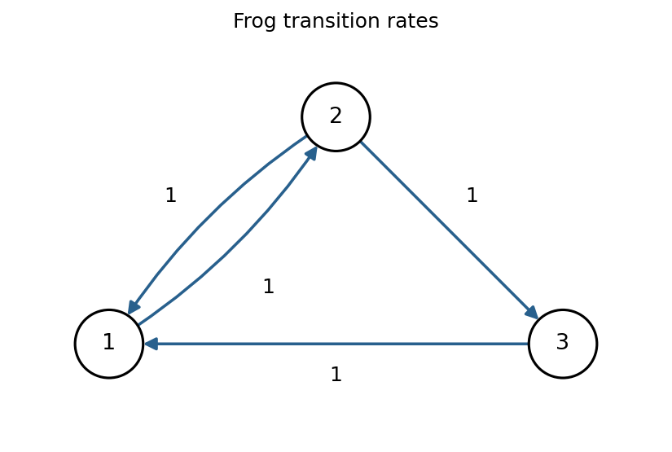

<h1 id="26j/b/solution">Solution</h1>

↑ **Parent:** [B](../b.md)

All four permitted hops have rate one: $1\to2$, $2\to1$, $2\to3$, and $3\to1$. Every state reaches every other, so **the only [communicating class](../../../../../../communicating-class.md) is $\{1,2,3\}$**, and it is closed.

**[Figure 4](#26j/b/image-allowed-frog-hops-and-their-rates). Allowed frog hops and their rates**.

Solving $\pi Q=0$, $\sum_i\pi_i=1$, gives $\pi_1=2\pi_2$ and $\pi_3=\pi_2$. Thus

$$
\boxed{\pi=(1/2,1/4,1/4),\qquad\mathbb P_\pi(X=2)=1/4.}
$$

For the transient [probability](../../../../../../probability.md), let $p_j(t)=P_{1j}(t)$. The forward equations and $p_1+p_2+p_3=1$ give $p_2'=p_1-2p_2$, $p_1'=1-2p_1$. From $p_1(0)=1$, $p_1(t)=1/2+e^{-2t}/2$. Integrating $p_2'+2p_2=p_1$, with $p_2(0)=0$, yields

$$
\boxed{P_{12}(t)=\frac14\left[1+(2t-1)e^{-2t}\right].}
$$

It has [derivative](../../../../../../derivative.md) one at zero and tends to $1/4$, as required.

## ↑ Ancestors (11)

1. [B](../b.md)
2. [26J](../../26j.md)
3. [Paper 1](../../../paper-1-split.md)
4. [Ii](../../../split.md)
5. [2006](../../../../split.md)
6. [Past exam of the mathematics course of the University of Cambridge](../../../../../split.md)
7. [Mathematics course of the University of Cambridge](../../../../../../mathematics-course-of-the-university-of-cambridge.md)
8. [Course of the University of Cambridge](../../../../../../course-of-the-university-of-cambridge.md)
9. [University of Cambridge](../../../../../../university-of-cambridge-split.md)
10. [List of universities](../../../../../../list-of-universities.md)
11. [Codex Wiki](../../../../../../split.md)
