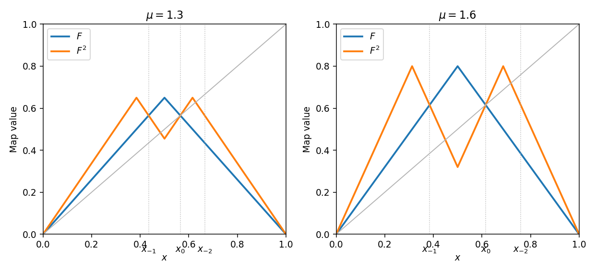

# Paper 2

↑ **Parent:** [Ii](../ii.md)

[https://www.maths.cam.ac.uk/undergrad/pastpapers/files/2006/PaperII_2.pdf](https://www.maths.cam.ac.uk/undergrad/pastpapers/files/2006/PaperII_2.pdf)

**Table of contents**

- [1H](#1h)
  - [Solution](#1h/solution)
- [2G](#2g)
  - [a](#2g/a)
    - [Solution](#2g/a/solution)
  - [b](#2g/b)
    - [Solution](#2g/b/solution)
- [3F](#3f)
  - [Solution](#3f/solution)
- [4G](#4g)
  - [Solution](#4g/solution)
- [5I](#5i)
  - [Solution](#5i/solution)
- [6B](#6b)
  - [Solution](#6b/solution)
- [7E](#7e)
  - [Solution](#7e/solution)
- [8E](#8e)
  - [Solution](#8e/solution)
- [9C](#9c)
  - [Solution](#9c/solution)
- [10D](#10d)
  - [Solution](#10d/solution)
- [11G](#11g)
  - [a](#11g/a)
    - [Solution](#11g/a/solution)
  - [b](#11g/b)
    - [Solution](#11g/b/solution)
- [12G](#12g)
  - [Solution](#12g/solution)
- [13B](#13b)
  - [a](#13b/a)
    - [Solution](#13b/a/solution)
  - [b](#13b/b)
    - [Solution](#13b/b/solution)
  - [c](#13b/c)
    - [Solution](#13b/c/solution)
- [14E](#14e)
  - [Solution](#14e/solution)
- [15D](#15d)
  - [a](#15d/a)
    - [Solution](#15d/a/solution)
  - [b](#15d/b)
    - [Solution](#15d/b/solution)
    - [i](#15d/b/i)
      - [Solution](#15d/b/i/solution)
    - [ii](#15d/b/ii)
      - [Solution](#15d/b/ii/solution)
- [16H](#16h)
  - [a](#16h/a)
    - [Solution](#16h/a/solution)
  - [b](#16h/b)
    - [Solution](#16h/b/solution)
  - [c](#16h/c)
    - [Solution](#16h/c/solution)
  - [d](#16h/d)
    - [Solution](#16h/d/solution)
  - [e](#16h/e)
    - [Solution](#16h/e/solution)
  - [f](#16h/f)
    - [Solution](#16h/f/solution)
- [17F](#17f)
  - [Solution](#17f/solution)
- [18H](#18h)
  - [Solution](#18h/solution)
- [19F](#19f)
  - [a](#19f/a)
    - [Solution](#19f/a/solution)
  - [b](#19f/b)
    - [Solution](#19f/b/solution)
- [20G](#20g)
  - [Solution](#20g/solution)
- [21H](#21h)
  - [Solution](#21h/solution)
- [22G](#22g)
  - [Solution](#22g/solution)
- [23F](#23f)
  - [Solution](#23f/solution)
  - [a](#23f/a)
    - [Solution](#23f/a/solution)
  - [b](#23f/b)
    - [Solution](#23f/b/solution)
- [24H](#24h)
  - [a](#24h/a)
    - [Solution](#24h/a/solution)
  - [b](#24h/b)
    - [Solution](#24h/b/solution)
  - [c](#24h/c)
    - [Solution](#24h/c/solution)
- [25J](#25j)
  - [a](#25j/a)
    - [Solution](#25j/a/solution)
  - [b](#25j/b)
    - [Solution](#25j/b/solution)
  - [c](#25j/c)
    - [Solution](#25j/c/solution)
  - [d](#25j/d)
    - [Solution](#25j/d/solution)
- [26J](#26j)
  - [a](#26j/a)
    - [Solution](#26j/a/solution)
  - [b](#26j/b)
    - [Solution](#26j/b/solution)
- [27J](#27j)
  - [Solution](#27j/solution)
- [28I](#28i)
  - [a](#28i/a)
    - [Solution](#28i/a/solution)
  - [b](#28i/b)
    - [Solution](#28i/b/solution)
- [29I](#29i)
  - [Solution](#29i/solution)
- [30A](#30a)
  - [Solution](#30a/solution)
- [31E](#31e)
  - [Solution](#31e/solution)
- [32A](#32a)
  - [Solution](#32a/solution)
- [33D](#33d)
  - [Solution](#33d/solution)
- [34D](#34d)
  - [Solution](#34d/solution)
- [35A](#35a)
  - [Solution](#35a/solution)
  - [i](#35a/i)
    - [Solution](#35a/i/solution)
  - [ii](#35a/ii)
    - [Solution](#35a/ii/solution)
- [36B](#36b)
  - [Solution](#36b/solution)
- [37C](#37c)
  - [Solution](#37c/solution)
- [38C](#38c)
  - [Solution](#38c/solution)

## 1H

↑ **Parent:** [Paper 2](paper-2.md)

<h3 id="1h/solution">Solution</h3>

↑ **Parent:** [1H](#1h)

Use the usual positive-definite convention for [binary quadratic forms](../../../number-theory.md#binary-quadratic-form) with negative [discriminant](../../../polynomial.md#discriminant). Reduction by integral changes of variables of [determinant](../../../linear-algebra.md#determinant) one produces a form $ax^2+bxy+cy^2$ with $|b|\le a\le c$, and with $b\ge0$ on the boundary. For completeness, replacing $x$ by $x+ny$ makes $|b|\le a$; if then $c<a$, interchange the variables, reversing one sign to keep [determinant](../../../linear-algebra.md#determinant) one. The new positive [leading coefficient](../../../polynomial.md#leading-coefficient-of-a-polynomial) is smaller. Repeating terminates and gives a reduced form.

For [discriminant](../../../polynomial.md#discriminant) $-7$, $4ac-b^2=7$ and the reduction inequalities give $3a^2\le7$. Thus $a=1$, $b$ is odd and $|b|\le1$, and $c=2$. The boundary convention chooses $b=1$. Hence there is exactly one positive-definite [equivalence class](../../../set-theory.md#equivalence-class), represented by $x^2+xy+2y^2$.

For an [odd prime](../../../number-theory.md#odd-prime) $p\ne7$ represented by this form, the identity $4p=(2x+y)^2+7y^2$ shows that $-7$ is a square modulo $p$. Here $p\nmid y$, because otherwise $p\mid x$ and $p^2$ would divide the represented number. Conversely, if $-7$ is a square modulo $p$, choose odd $b$ with $b^2\equiv-7\pmod p$. Then $(p,b,(b^2+7)/(4p))$ is an integral positive-definite form of [discriminant](../../../polynomial.md#discriminant) $-7$. By the preceding reduction it is equivalent to the given form, so its value $p$ at $(1,0)$ is represented by that form. [Quadratic reciprocity](../../../number-theory.md#quadratic-reciprocity) gives $(-7/p)=(p/7)$, whose value is one precisely for $p\equiv1,2,4\pmod7$. The exceptional [primes](../../../number-theory.md#prime-number) are represented: $2=Q(0,1)$ and $7=Q(1,-2)$. Therefore

$$
\boxed{p\text{ is represented}\iff p=7\text{ or }p\equiv1,2,4\pmod7.}
$$

Without the positive-definite convention, the first printed assertion is false: $-x^2-xy-2y^2$ also has [discriminant](../../../polynomial.md#discriminant) $-7$ but cannot be equivalent to a positive-definite form, because an invertible [change of variables](../../../calculus.md#change-of-variables-formula) preserves its sign.

## 2G

↑ **Parent:** [Paper 2](paper-2.md)

<h3 id="2g/a">a</h3>

↑ **Parent:** [2G](#2g)

<h4 id="2g/a/solution">Solution</h4>

↑ **Parent:** [A](#2g/a)

The [Chebyshev alternation theorem](../../../uniform-approximation.md#equioscillation-theorem) says that a [polynomial](../../../polynomial.md) $p$ of degree at most $n$ is a [best uniform approximation](../../../uniform-approximation.md#best-uniform-approximation) to a real [continuous function](../../../calculus.md#continuous-function) $f$ on a [compact](../../../topology.md#compact-space) interval if and only if there are $n+2$ ordered points at which $f-p$ attains its [uniform norm](../../../functional-analysis.md#supremum-norm) with alternating signs. For nonzero error these are equal-magnitude alternating extrema; the zero-error case is understood separately. The best approximating [polynomial](../../../polynomial.md) is unique.

<h3 id="2g/b">b</h3>

↑ **Parent:** [2G](#2g)

<h4 id="2g/b/solution">Solution</h4>

↑ **Parent:** [B](#2g/b)

Take $x_j=-1+j/4$, $0\le j\le8$. These nine points satisfy $\cos(4\pi x_j)=(-1)^j$. Thus the zero [polynomial](../../../polynomial.md) has nine alternating error extrema of magnitude one and is minimax among [polynomials](../../../polynomial.md) of degree at most seven by the [Chebyshev alternation theorem](../../../uniform-approximation.md#equioscillation-theorem). Hence **every such [polynomial](../../../polynomial.md) has uniform error at least one**.

One can also prove the bound directly. If the error were strictly below one everywhere, $g(x_j)$ would have sign $(-1)^j$. The [intermediate value theorem](../../../calculus.md#intermediate-value-theorem) would give a distinct zero in each of the eight intervening intervals, contradicting the degree bound. Since the [continuous](../../../calculus.md#continuous-function) error attains its maximum on the [compact](../../../topology.md#compact-space) interval, there is an $x$ with $|f(x)-g(x)|\ge1$.

## 3F

↑ **Parent:** [Paper 2](paper-2.md)

<h3 id="3f/solution">Solution</h3>

↑ **Parent:** [3F](#3f)

For a nonidentity element of $\operatorname{PSL}_2(\mathbb R)$ represented by a determinant-one matrix, the classification is elliptic, parabolic or hyperbolic according as the squared [trace](../../../linear-algebra.md#matrix-trace) is less than, equal to or greater than four. This follows either from the [eigenvalues](../../../linear-operator-theory.md#eigenvalue) or from the [discriminant](../../../polynomial.md#discriminant) of its fixed-point equation on the boundary of the [upper half-plane](../../../complex-analysis.md#upper-half-plane-complex-analysis).

The first matrix has [determinant](../../../linear-algebra.md#determinant) one and [trace](../../../linear-algebra.md#matrix-trace) two, and is not scalar. It is therefore **parabolic**. Its fixed-point equation is

$$
z=\frac{5z+8}{-2z-3}\iff 2(z+2)^2=0.
$$

Thus **its unique [fixed point](../../../function.md#fixed-point) is $z=-2$ on the real boundary**, of multiplicity two; infinity is not fixed and there is no [fixed point](../../../function.md#fixed-point) in the [upper half-plane](../../../complex-analysis.md#upper-half-plane-complex-analysis). The second matrix has [determinant](../../../linear-algebra.md#determinant) one and [trace](../../../linear-algebra.md#matrix-trace) $-4$, so it is **hyperbolic**. Its two boundary [fixed points](../../../function.md#fixed-point) are $( -1\pm\sqrt3)/2$, consistently with this classification.

## 4G

↑ **Parent:** [Paper 2](paper-2.md)

<h3 id="4g/solution">Solution</h3>

↑ **Parent:** [4G](#4g)

A [decipherable code](../../../coding-theory.md#decipherable-code) is one whose extension to finite strings by concatenation is injective: an encoded string has a unique sequence of source letters. In particular its [codewords](../../../coding-theory.md#codeword) are distinct and nonempty. Put $K=\sum_i a^{-s_i}$ and $s_{\max}=\max_i s_i$. For strings of exactly $n$ source letters, let $N_j$ count the encoded strings of length $j$. Unique decipherability gives $N_j\le a^j$, since distinct source strings yield distinct encoded strings. Expanding $K^n$ gives

$$
K^n=\sum_jN_ja^{-j}\le ns_{\max}+1.
$$

Taking $n$th roots and letting $n\to\infty$ proves the [McMillan inequality](../../../coding-theory.md#mcmillan-inequality)

$$
\boxed{\sum_i a^{-s_i}\le1.}
$$

Add **$00,01,10$** to the four specified binary words. None of the resulting seven words is a proper suffix of another: the longer words end in $11$, and their shorter terminal strings never equal another of the specified longer words. Thus this is a [suffix code](../../../coding-theory.md#suffix-code). Reading from the right determines the last [codeword](../../../coding-theory.md#codeword) uniquely; deleting it and repeating proves unique decipherability. Its length sum is $3/4+1/8+1/16+2/32=1$, in agreement with the bound.

## 5I

↑ **Parent:** [Paper 2](paper-2.md)

<h3 id="5i/solution">Solution</h3>

↑ **Parent:** [5I](#5i)

Independence and the Poisson [probabilities](../../../probability-theory.md#probability) give the log-likelihood

$$
\boxed{\ell(\beta)=\sum_{i=1}^n\left(Y_i\beta x_i-e^{\beta x_i}-\log(Y_i!)\right).}
$$

Its score and curvature are

$$
\ell'(\beta)=\sum_i x_i(Y_i-e^{\beta x_i}),\qquad \ell''(\beta)=-\sum_i x_i^2e^{\beta x_i}.
$$

If some $x_i\ne0$, this is [strictly concave](../../../real-analysis.md#strictly-concave-function). A finite maximum is therefore the unique zero of the score when such a zero exists. Newton iteration gives

$$
\boxed{\beta_{m+1}=\beta_m+\frac{\sum_i x_i(Y_i-e^{\beta_mx_i})}{\sum_i x_i^2e^{\beta_mx_i}}.}
$$

Start from a finite value, compute the score and curvature, and iterate until both the score and step are small. A line search that shortens a step until the [likelihood](../../../statistical-modelling.md#likelihood-function) increases improves robustness. [Strict concavity](../../../real-analysis.md#strict-concavity) identifies any converged [stationary point](../../../calculus-of-variations.md#stationary-point) as the [global maximum](../../../function.md#global-maximum). A finite root need not exist, for example when all observations are zero and all $x_i>0$, in which case the [likelihood](../../../statistical-modelling.md#likelihood-function) supremum is at $\beta\to-\infty$. If all $x_i=0$, the parameter is unidentifiable.

## 6B

↑ **Parent:** [Paper 2](paper-2.md)

<h3 id="6b/solution">Solution</h3>

↑ **Parent:** [6B](#6b)

The prey have per-capita growth $\mu_1$, loss through encounters with predators at rate $\alpha_1v$, and density-dependent competition $\delta u$. Predators suffer per-capita mortality $\mu_2$, gain from consuming prey at rate $\alpha_2u$, and undergo constant harvesting or removal $\epsilon$. Constant harvesting makes the equations biologically valid only while the predator population remains nonnegative.

At an equilibrium with positive populations,

$$
u=\frac{\mu_1-\alpha_1v}{\delta},\qquad v(\alpha_2u-\mu_2)=\epsilon.
$$

Writing $A=\alpha_2\mu_1-\delta\mu_2>0$ gives

$$
\alpha_1\alpha_2v^2-Av+\delta\epsilon=0,\qquad \boxed{v_\pm=\frac{A\pm\sqrt{A^2-4\alpha_1\alpha_2\delta\epsilon}}{2\alpha_1\alpha_2}.}
$$

For $0<\epsilon<A^2/(4\alpha_1\alpha_2\delta)$, both roots are positive and give $u>\mu_2/\alpha_2>0$ via the second equilibrium equation. Thus there are two positive equilibria.

Using the equilibrium identities in the Jacobian gives

$$
J=\begin{pmatrix}-\delta u&-\alpha_1u\\ \alpha_2v&\epsilon/v\end{pmatrix},\qquad \boxed{\operatorname{tr}J=-\delta u+\frac{\epsilon}{v},\quad \det J=u\left(\alpha_1\alpha_2v-\frac{\delta\epsilon}{v}\right).}
$$

The smaller root satisfies $v_-v_+=\delta\epsilon/(\alpha_1\alpha_2)$ and $v_-<v_+$, so $v_-^2<\delta\epsilon/(\alpha_1\alpha_2)$. Hence its [determinant](../../../linear-algebra.md#determinant) is negative: **it is always a saddle and unstable**. For small $\delta,\epsilon$, this is the equilibrium with $u\sim\mu_1/\delta$ and $v\sim\delta\epsilon/(\alpha_2\mu_1)$, as required. The [determinant](../../../linear-algebra.md#determinant) argument is stronger than merely taking the small-parameter limit.

## 7E

↑ **Parent:** [Paper 2](paper-2.md)

<h3 id="7e/solution">Solution</h3>

↑ **Parent:** [7E](#7e)

A [strict Lyapunov function](../../../dynamical-systems.md#strict-lyapunov-function) is a [continuously differentiable function](../../../calculus.md#continuously-differentiable-function) $V$ with $V(0)=0$, $V(x)>0$ off the origin, and $\nabla V\cdot f<0$ off the origin in the domain. Its [compact](../../../topology.md#compact-space) [sublevel sets](../../../calculus.md#sublevel-set) inside the domain are forward invariant and force convergence to the equilibrium. The [domain of stability](../../../dynamical-systems.md#basin-of-attraction), or [basin of attraction](../../../dynamical-systems.md#basin-of-attraction), consists of initial points whose forward solutions exist for all positive time and converge to the [fixed point](../../../function.md#fixed-point).

For $V=(x^2+y^2)/2$, direct differentiation and factorization give

$$
\dot V=-2(x^2+y^2)+x^4+5x^2y^2+4y^4=(x^2+y^2)(-2+x^2+4y^2).
$$

If $R^2=x^2+y^2<1/2$, then $x^2+4y^2\le4R^2<2$, so $\dot V<0$ off zero. For any initial point in that disc, choose a slightly larger [closed disc](../../../topology.md#closed-disc) still inside it. The [vector field](../../../calculus.md#vector-field) points inward on its boundary; the trajectory is bounded, exists globally, and the strict Lyapunov decrease forces its limit to be zero. Thus the origin is [asymptotically stable](../../../dynamical-systems.md#asymptotic-stability) and the whole [open disc](../../../topology.md#open-disc) lies in its basin.

If $R^2>2$, then $x^2+4y^2\ge R^2>2$, so $\dot V>0$. A solution starting there cannot cross inward through $R^2=2$ and cannot approach zero. Therefore

$$
\boxed{\{x^2+y^2<1/2\}\subseteq\mathcal B(0)\subseteq\{x^2+y^2\le2\}.}
$$

## 8E

↑ **Parent:** [Paper 2](paper-2.md)

<h3 id="8e/solution">Solution</h3>

↑ **Parent:** [8E](#8e)

Take a [Hankel contour](../../../complex-analysis.md#hankel-contour) $C_\eta$ around the positive real axis, going from infinity on its lower side toward a circle of radius $0<\eta<1$, clockwise around that circle, then out along the upper side. Use $0\le\arg z\le2\pi$ and define

$$
H(t)=\int_{C_\eta}\frac{z^te^{-z}}{1+z}\,dz.
$$

This is an [entire function](../../../complex-analysis.md#entire-function) of $t$: the small circle stays away from zero and the pole at $-1$, while the exponentially decaying rays converge uniformly for $t$ in [compact subsets](../../../topology.md#compact-space). [Contour deformation](../../../complex-analysis.md#contour-deformation) shows independence of $\eta$. For $\Re t>-1$, let $\eta\to0$. The upper ray contributes $F(t)$, the lower ray contributes $-e^{2\pi it}F(t)$, and the small-circle contribution vanishes. Thus the [analytic continuation](../../../complex-analysis.md#analytic-continuation) is

$$
\boxed{F(t)=\frac{H(t)}{1-e^{2\pi it}}.}
$$

The only apparent singularities are at integers. At the [nonnegative integers](../../../arithmetic.md#natural-number) they are removable because the original integral is [holomorphic](../../../complex-analysis.md#complex-differentiability-at-a-point) throughout $\Re t>-1$. Hence singularities can occur only at $-1,-2,\ldots$.

In fact all of those points are [simple poles](../../../isolated-singularity.md#simple-pole). At $t=-n-1$ the two rays cancel and the clockwise circle gives $H(-n-1)=-2\pi i\,c_n$, where

$$
c_n=[z^n]\frac{e^{-z}}{1+z}=(-1)^n\sum_{j=0}^n\frac1{j!}\ne0.
$$

Since the denominator has derivative $-2\pi i$ at each integer, the residue at $-n-1$ is $c_n$. The parameter has been called $t$ consistently; the final use of $z$ for this parameter in the printed question is harmless notation.

## 9C

↑ **Parent:** [Paper 2](paper-2.md)

<h3 id="9c/solution">Solution</h3>

↑ **Parent:** [9C](#9c)

The [kinetic energy](../../../classical-mechanics.md#kinetic-energy) is $m(\dot\eta_1^2+\dot\eta_2^2)/2$. The Euler–Lagrange equations give

$$
m\ddot\eta_1=-(j+k)\eta_1+k\eta_2,\qquad m\ddot\eta_2=k\eta_1-(\ell+k)\eta_2.
$$

For a [normal mode](../../../wave-equation.md#normal-mode) $\eta=Ae^{i\omega t}$, the [stiffness matrix](../../../numerical-analysis.md#stiffness-matrix) is

$$
K=\begin{pmatrix}j+k&-k\\-k&\ell+k\end{pmatrix},\qquad \det(K-m\omega^2I)=0.
$$

Solving this quadratic yields

$$
\boxed{\omega_\pm^2=\frac{j+\ell+2k\pm\sqrt{(j-\ell)^2+4k^2}}{2m}.}
$$

Both are positive for positive spring constants. A corresponding amplitude ratio is $A_2/A_1=(j+k-m\omega_\pm^2)/k$; the lower-frequency mode has the masses moving in the same direction and the higher-frequency mode in opposite directions.

## 10D

↑ **Parent:** [Paper 2](paper-2.md)

<h3 id="10d/solution">Solution</h3>

↑ **Parent:** [10D](#10d)

An adiabatic change of box size preserves the mode labels, whose momenta scale as $p\propto L^{-1}$. Since $V=L^3$, differentiation gives $dp/dV=-p/(3V)$. [Occupation numbers](../../../quantum-field-theory.md#occupation-number) are fixed under this slow mechanical change, so summing the changes in the individual particle energies gives

$$
dE=\int_0^\infty E'(p)\,\overline n(p)\,dp\left(-\frac{p}{3V}dV\right).
$$

Comparison with $dE=-P\,dV$ at fixed [entropy](../../../thermodynamics.md#entropy) and particle number yields

$$
\boxed{P=\frac1{3V}\int_0^\infty pE'(p)\overline n(p)\,dp.}
$$

The integration notation means summing over the original momentum-mode labels; it does not assume that the density in momentum space is unchanged after rescaling. In the ultrarelativistic limit $E(p)=cp$, so $pE'(p)=E(p)$ and **$P=E/(3V)=\rho c^2/3$**.

Adiabatic radiation obeys $d(Ea^3)=-P\,d(a^3)$, giving [energy density](../../../statistical-physics.md#energy-density) proportional to $a^{-4}$. Equilibrium [photon energy density](../../../statistical-physics.md#photon-energy-density) is proportional to $T^4$, so $T\propto a^{-1}$. Therefore the photon number in a [comoving volume](../../../cosmology.md#comoving-volume), $n_\gamma a^3\propto T^3a^3$, is constant. Its [entropy](../../../thermodynamics.md#entropy) is also constant: photon [entropy density](../../../thermodynamics.md#entropy-density) is $(\epsilon_\gamma+P)/T\propto T^3$. Photon number is not a microscopic [conserved charge](../../../quantum-field-theory.md#conserved-charge), but equilibrium processes maintaining the spectrum do not alter this comoving-number scaling in [adiabatic expansion](../../../thermodynamics.md#adiabatic-expansion); entropy-producing processes would invalidate the assumptions.

## 11G

↑ **Parent:** [Paper 2](paper-2.md)

<h3 id="11g/a">a</h3>

↑ **Parent:** [11G](#11g)

<h4 id="11g/a/solution">Solution</h4>

↑ **Parent:** [A](#11g/a)

All poles lie outside some circle $|z|=R$ with $R>1$. The [rational function](../../../isolated-singularity.md#rational-function) is [holomorphic](../../../complex-analysis.md#complex-differentiability-at-a-point) in that disc, so its [Taylor series](../../../calculus.md#taylor-series) at zero [converges uniformly](../../../real-analysis.md#uniform-convergence) on $|z|\le1$. Its [polynomial](../../../polynomial.md) [partial sums](../../../real-analysis.md#partial-sum) therefore approximate uniformly on $K$. If there are no finite poles, the function is already a [polynomial](../../../polynomial.md).

<h3 id="11g/b">b</h3>

↑ **Parent:** [11G](#11g)

<h4 id="11g/b/solution">Solution</h4>

↑ **Parent:** [B](#11g/b)

Let $\mathcal A$ be the [uniform closure](../../../uniform-approximation.md#uniform-closure-of-a-function-algebra) on $K$ of [polynomials](../../../polynomial.md). It is a closed algebra: [uniform convergence](../../../real-analysis.md#uniform-convergence) on a [compact set](../../../topology.md#compact-space) is preserved under sums and products. For $\lambda\in\Lambda$, put $q(z)=(z-\lambda)^{-1}\in\mathcal A$ and $d=\operatorname{dist}(\lambda,K)>0$. If $|\mu-\lambda|<d/2$, then $\mu\notin K$ and

$$
\frac1{z-\mu}=\sum_{j=0}^\infty(\mu-\lambda)^jq(z)^{j+1}.
$$

The series [converges uniformly](../../../real-analysis.md#uniform-convergence), its ratio having modulus at most one half. Each [partial sum](../../../real-analysis.md#partial-sum) is in $\mathcal A$, so its limit is too. Hence **$\mu\in\Lambda$ in this neighbourhood**. For empty $K$, approximation is vacuous and the assertion is immediate.

## 12G

↑ **Parent:** [Paper 2](paper-2.md)

<h3 id="12g/solution">Solution</h3>

↑ **Parent:** [12G](#12g)

A cyclic binary code is a [linear subspace](../../../vector-space.md#vector-subspace) of $\mathbb F_2^n$ invariant under cyclic shifts. Identify a word with its coefficient [polynomial](../../../polynomial.md) in $\mathbb F_2[X]/(X^n-1)$. Multiplication by $X$ is the shift, so the code is precisely an [ideal](../../../commutative-algebra.md#ideal) of that [quotient ring](../../../commutative-algebra.md#quotient-ring). Its inverse image in the [polynomial ring](../../../commutative-algebra.md#polynomial-ring) is a [principal ideal](../../../commutative-algebra.md#principal-ideal) $(g)$ containing $(X^n-1)$; its unique monic generator divides $X^n-1$. Conversely each monic divisor generates such an [ideal](../../../commutative-algebra.md#ideal). Thus the bijection is with **monic divisors**; $g=1$ gives the full code and $g=X^n-1$ the [zero code](../../../coding-theory.md#zero-code).

For odd $n$, some $m$ has $n\mid2^m-1$, so the cyclic multiplicative group of $\mathbb F_{2^m}$ contains a primitive $n$th root $\alpha$. If a nonzero word with the specified roots had weight $w<\delta$, write its nonzero positions as $r_1,\ldots,r_w$. The root equations give

$$
\sum_{j=1}^w c_j(\alpha^{r_j})^i=0\quad(1\le i\le w).
$$

Their matrix has [determinant](../../../linear-algebra.md#determinant) $\prod_j\alpha^{r_j}\prod_{j<l}(\alpha^{r_l}-\alpha^{r_j})\ne0$, by the Vandermonde formula and distinctness of the positions. Thus all coefficients would vanish, a contradiction. Hence **[minimum distance](../../../coding-theory.md#minimum-distance-of-a-code) is at least $\delta$**.

For $n=7$, choose $\alpha$ with [minimal polynomial](../../../linear-operator-theory.md#minimal-polynomial) $X^3+X+1$. The roots $\alpha,\alpha^2$ force also the conjugate $\alpha^4$, giving this cubic as generator. Its degree gives dimension four and its weight gives distance exactly three. Expressing $c(\alpha)=0$ in a basis of $\mathbb F_8$ gives a [parity-check matrix](../../../coding-theory.md#parity-check-matrix) with the seven distinct nonzero vectors of $\mathbb F_2^3$ as columns. This is **the binary $[7,4,3]$ [Hamming code](../../../coding-theory.md#hamming-code)**. Its sixteen disjoint radius-one balls have $16(1+7)=128$ words, so one-error correction is perfect. The other primitive cubic produces an equivalent coordinate-permuted code.

## 13B

↑ **Parent:** [Paper 2](paper-2.md)

<h3 id="13b/a">a</h3>

↑ **Parent:** [13B](#13b)

<h4 id="13b/a/solution">Solution</h4>

↑ **Parent:** [A](#13b/a)

$T$ is the interval between generations or censuses, and $r$ the prey multiplication without predators. The factor $e^{-aP}$ can be the [probability](../../../probability-theory.md#probability) of escaping a Poisson number of encounters with mean $aP$, so $a$ [measures](../../../measure-theory.md#measure) attack intensity. The factor $s$ converts prey resources into predator recruitment, and $b$ modifies the fraction of prey contributing no recruitment. At $b=1$ predators recruit from attacked prey; $b<1$ adds background recruitment, even at $P=0$. A population interpretation valid at every nonnegative state needs $b\le1$, since otherwise the second equation gives negative recruitment near $P=0$.

<h3 id="13b/b">b</h3>

↑ **Parent:** [13B](#13b)

<h4 id="13b/b/solution">Solution</h4>

↑ **Parent:** [B](#13b/b)

Use $T$ as the time unit and define $p=aP$, $n=asN$. Direct substitution gives the dimensionless equations

$$
\boxed{n_{t+1}=rn_te^{-p_t},\qquad p_{t+1}=n_t(1-be^{-p_t}).}
$$

<h3 id="13b/c">c</h3>

↑ **Parent:** [13B](#13b)

<h4 id="13b/c/solution">Solution</h4>

↑ **Parent:** [C](#13b/c)

The origin has Jacobian $\begin{pmatrix}r&0\\1-b&0\end{pmatrix}$ and is unstable because $r>1$. At a positive equilibrium, $re^{-p_c}=1$, giving

$$
\boxed{p_c=\log r,\qquad n_c=\frac{r\log r}{r-b}.}
$$

The linearization is

$$
\binom{n'_{t+1}}{p'_{t+1}}=\begin{pmatrix}1&-n_c\\1-b/r&bn_c/r\end{pmatrix}\binom{n'_t}{p'_t}.
$$

Its [trace](../../../linear-algebra.md#matrix-trace) is $\tau=1+bn_c/r$ and [determinant](../../../linear-algebra.md#determinant) $n_c$. Elimination gives $n'_{t+2}-\tau n'_{t+1}+n_cn'_t=0$. For distinct roots,

$$
\boxed{n'_t=A\lambda_1^t+B\lambda_2^t,\quad p'_t=\frac{A(1-\lambda_1)\lambda_1^t+B(1-\lambda_2)\lambda_2^t}{n_c},\quad\lambda_1+\lambda_2=\tau,\quad\lambda_1\lambda_2=n_c.}
$$

At a repeated root replace the first expression by $(A+Bt)\lambda^t$ and use $p'_t=(n'_t-n'_{t+1})/n_c$.

As $r\downarrow1$, $n_c\to0$, so the roots approach one and zero. The [characteristic polynomial](../../../linear-operator-theory.md#characteristic-polynomial) at one is $n_c(1-b/r)>0$, putting the larger real root just below one and the other [positive root](../../../semisimple-lie-algebra.md#positive-root) below it. No real root can ever equal one. Moreover

$$
\frac{dn_c}{dr}=\frac{r-b-b\log r}{(r-b)^2}>0,
$$

since its numerator exceeds $r-1-\log r>0$. At $n_c=1$, $\tau=1+b/r<2$, so the roots are conjugate and nonreal. Just above this point their modulus is $\sqrt{n_c}>1$.

The unit-disc conditions are $1-n_c>0$, $1-\tau+n_c>0$, and $1+\tau+n_c>0$. The last two hold automatically here, so stability is equivalent to $n_c<1$. The unique crossing and its [eigenvalue](../../../linear-operator-theory.md#eigenvalue) argument satisfy

$$
\boxed{r_*\log r_*=r_*-b,\qquad 1<r_*<e,\qquad 2\cos\theta_*=1+b/r_*.}
$$

Indeed $\log r_*=1-b/r_*<1$. This is the [stability threshold of a discrete exponential predator-prey model](../../../dynamical-systems.md#stability-threshold-of-a-discrete-exponential-predator-prey-model). The sketch uses $b=1/2$: the real moduli merge and then coincide, increasing through one at the threshold. Linearization decides stability below and instability above; it does not determine nonlinear stability exactly at the crossing.

**[Figure 1](#13b/c/image-eigenvalue-moduli-and-the-stability-threshold-of-the-discrete-predator-prey-model). Eigenvalue moduli and the stability threshold of the discrete predator-prey model**.

## 14E

↑ **Parent:** [Paper 2](paper-2.md)

<h3 id="14e/solution">Solution</h3>

↑ **Parent:** [14E](#14e)

A [horseshoe for an interval map](../../../dynamical-systems.md#horseshoe-for-an-interval-map) consists of an [open interval](../../../topology.md#open-interval) $J$ containing two disjoint open subintervals each mapped onto $J$. [Glendinning chaos](../../../dynamical-systems.md#glendinning-chaos) means that some positive iterate has a horseshoe.

Solving on the appropriate branches of the [tent map](../../../dynamical-systems.md#tent-map) gives

$$
\boxed{x_0=\frac{\mu}{\mu+1},\quad x_{-1}=\frac1{\mu+1},\quad x_{-2}=1-\frac1{\mu(\mu+1)}.}
$$

Here $F(x_{-2})=x_{-1}$ and $F(x_{-1})=x_0$. On $J=[x_{-1},x_0]$ the second iterate is

$$
G(x)=\begin{cases}\mu-\mu^2x,&x\le1/2,\\\mu-\mu^2+\mu^2x,&x\ge1/2.\end{cases}
$$

Both endpoints map to $x_0$, and the minimum is $v=\mu-\mu^2/2$. Both monotone branches cover $J$ when $v\le x_{-1}$, equivalently $(\mu-1)(\mu^2-2)\ge0$. Restricting them to preimages of the interior proves **a horseshoe for $F^2$ when $\mu\ge\sqrt2$**.

**[Figure 2](#14e/image-the-tent-map-and-its-second-iterate-with-the-fixed-point-and-its-indicated-preimages). The tent map and its second iterate with the fixed point and its indicated preimages**.

For $1<\mu\le\sqrt2$, $G(J)\subseteq J$. Set $d=(\mu-1)/(\mu+1)$ and $h(x)=(x_0-x)/d$. This maps $J$ onto $[0,1]$; substitution in each linear piece gives $hGh^{-1}=F_{\mu^2}$. The [renormalization of the tent map near its fixed point](../../../dynamical-systems.md#renormalization-of-the-tent-map-near-its-fixed-point) therefore makes $F^4$ conjugate on $J$ to $F_{\mu^2}^2$. Applying the preceding threshold proves its horseshoe when $2^{1/4}\le\mu<\sqrt2$.

For $\mu\ge\sqrt2$, the inverse branch of $G$ fixing $x_0$ contracts distance to $x_0$ by $\mu^{-2}$. Compose $m$ copies of it with the other inverse branch. This contraction has a [fixed point](../../../function.md#fixed-point) with a periodic itinerary, distinct from $x_0$ and at distance $O(\mu^{-2m})$. Hence nontrivial periodic points accumulate at $x_0$.

For $\mu<\sqrt2$, the conjugate tent parameter $\nu=\mu^2<2$ has every nonzero periodic point in $[\nu-\nu^2/2,\nu/2]$. This interval is forward invariant; below it, a nonzero point increases until entering it. The positive lower bound separates those periodic points from zero, which corresponds to $x_0$. Thus no nontrivial periodic points are sufficiently close to $x_0$ from the left. A point sufficiently close on the right maps to such a left-hand point; periodicity would pass to its image and is impossible. Thus **$x_0$ is isolated among periodic points**, even though a fourth-iterate horseshoe exists elsewhere.

## 15D

↑ **Parent:** [Paper 2](paper-2.md)

<h3 id="15d/a">a</h3>

↑ **Parent:** [15D](#15d)

<h4 id="15d/a/solution">Solution</h4>

↑ **Parent:** [A](#15d/a)

Differentiate $E=\rho c^2a^3V_0$ and use $dE=-P\,dV$, with $V=a^3V_0$. Division by $c^2a^3V_0$ gives

$$
\boxed{\dot\rho=-3\frac{\dot a}{a}\left(\rho+\frac{P}{c^2}\right).}
$$

This is homogeneous [adiabatic expansion](../../../thermodynamics.md#adiabatic-expansion) without [entropy production](../../../thermodynamics.md#entropy-production) or exchange across the comoving element.

<h3 id="15d/b">b</h3>

↑ **Parent:** [15D](#15d)

<h4 id="15d/b/solution">Solution</h4>

↑ **Parent:** [B](#15d/b)

The two scalings give $\rho=\rho_{r0}a^{-4}+\rho_{s0}a^{-2}$. Flatness and the [Friedmann equation](../../../cosmology.md#friedmann-equations) give $H^2=8\pi G\rho/3$, with $H_0^2=(8\pi G/3)(\rho_{r0}+\rho_{s0})$. Thus

$$
\boxed{\left(\frac{\dot a}{a}\right)^2=\frac{H_0^2}{a^4}\frac{a^2+\beta}{1+\beta}.}
$$

On the expanding branch, putting the [Big Bang](../../../cosmology.md#big-bang) at zero, separation gives

$$
t=\frac{\sqrt{1+\beta}}{H_0}\bigl(\sqrt{a^2+\beta}-\sqrt\beta\bigr),\qquad a^2=\frac{H_0^2t^2}{1+\beta}+\frac{2H_0t\sqrt\beta}{\sqrt{1+\beta}}.
$$

Its positive [square root](../../../algebra.md#square-root) is the required solution. If $\beta>0$, its early behaviour is $a\propto t^{1/2}$, as for radiation. The values $a=1$ and $a^2=\beta$ give

$$
\boxed{t_0=\frac{\sqrt{1+\beta}}{H_0}(\sqrt{1+\beta}-\sqrt\beta),\qquad t_{\rm eq}=\frac{\sqrt\beta\sqrt{1+\beta}}{H_0}(\sqrt2-1).}
$$

For $\beta=0$ there is only the string component, with linear expansion and no radiation era.

<h4 id="15d/b/i">i</h4>

↑ **Parent:** [B](#15d/b)

<h5 id="15d/b/i/solution">Solution</h5>

↑ **Parent:** [I](#15d/b/i)

For radiation $P_r/c^2=\rho_r/3$, so $d\log\rho_r=-4\,d\log a$. Normalization at $a=1$ gives **$\rho_r=\rho_{r0}a^{-4}$**.

<h4 id="15d/b/ii">ii</h4>

↑ **Parent:** [B](#15d/b)

<h5 id="15d/b/ii/solution">Solution</h5>

↑ **Parent:** [Ii](#15d/b/ii)

For strings $P_s/c^2=-\rho_s/3$, so $d\log\rho_s=-2\,d\log a$. Thus **$\rho_s=\rho_{s0}a^{-2}$**. These separate scalings assume no [energy](../../../classical-mechanics.md#energy) transfer between components.

## 16H

↑ **Parent:** [Paper 2](paper-2.md)

<h3 id="16h/a">a</h3>

↑ **Parent:** [16H](#16h)

<h4 id="16h/a/solution">Solution</h4>

↑ **Parent:** [A](#16h/a)

**True.** For $\beta>0$, multiplication $\gamma\mapsto\beta\gamma$ is strictly increasing and [continuous](../../../calculus.md#continuous-function) at [limit ordinals](../../../set-theory.md#limit-ordinal), and $\beta\gamma\ge\gamma$. Thus there is a greatest $\gamma$ with $\beta\gamma\le\alpha$: the set is bounded, and its supremum still satisfies the inequality by continuity if it is a limit. The remaining ordered interval in $\alpha$ has an [ordinal](../../../set-theory.md#ordinal) [order type](../../../set-theory.md#order-type) $\delta$, so $\alpha=\beta\gamma+\delta$. If $\delta\ge\beta$, then $\beta(\gamma+1)\le\alpha$, contradicting maximality. Hence $\delta<\beta$.

<h3 id="16h/b">b</h3>

↑ **Parent:** [16H](#16h)

<h4 id="16h/b/solution">Solution</h4>

↑ **Parent:** [B](#16h/b)

**False.** Take $\alpha=\omega+1$, $\beta=2$. For finite $\gamma$, $\gamma\cdot2+\delta$ with $\delta<2$ is finite. For infinite $\gamma$, $\gamma\ge\omega$ implies $\gamma\cdot2\ge\omega\cdot2>\omega+1$. Neither case gives the required expression.

<h3 id="16h/c">c</h3>

↑ **Parent:** [16H](#16h)

<h4 id="16h/c/solution">Solution</h4>

↑ **Parent:** [C](#16h/c)

**True.** This is left distributivity of [ordinal multiplication](../../../set-theory.md#ordinal-multiplication). Fix $\alpha,\beta$ and induct on $\gamma$. The zero case is immediate. The successor step uses $\alpha(\eta+1)=\alpha\eta+\alpha$ and [associativity of ordinal addition](../../../set-theory.md#associativity-of-ordinal-addition). At a limit, multiplication and addition are [continuous](../../../calculus.md#continuous-function) in their right argument, so taking suprema of the earlier equalities gives $\alpha(\beta+\gamma)=\alpha\beta+\alpha\gamma$.

<h3 id="16h/d">d</h3>

↑ **Parent:** [16H](#16h)

<h4 id="16h/d/solution">Solution</h4>

↑ **Parent:** [D](#16h/d)

**False.** For $\alpha=\beta=1$ and $\gamma=\omega$, the left side is $2\cdot\omega=\omega$, whereas the right side is $\omega+\omega>\omega$.

<h3 id="16h/e">e</h3>

↑ **Parent:** [16H](#16h)

<h4 id="16h/e/solution">Solution</h4>

↑ **Parent:** [E](#16h/e)

Under the convention that a [limit ordinal](../../../set-theory.md#limit-ordinal) is nonzero and not a successor, the assertion is **false at $\alpha=0$**, since $\omega\cdot0=0$. It is true for $\alpha>0$. If $\alpha=\eta+1$, then $\omega\alpha=\omega\eta+\omega$ has no greatest predecessor. If $\alpha$ is a nonzero limit, $\omega\alpha=\sup_{\eta<\alpha}\omega\eta$, again a nonzero limit. If zero is counted as a [limit ordinal](../../../set-theory.md#limit-ordinal) by convention, the unrestricted assertion is true with that convention.

<h3 id="16h/f">f</h3>

↑ **Parent:** [16H](#16h)

<h4 id="16h/f/solution">Solution</h4>

↑ **Parent:** [F](#16h/f)

**True.** Divide a [limit ordinal](../../../set-theory.md#limit-ordinal) $\lambda$ by $\omega$ using part a: $\lambda=\omega\alpha+n$ with $n<\omega$. If $n>0$, the right side is a successor, contrary to the limit assumption. Hence $n=0$ and $\lambda=\omega\alpha$. For a nonzero limit, $\alpha>0$; if zero is allowed as a limit, it is represented by $\alpha=0$.

## 17F

↑ **Parent:** [Paper 2](paper-2.md)

<h3 id="17f/solution">Solution</h3>

↑ **Parent:** [17F](#17f)

Work with finite graphs, as in the usual matching theorem. Hall's condition is $|N(A)|\ge|A|$ for every $A\subseteq X$. It is necessary because a matching injects $A$ into its neighbours.

For sufficiency, induct on $|X|$. If a nonempty proper subset $A$ has $|N(A)|=|A|$, induction matches $A$ to $N(A)$. For $B\subseteq X\setminus A$, Hall's inequality for $A\cup B$ gives $|N(B)\setminus N(A)|\ge|B|$, so induction matches the complement to unused neighbours. Combining the matchings finishes this case. Otherwise every nonempty proper $A$ has $|N(A)|\ge|A|+1$. Choose an edge $xy$, delete its endpoints, and observe that every subset of the remaining $X$ still has at least its own number of neighbours. Induction matches the remainder, and adjoining $xy$ finishes. The one-vertex case and the empty case are immediate.

For $0\le d\le|X|$, the defect version is

$$
\boxed{G\text{ has at least }|X|-d\text{ independent edges}\iff |N(A)|\ge|A|-d\text{ for all }A\subseteq X.}
$$

Necessity follows because at most $d$ vertices of $X$ can be unmatched. For sufficiency add $d$ new vertices to $Y$, each joined to every vertex of $X$. The displayed inequality makes Hall's condition hold in the enlarged graph. Its full matching uses at most $d$ new vertices, giving the required original edges.

To prove the matching-cover equality, let $M$ be a maximum matching and $U$ its unmatched vertices in $X$. Follow alternating paths from $U$, using nonmatching edges from $X$ to $Y$ and matching edges back. Let $Z_X,Z_Y$ be the [reachable sets](../../../control-theory.md#reachable-set). No reachable $Y$ is unmatched, since that would give an [augmenting path](../../../graph-theory.md#augmenting-path) and a larger matching. Matching edges give a bijection $Z_Y\leftrightarrow Z_X\setminus U$. The set $C=(X\setminus Z_X)\cup Z_Y$ covers every edge: an edge from a reachable $X$ to an unreachable $Y$ cannot be a nonmatching edge, and its matching edge, if present, is already reachable. Its size is

$$
|C|=|X|-|Z_X|+|Z_Y|=|X|-|U|=|M|.
$$

Every [vertex cover](../../../graph-theory.md#vertex-cover) has at least $|M|$ vertices, because the matching edges are disjoint. Therefore **maximum matching size equals minimum vertex-cover size**, as required.

## 18H

↑ **Parent:** [Paper 2](paper-2.md)

<h3 id="18h/solution">Solution</h3>

↑ **Parent:** [18H](#18h)

Begin with two points at distance one. A ruler draws the line through two known points; a compass draws a circle with a known centre and a constructible radius. New points are intersections of such lines and circles. A [real number](../../../arithmetic.md#real-number) is constructible when it occurs as a coordinate of a point obtained by finitely many such operations; a complex point is constructible when both coordinates are.

If current coordinates lie in a [field](../../../algebra.md#field) $K\subseteq\mathbb R$, a line-line intersection solves [linear equations](../../../linear-algebra.md#linear-equation) over $K$, while line-circle or circle-circle intersections reduce to a [quadratic equation](../../../polynomial.md#quadratic-equation) over $K$. Thus each step requires at most adjoining a [square root](../../../algebra.md#square-root). Consequently every [constructible number](../../../galois-theory.md#constructible-number) lies in a tower

$$
\mathbb Q=K_0\subseteq K_1\subseteq\cdots\subseteq K_m,\qquad [K_{i+1}:K_i]\le2.
$$

Conversely [field](../../../algebra.md#field) sums and differences are obtained by laying off segments, products and quotients by similar triangles, and a positive [square root](../../../algebra.md#square-root) by the geometric-mean construction in a semicircle. Hence every [real number](../../../arithmetic.md#real-number) in such a tower is constructible. This proves the quadratic-tower criterion, not merely its necessity.

In particular a constructible [algebraic number](../../../algebra.md#algebraic-number) has degree a power of two. Degree alone is not sufficient in general; the exact criterion is containment in a quadratic tower. Equivalently the [Galois group](../../../galois-theory.md#galois-group) of its [normal closure](../../../group-theory.md#normal-closure) is a finite two-group: a tower's [normal closure](../../../group-theory.md#normal-closure) remains a two-extension, and a two-group admits a chain of subgroups with successive index two, yielding the converse by [Galois correspondence](../../../galois-theory.md#galois-correspondence).

The standard impossibility results follow. Doubling a unit-volume cube requires $\sqrt[3]2$, whose [polynomial](../../../polynomial.md) $X^3-2$ is irreducible by Eisenstein and has degree three. Trisecting an arbitrary angle would in particular trisect $60$ degrees, requiring $2\cos20^\circ$, a root of $X^3-3X-1$. This cubic has no rational root and is irreducible, so this construction is impossible, although some particular angles can be trisected. Squaring the [unit circle](../../../complex-analysis.md#complex-unit-circle) requires side length $\sqrt\pi$, impossible because $\pi$ is transcendental whereas [constructible numbers](../../../galois-theory.md#constructible-number) are algebraic.

For a regular $n$-gon, constructibility is equivalent to that of $e^{2\pi i/n}$. The cyclotomic extension is Galois of degree $\varphi(n)$, so it is constructible exactly when this degree is a power of two. Writing the [prime factorization](../../../number-theory.md#fundamental-theorem-of-arithmetic) of $n$ shows the equivalent condition

$$
\boxed{n=2^a p_1\cdots p_s,\quad p_i\text{ distinct Fermat primes}.}
$$

Indeed [odd prime](../../../number-theory.md#odd-prime) exponents must be one, and each $p_i-1$ must be a power of two. If $2^m+1$ is [prime](../../../number-theory.md#prime-number), $m$ must itself be a power of two by factoring when $m$ has an odd divisor. Conversely this factorization makes the cyclotomic [Galois group](../../../galois-theory.md#galois-group) a two-group and provides a quadratic tower. This gives both positive constructions, such as the regular seventeen-gon, and obstructions, such as the regular seven-gon.

## 19F

↑ **Parent:** [Paper 2](paper-2.md)

<h3 id="19f/a">a</h3>

↑ **Parent:** [19F](#19f)

<h4 id="19f/a/solution">Solution</h4>

↑ **Parent:** [A](#19f/a)

The [conjugacy classes](../../../group-theory.md#conjugacy-class) are specified by [cycle type](../../../finite-group-theory.md#cycle-type), with sizes $1,6,3,8,6$ for $1,(12),(12)(34),(123),(1234)$. The trivial and [sign representations](../../../representation-theory-of-the-symmetric-group.md#sign-representation) give the first two rows. The [permutation representation](../../../representation-theory.md#permutation-representation) on four letters contains a trivial line; its [orthogonal complement](../../../hilbert-space.md#orthogonal-complement) has [character](../../../representation-theory.md#character-of-a-representation) equal to the number of fixed letters minus one. Tensoring that [representation](../../../representation-theory.md#group-representation) by the sign gives another row. Finally the quotient $S_4/V_4\cong S_3$ supplies the two-dimensional standard [representation](../../../representation-theory.md#group-representation). The resulting table is

$$
\begin{array}{c|rrrrr}
&1&(12)&(12)(34)&(123)&(1234)\\\hline
\text{class size}&1&6&3&8&6\\
\mathbf1&1&1&1&1&1\\
\mathrm{sgn}&1&-1&1&1&-1\\
V&3&1&-1&0&-1\\
V\otimes\mathrm{sgn}&3&-1&-1&0&1\\
W&2&0&2&-1&0
\end{array}
$$

With the class-size-weighted [inner product](../../../linear-algebra.md#inner-product), these [characters](../../../representation-theory.md#character-of-a-representation) have [norm](../../../functional-analysis.md#norm) one and are pairwise orthogonal, so all are irreducible and inequivalent. Their squared dimensions sum to $1+1+9+9+4=24=|S_4|$, proving completeness.

<h3 id="19f/b">b</h3>

↑ **Parent:** [19F](#19f)

<h4 id="19f/b/solution">Solution</h4>

↑ **Parent:** [B](#19f/b)

The classes of $A_4$ are the identity, the three double transpositions, and two classes of four three-cycles. Its quotient by $V_4$ is cyclic of order three, giving [characters](../../../representation-theory.md#character-of-a-representation) $\mathbf1,\chi,\chi^2$, with $\chi$ taking values $1,1,\omega,\omega^2$ on these classes. The restriction of $V$ has [character](../../../representation-theory.md#character-of-a-representation) $(3,-1,0,0)$ and [norm](../../../functional-analysis.md#norm) $(9+3)/12=1$, so it is the three-dimensional [irreducible representation](../../../representation-theory.md#irreducible-representation) $T$. These four [representations](../../../representation-theory.md#group-representation) are complete since $1+1+1+9=12$.

The sign is trivial on $A_4$, so

$$
\boxed{\operatorname{Res}\mathbf1=\operatorname{Res}\mathrm{sgn}=\mathbf1,\quad \operatorname{Res}V=\operatorname{Res}(V\otimes\mathrm{sgn})=T,\quad \operatorname{Res}W=\chi\oplus\chi^2.}
$$

For the last equality the restricted [character](../../../representation-theory.md#character-of-a-representation) is $(2,2,-1,-1)$, the sum of the two indicated [one-dimensional characters](../../../representation-theory.md#one-dimensional-character). Equality of [characters](../../../representation-theory.md#character-of-a-representation) proves the decomposition.

## 20G

↑ **Parent:** [Paper 2](paper-2.md)

<h3 id="20g/solution">Solution</h3>

↑ **Parent:** [20G](#20g)

Since $26\equiv2\pmod4$, the [ring of integers](../../../algebraic-number-theory.md#ring-of-integers) is $\mathbb Z[\sqrt{26}]$ with [discriminant](../../../polynomial.md#discriminant) $104$. Write $P=(2,\epsilon+1)=(2,\sqrt{26})$ and $Q_\pm=(5,\epsilon\pm1)$. Reduction of $X^2-26$ modulo two gives a [double root](../../../polynomial.md#double-root), and modulo five gives the roots $\pm1$. Thus $N(P)=2$, $N(Q_\pm)=5$, and $(5)=Q_+Q_-$. Directly $P^2=(4,2\sqrt{26},26)=(2)$, since $26-6\cdot4=2$. The element $\epsilon+1=6+\sqrt{26}$ belongs to $P$ and $Q_+$ and has [field norm](../../../algebraic-number-theory.md#field-norm) ten, so equality of [ideal norms](../../../algebraic-number-theory.md#ideal-norm) gives

$$
\boxed{(2)=P^2,\quad(5)=Q_+Q_-,\quad(\epsilon+1)=PQ_+.}
$$

The Minkowski bound is $\sqrt{104}/2=\sqrt{26}<6$, so every [ideal class](../../../algebraic-number-theory.md#ideal-class) contains an [integral ideal](../../../commutative-algebra.md#integral-ideal) of [ideal norm](../../../algebraic-number-theory.md#ideal-norm) at most five. Three is inert and gives no [prime ideal](../../../commutative-algebra.md#prime-ideal) of [ideal norm](../../../algebraic-number-theory.md#ideal-norm) three; [ideals](../../../commutative-algebra.md#ideal) of [ideal norm](../../../algebraic-number-theory.md#ideal-norm) four are $P^2$, principal. Thus the class group is generated by $P,Q_+,Q_-$, and the displayed relations make every class either trivial or $[P]$. The class $[P]$ is nontrivial: a generator would have [field norm](../../../algebraic-number-theory.md#field-norm) $\pm2$, but $x^2-26y^2=\pm2$ would give $x^2\equiv2$ or $11\pmod{13}$, neither a [quadratic residue](../../../number-theory.md#quadratic-residue). Hence **the [class number](../../../algebraic-number-theory.md#class-number) is two**.

The unit $\epsilon=5+\sqrt{26}$ has [field norm](../../../algebraic-number-theory.md#field-norm) $-1$. To show it is fundamental, suppose $1<u<\epsilon$ is a positive real embedding of a unit $x+y\sqrt{26}$. Its conjugate is $\pm1/u$, so $y=(u-u')/(2\sqrt{26})$ is a [positive integer](../../../number-theory.md#positive-integer) less than two. Thus $y=1$, and $x^2-26=\pm1$ forces $x=\pm5$. Only $5+\sqrt{26}$ is greater than one, contrary to the strict inequality. Therefore no smaller unit exceeds one. Multiplying any positive unit by a suitable power of $\epsilon^{-1}$ puts it in $[1,\epsilon)$, proving that all units are $\pm\epsilon^n$.

An element of [field norm](../../../algebraic-number-theory.md#field-norm) $\pm10$ has [principal ideal](../../../commutative-algebra.md#principal-ideal) $PQ_+$ or $PQ_-$ by [prime ideal factorization](../../../algebraic-number-theory.md#prime-ideal-factorization). The first is generated by $\epsilon+1$; the second by $\epsilon-1=4+\sqrt{26}$, of [field norm](../../../algebraic-number-theory.md#field-norm) $-10$. Two generators of the same [principal ideal](../../../commutative-algebra.md#principal-ideal) differ by a unit. Therefore all, and only, the integer solutions are

$$
\boxed{x+\sqrt{26}y=\pm\epsilon^n(\epsilon\pm1),\qquad n\in\mathbb Z.}
$$

The two displayed signs are independent; multiplication by a norm-minus-one unit exchanges the two [field norm](../../../algebraic-number-theory.md#field-norm) signs.

## 21H

↑ **Parent:** [Paper 2](paper-2.md)

<h3 id="21h/solution">Solution</h3>

↑ **Parent:** [21H](#21h)

The [Simplicial approximation theorem](../../../algebraic-topology.md#simplicial-approximation-theorem) states that a [continuous map](../../../topology.md#continuous-map) between realizations of finite [simplicial complexes](../../../algebraic-topology.md#simplicial-complex) becomes homotopic to a [simplicial map](../../../algebraic-topology.md#simplicial-map) after sufficiently many [barycentric subdivisions](../../../homology.md#barycentric-subdivision) of the domain. More precisely, a vertex assignment is a [simplicial approximation](../../../algebraic-topology.md#simplicial-approximation) when the image of each open star is contained in the open star of its assigned vertex; sufficiently fine subdivision permits such an assignment. The resulting straight-line [homotopy](../../../algebraic-topology.md#homotopy) stays in the appropriate target simplices.

The vertices of a [barycentric subdivision](../../../homology.md#barycentric-subdivision) are the barycentres of nonempty faces. An $n$-simplex has $2^{n+1}-1$ such faces. A top-dimensional subdivided simplex corresponds to a full flag of faces of sizes $1,2,\ldots,n+1$, equivalently to an ordering of the original vertices. Thus

$$
\boxed{\#\text{vertices}=2^{n+1}-1,\qquad\#\text{top-dimensional simplices}=(n+1)!.}
$$

Triangulate both copies of the sphere using finite complexes. For each fixed subdivision level there are only finitely many vertex maps to the finite target [vertex set](../../../graph.md#vertex-set), hence only finitely many [simplicial maps](../../../algebraic-topology.md#simplicial-map). Every [continuous map](../../../topology.md#continuous-map) is homotopic to one of them at some finite level. A [countable union](../../../set.md#countable-union) of [finite sets](../../../set.md#finite-set) is countable, proving **at most countably many [homotopy classes](../../../algebraic-topology.md#homotopy-class)** without needing their classification by degree.

## 22G

↑ **Parent:** [Paper 2](paper-2.md)

<h3 id="22g/solution">Solution</h3>

↑ **Parent:** [22G](#22g)

A subset is [nowhere dense](../../../topological-analysis.md#nowhere-dense-set) when its closure has empty interior. It is of first category, or meagre, when it is a [countable union](../../../set.md#countable-union) of nowhere-dense subsets; otherwise it is of second category.

The [Baire category theorem](../../../topological-analysis.md#baire-category-theorem) says that in a [complete metric space](../../../topological-analysis.md#complete-metric-space) every [countable intersection](../../../set.md#countable-intersection) of open [dense subsets](../../../topology.md#dense-set) is dense. To prove it, start inside an arbitrary nonempty [open set](../../../topology.md#open-set) and choose a [closed ball](../../../topological-analysis.md#closed-ball) of positive radius there and in the first dense [open set](../../../topology.md#open-set). Inductively choose a [closed ball](../../../topological-analysis.md#closed-ball) inside the interior of the preceding ball and the next dense [open set](../../../topology.md#open-set), with radius less than $2^{-n}$. The centres are Cauchy. Completeness gives a limit lying in all the nested [closed balls](../../../topological-analysis.md#closed-ball), hence in all the dense [open sets](../../../topology.md#open-set) and the original [open set](../../../topology.md#open-set). Thus a nonempty [complete metric space](../../../topological-analysis.md#complete-metric-space) is not meagre in itself.

For $p<r\le\infty$, put $E_m=\{x\in\ell^p:\|x\|_p\le m\}$, viewed inside $\ell^r$. Necessarily $p<\infty$. Each $E_m$ is closed: convergence in the $\ell^r$ [norm](../../../functional-analysis.md#norm) gives coordinatewise convergence, and every finite [partial sum](../../../real-analysis.md#partial-sum) of $\sum|x_i|^p$ is bounded by $m^p$ in the limit. Taking the supremum of [partial sums](../../../real-analysis.md#partial-sum) proves the assertion.

It has empty interior. Given a point in it and any small $\ell^r$ radius, perturb a block of $N$ coordinates by entries of modulus $\delta N^{-1/r}$, choosing signs to avoid cancelling the existing coordinates. The $\ell^r$ distance is $\delta$, while the resulting $\ell^p$ [norm](../../../functional-analysis.md#norm) is at least $\delta N^{1/p-1/r}$, exceeding $m$ for large $N$. For $r=\infty$, use entries of modulus $\delta$ on that block. Hence each $E_m$ is [nowhere dense](../../../topological-analysis.md#nowhere-dense-set), and

$$
\boxed{\ell^p=\bigcup_{m=1}^\infty E_m\text{ is first category in }\ell^r\ (p<r).}
$$

For $r=p$, including $p=\infty$, the space is Banach and so **second category in itself** by Baire. There is no case $r>p$ when $p=\infty$.

## 23F

↑ **Parent:** [Paper 2](paper-2.md)

<h3 id="23f/solution">Solution</h3>

↑ **Parent:** [23F](#23f)

A [Riemann surface](../../../complex-analysis.md#riemann-surfaces) is a Hausdorff, second-countable, one-dimensional [complex manifold](../../../complex-geometry.md#complex-manifold), with charts to [open subsets](../../../topology.md#open-set) of $\mathbb C$ whose transition maps are [holomorphic](../../../complex-analysis.md#complex-differentiability-at-a-point). Connectedness is often included in the convention. A map between [Riemann surfaces](../../../complex-analysis.md#riemann-surfaces) is [holomorphic](../../../complex-analysis.md#complex-differentiability-at-a-point) when its expression in every compatible pair of charts is [holomorphic](../../../complex-analysis.md#complex-differentiability-at-a-point). It is [biholomorphic](../../../complex-analysis.md#biholomorphism) when it is bijective and both it and its inverse are [holomorphic](../../../complex-analysis.md#complex-differentiability-at-a-point).

<h3 id="23f/a">a</h3>

↑ **Parent:** [23F](#23f)

<h4 id="23f/a/solution">Solution</h4>

↑ **Parent:** [A](#23f/a)

Let $A$ be the set of points with a neighbourhood on which $f=g$. It is nonempty and open. If $p$ is in its closure, continuity and Hausdorffness give $f(p)=g(p)$. Choose a common target chart and a source disc around $p$ on which both images lie in that chart. Their coordinate difference is [holomorphic](../../../complex-analysis.md#complex-differentiability-at-a-point) and vanishes at accumulating points from $A$, so the [identity theorem](../../../complex-analysis.md#identity-theorem) makes it vanish on the disc. Thus $p\in A$. Therefore $A$ is also closed, and connectedness implies **$f=g$ on all of $R$**.

<h3 id="23f/b">b</h3>

↑ **Parent:** [23F](#23f)

<h4 id="23f/b/solution">Solution</h4>

↑ **Parent:** [B](#23f/b)

Choose centred charts so the coordinate expression $F$ satisfies $F(0)=0$. On a component where the map is nonconstant, the [identity theorem](../../../complex-analysis.md#identity-theorem) makes $F$ nonconstant. Its [Taylor expansion](../../../calculus.md#taylor-expansion) factors as $F(z)=z^nh(z)$, with $n\ge1$ and $h(0)\ne0$. In a sufficiently small disc, choose a [holomorphic logarithm](../../../complex-analysis.md#holomorphic-logarithm) of $h$, and hence a [holomorphic](../../../complex-analysis.md#complex-differentiability-at-a-point) $n$th root $q$ with $q^n=h$. The function $zq(z)$ has nonzero derivative at zero. The [holomorphic inverse function theorem](../../../geometry-and-topology.md#holomorphic-inverse-function-theorem), which says that a [holomorphic function](../../../complex-analysis.md#holomorphic-function) with nonzero derivative has a [holomorphic](../../../complex-analysis.md#complex-differentiability-at-a-point) local inverse, makes it a valid new source coordinate. In that coordinate,

$$
\boxed{F(z)=z^n.}
$$

If the map is bijective, local injectivity forces $n=1$: for $n>1$, a small nonzero value has $n$ distinct preimages in this local disc. The inverse is therefore [holomorphic](../../../complex-analysis.md#complex-differentiability-at-a-point) in a neighbourhood of every point, and the local inverses agree, proving **the map is [biholomorphic](../../../complex-analysis.md#biholomorphism)**. The nonconstant hypothesis must apply to the component containing $p$ if disconnected [Riemann surfaces](../../../complex-analysis.md#riemann-surfaces) are allowed; otherwise a constant component is an exception to the proposed local form.

## 24H

↑ **Parent:** [Paper 2](paper-2.md)

<h3 id="24h/a">a</h3>

↑ **Parent:** [24H](#24h)

<h4 id="24h/a/solution">Solution</h4>

↑ **Parent:** [A](#24h/a)

For $v\in T_pS$ sufficiently small, let $\gamma_v$ be the [geodesic](../../../riemannian-geometry.md#geodesic) with $\gamma_v(0)=p$ and $\dot\gamma_v(0)=v$. Define $\exp_p(v)=\gamma_v(1)$. [Geodesic](../../../riemannian-geometry.md#geodesic) uniqueness and rescaling give $\gamma_v(t)=\exp_p(tv)$, so

$$
d(\exp_p)_0(v)=\left.\frac{d}{dt}\exp_p(tv)\right|_{t=0}=v.
$$

Thus its derivative at zero is the identity, an isomorphism. Assuming the stated smoothness, the [inverse function theorem](../../../calculus.md#inverse-function-theorem) proves **$\exp_p$ is a [diffeomorphism](../../../geometry-and-topology.md#diffeomorphism) between neighbourhoods of zero and $p$**.

<h3 id="24h/b">b</h3>

↑ **Parent:** [24H](#24h)

<h4 id="24h/b/solution">Solution</h4>

↑ **Parent:** [B](#24h/b)

For a parametrization $X(u^1,u^2)$, put $g_{ij}=X_i\cdot X_j$. Decompose the [second derivatives](../../../calculus.md#second-derivative) into tangent and [normal components](../../../differential-geometry.md#normal-component):

$$
X_{ij}=\Gamma^k_{ij}X_k+b_{ij}\nu.
$$

These tangent coefficients are the [Christoffel symbols](../../../riemannian-geometry.md#christoffel-symbol). Differentiate $g_{ij}$ and combine the resulting three identities to obtain

$$
X_{ij}\cdot X_l=\frac12(\partial_i g_{jl}+\partial_jg_{il}-\partial_lg_{ij}),\qquad \boxed{\Gamma^k_{ij}=\frac12g^{kl}(\partial_i g_{jl}+\partial_jg_{il}-\partial_lg_{ij}).}
$$

Here $(g^{kl})$ is the [inverse matrix](../../../linear-algebra.md#matrix-inverse). The formula proves that these symbols depend only on the [first fundamental form](../../../differential-geometry.md#first-fundamental-form) and its first derivatives, not on the [second fundamental form](../../../second-fundamental-form.md).

<h3 id="24h/c">c</h3>

↑ **Parent:** [24H](#24h)

<h4 id="24h/c/solution">Solution</h4>

↑ **Parent:** [C](#24h/c)

In [normal coordinates](../../../general-relativity.md#normal-coordinates), each radial line $u(t)=tv$ is an affinely parametrized [geodesic](../../../riemannian-geometry.md#geodesic). Its coordinate [geodesic equation](../../../riemannian-geometry.md#geodesic-equation) gives $\Gamma^k_{ij}(tv)v^iv^j=0$. At $t=0$ this holds for every [tangent vector](../../../differential-geometry.md#tangent-vector) $v$. Since $\Gamma^k_{ij}=\Gamma^k_{ji}$, polarization of this [quadratic form](../../../linear-algebra.md#quadratic-form) gives every coefficient zero. Thus **all [Christoffel symbols](../../../riemannian-geometry.md#christoffel-symbol) vanish at the centre $p$**; they need not vanish elsewhere.

## 25J

↑ **Parent:** [Paper 2](paper-2.md)

<h3 id="25j/a">a</h3>

↑ **Parent:** [25J](#25j)

<h4 id="25j/a/solution">Solution</h4>

↑ **Parent:** [A](#25j/a)

A [measure space](../../../measure-theory.md#measure-space) consists of a set $\Omega$, a sigma-algebra $\mathcal A$ of subsets, and a countably additive map $\mu:\mathcal A\to[0,\infty]$ with $\mu(\varnothing)=0$. A sigma-algebra contains $\Omega$ and is closed under complements and [countable unions](../../../set.md#countable-union). [Countable additivity](../../../measure-theory.md#countable-additivity) means $\mu(\bigcup_nA_n)=\sum_n\mu(A_n)$ for pairwise disjoint [measurable sets](../../../measure-theory.md#measurable-set). Such sets are called [measurable](../../../measure-theory.md#measurability); a real function is [measurable](../../../measure-theory.md#measurability) when the inverse image of every [Borel set](../../../measure-theory.md#borel-set) belongs to $\mathcal A$.

<h3 id="25j/b">b</h3>

↑ **Parent:** [25J](#25j)

<h4 id="25j/b/solution">Solution</h4>

↑ **Parent:** [B](#25j/b)

The original PDF has height **$1/n$** on the interval $[0,e^n]$. For finite $p$,

$$
\|f_n\|_p=\frac{e^{n/p}}n\longrightarrow\infty,
$$

so the sequence cannot converge in $L^p$, since a norm-convergent sequence is bounded. For $p=\infty$, $\|f_n\|_\infty=1/n\to0$, so **it converges to zero in $L^\infty$**. It also converges pointwise, and hence [almost everywhere](../../../measure-theory.md#almost-everywhere), to zero. Finally for each $\epsilon>0$, once $n>1/\epsilon$ the set $\{|f_n|>\epsilon\}$ is empty. Thus **it converges in [measure](../../../measure-theory.md#measure) to zero**, even on this infinite-measure space.

<h3 id="25j/c">c</h3>

↑ **Parent:** [25J](#25j)

<h4 id="25j/c/solution">Solution</h4>

↑ **Parent:** [C](#25j/c)

Convergence to a finite real limit is equivalent to the Cauchy property. The convergence set is therefore

$$
\boxed{\bigcap_{k=1}^\infty\bigcup_{N=1}^\infty\bigcap_{m,n\ge N}\{|f_m-f_n|\le1/k\}.}
$$

Each set in braces is [measurable](../../../measure-theory.md#measurability), and sigma-algebras are closed under all the displayed countable operations. Completeness of $\mathbb R$ ensures that the Cauchy property gives a [finite limit](../../../category.md#finite-limit), proving the claim.

<h3 id="25j/d">d</h3>

↑ **Parent:** [25J](#25j)

<h4 id="25j/d/solution">Solution</h4>

↑ **Parent:** [D](#25j/d)

Set $Y_n=\sup_{m\ge n}|f_m|$. It is an extended-real [measurable function](../../../measure-theory.md#measurable-function) and decreases to $Y=\limsup_m|f_m|$. If $f_n\to0$ [almost surely](../../../convergence-of-random-variables.md#almost-sure-convergence), then $Y_n\to0$ [almost surely](../../../convergence-of-random-variables.md#almost-sure-convergence). For any $\epsilon>0$, the decreasing sets $\{Y_n>\epsilon\}$ have intersection contained, up to a [null set](../../../measure-theory.md#null-set), in the exceptional set for convergence. Continuity from above of the [probability measure](../../../probability-theory.md#probability-measure) gives $P(Y_n>\epsilon)\to0$.

Conversely, if $Y_n\to0$ in [probability](../../../probability-theory.md#probability), then $P(Y>\epsilon)\le P(Y_n>\epsilon)\to0$ for every positive $\epsilon$. Taking rational $\epsilon>0$ gives $Y=0$ [almost surely](../../../convergence-of-random-variables.md#almost-sure-convergence), so $|f_n|\to0$ [almost surely](../../../convergence-of-random-variables.md#almost-sure-convergence). This proves both directions, even when some individual $Y_n$ take the value infinity.

## 26J

↑ **Parent:** [Paper 2](paper-2.md)

<h3 id="26j/a">a</h3>

↑ **Parent:** [26J](#26j)

<h4 id="26j/a/solution">Solution</h4>

↑ **Parent:** [A](#26j/a)

For independent identically distributed positive [holding times](../../../markov-process.md#holding-time) $S_i$, define $T_0=0$, $T_n=\sum_{i=1}^nS_i$ and the renewal count $X_t=\max\{n:T_n\le t\}$. With $0<\mu=ES_1<\infty$, the renewal strong law is $X_t/t\to1/\mu$ [almost surely](../../../convergence-of-random-variables.md#almost-sure-convergence). The [elementary renewal theorem](../../../probability-theory.md#elementary-renewal-theorem) is $m(t)/t\to1/\mu$, where $m(t)=EX_t$. More generally the rate is zero when the mean [holding time](../../../markov-process.md#holding-time) is infinite, under the usual nonexplosion assumptions.

<h3 id="26j/b">b</h3>

↑ **Parent:** [26J](#26j)

<h4 id="26j/b/solution">Solution</h4>

↑ **Parent:** [B](#26j/b)

One complete cycle consists of ten stops of mean one minute and ten journeys of mean four minutes, so its mean duration is fifty minutes. Over the eight-hour shift, the elementary renewal approximation gives **$480/50=9.6$ completed circuits on average**.

For the end-of-shift calculation use the long-run occupation [probabilities](../../../probability-theory.md#probability) of the twenty successive phases. Each stop phase has [probability](../../../probability-theory.md#probability) $1/50$, and each travel phase [probability](../../../probability-theory.md#probability) $4/50$. Alighting stop $j$ is therefore selected with [probability](../../../probability-theory.md#probability) $1/50+4/50=1/10$, from either stopping there or travelling toward it. If that stop is the station, no further stops are passed. If it is stop $j\ge2$, the intermediate stops are $j+1,\ldots,10$, numbering $10-j$. Thus the requested approximate mean is

$$
\boxed{\frac1{10}\left(0+8+7+\cdots+1+0\right)=3.6.}
$$

The approximation treats eight hours as long compared with a cycle and ignores the initial-phase transient. Exponential [holding times](../../../markov-process.md#holding-time) justify the twenty-phase Markov description; independent cycle times justify the renewal rate.

## 27J

↑ **Parent:** [Paper 2](paper-2.md)

<h3 id="27j/solution">Solution</h3>

↑ **Parent:** [27J](#27j)

A statistic is sufficient when the [conditional distribution](../../../probability-theory.md#conditional-distribution) of the observation given it does not depend on the parameter. It is minimal sufficient when it is, up to [null sets](../../../measure-theory.md#null-set), a [measurable function](../../../measure-theory.md#measurable-function) of every [sufficient statistic](../../../probability-and-statistics.md#sufficient-statistic). For a dominated family, the likelihood-ratio criterion identifies two observations precisely when their [likelihood ratio](../../../statistical-modelling.md#likelihood-ratio) is independent of the parameter.

The Rao–Blackwell theorem says that conditioning a square-integrable [unbiased estimator](../../../statistical-modelling.md#unbiased-estimator) on a [sufficient statistic](../../../probability-and-statistics.md#sufficient-statistic) preserves unbiasedness and cannot increase [variance](../../../variance.md). The Cramér–Rao bound for an [unbiased estimator](../../../statistical-modelling.md#unbiased-estimator) of scalar $\theta$ is $\operatorname{Var}_\theta\widehat\theta\ge1/I(\theta)$. It requires parameter-independent support, differentiability, interchange of differentiation and integration, and finite positive [Fisher information](../../../statistical-modelling.md#fisher-information-matrix). More generally the numerator is the square of the derivative of the estimand. The bound follows from $E_\theta[\widehat\theta\,\partial_\theta\log f]=1$ and Cauchy–Schwarz.

For the uniform sample, the joint [likelihood](../../../statistical-modelling.md#likelihood-function) is $\theta^{-n}\mathbf1_{\{0<x_i<\theta\ \forall i\}}$. Its dependence on the observations is through $T=\max_iX_i$, proving sufficiency. Two such [likelihoods](../../../statistical-modelling.md#likelihood-function) have parameter-independent ratio exactly when their maxima coincide, proving minimality. The density of $T$ is $nt^{n-1}/\theta^n$ on $(0,\theta)$. Unbiasedness of $h(T)$ says

$$
\int_0^\theta nh(t)t^{n-1}\,dt=\theta^{n+1}.
$$

Differentiating this absolutely [continuous](../../../calculus.md#continuous-function) identity gives $h(t)=(n+1)t/n$ [almost everywhere](../../../measure-theory.md#almost-everywhere). Conversely that function is unbiased. Every finite-variance [unbiased estimator](../../../statistical-modelling.md#unbiased-estimator), after Rao–Blackwellization, must therefore give this same function of $T$. Its [variance](../../../variance.md) cannot exceed that of any such estimator. Thus

$$
\boxed{\widehat\theta_{\rm MVU}=\frac{n+1}{n}\max_iX_i,\qquad\operatorname{Var}\widehat\theta_{\rm MVU}=\frac{\theta^2}{n(n+2)}.}
$$

The Cramér–Rao argument does not apply because the support depends on $\theta$; in particular differentiation of the support boundary invalidates the regular score identity.

## 28I

↑ **Parent:** [Paper 2](paper-2.md)

<h3 id="28i/a">a</h3>

↑ **Parent:** [28I](#28i)

<h4 id="28i/a/solution">Solution</h4>

↑ **Parent:** [A](#28i/a)

An arbitrage is a portfolio with nonpositive initial cost, nonnegative terminal payoff [almost surely](../../../convergence-of-random-variables.md#almost-sure-convergence) and a positive payoff with positive [probability](../../../probability-theory.md#probability), allowing unused initial cash to be invested in the riskless asset. Equivalently it is a zero-cost portfolio with those terminal properties. An [equivalent martingale measure](../../../mathematical-finance.md#risk-neutral-measure) $Q$ has the same [null sets](../../../measure-theory.md#null-set) as the physical [measure](../../../measure-theory.md#measure) and satisfies $E_Q[S_1^i]=(1+r)S_0^i$ for every traded asset, with appropriate integrability.

For an agent with differentiable increasing concave utility and an optimal portfolio, let $W^*$ be its terminal wealth. The [first-order conditions](../../../mathematical-optimization.md#first-order-optimality-condition) for variations in risky holdings are $E[U'(W^*)(S_1^i-(1+r)S_0^i)]=0$. If $U'(W^*)>0$ and integrable, normalize it to the [probability density](../../../quantum-mechanics.md#probability-density) $Z=U'(W^*)/E[U'(W^*)]$. The [first-order conditions](../../../mathematical-optimization.md#first-order-optimality-condition) make $Q$ with $dQ=Z\,dP$ an [equivalent martingale measure](../../../mathematical-finance.md#risk-neutral-measure). A small additional payoff $H$ then has marginal price

$$
\boxed{p(H)=\frac{E[U'(W^*)H]}{(1+r)E[U'(W^*)]}=\frac{E_QH}{1+r}.}
$$

This follows by setting the [first variation](../../../calculus-of-variations.md#first-variation) of expected utility for buying a small claim at price $p$ equal to zero.

<h3 id="28i/b">b</h3>

↑ **Parent:** [28I](#28i)

<h4 id="28i/b/solution">Solution</h4>

↑ **Parent:** [B](#28i/b)

A zero-cost stock holding $\theta$ has terminal payoff $\theta(S_1-1)$. If $a\le1$, shorting the share and holding a bond gives $1-S_1\ge0$ and a strictly positive payoff [almost surely](../../../convergence-of-random-variables.md#almost-sure-convergence). If $a>1$, both signs of $S_1-1$ occur with positive [probability](../../../probability-theory.md#probability), so no nonzero holding is an arbitrage. Hence **arbitrage freedom is equivalent to $a>1$**.

The [equivalent martingale measures](../../../mathematical-finance.md#risk-neutral-measure) are exactly the densities $Z(s)>0$ [almost everywhere](../../../measure-theory.md#almost-everywhere) on $(0,a)$ satisfying

$$
\boxed{\frac1a\int_0^a Z(s)\,ds=1,\qquad\frac1a\int_0^a sZ(s)\,ds=1.}
$$

They exist for $a>1$: exponential tilts of the uniform law have means ranging continuously from zero to $a$, so one has mean one.

Under the usual utility assumptions $U'>0$, $U''<0$, and existence of an admissible optimum, $J(\theta)=E[U(w+\theta(S_1-1))]$ is [strictly concave](../../../real-analysis.md#strictly-concave-function) and $J'(0)=U'(w)(a/2-1)$. Its decreasing derivative implies that the optimizer is positive exactly when $a>2$, negative when $a<2$, and zero when $a=2$, provided the feasible interval contains zero in its interior. The hypothesis $C^2$ alone is insufficient: a linear increasing utility can give an unbounded objective rather than a finite optimizer. Concavity and existence are implicit in the standard utility formulation.

For $a=2$, $\theta=0$ makes marginal utility constant, so the pricing [measure](../../../measure-theory.md#measure) is the original uniform law and

$$
\boxed{p((S_1-1)^+)=\frac12\int_1^2(s-1)\,ds=\frac14.}
$$

For any equivalent pricing [measure](../../../measure-theory.md#measure), the call [expectation](../../../probability-theory.md#expected-value) is positive and strictly less than $E_QS_1/2=1/2$, since $(s-1)^+<s/2$ for $0<s<2$. Both endpoints can be approached. Symmetric densities concentrated in $[1-\delta,1+\delta]$ give prices tending to zero; symmetric densities concentrated near zero and two give prices tending to one half. Mix either density with an arbitrarily small amount of the uniform law to keep it everywhere positive; symmetry keeps its mean one. The set of positive mean-one densities is convex and the call price is linear, so every intermediate value is attained. Thus **the exact price range is $(0,1/2)$**, with neither endpoint attained.

## 29I

↑ **Parent:** [Paper 2](paper-2.md)

<h3 id="29i/solution">Solution</h3>

↑ **Parent:** [29I](#29i)

Let $V(x)=F(\pi,x)$ satisfy the Bellman optimality equation $V(x)=\sup_u\{r(x,u)+\beta E[V(x_1)\mid x,u]\}$. It is nonnegative because the rewards are. Under any competing policy, iterate its Bellman inequality to obtain $V(x)\ge E[\sum_{t=0}^{N-1}\beta^tr(x_t,u_t)+\beta^NV(x_N)]$. Drop the nonnegative terminal term and let $N\to\infty$. [Monotone convergence](../../../measure-theory.md#monotone-convergence-theorem) gives $V(x)\ge F(\widetilde\pi,x)$ for every competitor. Since $V$ is the actual return of $\pi$, this proves optimality without a transversality assumption.

Assume the income process remains nonnegative, as required by the feasible-control interval; for unrestricted feasible controls a sufficient condition is $\epsilon_t\ge-1$. If $\beta\le1/(1+\theta)<1$, spending everything gives constant income $x$ and value $V(x)=x/(1-\beta)$. Its Bellman expression for general $u$ is

$$
u+\frac{\beta}{1-\beta}\{x+\theta(x-u)\}=\frac{\beta(1+\theta)x+[1-\beta(1+\theta)]u}{1-\beta}.
$$

The coefficient of $u$ is nonnegative, so the maximum over $[0,x]$ occurs at $u=x$ and equals $V(x)$. Therefore **spending all income at every step is optimal**.

If $1/(1+\theta)<\beta<1$ and $x>0$, invest all income for $T$ steps and thereafter spend everything. Its expected return is $x[\beta(1+\theta)]^T/(1-\beta)$, unbounded as $T\to\infty$. In fact a sufficiently small fixed positive consumption fraction gives infinite expected discounted reward if $\beta[1+\theta(1-c)]\ge1$. Thus the value is infinite and the problem has no finite-valued optimum. For $\beta=1$, spending everything already gives infinite value when $x>0$. If $x=0$, the value is zero. A mean condition alone, without nonnegative income or equivalent admissibility restrictions, would not make the model well-defined.

## 30A

↑ **Parent:** [Paper 2](paper-2.md)

<h3 id="30a/solution">Solution</h3>

↑ **Parent:** [30A](#30a)

A [fundamental solution](../../../distribution-theory.md#fundamental-solution-of-a-linear-differential-operator) of a constant-coefficient operator $P(D)$ is a [distribution](../../../distribution-theory.md#distribution-mathematical-analysis) $E$ satisfying $P(D)E=\delta_0$. The proposed $N$ is [locally integrable](../../../distribution-theory.md#locally-integrable-function) in three dimensions and harmonic away from zero. For a smooth [compactly supported](../../../function.md#compact-support) [test function](../../../distribution-theory.md#test-function) $\varphi$, apply Green's identity outside the ball of radius $\eta$. On the inner boundary the outward normal is $-\hat r$, so $\partial_\nu N=1/(4\pi\eta^2)$. The outer boundary contributes nothing. Thus

$$
\int_{|x|>\eta}N(-\Delta\varphi)\,dx=\int_{|x|=\eta}\left(\frac{\varphi}{4\pi\eta^2}+\frac{\partial_r\varphi}{4\pi\eta}\right)dS.
$$

The first term tends to $\varphi(0)$ and the second is $O(\eta)$. [Local integrability](../../../distribution-theory.md#locally-integrable-function) permits taking the limit on the left. Therefore **$-\Delta N=\delta_0$ in [distributions](../../../distribution-theory.md#distribution-mathematical-analysis)**.

For a [harmonic function](../../../partial-differential-equation.md#harmonic-function) on a ball, define its [spherical mean](../../../analysis.md#spherical-mean) $M(r)=(4\pi)^{-1}\int_{S^2}u(x_0+r\omega)\,d\omega$. Differentiation and the [divergence theorem](../../../calculus.md#divergence-theorem) give $M'(r)=(4\pi r^2)^{-1}\int_{B_r(x_0)}\Delta u=0$. Its limit at zero is $u(x_0)$, so

$$
\boxed{u(x_0)=\frac1{4\pi r^2}\int_{\partial B_r(x_0)}u\,dS=\frac1{|B_r|}\int_{B_r(x_0)}u\,dx.}
$$

The ball formula follows by integrating [spherical means](../../../analysis.md#spherical-mean) in the radius. If two solutions of the prescribed [Poisson equation](../../../partial-differential-equation.md#poisson-equation) tend to zero at infinity, their difference is globally harmonic and also tends to zero. Apply the [spherical mean](../../../analysis.md#spherical-mean) at an arbitrary $x_0$ and let $r\to\infty$; every point of that sphere has distance at least $r-|x_0|$ from the origin, so the mean tends to zero. Hence the difference is zero everywhere, proving **uniqueness**.

## 31E

↑ **Parent:** [Paper 2](paper-2.md)

<h3 id="31e/solution">Solution</h3>

↑ **Parent:** [31E](#31e)

Orient the circle counterclockwise and define its [Cauchy transform](../../../complex-analysis.md#cauchy-transform)

$$
\Phi(z)=\frac1{2\pi i}\int_C\frac{\phi(\tau)}{\tau-z}\,d\tau.
$$

The inside and outside limits satisfy $\Phi_+-\Phi_-=\phi$ and $\Phi_++\Phi_-=(\pi i)^{-1}\operatorname{PV}\int_C\phi(\tau)/(\tau-t)\,d\tau$. Also $\Phi_-(z)=O(z^{-1})$ at infinity. Applying these formulas to the two [polynomial](../../../polynomial.md) coefficients and dividing by $t^2$ gives the Riemann–Hilbert condition

$$
\boxed{(t^2-1)\Phi_+(t)-t\Phi_-(t)=(A-1)t+1.}
$$

The homogeneous jump is $G=t/(t^2-1)$. A [canonical factorization of a rational scalar Riemann-Hilbert jump](../../../differential-equation.md#canonical-factorization-of-a-rational-scalar-riemann-hilbert-jump) is

$$
\boxed{X_+(z)=1,\qquad X_-(z)=z-z^{-1},\qquad G=X_+/X_-.}
$$

The inside factor is analytic and nonvanishing; the exterior factor has no zeros or poles outside the circle and grows like $z$. The jump index is $1-2=-1$, consistently with this growth.

Put $F_+=\Phi_+$ and $F_-=\Phi_-/X_-$. Their additive jump is $R(t)=((A-1)t+1)/(t^2-1)$. Since $R$ is analytic outside the circle and decays there, the functions $F_+$ inside and $F_-+R$ outside glue to an [entire function](../../../complex-analysis.md#entire-function). This function tends to zero at infinity, so [Liouville's theorem](../../../complex-analysis.md#liouville-theorem) gives $F_+=0$, $F_-=-R$. Consequently

$$
\Phi_+=0,\qquad \Phi_-=-\frac{(A-1)z+1}{z}.
$$

The required decay of a [Cauchy transform](../../../complex-analysis.md#cauchy-transform) forces **$A=1$**. Then $\Phi_-=-1/z$, and the jump gives

$$
\boxed{\phi(t)=1/t.}
$$

For the homogeneous problem, $\Phi_+/X_+$ and $\Phi_-/X_-$ glue to an [entire function](../../../complex-analysis.md#entire-function) vanishing at infinity, so only the zero solution exists; this proves uniqueness. Direct verification uses the principal-value integral $-\pi i/t$: the two terms on the left combine to $(t^4+t^3-t^2-t^4+t^3+t^2)/(2t)=t^2$, exactly the right side at $A=1$.

## 32A

↑ **Parent:** [Paper 2](paper-2.md)

<h3 id="32a/solution">Solution</h3>

↑ **Parent:** [32A](#32a)

With $c=\cos(\theta/2)$ and $s=\sin(\theta/2)$, the matrix of $S_z\cos\theta+S_x\sin\theta$ is $(\hbar/2)\begin{pmatrix}\cos\theta&\sin\theta\\\sin\theta&-\cos\theta\end{pmatrix}$. Multiplication by $(c,s)^T$ and $(-s,c)^T$ gives [eigenvalues](../../../linear-operator-theory.md#eigenvalue) $+\hbar/2$ and $-\hbar/2$, using the double-angle identities.

The one-particle transformation is the matrix $R=\begin{pmatrix}c&-s\\s&c\end{pmatrix}$, with [determinant](../../../linear-algebra.md#determinant) one. The antisymmetric tensor $|\uparrow\downarrow\rangle-|\downarrow\uparrow\rangle$ transforms by this [determinant](../../../linear-algebra.md#determinant) under $R\otimes R$, so the singlet is unchanged. The total $S_z$ kills it. Its invariance under these rotations implies that total $S_z\cos\theta+S_x\sin\theta$ also kills it for every $\theta$, so total $S_x$ kills it. The spin commutator then gives total $S_y$ acting as zero. Therefore **$S^2|\chi\rangle=0$** and it has total spin zero.

Rotating only particle B produces

$$
|\chi_\theta\rangle=\frac1{\sqrt2}(-s|\uparrow\uparrow\rangle+c|\uparrow\downarrow\rangle-c|\downarrow\uparrow\rangle-s|\downarrow\downarrow\rangle).
$$

The measurement [probabilities](../../../probability-theory.md#probability) are therefore

$$
\boxed{P(\uparrow,\uparrow)=P(\downarrow,\downarrow)=\tfrac12\sin^2(\theta/2),\qquad P(\uparrow,\downarrow)=P(\downarrow,\uparrow)=\tfrac12\cos^2(\theta/2).}
$$

Each arrow represents the corresponding value $\pm\hbar/2$. The sequential measurements commute because they act on different particles. The two parallel outcomes leave [triplet states](../../../quantum-mechanics.md#spin-one-half-triplet-state) with total spin one and **$S^2=2\hbar^2$**. Each antiparallel [product state](../../../bell-state.md#product-state) is a superposition of the spin-zero singlet and the spin-one zero-projection triplet, and is not an $S^2$ eigenstate. Outcomes of zero [probability](../../../probability-theory.md#probability) at a special angle do not actually occur.

## 33D

↑ **Parent:** [Paper 2](paper-2.md)

<h3 id="33d/solution">Solution</h3>

↑ **Parent:** [33D](#33d)

For a [periodic potential](../../../quantum-theory.md#periodic-potential), the Hamiltonian commutes with every lattice translation. The three primitive translations are commuting [unitary operators](../../../vector-space.md#unitary-operator), so within each [energy eigenspace](../../../quantum-mechanics.md#energy-eigenspace) one can choose simultaneous translation eigenstates. Their [eigenvalues](../../../linear-operator-theory.md#eigenvalue) have modulus one and can be written $e^{i\boldsymbol k\cdot\boldsymbol a_i}$. Translation by any lattice vector then gives

$$
\psi_{n\boldsymbol k}(\boldsymbol r+\boldsymbol l)=e^{i\boldsymbol k\cdot\boldsymbol l}\psi_{n\boldsymbol k}(\boldsymbol r),\qquad\boxed{\psi_{n\boldsymbol k}=e^{i\boldsymbol k\cdot\boldsymbol r}u_{n\boldsymbol k}(\boldsymbol r),\quad u(\boldsymbol r+\boldsymbol l)=u(\boldsymbol r).}
$$

This proves Bloch's theorem in its eigenbasis form; arbitrary superpositions inside a degenerate eigenspace need not themselves have a single Bloch wavevector.

The [reciprocal lattice](../../../quantum-mechanics.md#reciprocal-lattice) consists of vectors $\boldsymbol g$ with $\boldsymbol g\cdot\boldsymbol a_i\in2\pi\mathbb Z$. Changing $\boldsymbol k$ to $\boldsymbol k+\boldsymbol g$ and $u$ to $e^{-i\boldsymbol g\cdot\boldsymbol r}u$ gives the same physical wavefunction with a periodic new $u$. The [eigenvalue problem](../../../linear-operator-theory.md#eigenvalue-problem) on one cell has a [discrete set](../../../topology.md#discrete-subset) of levels, giving bands indexed by $n$, and this equivalence yields $E_n(\boldsymbol k+\boldsymbol g)=E_n(\boldsymbol k)$. A reciprocal-lattice [fundamental domain](../../../group-theory.md#fundamental-domain), conventionally a [Brillouin zone](../../../quantum-theory.md#brillouin-zone), therefore labels inequivalent wavevectors.

[Periodic boundary conditions](../../../differential-equation.md#periodic-boundary-conditions) in physical volume $\mathcal V$ give one allowed wavevector per reciprocal-space volume $(2\pi)^3/\mathcal V$. Including the two spin states, there are $2\mathcal V\,d^3k/(2\pi)^3$ states; **per unit physical volume** the count is the printed $2\,d^3k/(2\pi)^3$. Each occupied state carries charge $-e$ and [velocity](../../../classical-mechanics.md#velocity) $\hbar^{-1}\nabla_kE_n$, so

$$
\boxed{\boldsymbol j=-e\frac2{(2\pi)^3}\int_Bn(\boldsymbol k)\boldsymbol v(\boldsymbol k)\,d^3k.}
$$

For a full band, the integral of $\nabla_kE_n$ is a boundary integral. Opposite faces of a reciprocal fundamental cell have equal energies by periodicity and opposite normals, so their contributions cancel. Hence **a full band carries zero [electric current](../../../electromagnetism.md#electric-current)**.

## 34D

↑ **Parent:** [Paper 2](paper-2.md)

<h3 id="34d/solution">Solution</h3>

↑ **Parent:** [34D](#34d)

[Heat capacity](../../../thermodynamics.md#heat-capacity) at fixed volume is $C_V=(\partial E/\partial T)_{V,N}=T(\partial S/\partial T)_{V,N}$. From the [Helmholtz free energy](../../../thermodynamics.md#helmholtz-free-energy) differential $dF=-S\,dT-P\,dV$ at fixed particle number, equality of mixed derivatives gives $(\partial S/\partial V)_T=(\partial P/\partial T)_V$. Differentiating once more gives

$$
\boxed{\left(\frac{\partial C_V}{\partial V}\right)_T=T\left(\frac{\partial^2P}{\partial T^2}\right)_V.}
$$

For the [canonical partition function](../../../statistical-physics.md#canonical-partition-function), $F=-k_BT\log Z$, $E=k_BT^2\partial_T\log Z$, and $S=k_B(\log Z+T\partial_T\log Z)$. Thus, for $V>aN$,

$$
\boxed{P=\frac{Nk_BT}{V-aN},\quad E=\frac32Nk_BT,\quad C_V=\frac32Nk_B,}
$$

and

$$
\boxed{S=k_B\left[-\log N!+N\log(V-aN)+\frac{3N}{2}\log(bT)+\frac{3N}{2}\right].}
$$

No Stirling approximation is needed. The [heat capacity](../../../thermodynamics.md#heat-capacity) is independent of volume, while the [pressure](../../../thermodynamics.md#pressure) is linear in [temperature](../../../thermodynamics.md#temperature), so both sides of the Maxwell-derived identity vanish.

## 35A

↑ **Parent:** [Paper 2](paper-2.md)

<h3 id="35a/solution">Solution</h3>

↑ **Parent:** [35A](#35a)

In the equatorial plane, the Killing symmetries give [conserved quantities](../../../classical-mechanics.md#conserved-quantity) $E=(1-2M/r)\dot t$ and $L=r^2\dot\phi$. The null normalization gives

$$
\dot r^2=E^2-\frac{L^2}{r^2}\left(1-\frac{2M}{r}\right).
$$

For $L\ne0$, put $u=1/r$; then $du/d\phi=-\dot r/L$. Consequently

$$
(u')^2=(E/L)^2-u^2+2Mu^3.
$$

Differentiating gives $u''+u=3Mu^2$, initially where $u'\ne0$ and then at [turning points](../../../classical-mechanics.md#turning-point) by continuity. The circular solution follows directly from the radial equation as well. The ratio $|L/E|$ is the [impact parameter](../../../classical-mechanics.md#impact-parameter) of the asymptotic null orbit.

<h3 id="35a/i">i</h3>

↑ **Parent:** [35A](#35a)

<h4 id="35a/i/solution">Solution</h4>

↑ **Parent:** [I](#35a/i)

The constant $u=1/(3M)$ satisfies $u=3Mu^2$. It is the circular photon orbit at **$r=3M$**, the [photon sphere](../../../general-relativity.md#photon-sphere). A perturbation $u=u_c+\eta$ satisfies $\eta''=\eta$ to first order, so perturbations grow exponentially with orbital angle: the circular null orbit is unstable. Substitution into the [first integral](../../../differential-equation.md#first-integral) gives $E^2/L^2=1/(27M^2)$.

<h3 id="35a/ii">ii</h3>

↑ **Parent:** [35A](#35a)

<h4 id="35a/ii/solution">Solution</h4>

↑ **Parent:** [Ii](#35a/ii)

Write $c=\cosh\phi$. The proposed function is $u=(c-2)/(3M(c+1))$. Differentiating using $c'=\sinh\phi$ and $(c')^2=c^2-1$ verifies $u''+u-3Mu^2=0$. Its physical branches have $u>0$, namely $|\phi|>\phi_0=\operatorname{arcosh}2$, and

$$
r=3M\frac{\cosh\phi+1}{\cosh\phi-2}.
$$

On the positive branch it comes from infinity at $\phi_0$ and spirals toward $r=3M$ from outside as $\phi\to\infty$. The negative branch gives the reversed orbit after reflection. The interval where $u<0$ does not describe positive physical radius.

**[Figure 3](#35a/ii/image-critical-null-orbit-approaching-the-unstable-photon-circle-at-radius-three-m). Critical null orbit approaching the unstable photon circle at radius three M**.

Near $\phi_0$, $\cosh\phi-2=\sqrt3(\phi-\phi_0)+O((\phi-\phi_0)^2)$. Thus $r\sim3\sqrt3M/(\phi-\phi_0)$, while $\sin(\phi-\phi_0)\sim\phi-\phi_0$. Hence

$$
\boxed{r\sin(\phi-\phi_0)\longrightarrow\sqrt{27}M,\qquad b_{\rm impact}=3\sqrt3M.}
$$

This is the perpendicular offset of the incoming asymptote and agrees with $|L/E|$ from the [circular orbit](../../../classical-mechanics.md#circular-orbit). The orbit is the critical separatrix between scattering and capture.

## 36B

↑ **Parent:** [Paper 2](paper-2.md)

<h3 id="36b/solution">Solution</h3>

↑ **Parent:** [36B](#36b)

In the lubrication regime the thin region has longitudinal scale $\ell\sim\sqrt{ab}$, since the height increase $x^2/(2a)$ becomes comparable with $b$ there. The characteristic shear is $\mu V/b$, so force per axial length scales as $\mu V\ell/b\sim\mu V\sqrt{a/b}$. Negligible inertia, no slip, no cylinder rotation, and full wetting are understood.

Use a frame translating with the cylinder. The wall moves with [velocity](../../../classical-mechanics.md#velocity) $-V$, the cylinder is stationary, and the gap is $h(x)=b+x^2/(2a)$. Lubrication momentum gives $\mu u_{yy}=p_x$, $p_y=0$, so

$$
u_{\rm frame}=-V(1-y/h)+\frac{p_x}{2\mu}y(y-h),\qquad q=-\frac{Vh}{2}-\frac{h^3p_x}{12\mu}.
$$

Continuity makes $q$ constant. Equal ambient [pressures](../../../thermodynamics.md#pressure) at both infinities give $\int p_xdx=0$, hence $q=-(V/2)(\int h^{-2}dx)/(\int h^{-3}dx)=-2Vb/3$. Therefore

$$
\boxed{p_x=\frac{2\mu V(4b-3h)}{h^3},\qquad p=\frac{2\mu Vx}{h^2},\qquad u_{\rm lab}=\frac{Vy}{h}+\frac{p_x}{2\mu}y(y-h).}
$$

The [vertical velocity](../../../fluid-mechanics.md#vertical-velocity), with the wall condition $w(0)=0$, follows explicitly from incompressibility:

$$
w=\frac{Vh'y^2}{2h^2}-\frac{p_{xx}}{2\mu}\left(\frac{y^3}{3}-\frac{hy^2}{2}\right)+\frac{p_xh'y^2}{4\mu}.
$$

It gives $w(h)=0$, consistently with a horizontally translating cylinder in the lab frame.

The wall shear is $\mu u_y(0)=4\mu V(1/h-b/h^2)$. With $x=\sqrt{2ab}\,s$, its integral is

$$
F=4\mu V\sqrt{2ab}\left(\frac\pi b-\frac\pi{2b}\right),\qquad\boxed{F\sim2\pi\mu V\sqrt{\frac{2a}{b}}\quad(b/a\to0).}
$$

[Force balance](../../../classical-mechanics.md#force-balance) equates this wall force to the required cylinder force at leading order; the [pressure](../../../thermodynamics.md#pressure) and [viscous stresses](../../../fluid-mechanics.md#viscous-stress-tensor) on remote boundaries make no leading contribution. This is the [cylinder translating parallel to a wall in a thin gap](../../../viscous-fluid-flow.md#cylinder-translating-parallel-to-a-wall-in-a-thin-gap) result. The asymptotic sign denotes the approximation implicit in the parabolic gap, rather than an exact finite-gap cylinder formula.

## 37C

↑ **Parent:** [Paper 2](paper-2.md)

<h3 id="37c/solution">Solution</h3>

↑ **Parent:** [37C](#37c)

The initial [Fourier transform](../../../analysis.md#fourier-transform) is $\widehat\zeta(k,0)=2b\zeta_0/(1+b^2k^2)$. Initial rest gives zero [time derivative](../../../calculus.md#time-derivative), so each wave mode evolves by $\cos(\sqrt{g|k|}t)$. [Fourier inversion](../../../fourier-analysis.md#fourier-inversion-theorem) therefore gives

$$
\boxed{\zeta(x,t)=\frac{2b\zeta_0}{\pi}\int_0^\infty\frac{\cos(kx)\cos(\sqrt{gk}t)}{1+b^2k^2}\,dk.}
$$

On $x=Vt$, the product of cosines produces phases $\varphi_\pm(k)=Vk\pm\sqrt{gk}$ with prefactor $b\zeta_0/\pi$. Only the minus phase has a [stationary point](../../../calculus-of-variations.md#stationary-point):

$$
k_*=\frac g{4V^2},\qquad\varphi_-(k_*)=-\frac g{4V},\qquad\varphi_-''(k_*)=\frac{2V^3}{g}>0.
$$

Expanding quadratically there and evaluating the Gaussian [oscillatory integral](../../../distribution-theory.md#oscillatory-integral) gives the stationary-phase factor $\sqrt{2\pi/(t\varphi_-''(k_*))}$ and phase shift $+\pi/4$. The other phase has no [stationary point](../../../calculus-of-variations.md#stationary-point). Using $q=\sqrt k$ makes both endpoint phases smooth with nonzero endpoint derivative and amplitude vanishing at zero, so endpoint contributions are smaller. Thus

$$
\boxed{\zeta(Vt,t)=\frac{b\zeta_0}{1+(bg/(4V^2))^2}\sqrt{\frac g{\pi V^3t}}\cos\left(\frac{gt}{4V}-\frac\pi4\right)+o(t^{-1/2}).}
$$

The selected wavenumber has [group velocity](../../../wave-equation.md#group-velocity) $V$, explaining why it determines the long-time signal on this ray.

## 38C

↑ **Parent:** [Paper 2](paper-2.md)

<h3 id="38c/solution">Solution</h3>

↑ **Parent:** [38C](#38c)

Assume the consistency regularity implicit in the requested rate, for example $u\in C^4$ on the closed square. Bounded fourth derivatives and [Taylor's theorem](../../../calculus.md#taylor-theorem) give a uniform residual $\tau_{ij}=\Delta_hu(ih,jh)-f(ih,jh)$ with $|\tau_{ij}|\le C_0h^2$. Subtracting the exact grid values from the numerical equations gives $\Delta_he=-\tau$, with zero boundary error.

Let $A=-h^2\Delta_h$ be the unscaled positive Dirichlet matrix. Its [eigenvectors](../../../linear-operator-theory.md#eigenvector) are products of discrete sine vectors, which form an [orthogonal basis](../../../linear-algebra.md#orthogonal-basis); direct substitution gives [eigenvalues](../../../linear-operator-theory.md#eigenvalue)

$$
\lambda_{pq}=4\sin^2\frac{p\pi h}{2}+4\sin^2\frac{q\pi h}{2}\quad(1\le p,q\le M).
$$

Since $\sin(\pi h/2)\ge h$ for $0<h\le1$, $\lambda_{11}\ge8h^2$. Therefore $\|A^{-1}\|_2\le1/(8h^2)$. The error equation is $Ae=h^2\tau$, and its residual has [norm](../../../functional-analysis.md#norm) $\|\tau\|_2\le MC_0h^2\le C_0h$. Combining the bounds yields

$$
\boxed{\left(\sum_{i,j=1}^M|e_{ij}|^2\right)^{1/2}\le\frac{C_0}{8}h.}
$$

This is the [unweighted grid error for the five-point Poisson formula](../../../finite-difference.md#unweighted-grid-error-for-the-five-point-poisson-formula). The unweighted [norm](../../../functional-analysis.md#norm) loses one power of $h$ because the grid has order $h^{-2}$ points; the area-weighted [norm](../../../functional-analysis.md#norm) is second-order accurate. A regularity assumption is needed for the uniform truncation estimate and hence for this rate; the question does not specify it explicitly.

## ↑ Ancestors (8)

1. [Ii](../ii.md)
2. [2006](../../2006.md)
3. [Past exam of the mathematics course of the University of Cambridge](../../../past-exam-of-the-mathematics-course-of-the-university-of-cambridge.md)
4. [Mathematics course of the University of Cambridge](../../../university-of-cambridge.md#mathematics-course-of-the-university-of-cambridge)
5. [Course of the University of Cambridge](../../../university-of-cambridge.md#course-of-the-university-of-cambridge)
6. [University of Cambridge](../../../university-of-cambridge.md)
7. [List of universities](../../../README.md#list-of-universities)
8. [Codex Wiki](../../../README.md)
