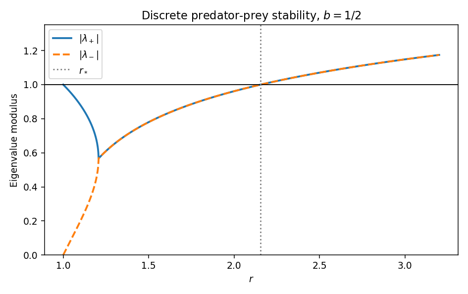

<h1 id="13b/c/solution">Solution</h1>

↑ **Parent:** [C](../c.md)

The origin has Jacobian $\begin{pmatrix}r&0\\1-b&0\end{pmatrix}$ and is unstable because $r>1$. At a positive equilibrium, $re^{-p_c}=1$, giving

$$
\boxed{p_c=\log r,\qquad n_c=\frac{r\log r}{r-b}.}
$$

The linearization is

$$
\binom{n'_{t+1}}{p'_{t+1}}=\begin{pmatrix}1&-n_c\\1-b/r&bn_c/r\end{pmatrix}\binom{n'_t}{p'_t}.
$$

Its [trace](../../../../../../matrix-trace.md) is $\tau=1+bn_c/r$ and [determinant](../../../../../../determinant.md) $n_c$. Elimination gives $n'_{t+2}-\tau n'_{t+1}+n_cn'_t=0$. For distinct roots,

$$
\boxed{n'_t=A\lambda_1^t+B\lambda_2^t,\quad p'_t=\frac{A(1-\lambda_1)\lambda_1^t+B(1-\lambda_2)\lambda_2^t}{n_c},\quad\lambda_1+\lambda_2=\tau,\quad\lambda_1\lambda_2=n_c.}
$$

At a repeated root replace the first expression by $(A+Bt)\lambda^t$ and use $p'_t=(n'_t-n'_{t+1})/n_c$.

As $r\downarrow1$, $n_c\to0$, so the roots approach one and zero. The [characteristic polynomial](../../../../../../characteristic-polynomial.md) at one is $n_c(1-b/r)>0$, putting the larger real root just below one and the other [positive root](../../../../../../positive-root.md) below it. No real root can ever equal one. Moreover

$$
\frac{dn_c}{dr}=\frac{r-b-b\log r}{(r-b)^2}>0,
$$

since its numerator exceeds $r-1-\log r>0$. At $n_c=1$, $\tau=1+b/r<2$, so the roots are conjugate and nonreal. Just above this point their modulus is $\sqrt{n_c}>1$.

The unit-disc conditions are $1-n_c>0$, $1-\tau+n_c>0$, and $1+\tau+n_c>0$. The last two hold automatically here, so stability is equivalent to $n_c<1$. The unique crossing and its [eigenvalue](../../../../../../eigenvalue.md) argument satisfy

$$
\boxed{r_*\log r_*=r_*-b,\qquad 1<r_*<e,\qquad 2\cos\theta_*=1+b/r_*.}
$$

Indeed $\log r_*=1-b/r_*<1$. This is the [stability threshold of a discrete exponential predator-prey model](../../../../../../stability-threshold-of-a-discrete-exponential-predator-prey-model.md). The sketch uses $b=1/2$: the real moduli merge and then coincide, increasing through one at the threshold. Linearization decides stability below and instability above; it does not determine nonlinear stability exactly at the crossing.

**[Figure 1](#13b/c/image-eigenvalue-moduli-and-the-stability-threshold-of-the-discrete-predator-prey-model). Eigenvalue moduli and the stability threshold of the discrete predator-prey model**.

## ↑ Ancestors (11)

1. [C](../c.md)
2. [13B](../../13b.md)
3. [Paper 2](../../../paper-2-split.md)
4. [Ii](../../../split.md)
5. [2006](../../../../split.md)
6. [Past exam of the mathematics course of the University of Cambridge](../../../../../split.md)
7. [Mathematics course of the University of Cambridge](../../../../../../mathematics-course-of-the-university-of-cambridge.md)
8. [Course of the University of Cambridge](../../../../../../course-of-the-university-of-cambridge.md)
9. [University of Cambridge](../../../../../../university-of-cambridge-split.md)
10. [List of universities](../../../../../../list-of-universities.md)
11. [Codex Wiki](../../../../../../split.md)
