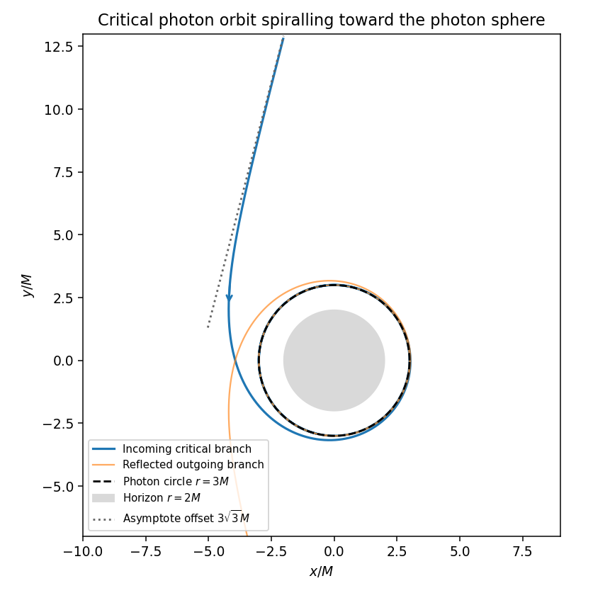

<h1 id="35a/ii/solution">Solution</h1>

↑ **Parent:** [Ii](../ii.md)

Write $c=\cosh\phi$. The proposed function is $u=(c-2)/(3M(c+1))$. Differentiating using $c'=\sinh\phi$ and $(c')^2=c^2-1$ verifies $u''+u-3Mu^2=0$. Its physical branches have $u>0$, namely $|\phi|>\phi_0=\operatorname{arcosh}2$, and

$$
r=3M\frac{\cosh\phi+1}{\cosh\phi-2}.
$$

On the positive branch it comes from infinity at $\phi_0$ and spirals toward $r=3M$ from outside as $\phi\to\infty$. The negative branch gives the reversed orbit after reflection. The interval where $u<0$ does not describe positive physical radius.

**[Figure 3](#35a/ii/image-critical-null-orbit-approaching-the-unstable-photon-circle-at-radius-three-m). Critical null orbit approaching the unstable photon circle at radius three M**.

Near $\phi_0$, $\cosh\phi-2=\sqrt3(\phi-\phi_0)+O((\phi-\phi_0)^2)$. Thus $r\sim3\sqrt3M/(\phi-\phi_0)$, while $\sin(\phi-\phi_0)\sim\phi-\phi_0$. Hence

$$
\boxed{r\sin(\phi-\phi_0)\longrightarrow\sqrt{27}M,\qquad b_{\rm impact}=3\sqrt3M.}
$$

This is the perpendicular offset of the incoming asymptote and agrees with $|L/E|$ from the [circular orbit](../../../../../../circular-orbit.md). The orbit is the critical separatrix between scattering and capture.

## ↑ Ancestors (11)

1. [Ii](../ii.md)
2. [35A](../../35a.md)
3. [Paper 2](../../../paper-2-split.md)
4. [Ii](../../../split.md)
5. [2006](../../../../split.md)
6. [Past exam of the mathematics course of the University of Cambridge](../../../../../split.md)
7. [Mathematics course of the University of Cambridge](../../../../../../mathematics-course-of-the-university-of-cambridge.md)
8. [Course of the University of Cambridge](../../../../../../course-of-the-university-of-cambridge.md)
9. [University of Cambridge](../../../../../../university-of-cambridge-split.md)
10. [List of universities](../../../../../../list-of-universities.md)
11. [Codex Wiki](../../../../../../split.md)
