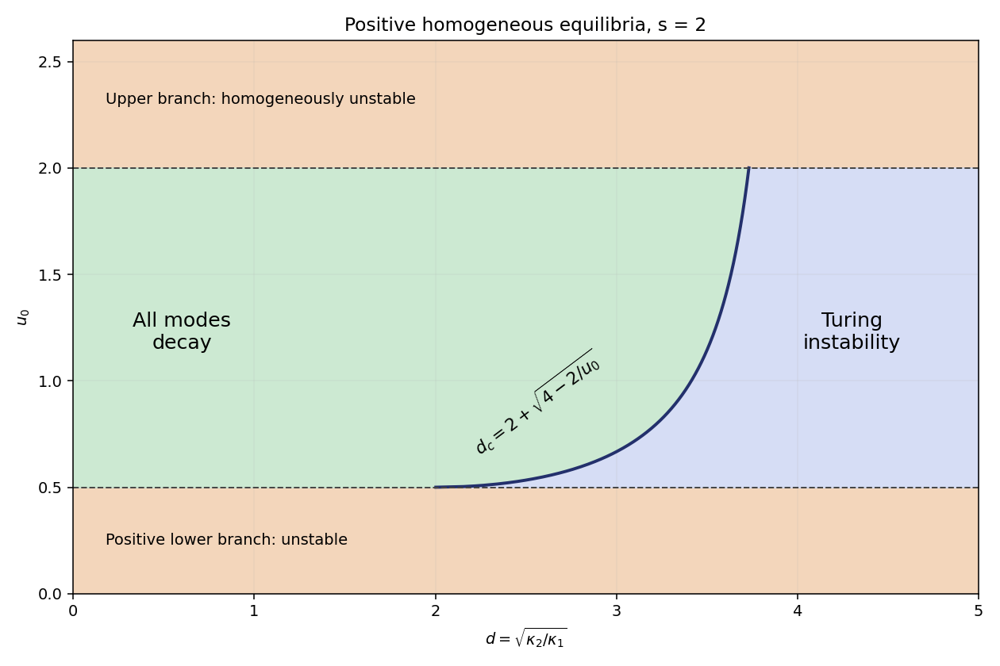

# Paper 3

↑ **Parent:** [Ii](../ii.md)

[https://www.maths.cam.ac.uk/undergrad/pastpapers/files/2006/PaperII_3.pdf](https://www.maths.cam.ac.uk/undergrad/pastpapers/files/2006/PaperII_3.pdf)

**Table of contents**

- [1H](#1h)
  - [Solution](#1h/solution)
- [2G](#2g)
  - [Solution](#2g/solution)
- [3F](#3f)
  - [Solution](#3f/solution)
- [4G](#4g)
  - [Solution](#4g/solution)
- [5I](#5i)
  - [Solution](#5i/solution)
- [6B](#6b)
  - [Solution](#6b/solution)
  - [a](#6b/a)
    - [Solution](#6b/a/solution)
  - [b](#6b/b)
    - [Solution](#6b/b/solution)
- [7E](#7e)
  - [Solution](#7e/solution)
- [8E](#8e)
  - [Solution](#8e/solution)
- [9C](#9c)
  - [Solution](#9c/solution)
  - [i](#9c/i)
    - [Solution](#9c/i/solution)
  - [ii](#9c/ii)
    - [Solution](#9c/ii/solution)
- [10D](#10d)
  - [a](#10d/a)
    - [Solution](#10d/a/solution)
  - [b](#10d/b)
    - [Solution](#10d/b/solution)
- [11H](#11h)
  - [Solution](#11h/solution)
- [12G](#12g)
  - [Solution](#12g/solution)
- [13B](#13b)
  - [a](#13b/a)
    - [Solution](#13b/a/solution)
  - [b](#13b/b)
    - [Solution](#13b/b/solution)
  - [c](#13b/c)
    - [Solution](#13b/c/solution)
- [14E](#14e)
  - [a](#14e/a)
    - [Solution](#14e/a/solution)
  - [b](#14e/b)
    - [Solution](#14e/b/solution)
  - [c](#14e/c)
    - [Solution](#14e/c/solution)
- [15C](#15c)
  - [Solution](#15c/solution)
  - [i](#15c/i)
    - [Solution](#15c/i/solution)
  - [ii](#15c/ii)
    - [Solution](#15c/ii/solution)
- [16H](#16h)
  - [Solution](#16h/solution)
  - [a](#16h/a)
    - [Solution](#16h/a/solution)
  - [b](#16h/b)
    - [Solution](#16h/b/solution)
- [17F](#17f)
  - [Solution](#17f/solution)
- [18H](#18h)
  - [Solution](#18h/solution)
- [19F](#19f)
  - [a](#19f/a)
    - [Solution](#19f/a/solution)
  - [b](#19f/b)
    - [Solution](#19f/b/solution)
  - [c](#19f/c)
    - [Solution](#19f/c/solution)
- [20H](#20h)
  - [Solution](#20h/solution)
- [21G](#21g)
  - [Solution](#21g/solution)
- [22F](#22f)
  - [Solution](#22f/solution)
- [23H](#23h)
  - [a](#23h/a)
    - [Solution](#23h/a/solution)
  - [b](#23h/b)
    - [Solution](#23h/b/solution)
- [24J](#24j)
  - [Solution](#24j/solution)
  - [a](#24j/a)
    - [Solution](#24j/a/solution)
  - [b](#24j/b)
    - [Solution](#24j/b/solution)
  - [c](#24j/c)
    - [Solution](#24j/c/solution)
- [25J](#25j)
  - [Solution](#25j/solution)
- [26J](#26j)
  - [a](#26j/a)
    - [Solution](#26j/a/solution)
  - [b](#26j/b)
    - [Solution](#26j/b/solution)
  - [c](#26j/c)
    - [Solution](#26j/c/solution)
- [27I](#27i)
  - [a](#27i/a)
    - [Solution](#27i/a/solution)
  - [b](#27i/b)
    - [Solution](#27i/b/solution)
  - [c](#27i/c)
    - [Solution](#27i/c/solution)
- [28I](#28i)
  - [Solution](#28i/solution)
- [29A](#29a)
  - [Solution](#29a/solution)
- [30B](#30b)
  - [Solution](#30b/solution)
- [31E](#31e)
  - [a](#31e/a)
    - [Solution](#31e/a/solution)
  - [b](#31e/b)
    - [Solution](#31e/b/solution)
  - [c](#31e/c)
    - [Solution](#31e/c/solution)
- [32D](#32d)
  - [Solution](#32d/solution)
- [33A](#33a)
  - [Solution](#33a/solution)
- [34D](#34d)
  - [Solution](#34d/solution)
- [35E](#35e)
  - [Solution](#35e/solution)
- [36B](#36b)
  - [Solution](#36b/solution)
- [37C](#37c)
  - [Solution](#37c/solution)
- [38C](#38c)
  - [a](#38c/a)
    - [Solution](#38c/a/solution)
  - [b](#38c/b)
    - [Solution](#38c/b/solution)

## 1H

↑ **Parent:** [Paper 3](paper-3.md)

<h3 id="1h/solution">Solution</h3>

↑ **Parent:** [1H](#1h)

For every [prime](../../../number-theory.md#prime-number) factor $p_i$ of $N$, [Fermat's little theorem](../../../number-theory.md#fermat-little-theorem) gives $a^{p_i-1}\equiv1\pmod{p_i}$. Since $p_i-1$ divides the [least common multiple](../../../number-theory.md#least-common-multiple) $\lambda(N)$, it follows that $p_i\mid a^{\lambda(N)}-1$. The [primes](../../../number-theory.md#prime-number) are distinct and hence pairwise [coprime](../../../number-theory.md#coprime-integers), so their product divides this integer. Thus

$$
\boxed{a^{\lambda(N)}\equiv1\pmod N.}
$$

For the specified product, $N=1729$ and $\lambda(N)=\operatorname{lcm}(6,12,18)=36$. Since $N-1=1728=48\cdot36$, raising the preceding [modular congruence](../../../number-theory.md#modular-congruence) to the forty-eighth power proves $a^{N-1}\equiv1\pmod N$ for every $a$ [coprime](../../../number-theory.md#coprime-integers) to $N$. This is the defining phenomenon of a [Carmichael number](../../../number-theory.md#carmichael-number).

## 2G

↑ **Parent:** [Paper 3](paper-3.md)

<h3 id="2g/solution">Solution</h3>

↑ **Parent:** [2G](#2g)

Introduce $p_{-1}=1$, $q_{-1}=0$, $p_0=a_0$ and $q_0=1$. Composition of the [Möbius transformations](../../../group-theory.md#mobius-transformation) $z\mapsto a_j+1/z$ represents a finite [continued fraction](../../../number-theory.md#continued-fraction). Their [matrices](../../../vector-space.md#matrix) give

$$
\boxed{\begin{pmatrix}p_n&p_{n-1}\\q_n&q_{n-1}\end{pmatrix}=\begin{pmatrix}a_0&1\\1&0\end{pmatrix}\begin{pmatrix}a_1&1\\1&0\end{pmatrix}\cdots\begin{pmatrix}a_n&1\\1&0\end{pmatrix}.}
$$

Indeed, multiplying the last factor gives the [linear recurrences](../../../algebra.md#linear-recurrence-relation) $p_n=a_np_{n-1}+p_{n-2}$ and $q_n=a_nq_{n-1}+q_{n-2}$, which reproduce the [continued fraction convergents](../../../number-theory.md#continued-fraction-convergent) of the [continued fraction](../../../number-theory.md#continued-fraction). Each factor has [determinant](../../../linear-algebra.md#determinant) $-1$. Taking [determinants](../../../linear-algebra.md#determinant) therefore yields

$$
\boxed{p_nq_{n-1}-q_np_{n-1}=(-1)^{n+1}.}
$$

This identity also proves that the numerator and denominator in the first column are [coprime](../../../number-theory.md#coprime-integers), so no unnoticed cancellation changes the displayed [matrix](../../../vector-space.md#matrix).

## 3F

↑ **Parent:** [Paper 3](paper-3.md)

<h3 id="3f/solution">Solution</h3>

↑ **Parent:** [3F](#3f)

Extend the [Möbius transformations](../../../group-theory.md#mobius-transformation) to isometries of three-dimensional [hyperbolic space](../../../geometry-and-topology.md#hyperbolic-space). For any interior point $o$, the [limit set of a Kleinian group](../../../topological-group.md#limit-set-of-a-kleinian-group) is the set of boundary accumulation points of $G o$. Its definition is independent of $o$: two interior orbits stay at a bounded [hyperbolic distance](../../../geometry-and-topology.md#hyperbolic-distance), so have the same boundary limits. The [Kleinian limit set](../../../topological-group.md#limit-set-of-a-kleinian-group) is closed and $G$-invariant. Iterating a [loxodromic Möbius transformation](../../../group-theory.md#loxodromic-mobius-transformation) in the positive and negative directions shows that its two fixed points belong to the [Kleinian limit set](../../../topological-group.md#limit-set-of-a-kleinian-group).

The two fixed-point sets in this problem cannot have exactly one common point. Otherwise conjugate that point to infinity and the other fixed point of the first transformation to zero. The transformations then have the forms $f(z)=\alpha z$, with $|\alpha|>1$, and $g(z)=\beta z+b$, with $b\ne0$. But $f^{-n}gf^n(z)=\beta z+b\alpha^{-n}$ is a sequence of distinct group elements converging in the [Möbius group](../../../group-theory.md#mobius-group). Taking quotients of consecutive elements gives nonidentity elements converging to the identity, contrary to [discrete subgroup](../../../topological-group.md#discrete-subgroup). Consequently the [Kleinian limit set](../../../topological-group.md#limit-set-of-a-kleinian-group) contains at least three points.

Let $\xi$ be any point of the [Kleinian limit set](../../../topological-group.md#limit-set-of-a-kleinian-group), and choose distinct $g_n$ with $g_no\to\xi$. The [rank-one convergence of divergent Möbius transformations](../../../topological-group.md#rank-one-convergence-of-divergent-mobius-transformations) supplies a subsequence converging to $\xi$ uniformly away from one exceptional boundary point $\eta$. To see the lemma directly, normalize determinant-one representing [matrices](../../../vector-space.md#matrix) by their norms. The norms tend to infinity, and a subsequential limit has rank one: its kernel is $\eta$ and its image is the attracting point. In the positive-Hermitian-matrix model of [hyperbolic space](../../../geometry-and-topology.md#hyperbolic-space), $g_no$ has this same image limit, so the attracting point is indeed $\xi$.

Choose distinct $\zeta_1,\zeta_2$ in the [Kleinian limit set](../../../topological-group.md#limit-set-of-a-kleinian-group) other than $\eta$. Then $g_n\zeta_1$ and $g_n\zeta_2$ both tend to $\xi$, belong to the [Kleinian limit set](../../../topological-group.md#limit-set-of-a-kleinian-group), and remain distinct because $g_n$ is injective. If $\xi$ were isolated, both would eventually equal $\xi$, an impossibility. **The limit set has no isolated points.**

## 4G

↑ **Parent:** [Paper 3](paper-3.md)

<h3 id="4g/solution">Solution</h3>

↑ **Parent:** [4G](#4g)

A [binary block code](../../../coding-theory.md#binary-block-code) is a subset $C\subseteq\{0,1\}^n$; its length is the common word length $n$, its size is $m=|C|$, and its [minimum distance](../../../coding-theory.md#minimum-distance-of-a-code) is the least [Hamming distance](../../../coding-theory.md#hamming-distance) between distinct words. There are $V(n,r)=\sum_{j=0}^r\binom nj$ words in a radius-$r$ [Hamming ball](../../../coding-theory.md#hamming-ball), since one chooses the positions to change.

Put $t=\lfloor(d-1)/2\rfloor$. Two radius-$t$ [Hamming balls](../../../coding-theory.md#hamming-ball) about different codewords cannot meet: otherwise the [triangle inequality](../../../topological-analysis.md#triangle-inequality) would make their centres at distance at most $2t<d$. Comparing their combined size with $2^n$ gives the [Hamming bound](../../../coding-theory.md#hamming-bound)

$$
A(n,d)V(n,t)\le2^n.
$$

For the other direction, start with one word and repeatedly add any word at distance at least $d$ from every word already selected. Finiteness ensures that this process stops. At that point the radius-$(d-1)$ [Hamming balls](../../../coding-theory.md#hamming-ball) cover the entire cube; an uncovered word could otherwise be added. These balls may overlap, but their total size is at least $2^n$. This gives the [Gilbert–Varshamov bound](../../../coding-theory.md#gilbert-varshamov-bound)

$$
\boxed{\frac{2^n}{V(n,d-1)}\le A(n,d)\le\frac{2^n}{V(n,\lfloor(d-1)/2\rfloor)}.}
$$

## 5I

↑ **Parent:** [Paper 3](paper-3.md)

<h3 id="5i/solution">Solution</h3>

↑ **Parent:** [5I](#5i)

In a [generalized linear model](../../../statistical-modelling.md#generalized-linear-model), the [linear predictor](../../../statistical-modelling.md#linear-predictor) is $\eta_i=x_i^T\beta$, a linear combination of the covariates with unknown coefficients. The [link function](../../../statistical-modelling.md#link-function) relates this predictor to the [mean](../../../probability-theory.md#expected-value): $g(\mu_i)=\eta_i$. The [canonical link function](../../../statistical-modelling.md#canonical-link-function) chooses the natural parameter of the [exponential family](../../../exponential-family.md), namely $g(\mu)=\theta(\mu)$. Differentiating the normalization of the density shows that $\mu=K'(\theta)$, so the [canonical link function](../../../statistical-modelling.md#canonical-link-function) is $(K')^{-1}$ on the admissible parameter interval.

For a [Bernoulli distribution](../../../discrete-probability-distribution.md#bernoulli-distribution), the probability mass function can be written as

$$
\mu^y(1-\mu)^{1-y}=\exp\left\{y\log\frac{\mu}{1-\mu}+\log(1-\mu)\right\}.
$$

Thus $\theta=\log(\mu/(1-\mu))$ and $K(\theta)=\log(1+e^\theta)$. **The canonical link is the logit:**

$$
\boxed{g(\mu)=\log\frac{\mu}{1-\mu},\qquad 0<\mu<1.}
$$

## 6B

↑ **Parent:** [Paper 3](paper-3.md)

<h3 id="6b/solution">Solution</h3>

↑ **Parent:** [6B](#6b)

The infection term $rIS$ is a mass-action contact rate: each infection removes one susceptible individual and adds one infected individual. Recovery at rate $aI$ transfers individuals from the infected class to the recovered class. Loss of immunity at rate $pR$ transfers recovered individuals back to the susceptible class. Thus these equations describe the [SIR model with waning immunity](../../../mathematical-biology.md#sir-model-with-waning-immunity), also called the [SIRS model](../../../mathematical-biology.md#sir-model-with-waning-immunity). Adding the equations gives $\dot S+\dot I+\dot R=0$, so $S+I+R=N$. The nonnegative population region is invariant because the derivative of any population on its zero boundary is nonnegative.

<h3 id="6b/a">a</h3>

↑ **Parent:** [6B](#6b)

<h4 id="6b/a/solution">Solution</h4>

↑ **Parent:** [A](#6b/a)

Since $S\le N$, the infected population satisfies $\dot I=(rS-a)I\le(rN-a)I$. Integration gives $I(t)\le I(0)e^{(rN-a)t}$. Hence $rN<a$ forces the infected population to decrease exponentially from the outset: **there is no epidemic outbreak**.

<h3 id="6b/b">b</h3>

↑ **Parent:** [6B](#6b)

<h4 id="6b/b/solution">Solution</h4>

↑ **Parent:** [B](#6b/b)

For $rN>a$ and $p>0$, a nonzero infected [equilibrium](../../../dynamical-systems.md#equilibrium-point-of-a-dynamical-system) requires $S_*=a/r$. Using $aI_*=pR_*$ and population conservation gives

$$
\boxed{S_*=\frac ar,\qquad I_*=\frac{p}{a+p}\left(N-\frac ar\right),\qquad R_* =\frac{a}{a+p}\left(N-\frac ar\right).}
$$

Eliminate $R=N-S-I$ before assessing [stability](../../../numerical-analysis.md#stability-of-a-numerical-method), since perturbations must preserve the total population. The resulting [Jacobian matrix](../../../calculus.md#jacobian-matrix) at this [endemic equilibrium](../../../mathematical-biology.md#endemic-equilibrium) is

$$
J=\begin{pmatrix}-p-rI_*&-p-a\\rI_*&0\end{pmatrix},\quad \operatorname{tr}J=-\frac{p(p+rN)}{a+p},\quad\det J=p(rN-a).
$$

Its [trace](../../../linear-algebra.md#matrix-trace) is negative and its [determinant](../../../linear-algebra.md#determinant) positive, so both [eigenvalues](../../../linear-operator-theory.md#eigenvalue) have negative real part: **the endemic equilibrium is locally asymptotically stable on the fixed-population plane**. The full three-variable system has a neutral direction corresponding to changing the conserved population.

Writing $\kappa=rN-a>0$, as $p\to0$ the [trace](../../../linear-algebra.md#matrix-trace) is $-prN/a+O(p^2)$ and the [determinant](../../../linear-algebra.md#determinant) is $p\kappa$. Hence the [discriminant](../../../polynomial.md#discriminant) $(\operatorname{tr}J)^2-4\det J=-4p\kappa+O(p^2)<0$. As $p\to\infty$, the [trace](../../../linear-algebra.md#matrix-trace) is $-p-\kappa+O(p^{-1})$ and the [determinant](../../../linear-algebra.md#determinant) is again $p\kappa$, giving a positive [discriminant](../../../polynomial.md#discriminant) $p^2+O(p)$. Both quantities are $O(p)$ in both limits, but the [eigenvalues](../../../linear-operator-theory.md#eigenvalue) are **complex for sufficiently small $p$ and real for sufficiently large $p$**.

## 7E

↑ **Parent:** [Paper 3](paper-3.md)

<h3 id="7e/solution">Solution</h3>

↑ **Parent:** [7E](#7e)

Representative [normal forms](../../../dynamical-systems.md#normal-form-dynamical-systems) are $\dot x=\mu+x^2$ for a [saddle-node bifurcation](../../../dynamical-systems.md#saddle-node-bifurcation), $\dot x=\mu x-x^2$ for a [transcritical bifurcation](../../../dynamical-systems.md#transcritical-bifurcation), and $\dot x=\mu x-x^3$ for a supercritical [pitchfork bifurcation](../../../dynamical-systems.md#pitchfork-bifurcation-normal-form). Replacing the last cubic term by $+x^3$ gives the subcritical [pitchfork bifurcation](../../../dynamical-systems.md#pitchfork-bifurcation-normal-form).

Treat $\mu$ as a variable with $\dot\mu=0$. The extended [center manifold](../../../dynamical-systems.md#center-manifold) is tangent to $y=0$, so write $y=h(x,\mu)=Ax^2+Bx\mu+C\mu^2+O((|x|+|\mu|)^3)$. Its invariance equation is $h_x\dot x=\dot y$. At quadratic order this reads

$$
(2Ax+B\mu)\mu=(2-A)x^2-Bx\mu-C\mu^2.
$$

Matching coefficients gives $A=2$, $B=-4$, $C=4$. Substitution into the first equation therefore gives

$$
\boxed{y=2x^2-4x\mu+4\mu^2+O(3),\qquad\dot x=\mu+x^2-4x\mu+4\mu^2+O(3).}
$$

Here $O(3)$ denotes total degree at least three in $(x,\mu)$. With $T=t$, $X=x-2\mu$ and $\widetilde\mu=\mu$, this becomes $dX/dT=\widetilde\mu+X^2+O(3)$. Thus $\alpha=1$, $\beta=2$, $\gamma(\mu)=\mu$, and **the bifurcation is a saddle-node**. For negative parameter, the negative-$X$ branch is stable and the positive-$X$ branch unstable along the [center manifold](../../../dynamical-systems.md#center-manifold); the transverse [eigenvalue](../../../linear-operator-theory.md#eigenvalue) is near $-1$.

## 8E

↑ **Parent:** [Paper 3](paper-3.md)

<h3 id="8e/solution">Solution</h3>

↑ **Parent:** [8E](#8e)

For real $b\ne0$, the integrand depends only on $b^2$, so first take $b>0$. Integrate $e^{iz}/(z^2-b^2)$ over the upper-half-plane semicircle, indenting above both real poles with small clockwise semicircles. The large arc tends to zero by [Jordan lemma](../../../complex-analysis.md#jordan-s-lemma). Each indentation contributes $-i\pi$ times its [residue](../../../analysis.md#residue), and there are no enclosed poles. Thus the [Cauchy principal value](../../../complex-analysis.md#cauchy-principal-value) on the whole real axis is

$$
\operatorname{PV}\int_{-\infty}^{\infty}\frac{e^{iu}}{u^2-b^2}\,du=i\pi\left(\frac{e^{ib}}{2b}-\frac{e^{-ib}}{2b}\right)=-\frac{\pi\sin b}{b}.
$$

The imaginary part is odd and the real part even. Taking the real part and halving gives

$$
\boxed{\operatorname{PV}\int_0^\infty\frac{\cos u}{u^2-b^2}\,du=-\frac{\pi\sin b}{2b}.}
$$

The right-hand side is even in $b$, completing the negative-$b$ case as well.

## 9C

↑ **Parent:** [Paper 3](paper-3.md)

<h3 id="9c/solution">Solution</h3>

↑ **Parent:** [9C](#9c)

The bob has $\dot x=\ell\cos\theta\,\dot\theta$ and $\dot y=at-\ell\sin\theta\,\dot\theta$. Substituting these into the [Lagrangian](../../../calculus-of-variations.md#lagrangian) gives

$$
L=\tfrac12m\ell^2\dot\theta^2-ma\ell t\sin\theta\,\dot\theta+mg\ell\cos\theta+\tfrac12m(a^2+ga)t^2.
$$

The mixed term is $\frac{d}{dt}(ma\ell t\cos\theta)-ma\ell\cos\theta$. Removing this total derivative and the time-only term leaves the equivalent [Lagrangian](../../../calculus-of-variations.md#lagrangian) $L_{\rm eff}=\frac12m\ell^2\dot\theta^2+m(g-a)\ell\cos\theta$. The [Euler-Lagrange equation](../../../analysis.md#euler-lagrange-equation) becomes

$$
\boxed{\ddot\theta+\frac{g-a}{\ell}\sin\theta=0.}
$$

In free fall, $a=g$, so $\theta=\theta_0+\omega_0t$: a bob initially at rest relative to the lift remains at its initial angle, and otherwise moves around the pivot with constant angular speed. Every constant angle is then an [equilibrium](../../../dynamical-systems.md#equilibrium-point-of-a-dynamical-system), with no restoring force. For $a\ne g$, the [equilibria](../../../dynamical-systems.md#equilibrium-point-of-a-dynamical-system) are $\theta=0$ and $\theta=\pi$ modulo $2\pi$.

<h3 id="9c/i">i</h3>

↑ **Parent:** [9C](#9c)

<h4 id="9c/i/solution">Solution</h4>

↑ **Parent:** [I](#9c/i)

Near $\theta=0$, the linearized equation is $\ddot\theta+(g-a)\theta/\ell=0$. When $a<g$ this is an [harmonic oscillator](../../../classical-mechanics.md#simple-harmonic-motion), so the downward configuration is stable. Writing $\theta=\pi+\varepsilon$ instead gives $\ddot\varepsilon-(g-a)\varepsilon/\ell=0$, with an exponentially growing solution. **Downward is stable; upward is unstable.**

<h3 id="9c/ii">ii</h3>

↑ **Parent:** [9C](#9c)

<h4 id="9c/ii/solution">Solution</h4>

↑ **Parent:** [Ii](#9c/ii)

When $a>g$, the signs reverse. The downward configuration has an exponentially growing disturbance, whereas near $\theta=\pi$ one obtains $\ddot\varepsilon+(a-g)\varepsilon/\ell=0$. **Upward is stable; downward is unstable.** The effective gravity in the descending lift points upward in this case.

## 10D

↑ **Parent:** [Paper 3](paper-3.md)

<h3 id="10d/a">a</h3>

↑ **Parent:** [10D](#10d)

<h4 id="10d/a/solution">Solution</h4>

↑ **Parent:** [A](#10d/a)

A thin spherical shell has mass $4\pi r^2\rho\,dr$ and inward gravitational force $Gm(r)(4\pi r^2\rho\,dr)/r^2$. The net outward pressure force is $-4\pi r^2P'(r)\,dr$. Their balance gives the [hydrostatic equilibrium](../../../statistical-physics.md#hydrostatic-equilibrium) equation

$$
\boxed{P'=-\frac{Gm\rho}{r^2}.}
$$

Since $m'=4\pi r^2\rho$, multiplying by $r^2/\rho$ and differentiating yields $\frac{d}{dr}(r^2P'/\rho)=-4\pi Gr^2\rho$.

At the centre, require $m(0)=0$ and finite $P(0)$ and $\rho(0)$. Spherical symmetry gives $P'(0)=0$; indeed $m(r)=O(r^3)$ makes the pressure gradient $O(r)$ for regular density. At the surface require $P(R)=P_{\rm ext}$, usually approximated by zero, because pressure matches the surrounding medium. If the stellar mass is prescribed, also impose $m(R)=M$. An [equation of state](../../../thermodynamics.md#equation-of-state) is needed to close the system. A vanishing surface density is appropriate for some stellar models but is not a universal boundary condition.

<h3 id="10d/b">b</h3>

↑ **Parent:** [10D](#10d)

<h4 id="10d/b/solution">Solution</h4>

↑ **Parent:** [B](#10d/b)

After its giant phases, the Sun ejects much of its envelope and leaves a carbon–oxygen [white dwarf](../../../stellar-astrophysics.md#white-dwarf). The remnant mass lies below the [Chandrasekhar limit](../../../stellar-astrophysics.md#chandrasekhar-limit). Its support is chiefly [electron degeneracy pressure](../../../statistical-physics.md#electron-degeneracy-pressure): the [Pauli exclusion principle](../../../quantum-mechanics.md#pauli-exclusion-principle) forces electrons into distinct momentum states even at low temperature, giving $P\propto\rho^{5/3}$ when they are nonrelativistic. Consequently pressure support need not cease when nuclear burning ends. The [white dwarf](../../../stellar-astrophysics.md#white-dwarf) subsequently cools and fades.

The process called inverse beta decay here is [electron capture](../../../physics.md#electron-capture), $e^-+p\to n+\nu_e$, becomes possible for free particles when the electron's total energy exceeds approximately $(m_n-m_p)c^2\simeq2.6m_ec^2$, corresponding to a kinetic energy about $1.6m_ec^2$. Electron capture on nuclei has thresholds modified by nuclear binding energies. In a solar-mass progenitor's ordinary [white dwarf](../../../stellar-astrophysics.md#white-dwarf) remnant, the [Fermi energy](../../../statistical-physics.md#fermi-energy) is below the relevant capture thresholds, so the electron population providing support is stable. At much higher density, electron capture can reduce the electron density and pressure and promote collapse; this is why stability against [electron capture](../../../physics.md#electron-capture) matters in assessing degeneracy support. **The Sun ends as a cooling white dwarf, rather than a neutron star.**

## 11H

↑ **Parent:** [Paper 3](paper-3.md)

<h3 id="11h/solution">Solution</h3>

↑ **Parent:** [11H](#11h)

The [Prime number theorem](../../../analytic-number-theory.md#prime-number-theorem) states that $\pi(x)\sim x/\log x$, where $\pi(x)$ counts [primes](../../../number-theory.md#prime-number) not exceeding $x$. [Dirichlet theorem on primes in arithmetic progressions](../../../analytic-number-theory.md#dirichlet-s-theorem-on-arithmetic-progressions) states that if $\gcd(a,m)=1$, then the progression $a+jm$ contains infinitely many [primes](../../../number-theory.md#prime-number).

If $x^2\equiv-1\pmod p$ for an odd [prime](../../../number-theory.md#prime-number) $p$, the multiplicative order of $x$ modulo $p$ is four. [Lagrange's theorem](../../../group-theory.md#lagrange-s-theorem) therefore gives $4\mid p-1$. Conversely, [Wilson's theorem](../../../number-theory.md#wilson-s-theorem) gives $(p-1)!\equiv-1\pmod p$. Pairing the factors $j$ and $p-j$ yields

$$
(-1)^{(p-1)/2}\left(\left(\frac{p-1}{2}\right)!\right)^2\equiv-1\pmod p.
$$

For $p\equiv1\pmod4$, the sign is positive, so the factorial supplies a square root of $-1$. Thus **$-1$ is a quadratic residue exactly when $p\equiv1\pmod4$**.

Write $P=\prod_jp_j$. The odd integer $4P-1$ is $3$ modulo $4$. If all of its [prime factors](../../../number-theory.md#prime-factor) were $1$ modulo $4$, their product, with multiplicities, would be $1$ modulo $4$, so at least one factor is $3$ modulo $4$. Every [prime factor](../../../number-theory.md#prime-factor) $q$ of $4P^2+1$ is odd and satisfies $(2P)^2\equiv-1\pmod q$; the criterion just proved gives $q\equiv1\pmod4$. Neither integer is divisible by any $p_j$, since their residues modulo $p_j$ are respectively $-1$ and $1$. Starting with any finite list thus produces a new [prime](../../../number-theory.md#prime-number) in each residue class. **Both classes contain infinitely many primes**, independently of the general [Dirichlet theorem on primes in arithmetic progressions](../../../analytic-number-theory.md#dirichlet-s-theorem-on-arithmetic-progressions).

## 12G

↑ **Parent:** [Paper 3](paper-3.md)

<h3 id="12g/solution">Solution</h3>

↑ **Parent:** [12G](#12g)

In the [RSA cryptosystem](../../../algebra.md#rsa-cryptosystem), choose distinct large [primes](../../../number-theory.md#prime-number) $p,q$, put $N=pq$, choose $e$ [coprime](../../../number-theory.md#coprime-integers) to $\varphi(N)=(p-1)(q-1)$, and choose $d$ with $ed\equiv1\pmod{\varphi(N)}$. Publish $(N,e)$ and keep the factorization and $d$ private. Encrypt a properly encoded message $M$ as $C=M^e\bmod N$ and decrypt as $M=C^d\bmod N$. The [Chinese remainder theorem](../../../mathematics.md#chinese-remainder-theorem) proves correctness even for nonunits: modulo either prime, the message is either zero or satisfies [Fermat's little theorem](../../../number-theory.md#fermat-little-theorem).

The public exponent $65537=2^{16}+1$ has few nonzero binary digits, so exponentiation needs only sixteen squarings and one extra multiplication. It is an efficient conventional choice, subject to the required [coprimality](../../../number-theory.md#coprime-integers) and secure randomized message encoding. The same numerical choice for the private exponent would speed decryption, but for large moduli with balanced prime factors it is disastrously small: the continued-fraction attack on a small RSA private exponent recovers $d$ when, for example, $d<\frac13N^{1/4}$ and $q<p<2q$. **A small public exponent and a small private exponent have very different security implications.**

To factor $N$ from $e,d$, write $ed-1=2^st$ with $t$ odd. Choose random $a$ modulo $N$. If $\gcd(a,N)$ is nontrivial, factoring is already done. Otherwise compute $b=a^t$ and repeatedly square; the final value is one. If a value $x$ immediately preceding the first one is neither $1$ nor $-1$ modulo $N$, then $x^2\equiv1\pmod N$ and

$$
\boxed{\gcd(x-1,N)\text{ is a nontrivial factor of }N.}
$$

Indeed, the signs of $x$ modulo $p$ and $q$ differ. Restart if the chain begins at one or reaches $-1$ first. The [Chinese remainder theorem](../../../mathematics.md#chinese-remainder-theorem) makes the two prime components independent for a uniformly chosen unit. Their two-primary orders differ with probability at least one half: if the two exponents of two in $p-1,q-1$ are equal, the probability of equal orders is at most one half, and if unequal it is smaller. Since odd $t$ preserves these orders, this gives a randomized factoring procedure with bounded expected repetitions.

A [bit commitment](../../../computer-science.md#bit-commitment) must be hiding before opening and binding after it. A concrete RSA construction uses a valid public RSA permutation whose inverse is unavailable to the receiver. Choose a random unit $x$ and a random bit vector $r$, and set $h(x,r)$ to their binary inner product modulo two. Send $y=x^e\bmod N$, $r$, and $c=b\mathbin{\oplus}h(x,r)$. To open, reveal $x$; the receiver checks $x^e=y$ and recovers $b=c\mathbin{\oplus}h(x,r)$. Injectivity makes the opening bit unique. The [hard-core predicate](../../../computer-science.md#hard-core-predicate) theorem applied to $(x,r)\mapsto(x^e,r)$ gives computational hiding under the RSA inversion assumption. The setup must ensure a valid modulus and exponent without giving the receiver the private exponent; otherwise hiding fails. Merely encrypting $0$ or $1$ would not hide a bit, since both ciphertexts could be computed publicly.

## 13B

↑ **Parent:** [Paper 3](paper-3.md)

<h3 id="13b/a">a</h3>

↑ **Parent:** [13B](#13b)

<h4 id="13b/a/solution">Solution</h4>

↑ **Parent:** [A](#13b/a)

A homogeneous [equilibrium](../../../dynamical-systems.md#equilibrium-point-of-a-dynamical-system) has $v_0=u_0^2$. Besides $u_0=0$, a nonzero [equilibrium](../../../dynamical-systems.md#equilibrium-point-of-a-dynamical-system) satisfies $r=u_0^2-u_0$, giving $u_\pm=(1\pm\sqrt{1+4r})/2$. Concentrations are nonnegative, so only nonnegative roots are physically admissible. At a positive [equilibrium](../../../dynamical-systems.md#equilibrium-point-of-a-dynamical-system), the reaction [Jacobian matrix](../../../calculus.md#jacobian-matrix) is

$$
J=\begin{pmatrix}u_0&-u_0\\2su_0&-s\end{pmatrix},\qquad \operatorname{tr}J=u_0-s,\qquad\det J=su_0(2u_0-1).
$$

Negative [trace](../../../linear-algebra.md#matrix-trace) and positive [determinant](../../../linear-algebra.md#determinant) are equivalent to

$$
\boxed{\tfrac12<u_0<s.}
$$

Thus a positive homogeneous stable branch exists precisely when $s>1/2$ and $-1/4<r<s^2-s$, on the upper root $u_+$. The lower positive branch has negative [determinant](../../../linear-algebra.md#determinant) and is unstable. At $r=-1/4$ the branches meet and have a zero [eigenvalue](../../../linear-operator-theory.md#eigenvalue); at $u_0=s$ the strict linear stability condition also fails.

The trivial [equilibrium](../../../dynamical-systems.md#equilibrium-point-of-a-dynamical-system) $(0,0)$ has [eigenvalues](../../../linear-operator-theory.md#eigenvalue) $r,-s$, so it is asymptotically stable for $r<0$. It exists for all $r$, independently of the nonzero branches. If negative $u_0$ were allowed mathematically, the negative branch for $r>0$ would also be homogeneously stable, but it does not represent a chemical concentration.

<h3 id="13b/b">b</h3>

↑ **Parent:** [13B](#13b)

<h4 id="13b/b/solution">Solution</h4>

↑ **Parent:** [B](#13b/b)

A [Fourier mode](../../../fourier-analysis.md#fourier-mode) with $q=k^2\ge0$ evolves under $J-q\operatorname{diag}(\kappa_1,\kappa_2)$. Its [trace](../../../linear-algebra.md#matrix-trace) remains negative for a homogeneously stable positive branch. Its [determinant](../../../linear-algebra.md#determinant) is

$$
D(q)=\kappa_1\kappa_2q^2+(s\kappa_1-u_0\kappa_2)q+s(2u_0^2-u_0).
$$

If $u_0\kappa_2\le s\kappa_1$, this is positive for every $q\ge0$. Otherwise its minimum is attained at $q_*=(u_0\kappa_2-s\kappa_1)/(2\kappa_1\kappa_2)$. Stability requires $D(q_*)>0$, or

$$
u_0\kappa_2-s\kappa_1<2\sqrt{\kappa_1\kappa_2s(2u_0^2-u_0)}.
$$

In terms of $d=\sqrt{\kappa_2/\kappa_1}$, the boundary is the positive root of $u_0d^2-s=2d\sqrt{s(2u_0^2-u_0)}$:

$$
\boxed{d_c(u_0)=\sqrt{2s}+\frac{\sqrt{s(2u_0^2-u_0)}}{u_0}.}
$$

Within $1/2<u_0<s$, all modes decay for $d<d_c$; a finite band grows for $d>d_c$, giving a [Turing instability](../../../diffusion-equation.md#turing-instability). Equality is neutral at one nonzero [wavenumber](../../../wave-equation.md#wavenumber).

For $s=2$, the positive lower branch $0<u_0<1/2$ is unstable for every $d$. The upper branch is homogeneously stable for $1/2<u_0<2$: it is stable to all modes to the left of $d_c=2+\sqrt{4-2/u_0}$ and unstable to spatial modes to the right. For $u_0>2$ it is already homogeneously unstable. The zero branch is stable to every spatial mode when $r<0$, because its mode [eigenvalues](../../../linear-operator-theory.md#eigenvalue) are $r-\kappa_1k^2$ and $-s-\kappa_2k^2$.

**[Figure 1](#13b/b/image-positive-homogeneous-branches-and-their-spatial-stability-for-s-equals-two). Positive homogeneous branches and their spatial stability for s equals two**.

<h3 id="13b/c">c</h3>

↑ **Parent:** [13B](#13b)

<h4 id="13b/c/solution">Solution</h4>

↑ **Parent:** [C](#13b/c)

At onset the [determinant](../../../linear-algebra.md#determinant) has a double root, so

$$
k_c^2=\frac{u_0\kappa_2-s\kappa_1}{2\kappa_1\kappa_2}=\frac{u_0d^2-s}{2d\sqrt{\kappa_1\kappa_2}}.
$$

Squaring the neutral-boundary equation and canceling the positive factors gives $u_0=s/[d(2\sqrt{2s}-d)]$. Substitution yields

$$
\boxed{k_c^2=\frac{1}{\sqrt{\kappa_1\kappa_2}}\frac{s(d-\sqrt{2s})}{d(2\sqrt{2s}-d)}.}
$$

For a positive branch with $u_0>1/2$, the actual neutral curve lies strictly between $\sqrt{2s}$ and $2\sqrt{2s}$. If $d<\sqrt{2s}$, then $d<d_c(u_0)$ for every such branch: a homogeneously stable state cannot have this [Turing instability](../../../diffusion-equation.md#turing-instability). If $d>2\sqrt{2s}$, then $d>d_c(u_0)$ for every finite positive $u_0$, so every homogeneously stable positive state is spatially unstable. The negative value yielded by the displayed formula outside its boundary domain is not a physical critical [wavenumber](../../../wave-equation.md#wavenumber) and does not imply renewed stability. One must also keep $u_0<s$, which can restrict the attainable neutral curve further.

## 14E

↑ **Parent:** [Paper 3](paper-3.md)

<h3 id="14e/a">a</h3>

↑ **Parent:** [14E](#14e)

<h4 id="14e/a/solution">Solution</h4>

↑ **Parent:** [A](#14e/a)

Write the [Papperitz symbol](../../../complex-analysis.md#papperitz-symbol) by listing pairs of exponents at $0,1,\infty$. For $F(a,c-b;c;w)$ they are $(0,1-c)$, $(0,b-a)$, and $(a,c-b)$. Under $w=z/(z-1)$ the points $0,1,\infty$ in the $z$-plane correspond respectively to $0,\infty,1$ in the $w$-plane. Thus the pulled-back exponents are $(0,1-c)$ at zero, $(a,c-b)$ at one, and $(0,b-a)$ at infinity.

Multiplication by $(1-z)^{-a}$ shifts the exponents at one by $-a$ and those at infinity by $+a$, yielding

$$
P\left\{\begin{array}{ccc|c}0&1&\infty&z\\0&0&a&\\1-c&c-a-b&b&\end{array}\right\}.
$$

This is the original [Gauss hypergeometric equation](../../../complex-analysis.md#gauss-hypergeometric-equation). Both functions are analytic and normalized to one at zero, so uniqueness of that normalized local solution proves the [Pfaff transformation](../../../complex-analysis.md#pfaff-transformation)

$$
\boxed{F(a,b;c;z)=(1-z)^{-a}F\left(a,c-b;c;\frac z{z-1}\right).}
$$

Continue the identity using the branch $|\arg(1-z)|<\pi$. As usual, the parameters must admit the normalized hypergeometric solution; excluded singular parameter values are treated only when their limiting solution exists.

<h3 id="14e/b">b</h3>

↑ **Parent:** [14E](#14e)

<h4 id="14e/b/solution">Solution</h4>

↑ **Parent:** [B](#14e/b)

For $F(a,1+a-c;1+a-b;w)$, the exponents at $w=0,1,\infty$ are $(0,b-a)$, $(0,c-a-b)$, and $(a,1+a-c)$. The substitution $w=1/z$ exchanges zero and infinity, giving $(a,1+a-c)$ at $z=0$, $(0,c-a-b)$ at one, and $(0,b-a)$ at infinity. Multiplication by $(-z)^{-a}$ shifts the zero exponents by $-a$ and the infinity exponents by $+a$. The resulting [Papperitz symbol](../../../complex-analysis.md#papperitz-symbol) is again $(0,1-c)$, $(0,c-a-b)$, $(a,b)$. Therefore **$w_1$ satisfies the same hypergeometric equation**, with the stated branch $|\arg(-z)|<\pi$.

<h3 id="14e/c">c</h3>

↑ **Parent:** [14E](#14e)

<h4 id="14e/c/solution">Solution</h4>

↑ **Parent:** [C](#14e/c)

First assume $a-b\notin\mathbb Z$ and nonsingular parameters, so the two infinity solutions $w_1$ and $w_2$, obtained by exchanging $a,b$, are independent. Write $F=Aw_1+Bw_2$. Since the power series at $1/z=0$ starts at one, $w_1\sim(-z)^{-a}$ and $w_2\sim(-z)^{-b}$.

In the parameter region $\Re(b-a)>0$, let $z\to-\infty$ in the [Pfaff transformation](../../../complex-analysis.md#pfaff-transformation). The $w_2$ term vanishes after multiplication by $(-z)^a$, while $z/(z-1)\to1$ and $(-z)/(1-z)\to1$. The supplied value at one of the [Gauss hypergeometric function](../../../complex-analysis.md#hypergeometric-function) therefore gives

$$
A=F(a,c-b;c;1)=\frac{\Gamma(c)\Gamma(b-a)}{\Gamma(b)\Gamma(c-a)}.
$$

Analytic continuation in the parameters extends this coefficient to the nonresonant parameter domain. Exchange $a,b$ to determine $B$. Hence the [hypergeometric connection formula at infinity](../../../complex-analysis.md#hypergeometric-connection-formula-at-infinity) is

$$
\boxed{F(a,b;c;z)=\frac{\Gamma(c)\Gamma(b-a)}{\Gamma(b)\Gamma(c-a)}w_1(z)+\frac{\Gamma(c)\Gamma(a-b)}{\Gamma(a)\Gamma(c-b)}w_2(z).}
$$

The branch is $|\arg(-z)|<\pi$. The existence of $F(a,b;c;1)$ alone does not exclude integer $a-b$. At such resonant values the two separate displayed terms can be singular; the correct statement takes their combined parameter limit, which can contain logarithms. This qualification is essential, for example when $a=b$.

## 15C

↑ **Parent:** [Paper 3](paper-3.md)

<h3 id="15c/solution">Solution</h3>

↑ **Parent:** [15C](#15c)

The azimuthal coordinate is cyclic, so its [canonical momentum](../../../classical-mechanics.md#canonical-momentum) is conserved. Time independence of the [Lagrangian](../../../calculus-of-variations.md#lagrangian) also conserves the [energy](../../../classical-mechanics.md#energy). The two constants are

$$
\boxed{h=m\ell^2\sin^2\theta\,\dot\phi,\qquad E=\tfrac12m\ell^2(\dot\theta^2+\sin^2\theta\,\dot\phi^2)-mg\ell\cos\theta.}
$$

For a horizontal launch from depth $D$, take $0<D<\ell$, so $\cos\theta_0=D/\ell$, $\dot\theta_0=0$, and $v=\ell\sin\theta_0\dot\phi_0$. Thus $h=mv\sqrt{\ell^2-D^2}$ and $E=\frac12mv^2-mgD$. The meridional motion has [effective potential](../../../physics.md#effective-potential) $U(\theta)=h^2/(2m\ell^2\sin^2\theta)-mg\ell\cos\theta$.

<h3 id="15c/i">i</h3>

↑ **Parent:** [15C](#15c)

<h4 id="15c/i/solution">Solution</h4>

↑ **Parent:** [I](#15c/i)

Grazing the equator makes it a turning point, so $\dot\theta=0$ at $\theta=\pi/2$. Conservation of [energy](../../../classical-mechanics.md#energy) gives $\frac12mv^2-mgD=h^2/(2m\ell^2)=\frac12mv^2(1-D^2/\ell^2)$. Therefore

$$
\boxed{v^2=\frac{2g\ell^2}{D}.}
$$

To check that no earlier turning point prevents reaching the equator, put $c=\cos\theta$. On $0\le c\le D/\ell$, $U(c)=h^2/[2m\ell^2(1-c^2)]-mg\ell c$ is strictly convex. Its two endpoint values are equal for this speed, so its interior values are smaller. The trajectory can therefore move between the launch point and the equator. The equator is genuinely a turning point since $dU/d\theta=mg\ell$ there.

<h3 id="15c/ii">ii</h3>

↑ **Parent:** [15C](#15c)

<h4 id="15c/ii/solution">Solution</h4>

↑ **Parent:** [Ii](#15c/ii)

For fixed $\theta$, the [Euler-Lagrange equation](../../../analysis.md#euler-lagrange-equation) for the meridional coordinate requires $\dot\phi^2\cos\theta=g/\ell$. Combining this with $v=\ell\sin\theta\dot\phi$ and $\cos\theta=D/\ell$ gives

$$
\boxed{v^2=\frac{g(\ell^2-D^2)}{D}.}
$$

The resulting motion is a [conical pendulum](../../../classical-mechanics.md#conical-pendulum). The positive-depth condition is necessary for a nondegenerate constant-latitude orbit in gravity; the bottom point is the limiting zero-speed equilibrium.

## 16H

↑ **Parent:** [Paper 3](paper-3.md)

<h3 id="16h/solution">Solution</h3>

↑ **Parent:** [16H](#16h)

A [first-order structure](../../../mathematical-logic.md#first-order-structure) consists of a nonempty domain, an interpretation of each constant as a domain element, each $k$-ary function symbol as a map from the $k$-fold domain product to the domain, and each $k$-ary relation symbol as a subset of that product. Under an assignment of values to variables, terms are evaluated recursively. Atomic formulas assert equality of term values or membership in an interpreted relation. Boolean connectives act on truth values, and quantifiers range over the whole domain. The set $[[\varphi]]_A$ consists of assignments to the free variables making the formula true.

For a [substructure](../../../mathematical-logic.md#substructure-of-a-first-order-structure) $B\subseteq A$, constants lie in $B$, functions restrict to $B$, and relations restrict to tuples from $B$. Induction on terms shows that every term with arguments from $B$ has the same value in both structures. Atomic formulas consequently have the same truth values, and induction on Boolean connectives gives

$$
\boxed{[[\varphi]]_B=[[\varphi]]_A\cap B^n}
$$

for every [quantifier-free formula](../../../mathematical-logic.md#quantifier-free-formula).

For a nonempty chain of $T$-model [substructures](../../../mathematical-logic.md#substructure-of-a-first-order-structure), form their union $U$. Every finite tuple belongs to one member of the chain, so $U$ is closed under all interpreted functions and contains the constants. Consider any inductive axiom $\forall x\,\exists y\,\psi(x,y)$. A specified finite tuple $x$ lies in one member, which supplies witnesses $y$ there. The [quantifier-free formula](../../../mathematical-logic.md#quantifier-free-formula) $\psi$ has the same truth value in that member and $U$, so $U$ satisfies the axiom. Hence $U$ is a $T$-model and the least upper bound of the chain. **The poset is complete for nonempty chains.** If chain-complete is defined to include the empty chain, a least element must additionally exist, which the stated hypotheses do not ensure.

<h3 id="16h/a">a</h3>

↑ **Parent:** [16H](#16h)

<h4 id="16h/a/solution">Solution</h4>

↑ **Parent:** [A](#16h/a)

The reflexivity, antisymmetry, transitivity and totality axioms for a [total order](../../../set.md#total-order) are universal with [quantifier-free formula](../../../mathematical-logic.md#quantifier-free-formula) matrices, and hence inductive with an empty existential block. Add $\forall x\,\exists y\,(y<x)$ and $\forall x\,\exists z\,(x<z)$, with strict inequalities expressed using $\le$ and inequality. These exclude least and greatest elements. **This theory is inductive.**

<h3 id="16h/b">b</h3>

↑ **Parent:** [16H](#16h)

<h4 id="16h/b/solution">Solution</h4>

↑ **Parent:** [B](#16h/b)

For each positive integer $n$, the finite ordered interval $[-n,n]\cap\mathbb Z$ has a greatest and a least element, and these intervals form a chain of [substructures](../../../mathematical-logic.md#substructure-of-a-first-order-structure). Their union is $\mathbb Z$, which has neither. An [inductive first-order theory](../../../foundations-of-mathematics.md#inductive-first-order-theory) must be preserved by such unions, as proved above. **The theory with both endpoints cannot be axiomatized inductively**, even though it has an ordinary first-order axiomatization with existential–universal endpoint sentences.

## 17F

↑ **Parent:** [Paper 3](paper-3.md)

<h3 id="17f/solution">Solution</h3>

↑ **Parent:** [17F](#17f)

Define the asymmetric [Ramsey number](../../../ramsey-theory.md#ramsey-number) $R(s,t)$ for a red $K_s$ or a blue $K_t$. The base cases $R(1,t)=R(s,1)=1$ are finite. If $n=R(s-1,t)+R(s,t-1)$, choose a vertex of $K_n$. Its red neighbors number at least $R(s-1,t)$, or its blue neighbors number at least $R(s,t-1)$. Apply the appropriate smaller [Ramsey number](../../../ramsey-theory.md#ramsey-number) inside that neighborhood: either the opposite-color clique already exists, or a same-color clique extends by the chosen vertex. Thus $R(s,t)\le R(s-1,t)+R(s,t-1)$, proving finiteness by induction, in particular for $R(s)=R(s,s)$.

In a graph of [maximum degree](../../../graph-theory.md#maximum-degree) $d\ge2$, a ball of radius $k-1$ about a vertex has at most $\sum_{j=0}^{k-1}d^j=(d^k-1)/(d-1)<d^k$ vertices. Hence a connected graph of order $d^k$ has a vertex outside this ball, at distance at least $k$. The argument also applies whenever the graph has at least $d^k$ vertices.

Now take a connected graph of order $R(s)^s$. If some vertex has at least $R(s)$ neighbors, apply the two-color [Ramsey theorem](../../../graph-theory.md#ramsey-theorem) to their pairs, coloring an edge red and a nonedge blue. A red $K_s$ is an induced complete graph, while a blue $K_s$ is an independent set of $s$ neighbors, which with the centre induces $K_{1,s}$. Otherwise the [maximum degree](../../../graph-theory.md#maximum-degree) satisfies $d<R(s)$. For $s\ge2$, connectedness and the vertex count rule out $d\le1$. The ball bound then provides vertices at distance at least $s$. A shortest path between them has no chord, since a chord would shorten it; its first $s$ edges induce $P_s$. The case $s=1$ is immediate. Therefore

$$
\boxed{C(s)\le R(s)^s.}
$$

## 18H

↑ **Parent:** [Paper 3](paper-3.md)

<h3 id="18h/solution">Solution</h3>

↑ **Parent:** [18H](#18h)

The [polynomial](../../../polynomial.md) $X^m-1$ is separable, since its [derivative](../../../calculus.md#derivative) $mX^{m-1}$ has no common root with it when the [characteristic](../../../algebra.md#characteristic-of-a-field) does not divide $m$. Its roots form a cyclic multiplicative group of order $m$. For completeness, any finite subgroup of a field's multiplicative group is cyclic: if its exponent is $e$, all its elements are roots of $X^e-1$, so its size is at most $e$, while the elementary decomposition of a finite abelian group gives an element of order $e$.

Choose a primitive root $\zeta$. Then $L=K(\zeta)$, and every [field automorphism](../../../galois-theory.md#field-automorphism) sends $\zeta$ to $\zeta^a$ for a unique unit $a$ modulo $m$. Composition multiplies the exponents, and fixing $\zeta$ fixes all of $L$. This is the required injective homomorphism

$$
\boxed{\operatorname{Gal}(L/K)\hookrightarrow(\mathbb Z/m\mathbb Z)^*.}
$$

For $K=\mathbb F_q$, the least extension $\mathbb F_{q^d}$ containing a primitive $m$th root is characterized by $m\mid q^d-1$, since its multiplicative group is cyclic of order $q^d-1$. Thus $[L:K]$ is the multiplicative order of $q$ modulo $m$. The successive powers of $4$ modulo $11$ are $4,5,9,3,1$, so

$$
\boxed{[\mathbb F_4(\zeta_{11}):\mathbb F_4]=5.}
$$

## 19F

↑ **Parent:** [Paper 3](paper-3.md)

<h3 id="19f/a">a</h3>

↑ **Parent:** [19F](#19f)

<h4 id="19f/a/solution">Solution</h4>

↑ **Parent:** [A](#19f/a)

For $z=(x,y)^T$, define $(\rho(g)f)(z)=f(g^{-1}z)$. This preserves the space of degree-$n$ [homogeneous polynomials](../../../algebra.md#homogeneous-polynomial) and satisfies $\rho(g_1)\rho(g_2)=\rho(g_1g_2)$. The diagonal torus of [SU(2)](../../../topological-group.md#su-2-group) acts on the monomials $x^{n-j}y^j$ with distinct weights $2j-n$.

If a nonzero subspace $W$ is invariant, averaging against each torus character projects $W$ onto the individual weight spaces. Therefore $W$ contains at least one monomial. Invariance also implies invariance under differentiated Lie-algebra operators and their complex linear combinations. The complexified algebra contains the operators $x\partial_y$ and $y\partial_x$, up to harmless signs. They carry each monomial to its adjacent monomial with a nonzero coefficient unless already at the appropriate endpoint. Repeated application produces every monomial, so $W=V_n$. **The representation is irreducible.**

<h3 id="19f/b">b</h3>

↑ **Parent:** [19F](#19f)

<h4 id="19f/b/solution">Solution</h4>

↑ **Parent:** [B](#19f/b)

Use the [Clebsch-Gordan decomposition for SU2](../../../representation-theory.md#clebsch-gordan-decomposition-for-su2), which states that $V_m\otimes V_n\cong\bigoplus_{j=0}^{\min(m,n)}V_{m+n-2j}$. Here this gives

$$
\boxed{V_3\otimes V_3\cong V_6\oplus V_4\oplus V_2\oplus V_0.}
$$

To determine symmetry, realize the tensor product as polynomials in two pairs of variables. A highest-weight vector in the $j$th summand can be chosen proportional to $(x_1y_2-y_1x_2)^jx_1^{3-j}x_2^{3-j}$. Exchanging the two factors multiplies it by $(-1)^j$, and hence multiplies the entire irreducible summand by that sign. Even $j$ belong to the [symmetric square](../../../linear-algebra.md#symmetric-square), odd $j$ to the [exterior square](../../../linear-algebra.md#exterior-square). Thus

$$
\boxed{S^2V_3\cong V_6\oplus V_2,\qquad\bigwedge^2V_3\cong V_4\oplus V_0.}
$$

Their dimensions are respectively $7+3=10$ and $5+1=6$, as required for a four-dimensional space.

<h3 id="19f/c">c</h3>

↑ **Parent:** [19F](#19f)

<h4 id="19f/c/solution">Solution</h4>

↑ **Parent:** [C](#19f/c)

The [dual representation](../../../representation-theory.md#dual-representation) on $V^*$ is $(g\ell)(v)=\ell(g^{-1}v)$. The bilinear form $\varepsilon(z,w)=\det(z,w)$ on $\mathbb C^2$ is nondegenerate and invariant under [SU(2)](../../../topological-group.md#su-2-group), because every group matrix has determinant one. Thus it gives an equivariant isomorphism $\mathbb C^2\to(\mathbb C^2)^*$. Taking the $n$th [symmetric power](../../../linear-algebra.md#symmetric-power) gives an equivariant isomorphism between its $n$th symmetric power and its dual. Since homogeneous polynomials realize $V_n=\operatorname{Sym}^n((\mathbb C^2)^*)$, this proves

$$
\boxed{V_n^*\cong V_n.}
$$

## 20H

↑ **Parent:** [Paper 3](paper-3.md)

<h3 id="20h/solution">Solution</h3>

↑ **Parent:** [20H](#20h)

The [fundamental group](../../../algebraic-topology.md#fundamental-group) of the figure-eight is the free group on its two circle loops $a,b$. A two-sheeted [covering space](../../../algebraic-topology.md#covering-space) is specified by their permutations of the two-point fiber. It is connected exactly when this action is transitive, equivalently when at least one permutation exchanges the sheets. Since $S_2$ is abelian, relabeling the two sheets does not identify any further cases. There are therefore **three connected double covers**, given by $(a,b)=(\tau,1),(1,\tau),(\tau,\tau)$, where $\tau$ exchanges the sheets.

In either of the first two covers there are two vertices joined by two parallel edges, with a loop at each vertex. The two covers differ as covers of the fixed base, but their total spaces are homeomorphic by exchanging the base-circle labels. The third cover has two vertices joined by four parallel edges and no loops.

These last two graph types are not homeomorphic. Their two degree-four branch points are intrinsically identifiable topologically. Removing either branch point in the graph with loops leaves two components: the punctured loop at that point, and the remaining connected graph. Removing either branch point in the four-edge graph leaves a connected four-armed graph. Thus the three covers give **two homeomorphism types of total space**. This is the distinction between equivalence of covers and homeomorphism of covering spaces.

## 21G

↑ **Parent:** [Paper 3](paper-3.md)

<h3 id="21g/solution">Solution</h3>

↑ **Parent:** [21G](#21g)

If $x_i\rightharpoonup x$ and $\psi\in Y^*$, then $\psi\circ T\in X^*$ because $T$ is bounded and linear. Therefore $\psi(Tx_i)\to\psi(Tx)$, proving weak continuity of $T$.

For a bounded sequence in $\ell^2$, extract successive subsequences on which the first, second, and subsequent coordinates converge, then take a diagonal subsequence. Call the coordinate limits $x_j$. Every finite partial sum satisfies $\sum_{j\le m}|x_j|^2\le1$, so $x\in\ell^2$ and $\|x\|\le1$. For any $h\in\ell^2$, the pairing on its first $m$ coordinates converges, while the pairing on the tail is bounded uniformly by $2\|h_{>m}\|_2$. First choose $m$ large, then take the subsequence limit. The [Riesz representation theorem](../../../hilbert-space.md#riesz-representation-theorem) identifies these pairings with every [continuous linear functional](../../../topological-vector-space.md#continuous-linear-functional), proving the requested [weak convergence](../../../weak-topology.md#weak-convergence).

For $\ell^1$, [norm convergence](../../../functional-analysis.md#norm-convergence) implies [weak convergence](../../../weak-topology.md#weak-convergence) immediately. Conversely, suppose $z_i\rightharpoonup0$ but a subsequence has $\|z_i\|_1\ge\delta>0$. Coordinate convergence to zero allows us to select indices $i_k$ and cutoffs $0=m_0<m_1<\cdots$ such that the mass of $z_{i_k}$ before or at $m_{k-1}$ is below $\delta/8$, and its mass after $m_k$ is below $\delta/8$. Its mass on the intervening block is then at least $3\delta/4$. On that block set $a_j=\overline{z_{i_k,j}}/|z_{i_k,j}|$ when nonzero and zero otherwise. These prescriptions define $a\in\ell^\infty$. The bounded [linear functional](../../../linear-algebra.md#linear-functional) $z\mapsto\sum_ja_jz_j$ has real part at least $3\delta/4-\delta/4=\delta/2$ on every selected $z_{i_k}$, contradicting [weak convergence](../../../weak-topology.md#weak-convergence). Translating by the limit proves **weak and [norm convergence](../../../functional-analysis.md#norm-convergence) of sequences coincide in $\ell^1$**, the [Schur property](../../../continuous-dual-space.md#schur-property).

A [compact operator](../../../compact-operator.md) sends bounded sets to relatively norm-compact sets. Every bounded sequence in $\ell^2$ has a weakly convergent subsequence by the argument above, after scaling into the unit ball. Its image under $T:\ell^2\to\ell^1$ converges weakly and therefore in norm by the [Schur property](../../../continuous-dual-space.md#schur-property). Sequential compactness in a metric space gives relative compactness of the image of the unit ball. **Every [bounded linear operator](../../../topological-vector-space.md#continuous-linear-operator) from $\ell^2$ to $\ell^1$ is compact.**

## 22F

↑ **Parent:** [Paper 3](paper-3.md)

<h3 id="22f/solution">Solution</h3>

↑ **Parent:** [22F](#22f)

For a nonconstant [holomorphic map](../../../complex-analysis.md#holomorphic-map) between [compact Riemann surfaces](../../../complex-analysis.md#compact-riemann-surface), choose local coordinates making the map $z\mapsto z^{e_p}$. Its local degree is $e_p$, and its ramification excess is $e_p-1$; branching order conventions use either of these quantities, so both are specified below. The degree $d$ is the number of inverse images of any regular value, or the sum of local degrees in any fiber. The [Riemann-Hurwitz formula](../../../complex-analysis.md#riemann-hurwitz-formula) is $2g_X-2=d(2g_Y-2)+\sum_p(e_p-1)$.

The projective closure is $S^m-T^m-Z^m=0$. Its three partial derivatives cannot vanish simultaneously at any projective point, so it is nonsingular and inherits the complex structure of a smooth projective curve. The affine polynomial is irreducible by Eisenstein applied to $t^m-(s^m-1)$ at the prime $s-1$ in $\mathbb C[s]$, so the smooth projective curve is connected. At $Z=0$ its points are $[\zeta:1:0]$, where $\zeta^m=1$; these are exactly the $m$ points added at infinity.

The extension of the coordinate projection is $F=[S:Z]$. There is no point on the curve with $S=Z=0$, so this gives a [holomorphic map](../../../complex-analysis.md#holomorphic-map) everywhere. More explicitly, in the chart $T=1$ put $\sigma=S/T$, $\tau=Z/T$. Near an infinity point, $\sigma^m=1+\tau^m$ and $\sigma(0)=\zeta\ne0$. Thus $\tau$ is a local coordinate and $1/F=\tau/\sigma$ has nonzero derivative $1/\zeta$ at zero. Each infinity point is unramified, with local degree one.

For a generic finite $s$, there are $m$ distinct solutions of $t^m=s^m-1$, so $\deg F=m$. Ramification occurs exactly at $t=0$, $s^m=1$. At each such point, $t$ is a local coordinate and $s-s_0=t^m/(m s_0^{m-1})+O(t^{2m})$, giving local degree $m$ and ramification excess $m-1$. There are no other critical points, since away from $t=0$ the projection $s$ is a local coordinate. Therefore

$$
2g-2=-2m+m(m-1),\qquad\boxed{g=\frac{(m-1)(m-2)}2.}
$$

## 23H

↑ **Parent:** [Paper 3](paper-3.md)

<h3 id="23h/a">a</h3>

↑ **Parent:** [23H](#23h)

<h4 id="23h/a/solution">Solution</h4>

↑ **Parent:** [A](#23h/a)

The [Gauss map](../../../differential-geometry.md#gauss-map) sends each point of an oriented surface to its chosen unit normal $N(p)$. Both $T_pS$ and $T_{N(p)}S^2$ are the plane orthogonal to $N(p)$, so the derivative is an endomorphism of that plane. In local coordinates $r(u,v)$, differentiating $\langle N,r_j\rangle=0$ gives $\langle N_i,r_j\rangle=-\langle N,r_{ij}\rangle$. Since $r_{ij}=r_{ji}$, this equals $\langle N_j,r_i\rangle$. Bilinearity then gives $\langle dN(v),w\rangle=\langle v,dN(w)\rangle$ for all tangent vectors. **The derivative of the Gauss map is self-adjoint.**

<h3 id="23h/b">b</h3>

↑ **Parent:** [23H](#23h)

<h4 id="23h/b/solution">Solution</h4>

↑ **Parent:** [B](#23h/b)

If the [Gauss map](../../../differential-geometry.md#gauss-map) is a [diffeomorphism](../../../geometry-and-topology.md#diffeomorphism) onto $S^2$, the surface is compact and $dN$ is invertible everywhere. Its [Gaussian curvature](../../../second-fundamental-form.md#gaussian-curvature) $K=\det(dN)$ is continuous and nowhere zero, so has constant sign on the connected surface. To determine that sign, maximize a height function $r\mapsto\langle r,a\rangle$. At a maximum, $a$ is parallel to the normal and the Hessian of the height function is semidefinite. Thus the [second fundamental form](../../../second-fundamental-form.md) is semidefinite, up to a sign. Its determinant is nonnegative and cannot be zero because $dN$ is invertible. Hence $K>0$ at that point and therefore everywhere.

**The converse is false under the stated hypotheses.** An open hemisphere of the unit sphere is a connected oriented surface with $K=1$, but its outward [Gauss map](../../../differential-geometry.md#gauss-map) has only that hemisphere as its image, and is not a diffeomorphism onto all of $S^2$. The missing compactness hypothesis matters.

## 24J

↑ **Parent:** [Paper 3](paper-3.md)

<h3 id="24j/solution">Solution</h3>

↑ **Parent:** [24J](#24j)

The [characteristic function](../../../probability-theory.md#characteristic-function) is $\phi_X(u)=\mathbb E(e^{iuX})$. It satisfies $\phi_{-X}(u)=\phi_X(-u)=\overline{\phi_X(u)}$. Thus a real-valued [characteristic function](../../../probability-theory.md#characteristic-function) gives $\phi_X=\phi_{-X}$, and the [uniqueness theorem for characteristic functions](../../../probability-theory.md#uniqueness-theorem-for-characteristic-functions) implies equality of the two distributions. Conversely, equality in distribution gives equality with the complex conjugate, making the [characteristic function](../../../probability-theory.md#characteristic-function) real. **Reality for all $u$ is equivalent to symmetry of the distribution about zero.**

<h3 id="24j/a">a</h3>

↑ **Parent:** [24J](#24j)

<h4 id="24j/a/solution">Solution</h4>

↑ **Parent:** [A](#24j/a)

Choose a bounded strictly increasing function, for example $h(x)=\arctan x$. Independence and identical distribution imply $\operatorname{Var}(h(X)-h(Y))=2\operatorname{Var}(h(X))$. If $X=Y$ almost surely, the left side is zero. Therefore $h(X)$ is almost surely constant; injectivity of $h$ makes $X$ almost surely constant. Using a bounded function avoids any unassumed second moment of $X$.

<h3 id="24j/b">b</h3>

↑ **Parent:** [24J](#24j)

<h4 id="24j/b/solution">Solution</h4>

↑ **Parent:** [B](#24j/b)

Independence gives $\phi_{X-Y}(u)=\phi_X(u)\phi_X(-u)=|\phi_X(u)|^2=1$ for $|u|<\varepsilon$. Taking real parts shows $\mathbb E[1-\cos(u(X-Y))]=0$. The integrand is nonnegative, so it vanishes almost surely for each such $u$.

Choose a countable sequence of positive $u_j\to0$ in that interval, and intersect the corresponding probability-one events. On their intersection, a nonzero difference $D=X-Y$ would give $0<|u_jD|<2\pi$ for large $j$, contradicting $\cos(u_jD)=1$. Thus $X=Y$ almost surely, and part (a) proves **$X$ is almost surely constant**.

<h3 id="24j/c">c</h3>

↑ **Parent:** [24J](#24j)

<h4 id="24j/c/solution">Solution</h4>

↑ **Parent:** [C](#24j/c)

Condition on $X$. The normal [characteristic function](../../../probability-theory.md#characteristic-function) gives $\mathbb E(e^{iuXY}\mid X)=e^{-u^2X^2/2}$, whose [Gaussian integral](../../../calculus.md#gaussian-integral) is $(1+u^2)^{-1/2}$. A second [Gaussian integral](../../../calculus.md#gaussian-integral) gives $\mathbb E(e^{-iuZ^2})=(1+2iu)^{-1/2}$, taking the square-root branch continuous from one at $u=0$. Independence of $(X,Y)$ and $Z$ therefore gives

$$
\boxed{\phi_\eta(u)=\frac1{\sqrt{1+u^2}\sqrt{1+2iu}}.}
$$

## 25J

↑ **Parent:** [Paper 3](paper-3.md)

<h3 id="25j/solution">Solution</h3>

↑ **Parent:** [25J](#25j)

Complete the random assignment by assigning passenger $N$ to the one vacant seat. This turns the uniformly random seating of the first $N-1$ passengers into a uniformly random [permutation](../../../combinatorics.md#permutation) of all $N$ passengers. Following an occupant to the seat on their ticket traverses precisely the cycle containing $N$; the process ends at the initially vacant seat.

The [cycle length of a tagged element in a uniform permutation](../../../combinatorics.md#cycle-length-of-a-tagged-element-in-a-uniform-permutation) is uniform on $\{1,\ldots,N\}$. Indeed, for length $\ell$, its count is $\binom{N-1}{\ell-1}(\ell-1)!(N-\ell)!=(N-1)!$, out of $N!$ equally likely permutations. A cycle of length $\ell$ displaces $\ell-1$ already-seated passengers. The mean number of displacements is therefore $(N-1)/2$. Conditional on the cycle, summing the mean duration $\mu^{-1}$ of each displacement gives

$$
\boxed{\mathbb E(\text{displacement delay})=\frac{N-1}{2\mu}.}
$$

This counts the delay caused by moving already-seated passengers, as the final wording suggests. If “each move” is intended also to charge the last passenger's own initial seating, even when their seat was vacant, the number of timed moves is $\ell$ instead, and the answer is $(N+1)/(2\mu)$. These conventions differ by the baseline boarding time $\mu^{-1}$; the distinction is present in the source wording.

## 26J

↑ **Parent:** [Paper 3](paper-3.md)

<h3 id="26j/a">a</h3>

↑ **Parent:** [26J](#26j)

<h4 id="26j/a/solution">Solution</h4>

↑ **Parent:** [A](#26j/a)

In [Bayesian inference](../../../statistical-inference.md#bayesian-statistics), a finite parameter space has posterior probabilities $\pi(\theta)=w(\theta)/Z$, with $w(\theta)$ the product of the prior probability and likelihood and $Z=\sum_\theta w(\theta)$ the evidence. Although each weight may be easy to evaluate, summing a large parameter space can be impractical. The [Metropolis–Hastings algorithm](../../../statistical-inference.md#metropolis-hastings-algorithm) constructs a [Markov chain](../../../markov-process.md#markov-chain) with posterior [stationary distribution](../../../markov-process.md#stationary-distribution), allowing posterior expectations, probabilities and credible regions to be estimated from its trajectory. Its acceptance ratios cancel $Z$, so direct enumeration of the normalizing constant is unnecessary. Posterior sampling alone does not automatically provide the evidence for comparing models.

<h3 id="26j/b">b</h3>

↑ **Parent:** [26J](#26j)

<h4 id="26j/b/solution">Solution</h4>

↑ **Parent:** [B](#26j/b)

Restrict to the positive-weight support. From a state $\theta$, propose $\theta'$ according to $q(\theta,\theta')$ and accept with probability

$$
\alpha(\theta,\theta')=\min\left(1,\frac{w(\theta')q(\theta',\theta)}{w(\theta)q(\theta,\theta')}\right).
$$

Otherwise stay at $\theta$. For distinct states, the accepted transition kernel satisfies

$$
\pi(\theta)P(\theta,\theta')=\min\{\pi(\theta)q(\theta,\theta'),\pi(\theta')q(\theta',\theta)\}=\pi(\theta')P(\theta',\theta).
$$

Thus [detailed balance](../../../markov-process.md#detailed-balance) holds, and summing over $\theta$ proves stationarity. Irreducibility of the accepted kernel makes this [stationary distribution](../../../markov-process.md#stationary-distribution) unique. Proposal irreducibility by itself is insufficient if proposed edges have zero reverse probability and are always rejected.

For convergence of the distribution from an arbitrary start, also require aperiodicity, which can always be supplied by making the chain lazy. In a finite irreducible aperiodic chain, some power $P^m$ has all entries positive. Its rows then share a fixed positive probability component, so repeated application contracts total variation distance geometrically. This proves that the chain's distribution approaches $\pi$.

The stronger fact needed for averages is

$$
\boxed{\frac1M\sum_{j=1}^Mh(\Theta_j)\longrightarrow\sum_\theta\pi(\theta)h(\theta)\quad\text{almost surely}.}
$$

One can justify this directly by returns to a chosen state. Successive excursions are independent identically distributed cycles by the [Strong Markov property](../../../markov-process.md#strong-markov-property). In a finite irreducible chain, return times have finite mean: from every state there is a path of uniformly bounded length and uniformly positive probability to the chosen state, giving a geometric tail bound. Apply the [strong law of large numbers](../../../convergence-of-random-variables.md#strong-law-of-large-numbers) to cycle lengths and accumulated rewards. Their ratio converges; the mean visits per cycle, normalized by the mean cycle length, form a [stationary distribution](../../../markov-process.md#stationary-distribution) and hence equal $\pi$. The unfinished final cycle is negligible. This proves the displayed average law, even when the chain is periodic. **Under these conditions, Metropolis–Hastings delivers the required posterior expectations.**

<h3 id="26j/c">c</h3>

↑ **Parent:** [26J](#26j)

<h4 id="26j/c/solution">Solution</h4>

↑ **Parent:** [C](#26j/c)

The proposal must connect the whole positive posterior support by moves with nonzero reverse probability. Use the full [Metropolis–Hastings acceptance probability](../../../statistical-inference.md#metropolis-hastings-acceptance-probability) for asymmetric proposals; dropping the reverse proposal factor generally targets the wrong distribution. Compute likelihoods and acceptance ratios on a logarithmic scale to avoid overflow and underflow, and handle zero weights explicitly. A lazy step prevents periodicity when distributional convergence is needed.

Finite-chain convergence does not guarantee a useful run length: separated modes and narrow bottlenecks can make mixing extremely slow. Tune proposals to explore efficiently, inspect several starting points and chains, and assess [autocorrelation](../../../time-series.md#autocorrelation) and Monte Carlo uncertainty rather than treating correlated draws as independent observations. Discarding an initial segment can reduce initialization effects, but diagnostics do not prove that every posterior mode has been visited. Thinning is not required for correctness and often throws away useful information. The model and prior must themselves be specified correctly; an exact sampler from an incorrect posterior cannot repair the model.

## 27I

↑ **Parent:** [Paper 3](paper-3.md)

<h3 id="27i/a">a</h3>

↑ **Parent:** [27I](#27i)

<h4 id="27i/a/solution">Solution</h4>

↑ **Parent:** [A](#27i/a)

Under the given [risk-neutral measure](../../../mathematical-finance.md#risk-neutral-measure), the option price is $V(t,S)=e^{-r(T-t)}\mathbb E[\phi(S_T)\mid S_t=S]$. Thus $e^{-rt}V(t,S_t)$ is a [martingale](../../../martingale.md). This valuation also follows from [delta hedging](../../../mathematical-finance.md#delta-hedge): cancel the Brownian exposure with $V_S$ units of stock, after which absence of arbitrage makes the locally riskless remainder earn $r$.

Set $f(t,b)=e^{-rt}V(t,S_0e^{\sigma b+(r-\sigma^2/2)t})$. The stated Brownian martingale identity and the chain rule give

$$
f_t+\tfrac12f_{bb}=e^{-rt}\left(V_t+\tfrac12\sigma^2S^2V_{SS}+rSV_S-rV\right).
$$

The drift vanishes because discounted option value is a [martingale](../../../martingale.md). Consequently the [Black-Scholes equation](../../../mathematical-finance.md#black-scholes-equation) is

$$
\boxed{V_t+\tfrac12\sigma^2S^2V_{SS}+rSV_S-rV=0,\qquad V(T,S)=\phi(S).}
$$

For bounded measurable payoffs, the conditional-expectation solution is smooth for $t<T$; terminal values are interpreted in the usual limiting sense at continuity points, or in the bounded measurable pricing sense.

<h3 id="27i/b">b</h3>

↑ **Parent:** [27I](#27i)

<h4 id="27i/b/solution">Solution</h4>

↑ **Parent:** [B](#27i/b)

With continuous dividend yield $D$, it is the discounted total gain from the stock, including dividends, that must be a [martingale](../../../martingale.md). The ex-dividend stock drift under the [risk-neutral measure](../../../mathematical-finance.md#risk-neutral-measure) is therefore $r-D$. Replace $r-\sigma^2/2$ in the exponential representation by $r-D-\sigma^2/2$ and repeat the chain rule. The discount rate remains $r$, giving

$$
\boxed{V_t+\tfrac12\sigma^2S^2V_{SS}+(r-D)SV_S-rV=0.}
$$

The terminal payoff condition is unchanged.

<h3 id="27i/c">c</h3>

↑ **Parent:** [27I](#27i)

<h4 id="27i/c/solution">Solution</h4>

↑ **Parent:** [C](#27i/c)

A [power option](../../../mathematical-finance.md#power-option) need not have bounded payoff, but all real powers of a positive lognormal stock have finite moments, so risk-neutral valuation still applies. The [Gaussian](../../../probability-theory.md#normal-distribution) moment-generating identity gives $\mathbb E[e^{n\sigma B_T}]=e^{n^2\sigma^2T/2}$. Therefore

$$
\boxed{V(0,S_0)=S_0^n\exp\left(\left[(n-1)r+\tfrac12n(n-1)\sigma^2\right]T\right).}
$$

For $n=1$ this reduces to $S_0$, and for $n=0$ to the time-zero value $e^{-rT}$ of one unit paid at expiry.

## 28I

↑ **Parent:** [Paper 3](paper-3.md)

<h3 id="28i/solution">Solution</h3>

↑ **Parent:** [28I](#28i)

The standard positive-cost interpretation requires $a>0$ and $a_0\ge0$. These signs are not printed. Without them the claim of a unique positive fixed point is false: $a=a_0=\lambda=0$ gives $f(z)=0$, with no positive fixed point. The following derivation gives the intended result under those cost assumptions; $b_0$ may be any finite constant.

Let $V_n(x)$ be the value with $n$ stages remaining. Starting from $V_0(x)=\frac12a_0x^2+b_0$, the [Bellman equation](../../../mathematical-optimization.md#bellman-equation) is

$$
V_n(x)=\min_u\left\{\tfrac12(u^2+ax^2)+\beta\mathbb E V_{n-1}(\lambda x+u+\varepsilon)\right\}.
$$

If $V_{n-1}(x)=\frac12a_{n-1}x^2+b_{n-1}$, the minimized expression is a quadratic in $u$ with positive leading coefficient $1+\beta a_{n-1}$. Its derivative vanishes at $u=k_nx$, and completing the square gives

$$
\boxed{k_n=-\frac{\beta\lambda a_{n-1}}{1+\beta a_{n-1}},\quad a_n=a+\frac{\beta\lambda^2a_{n-1}}{1+\beta a_{n-1}},\quad b_n=\beta b_{n-1}+\tfrac12\beta\sigma^2a_{n-1}.}
$$

Induction establishes the value form and the control $u_j=k_{T-j}X_j$. Only zero mean and variance $\sigma^2$ of the independent noise were needed.

The [Riccati recurrence](../../../mathematical-optimization.md#discrete-riccati-recurrence) fixed-point equation becomes

$$
\beta z^2+(1-a\beta-\beta\lambda^2)z-a=0.
$$

The product of its roots is $-a/\beta<0$, so exactly one is positive:

$$
\boxed{a_* =\frac{a\beta+\beta\lambda^2-1+\sqrt{(1-a\beta-\beta\lambda^2)^2+4a\beta}}{2\beta}.}
$$

For $z\ge0$, $f'(z)=\beta\lambda^2/(1+\beta z)^2\ge0$, while $f(z)-z$ is positive below $a_*$ and negative above it. Monotonicity of $f$ prevents overshooting the fixed point. Thus $a_n$ increases to $a_*$ if $a_0<a_*$, decreases to it if $a_0>a_*$, and is constant if $a_0=a_*$. Continuity identifies the limit uniquely.

Iteration of the second recurrence gives $b_n=\beta^nb_0+\frac12\beta\sigma^2\sum_{j=0}^{n-1}\beta^{n-1-j}a_j$. Subtract the same expression with every $a_j$ replaced by $a_*$. The early finite part vanishes geometrically, and the later part is bounded by $\sup_{j\ge J}|a_j-a_*|/(1-\beta)$ times the fixed factor. Taking $n\to\infty$, then $J\to\infty$, proves

$$
\boxed{b_n\to\frac{\beta\sigma^2a_*}{2(1-\beta)},\qquad k_n\to-\frac{\beta\lambda a_*}{1+\beta a_*}.}
$$

## 29A

↑ **Parent:** [Paper 3](paper-3.md)

<h3 id="29a/solution">Solution</h3>

↑ **Parent:** [29A](#29a)

Let $H_t(x)=(4\pi t)^{-n/2}e^{-|x|^2/(4t)}$ be the [heat kernel](../../../diffusion-equation.md#heat-kernel), and write $P_tg=H_t*g$. The homogeneous solution is $u(t,x)=P_tg(x)$: differentiation verifies the [heat equation](../../../diffusion-equation.md#heat-equation), and the approximate-identity property recovers the smooth initial data.

The [Duhamel principle](../../../diffusion-equation.md#duhamel-s-principle) gives

$$
\boxed{v(t,x)=P_tg(x)+\int_0^tP_{t-s}f(s,\cdot)(x)\,ds.}
$$

Each source impulse at time $s$ evolves by the homogeneous heat flow for duration $t-s$. More formally, differentiating the time integral gives $f(t,x)+\int_0^t\Delta P_{t-s}f(s)(x)\,ds$. Subtracting its Laplacian leaves $f$. The integral tends to zero as $t\downarrow0$, since its absolute value is at most $t\sup_{s\le t}\|f(s)\|_\infty$. Thus the initial condition is also correct. Smoothness permits differentiation locally; standard cutoff or semigroup arguments justify it for bounded smooth data without global bounds on all derivatives.

For $n=4$ and time-independent Schwartz $f$, integrate the kernel in time. For $r>0$, $\int_0^t(4\pi s)^{-2}e^{-r^2/(4s)}ds=e^{-r^2/(4t)}/(4\pi^2r^2)$. Consequently

$$
\boxed{v(t,x)=P_tg(x)+\frac1{4\pi^2}\int_{\mathbb R^4}\frac{e^{-|x-y|^2/(4t)}}{|x-y|^2}f(y)\,dy.}
$$

The forcing term converges by dominated convergence to $W(x)=(4\pi^2|\cdot|^2)^{-1}*f$. Its singularity is locally integrable in four dimensions, and the Schwartz decay controls infinity. The supplied fundamental solution identity gives $-\Delta W=f$, first in distributions and then classically by regularity.

**The asserted large-time limit is not guaranteed for arbitrary bounded smooth $g$.** Take $f=0$ and $g(x)=(1+|x|^2)^i$, which is smooth and has modulus one. For a standard four-dimensional [Gaussian](../../../probability-theory.md#normal-distribution) $Z$,

$$
P_tg(0)=t^i\mathbb E[(t^{-1}+2|Z|^2)^i]\sim4^i\Gamma(2+i)t^i.
$$

Dominated convergence gives the asymptotic, and the gamma factor is nonzero. The phase $\log t$ rotates indefinitely, so there is no limit. This is an example of [heat evolution of bounded data need not converge at large times](../../../diffusion-equation.md#heat-evolution-of-bounded-data-need-not-converge-at-large-times).

Under the natural additional assumption $g\in C_0(\mathbb R^4)$, $P_tg\to0$: split the convolution into a large ball, whose heat-kernel mass tends to zero, and its complement, where $g$ is uniformly small. Then $w=W$ and $-\Delta w=f$. More generally, if $g(x)\to L$ at spatial infinity, the limit is $w=L+W$, satisfying the same equation. These are the intended qualified stationary-limit conclusions.

## 30B

↑ **Parent:** [Paper 3](paper-3.md)

<h3 id="30b/solution">Solution</h3>

↑ **Parent:** [30B](#30b)

Put $t=\sqrt z\,\tau$ and $L=z^{3/2}$. The [steepest descent](../../../analysis.md#method-of-steepest-descent) phase is $F(\tau)=-\tau^3/3+\tau$, with saddles at $\pm1$. The specified contour can be deformed through the negative saddle, where $F(-1)=-2/3$; the positive saddle would produce the growing exponential and is not the saddle for this contour.

An explicit descending contour is $\tau=u+iv$, where $u=-\sqrt{1+v^2/3}$ and $v$ increases from negative to positive infinity. Its imaginary phase is $v(1-u^2+v^2/3)=0$, and its ends approach the prescribed rays $4\pi/3$ and $2\pi/3$. The real part of the phase has a strict maximum at $v=0$, with quadratic term $-v^2$. Since the integrand is entire and decays in the connecting sectors, contour deformation introduces no residue.

Near the saddle, write $\tau=-1+is+O(s^2)$. Then $F(\tau)=-2/3-s^2+O(s^3)$ and $d\tau=i(1+O(s))ds$. The [Gaussian](../../../probability-theory.md#normal-distribution) saddle contribution is therefore

$$
\operatorname{Ai}(z)\sim\frac{\sqrt z}{2\pi i}i e^{-2L/3}\int_{-\infty}^{\infty}e^{-Ls^2}ds=\boxed{\frac{e^{-2z^{3/2}/3}}{2\sqrt\pi\,z^{1/4}}}.
$$

The remainder of the descending contour has smaller real phase, so does not alter this leading term.

## 31E

↑ **Parent:** [Paper 3](paper-3.md)

<h3 id="31e/a">a</h3>

↑ **Parent:** [31E](#31e)

<h4 id="31e/a/solution">Solution</h4>

↑ **Parent:** [A](#31e/a)

Suppress $(x,t)$, put $R(k)=b(k)/a(k)$ and $C=c e^{-2px+8p^3t}N(ip)$. Removing the pole gives the additive jump

$$
\mathcal M(k)-N(-k)=R(k)e^{2ikx+8ik^3t}N(k)-\frac C{k-ip}\equiv G(k),\qquad k\in\mathbb R.
$$

The upper analytic function is $\mathcal M-1$ and the lower analytic function is $N(-k)-1$. The [Cauchy integral formula](../../../analysis.md#cauchy-integral-formula) and the [Sokhotski–Plemelj formula](../../../complex-analysis.md#sokhotski-plemelj-theorem) solve this jump as the upper and lower boundary values of $(2\pi i)^{-1}\int_\mathbb R G(s)/(s-z)\,ds$. At the lower point $z=-k$, with $\Im k>0$, this gives $N(k)-1$.

The rational part can be evaluated by closing the contour upward: $\int_\mathbb R[(s-ip)(s+k)]^{-1}ds=2\pi i/(k+ip)$. Thus the required linear integral equation is

$$
\boxed{N(k)=1-\frac{c e^{-2px+8p^3t}N(ip)}{k+ip}+\frac1{2\pi i}\int_\mathbb R\frac{R(s)e^{2isx+8is^3t}N(s)}{s+k}\,ds.}
$$

It is supplemented by its value at $k=ip$, and follows under the usual decay or principal-value hypotheses of the stated [Riemann-Hilbert problem](../../../differential-equation.md#riemann-hilbert-problem).

<h3 id="31e/b">b</h3>

↑ **Parent:** [31E](#31e)

<h4 id="31e/b/solution">Solution</h4>

↑ **Parent:** [B](#31e/b)

When $b=0$, put $D=e^{-2px+8p^3t-2x_0}>0$. Since $c=2ip e^{-2x_0}$, evaluation at $ip$ gives $N(ip)=1-DN(ip)$, hence

$$
N(ip)=\frac1{1+D},\qquad N(k)=1-\frac{2ipD}{(1+D)(k+ip)}.
$$

Differentiate the coefficient of $1/k$ with respect to $x$, using $D_x=-2pD$, and apply the reconstruction formula. The result is

$$
\boxed{q(x,t)=\frac{8p^2D}{(1+D)^2}=2p^2\operatorname{sech}^2(px-4p^3t+x_0).}
$$

The positive sign follows from the source's $-2i$ reconstruction convention. The [soliton](../../../integrable-systems.md#soliton) has amplitude $2p^2$, speed $4p^2$, and centre $x=4p^2t-x_0/p$.

<h3 id="31e/c">c</h3>

↑ **Parent:** [31E](#31e)

<h4 id="31e/c/solution">Solution</h4>

↑ **Parent:** [C](#31e/c)

A simple zero at $ip$ supplies a discrete scattering mode and hence an order-one, right-moving [soliton](../../../integrable-systems.md#soliton) component of speed $4p^2$. Its position depends on the associated norming constant and, for general scattering data, the appropriate scattering phase shifts. A simple zero alone does not specify its position, nor exclude additional zeros and therefore additional [solitons](../../../integrable-systems.md#soliton).

To locate the continuous radiation, set $\xi=x/t$. The real-axis oscillatory phase is $t(2k\xi+8k^3)$, whose stationary points satisfy $2\xi+24k^2=0$. For $\xi<0$ there are two real stationary points $k=\pm\sqrt{-\xi/12}$, giving dispersive oscillatory radiation, ordinarily of order $t^{-1/2}$ for nondegenerate data. For $\xi>0$ there is no real stationary point, so radiation is smaller and a soliton dominates near its moving centre. At $\xi=0$ the stationary points merge and the natural transition scale is $x=O(t^{1/3})$, with Airy-type radiation of order $t^{-1/3}$. These statements assume the regular decaying scattering data implicit in the reconstruction problem; vanishing reflection can remove the radiation entirely. **The discrete mode travels right, while the leading continuous radiation occupies left-going rays.**

## 32D

↑ **Parent:** [Paper 3](paper-3.md)

<h3 id="32d/solution">Solution</h3>

↑ **Parent:** [32D](#32d)

Expand a perturbed eigenvector and energy as $\psi=\psi_0+\lambda\psi_1+O(\lambda^2)$ and $E(\lambda)=E+\lambda\delta+O(\lambda^2)$. At first order, $(H-E)\psi_1+(V-\delta)\psi_0=0$. Projecting onto the $E$ eigenspace eliminates the first term and gives $P_EVP_E\psi_0=\delta\psi_0$. Thus [degenerate perturbation theory](../../../quantum-mechanics.md#degenerate-perturbation-theory) diagonalizes the restriction of $V$ to that eigenspace; in the nondegenerate case this reduces to its expectation value.

For the specified two-dimensional eigenspace, the restricted matrix is $\begin{pmatrix}\alpha&\beta\\\beta&\alpha\end{pmatrix}$. Its eigenvectors are $(|1\rangle\pm|2\rangle)/\sqrt2$ and its eigenvalues $\alpha\pm\beta$. Hence the perturbed energies are $E+\lambda(\alpha\pm\beta)+O(\lambda^2)$.

The square-box unperturbed energies are $E_{pq}=\pi^2\hbar^2(p^2+q^2)/(2ma^2)$. Every diagonal matrix element of $xy/a^2$ is $1/4$, because each coordinate has mean $a/2$. The [ground state](../../../quantum-mechanics.md#ground-state) is $(p,q)=(1,1)$, giving $E_{11}+\lambda/4$. The first excited eigenspace is spanned by $(1,2)$ and $(2,1)$. Its off-diagonal entry factors into the square of

$$
\int_0^1 2s\sin(\pi s)\sin(2\pi s)\,ds=\int_0^1s[\cos(\pi s)-\cos(3\pi s)]ds=-\frac{16}{9\pi^2}.
$$

Thus that entry is $256/(81\pi^4)=(4/(3\pi))^4$, and the three levels are

$$
\boxed{\frac{\pi^2\hbar^2}{ma^2}+\frac\lambda4,\qquad\frac{5\pi^2\hbar^2}{2ma^2}+\lambda\left[\frac14\pm\left(\frac4{3\pi}\right)^4\right].}
$$

The neglected energy corrections are $O(\lambda^2ma^2/\hbar^2)$ in the given weak-field regime.

## 33A

↑ **Parent:** [Paper 3](paper-3.md)

<h3 id="33a/solution">Solution</h3>

↑ **Parent:** [33A](#33a)

There is a genuine periodicity mismatch in the source. Write $x_s=sb+u_s$. The intended [periodic displacements in a harmonic chain](../../../statistical-physics.md#periodic-displacements-in-a-harmonic-chain) satisfy $u_N=u_0$, equivalently $x_N=x_0+Nb$ for unwrapped positions. The printed $x_N=x_0$ instead makes the potential $\frac12m\lambda^2\sum_s(x_{s+1}-x_s)^2+\frac12Nm\lambda^2b^2$, with equilibrium at equal positions, not $x_s=sb$. The following lattice derivation uses periodic displacements, as required by the requested position operator.

Put $k_r=2\pi r/(Nb)$, $r=0,\ldots,N-1$, and [Fourier transform](../../../analysis.md#fourier-transform) the displacements and momenta with normalization $N^{-1/2}$. The spring quadratic form is diagonal, with factor $|e^{ik_rb}-1|^2=4\sin^2(k_rb/2)$. Thus each nonzero mode is a [harmonic oscillator](../../../classical-mechanics.md#simple-harmonic-motion) with

$$
\boxed{\omega_r=2\lambda|\sin(k_rb/2)|.}
$$

Creation and annihilation operators obey $[a_r,a_{r'}^\dagger]=\delta_{rr'}$. Inverting the oscillator-coordinate expansion gives

$$
\boxed{x_s=sb+\sqrt{\frac{\hbar}{2mN}}\sum_{r\ne0}\frac{a_re^{ik_rsb}+a_r^\dagger e^{-ik_rsb}}{\sqrt{\omega_r}}.}
$$

The conjugate momentum is $p_s=-i\sqrt{m\hbar/(2N)}\sum_{r\ne0}\sqrt{\omega_r}(a_re^{ik_rsb}-a_r^\dagger e^{-ik_rsb})$. Fourier orthogonality diagonalizes the [Hamiltonian](../../../classical-mechanics.md#hamiltonian) as $\sum_{r\ne0}\hbar\omega_r(a_r^\dagger a_r+1/2)$. The normalized oscillator vacuum is annihilated by every $a_r$; applying creation operators gives [number states](../../../quantum-mechanics.md#number-state), each added [phonon](../../../statistical-physics.md#phonon) contributing $\hbar\omega_r$. The omitted zero mode is a free centre-of-mass coordinate, which must be fixed or treated separately rather than assigned an oscillator vacuum. Accordingly the reduced displacement commutator is $[u_s,p_t]=i\hbar(\delta_{st}-1/N)$.

For $iq u_s$, separate creation and annihilation parts. Their commutator is a scalar, so the supplied [Baker--Campbell--Hausdorff formula](../../../linear-operator-theory.md#baker-campbell-hausdorff-formula) and vacuum expectations give

$$
\langle0|e^{iqu_s}|0\rangle=e^{-W(q)},\qquad W(q)=\frac{q^2\hbar}{4mN}\sum_{r\ne0}\frac1{\omega_r}.
$$

Summing the geometric lattice phases yields

$$
\boxed{M=e^{-W(q)}e^{iqb(N-1)/2}\frac{\sin(Nqb/2)}{\sin(qb/2)},\qquad |M|^2=e^{-2W(q)}\left[\frac{\sin(Nqb/2)}{\sin(qb/2)}\right]^2.}
$$

The ratio is interpreted by continuity at its removable singularities. The interference factor has its maximum $N^2$ at $q=2\pi n/b$, where all lattice phases coincide. The source's Fourier-sum hint should read $r\equiv0\pmod N$, rather than $r=Nb$.

The claim about the full matrix element also needs qualification: its [Debye–Waller factor](../../../statistical-physics.md#debye-waller-factor) envelope varies with $q$. The absolute global maximum is $|M(0)|^2=N^2$; at nonzero reciprocal-lattice points the value is $N^2e^{-2W(2\pi n/b)}<N^2$. Moreover the derivative of the envelope there is nonzero, whereas that of the interference factor is zero, so those points are not exact local maxima of the full finite-chain intensity. **The reciprocal-lattice condition maximizes the interference factor**, which is the usual constructive-scattering interpretation of the requested result.

## 34D

↑ **Parent:** [Paper 3](paper-3.md)

<h3 id="34d/solution">Solution</h3>

↑ **Parent:** [34D](#34d)

The [chemical potential](../../../thermodynamics.md#chemical-potential) is $\mu=(\partial E/\partial N)_{S,V}$, equivalently $(\partial F/\partial N)_{T,V}$: it is the free-energy cost of adding a particle at fixed temperature and volume. With units $k_B=1$, a large reservoir has entropy $S_R(E_{\rm tot}-E,N_{\rm tot}-N)=S_R^0-E/T+\mu N/T$ to first order. Since the number of compatible reservoir states is proportional to its exponential, the [grand canonical ensemble](../../../statistical-physics.md#grand-canonical-ensemble) assigns

$$
\boxed{\Pr(\text{state }j,N)=\Xi^{-1}e^{-(E_{j,N}-\mu N)/T},\quad\Xi=\sum_{N,j}e^{-(E_{j,N}-\mu N)/T}.}
$$

For independent [fermions](../../../quantum-mechanics.md#fermion), a one-particle state of energy $\varepsilon$ has occupation zero or one. Its partition factor is $1+e^{-(\varepsilon-\mu)/T}$, so the mean occupation is the [Fermi-Dirac distribution](../../../statistical-physics.md#fermi-dirac-distribution) $[e^{(\varepsilon-\mu)/T}+1]^{-1}$. Multiplication by the given [density of states](../../../statistical-physics.md#density-of-states) yields $dN=C\varepsilon^{1/2}d\varepsilon/[e^{(\varepsilon-\mu)/T}+1]$.

At zero temperature the occupation is a step function, filled below $\mu$ and empty above it, so $\mu=\varepsilon_F$ and $N=(2C/3)\varepsilon_F^{3/2}$. At fixed particle number, the low-temperature shift of $\mu$ is $O(T^2/\varepsilon_F)$ and does not affect the leading estimate. In the narrow interval of width $T$ above $\varepsilon_F$, replace the density of states by $C\sqrt{\varepsilon_F}$ and put $u=(\varepsilon-\varepsilon_F)/T$. Then

$$
\boxed{N_{>\varepsilon_F}\sim C\sqrt{\varepsilon_F}\,T\int_0^\infty\frac{du}{e^u+1}=C\sqrt{\varepsilon_F}\,T\log2.}
$$

Equivalently, the fraction above the [Fermi energy](../../../statistical-physics.md#fermi-energy) is asymptotic to $(3\log2/2)T/\varepsilon_F$.

## 35E

↑ **Parent:** [Paper 3](paper-3.md)

<h3 id="35e/solution">Solution</h3>

↑ **Parent:** [35E](#35e)

Use metric signature $(+---)$ and write $u^a=\dot x^a$, $U=\sqrt{\eta_{ab}u^au^b}$. For an orientation-preserving affine change $s'=\alpha s+\beta$, with $\alpha>0$, $u'^a=u^a/\alpha$ and $ds'=\alpha ds$. Homogeneity of both terms of the [Lagrangian](../../../calculus-of-variations.md#lagrangian) therefore leaves $L\,ds$ unchanged. Proper-time parametrization is used again when deriving the final equation.

Under $A_a\mapsto A_a+\partial_a\chi$, the action changes by $-q\int d\chi=-q[\chi(x_f)-\chi(x_i)]$. **The fixed-endpoint variational principle is gauge invariant; the action itself can change by a boundary term.** This is the precise version of the printed invariance claim. Negative $\alpha$ reverses orientation and requires a corresponding reorientation of the path, rather than the simple positive-parameter calculation above.

The [canonical momentum](../../../classical-mechanics.md#canonical-momentum) is

$$
\boxed{P_a=-m\frac{u_a}{U}-qA_a.}
$$

The [Euler-Lagrange equation](../../../analysis.md#euler-lagrange-equation) gives $-m\frac{d}{ds}(u_a/U)-q\partial_bA_a u^b=-q\partial_aA_bu^b$. Hence, with $F_{ab}=\partial_aA_b-\partial_bA_a$ and [proper time](../../../special-relativity.md#proper-time) $U=1$,

$$
\boxed{m\ddot x^a=qF^a{}_bu^b,\qquad F^a{}_b=\eta^{ac}F_{cb}.}
$$

Antisymmetry verifies the consistency condition directly: $\frac{d}{ds}(u_au^a)=2u_a\dot u^a=(2q/m)u^aF_{ab}u^b=0$.

For the uncharged [Lagrangian](../../../calculus-of-variations.md#lagrangian) in the same sign convention, $p_a=-mu_a/U$, so $P_a=p_a-qA_a$. Equivalently $P_a+qA_a$ is the gauge-invariant kinetic covector in this convention. This illustrates [electromagnetic minimal coupling](../../../electromagnetism.md#electromagnetic-minimal-coupling): replace the free canonical momentum by the gauge-covariant combination when introducing the field. The physical contravariant kinetic four-momentum is conventionally $mu^a$; its sign must not be confused with the covector obtained by differentiating the particular negative-length [Lagrangian](../../../calculus-of-variations.md#lagrangian) used here.

## 36B

↑ **Parent:** [Paper 3](paper-3.md)

<h3 id="36b/solution">Solution</h3>

↑ **Parent:** [36B](#36b)

The [rate-of-strain tensor](../../../viscous-fluid-flow.md#strain-rate-tensor) is $e_{ij}=\frac12(\partial_ju_i+\partial_iu_j)$. For an incompressible [Newtonian fluid](../../../viscous-fluid-flow.md#newtonian-fluid), the [stress tensor](../../../continuum-mechanics.md#cauchy-stress-tensor) is $\sigma_{ij}=-p\delta_{ij}+2\mu e_{ij}$. Dotting the momentum equation with velocity and using the product rule gives the local mechanical-energy balance

$$
\partial_t(\tfrac12\rho|u|^2)+\partial_j(\tfrac12\rho|u|^2u_j)=\partial_j(u_i\sigma_{ij})-\sigma_{ij}\partial_ju_i
$$

without body forces. Write $\partial_ju_i=e_{ij}+\omega_{ij}$, with $\omega_{ij}$ antisymmetric. The pressure contribution is $-p\partial_iu_i=0$, and $e_{ij}\omega_{ij}=0$ by symmetry. Thus the remaining loss is $2\mu e_{ij}e_{ij}\ge0$, proving **the local viscous dissipation rate is $2\mu e_{ij}e_{ij}$ per unit volume**.

For the oscillating boundary, take $u=(U(y,t),0,0)$ and constant pressure. The nonlinear advection vanishes, leaving $U_t=\nu U_{yy}$, $\nu=\mu/\rho$. Seek the real part of $V e^{i\omega t-\gamma y}$; decay at infinity selects $\gamma=(1+i)/\delta$, $\delta=\sqrt{2\nu/\omega}$. After transients,

$$
\boxed{U(y,t)=V e^{-y/\delta}\cos(\omega t-y/\delta).}
$$

Only $e_{xy}=e_{yx}=U_y/2$ is nonzero, so the dissipation is $\mu U_y^2$. Its time average is $\mu V^2\delta^{-2}e^{-2y/\delta}$: the two sine and cosine contributions each average to one half. Integrating over $y>0$ gives

$$
\boxed{\left\langle\frac{\text{dissipation}}{\text{boundary area}}\right\rangle=\frac{\mu V^2}{2\delta}=V^2\sqrt{\frac{\mu\rho\omega}{8}}.}
$$

## 37C

↑ **Parent:** [Paper 3](paper-3.md)

<h3 id="37c/solution">Solution</h3>

↑ **Parent:** [37C](#37c)

The acoustic pressure satisfies $p_{tt}=c_0^2\Delta p$. Rigid walls impose vanishing normal velocity, equivalently the [Neumann boundary condition](../../../differential-equation.md#neumann-boundary-condition) on pressure. Separation of variables gives transverse modes $\cos(m\pi x/a)\cos(n\pi y/a)$ with $m,n\ge0$. With axial factor $e^{ikz-i\omega t}$, their [dispersion relation](../../../wave-equation.md#dispersion-relation) is

$$
\boxed{\omega^2=c_0^2\left[k^2+\frac{\pi^2}{a^2}(m^2+n^2)\right].}
$$

The $(0,0)$ mode is nondispersive. Every other mode propagates only above its [waveguide cutoff frequency](../../../electromagnetism.md#waveguide-cutoff-frequency) $\omega_{mn}=\pi c_0\sqrt{m^2+n^2}/a$. Thus $\omega_{\min}=\pi c_0/a$.

Expand the prescribed entrance pressure in this cosine basis, with coefficients $A_{mn}$. Impose outgoing propagation and decay at infinity, with no incoming disturbance. At $\omega=\omega_{\min}/2$, only the constant transverse mode propagates, with $k_{00}=\pi/(2a)$. All other modes have $k=i\chi_{mn}$, where $\chi_{mn}=\pi\sqrt{m^2+n^2-1/4}/a$. The exact modal field is the outgoing constant mode plus $\sum_{m+n>0}A_{mn}\cos(m\pi x/a)\cos(n\pi y/a)e^{-\chi_{mn}z-i\omega t}$.

Since the slowest evanescent decay rate is $\sqrt3\pi/(2a)$, the far field is

$$
\boxed{\widetilde p(x,y,z,t)\sim\left[\frac1{a^2}\int_0^a\int_0^a\widetilde P(x,y)\,dx\,dy\right]e^{i\pi z/(2a)-i\omega t},\qquad z\gg a.}
$$

If that area average is zero, there is no propagating far-field component, and the field decays exponentially instead. For sufficiently regular entrance data the omitted terms are $O(e^{-\sqrt3\pi z/(2a)})$.

## 38C

↑ **Parent:** [Paper 3](paper-3.md)

<h3 id="38c/a">a</h3>

↑ **Parent:** [38C](#38c)

<h4 id="38c/a/solution">Solution</h4>

↑ **Parent:** [A](#38c/a)

Insert a smooth exact function into the [multistep method](../../../numerical-analysis.md#linear-multistep-method) and expand its residual about $t_n$. Define

$$
c_0=\sum_{i=0}^s\rho_i,\qquad c_k=\sum_{i=0}^s\rho_i i^k-k\sum_{i=0}^s\sigma_i i^{k-1}\quad(k\ge1).
$$

The residual is $\sum_{k\ge0}h^kc_k y^{(k)}(t_n)/k!$. Therefore order at least $p$ is equivalent to $c_0=\cdots=c_p=0$. Applying the residual to the monomials $(t-t_n)^k$, $k\le p$, gives exactly those conditions. Linearity then makes them equivalent to exactness on every polynomial of degree at most $p$, as asserted. For exact rather than at-least order $p$, the next coefficient must not vanish.

If an $s$-step formula were exact for degree $2s+1$, use [Hermite interpolation](../../../algebra.md#hermite-interpolation) to choose $Q$ with $Q(t_{n+i})=0$ for $i<s$, $Q(t_{n+s})=1$, and $Q'(t_{n+i})=0$ for every $i$. Its degree is at most $2s+1$. The purported identity would then read $\rho_s=0$, contradicting $\rho_s=1$. **No $s$-step method has order $2s+1$ or higher.**

<h3 id="38c/b">b</h3>

↑ **Parent:** [38C](#38c)

<h4 id="38c/b/solution">Solution</h4>

↑ **Parent:** [B](#38c/b)

The [Dahlquist equivalence theorem](../../../numerical-analysis.md#dahlquist-equivalence-theorem) states that a linear multistep method is convergent for well-posed sufficiently smooth initial-value problems, with consistent starting values, if and only if it is consistent and zero-stable. Zero-stability means that every root of its first characteristic polynomial lies in the closed unit disk, with roots on the unit circle simple.

Here the characteristic polynomials are

$$
\rho(z)=z^3+(2a-3)z^2-(2a-3)z-1=(z-1)[z^2+2(a-1)z+1],\qquad\sigma(z)=a(z^2+z).
$$

Consistency holds because $\rho(1)=0$ and $\rho'(1)=\sigma(1)=2a$. The two remaining roots have product one. For $0<a<2$ they are distinct conjugate unit roots, and neither equals one. At $a=0$, the root one is triple; at $a=2$, the root minus one is double. Outside $[0,2]$, the remaining roots are real reciprocal roots and one has modulus greater than one. Thus

$$
\boxed{\text{convergence holds exactly for }0<a<2.}
$$

The order conditions give $c_2=0$ and $c_3=6-a$, which is nonzero throughout the convergent range. Therefore **the order of convergence is exactly two**, for starting approximations of matching accuracy.

## ↑ Ancestors (8)

1. [Ii](../ii.md)
2. [2006](../../2006.md)
3. [Past exam of the mathematics course of the University of Cambridge](../../../past-exam-of-the-mathematics-course-of-the-university-of-cambridge.md)
4. [Mathematics course of the University of Cambridge](../../../university-of-cambridge.md#mathematics-course-of-the-university-of-cambridge)
5. [Course of the University of Cambridge](../../../university-of-cambridge.md#course-of-the-university-of-cambridge)
6. [University of Cambridge](../../../university-of-cambridge.md)
7. [List of universities](../../../README.md#list-of-universities)
8. [Codex Wiki](../../../README.md)
