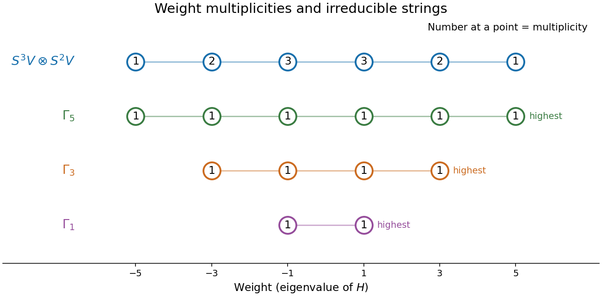
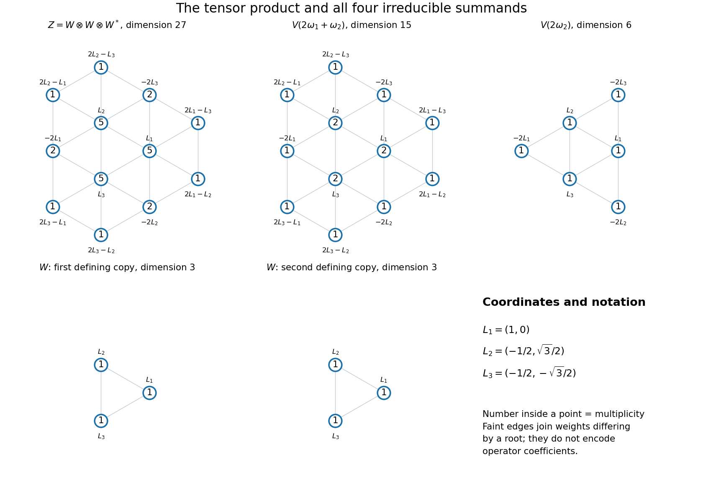
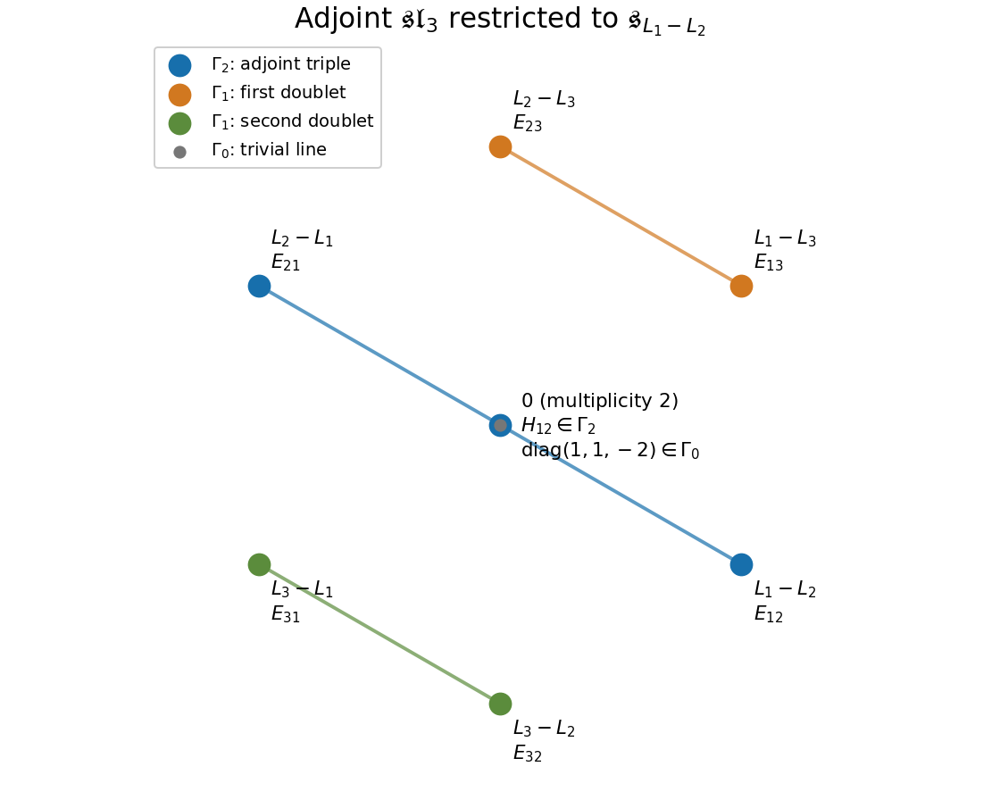

# Paper 1

↑ **Parent:** [Iii](../iii.md)

[https://www.maths.cam.ac.uk/postgrad/part-iii/files/pastpapers/2006/Paper1.pdf](https://www.maths.cam.ac.uk/postgrad/part-iii/files/pastpapers/2006/Paper1.pdf)

**Table of contents**

- [1](#1)
  - [a](#1/a)
    - [Solution](#1/a/solution)
  - [b](#1/b)
    - [Solution](#1/b/solution)
- [2](#2)
  - [Solution](#2/solution)
- [3](#3)
  - [a](#3/a)
    - [Solution](#3/a/solution)
  - [b](#3/b)
    - [Solution](#3/b/solution)
  - [c](#3/c)
    - [Solution](#3/c/solution)
- [4](#4)
  - [a](#4/a)
    - [Solution](#4/a/solution)
  - [b](#4/b)
    - [Solution](#4/b/solution)
  - [c](#4/c)
    - [Solution](#4/c/solution)
  - [d](#4/d)
    - [Solution](#4/d/solution)
  - [e](#4/e)
    - [Solution](#4/e/solution)
- [5](#5)
  - [a](#5/a)
    - [Solution](#5/a/solution)
  - [b](#5/b)
    - [Solution](#5/b/solution)
  - [c](#5/c)
    - [Solution](#5/c/solution)
- [6](#6)
  - [a](#6/a)
    - [Solution](#6/a/solution)
  - [b](#6/b)
    - [Solution](#6/b/solution)
  - [c](#6/c)
    - [Solution](#6/c/solution)
  - [d](#6/d)
    - [Solution](#6/d/solution)
  - [e](#6/e)
    - [Solution](#6/e/solution)

## 1

↑ **Parent:** [Paper 1](paper-1.md)

<h3 id="1/a">a</h3>

↑ **Parent:** [1](#1)

<h4 id="1/a/solution">Solution</h4>

↑ **Parent:** [A](#1/a)

Use the standard [sl2 triple](../../../semisimple-lie-algebra.md#sl2-triple) $H=x\partial_x-y\partial_y$, $X=x\partial_y$, $Y=y\partial_x$. In the [tensor product of Lie algebra representations](../../../lie-algebra.md#tensor-product-of-lie-algebra-representations), each operator acts on both factors. Put

$$
u_{ij}=x^{3-i}y^i\otimes x^{2-j}y^j,\quad0\leq i\leq3,\quad0\leq j\leq2.
$$

These twelve vectors form a [weight basis](../../../semisimple-lie-algebra.md#weight-basis), and $Hu_{ij}=(5-2(i+j))u_{ij}$. Thus the bases of the [weight spaces](../../../semisimple-lie-algebra.md#weight-space) are

$$
\begin{array}{c|l}
\text{weight}&\text{basis}\\\hline
5&u_{00}\\
3&u_{10},u_{01}\\
1&u_{20},u_{11},u_{02}\\
-1&u_{30},u_{21},u_{12}\\
-3&u_{31},u_{22}\\
-5&u_{32}
\end{array}
$$

There are no other weights. The [weight diagram](../../../semisimple-lie-algebra.md#weight-diagram) shows their multiplicities, with the decomposition also displayed for comparison.

**[Figure 1](#1/a/image-weights-and-multiplicities-of-the-cubic-by-quadratic-sl2-tensor-product-and-its-irreducible-summands). Weights and multiplicities of the cubic by quadratic sl2 tensor product and its irreducible summands**.

The [raising operator](../../../semisimple-lie-algebra.md#raising-operator) acts by

$$
Xu_{ij}=i\,u_{i-1,j}+j\,u_{i,j-1},
$$

with out-of-range terms omitted. At weights five, three and one its kernels are respectively spanned by

$$
\boxed{h_5=u_{00},\qquad h_3=u_{10}-u_{01},\qquad h_1=u_{20}-2u_{11}+u_{02}.}
$$

At weight one the kernel equations are $2a+b=0$ and $b+2c=0$ for $au_{20}+bu_{11}+cu_{02}$. At weight minus one they are $3a+b=0$, $2b+2c=0$, $c=0$, which force zero; the maps on the two remaining negative-weight spaces are injective as well. Thus these three lines give **all nonzero [highest-weight vectors](../../../semisimple-lie-algebra.md#highest-weight-vector) up to scalar**, at their respective weights. A linear combination of different lines is killed by $X$ but is not a [weight vector](../../../semisimple-lie-algebra.md#weight-vector), so is not a [highest-weight vector](../../../semisimple-lie-algebra.md#highest-weight-vector).

The [lowering operator](../../../semisimple-lie-algebra.md#lowering-operator) is

$$
Yu_{ij}=(3-i)u_{i+1,j}+(2-j)u_{i,j+1}.
$$

In particular,

$$
\boxed{h_1=u_{20}-2u_{11}+u_{02},\qquad Yh_1=u_{30}-2u_{21}+u_{12}}
$$

is an explicit [basis](../../../vector-space.md#basis) for the submodule $\Gamma_1$. Indeed $Y^2h_1=0$, $Xh_1=0$, $X(Yh_1)=h_1$, and the two vectors have weights $1,-1$. The analogous strings from $h_5,h_3$ have dimensions six and four. Their distinct irreducible highest weights and total dimension twelve give the [sl2 tensor product of cubic and quadratic symmetric powers](../../../lie-algebra.md#sl2-tensor-product-of-cubic-and-quadratic-symmetric-powers)

$$
\boxed{U\cong\Gamma_5\oplus\Gamma_3\oplus\Gamma_1.}
$$

<h3 id="1/b">b</h3>

↑ **Parent:** [1](#1)

<h4 id="1/b/solution">Solution</h4>

↑ **Parent:** [B](#1/b)

Let $f_1,f_2,f_3$ be the [dual basis](../../../linear-algebra.md#dual-basis) of $W^*$, and use $L_1+L_2+L_3=0$. The elementary tensors $e_i\otimes e_j\otimes f_k$ have weight $L_i+L_j-L_k$. Grouping them gives every [weight space](../../../semisimple-lie-algebra.md#weight-space) explicitly:

$$
\begin{array}{c|c|l}
\text{weight}&\text{multiplicity}&\text{basis}\\\hline
2L_i-L_k\ (i\ne k)&1&e_i\otimes e_i\otimes f_k\\
-2L_k\ (\{i,j,k\}=\{1,2,3\},\ i<j)&2&e_i\otimes e_j\otimes f_k,\ e_j\otimes e_i\otimes f_k\\
L_i&5&e_i\otimes e_i\otimes f_i,\ e_i\otimes e_j\otimes f_j,\ e_j\otimes e_i\otimes f_j\ (j\ne i)
\end{array}
$$

The counts are $6+3\cdot2+3\cdot5=27$, so this table exhausts the [tensor product](../../../linear-algebra.md#tensor-product). The diagrams below use equilateral coordinates $L_1=(1,0)$, $L_2=(-1/2,\sqrt3/2)$, $L_3=(-1/2,-\sqrt3/2)$; numbers at points are [weight multiplicities](../../../semisimple-lie-algebra.md#weight-multiplicity).

To decompose the module, first split the first two factors into their symmetric and alternating parts. Put $t_{ij}=(e_i\otimes e_j+e_j\otimes e_i)/2$, including $t_{ii}=e_i\otimes e_i$. The equivariant contraction

$$
C:S^2W\otimes W^*\to W,\qquad C(t_{ij}\otimes f_k)=\delta_{ik}e_j+\delta_{jk}e_i
$$

is onto, since $C(t_{ii}\otimes f_i)=2e_i$. Its kernel $K$ has dimension fifteen and contains the [highest-weight vector](../../../semisimple-lie-algebra.md#highest-weight-vector) $t_{11}\otimes f_3$ of weight $2L_1-L_3$.

Here is an explicit [weight basis of the trace-free symmetric-square dual tensor module](../../../semisimple-lie-algebra.md#weight-basis-of-the-trace-free-symmetric-square-dual-tensor-module), and thus the requested fifteen-vector [basis](../../../vector-space.md#basis):

$$
\boxed{\begin{array}{ll}
t_{ii}\otimes f_k,&i\ne k\quad(6\text{ vectors}),\\
t_{ij}\otimes f_k,&i<j,\ \{i,j,k\}=\{1,2,3\}\quad(3\text{ vectors}),\\
t_{ij}\otimes f_j-\tfrac12t_{ii}\otimes f_i,&i\ne j\quad(6\text{ vectors}).
\end{array}}
$$

Every displayed vector contracts to zero. The first two families occupy distinct one-dimensional weights; at each weight $L_i$ the two vectors in the last family are independent because their respective $t_{ij}\otimes f_j$ terms are distinct. Thus all fifteen are independent and span $K$.

For completeness, $K$ is irreducible, not just an invariant kernel of the right dimension. On elementary tensors the raising action is

$$
E_{ab}(e_i\otimes e_j\otimes f_k)=\delta_{bi}e_a\otimes e_j\otimes f_k+\delta_{bj}e_i\otimes e_a\otimes f_k-\delta_{ak}e_i\otimes e_j\otimes f_b.
$$

At the six weights $2L_i-L_k$, both $E_{12}$ and $E_{23}$ kill the vector only for $(i,k)=(1,3)$. At each weight $-2L_k$, at least one of those operators is nonzero. At weight $L_1$, write a vector as $a(t_{12}\otimes f_2-t_{11}\otimes f_1/2)+b(t_{13}\otimes f_3-t_{11}\otimes f_1/2)$. The two raising equations are $3a+b=0$ and $-a+b=0$, forcing zero. On the two-dimensional weight-$L_2$ space $E_{12}$ is injective, and on the weight-$L_3$ space $E_{23}$ is injective, as substitution in the same action formula shows. Therefore the common raising kernel in $K$ is the single line $\mathbb C(t_{11}\otimes f_3)$. By [Weyl complete reducibility theorem](../../../semisimple-lie-algebra.md#weyl-complete-reducibility-theorem), every irreducible summand supplies a highest-weight line, so $K$ has only one summand and is irreducible.

The symmetric-factor contraction splits off a defining copy $W$; explicitly $e_i\mapsto\sum_jt_{ij}\otimes f_j$ is equivariant and its contraction is $4e_i$. For the alternating factor, the invariant volume form identifies $\Lambda^2W\cong W^*$, sending $e_1\wedge e_2$ to $f_3$, $e_2\wedge e_3$ to $f_1$ and $e_3\wedge e_1$ to $f_2$. Therefore

$$
\Lambda^2W\otimes W^*\cong W^*\otimes W^*=S^2W^*\oplus\Lambda^2W^*\cong S^2W^*\oplus W.
$$

The symmetric dual module is irreducible of dimension six and highest weight $-2L_3$; its symmetric-monomial [basis](../../../vector-space.md#basis) has weights $-2L_i$ and $-L_i-L_j=L_k$, all of multiplicity one. In the original [tensor product](../../../linear-algebra.md#tensor-product) its [highest-weight vector](../../../semisimple-lie-algebra.md#highest-weight-vector) is

$$
\boxed{(e_1\otimes e_2-e_2\otimes e_1)\otimes f_3.}
$$

The raising action above annihilates it, and its weight is $L_1+L_2-L_3=-2L_3$.

Altogether the [Triple tensor decomposition for the defining sl3 representation](../../../semisimple-lie-algebra.md#triple-tensor-decomposition-for-the-defining-sl3-representation) is

$$
\boxed{Z\cong V(2\omega_1+\omega_2)\oplus V(2\omega_2)\oplus W\oplus W,\qquad27=15+6+3+3.}
$$

The fifteen-dimensional module has multiplicity one at each $2L_i-L_k$ and $-2L_i$, and multiplicity two at each $L_i$. The six-dimensional module has multiplicity one at $-2L_i$ and $L_i$. Each defining module has the three weights $L_i$, once each. These add to the original table of multiplicities.

**[Figure 2](#1/b/image-weight-diagrams-of-the-27-dimensional-sl3-tensor-product-and-its-irreducible-summands-of-dimensions-fifteen-six-three-and-three). Weight diagrams of the 27-dimensional sl3 tensor product and its irreducible summands of dimensions fifteen, six, three and three**.

The two defining summands are not intrinsically distinguished: other diagonal copies inside their isotypic component have the same three-point [weight diagram](../../../semisimple-lie-algebra.md#weight-diagram). Thus the displayed diagrams account for every irreducible submodule type, as well as showing both copies in this decomposition.

## 2

↑ **Parent:** [Paper 1](paper-1.md)

<h3 id="2/solution">Solution</h3>

↑ **Parent:** [2](#2)

Work in finite dimension over $\mathbb C$; the characteristic-zero real version follows by complexification. The [Cartan solvability criterion](../../../lie-algebra.md#cartan-solvability-criterion) is

$$
\boxed{\mathfrak g\text{ is solvable}\quad\Longleftrightarrow\quad B(\mathfrak g,[\mathfrak g,\mathfrak g])=0.}
$$

Its semisimplicity consequence, also often called Cartan's criterion, is **$\mathfrak g$ is semisimple if and only if its [Killing form](../../../lie-algebra.md#killing-form) is nondegenerate**. We prove both forms.

The auxiliary results used are as follows. The [Lie theorem](../../../lie-algebra.md#lie-s-theorem) simultaneously triangularizes every finite-dimensional representation of a complex [solvable Lie algebra](../../../lie-algebra.md#solvable-lie-algebra). The [Engel theorem](../../../lie-algebra.md#engel-s-theorem) says that a matrix [Lie algebra](../../../lie-algebra.md) consisting entirely of [nilpotent endomorphisms](../../../linear-operator-theory.md#nilpotent-linear-map) has a common annihilated nonzero vector and a [basis](../../../vector-space.md#basis) making all its matrices strictly upper triangular; in particular it is a [nilpotent Lie algebra](../../../lie-algebra.md#nilpotent-lie-algebra). Nilpotent means that the lower central series terminates, which implies that the derived series terminates as well. Finally, the [Additive Jordan decomposition](../../../linear-operator-theory.md#jordan-chevalley-decomposition) writes any complex endomorphism uniquely as $x=x_s+x_n$, where $x_s$ is diagonalizable, $x_n$ is nilpotent and they commute. On a [generalized eigenspace](../../../linear-operator-theory.md#generalized-eigenspace) $V_\lambda$, the two parts are $\lambda I$ and $x-\lambda I$, and both are polynomials in $x$. On endomorphisms, $\operatorname{ad}x_s$ is diagonalizable, $\operatorname{ad}x_n$ is nilpotent, and these are the Jordan parts of $\operatorname{ad}x$: the first assertion follows by splitting into maps between eigenspaces, and the second by expanding repeated [commutators](../../../lie-algebra.md#commutator) with the nilpotent $x_n$.

First prove the linear trace version: if $L\subseteq\mathfrak{gl}(V)$ and

$$
\operatorname{tr}(ab)=0\quad(a\in L,\ b\in[L,L]),
$$

then $L$ is solvable. Fix $x\in[L,L]$ and let $V=\bigoplus V_\lambda$ be its [generalized eigenspace](../../../linear-operator-theory.md#generalized-eigenspace) decomposition. Define $y$ to act on $V_\lambda$ by the scalar $\overline\lambda$. We do not assume that $y$, $x_s$ or $x_n$ belongs to $L$.

On $\operatorname{Hom}(V_\mu,V_\lambda)$, $\operatorname{ad}x$ has the form $(\lambda-\mu)I+N$ with $N$ nilpotent, whereas $\operatorname{ad}y$ is multiplication by $\overline{\lambda-\mu}$. Choose a polynomial $q$ with $q(d)=\bar d$ for every occurring [eigenvalue](../../../linear-operator-theory.md#eigenvalue) difference $d$, and with all its derivatives of positive order up to the relevant nilpotency index zero at $d$. Such a polynomial exists by Hermite interpolation, or the Chinese remainder theorem for the pairwise coprime powers of $(t-d)$. At $d=0$ its value is zero, so $q(0)=0$. Expanding $q(dI+N)$ now gives

$$
\operatorname{ad}y=q(\operatorname{ad}x).
$$

Because $x\in L$ and $[L,L]$ is an ideal, every positive power of $\operatorname{ad}x$ sends $L$ into $[L,L]$. The zero constant term therefore gives $[y,L]\subseteq[L,L]$.

Express $x$ as a sum of [commutators](../../../lie-algebra.md#commutator) $\sum_j[a_j,b_j]$ with $a_j,b_j\in L$. Cyclicity of trace and the hypothesis imply

$$
\operatorname{tr}(xy)=\sum_j\operatorname{tr}([a_j,b_j]y)
=\sum_j\operatorname{tr}(a_j[b_j,y])=0.
$$

But on $V_\lambda$, $xy$ has trace $\dim(V_\lambda)|\lambda|^2$, since the nilpotent part has trace zero. Hence

$$
0=\operatorname{tr}(xy)=\sum_\lambda\dim(V_\lambda)|\lambda|^2,
$$

forcing every [eigenvalue](../../../linear-operator-theory.md#eigenvalue) of $x$ to vanish. Thus every member of the [derived algebra](../../../lie-algebra.md#derived-algebra) $[L,L]$ is a [nilpotent endomorphism](../../../linear-operator-theory.md#nilpotent-linear-map). By the [Engel theorem](../../../lie-algebra.md#engel-s-theorem), $[L,L]$ is nilpotent and therefore solvable; its derived series terminates, and adjoining the initial term $L$ shows that $L$ is solvable.

Conversely, if $L$ is solvable, the [Lie theorem](../../../lie-algebra.md#lie-s-theorem) makes it upper triangular. [Commutators](../../../lie-algebra.md#commutator) of upper-triangular matrices have zero diagonal, and multiplying such a [commutator](../../../lie-algebra.md#commutator) by an upper-triangular matrix still has zero diagonal. Therefore the trace condition holds. Apply this equivalence to $L=\operatorname{ad}\mathfrak g$. Its trace pairing is the [Killing form](../../../lie-algebra.md#killing-form), and solvability of its image is equivalent to solvability of $\mathfrak g$: the kernel is its abelian centre, so a terminating derived series in the quotient terminates after at most one more step in $\mathfrak g$. This proves the solvability criterion.

For the semisimplicity criterion, let $R$ be the radical of the [Killing form](../../../lie-algebra.md#killing-form). Invariance makes $R$ a [Lie algebra ideal](../../../lie-algebra.md#ideal-of-a-lie-algebra). For $x,y\in R$, their adjoint actions on $\mathfrak g/R$ vanish, so computing trace in a [basis](../../../vector-space.md#basis) adapted to $R$ gives $B_R(x,y)=B_{\mathfrak g}(x,y)=0$. The solvability criterion applied to $R$ shows it is a solvable ideal. Thus a [semisimple Lie algebra](../../../semisimple-lie-algebra.md) has $R=0$ and a nondegenerate [Killing form](../../../lie-algebra.md#killing-form).

Conversely, any nonzero solvable ideal has a last nonzero term $A$ in its derived series; this is an abelian ideal of $\mathfrak g$. For $x\in A$, $y\in\mathfrak g$, the map $\operatorname{ad}x\operatorname{ad}y$ sends $\mathfrak g$ into $A$ and vanishes on $A$, so has trace zero. Hence $A\subseteq R$. A nondegenerate [Killing form](../../../lie-algebra.md#killing-form) therefore rules out nonzero solvable ideals, exactly the definition of semisimplicity.

For classification, nondegeneracy of the [Killing form](../../../lie-algebra.md#killing-form) provides the duality and root-space pairings used to extract a reduced crystallographic [root system](../../../semisimple-lie-algebra.md#root-system) from a [semisimple Lie algebra](../../../semisimple-lie-algebra.md). Classification then reduces to the finite [Dynkin diagrams](../../../semisimple-lie-algebra.md#dynkin-diagram) and reconstruction of the [Lie algebra](../../../lie-algebra.md) from its [root](../../../semisimple-lie-algebra.md#root-of-a-root-system) data.

## 3

↑ **Parent:** [Paper 1](paper-1.md)

<h3 id="3/a">a</h3>

↑ **Parent:** [3](#3)

<h4 id="3/a/solution">Solution</h4>

↑ **Parent:** [A](#3/a)

For a [Lie group](../../../lie-theory.md#lie-group) $G$ with identity $e$, its [Lie algebra](../../../lie-algebra.md) as a set is the [tangent space](../../../differential-geometry.md#tangent-space) $T_eG$:

$$
\mathfrak g=\{\gamma'(0):\gamma:(-\varepsilon,\varepsilon)\to G\text{ smooth},\ \gamma(0)=e\}.
$$

The ambient embedding identifies these tangent vectors with vectors in $\mathbb R^N$. For a matrix [Lie group](../../../lie-theory.md#lie-group), the identity is $I$ and the tangent vectors are matrices.

If $\gamma(t)\in\mathrm{SL}_n$ with $\gamma(0)=I$, put $A=\gamma'(0)$. The [determinant](../../../linear-algebra.md#determinant) expansion $\det(I+tA+o(t))=1+t\operatorname{tr}A+o(t)$ follows directly from its permutation formula: to first order only the diagonal entries contribute. Since $\det\gamma(t)=1$, differentiation gives $\operatorname{tr}A=0$. Thus

$$
\boxed{\operatorname{Lie}(\mathrm{SL}_n)\subseteq\mathfrak{sl}_n.}
$$

In fact equality holds: if $\operatorname{tr}A=0$, then $\exp(tA)$ has [determinant](../../../linear-algebra.md#determinant) $\exp(t\operatorname{tr}A)=1$ and derivative $A$ at zero.

<h3 id="3/b">b</h3>

↑ **Parent:** [3](#3)

<h4 id="3/b/solution">Solution</h4>

↑ **Parent:** [B](#3/b)

Take curves $g(s),h(t)$ through the identity with tangent vectors $X,Y$. Form the local group [commutator](../../../lie-algebra.md#commutator) $c(s,t)=g(s)h(t)g(s)^{-1}h(t)^{-1}$. In a smooth coordinate chart at the identity, its leading mixed term defines the [Lie bracket](../../../lie-algebra.md#lie-bracket):

$$
[X,Y]=\partial_s\partial_t c(s,t)\big|_{s=t=0}
$$

for a matrix group, where the identity's constant term has zero derivative. More generally take this derivative in the chart with the identity sent to zero. Since the first derivatives vanish on the coordinate axes, changing charts changes the mixed coefficient only by the tangent-space coordinate transformation, so the definition is intrinsic.

For the displayed nilpotent matrices choose $g(s)=I+sX$ and $h(t)=I+tY$, which lie in $\mathrm{SL}_2$. Their inverses are $I-sX$ and $I-tY$. Direct multiplication gives

$$
g(s)h(t)g(s)^{-1}h(t)^{-1}
=\begin{pmatrix}1+st+s^2t^2&-s^2t\\st^2&1-st\end{pmatrix}.
$$

Its mixed derivative is therefore

$$
\boxed{[X,Y]=\begin{pmatrix}1&0\\0&-1\end{pmatrix}=H.}
$$

Interchanging the two curves gives

$$
h(t)g(s)h(t)^{-1}g(s)^{-1}
=\begin{pmatrix}1-st&s^2t\\-st^2&1+st+s^2t^2\end{pmatrix},
$$

whose mixed derivative is $-H$. Thus **$[X,Y]=-[Y,X]$** directly from the curve definition. The general matrix expansion likewise gives the [commutator](../../../lie-algebra.md#commutator) $XY-YX$.

<h3 id="3/c">c</h3>

↑ **Parent:** [3](#3)

<h4 id="3/c/solution">Solution</h4>

↑ **Parent:** [C](#3/c)

A smooth [vector field](../../../calculus.md#vector-field) on a [smooth manifold](../../../differential-geometry.md#smooth-manifold) $M$ is a smooth section of its [tangent bundle](../../../fiber-bundle.md#tangent-bundle): it assigns $v(p)\in T_pM$ smoothly to each point. On a [Lie group](../../../lie-theory.md#lie-group), it is a [left-invariant vector field](../../../lie-theory.md#left-invariant-vector-field) when

$$
v(gp)=(dL_g)_p v(p),\qquad L_g(p)=gp.
$$

For $X\in T_eG$, define $v_X(g)=(dL_g)_eX$. Smoothness of multiplication makes this a smooth [vector field](../../../calculus.md#vector-field), and $L_gL_p=L_{gp}$ plus the chain rule proves left invariance. Every [left-invariant vector field](../../../lie-theory.md#left-invariant-vector-field) arises this way from its value at the identity.

For a matrix [Lie group](../../../lie-theory.md#lie-group), $v_X(g)=gX$, because the derivative at zero of $g\gamma(t)$ is $gX$. The printed group name in this subpart must be read as $\mathrm{SL}_2$, rather than the additive vector space $\mathfrak{sl}_2$: it is the matrix-group calculation consistent with the preceding subparts. At the specified matrix,

$$
\boxed{v_X\!\left(\begin{pmatrix}0&1\\-1&0\end{pmatrix}\right)
=\begin{pmatrix}0&1\\-1&0\end{pmatrix}\begin{pmatrix}0&1\\0&0\end{pmatrix}
=\begin{pmatrix}0&0\\0&-1\end{pmatrix}.}
$$

A tangent vector at a nonidentity group element need not itself be trace-free; here $g^{-1}v_X(g)=X$ is trace-free, as required. If one instead interpreted the printed $\mathfrak{sl}_2$ as its additive [Lie group](../../../lie-theory.md#lie-group), the field would be the constant field $X$, a different problem.

## 4

↑ **Parent:** [Paper 1](paper-1.md)

<h3 id="4/a">a</h3>

↑ **Parent:** [4](#4)

<h4 id="4/a/solution">Solution</h4>

↑ **Parent:** [A](#4/a)

For a finite-dimensional [Lie algebra](../../../lie-algebra.md), define its [Killing form](../../../lie-algebra.md#killing-form) by

$$
\boxed{B(x,y)=\operatorname{tr}(\operatorname{ad}x\operatorname{ad}y),\qquad \operatorname{ad}x(z)=[x,z].}
$$

The trace identity $\operatorname{tr}(AB)=\operatorname{tr}(BA)$ proves symmetry, and linearity of trace proves bilinearity. The [Jacobi identity](../../../lie-algebra.md#jacobi-identity) gives $\operatorname{ad}[x,y]=[\operatorname{ad}x,\operatorname{ad}y]$. Consequently, by cyclic invariance of trace,

$$
B([x,y],z)=\operatorname{tr}\bigl((\operatorname{ad}x\operatorname{ad}y-\operatorname{ad}y\operatorname{ad}x)\operatorname{ad}z\bigr)
=\operatorname{tr}\bigl(\operatorname{ad}x[\operatorname{ad}y,\operatorname{ad}z]\bigr)=B(x,[y,z]).
$$

This is the invariance identity. Equivalently **$B([h,x],y)+B(x,[h,y])=0$** for all three elements.

<h3 id="4/b">b</h3>

↑ **Parent:** [4](#4)

<h4 id="4/b/solution">Solution</h4>

↑ **Parent:** [B](#4/b)

If $x\in\mathfrak g_\alpha$, $y\in\mathfrak g_\beta$ and $h\in\mathfrak h$, invariance of the [Killing form](../../../lie-algebra.md#killing-form) gives

$$
0=B([h,x],y)+B(x,[h,y])=(\alpha(h)+\beta(h))B(x,y).
$$

Unless $\alpha+\beta=0$, some $h$ makes its coefficient nonzero, so the two [root spaces](../../../semisimple-lie-algebra.md#root-space) are orthogonal. Similarly $B(\mathfrak h,\mathfrak g_\alpha)=0$ for every [root](../../../semisimple-lie-algebra.md#root-of-a-root-system): choose $h$ with $\alpha(h)\ne0$ and use that $\mathfrak h$ is abelian.

Now take nonzero $x\in\mathfrak g_\alpha$. Nondegeneracy on $\mathfrak g$ supplies some element pairing nontrivially with $x$. Its [root-space decomposition](../../../semisimple-lie-algebra.md#root-space-decomposition) shows that only its $\mathfrak g_{-\alpha}$ component can contribute. Thus the pairing between opposite [root spaces](../../../semisimple-lie-algebra.md#root-space) is nonzero, and indeed nondegenerate. Therefore

$$
\boxed{B(\mathfrak g_\alpha,\mathfrak g_\beta)\ne0\quad\Longleftrightarrow\quad\beta=-\alpha.}
$$

Here nonzero means the bilinear pairing is not identically zero, not that every pair of vectors has a nonzero value.

If $h_0\in\mathfrak h$ is orthogonal to all of $\mathfrak h$, it is also orthogonal to every [root space](../../../semisimple-lie-algebra.md#root-space), by the preceding orthogonality. It is therefore orthogonal to all of $\mathfrak g$, forcing $h_0=0$. Hence **$B|_{\mathfrak h}$ is nondegenerate**.

<h3 id="4/c">c</h3>

↑ **Parent:** [4](#4)

<h4 id="4/c/solution">Solution</h4>

↑ **Parent:** [C](#4/c)

Put $H_{12}=\operatorname{diag}(1,-1,0)$ and $H_{23}=\operatorname{diag}(0,1,-1)$. On the [root space](../../../semisimple-lie-algebra.md#root-space) spanned by $E_{ij}$, their adjoint [eigenvalues](../../../linear-operator-theory.md#eigenvalue) are $h_i-h_j$ and $k_i-k_j$; both act as zero on the [Cartan subalgebra](../../../semisimple-lie-algebra.md#cartan-subalgebra). Thus the [Killing form](../../../lie-algebra.md#killing-form) is the sum of their products over the six [roots](../../../semisimple-lie-algebra.md#root-of-a-root-system). The pair of [roots](../../../semisimple-lie-algebra.md#root-of-a-root-system) $\pm(L_1-L_2)$ contributes $-4$, the pair $\pm(L_2-L_3)$ contributes $-4$, and $\pm(L_1-L_3)$ contributes $2$. Hence

$$
\boxed{B(H_{12},H_{23})=-6.}
$$

This also agrees with the [Killing form of the special linear Lie algebra](../../../lie-algebra.md#killing-form-of-the-special-linear-lie-algebra), $B(A,B)=6\operatorname{tr}(AB)$ for $\mathfrak{sl}_3$.

<h3 id="4/d">d</h3>

↑ **Parent:** [4](#4)

<h4 id="4/d/solution">Solution</h4>

↑ **Parent:** [D](#4/d)

The displayed identity is valid for a [highest-weight vector](../../../semisimple-lie-algebra.md#highest-weight-vector) $v$, satisfying $Xv=0$ and $Hv=kv$, not for arbitrary $v\in V$. For example, in the defining module with $k=1$, take $v=y$: then $XYv=0$ but the proposed right side for $n=1$ is $v\ne0$.

For a [highest-weight vector](../../../semisimple-lie-algebra.md#highest-weight-vector), the [sl2 triple](../../../semisimple-lie-algebra.md#sl2-triple) relations give $HY^jv=(k-2j)Y^jv$. The operator identity

$$
[X,Y^n]=\sum_{j=0}^{n-1}Y^jHY^{n-1-j}
$$

comes from expanding a [commutator](../../../lie-algebra.md#commutator) with a product. Apply it to $v$, using $Xv=0$. Each term becomes $(k-2(n-1-j))Y^{n-1}v$, so the sum is

$$
\boxed{XY^nv=n(k-n+1)Y^{n-1}v.}
$$

This proves the intended [sl2 highest-weight lowering formula](../../../semisimple-lie-algebra.md#sl2-highest-weight-lowering-formula). The identity valid for an arbitrary vector is instead

$$
XY^nv=Y^nXv+nY^{n-1}(H-n+1)v.
$$

On the [basis](../../../vector-space.md#basis) $v,Yv,\ldots,Y^kv$ of the irreducible module, $XY$ has [eigenvalue](../../../linear-operator-theory.md#eigenvalue) $(j+1)(k-j)$ on $Y^jv$, for $0\leq j\leq k$. Summing gives the [trace of a raising-lowering product in an irreducible sl2 module](../../../semisimple-lie-algebra.md#trace-of-a-raising-lowering-product-in-an-irreducible-sl2-module):

$$
\boxed{\operatorname{tr}_V(XY)=\sum_{j=0}^k(j+1)(k-j)=\frac{k(k+1)(k+2)}6.}
$$

The last equality follows by the formulas for the sums of the first $k$ integers and their squares.

<h3 id="4/e">e</h3>

↑ **Parent:** [4](#4)

<h4 id="4/e/solution">Solution</h4>

↑ **Parent:** [E](#4/e)

For a [root](../../../semisimple-lie-algebra.md#root-of-a-root-system) $\alpha$, choose normalized [root](../../../semisimple-lie-algebra.md#root-of-a-root-system) vectors $e_\alpha\in\mathfrak g_\alpha$, $f_\alpha\in\mathfrak g_{-\alpha}$ and the coroot element $h_\alpha\in\mathfrak h$ with

$$
[h_\alpha,e_\alpha]=2e_\alpha,\qquad [h_\alpha,f_\alpha]=-2f_\alpha,\qquad [e_\alpha,f_\alpha]=h_\alpha.
$$

The requested [sl2 subalgebra associated with a root](../../../semisimple-lie-algebra.md#sl2-subalgebra-associated-with-a-root) is

$$
\boxed{\mathfrak s_\alpha=\mathfrak g_\alpha\oplus\mathbb Ch_\alpha\oplus\mathfrak g_{-\alpha}\cong\mathfrak{sl}_2.}
$$

These bracket relations identify its [basis](../../../vector-space.md#basis) with the standard [sl2 triple](../../../semisimple-lie-algebra.md#sl2-triple). The notation here denotes this subalgebra, not the [root](../../../semisimple-lie-algebra.md#root-of-a-root-system) reflection $s_\alpha$ used for the [Weyl group](../../../semisimple-lie-algebra.md#weyl-group).

The [weight diagram](../../../semisimple-lie-algebra.md#weight-diagram) of the [Adjoint representation](../../../lie-algebra.md#adjoint-representation-of-a-lie-algebra) of $\mathfrak{sl}_3$ has its six [roots](../../../semisimple-lie-algebra.md#root-of-a-root-system) $L_i-L_j$, $i\ne j$, each of multiplicity one, and zero of multiplicity two, from the [Cartan subalgebra](../../../semisimple-lie-algebra.md#cartan-subalgebra).

Restrict to the [root](../../../semisimple-lie-algebra.md#root-of-a-root-system) subalgebra generated by $X=E_{12}$, $Y=E_{21}$ and $H=H_{12}$. The explicit decomposition into irreducible modules is

$$
\mathfrak{sl}_3=\langle E_{12},H_{12},E_{21}\rangle
\oplus\langle E_{13},E_{23}\rangle
\oplus\langle E_{32},-E_{31}\rangle
\oplus\langle\operatorname{diag}(1,1,-2)\rangle
\cong\Gamma_2\oplus\Gamma_1\oplus\Gamma_1\oplus\Gamma_0.
$$

The first summand has $H$ weights $2,0,-2$. The second has weights $1,-1$, since $[Y,E_{13}]=E_{23}$. The third likewise has weights $1,-1$, since $[Y,E_{32}]=-E_{31}$. The last commutes with all three generators and is trivial. These subspaces are stable under the [sl2 triple](../../../semisimple-lie-algebra.md#sl2-triple), are independent and have dimensions totaling eight, so they exhaust the [Adjoint representation](../../../lie-algebra.md#adjoint-representation-of-a-lie-algebra).

**[Figure 3](#4/e/image-adjoint-sl3-weights-coloured-by-their-irreducible-summands-under-the-root-sl2-subalgebra-with-the-two-zero-weight-vectors-distinguished). Adjoint sl3 weights coloured by their irreducible summands under the root sl2 subalgebra, with the two zero-weight vectors distinguished**.

The [Killing form](../../../lie-algebra.md#killing-form) value is the trace of $\operatorname{ad}E_{12}\operatorname{ad}E_{21}$. By the formula just proved, the four summands contribute $4,1,1,0$. Therefore

$$
\boxed{B(E_{12},E_{21})=6.}
$$

## 5

↑ **Parent:** [Paper 1](paper-1.md)

<h3 id="5/a">a</h3>

↑ **Parent:** [5](#5)

<h4 id="5/a/solution">Solution</h4>

↑ **Parent:** [A](#5/a)

Identify the real span of the [roots](../../../semisimple-lie-algebra.md#root-of-a-root-system) with its dual using the invariant [inner product](../../../linear-algebra.md#inner-product), and put $\alpha^\vee=2\alpha/(\alpha,\alpha)$. The [weight lattice](../../../semisimple-lie-algebra.md#weight-lattice) is

$$
\boxed{\Lambda_W=\{\lambda:\langle\lambda,\alpha^\vee\rangle\in\mathbb Z\text{ for every root }\alpha\}.}
$$

The [Weyl group](../../../semisimple-lie-algebra.md#weyl-group) is generated by the [root reflections](../../../semisimple-lie-algebra.md#root-reflection) $s_\alpha$. Each reflection permutes the finite set of [roots](../../../semisimple-lie-algebra.md#root-of-a-root-system) and preserves their lengths, hence also permutes their coroots. Thus, for $\lambda\in\Lambda_W$,

$$
\langle s_\alpha\lambda,\beta^\vee\rangle=\langle\lambda,(s_\alpha\beta)^\vee\rangle\in\mathbb Z.
$$

Every generating reflection therefore maps the [weight lattice](../../../semisimple-lie-algebra.md#weight-lattice) to itself, and so does every product. Since the inverse product has the same property, **every Weyl-group element acts bijectively on $\Lambda_W$**. The [roots](../../../semisimple-lie-algebra.md#root-of-a-root-system) span the ambient space, so the action on the finite [root](../../../semisimple-lie-algebra.md#root-of-a-root-system) set is faithful; in particular the [Weyl group](../../../semisimple-lie-algebra.md#weyl-group) is finite.

<h3 id="5/b">b</h3>

↑ **Parent:** [5](#5)

<h4 id="5/b/solution">Solution</h4>

↑ **Parent:** [B](#5/b)

Choose [simple roots](../../../semisimple-lie-algebra.md#simple-root) $\alpha_1,\ldots,\alpha_r$. For the orbit statement one must use the [Closed dominant Weyl chamber](../../../semisimple-lie-algebra.md#closed-dominant-weyl-chamber)

$$
\boxed{\mathcal W=\{\lambda:\langle\lambda,\alpha_i^\vee\rangle\geq0\text{ for every }i\}.}
$$

Its interior, defined using strict inequalities, is the open [Weyl chamber](../../../semisimple-lie-algebra.md#fundamental-chamber-of-a-root-system). Weights on reflecting walls, including zero, cannot be moved into that interior, so closure is necessary here.

Choose $\rho$ strictly inside the chamber, for example the sum of the [fundamental weights](../../../semisimple-lie-algebra.md#fundamental-weight). The finite [Weyl group](../../../semisimple-lie-algebra.md#weyl-group) orbit of $\beta$ contains an element $\lambda$ maximizing $(\lambda,\rho)$. If $(\lambda,\alpha_i)<0$ for some [simple root](../../../semisimple-lie-algebra.md#simple-root), then

$$
(s_i\lambda,\rho)-(\lambda,\rho)=-\frac{2(\lambda,\alpha_i)}{(\alpha_i,\alpha_i)}(\alpha_i,\rho)>0,
$$

contradicting the maximum. Thus every simple-root pairing of $\lambda$ is nonnegative, and $\lambda\in\mathcal W$. Consequently **some $w\in W$ sends every integral weight $\beta$ into the closed fundamental chamber**. The argument in fact works for every vector in the real [weight space](../../../semisimple-lie-algebra.md#weight-space).

<h3 id="5/c">c</h3>

↑ **Parent:** [5](#5)

<h4 id="5/c/solution">Solution</h4>

↑ **Parent:** [C](#5/c)

For the usual [positive roots](../../../semisimple-lie-algebra.md#positive-root), the chamber condition is that the coefficients of $L_1,L_2,L_3$ be weakly decreasing, since their consecutive differences are the simple-coroot pairings. Adding the same constant to all three coefficients changes no weight, because $L_1+L_2+L_3=0$.

The given coefficients are $(-2,3,0)$. Let $s_1$ exchange $L_1,L_2$, and $s_2$ exchange $L_2,L_3$. With the rightmost reflection acting first,

$$
3L_2-2L_1\xmapsto{s_1}3L_1-2L_2\xmapsto{s_2}3L_1-2L_3.
$$

Thus

$$
\boxed{w=s_2s_1=(1\ 3\ 2),\qquad w(3L_2-2L_1)=3L_1-2L_3=3\omega_1+2\omega_2.}
$$

Its coefficients $(3,0,-2)$ are strictly decreasing, so it lies even in the open [Weyl chamber](../../../semisimple-lie-algebra.md#fundamental-chamber-of-a-root-system); its [Dynkin labels](../../../semisimple-lie-algebra.md#dynkin-label) are $(3,2)$.

## 6

↑ **Parent:** [Paper 1](paper-1.md)

<h3 id="6/a">a</h3>

↑ **Parent:** [6](#6)

<h4 id="6/a/solution">Solution</h4>

↑ **Parent:** [A](#6/a)

A reduced crystallographic abstract [root system](../../../semisimple-lie-algebra.md#root-system) in a finite-dimensional real [inner product space](../../../linear-algebra.md#inner-product-space) $E$ is a finite set $R$ such that: it spans $E$ and does not contain zero; the only scalar multiples of $\alpha\in R$ belonging to $R$ are $\pm\alpha$; every [root reflection](../../../semisimple-lie-algebra.md#root-reflection)

$$
s_\alpha(x)=x-\frac{2(x,\alpha)}{(\alpha,\alpha)}\alpha
$$

permutes $R$; and each [Cartan integer](../../../semisimple-lie-algebra.md#cartan-integer) $2(\beta,\alpha)/(\alpha,\alpha)$ is integral. These are the crystallographic and reduced conventions appropriate to [roots](../../../semisimple-lie-algebra.md#root-of-a-root-system) of a complex [semisimple Lie algebra](../../../semisimple-lie-algebra.md). Without crystallographic integrality, the numerical restrictions in the following subparts would not hold.

<h3 id="6/b">b</h3>

↑ **Parent:** [6](#6)

<h4 id="6/b/solution">Solution</h4>

↑ **Parent:** [B](#6/b)

If $\beta=-\alpha$, then both [Cartan integers](../../../semisimple-lie-algebra.md#cartan-integer) are $-2$. This opposite-root case satisfies the printed inner-product hypothesis and must be included.

Otherwise reducedness makes the [roots](../../../semisimple-lie-algebra.md#root-of-a-root-system) nonproportional. Writing the angle as $\theta$, strict [Cauchy-Schwarz inequality](../../../probability-and-statistics.md#cauchy-schwarz-inequality) gives

$$
n_{\alpha,\beta}n_{\beta,\alpha}=4\cos^2\theta<4.
$$

Both factors are negative integers, so their product is $1,2$ or $3$. The full list is therefore

$$
\boxed{\begin{array}{c|c}
n_{\alpha,\beta}&\text{possible }n_{\beta,\alpha}\\\hline
-1&-1,-2,-3\\
-2&-1\quad\text{or }-2\text{ for opposite roots}\\
-3&-1
\end{array}}
$$

The nonproportional pairs correspond respectively to angles $120^\circ$, $135^\circ$ and $150^\circ$; reversing the order of the [roots](../../../semisimple-lie-algebra.md#root-of-a-root-system) reverses the unequal pairs.

<h3 id="6/c">c</h3>

↑ **Parent:** [6](#6)

<h4 id="6/c/solution">Solution</h4>

↑ **Parent:** [C](#6/c)

There is an exception to the printed assertion: for $\beta=-\alpha$, the [inner product](../../../linear-algebra.md#inner-product) is negative but $\alpha+\beta=0$ is not a [root](../../../semisimple-lie-algebra.md#root-of-a-root-system). This already occurs in the rank-one [root system](../../../semisimple-lie-algebra.md#root-system) $R=\{\alpha,-\alpha\}$.

For the intended assertion, assume $\beta\ne-\alpha$. By the preceding list, at least one of $n_{\alpha,\beta},n_{\beta,\alpha}$ equals $-1$. If the first does, the reflection axiom gives

$$
s_\alpha(\beta)=\beta-n_{\alpha,\beta}\alpha=\beta+\alpha\in R.
$$

If the second does, use $s_\beta(\alpha)=\alpha+\beta$ instead. Thus the precise reusable conclusion is

$$
\boxed{(\alpha,\beta)<0,\ \beta\ne-\alpha\quad\Longrightarrow\quad\alpha+\beta\in R.}
$$

This proves that [obtuse nonopposite roots have a root sum](../../../semisimple-lie-algebra.md#obtuse-nonopposite-roots-have-a-root-sum) directly from the reflection and integrality axioms, without appealing to the classification of [root systems](../../../semisimple-lie-algebra.md#root-system).

<h3 id="6/d">d</h3>

↑ **Parent:** [6](#6)

<h4 id="6/d/solution">Solution</h4>

↑ **Parent:** [D](#6/d)

Choose a linear functional $\ell:E\to\mathbb R$ which is nonzero on every [root](../../../semisimple-lie-algebra.md#root-of-a-root-system); one exists because there are only finitely many [root](../../../semisimple-lie-algebra.md#root-of-a-root-system) hyperplanes to avoid. Declare a [root](../../../semisimple-lie-algebra.md#root-of-a-root-system) positive when $\ell(\alpha)>0$, and negative when $\ell(\alpha)<0$. This orders the [roots](../../../semisimple-lie-algebra.md#root-of-a-root-system) by sign, compatibly with addition whenever the sum is a [root](../../../semisimple-lie-algebra.md#root-of-a-root-system). One can refine it to a lexicographic total order by completing $\ell$ to a coordinate system. Since negation permutes the [roots](../../../semisimple-lie-algebra.md#root-of-a-root-system),

$$
\boxed{R=R^+\sqcup R^-,\qquad R^-=-R^+.}
$$

A [simple root](../../../semisimple-lie-algebra.md#simple-root) is a [positive root](../../../semisimple-lie-algebra.md#positive-root) not expressible as the sum of two [positive roots](../../../semisimple-lie-algebra.md#positive-root). If distinct [simple roots](../../../semisimple-lie-algebra.md#simple-root) $\alpha,\beta$ had $\alpha-\beta$ as a [root](../../../semisimple-lie-algebra.md#root-of-a-root-system), it would be either positive or negative. In the first case $\alpha=\beta+(\alpha-\beta)$ decomposes $\alpha$ into two [positive roots](../../../semisimple-lie-algebra.md#positive-root); in the second $\beta=\alpha+(\beta-\alpha)$ decomposes $\beta$. Both contradict simplicity. If they are equal, their difference is zero and is also not a [root](../../../semisimple-lie-algebra.md#root-of-a-root-system). Hence **the difference of two [simple roots](../../../semisimple-lie-algebra.md#simple-root) is never a [root](../../../semisimple-lie-algebra.md#root-of-a-root-system)**.

For use in the final subpart, the [simple roots](../../../semisimple-lie-algebra.md#simple-root) form a [basis](../../../vector-space.md#basis), and every [positive root](../../../semisimple-lie-algebra.md#positive-root) is a nonnegative integer combination of them. Here are the needed reasons. Repeatedly decompose a nonsimple [positive root](../../../semisimple-lie-algebra.md#positive-root) into two [positive roots](../../../semisimple-lie-algebra.md#positive-root); their $\ell$ values decrease, and the finite [root](../../../semisimple-lie-algebra.md#root-of-a-root-system) set makes this terminate. This gives the integer combinations. Distinct [simple roots](../../../semisimple-lie-algebra.md#simple-root) have nonpositive [inner product](../../../linear-algebra.md#inner-product): a positive [inner product](../../../linear-algebra.md#inner-product) would make $\alpha$ and $-\beta$ obtuse, so the qualified root-sum lemma would make $\alpha-\beta$ a [root](../../../semisimple-lie-algebra.md#root-of-a-root-system), just ruled out. Finally, a nontrivial linear relation between [simple roots](../../../semisimple-lie-algebra.md#simple-root) can be split into positive and negative coefficients, giving the same vector $u$ as positive combinations of disjoint sets. Its squared norm, computed using those two expressions, is nonpositive, whereas a nonzero positive combination has positive $\ell$ value. This contradiction proves linear independence. Their span is $E$ because they generate all [roots](../../../semisimple-lie-algebra.md#root-of-a-root-system).

<h3 id="6/e">e</h3>

↑ **Parent:** [6](#6)

<h4 id="6/e/solution">Solution</h4>

↑ **Parent:** [E](#6/e)

The single bonds give equal simple-root lengths and inner products, after normalization,

$$
(\alpha,\alpha)=(\beta,\beta)=(\gamma,\gamma)=2,\quad
(\alpha,\beta)=(\beta,\gamma)=-1,\quad(\alpha,\gamma)=0.
$$

The [positive roots](../../../semisimple-lie-algebra.md#positive-root) of this [A3 root system](../../../semisimple-lie-algebra.md#a3-root-system) are

$$
\boxed{\alpha,\ \beta,\ \gamma,\ \alpha+\beta,\ \beta+\gamma,\ \alpha+\beta+\gamma.}
$$

The first two sums are [roots](../../../semisimple-lie-algebra.md#root-of-a-root-system) by the qualified obtuse-root lemma. The last is a [root](../../../semisimple-lie-algebra.md#root-of-a-root-system) because $(\alpha+\beta,\gamma)=-1$. All have nonnegative simple-root coordinates, hence are positive.

To prove completeness, first note that every [root](../../../semisimple-lie-algebra.md#root-of-a-root-system) is Weyl-conjugate to a [simple root](../../../semisimple-lie-algebra.md#simple-root). For a nonsimple [positive root](../../../semisimple-lie-algebra.md#positive-root) $\delta=\sum c_i\alpha_i$, some $(\delta,\alpha_i)>0$, since $(\delta,\delta)=\sum c_i(\delta,\alpha_i)>0$. Reflection subtracts a positive integer multiple of $\alpha_i$, decreasing its integer height. The reflected [root](../../../semisimple-lie-algebra.md#root-of-a-root-system) stays positive: it leaves the coefficients at all other [simple roots](../../../semisimple-lie-algebra.md#simple-root) unchanged, at least one of which is positive; a [root](../../../semisimple-lie-algebra.md#root-of-a-root-system) has coordinates all of one sign. Repeating this height decrease reaches a [simple root](../../../semisimple-lie-algebra.md#simple-root). Thus every [root](../../../semisimple-lie-algebra.md#root-of-a-root-system) has squared length two in this connected single-bond system.

Write an arbitrary [positive root](../../../semisimple-lie-algebra.md#positive-root) as $a\alpha+b\beta+c\gamma$, with nonnegative integers $a,b,c$. Its squared length condition is

$$
a^2+b^2+c^2-ab-bc=1,\qquad
2=a^2+c^2+(a-b)^2+(b-c)^2.
$$

Thus $a,c\in\{0,1\}$. For $(a,c)=(0,0)$ the equation gives $b=1$; for $(1,0)$ or $(0,1)$ it gives $b=0$ or $1$; for $(1,1)$ it gives $b=1$. These are exactly the six coefficient triples in the displayed list. This proves completeness from the axioms, not merely from recognizing the [Dynkin diagram](../../../semisimple-lie-algebra.md#dynkin-diagram).

## ↑ Ancestors (8)

1. [Iii](../iii.md)
2. [2006](../../2006.md)
3. [Past exam of the mathematics course of the University of Cambridge](../../../past-exam-of-the-mathematics-course-of-the-university-of-cambridge.md)
4. [Mathematics course of the University of Cambridge](../../../university-of-cambridge.md#mathematics-course-of-the-university-of-cambridge)
5. [Course of the University of Cambridge](../../../university-of-cambridge.md#course-of-the-university-of-cambridge)
6. [University of Cambridge](../../../university-of-cambridge.md)
7. [List of universities](../../../README.md#list-of-universities)
8. [Codex Wiki](../../../README.md)
