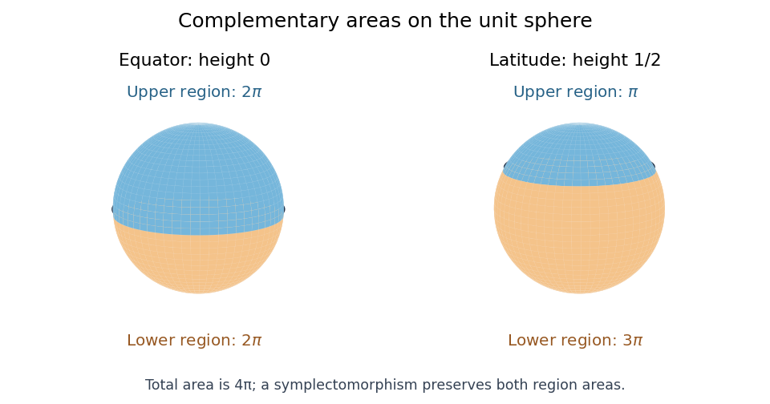

<h1 id="1/solution">Solution</h1>

↑ **Parent:** [1](../1.md)

Let $\Phi_t$ be the local [flow of a vector field](../../../../../flow-of-a-vector-field.md) $V$. The [Lie derivative of a differential form](../../../../../lie-derivative-of-a-differential-form.md) is $\mathcal L_V\eta=\left.\frac{d}{dt}\right|_{t=0}\Phi_t^*\eta$. We prove [Cartan's magic formula](../../../../../cartan-s-magic-formula.md)

$$
\mathcal L_V=d\iota_V+\iota_Vd.
$$

Both sides are degree-zero [derivations of an algebra](../../../../../derivation-of-an-algebra.md) on the [exterior algebra](../../../../../exterior-algebra.md) of [differential forms](../../../../../differential-form-split.md). They agree on a [function](../../../../../function-split.md) $f$, since $\iota_Vdf=V(f)$. They also agree on $df$: pullback commutes with the [exterior derivative](../../../../../exterior-derivative.md), so $\mathcal L_Vdf=d(Vf)$, while $(d\iota_V+\iota_Vd)df=d(Vf)$. Locally every [differential form](../../../../../differential-form-split.md) is a sum of products of [functions](../../../../../function-split.md) and coordinate differentials, proving the identity in every degree.

For a compactly supported [Hamiltonian vector field](../../../../../hamiltonian-vector-field.md) $V_H$, take the convention $\iota_{V_H}\omega=-dH$. Since $d\omega=0$, [Cartan's magic formula](../../../../../cartan-s-magic-formula.md) gives $\mathcal L_{V_H}\omega=0$, so its complete [flow of a vector field](../../../../../flow-of-a-vector-field.md) consists of [symplectomorphisms](../../../../../symplectomorphism.md). Given $p$ and $v\in T_pM$, a [bump function](../../../../../bump-function.md) lets us choose a compactly supported $H$ with $dH_p=-\iota_v\omega_p$, and hence $V_H(p)=v$. Choose such fields for a [basis](../../../../../basis.md) of $T_pM$. Their successive small-time flows give a map with invertible derivative at the origin. The [inverse function theorem](../../../../../inverse-function-theorem.md) makes the orbit of $p$ open. Every orbit is open; because $M$ is [connected](../../../../../connected-space.md), there is only one orbit. Thus **the compactly supported symplectomorphisms act transitively on points**, by [Hamiltonian transitivity on a connected symplectic manifold](../../../../../hamiltonian-transitivity-on-a-connected-symplectic-manifold.md).

On the unit [sphere](../../../../../sphere.md), the standard [symplectic area](../../../../../symplectic-area.md) is $4\pi$. The equator has complementary disks of areas $2\pi,2\pi$, whereas the latitude at height $1/2$ has complementary disks of areas $\pi,3\pi$: the cap above height $h$ has area $2\pi(1-h)$. A [symplectomorphism](../../../../../symplectomorphism.md) must preserve the unordered pair of complementary areas. Therefore **no such symplectomorphism exists**, by [complementary areas obstruct symplectic equivalence of separating curves](../../../../../complementary-areas-obstruct-symplectic-equivalence-of-separating-curves.md).

**[Figure 1](#1/image-complementary-sphere-areas-distinguish-the-equator-from-the-latitude-at-height-one-half). Complementary sphere areas distinguish the equator from the latitude at height one half**.

## ↑ Ancestors (10)

1. [1](../1.md)
2. [Paper 20](../../paper-20-split.md)
3. [Iii](../../split.md)
4. [2006](../../../split.md)
5. [Past exam of the mathematics course of the University of Cambridge](../../../../split.md)
6. [Mathematics course of the University of Cambridge](../../../../../mathematics-course-of-the-university-of-cambridge.md)
7. [Course of the University of Cambridge](../../../../../course-of-the-university-of-cambridge.md)
8. [University of Cambridge](../../../../../university-of-cambridge-split.md)
9. [List of universities](../../../../../list-of-universities.md)
10. [Codex Wiki](../../../../../split.md)
